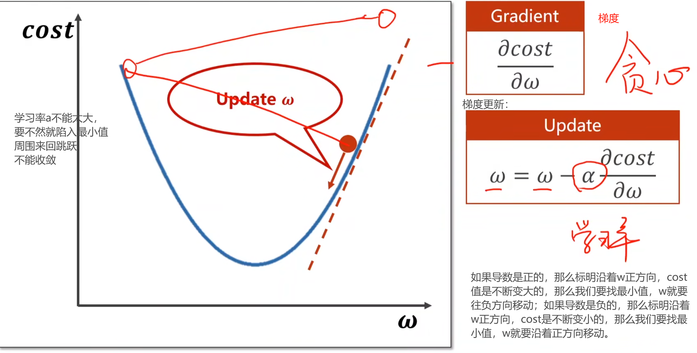
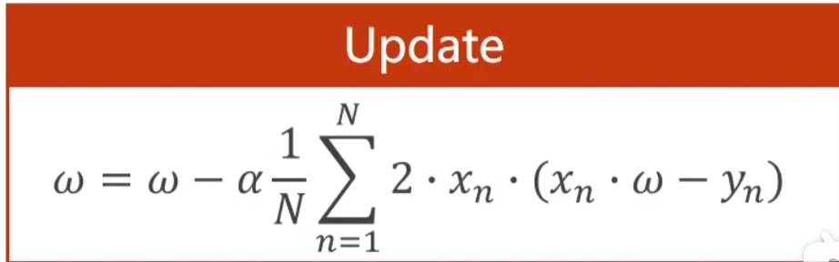
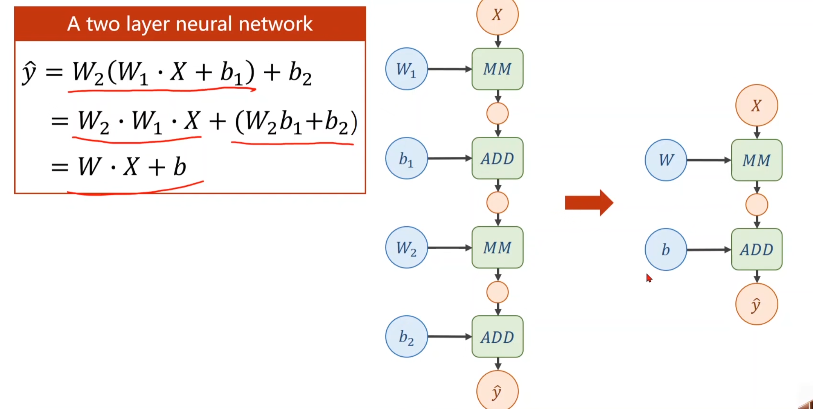
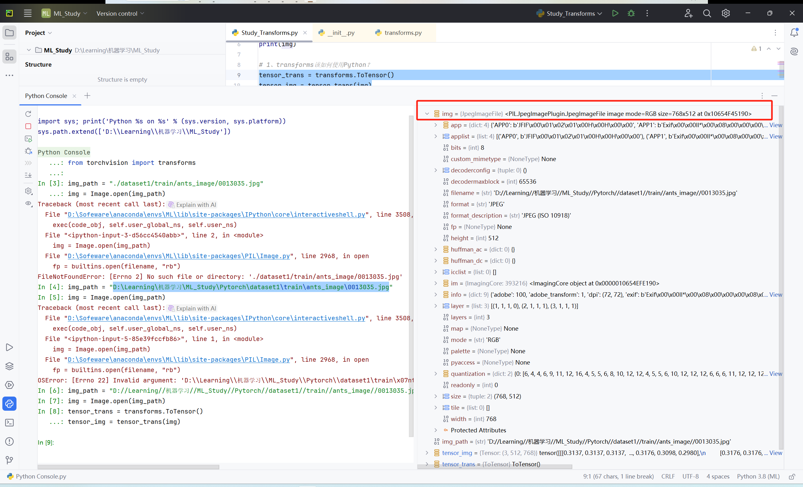

# 参考资料

* [P2. Python编辑器的选择、安装及配置（PyCharm、Jupyter安装）【PyTorch教程】_哔哩哔哩_bilibili](https://www.bilibili.com/video/BV1hE411t7RN?p=2&vd_source=677693f6b5fdb5565f3813ddff27c9bf)

* dataset与dataloader：[PyTorch 入门实战（三）——Dataset和DataLoader_pytotch dataset和dataleader-CSDN博客](https://blog.csdn.net/qq_38607066/article/details/98474121)

* 课程总体学习：[《PyTorch深度学习实践》完结合集_哔哩哔哩_bilibili](https://www.bilibili.com/video/BV1Y7411d7Ys/?spm_id_from=333.1007.top_right_bar_window_custom_collection.content.click&vd_source=677693f6b5fdb5565f3813ddff27c9bf)

# 前言

大学里打的算法比赛（ACM、蓝桥杯）的算法与机器学习中的算法的区别：

* 算法比赛中给的算法主要就是使用数学方法计算出来的，机器学习中的算法是基于数据训练出来的。

AI、机器学习、深度学习的区别：


Shallow autoencoders：浅层变换器；深层的就对应深度学习了

## 机器学习历程：

* 将数据输入到一个程序可以得到一个输出，但是如果数据庞大，程序运行变慢
  

* 手工提取数据中给的特征，根据特征映射得到输出结果，这是经典机器学习能解决的问题
  

* 对于数据可以用很多的维度来表示，在概率论当中，根据大数定律可以发现，只有当数据足够大了才能反应数据中的规律。
  对于只有一个特征的数据，只需要一个维度就可以表示，（假如说达到10个就满足大数定律）；
  对于两个特征的数据，需要10^2^个数据才能达到大数定律
  对于三个特征的数据，需要10^3^个数据才能达到大数定律
  ……
  对于N个特征的数据，需要10^N^个数据才能达到大数定律
  因此**如果数据的维度过大，需要达到大数定律的数据量就呈现级数级别的增涨，数据的质量决定模型的质量！**
  因此对于如何提取某些特征可以代表全部特征，这样一个步骤就是提取有用的特征。
  ---->对于这样的特征提取就可以使用线性代数的方式解决。
  首先一条数据有N个特征，那么就可以表示成一个N×1的向量，我们需要将其提取为3个特征的数据，左乘一个3×N的矩阵就可以将其“压缩”为一个3×1的向量：
  

  **这样的一个特征提取，高维到低维，叫做Present，表示学习**

  将提取后的特征进行映射得到输出
  
  提取特征是无监督学习，学习器是监督学习

* 深度学习：
  

  学习器里面一般都是多层的神经网络可以胜任这个任务。
  **深度学习中Simple features 和 Additional layers of more abstract features 和Mapping from features是统一放在一块进行训练的**


# 线性模型

机器学习步骤：

* 选取数据集
* 选取模型
* 进行训练
* 进行推理

数据集可以划分成训练集与测试集。

为了测验模型的泛化能力，可以将训练集划分出来一部分作为开发集用于模型的评估。如果开发集效果比较好的话，再将整个训练集扔给模型进行训练。**这个开发集也就是验证集。**

## 损失函数

设计一个评估模型来评估自己的模型的好坏，这个评估模型就是**损失函数**。

怎么计算呢？

对于一条数据，扔给设计的模型里面得到一个预测值，计算该预测值与数据真实的值的误差。（有时候这个误差可能是负数，为了观察方便，将误差都变成非负）$\hat{y}$为预测值，$y$为真实值。
$$
\operatorname{loss}=(\hat{y}-y)^{2}
$$
但是数据又不止一个，我们需要计算所有数据的一个损失情况，这就有了MSE（平均平方误差）：


根据损失函数修改模型中的权重，使得修改后的模型的损失函数更小。这就是我们训练的目的。

比如说在线性模型里：
$$
\hat{y}=x*\omega +b
$$
这里我们可以简化（把截距去掉）：
$$
\hat{y}=x*\omega
$$
在这个线性模型里，每一条数据的loss就为：
$$
\operatorname{loss}=(\hat{y}-y)^{2}=(x*\omega -y)^2
$$
每一次我们可以根据损失函数的值不断修改权重$\omega$的值。

## 该怎么更新$\omega$使得损失函数变小呢？

* 穷举所有可能的$\omega$值，绘制图像看$\omega$取哪一个值的时候loss最小：
  

```python
#!/usr/bin/env python
# -*- coding: UTF-8 -*-
'''
@File    ：Draw_Loss_Graph.py
@IDE     ：PyCharm 
@Author  ：李明璐
@Date    ：2024/9/10 18:00 
'''
import numpy as np
import matplotlib.pyplot as plt

x_data = [1.0, 2.0, 3.0]
y_data = [2.0, 4.0, 6.0]

def forward(x):
    return x * w

def loss(x, y):
    y_preditct = forward(x)
    return (y_preditct - y) * (y_preditct - y)

w_list = []
mse_list = []

for w in np.arange(0.0, 4.1, 0.1): # 权重w从0到4.0，步长为0.1
    print("w = ", w)
    l_sum = 0 # 计算该权重下的损失值和
    for x_val, y_val in zip(x_data, y_data):
        y_predict_val = forward(x_val)
        loss_val = loss(x_val, y_val)
        l_sum += loss_val
        print('\t', x_val, y_val, y_predict_val, loss_val)

    print("MSE = ", l_sum / 3)
    w_list.append(w)
    mse_list.append(l_sum / 3)

# 绘图
plt.plot(w_list, mse_list)
plt.ylabel('Loss')
plt.xlabel('w')
plt.show()
```

```python
w =  0.0
	 1.0 2.0 0.0 4.0
	 2.0 4.0 0.0 16.0
	 3.0 6.0 0.0 36.0
MSE =  18.666666666666668
w =  0.1
	 1.0 2.0 0.1 3.61
	 2.0 4.0 0.2 14.44
	 3.0 6.0 0.30000000000000004 32.49
MSE =  16.846666666666668
w =  0.2
	 1.0 2.0 0.2 3.24
	 2.0 4.0 0.4 12.96
	 3.0 6.0 0.6000000000000001 29.160000000000004
MSE =  15.120000000000003
w =  0.30000000000000004
	 1.0 2.0 0.30000000000000004 2.8899999999999997
	 2.0 4.0 0.6000000000000001 11.559999999999999
	 3.0 6.0 0.9000000000000001 26.009999999999998
MSE =  13.486666666666665
w =  0.4
	 1.0 2.0 0.4 2.5600000000000005
	 2.0 4.0 0.8 10.240000000000002
	 3.0 6.0 1.2000000000000002 23.04
MSE =  11.946666666666667
w =  0.5
	 1.0 2.0 0.5 2.25
	 2.0 4.0 1.0 9.0
	 3.0 6.0 1.5 20.25
MSE =  10.5
w =  0.6000000000000001
	 1.0 2.0 0.6000000000000001 1.9599999999999997
	 2.0 4.0 1.2000000000000002 7.839999999999999
	 3.0 6.0 1.8000000000000003 17.639999999999993
MSE =  9.146666666666663
w =  0.7000000000000001
	 1.0 2.0 0.7000000000000001 1.6899999999999995
	 2.0 4.0 1.4000000000000001 6.759999999999998
	 3.0 6.0 2.1 15.209999999999999
MSE =  7.886666666666666
w =  0.8
	 1.0 2.0 0.8 1.44
	 2.0 4.0 1.6 5.76
	 3.0 6.0 2.4000000000000004 12.959999999999997
MSE =  6.719999999999999
w =  0.9
	 1.0 2.0 0.9 1.2100000000000002
	 2.0 4.0 1.8 4.840000000000001
	 3.0 6.0 2.7 10.889999999999999
MSE =  5.646666666666666
w =  1.0
	 1.0 2.0 1.0 1.0
	 2.0 4.0 2.0 4.0
	 3.0 6.0 3.0 9.0
MSE =  4.666666666666667
w =  1.1
	 1.0 2.0 1.1 0.8099999999999998
	 2.0 4.0 2.2 3.2399999999999993
	 3.0 6.0 3.3000000000000003 7.289999999999998
MSE =  3.779999999999999
w =  1.2000000000000002
	 1.0 2.0 1.2000000000000002 0.6399999999999997
	 2.0 4.0 2.4000000000000004 2.5599999999999987
	 3.0 6.0 3.6000000000000005 5.759999999999997
MSE =  2.986666666666665
w =  1.3
	 1.0 2.0 1.3 0.48999999999999994
	 2.0 4.0 2.6 1.9599999999999997
	 3.0 6.0 3.9000000000000004 4.409999999999998
MSE =  2.2866666666666657
w =  1.4000000000000001
	 1.0 2.0 1.4000000000000001 0.3599999999999998
	 2.0 4.0 2.8000000000000003 1.4399999999999993
	 3.0 6.0 4.2 3.2399999999999993
MSE =  1.6799999999999995
w =  1.5
	 1.0 2.0 1.5 0.25
	 2.0 4.0 3.0 1.0
	 3.0 6.0 4.5 2.25
MSE =  1.1666666666666667
w =  1.6
	 1.0 2.0 1.6 0.15999999999999992
	 2.0 4.0 3.2 0.6399999999999997
	 3.0 6.0 4.800000000000001 1.4399999999999984
MSE =  0.746666666666666
w =  1.7000000000000002
	 1.0 2.0 1.7000000000000002 0.0899999999999999
	 2.0 4.0 3.4000000000000004 0.3599999999999996
	 3.0 6.0 5.1000000000000005 0.809999999999999
MSE =  0.4199999999999995
w =  1.8
	 1.0 2.0 1.8 0.03999999999999998
	 2.0 4.0 3.6 0.15999999999999992
	 3.0 6.0 5.4 0.3599999999999996
MSE =  0.1866666666666665
w =  1.9000000000000001
	 1.0 2.0 1.9000000000000001 0.009999999999999974
	 2.0 4.0 3.8000000000000003 0.0399999999999999
	 3.0 6.0 5.7 0.0899999999999999
MSE =  0.046666666666666586
w =  2.0
	 1.0 2.0 2.0 0.0
	 2.0 4.0 4.0 0.0
	 3.0 6.0 6.0 0.0
MSE =  0.0
w =  2.1
	 1.0 2.0 2.1 0.010000000000000018
	 2.0 4.0 4.2 0.04000000000000007
	 3.0 6.0 6.300000000000001 0.09000000000000043
MSE =  0.046666666666666835
w =  2.2
	 1.0 2.0 2.2 0.04000000000000007
	 2.0 4.0 4.4 0.16000000000000028
	 3.0 6.0 6.6000000000000005 0.36000000000000065
MSE =  0.18666666666666698
w =  2.3000000000000003
	 1.0 2.0 2.3000000000000003 0.09000000000000016
	 2.0 4.0 4.6000000000000005 0.36000000000000065
	 3.0 6.0 6.9 0.8100000000000006
MSE =  0.42000000000000054
w =  2.4000000000000004
	 1.0 2.0 2.4000000000000004 0.16000000000000028
	 2.0 4.0 4.800000000000001 0.6400000000000011
	 3.0 6.0 7.200000000000001 1.4400000000000026
MSE =  0.7466666666666679
w =  2.5
	 1.0 2.0 2.5 0.25
	 2.0 4.0 5.0 1.0
	 3.0 6.0 7.5 2.25
MSE =  1.1666666666666667
w =  2.6
	 1.0 2.0 2.6 0.3600000000000001
	 2.0 4.0 5.2 1.4400000000000004
	 3.0 6.0 7.800000000000001 3.2400000000000024
MSE =  1.6800000000000008
w =  2.7
	 1.0 2.0 2.7 0.49000000000000027
	 2.0 4.0 5.4 1.960000000000001
	 3.0 6.0 8.100000000000001 4.410000000000006
MSE =  2.2866666666666693
w =  2.8000000000000003
	 1.0 2.0 2.8000000000000003 0.6400000000000005
	 2.0 4.0 5.6000000000000005 2.560000000000002
	 3.0 6.0 8.4 5.760000000000002
MSE =  2.986666666666668
w =  2.9000000000000004
	 1.0 2.0 2.9000000000000004 0.8100000000000006
	 2.0 4.0 5.800000000000001 3.2400000000000024
	 3.0 6.0 8.700000000000001 7.290000000000005
MSE =  3.780000000000003
w =  3.0
	 1.0 2.0 3.0 1.0
	 2.0 4.0 6.0 4.0
	 3.0 6.0 9.0 9.0
MSE =  4.666666666666667
w =  3.1
	 1.0 2.0 3.1 1.2100000000000002
	 2.0 4.0 6.2 4.840000000000001
	 3.0 6.0 9.3 10.890000000000004
MSE =  5.646666666666668
w =  3.2
	 1.0 2.0 3.2 1.4400000000000004
	 2.0 4.0 6.4 5.760000000000002
	 3.0 6.0 9.600000000000001 12.96000000000001
MSE =  6.720000000000003
w =  3.3000000000000003
	 1.0 2.0 3.3000000000000003 1.6900000000000006
	 2.0 4.0 6.6000000000000005 6.7600000000000025
	 3.0 6.0 9.9 15.210000000000003
MSE =  7.886666666666668
w =  3.4000000000000004
	 1.0 2.0 3.4000000000000004 1.960000000000001
	 2.0 4.0 6.800000000000001 7.840000000000004
	 3.0 6.0 10.200000000000001 17.640000000000008
MSE =  9.14666666666667
w =  3.5
	 1.0 2.0 3.5 2.25
	 2.0 4.0 7.0 9.0
	 3.0 6.0 10.5 20.25
MSE =  10.5
w =  3.6
	 1.0 2.0 3.6 2.5600000000000005
	 2.0 4.0 7.2 10.240000000000002
	 3.0 6.0 10.8 23.040000000000006
MSE =  11.94666666666667
w =  3.7
	 1.0 2.0 3.7 2.8900000000000006
	 2.0 4.0 7.4 11.560000000000002
	 3.0 6.0 11.100000000000001 26.010000000000016
MSE =  13.486666666666673
w =  3.8000000000000003
	 1.0 2.0 3.8000000000000003 3.240000000000001
	 2.0 4.0 7.6000000000000005 12.960000000000004
	 3.0 6.0 11.4 29.160000000000004
MSE =  15.120000000000005
w =  3.9000000000000004
	 1.0 2.0 3.9000000000000004 3.610000000000001
	 2.0 4.0 7.800000000000001 14.440000000000005
	 3.0 6.0 11.700000000000001 32.49000000000001
MSE =  16.84666666666667
w =  4.0
	 1.0 2.0 4.0 4.0
	 2.0 4.0 8.0 16.0
	 3.0 6.0 12.0 36.0
MSE =  18.666666666666668
```

运行图：


**以后我们进行深度学习的时候，x轴的这个$\omega$一般为epoch，训练次数。**

==**训练过拟合，说明模型泛化能力不好，表现为开发（验证）集的数据在真实收敛域附近的loss增大**==（2024年9月10日，不太理解这句话）

## 绘制3D图

如果模型是这样的呢：
$$
\hat{y}=x*\omega +b
$$
我们就需要绘制3D图。

参考这个文档：

https://matplotlib.org/stable/users/explain/toolkits/mplot3d.html

# 梯度下降算法

## 为啥要引入梯度下降

咱们上面看到了利用穷举法遍历所有的$\omega$（假设有100个）来找到最小的Loss值，这样确定最优模型中参数$\omega$的值。如果模型中有两个参数${\omega}_1$和${\omega}_2$，那么就需要${100}^2$个数据，如果有10个参数呢？就需要${100}^{10}$个数据需要遍历，计算机呈指数级增加。

加入还是两个参数，我们需要遍历的参数可以分成一块一块的（**分治思想**）：


首先先遍历这每一块中的一个数据，发现其中一个数据比较小，那么可以继续遍历这个较小的数据所在的一块，直到找到最小的loss值对应的参数对。如果有多个可能的最小值，那就把其他的数据区域也遍历一遍，通过比对找到最小的。

**就目前分析而言，咱们已经将找最小LOSS值对应的参数对这个计算过程从$\O{(n)}^2$**到$\O(n)$的级别。貌似已经很成功了，但是这里还有一个问题，如果我们选择的点是这个图像中的红色的点，我们会发现采用分治法可能会陷入一个局部最优值的问题。


所以我们需要继续修改算法，由此引入了梯度下降算法。

## 梯度下降核心

在这样一个一维函数里：



但是仔细想，采用梯度下降的算法，也会容易陷入局部最优解。


为什么梯度下降也是只能找到局部最优，为啥还是使用这种方法呢？

**在神经网络里存在很少的局部最优点**，==我也不是很明白，反正使用这个方法就对了==

但是会遇到一个一个问题，即神经网络里会存在==**鞍点**==，鞍点的梯度为0。


在高维的空间当中会出现这种情况：（2024年9月13日，我也不是很理解，）在某个一个切面找到的事最小值，换成另外一个切面就变成了一个最大值。


针对前一章提到的线性模型，梯度更新是怎么样的一个过程呢？


然后梯度更新函数就变成了这样：



使用代码实现：

```python
import numpy as np
import matplotlib.pyplot as plt

x_data = [1.0, 2.0, 3.0]
y_data = [2.0, 4.0, 6.0]

w = 1.0

def forward(x):
    return x * w

def cost(xs, ys):
    cost = 0
    for x, y in zip(xs, ys):
        y_pred = forward(x)
        cost += (y_pred - y) ** 2
    return cost / len(xs)

def gradient(xs, ys):
    grad = 0
    for x, y in zip(xs, ys):
        grad += 2 * x * (x * w - y)
    return grad / len(xs)

cost_list = []

print('Predict (before training):', 4, forward(4))
for epoch in range(100):
    cost_val = cost(x_data, y_data)
    cost_list.append(cost_val)
    grad_val = gradient(x_data, y_data)
    w -= 0.01 * grad_val
    print('Epoch:', epoch, 'w = ', w, 'loss = ', cost_val)
print('Predict (after training):', 4, forward(4))

plt.plot(range(100), cost_list)
plt.ylabel('Loss')
plt.xlabel('Epoch')
plt.show()
```

运行的结果：

```python
Predict (before training): 4 4.0
Epoch: 0 w =  1.0933333333333333 loss =  4.666666666666667
Epoch: 1 w =  1.1779555555555554 loss =  3.8362074074074086
Epoch: 2 w =  1.2546797037037036 loss =  3.1535329869958857
Epoch: 3 w =  1.3242429313580246 loss =  2.592344272332262
Epoch: 4 w =  1.3873135910979424 loss =  2.1310222071581117
Epoch: 5 w =  1.4444976559288012 loss =  1.7517949663820642
Epoch: 6 w =  1.4963445413754464 loss =  1.440053319920117
Epoch: 7 w =  1.5433523841804047 loss =  1.1837878313441108
Epoch: 8 w =  1.5859728283235668 loss =  0.9731262101573632
Epoch: 9 w =  1.6246153643467005 loss =  0.7999529948031382
Epoch: 10 w =  1.659651263674342 loss =  0.6575969151946154
Epoch: 11 w =  1.6914171457314033 loss =  0.5405738908195378
Epoch: 12 w =  1.7202182121298057 loss =  0.44437576375991855
Epoch: 13 w =  1.7463311789976905 loss =  0.365296627844598
Epoch: 14 w =  1.7700069356245727 loss =  0.3002900634939416
Epoch: 15 w =  1.7914729549662791 loss =  0.2468517784170642
Epoch: 16 w =  1.8109354791694263 loss =  0.2029231330489788
Epoch: 17 w =  1.8285815011136133 loss =  0.16681183417217407
Epoch: 18 w =  1.8445805610096762 loss =  0.1371267415488235
Epoch: 19 w =  1.8590863753154396 loss =  0.11272427607497944
Epoch: 20 w =  1.872238313619332 loss =  0.09266436490145864
Epoch: 21 w =  1.8841627376815275 loss =  0.07617422636521683
Epoch: 22 w =  1.8949742154979183 loss =  0.06261859959338009
Epoch: 23 w =  1.904776622051446 loss =  0.051475271914629306
Epoch: 24 w =  1.9136641373266443 loss =  0.04231496130368814
Epoch: 25 w =  1.9217221511761575 loss =  0.03478477885657844
Epoch: 26 w =  1.9290280837330496 loss =  0.02859463421027894
Epoch: 27 w =  1.9356521292512983 loss =  0.023506060193480772
Epoch: 28 w =  1.9416579305211772 loss =  0.01932302619282764
Epoch: 29 w =  1.9471031903392007 loss =  0.015884386331668398
Epoch: 30 w =  1.952040225907542 loss =  0.01305767153735723
Epoch: 31 w =  1.9565164714895047 loss =  0.010733986344664803
Epoch: 32 w =  1.9605749341504843 loss =  0.008823813841374291
Epoch: 33 w =  1.9642546069631057 loss =  0.007253567147113681
Epoch: 34 w =  1.9675908436465492 loss =  0.005962754575689583
Epoch: 35 w =  1.970615698239538 loss =  0.004901649272531298
Epoch: 36 w =  1.9733582330705144 loss =  0.004029373553099482
Epoch: 37 w =  1.975844797983933 loss =  0.0033123241439168096
Epoch: 38 w =  1.9780992835054327 loss =  0.0027228776607060357
Epoch: 39 w =  1.980143350378259 loss =  0.002238326453885249
Epoch: 40 w =  1.9819966376762883 loss =  0.001840003826269386
Epoch: 41 w =  1.983676951493168 loss =  0.0015125649231412608
Epoch: 42 w =  1.9852004360204722 loss =  0.0012433955919298103
Epoch: 43 w =  1.9865817286585614 loss =  0.0010221264385926248
Epoch: 44 w =  1.987834100650429 loss =  0.0008402333603648631
Epoch: 45 w =  1.9889695845897222 loss =  0.0006907091659248264
Epoch: 46 w =  1.9899990900280147 loss =  0.0005677936325753796
Epoch: 47 w =  1.9909325082920666 loss =  0.0004667516012495216
Epoch: 48 w =  1.9917788075181404 loss =  0.000383690560742734
Epoch: 49 w =  1.9925461188164473 loss =  0.00031541069384432885
Epoch: 50 w =  1.9932418143935788 loss =  0.0002592816085930997
Epoch: 51 w =  1.9938725783835114 loss =  0.0002131410058905752
Epoch: 52 w =  1.994444471067717 loss =  0.00017521137977565514
Epoch: 53 w =  1.9949629871013967 loss =  0.0001440315413480261
Epoch: 54 w =  1.9954331083052663 loss =  0.0001184003283899171
Epoch: 55 w =  1.9958593515301082 loss =  9.733033217332803e-05
Epoch: 56 w =  1.9962458120539648 loss =  8.000985883901657e-05
Epoch: 57 w =  1.9965962029289281 loss =  6.57716599593935e-05
Epoch: 58 w =  1.9969138906555615 loss =  5.406722767150764e-05
Epoch: 59 w =  1.997201927527709 loss =  4.444566413387458e-05
Epoch: 60 w =  1.9974630809584561 loss =  3.65363112808981e-05
Epoch: 61 w =  1.9976998600690001 loss =  3.0034471708953996e-05
Epoch: 62 w =  1.9979145397958935 loss =  2.4689670610172655e-05
Epoch: 63 w =  1.9981091827482769 loss =  2.0296006560253656e-05
Epoch: 64 w =  1.9982856590251044 loss =  1.6684219437262796e-05
Epoch: 65 w =  1.9984456641827613 loss =  1.3715169898293847e-05
Epoch: 66 w =  1.9985907355257035 loss =  1.1274479219506377e-05
Epoch: 67 w =  1.9987222668766378 loss =  9.268123006398985e-06
Epoch: 68 w =  1.9988415219681517 loss =  7.61880902783969e-06
Epoch: 69 w =  1.9989496465844576 loss =  6.262999634617916e-06
Epoch: 70 w =  1.9990476795699081 loss =  5.1484640551938914e-06
Epoch: 71 w =  1.9991365628100501 loss =  4.232266273994499e-06
Epoch: 72 w =  1.999217150281112 loss =  3.479110977946351e-06
Epoch: 73 w =  1.999290216254875 loss =  2.859983851026929e-06
Epoch: 74 w =  1.9993564627377531 loss =  2.3510338359374262e-06
Epoch: 75 w =  1.9994165262155628 loss =  1.932654303533636e-06
Epoch: 76 w =  1.999470983768777 loss =  1.5887277332523938e-06
Epoch: 77 w =  1.9995203586170245 loss =  1.3060048068548734e-06
Epoch: 78 w =  1.9995651251461022 loss =  1.0735939958924364e-06
Epoch: 79 w =  1.9996057134657994 loss =  8.825419799121559e-07
Epoch: 80 w =  1.9996425135423248 loss =  7.254887315754342e-07
Epoch: 81 w =  1.999675878945041 loss =  5.963839812987369e-07
Epoch: 82 w =  1.999706130243504 loss =  4.902541385825727e-07
Epoch: 83 w =  1.9997335580874436 loss =  4.0301069098738336e-07
Epoch: 84 w =  1.9997584259992822 loss =  3.312926995781724e-07
Epoch: 85 w =  1.9997809729060159 loss =  2.723373231729343e-07
Epoch: 86 w =  1.9998014154347876 loss =  2.2387338352920307e-07
Epoch: 87 w =  1.9998199499942075 loss =  1.8403387118941732e-07
Epoch: 88 w =  1.9998367546614149 loss =  1.5128402140063082e-07
Epoch: 89 w =  1.9998519908930161 loss =  1.2436218932547864e-07
Epoch: 90 w =  1.9998658050763347 loss =  1.0223124683409346e-07
Epoch: 91 w =  1.9998783299358769 loss =  8.403862850836479e-08
Epoch: 92 w =  1.9998896858085284 loss =  6.908348768398496e-08
Epoch: 93 w =  1.9998999817997325 loss =  5.678969725349543e-08
Epoch: 94 w =  1.9999093168317574 loss =  4.66836551287917e-08
Epoch: 95 w =  1.9999177805941268 loss =  3.8376039345125727e-08
Epoch: 96 w =  1.9999254544053418 loss =  3.154680994333735e-08
Epoch: 97 w =  1.9999324119941766 loss =  2.593287985380858e-08
Epoch: 98 w =  1.9999387202080534 loss =  2.131797981222471e-08
Epoch: 99 w =  1.9999444396553017 loss =  1.752432687141379e-08
Predict (after training): 4 7.999777758621207
```

绘制的图像：


通常情况下，我们进行绘图可能会出现这种情况：


我们在绘图的时候对图像进行加权均值的操作，过程如下：


这里的$\beta$值可以自己设置。

如果在训练过程中出现了这样的情况：


那么就是**发散了**，可能的原因是学习率设置的太大。

## 随机梯度下降

解决鞍点的一个方法：随机梯度下降。

书接上文，在鞍点的时候，梯度为0，此时参数不再进行更新，参数也就无法更新到最小值部分。我们重新回看参数更新的公式：
$$
\omega=\omega-\alpha \frac{\partial \cos t}{\partial \omega}
$$

$$
\frac{\partial \cos t}{\partial \omega}=\frac{1}{N} \sum_{n=1}^{N} 2 \cdot x_{n} \cdot\left(x_{n} \cdot \omega-y_{n}\right)
$$

这里$\frac{\partial \cos t}{\partial \omega}$求的是所有数据的平均值，**随机梯度下降**就是从这$N$个数据里取一个数据的Loss值对$\omega$进行求导，得到的导数值可能是一个非0的数，这样就相当于给原有的梯度为0的那一段数据引入了一个噪声数据，这样有可能使得梯度继续进行下降。

**随机梯度下降在神经网络里面被证明是十分有效的。用就完了，反正也搞不懂。**

如果上面的概念还有点不清楚，看代码是怎么解释的：

```python
#!/usr/bin/env python
# -*- coding: UTF-8 -*-
'''
@File      ：GradientDescent2.py
@IDE       ：PyCharm 
@Author    ：lml
@Date      ：2024/9/13 20:16 
@Descriable：随机梯度下降
'''
import numpy as np
import matplotlib.pyplot as plt

x_data = [1.0, 2.0, 3.0]
y_data = [2.0, 4.0, 6.0]

w = 1.0

def forward(x):
    return x * w
# 注意这里的loss只对一个样本数据求解该样本的loss值
def loss(x, y):
    y_pred = forward(x)
    return (y_pred - y) ** 2

# 注意这里的gradient是只对一个样本数据对w的导数值
def gradient(x, y):
    return 2 * x * (x * w - y)

print('Predict (before training):', 4, forward(4))

cost_list = []
for epoch in range(100):
    l = 0
    # 注意这里的随机梯度下降是对一个个数据样本进行loss和对参数w进行求导，最后得到的w值是一次次迭代过来的。
    for x, y in zip(x_data, y_data):
        grad = gradient(x, y)
        w -= 0.01 * grad
        print('\tgrad: ', x, y, grad)
        l = loss(x, y)
    cost_list.append(l)
    print('Epoch:', epoch, 'w = ', w, 'loss = ', l)

print('Predict (after training):', 4, forward(4))

plt.plot(range(100), cost_list)
plt.ylabel('Loss')
plt.xlabel('Epoch')
plt.show()
```

运行结果为：

```python
Predict (before training): 4 4.0
	grad:  1.0 2.0 -2.0
	grad:  2.0 4.0 -7.84
	grad:  3.0 6.0 -16.2288
Epoch: 0 w =  1.260688 loss =  4.919240100095999
	grad:  1.0 2.0 -1.478624
	grad:  2.0 4.0 -5.796206079999999
	grad:  3.0 6.0 -11.998146585599997
Epoch: 1 w =  1.453417766656 loss =  2.688769240265834
	grad:  1.0 2.0 -1.093164466688
	grad:  2.0 4.0 -4.285204709416961
	grad:  3.0 6.0 -8.87037374849311
Epoch: 2 w =  1.5959051959019805 loss =  1.4696334962911515
	grad:  1.0 2.0 -0.8081896081960389
	grad:  2.0 4.0 -3.1681032641284723
	grad:  3.0 6.0 -6.557973756745939
Epoch: 3 w =  1.701247862192685 loss =  0.8032755585999681
	grad:  1.0 2.0 -0.59750427561463
	grad:  2.0 4.0 -2.3422167604093502
	grad:  3.0 6.0 -4.848388694047353
Epoch: 4 w =  1.7791289594933983 loss =  0.43905614881022015
	grad:  1.0 2.0 -0.44174208101320334
	grad:  2.0 4.0 -1.7316289575717576
	grad:  3.0 6.0 -3.584471942173538
Epoch: 5 w =  1.836707389300983 loss =  0.2399802903801062
	grad:  1.0 2.0 -0.3265852213980338
	grad:  2.0 4.0 -1.2802140678802925
	grad:  3.0 6.0 -2.650043120512205
Epoch: 6 w =  1.8792758133988885 loss =  0.1311689630744999
	grad:  1.0 2.0 -0.241448373202223
	grad:  2.0 4.0 -0.946477622952715
	grad:  3.0 6.0 -1.9592086795121197
Epoch: 7 w =  1.910747160155559 loss =  0.07169462478267678
	grad:  1.0 2.0 -0.17850567968888198
	grad:  2.0 4.0 -0.6997422643804168
	grad:  3.0 6.0 -1.4484664872674653
Epoch: 8 w =  1.9340143044689266 loss =  0.03918700813247573
	grad:  1.0 2.0 -0.13197139106214673
	grad:  2.0 4.0 -0.5173278529636143
	grad:  3.0 6.0 -1.0708686556346834
Epoch: 9 w =  1.9512159834655312 loss =  0.021418922423117836
	grad:  1.0 2.0 -0.09756803306893769
	grad:  2.0 4.0 -0.38246668963023644
	grad:  3.0 6.0 -0.7917060475345892
Epoch: 10 w =  1.9639333911678687 loss =  0.01170720245384975
	grad:  1.0 2.0 -0.07213321766426262
	grad:  2.0 4.0 -0.2827622132439096
	grad:  3.0 6.0 -0.5853177814148953
Epoch: 11 w =  1.9733355232910992 loss =  0.006398948863435593
	grad:  1.0 2.0 -0.05332895341780164
	grad:  2.0 4.0 -0.2090494973977819
	grad:  3.0 6.0 -0.4327324596134101
Epoch: 12 w =  1.9802866323953892 loss =  0.003497551760830656
	grad:  1.0 2.0 -0.039426735209221686
	grad:  2.0 4.0 -0.15455280202014876
	grad:  3.0 6.0 -0.3199243001817109
Epoch: 13 w =  1.9854256707695 loss =  0.001911699652671057
	grad:  1.0 2.0 -0.02914865846100012
	grad:  2.0 4.0 -0.11426274116712065
	grad:  3.0 6.0 -0.2365238742159388
Epoch: 14 w =  1.9892250235079405 loss =  0.0010449010656399273
	grad:  1.0 2.0 -0.021549952984118992
	grad:  2.0 4.0 -0.08447581569774698
	grad:  3.0 6.0 -0.17486493849433593
Epoch: 15 w =  1.9920339305797026 loss =  0.0005711243580809696
	grad:  1.0 2.0 -0.015932138840594856
	grad:  2.0 4.0 -0.062453984255132156
	grad:  3.0 6.0 -0.12927974740812687
Epoch: 16 w =  1.994110589284741 loss =  0.0003121664271570621
	grad:  1.0 2.0 -0.011778821430517894
	grad:  2.0 4.0 -0.046172980007630926
	grad:  3.0 6.0 -0.09557806861579543
Epoch: 17 w =  1.9956458879852805 loss =  0.0001706246229305199
	grad:  1.0 2.0 -0.008708224029438938
	grad:  2.0 4.0 -0.03413623819540135
	grad:  3.0 6.0 -0.07066201306448505
Epoch: 18 w =  1.9967809527381737 loss =  9.326038746484765e-05
	grad:  1.0 2.0 -0.006438094523652627
	grad:  2.0 4.0 -0.02523733053271826
	grad:  3.0 6.0 -0.052241274202728505
Epoch: 19 w =  1.9976201197307648 loss =  5.097447086306101e-05
	grad:  1.0 2.0 -0.004759760538470381
	grad:  2.0 4.0 -0.01865826131080439
	grad:  3.0 6.0 -0.03862260091336722
Epoch: 20 w =  1.998240525958391 loss =  2.7861740127856012e-05
	grad:  1.0 2.0 -0.0035189480832178432
	grad:  2.0 4.0 -0.01379427648621423
	grad:  3.0 6.0 -0.028554152326460525
Epoch: 21 w =  1.99869919972735 loss =  1.5228732143933469e-05
	grad:  1.0 2.0 -0.002601600545300009
	grad:  2.0 4.0 -0.01019827413757568
	grad:  3.0 6.0 -0.021110427464781978
Epoch: 22 w =  1.9990383027488265 loss =  8.323754426231206e-06
	grad:  1.0 2.0 -0.001923394502346909
	grad:  2.0 4.0 -0.007539706449199102
	grad:  3.0 6.0 -0.01560719234984198
Epoch: 23 w =  1.9992890056818404 loss =  4.549616284094891e-06
	grad:  1.0 2.0 -0.0014219886363191492
	grad:  2.0 4.0 -0.005574195454370212
	grad:  3.0 6.0 -0.011538584590544687
Epoch: 24 w =  1.999474353368653 loss =  2.486739429417538e-06
	grad:  1.0 2.0 -0.0010512932626940419
	grad:  2.0 4.0 -0.004121069589761106
	grad:  3.0 6.0 -0.008530614050808794
Epoch: 25 w =  1.9996113831376856 loss =  1.3592075910762856e-06
	grad:  1.0 2.0 -0.0007772337246287897
	grad:  2.0 4.0 -0.0030467562005451754
	grad:  3.0 6.0 -0.006306785335127074
Epoch: 26 w =  1.9997126908902887 loss =  7.429187207079447e-07
	grad:  1.0 2.0 -0.0005746182194226179
	grad:  2.0 4.0 -0.002252503420136165
	grad:  3.0 6.0 -0.00466268207967957
Epoch: 27 w =  1.9997875889274812 loss =  4.060661735575354e-07
	grad:  1.0 2.0 -0.0004248221450375844
	grad:  2.0 4.0 -0.0016653028085471533
	grad:  3.0 6.0 -0.0034471768136938863
Epoch: 28 w =  1.9998429619451539 loss =  2.2194855602869353e-07
	grad:  1.0 2.0 -0.00031407610969225175
	grad:  2.0 4.0 -0.0012311783499932005
	grad:  3.0 6.0 -0.0025485391844828342
Epoch: 29 w =  1.9998838998815958 loss =  1.213131374411496e-07
	grad:  1.0 2.0 -0.00023220023680847746
	grad:  2.0 4.0 -0.0009102249282886277
	grad:  3.0 6.0 -0.0018841656015560204
Epoch: 30 w =  1.9999141657892625 loss =  6.630760559646474e-08
	grad:  1.0 2.0 -0.00017166842147497974
	grad:  2.0 4.0 -0.0006729402121816719
	grad:  3.0 6.0 -0.0013929862392156878
Epoch: 31 w =  1.9999365417379913 loss =  3.624255915449335e-08
	grad:  1.0 2.0 -0.0001269165240174175
	grad:  2.0 4.0 -0.0004975127741477792
	grad:  3.0 6.0 -0.0010298514424817995
Epoch: 32 w =  1.9999530845453979 loss =  1.9809538924707548e-08
	grad:  1.0 2.0 -9.383090920422887e-05
	grad:  2.0 4.0 -0.00036781716408107457
	grad:  3.0 6.0 -0.0007613815296476645
Epoch: 33 w =  1.9999653148414271 loss =  1.0827542027017377e-08
	grad:  1.0 2.0 -6.937031714571162e-05
	grad:  2.0 4.0 -0.0002719316432120422
	grad:  3.0 6.0 -0.0005628985014531906
Epoch: 34 w =  1.999974356846045 loss =  5.9181421028034105e-09
	grad:  1.0 2.0 -5.1286307909848006e-05
	grad:  2.0 4.0 -0.00020104232700646207
	grad:  3.0 6.0 -0.0004161576169003922
Epoch: 35 w =  1.9999810417085633 loss =  3.2347513278475087e-09
	grad:  1.0 2.0 -3.7916582873442906e-05
	grad:  2.0 4.0 -0.0001486330048638962
	grad:  3.0 6.0 -0.0003076703200690645
Epoch: 36 w =  1.9999859839076413 loss =  1.7680576050779005e-09
	grad:  1.0 2.0 -2.8032184717474706e-05
	grad:  2.0 4.0 -0.0001098861640933535
	grad:  3.0 6.0 -0.00022746435967313516
Epoch: 37 w =  1.9999896377347262 loss =  9.6638887447731e-10
	grad:  1.0 2.0 -2.0724530547688857e-05
	grad:  2.0 4.0 -8.124015974608767e-05
	grad:  3.0 6.0 -0.00016816713067413502
Epoch: 38 w =  1.999992339052936 loss =  5.282109892545845e-10
	grad:  1.0 2.0 -1.5321894128117464e-05
	grad:  2.0 4.0 -6.006182498197177e-05
	grad:  3.0 6.0 -0.00012432797771566584
Epoch: 39 w =  1.9999943361699042 loss =  2.887107421958329e-10
	grad:  1.0 2.0 -1.1327660191629008e-05
	grad:  2.0 4.0 -4.4404427951505454e-05
	grad:  3.0 6.0 -9.191716585732479e-05
Epoch: 40 w =  1.9999958126624442 loss =  1.5780416225633037e-10
	grad:  1.0 2.0 -8.37467511161094e-06
	grad:  2.0 4.0 -3.282872643772805e-05
	grad:  3.0 6.0 -6.795546372551087e-05
Epoch: 41 w =  1.999996904251097 loss =  8.625295142578772e-11
	grad:  1.0 2.0 -6.191497806007362e-06
	grad:  2.0 4.0 -2.4270671399762023e-05
	grad:  3.0 6.0 -5.0240289795056015e-05
Epoch: 42 w =  1.999997711275687 loss =  4.71443308235547e-11
	grad:  1.0 2.0 -4.5774486259198e-06
	grad:  2.0 4.0 -1.794359861406747e-05
	grad:  3.0 6.0 -3.714324913239864e-05
Epoch: 43 w =  1.9999983079186507 loss =  2.5768253628059826e-11
	grad:  1.0 2.0 -3.3841626985164908e-06
	grad:  2.0 4.0 -1.326591777761621e-05
	grad:  3.0 6.0 -2.7460449796734565e-05
Epoch: 44 w =  1.9999987490239537 loss =  1.4084469615916932e-11
	grad:  1.0 2.0 -2.5019520926150562e-06
	grad:  2.0 4.0 -9.807652203264183e-06
	grad:  3.0 6.0 -2.0301840059744336e-05
Epoch: 45 w =  1.9999990751383971 loss =  7.698320862431846e-12
	grad:  1.0 2.0 -1.8497232057157476e-06
	grad:  2.0 4.0 -7.250914967116273e-06
	grad:  3.0 6.0 -1.5009393983689279e-05
Epoch: 46 w =  1.9999993162387186 loss =  4.20776540913866e-12
	grad:  1.0 2.0 -1.3675225627451937e-06
	grad:  2.0 4.0 -5.3606884460322135e-06
	grad:  3.0 6.0 -1.109662508014253e-05
Epoch: 47 w =  1.9999994944870796 loss =  2.299889814334344e-12
	grad:  1.0 2.0 -1.0110258408246864e-06
	grad:  2.0 4.0 -3.963221296032771e-06
	grad:  3.0 6.0 -8.20386808086937e-06
Epoch: 48 w =  1.9999996262682318 loss =  1.2570789110540446e-12
	grad:  1.0 2.0 -7.474635363990956e-07
	grad:  2.0 4.0 -2.930057062755509e-06
	grad:  3.0 6.0 -6.065218119744031e-06
Epoch: 49 w =  1.999999723695619 loss =  6.870969979249939e-13
	grad:  1.0 2.0 -5.526087618612507e-07
	grad:  2.0 4.0 -2.166226346744793e-06
	grad:  3.0 6.0 -4.484088535150477e-06
Epoch: 50 w =  1.9999997957248556 loss =  3.7555501141274804e-13
	grad:  1.0 2.0 -4.08550288710785e-07
	grad:  2.0 4.0 -1.6015171322436572e-06
	grad:  3.0 6.0 -3.3151404608133817e-06
Epoch: 51 w =  1.9999998489769344 loss =  2.052716967104274e-13
	grad:  1.0 2.0 -3.020461312175371e-07
	grad:  2.0 4.0 -1.1840208351543424e-06
	grad:  3.0 6.0 -2.4509231284497446e-06
Epoch: 52 w =  1.9999998883468353 loss =  1.1219786256679713e-13
	grad:  1.0 2.0 -2.2330632942768602e-07
	grad:  2.0 4.0 -8.753608113920563e-07
	grad:  3.0 6.0 -1.811996877876254e-06
Epoch: 53 w =  1.9999999174534755 loss =  6.132535848018759e-14
	grad:  1.0 2.0 -1.6509304900935717e-07
	grad:  2.0 4.0 -6.471647520100987e-07
	grad:  3.0 6.0 -1.3396310407642886e-06
Epoch: 54 w =  1.999999938972364 loss =  3.351935118167793e-14
	grad:  1.0 2.0 -1.220552721115098e-07
	grad:  2.0 4.0 -4.784566662863199e-07
	grad:  3.0 6.0 -9.904052991061008e-07
Epoch: 55 w =  1.9999999548815364 loss =  1.8321081844499955e-14
	grad:  1.0 2.0 -9.023692726373156e-08
	grad:  2.0 4.0 -3.5372875473171916e-07
	grad:  3.0 6.0 -7.322185204827747e-07
Epoch: 56 w =  1.9999999666433785 loss =  1.0013977760018664e-14
	grad:  1.0 2.0 -6.671324292994996e-08
	grad:  2.0 4.0 -2.615159129248923e-07
	grad:  3.0 6.0 -5.413379398078177e-07
Epoch: 57 w =  1.9999999753390494 loss =  5.473462367088053e-15
	grad:  1.0 2.0 -4.932190122985958e-08
	grad:  2.0 4.0 -1.9334185274999527e-07
	grad:  3.0 6.0 -4.002176350326181e-07
Epoch: 58 w =  1.9999999817678633 loss =  2.991697274308627e-15
	grad:  1.0 2.0 -3.6464273378555845e-08
	grad:  2.0 4.0 -1.429399514307761e-07
	grad:  3.0 6.0 -2.9588569994132286e-07
Epoch: 59 w =  1.9999999865207625 loss =  1.6352086111474931e-15
	grad:  1.0 2.0 -2.6958475007887728e-08
	grad:  2.0 4.0 -1.0567722164012139e-07
	grad:  3.0 6.0 -2.1875184863517916e-07
Epoch: 60 w =  1.999999990034638 loss =  8.937759877335403e-16
	grad:  1.0 2.0 -1.993072418216002e-08
	grad:  2.0 4.0 -7.812843882959442e-08
	grad:  3.0 6.0 -1.617258700292723e-07
Epoch: 61 w =  1.9999999926324883 loss =  4.885220495987371e-16
	grad:  1.0 2.0 -1.473502342363986e-08
	grad:  2.0 4.0 -5.7761292637792394e-08
	grad:  3.0 6.0 -1.195658771990793e-07
Epoch: 62 w =  1.99999999455311 loss =  2.670175009618106e-16
	grad:  1.0 2.0 -1.0893780100218464e-08
	grad:  2.0 4.0 -4.270361841918202e-08
	grad:  3.0 6.0 -8.839649012770678e-08
Epoch: 63 w =  1.9999999959730488 loss =  1.4594702493172377e-16
	grad:  1.0 2.0 -8.05390243385773e-09
	grad:  2.0 4.0 -3.1571296688071016e-08
	grad:  3.0 6.0 -6.53525820126788e-08
Epoch: 64 w =  1.9999999970228268 loss =  7.977204100704301e-17
	grad:  1.0 2.0 -5.9543463493128e-09
	grad:  2.0 4.0 -2.334103754719763e-08
	grad:  3.0 6.0 -4.8315948575350376e-08
Epoch: 65 w =  1.9999999977989402 loss =  4.360197735196887e-17
	grad:  1.0 2.0 -4.402119557767037e-09
	grad:  2.0 4.0 -1.725630838222969e-08
	grad:  3.0 6.0 -3.5720557178819945e-08
Epoch: 66 w =  1.9999999983727301 loss =  2.3832065197304227e-17
	grad:  1.0 2.0 -3.254539748809293e-09
	grad:  2.0 4.0 -1.2757796596929438e-08
	grad:  3.0 6.0 -2.6408640607655798e-08
Epoch: 67 w =  1.9999999987969397 loss =  1.3026183953845832e-17
	grad:  1.0 2.0 -2.406120636067044e-09
	grad:  2.0 4.0 -9.431992964437086e-09
	grad:  3.0 6.0 -1.9524227568012975e-08
Epoch: 68 w =  1.999999999110563 loss =  7.11988308874388e-18
	grad:  1.0 2.0 -1.7788739370416806e-09
	grad:  2.0 4.0 -6.97318647269185e-09
	grad:  3.0 6.0 -1.4434496264925656e-08
Epoch: 69 w =  1.9999999993424284 loss =  3.89160224698574e-18
	grad:  1.0 2.0 -1.3151431055291596e-09
	grad:  2.0 4.0 -5.155360582875801e-09
	grad:  3.0 6.0 -1.067159693945996e-08
Epoch: 70 w =  1.9999999995138495 loss =  2.1270797208746147e-18
	grad:  1.0 2.0 -9.72300906454393e-10
	grad:  2.0 4.0 -3.811418736177075e-09
	grad:  3.0 6.0 -7.88963561149103e-09
Epoch: 71 w =  1.9999999996405833 loss =  1.1626238773828175e-18
	grad:  1.0 2.0 -7.18833437218791e-10
	grad:  2.0 4.0 -2.8178277489132597e-09
	grad:  3.0 6.0 -5.832902161273523e-09
Epoch: 72 w =  1.999999999734279 loss =  6.354692062078993e-19
	grad:  1.0 2.0 -5.314420015167798e-10
	grad:  2.0 4.0 -2.0832526814729135e-09
	grad:  3.0 6.0 -4.31233715403323e-09
Epoch: 73 w =  1.9999999998035491 loss =  3.4733644793346653e-19
	grad:  1.0 2.0 -3.92901711165905e-10
	grad:  2.0 4.0 -1.5401742103904326e-09
	grad:  3.0 6.0 -3.188159070077745e-09
Epoch: 74 w =  1.9999999998547615 loss =  1.8984796531526204e-19
	grad:  1.0 2.0 -2.9047697580608656e-10
	grad:  2.0 4.0 -1.1386696030513122e-09
	grad:  3.0 6.0 -2.3570478902001923e-09
Epoch: 75 w =  1.9999999998926234 loss =  1.0376765851119951e-19
	grad:  1.0 2.0 -2.1475310418850313e-10
	grad:  2.0 4.0 -8.418314934033333e-10
	grad:  3.0 6.0 -1.7425900722400911e-09
Epoch: 76 w =  1.9999999999206153 loss =  5.671751114309842e-20
	grad:  1.0 2.0 -1.5876944203796484e-10
	grad:  2.0 4.0 -6.223768167501476e-10
	grad:  3.0 6.0 -1.2883241140571045e-09
Epoch: 77 w =  1.9999999999413098 loss =  3.100089617511693e-20
	grad:  1.0 2.0 -1.17380327679939e-10
	grad:  2.0 4.0 -4.601314884666863e-10
	grad:  3.0 6.0 -9.524754318590567e-10
Epoch: 78 w =  1.9999999999566096 loss =  1.6944600977692705e-20
	grad:  1.0 2.0 -8.678080476443029e-11
	grad:  2.0 4.0 -3.4018121652934497e-10
	grad:  3.0 6.0 -7.041780492045291e-10
Epoch: 79 w =  1.9999999999679208 loss =  9.2616919156479e-21
	grad:  1.0 2.0 -6.415845632545825e-11
	grad:  2.0 4.0 -2.5150193039280566e-10
	grad:  3.0 6.0 -5.206075570640678e-10
Epoch: 80 w =  1.9999999999762834 loss =  5.062350511130293e-21
	grad:  1.0 2.0 -4.743316850408519e-11
	grad:  2.0 4.0 -1.8593837580738182e-10
	grad:  3.0 6.0 -3.8489211817704927e-10
Epoch: 81 w =  1.999999999982466 loss =  2.7669155644059242e-21
	grad:  1.0 2.0 -3.5067948545020045e-11
	grad:  2.0 4.0 -1.3746692673066718e-10
	grad:  3.0 6.0 -2.845563784603655e-10
Epoch: 82 w =  1.9999999999870368 loss =  1.5124150106147723e-21
	grad:  1.0 2.0 -2.5926372160256506e-11
	grad:  2.0 4.0 -1.0163070385260653e-10
	grad:  3.0 6.0 -2.1037571684701106e-10
Epoch: 83 w =  1.999999999990416 loss =  8.26683933105326e-22
	grad:  1.0 2.0 -1.9167778475548403e-11
	grad:  2.0 4.0 -7.51381179497912e-11
	grad:  3.0 6.0 -1.5553425214420713e-10
Epoch: 84 w =  1.9999999999929146 loss =  4.518126871054872e-22
	grad:  1.0 2.0 -1.4170886686315498e-11
	grad:  2.0 4.0 -5.555023108172463e-11
	grad:  3.0 6.0 -1.1499068364173581e-10
Epoch: 85 w =  1.9999999999947617 loss =  2.469467919185614e-22
	grad:  1.0 2.0 -1.0476508549572827e-11
	grad:  2.0 4.0 -4.106759377009439e-11
	grad:  3.0 6.0 -8.500933290633839e-11
Epoch: 86 w =  1.9999999999961273 loss =  1.349840097651456e-22
	grad:  1.0 2.0 -7.745359908994942e-12
	grad:  2.0 4.0 -3.036149109902908e-11
	grad:  3.0 6.0 -6.285105769165966e-11
Epoch: 87 w =  1.999999999997137 loss =  7.376551550022107e-23
	grad:  1.0 2.0 -5.726086271806707e-12
	grad:  2.0 4.0 -2.2446045022661565e-11
	grad:  3.0 6.0 -4.646416584819235e-11
Epoch: 88 w =  1.9999999999978835 loss =  4.031726170507742e-23
	grad:  1.0 2.0 -4.233058348290797e-12
	grad:  2.0 4.0 -1.659294923683774e-11
	grad:  3.0 6.0 -3.4351188560322043e-11
Epoch: 89 w =  1.9999999999984353 loss =  2.2033851437431755e-23
	grad:  1.0 2.0 -3.1294966618133913e-12
	grad:  2.0 4.0 -1.226752033289813e-11
	grad:  3.0 6.0 -2.539835008974478e-11
Epoch: 90 w =  1.9999999999988431 loss =  1.2047849775995315e-23
	grad:  1.0 2.0 -2.3137047833188262e-12
	grad:  2.0 4.0 -9.070078021977679e-12
	grad:  3.0 6.0 -1.8779644506139448e-11
Epoch: 91 w =  1.9999999999991447 loss =  6.5840863393251405e-24
	grad:  1.0 2.0 -1.7106316363424412e-12
	grad:  2.0 4.0 -6.7057470687359455e-12
	grad:  3.0 6.0 -1.3882228699912957e-11
Epoch: 92 w =  1.9999999999993676 loss =  3.5991747246272455e-24
	grad:  1.0 2.0 -1.2647660696529783e-12
	grad:  2.0 4.0 -4.957811938766099e-12
	grad:  3.0 6.0 -1.0263789818054647e-11
Epoch: 93 w =  1.9999999999995324 loss =  1.969312363793734e-24
	grad:  1.0 2.0 -9.352518759442319e-13
	grad:  2.0 4.0 -3.666400516522117e-12
	grad:  3.0 6.0 -7.58859641791787e-12
Epoch: 94 w =  1.9999999999996543 loss =  1.0761829795642296e-24
	grad:  1.0 2.0 -6.914468997365475e-13
	grad:  2.0 4.0 -2.7107205369247822e-12
	grad:  3.0 6.0 -5.611511255665391e-12
Epoch: 95 w =  1.9999999999997444 loss =  5.875191475205477e-25
	grad:  1.0 2.0 -5.111466805374221e-13
	grad:  2.0 4.0 -2.0037305148434825e-12
	grad:  3.0 6.0 -4.1460168631601846e-12
Epoch: 96 w =  1.999999999999811 loss =  3.2110109830478153e-25
	grad:  1.0 2.0 -3.779199175824033e-13
	grad:  2.0 4.0 -1.4814816040598089e-12
	grad:  3.0 6.0 -3.064215547965432e-12
Epoch: 97 w =  1.9999999999998603 loss =  1.757455879087579e-25
	grad:  1.0 2.0 -2.793321129956894e-13
	grad:  2.0 4.0 -1.0942358130705543e-12
	grad:  3.0 6.0 -2.2648549702353193e-12
Epoch: 98 w =  1.9999999999998967 loss =  9.608404711682446e-26
	grad:  1.0 2.0 -2.0650148258027912e-13
	grad:  2.0 4.0 -8.100187187665142e-13
	grad:  3.0 6.0 -1.6786572132332367e-12
Epoch: 99 w =  1.9999999999999236 loss =  5.250973729513143e-26
Predict (after training): 4 7.9999999999996945
```

运行图：


## 梯度下降与随机梯度下降对比

在梯度下降中我们是计算所有样本的loss平均值后再计算梯度平均，这两种计算可以并行计算，也就是对于N条数据样本，有N个计算机同时计算，最后得到的值÷N就可以了。但是随机梯度下降中参数的值的更新取决于前一次参数的值。


无法进行并行计算，所以计算效率变得很差。

这似乎是两种极端的操作。把所有的数据直接梯度下降，学习器的性能差，但是因为可以并行计算，所以时间短。把所有的数据一个一个的随机梯度下降，学习器性能好，但是不能并行计算，所以时间长。

在深度神经网络里面，采取一种折中的办法，就是minibatch。

**就是一组一组的数据之间进行随机梯度下降，组内进行梯度下降。**

# 反向传播

首先我们先看一个神经网络：


我们发现隐藏层第一层是一个6维的向量，即是一个6×1的向量，而输入是一个5维的向量，也就是5×1的向量，怎么从5×1的向量更新到6×1的向量？就需要一个6×5的权重矩阵来更新：


权重矩阵中我们可以计算出权重值有30个。

依次类推，隐藏层第二层的权重矩阵中的权重值达到42个，第三层的权重矩阵中的权重值达到了49个。


如果继续采用梯度下降算法，我们就需要计算最后的损失函数对于每一个权重值的梯度，这个解析式十分复杂，并且这些权重都是一环套一环的比较复杂，因此将这个神经网络看做是一个图，梯度可以一层一层的传播，这就是反向传播算法。

## 神经网络设计

我们设计一个两层的神经网络：
$$
\hat{y}=W_{2}\left(W_{1} \cdot X+b_{1}\right)+b_{2}
$$
先对里面的$W_{1} \cdot X+b_{1}$进行处理，这也就组成了我们第一层神经网络：


然后按照算式中的优先级，我们引入第二层：

计算这一步骤：
$$
\hat{y}=W_{2}\left(第一层结果\right)+b_{2}
$$


矩阵运算可以参考[这里](http://faculty.bicmr.pku.edu.cn/~wenzw/bigdata/matrix-cook-book.pdf)。

这样反而引发了一个问题：无论积累的多少层，最后都可以合并成一个线性函数：



## 引入激活函数


这样对每一层的结果的向量中的向量值进行激活函数的处理，最后就不可以合并了。

## 前馈传播与反向传播过程


### 前馈传播过程

输入的$x$与$\omega$进入神经元$f(x,\omega)$，计算得到了$f(x,\omega) =Z$，**同时计算$Z$对$x$和$\omega$的偏导$\frac{\partial z}{\partial x}$和$\frac{\partial z}{\partial \omega}$**。最后得到的结果$Z$进入Loss中。


## 反向传播过程

首先计算出了$\frac{\partial L}{\partial z}$，反向传播的目的是计算$\frac{\partial L}{\partial x}$和$\frac{\partial L}{\partial \omega}$。我们可以采取链式法则：
$$
\frac{\partial L}{\partial x} = \frac{\partial L}{\partial z} \cdot \frac{\partial z}{\partial x}
$$

$$
\frac{\partial L}{\partial \omega} = \frac{\partial L}{\partial z} \cdot \frac{\partial z}{\partial \omega}
$$

进行反向传播的时候，$\frac{\partial L}{\partial x}$与前一层保留的输入和参数的梯度$\frac{\partial z}{\partial x}$和$\frac{\partial z}{\partial \omega}$直接相乘便可得到最后的$\frac{\partial L}{\partial x}$和$\frac{\partial L}{\partial \omega}$。


举个例子：

前馈传播：


反向传播：


**在Pytorch中，每一个神经节点的梯度都存储在输入和参数的变量当中**

例如一个线性模型的前馈与反向传播过程如下：


## 张量


**注意这里的Grad也是一个Tensor，取值需要进行grad.data**

```python

import torch
x_data = [1.0, 2.0, 3.0]
y_data = [2.0, 4.0, 6.0]

w =torch.Tensor([1.0]) # 使用Tensor存储参数，咱们的线性模型里只有一个参数w，初试设置为1.0
w.requires_grad = True # 这里很重要，这句话的意思就是w是需要计算梯度的，如果没有那么w的Tensor就不会存储梯度

def forward(x):
    return x * w # w是Tensor类型，x也会被强制转换成Tensor类型

def loss(x, y):
    y_pred = forward(x)
    return (y_pred - y) ** 2

print("predict (before training)", 4, forward(4).item())

for epoch in range(100):
    for x, y in zip(x_data, y_data):
        l = loss(x, y) # 前馈传播的过程，计算loss值，l是一个Tensor类型的数据
        l.backward() # l调用函数backward()，可以自动计算求解l链路上的所有的梯度，并且存储到对应的变量当中，比如这里就讲对w的梯度存储在w这个变量中
        # 进行反向传播结束之后，神经网络的传播图就会被释放，下次会重构这个传播图
        print('\tgrad:', x, y, w.grad.item()) # item()是为了缠上梯度这个标量
        # data返回的是tensor，item返回的是数值
        w.data = w.data - 0.01 * w.grad.data # 在进行权重更新的时候要使用张量里的data
        w.grad.data.zero_() # 将w的梯度清零
    print("progress:", epoch, l.item())

print("predict (after training)", 4, forward(4).item())
```

```python
predict (before training) 4 4.0
	grad: 1.0 2.0 -2.0
	grad: 2.0 4.0 -7.840000152587891
	grad: 3.0 6.0 -16.228801727294922
progress: 0 7.315943717956543
	grad: 1.0 2.0 -1.478623867034912
	grad: 2.0 4.0 -5.796205520629883
	grad: 3.0 6.0 -11.998146057128906
progress: 1 3.9987640380859375
	grad: 1.0 2.0 -1.0931644439697266
	grad: 2.0 4.0 -4.285204887390137
	grad: 3.0 6.0 -8.870372772216797
progress: 2 2.1856532096862793
	grad: 1.0 2.0 -0.8081896305084229
	grad: 2.0 4.0 -3.1681032180786133
	grad: 3.0 6.0 -6.557973861694336
progress: 3 1.1946394443511963
	grad: 1.0 2.0 -0.5975041389465332
	grad: 2.0 4.0 -2.3422164916992188
	grad: 3.0 6.0 -4.848389625549316
progress: 4 0.6529689431190491
	grad: 1.0 2.0 -0.4417421817779541
	grad: 2.0 4.0 -1.7316293716430664
	grad: 3.0 6.0 -3.58447265625
progress: 5 0.35690122842788696
	grad: 1.0 2.0 -0.3265852928161621
	grad: 2.0 4.0 -1.2802143096923828
	grad: 3.0 6.0 -2.650045394897461
progress: 6 0.195076122879982
	grad: 1.0 2.0 -0.24144840240478516
	grad: 2.0 4.0 -0.9464778900146484
	grad: 3.0 6.0 -1.9592113494873047
progress: 7 0.10662525147199631
	grad: 1.0 2.0 -0.17850565910339355
	grad: 2.0 4.0 -0.699742317199707
	grad: 3.0 6.0 -1.4484672546386719
progress: 8 0.0582793727517128
	grad: 1.0 2.0 -0.1319713592529297
	grad: 2.0 4.0 -0.5173273086547852
	grad: 3.0 6.0 -1.070866584777832
progress: 9 0.03185431286692619
	grad: 1.0 2.0 -0.09756779670715332
	grad: 2.0 4.0 -0.3824653625488281
	grad: 3.0 6.0 -0.7917022705078125
progress: 10 0.017410902306437492
	grad: 1.0 2.0 -0.07213282585144043
	grad: 2.0 4.0 -0.2827606201171875
	grad: 3.0 6.0 -0.5853137969970703
progress: 11 0.009516451507806778
	grad: 1.0 2.0 -0.053328514099121094
	grad: 2.0 4.0 -0.2090473175048828
	grad: 3.0 6.0 -0.43272972106933594
progress: 12 0.005201528314501047
	grad: 1.0 2.0 -0.039426326751708984
	grad: 2.0 4.0 -0.15455150604248047
	grad: 3.0 6.0 -0.3199195861816406
progress: 13 0.0028430151287466288
	grad: 1.0 2.0 -0.029148340225219727
	grad: 2.0 4.0 -0.11426162719726562
	grad: 3.0 6.0 -0.23652076721191406
progress: 14 0.0015539465239271522
	grad: 1.0 2.0 -0.021549701690673828
	grad: 2.0 4.0 -0.08447456359863281
	grad: 3.0 6.0 -0.17486286163330078
progress: 15 0.0008493617060594261
	grad: 1.0 2.0 -0.01593184471130371
	grad: 2.0 4.0 -0.062453269958496094
	grad: 3.0 6.0 -0.12927818298339844
progress: 16 0.00046424579340964556
	grad: 1.0 2.0 -0.011778593063354492
	grad: 2.0 4.0 -0.046172142028808594
	grad: 3.0 6.0 -0.09557533264160156
progress: 17 0.0002537401160225272
	grad: 1.0 2.0 -0.00870823860168457
	grad: 2.0 4.0 -0.03413581848144531
	grad: 3.0 6.0 -0.07066154479980469
progress: 18 0.00013869594840798527
	grad: 1.0 2.0 -0.006437778472900391
	grad: 2.0 4.0 -0.025236129760742188
	grad: 3.0 6.0 -0.052239418029785156
progress: 19 7.580435340059921e-05
	grad: 1.0 2.0 -0.004759550094604492
	grad: 2.0 4.0 -0.018657684326171875
	grad: 3.0 6.0 -0.038620948791503906
progress: 20 4.143271507928148e-05
	grad: 1.0 2.0 -0.003518819808959961
	grad: 2.0 4.0 -0.0137939453125
	grad: 3.0 6.0 -0.028553009033203125
progress: 21 2.264650902361609e-05
	grad: 1.0 2.0 -0.00260162353515625
	grad: 2.0 4.0 -0.010198593139648438
	grad: 3.0 6.0 -0.021108627319335938
progress: 22 1.2377059647405986e-05
	grad: 1.0 2.0 -0.0019233226776123047
	grad: 2.0 4.0 -0.0075397491455078125
	grad: 3.0 6.0 -0.0156097412109375
progress: 23 6.768445018678904e-06
	grad: 1.0 2.0 -0.0014221668243408203
	grad: 2.0 4.0 -0.0055751800537109375
	grad: 3.0 6.0 -0.011541366577148438
progress: 24 3.7000872907810844e-06
	grad: 1.0 2.0 -0.0010514259338378906
	grad: 2.0 4.0 -0.0041217803955078125
	grad: 3.0 6.0 -0.008531570434570312
progress: 25 2.021880391112063e-06
	grad: 1.0 2.0 -0.0007772445678710938
	grad: 2.0 4.0 -0.0030469894409179688
	grad: 3.0 6.0 -0.006305694580078125
progress: 26 1.1044940038118511e-06
	grad: 1.0 2.0 -0.0005745887756347656
	grad: 2.0 4.0 -0.0022525787353515625
	grad: 3.0 6.0 -0.0046634674072265625
progress: 27 6.041091182851233e-07
	grad: 1.0 2.0 -0.0004248619079589844
	grad: 2.0 4.0 -0.0016651153564453125
	grad: 3.0 6.0 -0.003444671630859375
progress: 28 3.296045179013163e-07
	grad: 1.0 2.0 -0.0003139972686767578
	grad: 2.0 4.0 -0.0012311935424804688
	grad: 3.0 6.0 -0.0025491714477539062
progress: 29 1.805076408345485e-07
	grad: 1.0 2.0 -0.00023221969604492188
	grad: 2.0 4.0 -0.0009107589721679688
	grad: 3.0 6.0 -0.0018854141235351562
progress: 30 9.874406714516226e-08
	grad: 1.0 2.0 -0.00017189979553222656
	grad: 2.0 4.0 -0.0006742477416992188
	grad: 3.0 6.0 -0.00139617919921875
progress: 31 5.4147676564753056e-08
	grad: 1.0 2.0 -0.0001270771026611328
	grad: 2.0 4.0 -0.0004978179931640625
	grad: 3.0 6.0 -0.00102996826171875
progress: 32 2.9467628337442875e-08
	grad: 1.0 2.0 -9.393692016601562e-05
	grad: 2.0 4.0 -0.0003681182861328125
	grad: 3.0 6.0 -0.0007610321044921875
progress: 33 1.6088051779661328e-08
	grad: 1.0 2.0 -6.937980651855469e-05
	grad: 2.0 4.0 -0.00027179718017578125
	grad: 3.0 6.0 -0.000560760498046875
progress: 34 8.734787115827203e-09
	grad: 1.0 2.0 -5.125999450683594e-05
	grad: 2.0 4.0 -0.00020122528076171875
	grad: 3.0 6.0 -0.0004177093505859375
progress: 35 4.8466972657479346e-09
	grad: 1.0 2.0 -3.790855407714844e-05
	grad: 2.0 4.0 -0.000148773193359375
	grad: 3.0 6.0 -0.000308990478515625
progress: 36 2.6520865503698587e-09
	grad: 1.0 2.0 -2.8133392333984375e-05
	grad: 2.0 4.0 -0.000110626220703125
	grad: 3.0 6.0 -0.0002288818359375
progress: 37 1.4551915228366852e-09
	grad: 1.0 2.0 -2.09808349609375e-05
	grad: 2.0 4.0 -8.20159912109375e-05
	grad: 3.0 6.0 -0.00016880035400390625
progress: 38 7.914877642178908e-10
	grad: 1.0 2.0 -1.5497207641601562e-05
	grad: 2.0 4.0 -6.103515625e-05
	grad: 3.0 6.0 -0.000125885009765625
progress: 39 4.4019543565809727e-10
	grad: 1.0 2.0 -1.1444091796875e-05
	grad: 2.0 4.0 -4.482269287109375e-05
	grad: 3.0 6.0 -9.1552734375e-05
progress: 40 2.3283064365386963e-10
	grad: 1.0 2.0 -8.344650268554688e-06
	grad: 2.0 4.0 -3.24249267578125e-05
	grad: 3.0 6.0 -6.580352783203125e-05
progress: 41 1.2028067430946976e-10
	grad: 1.0 2.0 -5.9604644775390625e-06
	grad: 2.0 4.0 -2.288818359375e-05
	grad: 3.0 6.0 -4.57763671875e-05
progress: 42 5.820766091346741e-11
	grad: 1.0 2.0 -4.291534423828125e-06
	grad: 2.0 4.0 -1.71661376953125e-05
	grad: 3.0 6.0 -3.719329833984375e-05
progress: 43 3.842615114990622e-11
	grad: 1.0 2.0 -3.337860107421875e-06
	grad: 2.0 4.0 -1.33514404296875e-05
	grad: 3.0 6.0 -2.86102294921875e-05
progress: 44 2.2737367544323206e-11
	grad: 1.0 2.0 -2.6226043701171875e-06
	grad: 2.0 4.0 -1.049041748046875e-05
	grad: 3.0 6.0 -2.288818359375e-05
progress: 45 1.4551915228366852e-11
	grad: 1.0 2.0 -1.9073486328125e-06
	grad: 2.0 4.0 -7.62939453125e-06
	grad: 3.0 6.0 -1.430511474609375e-05
progress: 46 5.6843418860808015e-12
	grad: 1.0 2.0 -1.430511474609375e-06
	grad: 2.0 4.0 -5.7220458984375e-06
	grad: 3.0 6.0 -1.1444091796875e-05
progress: 47 3.637978807091713e-12
	grad: 1.0 2.0 -1.1920928955078125e-06
	grad: 2.0 4.0 -4.76837158203125e-06
	grad: 3.0 6.0 -1.1444091796875e-05
progress: 48 3.637978807091713e-12
	grad: 1.0 2.0 -9.5367431640625e-07
	grad: 2.0 4.0 -3.814697265625e-06
	grad: 3.0 6.0 -8.58306884765625e-06
progress: 49 2.0463630789890885e-12
	grad: 1.0 2.0 -7.152557373046875e-07
	grad: 2.0 4.0 -2.86102294921875e-06
	grad: 3.0 6.0 -5.7220458984375e-06
progress: 50 9.094947017729282e-13
	grad: 1.0 2.0 -7.152557373046875e-07
	grad: 2.0 4.0 -2.86102294921875e-06
	grad: 3.0 6.0 -5.7220458984375e-06
progress: 51 9.094947017729282e-13
	grad: 1.0 2.0 -7.152557373046875e-07
	grad: 2.0 4.0 -2.86102294921875e-06
	grad: 3.0 6.0 -5.7220458984375e-06
progress: 52 9.094947017729282e-13
	grad: 1.0 2.0 -7.152557373046875e-07
	grad: 2.0 4.0 -2.86102294921875e-06
	grad: 3.0 6.0 -5.7220458984375e-06
progress: 53 9.094947017729282e-13
	grad: 1.0 2.0 -7.152557373046875e-07
	grad: 2.0 4.0 -2.86102294921875e-06
	grad: 3.0 6.0 -5.7220458984375e-06
progress: 54 9.094947017729282e-13
	grad: 1.0 2.0 -7.152557373046875e-07
	grad: 2.0 4.0 -2.86102294921875e-06
	grad: 3.0 6.0 -5.7220458984375e-06
progress: 55 9.094947017729282e-13
	grad: 1.0 2.0 -7.152557373046875e-07
	grad: 2.0 4.0 -2.86102294921875e-06
	grad: 3.0 6.0 -5.7220458984375e-06
progress: 56 9.094947017729282e-13
	grad: 1.0 2.0 -7.152557373046875e-07
	grad: 2.0 4.0 -2.86102294921875e-06
	grad: 3.0 6.0 -5.7220458984375e-06
progress: 57 9.094947017729282e-13
	grad: 1.0 2.0 -7.152557373046875e-07
	grad: 2.0 4.0 -2.86102294921875e-06
	grad: 3.0 6.0 -5.7220458984375e-06
progress: 58 9.094947017729282e-13
	grad: 1.0 2.0 -7.152557373046875e-07
	grad: 2.0 4.0 -2.86102294921875e-06
	grad: 3.0 6.0 -5.7220458984375e-06
progress: 59 9.094947017729282e-13
	grad: 1.0 2.0 -7.152557373046875e-07
	grad: 2.0 4.0 -2.86102294921875e-06
	grad: 3.0 6.0 -5.7220458984375e-06
progress: 60 9.094947017729282e-13
	grad: 1.0 2.0 -7.152557373046875e-07
	grad: 2.0 4.0 -2.86102294921875e-06
	grad: 3.0 6.0 -5.7220458984375e-06
progress: 61 9.094947017729282e-13
	grad: 1.0 2.0 -7.152557373046875e-07
	grad: 2.0 4.0 -2.86102294921875e-06
	grad: 3.0 6.0 -5.7220458984375e-06
progress: 62 9.094947017729282e-13
	grad: 1.0 2.0 -7.152557373046875e-07
	grad: 2.0 4.0 -2.86102294921875e-06
	grad: 3.0 6.0 -5.7220458984375e-06
progress: 63 9.094947017729282e-13
	grad: 1.0 2.0 -7.152557373046875e-07
	grad: 2.0 4.0 -2.86102294921875e-06
	grad: 3.0 6.0 -5.7220458984375e-06
progress: 64 9.094947017729282e-13
	grad: 1.0 2.0 -7.152557373046875e-07
	grad: 2.0 4.0 -2.86102294921875e-06
	grad: 3.0 6.0 -5.7220458984375e-06
progress: 65 9.094947017729282e-13
	grad: 1.0 2.0 -7.152557373046875e-07
	grad: 2.0 4.0 -2.86102294921875e-06
	grad: 3.0 6.0 -5.7220458984375e-06
progress: 66 9.094947017729282e-13
	grad: 1.0 2.0 -7.152557373046875e-07
	grad: 2.0 4.0 -2.86102294921875e-06
	grad: 3.0 6.0 -5.7220458984375e-06
progress: 67 9.094947017729282e-13
	grad: 1.0 2.0 -7.152557373046875e-07
	grad: 2.0 4.0 -2.86102294921875e-06
	grad: 3.0 6.0 -5.7220458984375e-06
progress: 68 9.094947017729282e-13
	grad: 1.0 2.0 -7.152557373046875e-07
	grad: 2.0 4.0 -2.86102294921875e-06
	grad: 3.0 6.0 -5.7220458984375e-06
progress: 69 9.094947017729282e-13
	grad: 1.0 2.0 -7.152557373046875e-07
	grad: 2.0 4.0 -2.86102294921875e-06
	grad: 3.0 6.0 -5.7220458984375e-06
progress: 70 9.094947017729282e-13
	grad: 1.0 2.0 -7.152557373046875e-07
	grad: 2.0 4.0 -2.86102294921875e-06
	grad: 3.0 6.0 -5.7220458984375e-06
progress: 71 9.094947017729282e-13
	grad: 1.0 2.0 -7.152557373046875e-07
	grad: 2.0 4.0 -2.86102294921875e-06
	grad: 3.0 6.0 -5.7220458984375e-06
progress: 72 9.094947017729282e-13
	grad: 1.0 2.0 -7.152557373046875e-07
	grad: 2.0 4.0 -2.86102294921875e-06
	grad: 3.0 6.0 -5.7220458984375e-06
progress: 73 9.094947017729282e-13
	grad: 1.0 2.0 -7.152557373046875e-07
	grad: 2.0 4.0 -2.86102294921875e-06
	grad: 3.0 6.0 -5.7220458984375e-06
progress: 74 9.094947017729282e-13
	grad: 1.0 2.0 -7.152557373046875e-07
	grad: 2.0 4.0 -2.86102294921875e-06
	grad: 3.0 6.0 -5.7220458984375e-06
progress: 75 9.094947017729282e-13
	grad: 1.0 2.0 -7.152557373046875e-07
	grad: 2.0 4.0 -2.86102294921875e-06
	grad: 3.0 6.0 -5.7220458984375e-06
progress: 76 9.094947017729282e-13
	grad: 1.0 2.0 -7.152557373046875e-07
	grad: 2.0 4.0 -2.86102294921875e-06
	grad: 3.0 6.0 -5.7220458984375e-06
progress: 77 9.094947017729282e-13
	grad: 1.0 2.0 -7.152557373046875e-07
	grad: 2.0 4.0 -2.86102294921875e-06
	grad: 3.0 6.0 -5.7220458984375e-06
progress: 78 9.094947017729282e-13
	grad: 1.0 2.0 -7.152557373046875e-07
	grad: 2.0 4.0 -2.86102294921875e-06
	grad: 3.0 6.0 -5.7220458984375e-06
progress: 79 9.094947017729282e-13
	grad: 1.0 2.0 -7.152557373046875e-07
	grad: 2.0 4.0 -2.86102294921875e-06
	grad: 3.0 6.0 -5.7220458984375e-06
progress: 80 9.094947017729282e-13
	grad: 1.0 2.0 -7.152557373046875e-07
	grad: 2.0 4.0 -2.86102294921875e-06
	grad: 3.0 6.0 -5.7220458984375e-06
progress: 81 9.094947017729282e-13
	grad: 1.0 2.0 -7.152557373046875e-07
	grad: 2.0 4.0 -2.86102294921875e-06
	grad: 3.0 6.0 -5.7220458984375e-06
progress: 82 9.094947017729282e-13
	grad: 1.0 2.0 -7.152557373046875e-07
	grad: 2.0 4.0 -2.86102294921875e-06
	grad: 3.0 6.0 -5.7220458984375e-06
progress: 83 9.094947017729282e-13
	grad: 1.0 2.0 -7.152557373046875e-07
	grad: 2.0 4.0 -2.86102294921875e-06
	grad: 3.0 6.0 -5.7220458984375e-06
progress: 84 9.094947017729282e-13
	grad: 1.0 2.0 -7.152557373046875e-07
	grad: 2.0 4.0 -2.86102294921875e-06
	grad: 3.0 6.0 -5.7220458984375e-06
progress: 85 9.094947017729282e-13
	grad: 1.0 2.0 -7.152557373046875e-07
	grad: 2.0 4.0 -2.86102294921875e-06
	grad: 3.0 6.0 -5.7220458984375e-06
progress: 86 9.094947017729282e-13
	grad: 1.0 2.0 -7.152557373046875e-07
	grad: 2.0 4.0 -2.86102294921875e-06
	grad: 3.0 6.0 -5.7220458984375e-06
progress: 87 9.094947017729282e-13
	grad: 1.0 2.0 -7.152557373046875e-07
	grad: 2.0 4.0 -2.86102294921875e-06
	grad: 3.0 6.0 -5.7220458984375e-06
progress: 88 9.094947017729282e-13
	grad: 1.0 2.0 -7.152557373046875e-07
	grad: 2.0 4.0 -2.86102294921875e-06
	grad: 3.0 6.0 -5.7220458984375e-06
progress: 89 9.094947017729282e-13
	grad: 1.0 2.0 -7.152557373046875e-07
	grad: 2.0 4.0 -2.86102294921875e-06
	grad: 3.0 6.0 -5.7220458984375e-06
progress: 90 9.094947017729282e-13
	grad: 1.0 2.0 -7.152557373046875e-07
	grad: 2.0 4.0 -2.86102294921875e-06
	grad: 3.0 6.0 -5.7220458984375e-06
progress: 91 9.094947017729282e-13
	grad: 1.0 2.0 -7.152557373046875e-07
	grad: 2.0 4.0 -2.86102294921875e-06
	grad: 3.0 6.0 -5.7220458984375e-06
progress: 92 9.094947017729282e-13
	grad: 1.0 2.0 -7.152557373046875e-07
	grad: 2.0 4.0 -2.86102294921875e-06
	grad: 3.0 6.0 -5.7220458984375e-06
progress: 93 9.094947017729282e-13
	grad: 1.0 2.0 -7.152557373046875e-07
	grad: 2.0 4.0 -2.86102294921875e-06
	grad: 3.0 6.0 -5.7220458984375e-06
progress: 94 9.094947017729282e-13
	grad: 1.0 2.0 -7.152557373046875e-07
	grad: 2.0 4.0 -2.86102294921875e-06
	grad: 3.0 6.0 -5.7220458984375e-06
progress: 95 9.094947017729282e-13
	grad: 1.0 2.0 -7.152557373046875e-07
	grad: 2.0 4.0 -2.86102294921875e-06
	grad: 3.0 6.0 -5.7220458984375e-06
progress: 96 9.094947017729282e-13
	grad: 1.0 2.0 -7.152557373046875e-07
	grad: 2.0 4.0 -2.86102294921875e-06
	grad: 3.0 6.0 -5.7220458984375e-06
progress: 97 9.094947017729282e-13
	grad: 1.0 2.0 -7.152557373046875e-07
	grad: 2.0 4.0 -2.86102294921875e-06
	grad: 3.0 6.0 -5.7220458984375e-06
progress: 98 9.094947017729282e-13
	grad: 1.0 2.0 -7.152557373046875e-07
	grad: 2.0 4.0 -2.86102294921875e-06
	grad: 3.0 6.0 -5.7220458984375e-06
progress: 99 9.094947017729282e-13
predict (after training) 4 7.999998569488525
```

## 对代码部分的补充

当tensor只有一个元素时，item可以将其转为标量输出，而data获取的只是张量的数值张量部分，因为这里使用的是随机梯度下降，同时y=w*a+b，w只是一个元素为1的tensor，所以可以调用item函数获取其梯度值。

w是Tensor(张量类型)，Tensor中包含data和grad，data和grad也是Tensor。grad初始为None，调用l.backward()方法后w.grad为Tensor，故更新w.data时需使用w.grad.data。如果w需要计算梯度，那构建的计算图中，跟w相关的tensor都默认需要计算梯度。

视频中a = torch.Tensor([1.0]) 本文中更改为 a = torch.tensor([1.0])。两种方法都可以。

```python
import torch
a = torch.tensor([1.0])
a.requires_grad = True # 或者 a.requires_grad_()
print(a)
print(a.data)
print(a.type())             # a的类型是tensor
print(a.data.type())        # a.data的类型是tensor
print(a.grad)
print(type(a.grad))
```


w是Tensor， forward函数的返回值也是Tensor，loss函数的返回值也是Tensor

本算法中反向传播主要体现在，l.backward()。调用该方法后w.grad由None更新为Tensor类型，且w.grad.data的值用于后续w.data的更新。``.backward()``会把计算图中所有需要梯度(grad)的地方都会求出来，然后把梯度都存在对应的待求的参数中，**最终计算图被释放**。 **取tensor中的data是不会构建计算图的**。 

# 使用Pytorch实现线性回归

训练步骤：


在我们设计的线性模型当中，数据集中的x和y都是一个矩阵：
$$
\left[\begin{array}{l}
y_{\text {pred }}^{(1)} \\
y_{\text {pred }}^{(2)} \\
y_{\text {pred }}^{(3)}
\end{array}\right]=\omega \cdot\left[\begin{array}{l}
x^{(1)} \\
x^{(2)} \\
x^{(3)}
\end{array}\right]+b
$$
在这个式子里其实就是这样的一个计算过程：
$$
\left\{\begin{array}{l}
\hat{y}_{1}=w \cdot x_{1}+b \\
\hat{y}_{2}=w \cdot x_{2}+b \\
\hat{y}_{3}=w \cdot x_{3}+b
\end{array}\right.
$$
在numpy中有一个矩阵的广播扩展特点：

有这样的两个矩阵相加：
$$
\begin{bmatrix}
1 & 2 & 3 \\
1 & 4 & 5 \\
2 & 4 & 6
\end{bmatrix} +
\begin{bmatrix}
1  \\
2  \\
3 
\end{bmatrix} 
$$
采用numpy的广播扩展就变为了这样：
$$
\begin{bmatrix}
1 & 2 & 3 \\
1 & 4 & 5 \\
2 & 4 & 6
\end{bmatrix} +
\begin{bmatrix}
1 & 2 & 3 \\
1 & 2 & 3 \\
1 & 2 & 3
\end{bmatrix} =
\begin{bmatrix}
2 & 4 & 6 \\
2 & 6 & 8 \\
3 & 6 & 9
\end{bmatrix}
$$
**在线性模型当中：$\hat{y}=w \cdot x+b$**当中，x和y都必须要是一个矩阵，假如说x是一个4×1的矩阵，输出的y是一个3×1的矩阵，那么$w$一定得是一个4×3的矩阵，b也得是一个4×1的矩阵才能符合矩阵的运算。**无论怎么拼，都要符合矩阵运算的正确性**


线性单元：


```python
import torch

x_data = torch.Tensor([[1.0], [2.0], [3.0]]) # x和y都是一个3×1的矩阵
y_data = torch.Tensor([[2.0], [4.0], [6.0]])

class LinearModel(torch.nn.Module):
    def __init__(self):
        super(LinearModel, self).__init__()
        self.linear = torch.nn.Linear(1,1) # 构造一个Linear unit对象，这个对象里包含w 和 b这两个参数的tensor，能够自动计算，并且自动反向传播

    def forward(self, x):
        y_pred = self.linear(x) # 这里Linear类会包含一个__call__()函数，在__call__()里会有forward函数的视线，所以在LinearModel我们所设计的这个类中，设计forward函数其实就是重写了linear类中的__call()__中的forward函数
        return y_pred

model = LinearModel()

criterion = torch.nn.MSELoss(size_average=False) # MSE计算损失的方法

optimizer = torch.optim.SGD(model.parameters(), lr = 0.01) # model.parameters()其实调用的是Linear.parameters(),这个函数可以找到所有需要训练的参数，lr是学习率

for epoch in range(100):
    y_pred = model(x_data) # 前馈过程
    loss = criterion(y_pred, y_data) # 计算损失
    print(epoch, loss) # 打印的时候会自动调用loss的__str()__，不会构建计算图

    optimizer.zero_grad() # 先将参数的梯度归0
    loss.backward() # 进行反向传播，更新参数的grad
    optimizer.step() # 根据参数和学习率自动更新参数的data

# Output weight and bias
print('w = ', model.linear.weight.item()) # 注意weight是一个矩阵，只有一个值，可以使用item();调用关系类似于：model->linear->weight
print('b = ', model.linear.bias.item())
# Test Model
x_test = torch.Tensor([[4.0]])
y_test = model(x_test)
print( 'y pred = ', y_test.data)
```

结果：

```python
0 tensor(35.8526, grad_fn=<MseLossBackward0>)
1 tensor(16.1425, grad_fn=<MseLossBackward0>)
2 tensor(7.3655, grad_fn=<MseLossBackward0>)
3 tensor(3.4557, grad_fn=<MseLossBackward0>)
4 tensor(1.7126, grad_fn=<MseLossBackward0>)
5 tensor(0.9341, grad_fn=<MseLossBackward0>)
6 tensor(0.5851, grad_fn=<MseLossBackward0>)
7 tensor(0.4273, grad_fn=<MseLossBackward0>)
8 tensor(0.3546, grad_fn=<MseLossBackward0>)
9 tensor(0.3199, grad_fn=<MseLossBackward0>)
10 tensor(0.3021, grad_fn=<MseLossBackward0>)
11 tensor(0.2919, grad_fn=<MseLossBackward0>)
12 tensor(0.2851, grad_fn=<MseLossBackward0>)
13 tensor(0.2799, grad_fn=<MseLossBackward0>)
14 tensor(0.2753, grad_fn=<MseLossBackward0>)
15 tensor(0.2711, grad_fn=<MseLossBackward0>)
16 tensor(0.2671, grad_fn=<MseLossBackward0>)
17 tensor(0.2632, grad_fn=<MseLossBackward0>)
18 tensor(0.2594, grad_fn=<MseLossBackward0>)
19 tensor(0.2557, grad_fn=<MseLossBackward0>)
20 tensor(0.2520, grad_fn=<MseLossBackward0>)
21 tensor(0.2484, grad_fn=<MseLossBackward0>)
22 tensor(0.2448, grad_fn=<MseLossBackward0>)
23 tensor(0.2413, grad_fn=<MseLossBackward0>)
24 tensor(0.2378, grad_fn=<MseLossBackward0>)
25 tensor(0.2344, grad_fn=<MseLossBackward0>)
26 tensor(0.2311, grad_fn=<MseLossBackward0>)
27 tensor(0.2277, grad_fn=<MseLossBackward0>)
28 tensor(0.2245, grad_fn=<MseLossBackward0>)
29 tensor(0.2212, grad_fn=<MseLossBackward0>)
30 tensor(0.2181, grad_fn=<MseLossBackward0>)
31 tensor(0.2149, grad_fn=<MseLossBackward0>)
32 tensor(0.2118, grad_fn=<MseLossBackward0>)
33 tensor(0.2088, grad_fn=<MseLossBackward0>)
34 tensor(0.2058, grad_fn=<MseLossBackward0>)
35 tensor(0.2028, grad_fn=<MseLossBackward0>)
36 tensor(0.1999, grad_fn=<MseLossBackward0>)
37 tensor(0.1970, grad_fn=<MseLossBackward0>)
38 tensor(0.1942, grad_fn=<MseLossBackward0>)
39 tensor(0.1914, grad_fn=<MseLossBackward0>)
40 tensor(0.1887, grad_fn=<MseLossBackward0>)
41 tensor(0.1860, grad_fn=<MseLossBackward0>)
42 tensor(0.1833, grad_fn=<MseLossBackward0>)
43 tensor(0.1807, grad_fn=<MseLossBackward0>)
44 tensor(0.1781, grad_fn=<MseLossBackward0>)
45 tensor(0.1755, grad_fn=<MseLossBackward0>)
46 tensor(0.1730, grad_fn=<MseLossBackward0>)
47 tensor(0.1705, grad_fn=<MseLossBackward0>)
48 tensor(0.1680, grad_fn=<MseLossBackward0>)
49 tensor(0.1656, grad_fn=<MseLossBackward0>)
50 tensor(0.1632, grad_fn=<MseLossBackward0>)
51 tensor(0.1609, grad_fn=<MseLossBackward0>)
52 tensor(0.1586, grad_fn=<MseLossBackward0>)
53 tensor(0.1563, grad_fn=<MseLossBackward0>)
54 tensor(0.1541, grad_fn=<MseLossBackward0>)
55 tensor(0.1518, grad_fn=<MseLossBackward0>)
56 tensor(0.1497, grad_fn=<MseLossBackward0>)
57 tensor(0.1475, grad_fn=<MseLossBackward0>)
58 tensor(0.1454, grad_fn=<MseLossBackward0>)
59 tensor(0.1433, grad_fn=<MseLossBackward0>)
60 tensor(0.1412, grad_fn=<MseLossBackward0>)
61 tensor(0.1392, grad_fn=<MseLossBackward0>)
62 tensor(0.1372, grad_fn=<MseLossBackward0>)
63 tensor(0.1352, grad_fn=<MseLossBackward0>)
64 tensor(0.1333, grad_fn=<MseLossBackward0>)
65 tensor(0.1314, grad_fn=<MseLossBackward0>)
66 tensor(0.1295, grad_fn=<MseLossBackward0>)
67 tensor(0.1276, grad_fn=<MseLossBackward0>)
68 tensor(0.1258, grad_fn=<MseLossBackward0>)
69 tensor(0.1240, grad_fn=<MseLossBackward0>)
70 tensor(0.1222, grad_fn=<MseLossBackward0>)
71 tensor(0.1205, grad_fn=<MseLossBackward0>)
72 tensor(0.1187, grad_fn=<MseLossBackward0>)
73 tensor(0.1170, grad_fn=<MseLossBackward0>)
74 tensor(0.1153, grad_fn=<MseLossBackward0>)
75 tensor(0.1137, grad_fn=<MseLossBackward0>)
76 tensor(0.1120, grad_fn=<MseLossBackward0>)
77 tensor(0.1104, grad_fn=<MseLossBackward0>)
78 tensor(0.1088, grad_fn=<MseLossBackward0>)
79 tensor(0.1073, grad_fn=<MseLossBackward0>)
80 tensor(0.1057, grad_fn=<MseLossBackward0>)
81 tensor(0.1042, grad_fn=<MseLossBackward0>)
82 tensor(0.1027, grad_fn=<MseLossBackward0>)
83 tensor(0.1012, grad_fn=<MseLossBackward0>)
84 tensor(0.0998, grad_fn=<MseLossBackward0>)
85 tensor(0.0984, grad_fn=<MseLossBackward0>)
86 tensor(0.0969, grad_fn=<MseLossBackward0>)
87 tensor(0.0955, grad_fn=<MseLossBackward0>)
88 tensor(0.0942, grad_fn=<MseLossBackward0>)
89 tensor(0.0928, grad_fn=<MseLossBackward0>)
90 tensor(0.0915, grad_fn=<MseLossBackward0>)
91 tensor(0.0902, grad_fn=<MseLossBackward0>)
92 tensor(0.0889, grad_fn=<MseLossBackward0>)
93 tensor(0.0876, grad_fn=<MseLossBackward0>)
94 tensor(0.0863, grad_fn=<MseLossBackward0>)
95 tensor(0.0851, grad_fn=<MseLossBackward0>)
96 tensor(0.0839, grad_fn=<MseLossBackward0>)
97 tensor(0.0827, grad_fn=<MseLossBackward0>)
98 tensor(0.0815, grad_fn=<MseLossBackward0>)
99 tensor(0.0803, grad_fn=<MseLossBackward0>)
w =  1.8113371133804321
b =  0.4288749396800995
y pred =  tensor([[7.6742]])
```

结果我们发现b一直没有归0，可以尝试增加训练次数：

```python
995 tensor(7.4128e-07, grad_fn=<MseLossBackward0>)
996 tensor(7.3041e-07, grad_fn=<MseLossBackward0>)
997 tensor(7.2011e-07, grad_fn=<MseLossBackward0>)
998 tensor(7.0983e-07, grad_fn=<MseLossBackward0>)
999 tensor(6.9929e-07, grad_fn=<MseLossBackward0>)
w =  1.9994432926177979
b =  0.001265619182959199
y pred =  tensor([[7.9990]])
```

`torch.nn.Linear()`参数：


`torch.nn.MSEloss`参数：


size_average就是计算平均损失，意义不大。

`torch.optim.SGD`参数


代码逻辑结构：


see more in Pytorch page：


# Logistic Regression

叫回归，但分类！

分类的结果不是确切的给出某一个类，而是给出对于给定的输入，输出所有类下的概率值，那个输出类的概率值越大，我们就能判断该输入属于哪个类。

**因此最后的结果就是各个类的概率值，并且所有类的概率值加起来等于1**

对于线性回归得到的结果是在一整个实数域里，采用sigmoid函数可以将线性回归得到的结果映射到[0, 1] 当中。


sigmoid函数的导函数大致形状是这样的：


对于某一个函数，大于0时，导数随着x增大逐渐趋近于0，小于0时，导数随着x减小逐渐趋近于0，这种函数叫做**饱和函数**，长得有点像是正态分布。

其他sigmoid函数：


**由于Logistic Function使用比较多，所以很多时候它就成了sigmoid函数**


**在论文中看到$\sigma (……)$**这里的$\sigma $指的就是sigmoid函数

我们在线性回归里用到的MSE损失函数：
$$
\text { loss }=(\hat{y}-y)^{2}=(x \cdot \omega-y)^{2}
$$
反应的是$y$与$\hat{y}$之间的距离，而对于二分类任务，我们得到的$y$与$\hat{y}$之间是两个分布之间的差距，是一种离散的数据表示。对于这种情况我们可以使用**KL散度**与**交叉熵**。

交叉熵如何计算两个分布之间的差异？
$$
H(P, Q) = -\sum_x P(x) \log Q(x)
$$


例如：


利用交叉熵得到的二分类的loss如下：
$$
\text { loss }=-(y \log \hat{y}+(1-y) \log (1-\hat{y}))
$$
$y = 1$的时候，$loss = -y \log \hat{y}$，得到的loss就是一个减函数，里面的log就是一个增函数，$\hat{y}$的值最大为1，要想让$\hat{y}$逼近$y$，$\hat{y}$只能接近于1才能与$y$一样，最后的loss也就取到最小值。

$y = 0$的时候，$loss = -\log (1-\hat{y})$，得到的loss就是一个增函数，只要当$\hat{y}$趋近于$y = 0$ 的时候，loss才最小。

带入值进行查看：


最后的Mini-Batch就是求均值。

深度学习4个基本步骤：


```python
import torch.nn
import torchvision

import torch.nn.functional as F

# 对于这样一个训练数据，可以理解为，对于一门科目，每周用1、2小时都没通过，用了3小时就通过了，问用4小时能通过吗？
x_data = torch.Tensor([[1.0], [2.0], [3.0]])
y_data = torch.Tensor([[0], [0], [1]])

class LogisticRegressionModel(torch.nn.Module):
    def __init__(self):
        super(LogisticRegressionModel, self).__init__()
        self.linear = torch.nn.Linear(1, 1)

    def forward(self, x):
        y_pred = F.sigmoid(self.linear(x))  # 注意这里将输出再输入到sigmoid函数中
        return y_pred

model = LogisticRegressionModel()

# 有一个二分类任务，并且使用 BCELoss 来计算损失，对于一批包含多个样本的数据，size_average=True 将返回这批
# 数据的平均损失，而 size_average=False 将返回这批数据的总损失。
criterion = torch.nn.BCELoss(size_average=False) # BCE计算损失的方法
# model.parameters()：这是传递给优化器的第一个参数，
# 它返回一个包含模型所有可学习参数（即权重和偏置等）的迭代器。这些参数将会被优化器用来进行梯度下降。
optimizer = torch.optim.SGD(model.parameters(), lr = 0.01)

for epoch in range(1000):
    y_pred = model(x_data) # 前馈过程
    loss = criterion(y_pred, y_data) # 计算损失
    print(epoch, loss) # 打印的时候会自动调用loss的__str()__，不会构建计算图

    optimizer.zero_grad() # 先将参数的梯度归0
    loss.backward() # 进行反向传播，更新参数的grad
    optimizer.step() # 根据参数和学习率自动更新参数的data

# Output weight and bias
print('w = ', model.linear.weight.item()) # 注意weight是一个矩阵，只有一个值，可以使用item();调用关系类似于：model->linear->weight
print('b = ', model.linear.bias.item())
# Test Model
x_test = torch.Tensor([[4.0]])
y_test = model(x_test)
print( 'y pred = ', y_test.data)
```

```python
993 tensor(1.0491, grad_fn=<BinaryCrossEntropyBackward0>)
994 tensor(1.0486, grad_fn=<BinaryCrossEntropyBackward0>)
995 tensor(1.0481, grad_fn=<BinaryCrossEntropyBackward0>)
996 tensor(1.0477, grad_fn=<BinaryCrossEntropyBackward0>)
997 tensor(1.0472, grad_fn=<BinaryCrossEntropyBackward0>)
998 tensor(1.0467, grad_fn=<BinaryCrossEntropyBackward0>)
999 tensor(1.0462, grad_fn=<BinaryCrossEntropyBackward0>)
w =  1.1991130113601685
b =  -2.896817922592163
y pred =  tensor([[0.8699]])
```

我们测试一组数据，x的值从0到10：

```python
import numpy as np  # 导入 NumPy 库，用于数值计算
import matplotlib.pyplot as plt  # 导入 Matplotlib 的 pyplot 模块，用于绘图

x = np.linspace(0, 10, 200)  # 创建一个从 0 到 10 的等差数列，包含 200 个点
x_t = torch.Tensor(x).view((200, 1))  # 将 x 转换为 PyTorch 张量，并重塑为 200x1 的二维张量
y_t = model(x_t)  # 使用预定义的模型 'model' 对输入张量 x_t 进行预测，得到输出张量 y_t
y = y_t.data.numpy()  # 将 PyTorch 张量 y_t 转换回 NumPy 数组
plt.plot(x, y)  # 绘制 x 和 y 的关系图
plt.plot([0, 10], [0.5, 0.5], c='r')  # 绘制一条水平线，从 (0, 0.5) 到 (10, 0.5)，颜色为红色
plt.xlabel('Hour')  # 设置 x 轴标签为 'Hour'
plt.ylabel('Probability of pass')  # 设置 y 轴标签为 'Probability of pass'
plt.grid()  # 在图表上添加网格线
plt.show()  # 显示图形
```


我们发现学习时长在2.5左右的时候，通过率为0.5。越大，通过率越高，越小接近于0，通过率越低。

# 处理多维输入的数据

对于这样的一个多维数据：


一行为一个样本，一列为一个特征。

对于这样的输入数据，Logistic Regression Model就有变成这样：


输入的数据有8个特征，其中
$$
\sum_{n=1}^{8} \mathbf{x}_n^{(i)} \cdot \omega_n = [\mathbf{x}_1^{(i)}, \ldots, \mathbf{x}_8^{(i)}] \begin{bmatrix}
    \omega_1 \\
    \vdots \\
    \omega_8
\end{bmatrix}
$$
然后模型就变为了这样：
$$
\hat{y}^{(i)} = \sigma(\left[\begin{array}{ccc}
    x_1^{(i)} & \cdots & x_8^{(i)}
\end{array}\right]\left[\begin{array}{c}
    \omega_1 \\ \vdots \\ \omega_8
\end{array}\right] + b) \\
= \sigma(Z^{(i)})
$$
其中：
$$
Z^{(i)} =\left[\begin{array}{ccc}
    x_1^{(i)} & \cdots & x_8^{(i)}
\end{array}\right]\left[\begin{array}{c}
    \omega_1 \\ \vdots \\ \omega_8
\end{array}\right] + b
$$
这里的$\sigma()$就是sigmoid函数$\sigma(x) = \frac{1}{1+e^{-x}} $。

对于每一个$Z^{(i)}$，从第一个到第八个都需要计算$\sigma()$函数：


在Pytorch中，提供给的exp函数支持对向量中每一个元素进行处理（也就是按照向量计算的形式）：
$$
\texttt{torch.exp}\left(\begin{bmatrix}
    x_1 \\
    x_2 \\
    x_3
\end{bmatrix}\right) \quad \rightarrow \quad
\begin{bmatrix}
    e^{x_1} \\
    e^{x_2} \\
    e^{x_3}
\end{bmatrix}
$$
这里就变成了这样：
$$
z^{(1)} = \left[\begin{array}{ccc}
    x_1^{(1)} & \cdots & x_8^{(1)}
\end{array}\right]\left[\begin{array}{c}
    \omega_1 \\ \vdots \\ \omega_8
\end{array}\right] + b \\
\vdots \\
z^{(N)} = \left[\begin{array}{ccc}
    x_1^{(N)} & \cdots & x_8^{(N)}
\end{array}\right]\left[\begin{array}{c}
    \omega_1 \\ \vdots \\ \omega_8
\end{array}\right] + b
$$
$z^{(i)}$可以组合成一个向量，那么结果就可以表示为这样：


即变为了这样，变成了矩阵的运算：


针对输入的特征数量发生变化，我们在代码中作如下修改：

```python
class Model(torch.nn.Module):
    def __init__(self):
        super(Model, self).__init__()
        self.linear = torch.nn.Linear(8, 1) # 输入8维，输出1维

    def forward(self, x):
        y_pred = F.sigmoid(self.linear(x))  
        return y_pred
```

在设计模型的时候`self.linear = torch.nn.Linear(8, 1)`，就意味着输入8维输出1维，就上一个例子而言，输入是一个$N×8$的，输出是一个$N×1$的，那么参数矩阵就是一个$8×1$的。

如果代码是这样的呢？`self.linear = torch.nn.Linear(8, 2)`，这一个线性模型就是将一个$N×8$的输入映射到一个$N×2$的输出当中，因为这只是一个线性变化，在线性代数当中$Y = A X + b$，其实就是将$X$向量经过矩阵$A$变换到$Y$向量。**这是一套纯粹的线性变化。**还是接着输出$N×2$维，我们最后的结果依然是$N×1$维的，那怎么办？继续采用线性变化，将$N×2$维映射到$N×1$维的。变化矩阵就是一个$2×1$大小的矩阵。

但是注意，我们每做一次线性变化，都将线性变化的结果加上sigmoid函数，使得加完sigmoid后，这一步最后的结果无法直接使用线性变化的式子表达出来，也就是加入sigmoid引入非线性。经过一层线性变换后，将结果进行sigmoid，然后再经过一层线性变化之后，将结果进行sigmoid，最后经过一层有一层的线性变化，并在每一层线性变化之后加入sigmoid（激活函数）从而形成一个多层的线性变换+激活函数的网络，使得整个的网络具有非线性。

可以从8维降到6维然后再降到2维，然后再……

也可以从8维升到24维，然后再升到12维，然后再……


**一般来说，中间层数越多，中间的神经元越多，则整个网络取得的非线性变化的学习能力越强。**但是学习能力越强也不一定很好，因为学习特别好可能会把输入数据中的噪声也学习进去了，噪声是我们不想要的数据。


```python
#!/usr/bin/env python
# -*- coding: UTF-8 -*-
'''
@File      ：Multiple_Dimension_Input.py
@IDE       ：PyCharm 
@Author    ：lml
@Date      ：2024/9/29 20:04 
@Descriable：处理多维输入数据
'''
import torch
import torch.nn.functional as F
import numpy as np

# 读取数据
# 加载数据，使用csv可以，将其压缩成gz也可以；对于神经网络里使用float32就已经足够了，只有极少数的显卡会用到double类型
xy = np.loadtxt('diabetes.csv.gz', delimiter=',', dtype=np.float32)
# 利用from_numpy可以将numpy数据转成Tensor数据
x_data = torch.from_numpy(xy[:, : -1]) # x_data要所有行，然后从第一列开始到倒数第二列，最后一列不要
y_data = torch.from_numpy(xy[:, [-1]]) # y_data要所有行，然后只取最后一列

class Model(torch.nn.Module):
    def __init__(self):
        # super(Model, self).__init__() 这行代码的作用是调用 Model 类的父类（在这个情况下是
        # torch.nn.Module）的构造函数（即 __init__ 方法）。
        super(Model, self).__init__()
        self.linear1 = torch.nn.Linear(8, 6)
        self.linear2 = torch.nn.Linear(6, 4)
        self.linear3 = torch.nn.Linear(4, 1)
        self.sigmoid = torch.nn.Sigmoid()

    def forward(self, x):
        x = self.sigmoid(self.linear1(x))
        x = self.sigmoid(self.linear2(x))
        x = self.sigmoid(self.linear3(x))
        return x

model = Model()

criterion = torch.nn.BCELoss(size_average=True)
optimizer = torch.optim.SGD(model.parameters(), lr= 0.1)

for epoch in range(100):
    y_pred = model(x_data) # 这里是将所有的x都传输进来了，并没有使用mini-batch
    loss = criterion(y_pred, y_data)
    print(epoch, loss.item())

    optimizer.zero_grad()
    loss.backward()

    optimizer.step()

```

```python
93 0.6453307271003723
94 0.6453298926353455
95 0.6453291177749634
96 0.6453282237052917
97 0.6453273892402649
98 0.6453266143798828
99 0.6453257203102112
```

如果我对模型做如下的修改：

```python
class Model(torch.nn.Module):
    def __init__(self):
        # super(Model, self).__init__() 这行代码的作用是调用 Model 类的父类（在这个情况下是
        # torch.nn.Module）的构造函数（即 __init__ 方法）。
        super(Model, self).__init__()
        self.linear1 = torch.nn.Linear(8, 6)
        self.linear2 = torch.nn.Linear(6, 4)
        self.linear3 = torch.nn.Linear(4, 1)
        self.sigmoid = torch.nn.Sigmoid()
        self.relu = torch.nn.ReLU()

    def forward(self, x):
        x = self.relu(self.linear1(x))
        x = self.relu(self.linear2(x))
        x = self.relu(self.linear3(x))
        return x
```

会发现运行会出错，
```python
Traceback (most recent call last):
  File "D:\Learning\Experiments\ML_Study\DeepLearning\07_Multiple_Dimension_Input\Multiple_Dimension_Input.py", line 45, in <module>
    loss = criterion(y_pred, y_data)
  File "D:\Sofeware\anaconda\envs\ML\lib\site-packages\torch\nn\modules\module.py", line 1553, in _wrapped_call_impl
    return self._call_impl(*args, **kwargs)
  File "D:\Sofeware\anaconda\envs\ML\lib\site-packages\torch\nn\modules\module.py", line 1562, in _call_impl
    return forward_call(*args, **kwargs)
  File "D:\Sofeware\anaconda\envs\ML\lib\site-packages\torch\nn\modules\loss.py", line 621, in forward
    return F.binary_cross_entropy(input, target, weight=self.weight, reduction=self.reduction)
  File "D:\Sofeware\anaconda\envs\ML\lib\site-packages\torch\nn\functional.py", line 3172, in binary_cross_entropy
    return torch._C._nn.binary_cross_entropy(input, target, weight, reduction_enum)
RuntimeError: all elements of input should be between 0 and 1
```

是因为 `BCELoss`（二元交叉熵损失）要求输入（预测值 `y_pred`）必须在 0 和 1 之间。然而，在你的模型定义中，最后一层使用了 ReLU 激活函数，ReLU 函数可以输出任意非负数，这意味着输出可能大于 1，这不符合 BCELoss 的要求。

为了修复这个问题，你需要确保模型的最后一层输出是经过 Sigmoid 激活函数处理的，因为 Sigmoid 函数将输出压缩到 (0, 1) 范围内，这样就符合 BCELoss 的输入要求了。

我们现在观察一下RELU函数图像：


结果却是是这样，而且如果输入小于0，直接变为0，如果后续计算$log$的操作，就会出现异常，除此之外，输出也可能按照我们的这个问题，会大于1，不能再传入BCE里面。

可以这样修改问题：

```python
    def forward(self, x):
        x = self.relu(self.linear1(x))
        x = self.relu(self.linear2(x))
        x = self.sigmoid(self.linear3(x))
        return x
```

结果：

```python
995 0.4600551724433899
996 0.46004602313041687
997 0.46003690361976624
998 0.4600277543067932
999 0.46001866459846497
```

最后我们的损失值降到了0.4多。可以看出这是**有进步的！！！**

## 激活函数

https://dashee87.github.io/deep%20learning/visualising-activation-functions-in-neural-networks/


改变不同的激活函数能够降低损失，比如这里换成RELU激活函数

# Dataset和Dataloader

## `epoch`、`Batch-Size`与`Iteration`定义

epoch就是训练的次数；

Batch-Size就是每个mini-batch的大小，即进行一次前馈和反向传播的样本数量的大小；

Iteration就是总的样本数量÷Batch-Size，即做几次前馈和反向传播。

DataLoader：

**参数：**

* batch_size：指定mini-batch的大小
* shuffle：Ture / False 选取mini-batch的时候是不是随机选取的。


基本的数据集类可以如下所示：

```python
class DiabetesDataset(Dataset):
    def __init__(self):
        pass

    def __getitem__(self, item): # 类似于之间讲过的__call()__魔法方法，以后可以利用[i]索引到数据
        pass

    def __len__(self): # 魔法方法，返回Dataset的长度
        pass
```

对于``__init()__`方法中我们有如下两种处理数据的方法：

* 如果数据集很小，我们可以全部读取进来；比如糖尿病的那个关系表，就很简单
* 如果数据集很大，比如说很多张图片，可以先将图片文件名做成一个列表，对应的结果如果比较小，也可以全部读进来，如果比较大，也将对应的结果文件名做成列表，Dataloader读到i个文件的时候，再将i个文件加载进内存。属于是动态加载数据确实

可能会遇到的问题：在创建子进程的时候可能因为系统的问题出现这样的问题，即win下面生成子进程使用的spawn函数，fork是Linux下的新建子进程的函数。如果遇到这种情况，加一个if语句就可以：


错误：


如果遇到这种情况，加一个if语句就可以：


对于` for i, data in enumerate(train_loader, 0):`的理解：

用于遍历一个数据加载器（`train_loader`），通常在训练神经网络时使用。让我们分解一下这行代码：

- `for i, data in ...`：这是一个 for 循环，其中 `i` 是当前迭代的索引（从 0 开始），而 `data` 是从 `train_loader` 中获取的数据批次。
- `enumerate(..., 0)`：`enumerate` 是 Python 的内置函数，它允许你在遍历序列（如列表、元组等）时同时获得元素及其对应的索引。第二个参数 `0` 指定了索引的起始值，默认情况下就是 0，所以这里可以省略。

`train_loader` 通常是 `torch.utils.data.DataLoader` 类的一个实例，它提供了对数据集的迭代访问，并且可以自动处理批处理、数据混洗等功能。每次迭代时，`train_loader` 会返回一个批次的数据，这个数据通常是一个包含输入和标签的元组。

```python
#!/usr/bin/env python
# -*- coding: UTF-8 -*-
'''
@File      ：Dataset_DataLoader_Use.py
@IDE       ：PyCharm 
@Author    ：lml
@Date      ：2024/10/9 20:58 
@Descriable：Dataset DataLoader使用
'''
import numpy as np
import torch
from torch.utils.data import Dataset # Dataset是一个抽象类，不能实例化，只能被继承
from torch.utils.data import DataLoader # Dataloader是用来加载数据的做batch-size和Shuffle

class DiabetesDataset(Dataset):
    def __init__(self, filepath):
        xy = np.loadtxt(filepath, delimiter=',', dtype=np.float32)
        self.len = xy.shape[0] # 在糖尿病这个数据集里读取到的xy就是一个二维数据，是一个N×9的二维数组，这个二维数组的shape是一个(N, 9)的元组，那么shape[0]读取到的就是N
        self.x_data = torch.from_numpy(xy[:, : -1])
        self.y_data = torch.from_numpy(xy[:, [-1]])

    def __getitem__(self, index): # 类似于之间讲过的__call()__魔法方法，以后可以利用[i]索引到数据
        return self.x_data[index], self.y_data[index] # 返回的是一个元组

    def __len__(self): # 魔法方法，返回Dataset的长度
        return self.len

class Model(torch.nn.Module):
    def __init__(self):
        # super(Model, self).__init__() 这行代码的作用是调用 Model 类的父类（在这个情况下是
        # torch.nn.Module）的构造函数（即 __init__ 方法）。
        super(Model, self).__init__()
        self.linear1 = torch.nn.Linear(8, 6)
        self.linear2 = torch.nn.Linear(6, 4)
        self.linear3 = torch.nn.Linear(4, 1)
        self.sigmoid = torch.nn.Sigmoid()
        self.relu = torch.nn.ReLU()

    def forward(self, x):
        x = self.relu(self.linear1(x))
        x = self.relu(self.linear2(x))
        x = self.sigmoid(self.linear3(x))
        return x

dataset = DiabetesDataset('diabetes.csv.gz')
train_loader = DataLoader(dataset=dataset, batch_size=32, shuffle=True, num_workers=2) # num_workers表示需要几个并行的线程读取数据集

model = Model()

criterion = torch.nn.BCELoss(size_average=True)
optimizer = torch.optim.SGD(model.parameters(), lr= 0.1)

if __name__ == '__main__':
    for epoch in range(100):
        for i, data in enumerate(train_loader, 0):
            # 准备数据
            # 读取一个一个的样本与标签，直到达到batch-size，将读取到的样本与标签存入data，然后再分为inputs和labels
            inputs, labels = data
            # 进行前向传播
            y_pred = model(inputs)
            loss = criterion(y_pred, labels)
            print(epoch, i, loss.item())

            # 进行反向传播
            optimizer.zero_grad()
            loss.backward()

            # 更新优化器
            optimizer.step()
```

输出：

```python
99 0 0.2786310613155365
99 1 0.3610200881958008
99 2 0.28721973299980164
99 3 0.3709169626235962
99 4 0.4949190318584442
99 5 0.3622228801250458
99 6 0.40255066752433777
99 7 0.4111954867839813
99 8 0.357909232378006
99 9 0.4491279721260071
99 10 0.5299336314201355
99 11 0.43551206588745117
99 12 0.36443111300468445
99 13 0.44266992807388306
99 14 0.6776905059814453
99 15 0.3197677731513977
99 16 0.5225685834884644
99 17 0.4366188645362854
99 18 0.46013760566711426
99 19 0.4385663866996765
99 20 0.4892987310886383
99 21 0.5385307669639587
99 22 0.681429386138916
99 23 0.4345366060733795
```


# 课程练习作业

## 作业一

[作业一](##绘制3D图 )

## 作业二


实现这个线性模型的代码如下：

```python
#!/usr/bin/env python
# -*- coding: UTF-8 -*-
'''
@File      ：back_propagation2.py
@IDE       ：PyCharm 
@Author    ：lml
@Date      ：2024/9/24 17:12 
@Descriable：这个文件是设计实现线性模型y = w1 * x * x + w2 * x + b的计算梯度的
'''
import torch
x_data = [1.0, 2.0, 3.0]
y_data = [2.0, 4.0, 6.0]

w1, w2, b = torch.Tensor([1.0, 1.0, 1.0])
w1.requires_grad = True
w2.requires_grad = True
b.requires_grad = True

def forward(x):
    return w1 * x * x + w2 * x + b

def loss(x, y):
    y_pred = forward(x)
    return (y_pred - y) ** 2

print("predict (before training)", 4, forward(4).item())

for epoch in range(100):
    for x, y in zip(x_data, y_data):
        l = loss(x, y)
        l.backward()
        print('\tgrad:', x, y, w1.grad.item(), w2.grad.item(), b.grad.item())
        w1.data = w1.data - 0.01 * w1.grad.data
        w2.data = w2.data - 0.01 * w2.grad.data
        b.data = b.data - 0.01 * b.grad.data
        w1.grad.data.zero_()
        w2.grad.data.zero_()
        b.grad.data.zero_()
    print("progress:", epoch, l.item())

print("predict (after training)", 4, forward(4).item())
```

运行结果如下：

```python
predict (before training) 4 21.0
	grad: 1.0 2.0 2.0 2.0 2.0
	grad: 2.0 4.0 22.880001068115234 11.440000534057617 5.720000267028809
	grad: 3.0 6.0 77.04720306396484 25.682401657104492 8.560800552368164
progress: 0 18.321826934814453
	grad: 1.0 2.0 -1.1466078758239746 -1.1466078758239746 -1.1466078758239746
	grad: 2.0 4.0 -15.536651611328125 -7.7683258056640625 -3.8841629028320312
	grad: 3.0 6.0 -30.432214736938477 -10.144071578979492 -3.381357192993164
progress: 1 2.858394145965576
	grad: 1.0 2.0 0.3451242446899414 0.3451242446899414 0.3451242446899414
	grad: 2.0 4.0 2.4273414611816406 1.2136707305908203 0.6068353652954102
	grad: 3.0 6.0 19.449920654296875 6.483306884765625 2.161102294921875
progress: 2 1.1675907373428345
	grad: 1.0 2.0 -0.32242679595947266 -0.32242679595947266 -0.32242679595947266
	grad: 2.0 4.0 -5.845773696899414 -2.922886848449707 -1.4614434242248535
	grad: 3.0 6.0 -3.8828859329223633 -1.294295310974121 -0.43143177032470703
progress: 3 0.04653334245085716
	grad: 1.0 2.0 0.01369333267211914 0.01369333267211914 0.01369333267211914
	grad: 2.0 4.0 -1.9140911102294922 -0.9570455551147461 -0.47852277755737305
	grad: 3.0 6.0 6.855691909790039 2.2852306365966797 0.7617435455322266
progress: 4 0.14506331086158752
	grad: 1.0 2.0 -0.11818838119506836 -0.11818838119506836 -0.11818838119506836
	grad: 2.0 4.0 -3.6643848419189453 -1.8321924209594727 -0.9160962104797363
	grad: 3.0 6.0 1.7454700469970703 0.5818233489990234 0.1939411163330078
progress: 5 0.009403289295732975
	grad: 1.0 2.0 -0.03326821327209473 -0.03326821327209473 -0.03326821327209473
	grad: 2.0 4.0 -2.7738723754882812 -1.3869361877441406 -0.6934680938720703
	grad: 3.0 6.0 4.014009475708008 1.338003158569336 0.4460010528564453
progress: 6 0.04972923547029495
	grad: 1.0 2.0 -0.050147056579589844 -0.050147056579589844 -0.050147056579589844
	grad: 2.0 4.0 -3.115009307861328 -1.557504653930664 -0.778752326965332
	grad: 3.0 6.0 2.853398323059082 0.9511327743530273 0.3170442581176758
progress: 7 0.02512926608324051
	grad: 1.0 2.0 -0.02054452896118164 -0.02054452896118164 -0.02054452896118164
	grad: 2.0 4.0 -2.8858299255371094 -1.4429149627685547 -0.7214574813842773
	grad: 3.0 6.0 3.2923707962036133 1.097456932067871 0.36581897735595703
progress: 8 0.03345588222146034
	grad: 1.0 2.0 -0.013420581817626953 -0.013420581817626953 -0.013420581817626953
	grad: 2.0 4.0 -2.924684524536133 -1.4623422622680664 -0.7311711311340332
	grad: 3.0 6.0 2.9909162521362305 0.9969720840454102 0.3323240280151367
progress: 9 0.027609815821051598
	grad: 1.0 2.0 0.0033445358276367188 0.0033445358276367188 0.0033445358276367188
	grad: 2.0 4.0 -2.8413829803466797 -1.4206914901733398 -0.7103457450866699
	grad: 3.0 6.0 3.0377025604248047 1.0125675201416016 0.3375225067138672
progress: 10 0.02848036028444767
	grad: 1.0 2.0 0.014836311340332031 0.014836311340332031 0.014836311340332031
	grad: 2.0 4.0 -2.8173885345458984 -1.4086942672729492 -0.7043471336364746
	grad: 3.0 6.0 2.9260196685791016 0.9753398895263672 0.32511329650878906
progress: 11 0.02642466314136982
	grad: 1.0 2.0 0.028025150299072266 0.028025150299072266 0.028025150299072266
	grad: 2.0 4.0 -2.768169403076172 -1.384084701538086 -0.692042350769043
	grad: 3.0 6.0 2.8914899826049805 0.9638299942016602 0.3212766647338867
progress: 12 0.0258046742528677
	grad: 1.0 2.0 0.03969764709472656 0.03969764709472656 0.03969764709472656
	grad: 2.0 4.0 -2.732959747314453 -1.3664798736572266 -0.6832399368286133
	grad: 3.0 6.0 2.8243532180786133 0.9414510726928711 0.31381702423095703
progress: 13 0.024620281532406807
	grad: 1.0 2.0 0.0513768196105957 0.0513768196105957 0.0513768196105957
	grad: 2.0 4.0 -2.69342041015625 -1.346710205078125 -0.6733551025390625
	grad: 3.0 6.0 2.7755842208862305 0.9251947402954102 0.3083982467651367
progress: 14 0.023777369409799576
	grad: 1.0 2.0 0.06237983703613281 0.06237983703613281 0.06237983703613281
	grad: 2.0 4.0 -2.6580066680908203 -1.3290033340454102 -0.6645016670227051
	grad: 3.0 6.0 2.7212963104248047 0.9070987701416016 0.3023662567138672
progress: 15 0.0228563379496336
	grad: 1.0 2.0 0.07305240631103516 0.07305240631103516 0.07305240631103516
	grad: 2.0 4.0 -2.6226940155029297 -1.3113470077514648 -0.6556735038757324
	grad: 3.0 6.0 2.6725101470947266 0.8908367156982422 0.29694557189941406
progress: 16 0.022044168785214424
	grad: 1.0 2.0 0.08325767517089844 0.08325767517089844 0.08325767517089844
	grad: 2.0 4.0 -2.5892791748046875 -1.2946395874023438 -0.6473197937011719
	grad: 3.0 6.0 2.623964309692383 0.8746547698974609 0.2915515899658203
progress: 17 0.021250583231449127
	grad: 1.0 2.0 0.09308338165283203 0.09308338165283203 0.09308338165283203
	grad: 2.0 4.0 -2.5568466186523438 -1.2784233093261719 -0.6392116546630859
	grad: 3.0 6.0 2.578036308288574 0.8593454360961914 0.28644847869873047
progress: 18 0.020513182505965233
	grad: 1.0 2.0 0.10251140594482422 0.10251140594482422 0.10251140594482422
	grad: 2.0 4.0 -2.5257606506347656 -1.2628803253173828 -0.6314401626586914
	grad: 3.0 6.0 2.5334815979003906 0.8444938659667969 0.2814979553222656
progress: 19 0.019810274243354797
	grad: 1.0 2.0 0.1115727424621582 0.1115727424621582 0.1115727424621582
	grad: 2.0 4.0 -2.4957752227783203 -1.2478876113891602 -0.6239438056945801
	grad: 3.0 6.0 2.4907894134521484 0.8302631378173828 0.27675437927246094
progress: 20 0.019148247316479683
	grad: 1.0 2.0 0.12027454376220703 0.12027454376220703 0.12027454376220703
	grad: 2.0 4.0 -2.466938018798828 -1.233469009399414 -0.616734504699707
	grad: 3.0 6.0 2.4496335983276367 0.8165445327758789 0.27218151092529297
progress: 21 0.018520694226026535
	grad: 1.0 2.0 0.1286334991455078 0.1286334991455078 0.1286334991455078
	grad: 2.0 4.0 -2.4391613006591797 -1.2195806503295898 -0.6097903251647949
	grad: 3.0 6.0 2.410074234008789 0.8033580780029297 0.26778602600097656
progress: 22 0.017927339300513268
	grad: 1.0 2.0 0.13666200637817383 0.13666200637817383 0.13666200637817383
	grad: 2.0 4.0 -2.4124298095703125 -1.2062149047851562 -0.6031074523925781
	grad: 3.0 6.0 2.371999740600586 0.7906665802001953 0.26355552673339844
progress: 23 0.017365379258990288
	grad: 1.0 2.0 0.14437294006347656 0.14437294006347656 0.14437294006347656
	grad: 2.0 4.0 -2.386688232421875 -1.1933441162109375 -0.5966720581054688
	grad: 3.0 6.0 2.335367202758789 0.7784557342529297 0.25948524475097656
progress: 24 0.016833148896694183
	grad: 1.0 2.0 0.1517786979675293 0.1517786979675293 0.1517786979675293
	grad: 2.0 4.0 -2.3619022369384766 -1.1809511184692383 -0.5904755592346191
	grad: 3.0 6.0 2.3001251220703125 0.7667083740234375 0.2555694580078125
progress: 25 0.01632893644273281
	grad: 1.0 2.0 0.1588907241821289 0.1588907241821289 0.1588907241821289
	grad: 2.0 4.0 -2.3380393981933594 -1.1690196990966797 -0.5845098495483398
	grad: 3.0 6.0 2.266204833984375 0.755401611328125 0.251800537109375
progress: 26 0.01585087738931179
	grad: 1.0 2.0 0.16572046279907227 0.16572046279907227 0.16572046279907227
	grad: 2.0 4.0 -2.3150596618652344 -1.1575298309326172 -0.5787649154663086
	grad: 3.0 6.0 2.2335634231567383 0.7445211410522461 0.24817371368408203
progress: 27 0.015397547744214535
	grad: 1.0 2.0 0.17227935791015625 0.17227935791015625 0.17227935791015625
	grad: 2.0 4.0 -2.2929306030273438 -1.1464653015136719 -0.5732326507568359
	grad: 3.0 6.0 2.2021751403808594 0.7340583801269531 0.24468612670898438
progress: 28 0.014967825263738632
	grad: 1.0 2.0 0.17857646942138672 0.17857646942138672 0.17857646942138672
	grad: 2.0 4.0 -2.2716217041015625 -1.1358108520507812 -0.5679054260253906
	grad: 3.0 6.0 2.1719284057617188 0.7239761352539062 0.24132537841796875
progress: 29 0.014559485018253326
	grad: 1.0 2.0 0.18462371826171875 0.18462371826171875 0.18462371826171875
	grad: 2.0 4.0 -2.2510910034179688 -1.1255455017089844 -0.5627727508544922
	grad: 3.0 6.0 2.1428661346435547 0.7142887115478516 0.2380962371826172
progress: 30 0.014172454364597797
	grad: 1.0 2.0 0.1904296875 0.1904296875 0.1904296875
	grad: 2.0 4.0 -2.231325149536133 -1.1156625747680664 -0.5578312873840332
	grad: 3.0 6.0 2.1148595809936523 0.7049531936645508 0.2349843978881836
progress: 31 0.013804417103528976
	grad: 1.0 2.0 0.19600391387939453 0.19600391387939453 0.19600391387939453
	grad: 2.0 4.0 -2.2122764587402344 -1.1061382293701172 -0.5530691146850586
	grad: 3.0 6.0 2.0879087448120117 0.6959695816040039 0.23198986053466797
progress: 32 0.01345482375472784
	grad: 1.0 2.0 0.2013564109802246 0.2013564109802246 0.2013564109802246
	grad: 2.0 4.0 -2.1939258575439453 -1.0969629287719727 -0.5484814643859863
	grad: 3.0 6.0 2.0619964599609375 0.6873321533203125 0.2291107177734375
progress: 33 0.013122930191457272
	grad: 1.0 2.0 0.20649385452270508 0.20649385452270508 0.20649385452270508
	grad: 2.0 4.0 -2.1762523651123047 -1.0881261825561523 -0.5440630912780762
	grad: 3.0 6.0 2.03701114654541 0.6790037155151367 0.2263345718383789
progress: 34 0.012806834653019905
	grad: 1.0 2.0 0.21142578125 0.21142578125 0.21142578125
	grad: 2.0 4.0 -2.1592178344726562 -1.0796089172363281 -0.5398044586181641
	grad: 3.0 6.0 2.0129871368408203 0.6709957122802734 0.2236652374267578
progress: 35 0.012506534345448017
	grad: 1.0 2.0 0.21615982055664062 0.21615982055664062 0.21615982055664062
	grad: 2.0 4.0 -2.1428050994873047 -1.0714025497436523 -0.5357012748718262
	grad: 3.0 6.0 1.989872932434082 0.6632909774780273 0.22109699249267578
progress: 36 0.01222097035497427
	grad: 1.0 2.0 0.220703125 0.220703125 0.220703125
	grad: 2.0 4.0 -2.126995086669922 -1.063497543334961 -0.5317487716674805
	grad: 3.0 6.0 1.9675912857055664 0.6558637619018555 0.21862125396728516
progress: 37 0.011948812752962112
	grad: 1.0 2.0 0.22506427764892578 0.22506427764892578 0.22506427764892578
	grad: 2.0 4.0 -2.1117496490478516 -1.0558748245239258 -0.5279374122619629
	grad: 3.0 6.0 1.9461593627929688 0.6487197875976562 0.21623992919921875
progress: 38 0.011689926497638226
	grad: 1.0 2.0 0.2292490005493164 0.2292490005493164 0.2292490005493164
	grad: 2.0 4.0 -2.0970611572265625 -1.0485305786132812 -0.5242652893066406
	grad: 3.0 6.0 1.9255170822143555 0.6418390274047852 0.21394634246826172
progress: 39 0.011443259194493294
	grad: 1.0 2.0 0.23326492309570312 0.23326492309570312 0.23326492309570312
	grad: 2.0 4.0 -2.0828990936279297 -1.0414495468139648 -0.5207247734069824
	grad: 3.0 6.0 1.9056472778320312 0.6352157592773438 0.21173858642578125
progress: 40 0.01120830699801445
	grad: 1.0 2.0 0.23711872100830078 0.23711872100830078 0.23711872100830078
	grad: 2.0 4.0 -2.0692501068115234 -1.0346250534057617 -0.5173125267028809
	grad: 3.0 6.0 1.8864984512329102 0.6288328170776367 0.2096109390258789
progress: 41 0.010984186083078384
	grad: 1.0 2.0 0.2408161163330078 0.2408161163330078 0.2408161163330078
	grad: 2.0 4.0 -2.0560836791992188 -1.0280418395996094 -0.5140209197998047
	grad: 3.0 6.0 1.8680963516235352 0.6226987838745117 0.2075662612915039
progress: 42 0.010770938359200954
	grad: 1.0 2.0 0.24436283111572266 0.24436283111572266 0.24436283111572266
	grad: 2.0 4.0 -2.0433998107910156 -1.0216999053955078 -0.5108499526977539
	grad: 3.0 6.0 1.8503293991088867 0.6167764663696289 0.20559215545654297
progress: 43 0.010567033663392067
	grad: 1.0 2.0 0.24776649475097656 0.24776649475097656 0.24776649475097656
	grad: 2.0 4.0 -2.031158447265625 -1.0155792236328125 -0.5077896118164062
	grad: 3.0 6.0 1.8332405090332031 0.6110801696777344 0.20369338989257812
progress: 44 0.010372749529778957
	grad: 1.0 2.0 0.25103092193603516 0.25103092193603516 0.25103092193603516
	grad: 2.0 4.0 -2.0193519592285156 -1.0096759796142578 -0.5048379898071289
	grad: 3.0 6.0 1.816786766052246 0.605595588684082 0.20186519622802734
progress: 45 0.010187389329075813
	grad: 1.0 2.0 0.25416135787963867 0.25416135787963867 0.25416135787963867
	grad: 2.0 4.0 -2.0079708099365234 -1.0039854049682617 -0.5019927024841309
	grad: 3.0 6.0 1.8009252548217773 0.6003084182739258 0.2001028060913086
progress: 46 0.010010283440351486
	grad: 1.0 2.0 0.25716400146484375 0.25716400146484375 0.25716400146484375
	grad: 2.0 4.0 -1.996988296508789 -0.9984941482543945 -0.49924707412719727
	grad: 3.0 6.0 1.7856473922729492 0.5952157974243164 0.19840526580810547
progress: 47 0.009841162711381912
	grad: 1.0 2.0 0.2600431442260742 0.2600431442260742 0.2600431442260742
	grad: 2.0 4.0 -1.9863929748535156 -0.9931964874267578 -0.4965982437133789
	grad: 3.0 6.0 1.7709360122680664 0.5903120040893555 0.19677066802978516
progress: 48 0.009679674170911312
	grad: 1.0 2.0 0.2628035545349121 0.2628035545349121 0.2628035545349121
	grad: 2.0 4.0 -1.9761695861816406 -0.9880847930908203 -0.49404239654541016
	grad: 3.0 6.0 1.7567567825317383 0.5855855941772461 0.19519519805908203
progress: 49 0.009525291621685028
	grad: 1.0 2.0 0.26545047760009766 0.26545047760009766 0.26545047760009766
	grad: 2.0 4.0 -1.9663028717041016 -0.9831514358520508 -0.4915757179260254
	grad: 3.0 6.0 1.7431097030639648 0.5810365676879883 0.1936788558959961
progress: 50 0.009377874433994293
	grad: 1.0 2.0 0.2679877281188965 0.2679877281188965 0.2679877281188965
	grad: 2.0 4.0 -1.9567832946777344 -0.9783916473388672 -0.4891958236694336
	grad: 3.0 6.0 1.7299175262451172 0.5766391754150391 0.1922130584716797
progress: 51 0.009236465208232403
	grad: 1.0 2.0 0.27042055130004883 0.27042055130004883 0.27042055130004883
	grad: 2.0 4.0 -1.9475822448730469 -0.9737911224365234 -0.4868955612182617
	grad: 3.0 6.0 1.7172574996948242 0.5724191665649414 0.19080638885498047
progress: 52 0.009101769886910915
	grad: 1.0 2.0 0.2727508544921875 0.2727508544921875 0.2727508544921875
	grad: 2.0 4.0 -1.9387130737304688 -0.9693565368652344 -0.4846782684326172
	grad: 3.0 6.0 1.705026626586914 0.5683422088623047 0.18944740295410156
progress: 53 0.00897257961332798
	grad: 1.0 2.0 0.27498435974121094 0.27498435974121094 0.27498435974121094
	grad: 2.0 4.0 -1.930145263671875 -0.9650726318359375 -0.48253631591796875
	grad: 3.0 6.0 1.6932506561279297 0.5644168853759766 0.1881389617919922
progress: 54 0.008849067613482475
	grad: 1.0 2.0 0.27712440490722656 0.27712440490722656 0.27712440490722656
	grad: 2.0 4.0 -1.9218711853027344 -0.9609355926513672 -0.4804677963256836
	grad: 3.0 6.0 1.6818695068359375 0.5606231689453125 0.1868743896484375
progress: 55 0.00873050931841135
	grad: 1.0 2.0 0.2791752815246582 0.2791752815246582 0.2791752815246582
	grad: 2.0 4.0 -1.9138717651367188 -0.9569358825683594 -0.4784679412841797
	grad: 3.0 6.0 1.6709346771240234 0.5569782257080078 0.18565940856933594
progress: 56 0.00861735362559557
	grad: 1.0 2.0 0.28113889694213867 0.28113889694213867 0.28113889694213867
	grad: 2.0 4.0 -1.9061527252197266 -0.9530763626098633 -0.47653818130493164
	grad: 3.0 6.0 1.6603775024414062 0.5534591674804688 0.18448638916015625
progress: 57 0.008508807048201561
	grad: 1.0 2.0 0.2830190658569336 0.2830190658569336 0.2830190658569336
	grad: 2.0 4.0 -1.898691177368164 -0.949345588684082 -0.474672794342041
	grad: 3.0 6.0 1.650197982788086 0.5500659942626953 0.18335533142089844
progress: 58 0.00840479414910078
	grad: 1.0 2.0 0.2848196029663086 0.2848196029663086 0.2848196029663086
	grad: 2.0 4.0 -1.8914833068847656 -0.9457416534423828 -0.4728708267211914
	grad: 3.0 6.0 1.6403789520263672 0.5467929840087891 0.1822643280029297
progress: 59 0.008305070921778679
	grad: 1.0 2.0 0.2865438461303711 0.2865438461303711 0.2865438461303711
	grad: 2.0 4.0 -1.8845138549804688 -0.9422569274902344 -0.4711284637451172
	grad: 3.0 6.0 1.6309118270874023 0.5436372756958008 0.1812124252319336
progress: 60 0.008209485560655594
	grad: 1.0 2.0 0.2881941795349121 0.2881941795349121 0.2881941795349121
	grad: 2.0 4.0 -1.8777790069580078 -0.9388895034790039 -0.46944475173950195
	grad: 3.0 6.0 1.6217708587646484 0.5405902862548828 0.18019676208496094
progress: 61 0.008117718622088432
	grad: 1.0 2.0 0.28977346420288086 0.28977346420288086 0.28977346420288086
	grad: 2.0 4.0 -1.8712596893310547 -0.9356298446655273 -0.46781492233276367
	grad: 3.0 6.0 1.6129646301269531 0.5376548767089844 0.17921829223632812
progress: 62 0.008029798977077007
	grad: 1.0 2.0 0.29128456115722656 0.29128456115722656 0.29128456115722656
	grad: 2.0 4.0 -1.8649616241455078 -0.9324808120727539 -0.46624040603637695
	grad: 3.0 6.0 1.6044673919677734 0.5348224639892578 0.17827415466308594
progress: 63 0.007945418357849121
	grad: 1.0 2.0 0.29272985458374023 0.29272985458374023 0.29272985458374023
	grad: 2.0 4.0 -1.8588714599609375 -0.9294357299804688 -0.4647178649902344
	grad: 3.0 6.0 1.5962705612182617 0.5320901870727539 0.17736339569091797
progress: 64 0.007864443585276604
	grad: 1.0 2.0 0.2941122055053711 0.2941122055053711 0.2941122055053711
	grad: 2.0 4.0 -1.852975845336914 -0.926487922668457 -0.4632439613342285
	grad: 3.0 6.0 1.588348388671875 0.529449462890625 0.176483154296875
progress: 65 0.0077865757048130035
	grad: 1.0 2.0 0.29543399810791016 0.29543399810791016 0.29543399810791016
	grad: 2.0 4.0 -1.8472709655761719 -0.9236354827880859 -0.46181774139404297
	grad: 3.0 6.0 1.5807008743286133 0.5269002914428711 0.17563343048095703
progress: 66 0.007711775600910187
	grad: 1.0 2.0 0.29669761657714844 0.29669761657714844 0.29669761657714844
	grad: 2.0 4.0 -1.8417472839355469 -0.9208736419677734 -0.4604368209838867
	grad: 3.0 6.0 1.5733366012573242 0.5244455337524414 0.17481517791748047
progress: 67 0.007640086580067873
	grad: 1.0 2.0 0.29790496826171875 0.29790496826171875 0.29790496826171875
	grad: 2.0 4.0 -1.836404800415039 -0.9182024002075195 -0.45910120010375977
	grad: 3.0 6.0 1.5662212371826172 0.5220737457275391 0.1740245819091797
progress: 68 0.00757113890722394
	grad: 1.0 2.0 0.2990584373474121 0.2990584373474121 0.2990584373474121
	grad: 2.0 4.0 -1.8312301635742188 -0.9156150817871094 -0.4578075408935547
	grad: 3.0 6.0 1.5593290328979492 0.5197763442993164 0.17325878143310547
progress: 69 0.007504651322960854
	grad: 1.0 2.0 0.30016040802001953 0.30016040802001953 0.30016040802001953
	grad: 2.0 4.0 -1.8262138366699219 -0.9131069183349609 -0.45655345916748047
	grad: 3.0 6.0 1.552694320678711 0.5175647735595703 0.17252159118652344
progress: 70 0.007440924644470215
	grad: 1.0 2.0 0.30121278762817383 0.30121278762817383 0.30121278762817383
	grad: 2.0 4.0 -1.8213577270507812 -0.9106788635253906 -0.4553394317626953
	grad: 3.0 6.0 1.5462827682495117 0.5154275894165039 0.17180919647216797
progress: 71 0.007379599846899509
	grad: 1.0 2.0 0.3022174835205078 0.3022174835205078 0.3022174835205078
	grad: 2.0 4.0 -1.816650390625 -0.9083251953125 -0.45416259765625
	grad: 3.0 6.0 1.540085792541504 0.513361930847168 0.17112064361572266
progress: 72 0.007320568896830082
	grad: 1.0 2.0 0.3031759262084961 0.3031759262084961 0.3031759262084961
	grad: 2.0 4.0 -1.8120918273925781 -0.9060459136962891 -0.45302295684814453
	grad: 3.0 6.0 1.5340948104858398 0.5113649368286133 0.1704549789428711
progress: 73 0.007263725157827139
	grad: 1.0 2.0 0.3040900230407715 0.3040900230407715 0.3040900230407715
	grad: 2.0 4.0 -1.8076705932617188 -0.9038352966308594 -0.4519176483154297
	grad: 3.0 6.0 1.5283012390136719 0.5094337463378906 0.16981124877929688
progress: 74 0.007208965253084898
	grad: 1.0 2.0 0.304962158203125 0.304962158203125 0.304962158203125
	grad: 2.0 4.0 -1.8033790588378906 -0.9016895294189453 -0.45084476470947266
	grad: 3.0 6.0 1.5227222442626953 0.5075740814208984 0.1691913604736328
progress: 75 0.007156429346650839
	grad: 1.0 2.0 0.30579280853271484 0.30579280853271484 0.30579280853271484
	grad: 2.0 4.0 -1.7992229461669922 -0.8996114730834961 -0.44980573654174805
	grad: 3.0 6.0 1.5172977447509766 0.5057659149169922 0.16858863830566406
progress: 76 0.007105532102286816
	grad: 1.0 2.0 0.30658483505249023 0.30658483505249023 0.30658483505249023
	grad: 2.0 4.0 -1.7951812744140625 -0.8975906372070312 -0.4487953186035156
	grad: 3.0 6.0 1.5120964050292969 0.5040321350097656 0.16801071166992188
progress: 77 0.007056899834424257
	grad: 1.0 2.0 0.3073387145996094 0.3073387145996094 0.3073387145996094
	grad: 2.0 4.0 -1.7912731170654297 -0.8956365585327148 -0.4478182792663574
	grad: 3.0 6.0 1.5070152282714844 0.5023384094238281 0.16744613647460938
progress: 78 0.007009552326053381
	grad: 1.0 2.0 0.3080568313598633 0.3080568313598633 0.3080568313598633
	grad: 2.0 4.0 -1.7874641418457031 -0.8937320709228516 -0.4468660354614258
	grad: 3.0 6.0 1.5021400451660156 0.5007133483886719 0.16690444946289062
progress: 79 0.006964273750782013
	grad: 1.0 2.0 0.30873966217041016 0.30873966217041016 0.30873966217041016
	grad: 2.0 4.0 -1.7837753295898438 -0.8918876647949219 -0.44594383239746094
	grad: 3.0 6.0 1.497385025024414 0.4991283416748047 0.16637611389160156
progress: 80 0.006920252926647663
	grad: 1.0 2.0 0.3093891143798828 0.3093891143798828 0.3093891143798828
	grad: 2.0 4.0 -1.780181884765625 -0.8900909423828125 -0.44504547119140625
	grad: 3.0 6.0 1.492818832397461 0.4976062774658203 0.16586875915527344
progress: 81 0.006878111511468887
	grad: 1.0 2.0 0.31000614166259766 0.31000614166259766 0.31000614166259766
	grad: 2.0 4.0 -1.7766971588134766 -0.8883485794067383 -0.44417428970336914
	grad: 3.0 6.0 1.4884071350097656 0.4961357116699219 0.16537857055664062
progress: 82 0.0068375179544091225
	grad: 1.0 2.0 0.3105916976928711 0.3105916976928711 0.3105916976928711
	grad: 2.0 4.0 -1.7733192443847656 -0.8866596221923828 -0.4433298110961914
	grad: 3.0 6.0 1.4840726852416992 0.4946908950805664 0.16489696502685547
progress: 83 0.006797752343118191
	grad: 1.0 2.0 0.31114959716796875 0.31114959716796875 0.31114959716796875
	grad: 2.0 4.0 -1.7700138092041016 -0.8850069046020508 -0.4425034523010254
	grad: 3.0 6.0 1.4799613952636719 0.4933204650878906 0.16444015502929688
progress: 84 0.006760141346603632
	grad: 1.0 2.0 0.3116769790649414 0.3116769790649414 0.3116769790649414
	grad: 2.0 4.0 -1.7668209075927734 -0.8834104537963867 -0.44170522689819336
	grad: 3.0 6.0 1.4759101867675781 0.4919700622558594 0.16399002075195312
progress: 85 0.006723181810230017
	grad: 1.0 2.0 0.3121776580810547 0.3121776580810547 0.3121776580810547
	grad: 2.0 4.0 -1.7636985778808594 -0.8818492889404297 -0.44092464447021484
	grad: 3.0 6.0 1.4720048904418945 0.49066829681396484 0.16355609893798828
progress: 86 0.006687649525702
	grad: 1.0 2.0 0.3126516342163086 0.3126516342163086 0.3126516342163086
	grad: 2.0 4.0 -1.7606639862060547 -0.8803319931030273 -0.44016599655151367
	grad: 3.0 6.0 1.468245506286621 0.48941516876220703 0.16313838958740234
progress: 87 0.0066535333171486855
	grad: 1.0 2.0 0.31309986114501953 0.31309986114501953 0.31309986114501953
	grad: 2.0 4.0 -1.7577171325683594 -0.8788585662841797 -0.43942928314208984
	grad: 3.0 6.0 1.4645633697509766 0.4881877899169922 0.16272926330566406
progress: 88 0.006620203144848347
	grad: 1.0 2.0 0.3135242462158203 0.3135242462158203 0.3135242462158203
	grad: 2.0 4.0 -1.7548370361328125 -0.8774185180664062 -0.4387092590332031
	grad: 3.0 6.0 1.4610185623168945 0.48700618743896484 0.16233539581298828
progress: 89 0.006588194984942675
	grad: 1.0 2.0 0.31392478942871094 0.31392478942871094 0.31392478942871094
	grad: 2.0 4.0 -1.7520370483398438 -0.8760185241699219 -0.43800926208496094
	grad: 3.0 6.0 1.4575767517089844 0.4858589172363281 0.16195297241210938
progress: 90 0.006557191256433725
	grad: 1.0 2.0 0.3143033981323242 0.3143033981323242 0.3143033981323242
	grad: 2.0 4.0 -1.7493095397949219 -0.8746547698974609 -0.43732738494873047
	grad: 3.0 6.0 1.4542293548583984 0.4847431182861328 0.16158103942871094
progress: 91 0.0065271081402897835
	grad: 1.0 2.0 0.31465959548950195 0.31465959548950195 0.31465959548950195
	grad: 2.0 4.0 -1.7466468811035156 -0.8733234405517578 -0.4366617202758789
	grad: 3.0 6.0 1.450993537902832 0.48366451263427734 0.16122150421142578
progress: 92 0.0064980932511389256
	grad: 1.0 2.0 0.31499528884887695 0.31499528884887695 0.31499528884887695
	grad: 2.0 4.0 -1.7440528869628906 -0.8720264434814453 -0.43601322174072266
	grad: 3.0 6.0 1.4478435516357422 0.48261451721191406 0.1608715057373047
progress: 93 0.0064699104987084866
	grad: 1.0 2.0 0.3153114318847656 0.3153114318847656 0.3153114318847656
	grad: 2.0 4.0 -1.7415218353271484 -0.8707609176635742 -0.4353804588317871
	grad: 3.0 6.0 1.4447965621948242 0.4815988540649414 0.16053295135498047
progress: 94 0.006442707031965256
	grad: 1.0 2.0 0.31560707092285156 0.31560707092285156 0.31560707092285156
	grad: 2.0 4.0 -1.7390556335449219 -0.8695278167724609 -0.43476390838623047
	grad: 3.0 6.0 1.4418096542358398 0.4806032180786133 0.1602010726928711
progress: 95 0.00641609588637948
	grad: 1.0 2.0 0.3158855438232422 0.3158855438232422 0.3158855438232422
	grad: 2.0 4.0 -1.7366409301757812 -0.8683204650878906 -0.4341602325439453
	grad: 3.0 6.0 1.4389514923095703 0.47965049743652344 0.1598834991455078
progress: 96 0.006390683352947235
	grad: 1.0 2.0 0.3161449432373047 0.3161449432373047 0.3161449432373047
	grad: 2.0 4.0 -1.7342910766601562 -0.8671455383300781 -0.43357276916503906
	grad: 3.0 6.0 1.4361276626586914 0.47870922088623047 0.15956974029541016
progress: 97 0.006365625653415918
	grad: 1.0 2.0 0.3163886070251465 0.3163886070251465 0.3163886070251465
	grad: 2.0 4.0 -1.7319869995117188 -0.8659934997558594 -0.4329967498779297
	grad: 3.0 6.0 1.4334239959716797 0.47780799865722656 0.1592693328857422
progress: 98 0.0063416799530386925
	grad: 1.0 2.0 0.31661510467529297 0.31661510467529297 0.31661510467529297
	grad: 2.0 4.0 -1.7297420501708984 -0.8648710250854492 -0.4324355125427246
	grad: 3.0 6.0 1.4307546615600586 0.47691822052001953 0.15897274017333984
progress: 99 0.00631808303296566
predict (after training) 4 8.544172286987305
```

模型训练100次后可以看到当x=4时，y=8.5，与正确值8相差比较大。原因可能是数据集本身是一次函数的数据，模型是二次函数。所以模型本身就不适合这个数据集，所以才导致预测结果和正确值相差比较大的情况。

## 作业三


# 配置环境

## 关于Cuda与pytorch cnDNN的版本对应问题

[Pytorch、CUDA和cuDNN的安装图文详解win11（解决版本匹配问题）_PyTorch_timerring_InfoQ写作社区](https://xie.infoq.cn/article/0672637b5c38911cac352e26d)

## 查看显卡信息


## 检验pytorch是否可以使用本机显卡

```python
torch.cuda.is_available()
```

## 安装了Pytorch不能使用本机显卡

[pytorch安装及使用GPU失败的解决办法_pytorch用不了gpu-CSDN博客](https://blog.csdn.net/qq_43344096/article/details/134193998)

# Python编辑器

## Pycharm


## Jupyter

Jupyter一般以base环境为基础

如果想让Jupyter应用在自定义的环境中，则需要在自定义环境中安装Jupyter。

我们先查阅base中的包：


红框里的包就是Jupyter，因此我们需要在自定义环境中安装这个包

```bash
conda install nb_conda
```

或者

```python
conda install nb_conda_kernels
```

执行这条

```python
jupyter notebook
```


新建文件：


# anaconda使用

conda一系列的指令：[【anaconda】conda创建、查看、删除虚拟环境（anaconda命令集）_conda 创建环境-CSDN博客](https://blog.csdn.net/miracleoa/article/details/106115730)

# 有力的工具

## 矩阵计算

[Online](http://faculty.bicmr.pku.edu.cn/~wenzw/bigdata/matrix-cook-book.pdf)

## matplotlib绘制3D图

https://matplotlib.org/stable/users/explain/toolkits/mplot3d.html

## 绘制图表visdom

https://github.com/fossasia/visdom

## Pycharm

* 鼠标光标移动到函数中间的时候按住`Ctrl`+`P`可以查看参数

### 添加文件头部注释

[Pycharm创建文件时自动生成文件头注释（自定义设置作者、日期等信息）_pytharm 文件首作者介绍-CSDN博客](https://blog.csdn.net/qq_45069279/article/details/107795634)

## Python的小工具

```python
dir(包) # 可以展开这个包下面包含哪些包
help(包.函数) # 可以查看这个函数的作用
```


ctrl鼠标左键点击函数会出现某一个函数的详细介绍。


这里面给出了参数、数据格式以及例子。

## 查看包的使用

`__getitem__`一般都是作为一个数据的索引，即data[0]这种

## anaconda使用

### anaconda创建虚拟环境

```bash
conda create -n text python=3.8
```

### anaconda查看所有的虚拟环境

```bash
conda info -e （查看所有的虚拟环境）
activate -name(虚拟环境名字)（进入到该虚拟环境中）
```

### anaconda中添加channels

添加镜像：

```bash
conda config --add channels https://mirrors.tuna.tsinghua.edu.cn/anaconda/pkgs/free/
```

删除镜像：

```bash
conda config --remove channels  https://mirrors.tuna.tsinghua.edu.cn/anaconda/pkgs/free/
```

展示现有的镜像：

```bash
conda config --show channels
```

用上面这个命令，我们也可以看到我们的软件源的优先级，越上面（刚添加的）优先级越高，意思是当两个软件源都有一个相同的包(package)的时候，conda会选择优先级更高的软件源，并从中下载安装你所要的包。

在输入下载命令后，conda会为我们选择一个源，并从中下载我们要的那个包。这个源可能是我们添加中的某一个，也可能系统默认的那些。我们希望在下载的时候，conda告诉我们当前下载是在用哪一个。

```bash
conda config --set show_channel_urls yes
```

# pytorch使用

## 下载常用数据集

```python
# torchvision中有一个datasets包里包含一个MNIST数据集，root就是数据集位置，train表示是否是数据集，download表示是否下载
# 如果初次使用就需要下载。
train_set = torchvision.datasets.MNIST(root= './datasets/mnist', train=True, download=True)
test_set = torchvision.datasets.MNIST(root='./datasets/mnist', train=False, download=True)

# CIFAR10数据集
train_set = torchvision.datasets.CIFAR10(root= './datasets/cifar10', train=True, download=True)
test_set = torchvision.datasets.CIFAR10(root='./datasets/cifar10', train=False, download=True)
```


## 加载数据

1. **torch.utils.data.dataset**这样的抽象类可以用来创建数据集。学过面向对象的应该清楚，**抽象类不能实例化**，因此我们需要构造这个抽象类的**子类**来创建数据集，并且我们还可以定义自己的继承和重写方法。
2. 这其中最重要的就是`__len__`len和`__getitem__`这两个函数，前者给出**数据集的大小**，后者是用于查找**数据和标签**。

```python
import os.path

from torch.utils.data import Dataset
from PIL import Image


class MyDate(Dataset):
# 继承Dataset类需要
    def __init__(self, root_dir, label_dir):
        self.root_dir = root_dir
        self.label_dir = label_dir
        self.path = os.path.join(self.root_dir, self.label_dir)
        self.img_path = os.listdir(self.path)

    def __getitem__(self, idx): # idx 为传入的下表
        img_name = self.img_path[idx]
        img_item_path = os.path.join(self.root_dir ,self.label_dir, img_name)
        img = Image.open(img_item_path)
        label = self.label_dir
        return img, label

    def __len__(self):
        return len(self.img_path)

root_dir = "./dataset1/train"
ants_dir = "ants_image"
bees_dir = "bees_image"
ants_dataset = MyDate(root_dir, ants_dir)
bees_dataset = MyDate(root_dir, bees_dir)

train_dataset = ants_dataset + bees_dataset

img, label = bees_dataset[1]
# img.show()
print(len(ants_dataset))
print(len(bees_dataset))
print(len(train_dataset))
```

需要注意的一个点：

以这种方式引入Datase

```python
import torch.utils.data.dataset as Dataset
```

在创建子类的时候需要这样设置：

```python
class MyDate(Dataset.Dataset):
```

如果是这样引入：

```python
from torch.utils.data import Dataset
```

则在创建子类的时候就可以：

```python
class MyDate(Dataset):
```


**torch.utils.data.DataLoader**是一个迭代器，方便我们去**多线程**地读取数据，并且可以实现**batch**以及**shuffle**的读取等。

创建DataLoader，batch_size设置为2，shuffle=False不打乱数据顺序，num_workers= 4使用4个子进程：

```python
#创建DataLoader迭代器
dataloader = DataLoader.DataLoader(dataset,batch_size= 2, shuffle = False, num_workers= 4)
```

使用enumerate访问可遍历的数组对象：

```python
for step, (data, label) in enumerate(dataloader):
    print('step is :', step)
    # data, label = item
    print('data is {}, label is {}'.format(data, label))
```

或者

```python
    for i, item in enumerate(dataloader):
        print('i:', i)
        data, label = item
        print('data:', data)
        print('label:', label)
```

## Tensorboard

可以使用tensorboard绘制这样的数据图


```python
from torch.utils.tensorboard import SummaryWriter

writer = SummaryWriter("logs")
for i in range(100):
    writer.add_scalar("y = x", i, i) # 第一个是图像的标题，第二个是y轴，第三个是x轴 这里的标题对应事件log，如果只是修改x和y，不修改标题，那么就相当于在原来的图像上再做一个新的。可以重新生成新的

writer.close()
```

然后**终端进入到包含logs的文件夹下**，运行

```bash
tensorboard --logdir=logs (--port=6007)设置端口，默认为6006
```


writer.add_image()


**注意**：使用PIL读取图像得到的数据类型是`<class 'PIL.JpegImagePlugin.JpegImageFile'>`，并不是我们使用writer.add_image()，**对于图像想要读取成np形式，可以采用OpenCV**。

```python
img_array = np.array(img)
writer.add_image("test", img_array, 1)
```

会出现这样的问题：

```python
    raise TypeError("Cannot handle this data type: %s, %s" % typekey) from e
TypeError: Cannot handle this data type: (1, 1, 512), |u1
```

问题出在哪儿呢？

在add_image函数中对于第二个参数shape类型得是（3，H，W）形式的。这里我们看一下img_array的shape：

```python
(512, 768, 3)
```

所以我们可以使用dataformats调整：

```python
writer.add_image("test", img_array, 1, dataformats="HWC")
```

最终刷新窗口可以得到：


在`img_path`里我更换了一张图片，并且在add_image中将step设置为2：

```python
writer.add_image("test", img_array, 2, dataformats="HWC")
```


或者我们重新开始一个新的


## Transform

首先我们先来查看Transforms这个文件：


transforms就相当于一个工具箱，可以为图片做一系列处理操作。


### 如何使用Transforms?

我们看到Transforms的文件结构：


以**类`ToTensor`**为例子使用Transforms，这里`ToTensor`是一个类，并且里面有一个`__call__`。__call__魔术方法，把实例好的对象当作方法（函数），直接加括号就可以调用

我们开始使用：

```python
# 1、transforms该如何使用Python？
tensor_trans = transforms.ToTensor() # 可以直接命名一个变量为Transforms的一个类
tensor_img = tensor_trans(img)

print(tensor_img)
```

原来的图片变成了这样：

```python
tensor([[[0.3137, 0.3137, 0.3137,  ..., 0.3176, 0.3098, 0.2980],
         [0.3176, 0.3176, 0.3176,  ..., 0.3176, 0.3098, 0.2980],
         [0.3216, 0.3216, 0.3216,  ..., 0.3137, 0.3098, 0.3020],
         ...,
         [0.3412, 0.3412, 0.3373,  ..., 0.1725, 0.3725, 0.3529],
         [0.3412, 0.3412, 0.3373,  ..., 0.3294, 0.3529, 0.3294],
         [0.3412, 0.3412, 0.3373,  ..., 0.3098, 0.3059, 0.3294]],

        [[0.5922, 0.5922, 0.5922,  ..., 0.5961, 0.5882, 0.5765],
         [0.5961, 0.5961, 0.5961,  ..., 0.5961, 0.5882, 0.5765],
         [0.6000, 0.6000, 0.6000,  ..., 0.5922, 0.5882, 0.5804],
         ...,
         [0.6275, 0.6275, 0.6235,  ..., 0.3608, 0.6196, 0.6157],
         [0.6275, 0.6275, 0.6235,  ..., 0.5765, 0.6275, 0.5961],
         [0.6275, 0.6275, 0.6235,  ..., 0.6275, 0.6235, 0.6314]],

        [[0.9137, 0.9137, 0.9137,  ..., 0.9176, 0.9098, 0.8980],
         [0.9176, 0.9176, 0.9176,  ..., 0.9176, 0.9098, 0.8980],
         [0.9216, 0.9216, 0.9216,  ..., 0.9137, 0.9098, 0.9020],
         ...,
         [0.9294, 0.9294, 0.9255,  ..., 0.5529, 0.9216, 0.8941],
         [0.9294, 0.9294, 0.9255,  ..., 0.8863, 1.0000, 0.9137],
         [0.9294, 0.9294, 0.9255,  ..., 0.9490, 0.9804, 0.9137]]])
```

### Transforms使用逻辑


### 为什么要用Tensor数据结构

这是我们使用PIL打开的图像文件：



我们看一下tensor的数据结构：


使用OpenCV读取到的图片一般都是ndarray类型：


并没有一些机器学习中的参数，所以使用Tensor数据结构可以很好的适应机器学习的任务。

### Transform使用

### `__call__`函数

```python
class Person:

    def __init__(self, name):
        print("__init__" + "hello" + name)

    def __call__(self,name):
        print("__call__" + "hello" + name)

    def hello(self, name):
        print("hello" + name)

person = Person("wangwu")
person("zhangsan") # 在Pycharm中按住ctrl + P ，鼠标光标在person()括号里时可以提升传入什么参数
person.hello("lisi")
```

输出：

```python
__init__hellowangwu
__call__hellozhangsan
hellolisi
```

__魔术方法，把实例好的对象当作方法（函数），直接加括号就可以调用

### Compose

```python
Example:
        >>> transforms.Compose([
        >>>     transforms.CenterCrop(10),
        >>>     transforms.PILToTensor(),
        >>>     transforms.ConvertImageDtype(torch.float),
        >>> ])
```

将Transforms中的操作排列在一起形成一条生产线

### ToTensor

```python
from PIL import Image
from torch.utils.tensorboard import SummaryWriter
from torchvision import transforms

writer = SummaryWriter("logs")
img = Image.open("./images/头像7.jpg")
print(img)

trans_totensor = transforms.ToTensor() # 实例化ToTensor类
img_tensor = trans_totensor(img)
writer.add_image("ToTensor", img_tensor)
writer.close()
```


### Normalize归一化

归一化是为了消除奇异值，及样本数据中与其他数据相比特别大或特别小的数据 这样可以加快训练速度

```py
class Normalize(torch.nn.Module):
    """Normalize a tensor image with mean and standard deviation.
    This transform does not support PIL Image.
    Given mean: ``(mean[1],...,mean[n])`` and std: ``(std[1],..,std[n])`` for ``n``
    channels, this transform will normalize each channel of the input
    ``torch.*Tensor`` i.e.,
    ``output[channel] = (input[channel] - mean[channel]) / std[channel]``

    .. note::
        This transform acts out of place, i.e., it does not mutate the input tensor.

    Args:
        mean (sequence): Sequence of means for each channel.
        std (sequence): Sequence of standard deviations for each channel.
        inplace(bool,optional): Bool to make this operation in-place.

    """
```

可以看出输入n通道的平均值和方差，可以对图片进行归一化处理。

这里归一化的计算公式为：
$$
output[channel] = (input[channel] - mean[channel]) / std[channel]
$$
举例：

```python
# Normalize
print(img_tensor[0][0][0])
trans_norm = transforms.Normalize([0.5, 0.5, 0.5], [0.5, 0.5, 0.5])
img_norm = trans_norm(img_tensor)
print(img_norm[0][0][0])
writer.add_image("Normlize", img_norm)
```

这里对三个通道传入的平均值为`[0.5, 0.5, 0.5]`,方差为`[0.5, 0.5, 0.5]`

对于某一个通道值，根据上面的公式，归一化做的处理就是$2×input - 1$

我们看一下输出：

```python
tensor(0.6039)
tensor(0.2078)
```

对图像进行归一化后的对比：


我们进行如下修改：

```python
trans_norm = transforms.Normalize([0.4, 0.2, 0.1], [0.6, 0.8, 0.9])
```

```python
tensor(0.6039)
tensor(-0.5996)
```


### Resize

修改图像的大小

```python
# Resize
print(img.size)
trans_resize = transforms.Resize((512, 512))
# img PIL -> resize -> img_resize PIL
img_resize_PIL = trans_resize(img)
# img_resize PIL ->resize -> img_resize tensor
img_resize_tensor = trans_totensor(img_resize_PIL)
writer.add_image("Resize", img_resize_tensor, 0)
print(img_resize_tensor.size())
```

输出：

```python
(940, 940)
torch.Size([3, 512, 512])
```

前后对比，对图像进行压缩了


如果只传入一个值，那么就会让h w中小的那个等于传入的值，h w等比例缩放

```python
# Resize 只传入1个值
trans_resize_2 = transforms.Resize(512)
trans_compose = transforms.Compose([trans_resize_2, trans_totensor])
img_resize_2 = trans_compose(img)
print(img_resize_2.size())
writer.add_image("Resize", img_resize_2, 1)
```

输出：

```python
torch.Size([3, 512, 512])
```

### RandomCrop(随机裁剪某一个大小为某参数的图片)


传入的是一个（h,w）那么就按照（h,w）裁剪，如果只传入一个值x，那么就按照（x, x）裁剪

```python
# RandomCrop
trans_random = transforms.RandomCrop(512)
trans_compose_2 = transforms.Compose([trans_random, trans_totensor])
for i in range(10):
    img_crop = trans_compose_2(img)
    writer.add_image("RandomCrop", img_crop, i)
```


### 总结

* 关注输入和输出类型

* 多看官方文档

* 关注方法需要什么参数

* 不知道返回值的时候
  * print
  * print(type())
  * 断点debug

## Dataloader使用

[torch.utils.data — PyTorch 2.4 documentation](https://pytorch.org/docs/stable/data.html#torch.utils.data.DataLoader)


Dataloader类似于抓拍，从Dataset里一共抽多少，每次抽多少，怎么抽牌。

```python
import torchvision
from torch.utils.data import DataLoader

# 准备的测试数据集
test_data = torchvision.datasets.CIFAR10("./dataset2", train=False, transform=torchvision.transforms.ToTensor())

'''
dataset：指定数据集
batch_size：批次大小
shuffle：是否随机抽取
num_workers：有多少子进程参与数据集加载
drop_last：比如数据集有100个，一批次有3个，最后剩下一个，如果drop_last=False,那么最后一个就不要了，如果drop_last=True,那么最后一个还要
'''
test_loader = DataLoader(dataset=test_data, batch_size=4, shuffle=True, num_workers=0, drop_last=False)

# 测试数据集中的第一张图片以及target
img, target = test_data[0]
print(img.shape)
print(target)
```

> 关于CIFAR数据集的下载：[CIFAR-10 and CIFAR-100 datasets (toronto.edu)](https://www.cs.toronto.edu/~kriz/cifar.html)

输出：

```python
torch.Size([3, 32, 32])
3
```

```python
# 而这里test_laoder其实就是分批取得的数据，我们可以实际展示出来：
for data in test_loader:
    imgs, targets = data
    print(imgs.shape)
    print(targets)
```


我们观察到刚开始我们看到的test_data[0]的shape是一个[3, 32, 32]三通道，h，w都是32的图片，并且这个图片里的类别标识为3

我们再观察test_loader里的数据，一个批次四个，所以imgs的shape为[4,3,32,32]即四张三通道，h，w都为32的图片，并且在targets中的大小为4，其中有4个类别标识

# 报错信息

```python
TypeError: default_collate: batch must contain tensors, numpy arrays, numbers, dicts or lists; found <class 'PIL.JpegImagePlugin.JpegImageFile'>
```

没有将数据转为torch的Tensor数据类型。

读取数据集时将数据转为Tensor数据类型即可。

```
ImportError: cannot import name 'SummaryWriter' from partially initialized module 'torch.utils.tensorboard'
```


```python
from . import _imaging as core 
ImportError: DLL load failed while importing _imaging: 找不到指定的模块。
```

[DLL load failed while importing _imaging: 找不到指定的模块的解决方法_from pil import image找不到指定模块-CSDN博客](https://blog.csdn.net/qq_45510888/article/details/121446878)

原因：pillow版本与当前py版本不同步导致的，可以先卸载当前版本的pillow，重新下载与当前环境中的py版本一致的pillow版本即可。


比如装python3.8的我就选择了8.3.2版本

```python
conda install pillow==8.3.2
```

----

```python
  File "D:\Learning\Machine_Learning\ML_Study\Pytorch\Study_Transforms.py", line 2, in <module>
    from torch.utils.tensorboard import SummaryWriter
  File "D:\Sofeware\anaconda\envs\ML\lib\site-packages\torch\utils\tensorboard\__init__.py", line 4, in <module>
    LooseVersion = distutils.version.LooseVersion
AttributeError: module 'distutils' has no attribute 'version'
```

----

使用conda下载包卡在了这里


解决办法：

* 回复默认源
* 或者**升级Python版本（2024年7月26日可用）**

----

明明安装了torch.utils，但是还是显示：

```python
    import tensorboard
ModuleNotFoundError: No module named 'tensorboard'
```

那就安装这个包即可

----

----

----

```python
ValueError: Could not find the operator torchvision::nms. Please make sure you have already registered the operator and (if registered from C++) loaded it via torch.ops.load_library.
```

[深度学习：Pytorch安装的torch与torchvision的cuda版本冲突问题与解决历程记录_valueerror: could not find the operator torchvisio-CSDN博客](https://blog.csdn.net/qq_54900679/article/details/136121386)

Pytorch安装的torch与torchvision的cuda版本冲突问题

遇到“Could not find the operator torchvision::nms”这类错误，通常是因为torch和torchvision版本之间的不兼容问题。您提供的信息显示，您的torch版本是2.1.2+cu118。这个问题可能因为torchvision版本不匹配或者安装有问题导致。


