# 前言

本教程参考以下资料：

* 台湾大学李宏毅机器学习课程：https://speech.ee.ntu.edu.tw/~hylee/ml/2021-spring.php

# 自注意力机制

## Seq2Seq模型

**类型1：输入和输出相同的情况。（Sequence Labeling）**


即每一个输出的向量，最后输出都有对应的标签与之对应。

什么样的应用会用到第一种类型的输出呢？举个例子，如图 6.7 所示，在文字处理上，假 设我们要做的是词性标注（Part-Of-Speech tagging，POS tagging）。机器会自动决定每 一个词汇的词性，判断该词是名词还是动词还是形容词等等。这个任务并不是很容易，举个 例子，现在有一个句子：I saw a saw，这句话的意思是我看到一个锯子，第二个 saw 是名词 锯子。所以机器要知道，第一个 saw 是个动词，第二个 saw 是名词，每一个输入的词汇都要有一个对应的输出的词性。这个任务就是输入跟输出的长度是一样的情况，属于第一个类型 的输出。如果是语音，一段声音信号里面有一串向量。每一个向量都要决定它是哪一个音标。 这不是真正的语音识别，这是一个语音识别的简化版。如果是社交网络，给定一个社交网络， 模型要决定每一个节点有什么样的特性，比如某个人会不会买某个商品，这样我们才知道要 不要推荐某个商品给他。以上就是举输入跟输出数量一样的例子，这是第一种可能的输出。


**类型2：输入一组向量，输出一个标签**

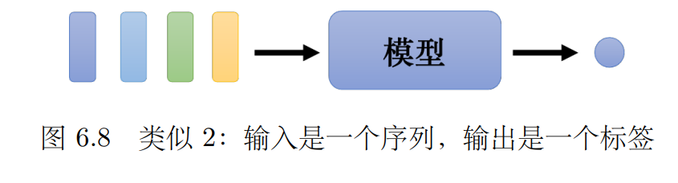

举例而言，如图 6.9 所示，输入是文字，比如情感分析。情感分析就是给机器看一段话， 模型要决定说这段话是积极的（positive）还是消极的（negative）。情感分析很有应用价值，假 设公司开发的一个产品上线了，想要知道网友的评价，但又不可能一则一则地分析网友的留 言。而使用情感分析就可以让机器自动去判别当一则贴文里面提到某个产品的时候，它是积 极的还是消极的，这样就可以知道产品在网友心中的评价。给定一整个句子，只需要一个标签 （积极的或消极的）。如果是语音，机器听一段声音，再决定是谁讲的这个声音。如果是图，比 如给定一个分子，预测该分子的亲水性。

**类型3：序列到序列**

还有第 3 个可能的输出：我们不知道应该输出多少个标签，机器要自己决定输出多少个 标签。如下图输入是 N 个向量，输出可能是 N′ 个标签。N′ 是机器自己决定的。这 种任务又叫做序列到序列的任务。翻译就是序列到序列的任务，因为输入输出是不同的语言， 它们的词汇的数量本来就不会一样多。真正的语音识别输入一句话，输出一段文字，其实也是 一个序列到序列的任务。

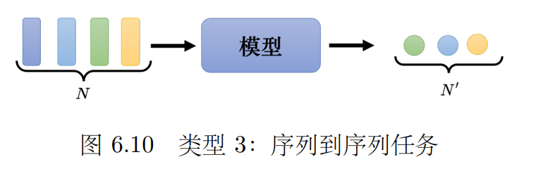

## 运作原理

以第一个类型为例：

序列标注要给序列里面的每一个向量一个标签。要怎么解决序列标注的问题呢？直觉的 想法就是使用全连接网络。如图 6.11 所示，虽然输入是一个序列，但可以不要管它是不是一 个序列，各个击破，把每一个向量分别输入到全连接网络里面得到输出。这种做法有非常大 的瑕疵，以词性标注为例，给机器一个句子：I saw a saw。对于全连接网络，这个句子中的两 个 saw 完全一模一样，它们是同一个词汇。既然全连接网络输入同一个词汇，它没有理由输 出不同的东西。但实际上，我们期待第一个 saw 要输出动词，第二个 saw 要输出名词。但全 连接网络无法做到这件事，因为这两个 saw 是一模一样的。有没有可能让全连接网络考虑更多的信息，比如上下文的信息呢？这是有可能的，如图 6.12 所示，把每个向量的前后几个向 量都“串”起来，一起输入到全连接网络就可以了。


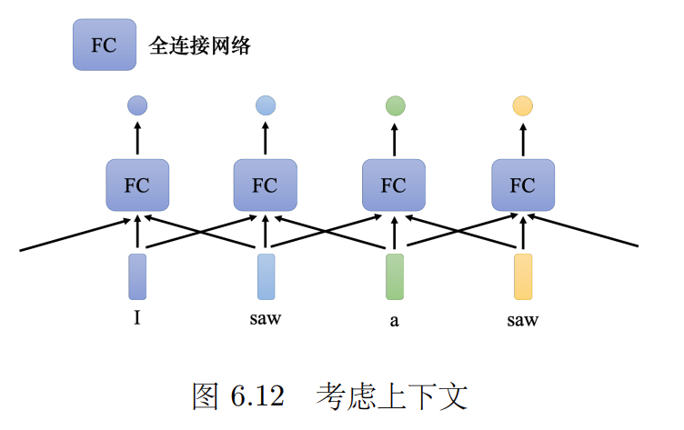

在语音识别里面，我们不是只看一帧判断这个帧属于哪一个音标，而是看该帧以及其前 后 5 个帧（共 11 个帧）来决定它是哪一个音标。所以可以给全连接网络一整个窗口的信息， 让它可以考虑一些上下文，即与该向量相邻的其他向量的信息。如图 6.13 所示。但是这种的 方法还是有极限的，如果有某一个任务不是考虑一个窗口就可以解决的，而是要考虑一整个序列才能够解决，那要怎么办呢？有人可能会想说这个还不容易，把窗口开大一点啊，大到 可以把整个序列盖住，就可以了。但是序列的长度是有长有短的，输入给模型的序列的长度， 每次可能都不一样。如果要开一个窗口把整个序列盖住，可能要统计一下训练数据，看看训 练数据里面最长序列的长度。接着开一个窗口比最长的序列还要长，才可能把整个序列盖住。 但是开一个这么大的窗口，意味着全连接网络需要非常多的参数，可能不只运算量很大，还容 易过拟合。如果想要更好地考虑整个输入序列的信息，就要用到自注意力模型。

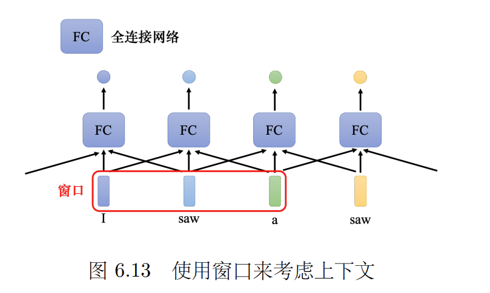

自注意力模型的运作方式如图 6.14 所示，自注意力模型会“吃”整个序列的数据，输入几 个向量，它就输出几个向量。图 6.14 中输入 4 个向量，它就输出 4 个向量。而这 4 个向量都 是考虑整个序列以后才得到的，所以输出的向量有一个黑色的框，代表它不是一个普通的向 量，它是考虑了整个句子以后才得到的信息。接着再把考虑整个句子的向量丢进全连接网络， 再得到输出。因此全连接网络不是只考虑一个非常小的范围或一个小的窗口，而是考虑整个 序列的信息，再来决定现在应该要输出什么样的结果，这就是自注意力模型。


自注意力模型不是只能用一次，可以叠加很多次。如图 6.15 所示，自注意力模型的输出 通过全连接网络以后，得到全连接网络的输出。全连接网络的输出再做一次自注意力模型，再 重新考虑一次整个输入序列的数据，将得到的数据输入到另一个全连接网络，就可以得到最 终的结果。全连接网络和自注意力模型可以交替使用。全连接网络专注于处理某一个位置的 信息，自注意力把整个序列信息再处理一次。有关自注意力最知名的相关的论文是 “Attention Is All You Need”。在这篇论文里面，谷歌提出了 Transformer 网络架构。


自注意力模型的运作过程如图 6.16 所示，其输入是一串的向量，这个向量可能是整个网 络的输入，也可能是某个隐藏层的输出，所以不用 x 来表示它，而用 a 来表示它，代表它有 可能是前面已经做过一些处理，是某个隐藏层的输出。输入一组向量 a，自注意力要输出一组 向量 b，每个 b 都是考虑了所有的 a 以后才生成出来的。b^1^、b^2^、b^3^、b^4^ 是考虑整个输入的 序列 a^1^、a^2^、a^3^、a^4^ 才产生出来的。

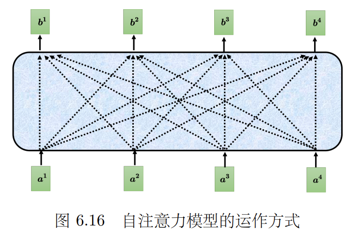

接下来介绍下向量 b^1^产生的过程，了解产生向量 b^1^的过程后，剩下向量 b^2^、b^3^、b^4^ 产 生的过程以此类推。怎么产生向量 b^1^呢？如图 6.17 所示，第一个步骤是根据 a^1^找出输入序 列里面跟 a^1^相关的其他向量。自注意力的目的是考虑整个序列，但是又不希望把整个序列所 有的信息包在一个窗口里面。所以有一个特别的机制，这个机制是根据向量 a^1^找出整个很长 的序列里面哪些部分是重要的，哪些部分跟判断 a^1^是哪一个标签是有关系的。每一个向量跟 a^1^的关联的程度可以用数值 α 来表示。自注意力的模块如何自动决定两个向量之间的关联性 呢？给它两个向量 a^1^跟 a^4^，它怎么计算出一个数值 α 呢？我们需要一个计算注意力的模块。 计算注意力的模块使用两个向量作为输入，直接输出数值 α，α 可以当做两个向量的关 联的程度。

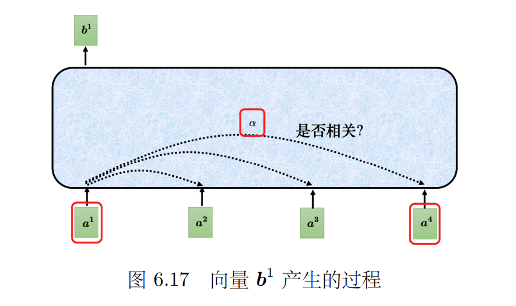

怎么计算 α？比较常见的做法是用点积（dot product）。如图 6.18(a) 所示，把输入的两个向量分别乘上两个不同的矩阵，左边这个向量乘上矩阵 $W^q$，右边这个向量乘上矩 阵 $W^k$，得到两个向量 q 跟 k，再把 q 跟 k 做点积，把它们做逐元素（element-wise）的相 乘，再全部加起来以后就得到一个标量（scalar）α，这是一种计算 α 的方式。 其实还有其他的计算方式，如图 6.18(b) 所示，有另外一个叫做相加（additive）的计算 方式，其计算方法就是把两个向量通过 $W^q$、$W^k$得到 q 和 k，但不是把它们做点积，而是把 q 和 k “串”起来“丢”到一个 tanh 函数，再乘上矩阵 $W $得到 α。总之，有非常多不同的方法可 以计算注意力，可以计算关联程度 α。但是在接下来的内容里面，我们都只用点积这个方法， 这也是目前最常用的方法，也是用在 Transformer 里面的方法。

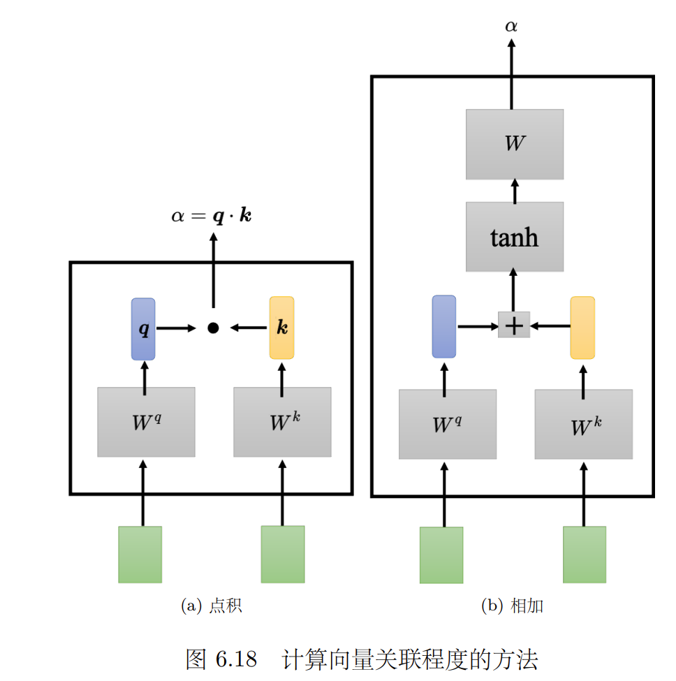

接下来如何把它套用在自注意力模型里面呢？自注意力模型一般采用查询-键-值（QueryKey-Value，QKV）模式。分别计算 a^1^与 a^2^、a^3^、a^4^之间的关联性 α。如图 6.19 所示，把 a^1^ 乘上$ W^q$ 得到 q^1^。q 称为查询（query），它就像是我们使用搜索引擎查找相关文章所使用的关键字，所以称之为查询。

接下来要去把 a^2^、a^3^、a^4^ 乘上 $W^k$ 得到向量 k，向量 k 称为键（key）。把查询 q^1^跟键 k^2^ 算内积（inner-product）就得到 α~1,2~。α~1,2~ 代表查询是 q^1^ 提供的，键是 k^2^ 提供的时候， q^1^跟 k^2^ 之间的关联性。关联性 α 也被称为注意力的分数。计算 q^1^ 与 k^2^ 的内积也就是计算 a ^1^ 与 a ^2^ 的注意力的分数。计算出 a ^1^ 与 a ^2^ 的关联性以后，接下来还需要计算 a ^1^ 与 a ^3^、a ^4^ 的关联性。把 a ^3^ 乘上$ W^k$ 得到键 k ^3^，a ^4^ 乘上 $W^k$ 得到键 k ^4^，再把键 k ^3^ 跟查询 q ^1^ 做内积， 得到 a ^1^ 与 a ^3^ 之间的关联性，即 a ^1^ 跟 a ^3^ 的注意力分数。把 k ^4^ 跟 q ^1^ 做点积，得到 α~1,4~，即 a^1^ 跟 a ^4^ 之间的关联性。


一般在实践的时候，如图 6.20 所示，a^1^ 也会跟自己算关联性，把 a ^1^ 乘上$ W^k$ 得到 k^1^。 用 q^1^ 跟 k^1^ 去计算 a ^1^ 与自己的关联性。计算出 a ^1^ 跟每一个向量的关联性以后，接下来会对 所有的关联性做一个 softmax 操作，如式 (6.3) 所示，把 α 全部取 e 的指数，再把指数的值 全部加起来做归一化（normalize）得到 α ′。这里的 softmax 操作跟分类的 softmax 操作是一 模一样的。

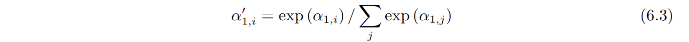

所以本来有一组 α，通过 softmax 就得到一组 α ′。

> Q：为什么要用 softmax？
>
> A：这边不一定要用 softmax，可以用别的激活函数，比如 ReLU。有人尝试使用 ReLU， 结果发现还比 softmax 好一点。所以不一定要用 softmax，softmax 只是最常见的，我 们可以尝试其他激活函数，看能不能试出比 softmax 更好的结果。

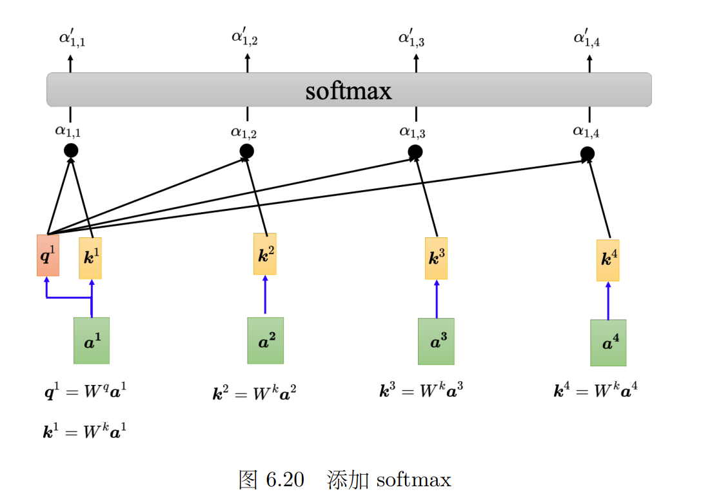

得到 α ′ 以后，接下来根据 α ′ 去抽取出序列里面重要的信息。如图 6.21 所示，根据 α 可 知哪些向量跟 a ^1^ 是最有关系的，接下来我们要根据关联性，即注意力的分数来抽取重要的信 息。把向量 a ^1^ 到 a ^4^ 乘上 $W^v$ 得到新的向量：v ^1^、v ^2^、v ^3^ 和 v ^4^，接下来把每一个向量都去 乘上注意力的分数 α ′，再把它们加起来，如式 (6.4) 所示。

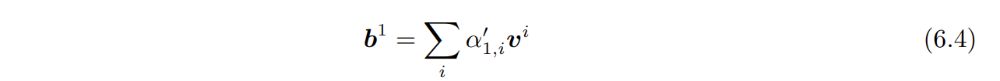

如果 a ^1^ 跟 a ^2^ 的关联性很强，即 α ′~1,2~的值很大。在做加权和（weighted sum）以后，得到的 b ^1^ 的值就可能会比较接近 v ^2^，所以谁的注意力的分数最大，谁的 v 就会主导（dominant） 抽出来的结果。这边我们讲述了如何从一整个序列得到 b ^1^。同理，可以计算出 b ^2^ 到 b ^4^。	

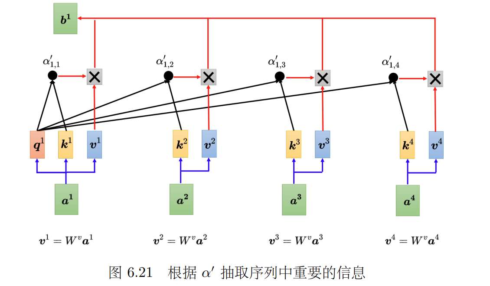

如图 6.22 所示。现在已经知道 a ^1^ 到 a ^4^，每一个 a 都要分别产生 q、k 和 v，a ^1^ 要 产生 q ^1^、k ^1^、v ^1^，a ^2^ 要产生 q ^2^、k ^2^ 和 v ^2^，以此类推。如果要用矩阵运算表示这个操作，每 一个 a ^i ^都乘上一个矩阵 $W^q$ 得到 q ^i^，这些不同的 a 可以合起来当作一个矩阵。什么意思呢？ a ^1^ 乘上 $W^q$ 得到 q ^1^，a ^2^ 也乘上 $W^q $得到 q ^2^，以此类推。把 a ^1^ 到 a ^4^ 拼起来可以看作是一 个矩阵 $I$，矩阵 $I$ 有四列，它的列就是自注意力的输入：a ^1^ 到 a ^4^。把矩阵 $I $乘上矩阵 $W^q$ 得到 $Q$。$W^q$ 是网络的参数，$Q $的四个列就是 q ^1^ 到 q ^4^。 产生 k 和 v 的操作跟 q 是一模一样的，a 乘上 $W^k$ 就会得到键 k。把 $I$ 乘上矩阵 $W^k$， 就得到矩阵 $K$。$K$ 的 4 个列就是 4 个键：k ^1^ 到 k ^4^。$I $乘上矩阵 $W^v$ 会得到矩阵 V 。矩阵 V 的 4 个列就是 4 个向量 v ^1^ 到 v ^4^。因此把输入的向量序列分别乘上三个不同的矩阵可得到q、k 和 v。


如图 6.23 所示，下一步是每一个 q 都会去跟每一个 k 去计算内积，去得到注意力的分数，先计算 q ^1^ 的注意力分数。


如图 6.24 所示，如果从矩阵操作的角度来看注意力计算这个操作，把 q ^1^ 跟 k ^1^ 做内积， 得到 α~1,1~。q ^1^乘上 (k ^1^ )^T^，也就是 q ^1^ 跟 k ^1^ 做内积。同理，α~1,2~ 是 q ^1^ 跟 k ^2^ 做内积，α~1,3~ 是 q ^1^ 跟 k ^3^ 做内积，α~1,4~ 就是 q ^1^ 跟 k ^4^做内积。这四个步骤的操作，其实可以把它拼起来，看 作是矩阵跟向量相乘。q ^1^乘 k ^1^，q ^1^ 乘 k ^2^，q ^1^ 乘 k ^3^，q ^1^ 乘 k ^4^ 这四个动作，可以看作是把 (k ^1^) ^T^ 到 (k ^4^ ) ^T^拼起来当作是一个矩阵的四行，把这个矩阵乘上 q ^1^ 可得到注意力分数的矩阵， 矩阵的每一行都是注意力的分数，即 α~1,1~ 到 α~1,4~。

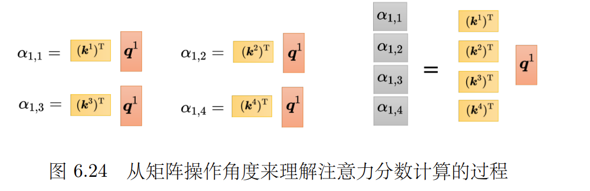

不只是 q ^1^ 要对 k ^1^ 到 k ^4^ 计算注意力，q ^2^ 也要对 k ^1^ 到 k ^4^ 计算注意力。 我们把 q ^2^也乘上 k ^1^ 到 k ^4^，得到 α~2,1~ 到 α~2,4~。现在的操作是一模一样的，把 q ^3^ 乘 k ^1^ 到 k ^4^，把 q ^4^ 乘上 k ^1^ 到 k ^4^ 可以得到注意力的分数。

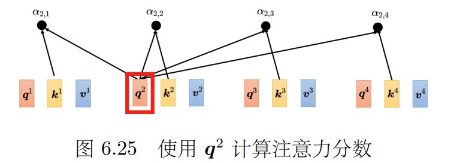

如图 6.26 所示，通过两个矩阵的相乘就得到注意力的分数。一个矩阵的行就是 $k$，即 k ^1^ 到 k ^4^。另外一个矩阵的列就是 q，即 q ^1^ 到 q ^4^。把 k 所形成的矩阵 K^T^ 乘上 q 所形成的矩 阵 $Q$ 就得到这些注意力的分数。假设 K 的列是 k ^1^ 到 k ^4^，在这边相乘的时候，要对矩阵 K 做一下转置得到 K^T^，K^T^ 乘上 $Q$ 就得到矩阵 $A$，$A $里面存的就是 Q 跟 K 之间的注意力 的分数。对注意力的分数做一下归一化（normalization），比如使用 $softmax$，对 A 的每一列 做 softmax，让每一列里面的值相加是 1。softmax 不是唯一的选项，完全可以选择其他的操 作，比如 ReLU 之类的，得到的结果也不会比较差。由于把 α 做 softmax 操作以后，它得到 的值有异于 α 的原始值，所以用 A ′ 来表示通过 softmax 以后的结果。


如图 6.27 所示，计算出 A ′ 以后，需要把 v ^1^ 到 v ^4^ 乘上对应的 α 再相加得到 b。如果 把 v ^1^ 到 v ^4^ 当成是矩阵 $V$ 的 4 个列拼起来，则把 A ′ 的第一个列乘上 $V$ 就得到 b ^1^，把 A ′ 的第二个列乘上 $V$ 得到 b ^2^，以此类推。所以等于把矩阵 A ′ 乘上矩阵 $V$ 得到矩阵 $O$。矩阵 $O$ 里面的每一个列就是自注意力的输出 b ^1^ 到 b ^4^。所以整个自注意力的操作过程可分为以下 步骤，先产生了 q、k 和 v，再根据 q 去找出相关的位置，然后对 v 做加权和。这一串操作 就是一连串矩阵的乘法。


如图 6.28 所示，自注意力的输入是一组的向量，将这排向量拼起来可得到矩阵 $I$。输入 $I$ 分别乘上三个矩阵：$W^q$、$W^k$ 跟 $W^v$ ，得到三个矩阵 Q、K 和 V 。接下来 Q 乘上 K^T^,得到矩阵 A。把矩阵 A 做一些处理可得到 A ′，A ′ 称为注意力矩阵（attention matrix）。把 A ′ 再乘上 V 就得到自注意力层的输出 O。自注意力的操作较为复杂，但自注意力层里面唯 一需要学的参数就只有 $W^q$、$W^k$ 跟 $W^v$。只有 $W^q$、$W^k$、$W^v$ 是未知的，需要通过训练数 据把它学习出来的。其他的操作都没有未知的参数，都是人为设定好的，都不需要通过训练数 据学习。


## 多头注意力

自注意力有一个进阶的版本——多头自注意力（multi-head self-attention）。多头自注 意力的使用是非常广泛的，有一些任务，比如翻译、语音识别，用比较多的头可以得到比较好 的结果。至于需要用多少的头，这个又是另外一个超参数，也是需要调的。

为什么会需要比较多的头呢？在使用自注意力计算相关性的时候，就是用 q 去找相关的 k。但是相关有很多种 不同的形式，所以也许可以有多个 q，不同的 q 负责不同种类的相关性，这就是多头注意力。 

如图 6.29 所示，先把 a 乘上一个矩阵得到 q，接下来再把 q 乘上另外两个矩阵，分别得到 q ^1^、q ^2^。用两个上标，q ~i,1~ 跟 q ~i,2~ 代表有两个头，i 代表的是位置，1 跟 2 代表是这个位置的 第几个 q，这个问题里面有两种不同的相关性，所以需要产生两种不同的头来找两种不同的相 关性。


既然 q 有两个，k 也就要有两个，v 也就要有两个。怎么从 q 得到 q ^1^、q ^2^，怎么从 k 得到 k ^1^、k ^2^，怎么从 v 得到 v ^1^、v ^2^？

其实就是把 q、k、v 分别乘上两个矩阵，得到不同的 头。对另外一个位置也做一样的事情，另外一个位置在输入 a 以后，它也会得到两个 q、两 个 k、两个 v。接下来怎么做自注意力呢，跟之前讲的操作是一模一样的，只是现在 1 那一 类的一起做，2 那一类的一起做。也就是 q ^1^ 在算这个注意力的分数的时候，就不要管 k ^2^ 了， 它就只管 k ^1^ 就好。q ~i,1~ 分别与 k ~i,1~、k ~j,1~ 算注意力，在做加权和的时候也不要管 v ^2^ 了，看 v ~i,1~ 跟 v ~j,1~ 就好，把注意力的分数乘 v~i,1~ 和 v ~j,1~，再相加得到 b ~i,1~，这边只用了其中一个头。 如图 6.30 所示，我们可以使用另外一个头做相同的事情。q ^2^ 只对 k ^2^ 做注意力，在做加 权和的时候，只对 v ^2^ 做加权和得到 b ~i,2~。如果有多个头，如 8 个头、16 个头，操作也是一样 的。 


如图 6.31 所示，得到 b ~i,1~ 跟 b ~i,2~，可能会把 b ~i,1~ 跟 b ~i,2~ 接起来，再通过一个变换，即再 乘上一个矩阵然后得到 b ^i^，再送到下一层去，这就是自注意力的变形——多头自注意力。

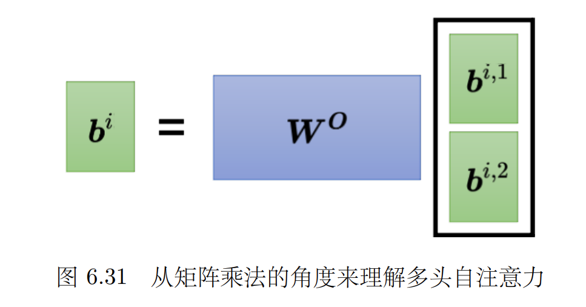

## 位置编码

讲到目前为止，自注意力层少了一个也许很重要的信息，即位置的信息。对一个自注意力 层而言，每一个输入是出现在序列的最前面还是最后面，它是完全没有这个信息的。有人可能 会问：输入不是有位置 1、2、3、4 吗？但 1、2、3、4 是作图的时候，为了帮助大家理解所标 上的一个编号。对自注意力而言，位置 1、位置 2、位置 3 跟位置 4 没有任何差别，这四个位 置的操作是一模一样的。对它来说，q 1 跟 q 4 的距离并没有特别远，1 跟 4 的距离并没有特别 远，2 跟 3 的距离也没有特别近，对它来说就是天涯若比邻，所有的位置之间的距离都是一样 的，没有谁在整个序列的最前面，也没有谁在整个序列的最后面。但是这可能会有一个问题：

**位置的信息被忽略了**，而有时候位置的信息很重要。举个例子，在做词性标注的时候，我们知 道动词比较不容易出现在句首，如果某一个词汇它是放在句首的，它是动词的可能性就比较 低，位置的信息往往也是有用的。可是到目前为止，自注意力的操作里面没有位置的信息。因 此做自注意力的时候，如果我们觉得位置的信息很重要，需要考虑位置信息时，就要用到位置 编码（positional encoding）。

如图 6.32 所示，位置编码为每一个位置设定一个向量，即位 置向量（positional vector）。位置向量用 e ^i^ 来表示，上标 i 代表位置，不同的位置就有不同 的向量，不同的位置都有一个专属的 e，把 e 加到 a ^i^ 上面就结束了。这相当于告诉自注意力 位置的信息，如果看到 a ^i^ 被加上 e ^i^，它就知道现在出现的位置应该是在 i 这个位置。	

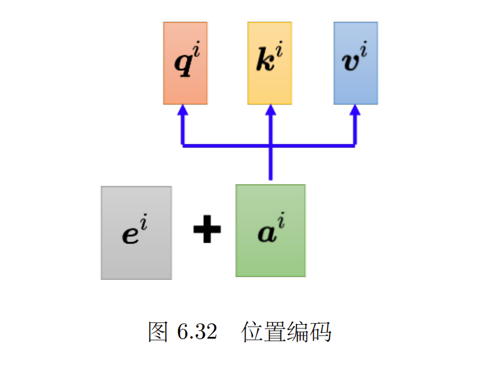

最早的 Transformer 论文 “Attention Is All You Need” 用的 e ^i^ 如图 6.33 所示。图上面每 一列就代表一个 e，第一个位置就是 e ^1^，第二个位置就是 e ^2^，第三个位置就是 e ^3^，以此类推。 每一个位置的 a 都有一个专属的 e。模型在处理输入的时候，它可以知道现在的输入的位置 的信息，这个位置向量是人为设定的。人为设定的向量有很多问题，假设在定这个向量的时候 只定到 128，但是序列的长度是 129，怎么办呢？在最早的 “Attention Is All You Need” 论文 中，其位置向量是通过正弦函数和余弦函数所产生的，避免了人为设定向量固定长度的尴尬。

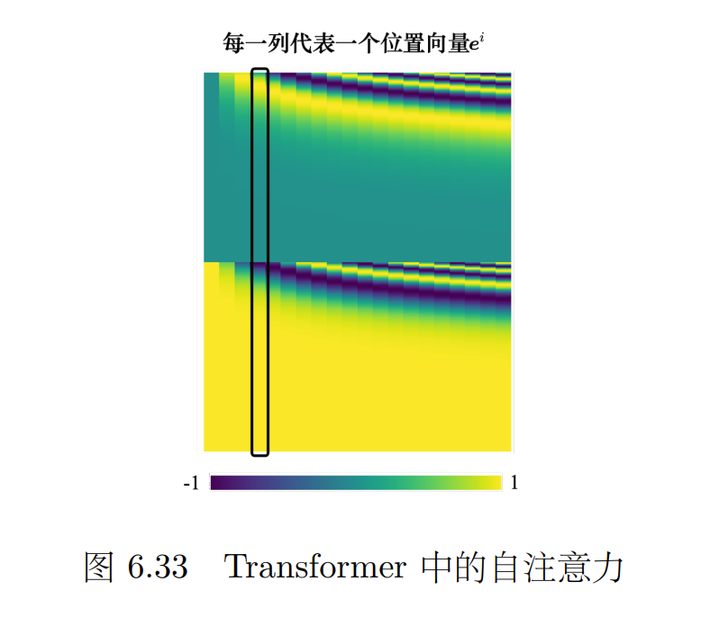

> Q：为什么要通过正弦函数和余弦函数产生向量，有其他选择吗？为什么一定要这样产 生手工的位置向量呢？
>
>  A：不一定要通过正、余弦函数来产生向量，我们可以提出新的方法。此外，不一定 要这样产生手工的向量，位置编码仍然是一个尚待研究的问题，甚至位置编码是可以 根据数据学出来的。有关位置编码，可以参考论文 “Learning to Encode Position for Transformer with Continuous Dynamical Model”，该论文比较了不同的位置编码方法 并提出了新的位置编码。

如图 6.34a 所示，最早的位置编码是用正弦函数所产生的（每一个红线表示一列），图 6.34a 中每一行代表一个位 置向量。如图 6.34b 所示，位置编码还可以使用循环神经网络生成。总之，位置编码可通过各 种不同的方法来产生。目前还不知道哪一种方法最好，这是一个尚待研究的问题。所以不用纠 结为什么正弦函数最好，我们永远可以提出新的做法。


## 截断自注意力

自注意力的应用很广泛，在自然语言处理（Natural Language Processing，NLP）领 域，除了 Transformer，还有 BERT 也用到了自注意力，所以自注意力在自然语言处理上面 的应用是大家都较为熟悉的，但自注意力不是只能用在自然语言处理相关的应用上，它还可 以用在很多其他的问题上。

比如在做语音的时候，也可以用自注意力。不过将自注意力用于语 音处理时，可以对自注意力做一些小小的改动。 举个例子，如果要把一段声音信号表示成一组向量，这排向量可能会非常长。在做语音识 别的时候，把声音信号表示成一组向量，而每一个向量只代表了 10 毫秒的长度而已。所以如 果是 1 秒钟的声音信号，它就有 100 个向量了，5 秒钟的声音信号就有 500 个向量，随便讲 一句话都是上千个向量了。所以一段声音信号，通过向量序列描述它的时候，这个向量序列 的长度是非常大的。非常大的长度会造成什么问题呢？在计算注意力矩阵的时候，其复杂度 （complexity）是长度的平方。

假设该矩阵的长度为 L，计算注意力矩阵 A ′ 需要做 L × L 次 的内积，如果 L 的值很大，计算量就很巨大，并且需要很大内存（memory）才能够把该矩阵 存下来。所以如果在做语音识别的时候，我们讲一句话，这一句话所产生的这个注意力矩阵可 能会太大，大到不容易处理，不容易训练， 截断自注意力（truncated self-attention）可以处理向量序列长度过大的问题。截断自 注意力在做自注意力的时候不要看一整句话，就只看一个小的范围就好，这个范围是人设定 的。在做语音识别的时候，如果要辨识某个位置有什么样的音标，这个位置有什么样的内容，并不需要看整句话，只要看这句话以及它前后一定范围之内的信息，就可以判断。

在做自注意 力的时候，也许没有必要让自注意力考虑一整个句子，只需要考虑一个小范围就好，这样就可 以加快运算的速度。这就是截断自注意力。

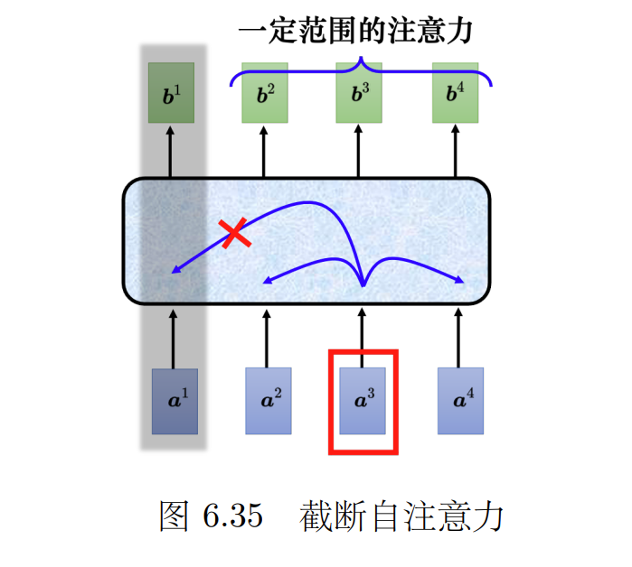

## 自注意力与卷积神经网络对比

自注意力还可以被用在图像上。到目前为止，在提到自注意力的时候，自注意力适用的范 围是输入为一组向量的时候。一张图像可以看作是一个向量序列，如图 6.36 所示，一张分辨 率为 5 × 10 的图像（图 6.36a）可以表示为一个大小为 5 × 10 × 3 的张量（图 6.36b），3 代 表 RGB 这 3 个通道（channel），每一个位置的像素可看作是一个三维的向量，整张图像是 5 × 10 个向量。


所以可以换一个角度来看图像，图像其实也是一个向量序列，它既然也是一 个向量序列，完全可以用自注意力来处理一张图像。自注意力在图像上的应用，读者可以参 考 “Self-Attention Generative Adversarial Networks” 和 “End-to-End Object Detection with Transformers” 这两篇论文。

自注意力跟卷积神经网络之间有什么样的差异或者关联? 如图 6.37(a) 所示，如果用自注 意力来处理一张图像，假设红色框内的“1”是要考虑的像素，它会产生查询，其他像素产生键。在做内积的时候，考虑的不是一个小的范围，而是整张图像的信息。如图 6.37(b) 所示，在做 卷积神经网络的时候，卷积神经网络会“画”出一个感受野，每一个滤波器，每一个神经元，只 考虑感受野范围里面的信息。所以如果我们比较卷积神经网络跟自注意力会发现，卷积神经 网络可以看作是一种简化版的自注意力，因为在做卷积神经网络的时候，只考虑感受野里面 的信息。而在做自注意力的时候，会考虑整张图像的信息。在卷积神经网络里面，我们要划定 感受野。每一个神经元只考虑感受野里面的信息，而感受野的大小是人决定的。而用自注意力 去找出相关的像素，就好像是感受野是自动被学出来的，网络自己决定感受野的形状。网络决 定说以这个像素为中心，哪些像素是真正需要考虑的，哪些像素是相关的，所以感受野的范围 不再是人工划定，而是让机器自己学出来。关于自注意力跟卷积神经网络的关系，读者可以读 论文 “On the Relationship between Self-attention and Convolutional Layers”，这篇论文里面 会用数学的方式严谨地告诉我们，**卷积神经网络就是自注意力的特例**。

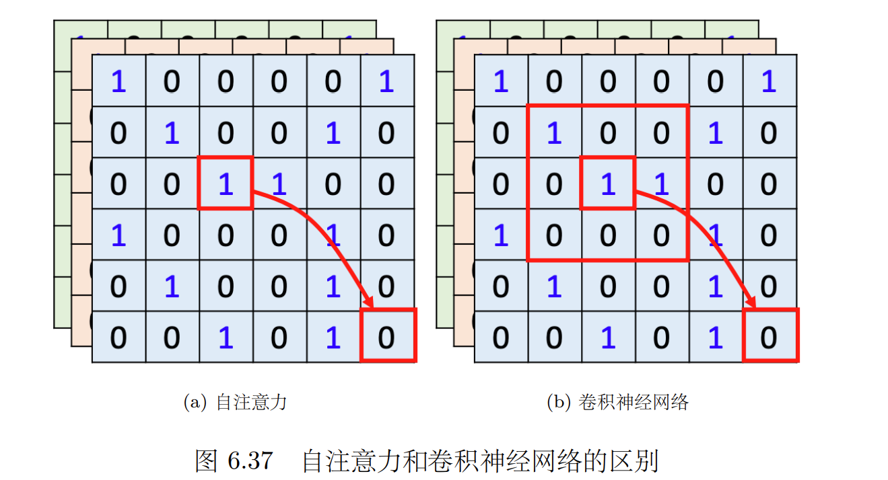

自注意力只要设定合适的参数，就可以做到跟卷积神经网络一模一样的事情。卷积神经 网络的函数集（function set）与自注意力的函数集的关系如图 6.38 所示。所以自注意力是更 灵活的卷积神经网络，而卷积神经网络是受限制的自注意力。自注意力只要通过某些设计、某 些限制就会变成卷积神经网络。


既然卷积神经网络是自注意力的一个子集，说明自注意力更灵活。**更灵活的模型需要更 多的数据。如果数据不够，就有可能过拟合。而比较有限制的模型，它适合在数据少的时候使 用，它可能比较不会过拟合。**如果限制设的好，也会有不错的结果。谷歌的论文 “An Imageis Worth 16x16 Words: Transformers for Image Recognition at Scale” 把自注意力应用在图 像上面，把一张图像拆成 16 × 16 个图像块（patch），它把每一个图像块就想像成是一个字 （word）。因为一般自注意力比较常用在自然语言处理上面，所以我们可以想像每一个图像块 就是一个字。如图 6.39 所示，横轴是训练的图像的量，对谷歌来说用的所谓的数据量比较少， 也是我们没有办法用的数据量。这边有 1000 万张图，是数据量比较小的设置（setting），数 据量比较大的设置呢，有 3 亿张图像。在这个实验里面，自注意力是浅蓝色的这一条线，卷 积神经网络是深灰色的这条线。随着数据量越来越多，自注意力的结果越来越好。最终在数据 量最多的时候，自注意力可以超过卷积神经网络，但在数据量少的时候，卷积神经网络是可以 比自注意力得到更好的结果的。自注意力的弹性比较大，所以需要比较多的训练数据，训练 数据少的时候就会过拟合。而卷积神经网络的弹性比较小，在训练数据少的时候结果比较好。 但训练数据多的时候，它没有办法从更大量的训练数据得到好处。这就是自注意力跟卷积神 经网络的比较。

> Q：自注意力跟卷积神经网络应该选哪一个？ 
>
> A：事实上可以都用，比如 conformer 里面同时用到了自注意力和卷积神经网络。

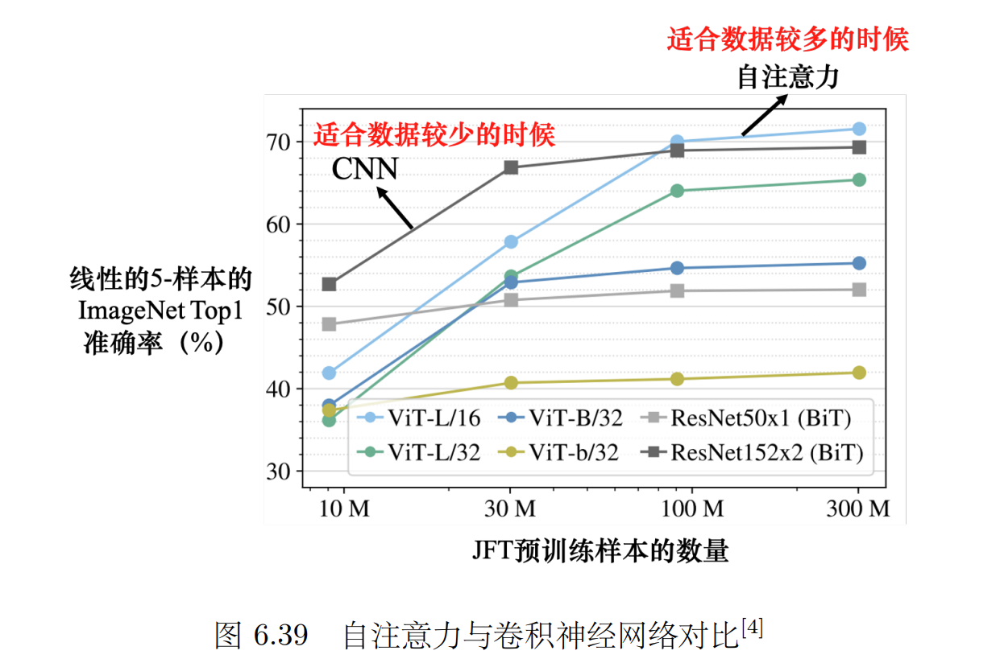

## 自注意力与循环神经网络

我们来比较一下自注意力跟循环神经网络。目前，循环神经网络的角色很大一部分都可 以用自注意力来取代了。但循环神经网络跟自注意力一样，都是要处理输入是一个序列的状 况。如图 6.40b 所示，在循环神经网络里面有一个输入序列、一个隐状态的向量、一个循环神 经网络的块（block）。循环神经网络的块“吃”记忆的向量，输出一个东西。这个东西会输入全 连接网络来进行预测。

> 循环神经网络中的隐状态存储了历史信息，可以看作一种记忆（Memory）。

接下来当第二个向量作为输入的时候，前一个时间点“吐”出来的东西也会作为输入丢进 循环神经网络里面产生新的向量，再拿去给全连接网络。输入第三个向量时，第三个向量跟前 一个时间点的输出，一起丢进循环神经网络再产生新的输出。输入第四个向量输入时，把第四 个向量跟前一个时间点产生出来的输出再一起做处理，得到新的输出再通过全连接网络的层， 这就是循环神经网络。

如图 6.40(a) 所示，循环神经网络的输入都是一个向量序列。自注意力 输出是一个向量序列，该序列中的每一个向量都考虑了整个输入序列，再输入到全连接网络 去做处理。循环神经网络也会输出一组向量，这排向量也会给全连接网络做进一步的处理。 自注意力跟循环神经网络有一个显而易见的不同，自注意力的每一个向量都考虑了整个输 入的序列，而循环神经网络的每一个向量**只考虑了左边已经输入的向量，它没有考虑右边的向 量**。但循环神经网络也可以是双向的，所以如果用双向循环神经网络（Bidirectional Recurrent Neural Network，Bi-RNN），那么每一个隐状态的输出也可以看作是考虑了整个输入的序列。 但是假设把循环神经网络的输出跟自注意力的输出拿来做对比，就算使用双向循环神经 网络还是有一些差别的。

如图 6.40(b) 所示，对于循环神经网络，如果最右边黄色的向量要 考虑最左边的输入，它就必须把最左边的输入存在记忆里面，才能不“忘掉”，一路带到最右 边，才能够在最后一个时间点被考虑。但自注意力输出一个查询，输出一个键，只要它们匹配 （match）得起来，“天涯若比邻”。自注意力可以轻易地从整个序列上非常远的向量抽取信息。

 自注意力跟循环神经网络还有另外一个更主要的不同是，循环神经网络在处理输入、输 出均为一组序列的时候，是没有办法并行化的。比如计算第二个输出的向量，不仅需要第二 个输入的向量，还需要前一个时间点的输出向量。当输入是一组向量，输出是另一组向量的 时候，循环神经网络无法并行处理所有的输出，但自注意力可以。自注意力输入一组向量，输 出的时候，每一个向量是同时并行产生的，因此在运算速度上，自注意力会比循环神经网络 更有效率。很多的应用已经把循环神经网络的架构逐渐改成自注意力的架构了。如果想要更 进一步了解循环神经网络跟自注意力的关系，可以阅读论文 “Transformers are RNNs: Fast Autoregressive Transformers with Linear Attention”。

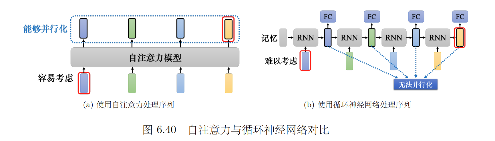

## 自注意力与图

图也可以看作是一堆向量，如果是一堆向量，就可以用自注意力来处理。但把自注意力用 在图上面，会有些地方不一样。图中的每一个节点（node）可以表示成一个向量。但我们不只 有节点的信息，还有边（edge）的信息。如果节点之间是有相连的，这些节点也就是有关联的。 之前在做自注意力的时候，所谓的关联性是网络自己找出来的。但是现在既然有了图的信息， 关联性就不需要机器自动找出来，图上面的边已经暗示了节点跟节点之间的关联性。所以当 把自注意力用在图上面的时候，我们可以在计算注意力矩阵的时候，只计算有边相连的节点 就好。

举个例子，如图 6.41 所示，在这个图上，节点 1 只和节点 5、6、8 相连，因此只需要计算节点 1 和节点 5、节点 6、节点 8 之间的注意力分数；节点 2 之和节点 3 相连，因此只需 要计算节点 2 和节点 3 之间的注意力的分数，以此类推。如果两个节点之间没有相连，这两 个节点之间就没有关系。既然没有关系，就不需要再去计算它的注意力分数，直接把它设为 0 就好了。因为图往往是人为根据某些领域知识（domain knowledge）建出来的，所以从领域知 识可知这两个向量之间没有关联，就没有必要再用机器去学习这件事情。当把自注意力按照 这种限制用在图上面的时候，其实就是一种图神经网络（Graph Neural Network，GNN）。

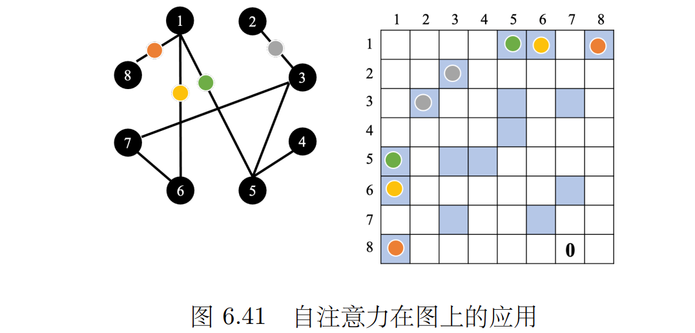

## 自注意力变形

自注意力有非常多的变形，论文 “Long Range Arena: A Benchmark for Efficient Transformers” 里面比较了各种不同的自注意力的变形。自注意力最大的问题是其运算量非常大，如 何减少自注意力的运算量是未来可研究的重点方向。自注意力最早是用在 Transformer 上面， 所以很多人讲 Transformer 的时候，其实指的是自注意力。有人说广义的 Transformer 指的就 是自注意力，所以后来各种的自注意力的变形都叫做是 xxformer，比如 Linformer、Performer、 Reformer 等等。这些新的 xxformer 往往比原来的 Transformer 性能差一点，但是速度会比较 快。论文 “Efficient Transformers: A Survey” 介绍了各种自注意力的变形。

## 加性注意力与点积注意力

正如上面提到的，softmax操作用于输出一个概率分布作为注意力权重。 在某些情况下，并非所有的值都应该被纳入到注意力汇聚中。

为了仅将有意义的词元作为值来获取注意力汇聚， 可以指定一个有效序列长度（即词元的个数）， 以便在计算softmax时过滤掉超出指定范围的位置。 下面的masked_softmax函数 实现了这样的掩蔽softmax操作（masked softmax operation）， 其中任何超出有效长度的位置都被掩蔽并置为0。

```python
def sequence_mask(X, valid_len, value=0):
    """在序列中屏蔽不相关的项"""
    maxlen = X.size(1)
    mask = torch.arange((maxlen), dtype=torch.float32, device=X.device)[None, :] < valid_len[:, None]
    X[~mask] = value
    return X
#@save
'''
masked_softmax的意思就相当于只考虑前valid_lens的数据。
比如说NLP中，为了保持句子的长度相等，对于短句子，在后面打padding，
但是这些padding对最后的结果是没有作用的，因此，在最后计算q-k的时候，
这部分就可以不考虑。
这里其实就是提前告诉你，某一个样本前valid_lens是有效的。
'''
def masked_softmax(X, valid_lens):
    """通过在最后一个轴上掩蔽元素来执行softmax操作"""
    # X:3D张量，valid_lens:1D或2D张量
    if valid_lens is None:
        return nn.functional.softmax(X, dim=-1)
    else:
        shape = X.shape
        if valid_lens.dim() == 1:
            valid_lens = torch.repeat_interleave(valid_lens, shape[1])
        else:
            valid_lens = valid_lens.reshape(-1)
        # 最后一轴上被掩蔽的元素使用一个非常大的负值替换，从而其softmax输出为0
        X = sequence_mask(X.reshape(-1, shape[-1]), valid_lens,
                              value=-1e6)
        return nn.functional.softmax(X.reshape(shape), dim=-1)
```

为了演示此函数是如何工作的， 考虑由两个2×4矩阵表示的样本， 这两个样本的有效长度分别为2
和3。 经过掩蔽softmax操作，超出有效长度的值都被掩蔽为0。

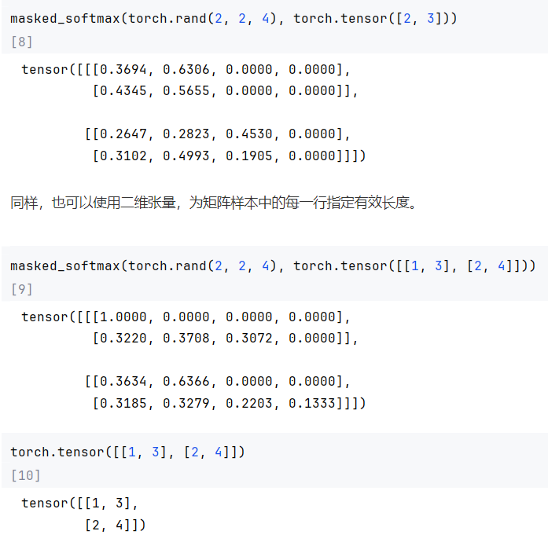

### 加性注意力


```python
class AdditiveAttention(nn.Module):
    '''加性注意力'''
    def __init__(self, key_size, query_size, num_hiddens, dropout, **Kwargs):
        super(AdditiveAttention, self).__init__(**Kwargs)
        self.W_k = nn.Linear(key_size, num_hiddens, bias=False)
        self.W_q = nn.Linear(query_size, num_hiddens, bias=False)
        self.w_v = nn.Linear(num_hiddens, 1, bias=False)
        self.dropout = nn.Dropout(dropout)

    def forward(self, queries, keys, values, valid_lens):
        queries, keys = self.W_q(queries), self.W_k(keys)
        print(queries.shape + keys.shape)
        features = queries.unsqueeze(2) + keys.unsqueeze(1)
        print(features.shape)
        features = torch.tanh(features)
        print(features.shape)
        scores = self.w_v(features).squeeze(-1)
        print(scores.shape)
        self.attention_weights = masked_softmax(scores, valid_lens)
        print(self.attention_weights.shape)
        return torch.bmm(self.dropout(self.attention_weights), values)
```

> **对于` queries, keys = self.W_q(queries), self.W_k(keys)`的维度变换**

在加性注意力机制中，`queries` 和 `keys` 的维度扩展是为了让每个查询（query）能够与所有的键（key）进行交互，从而计算出每个查询与所有键之间的相似度分数。为了实现这一点，我们需要确保广播机制（broadcasting mechanism）可以正确地应用，这通常涉及到增加新的维度。

假设原始的 `queries` 和 `keys` 都是三维张量，其形状分别为 `(batch_size, num_queries, query_size)` 和 `(batch_size, num_keys, key_size)`。这里：

- `batch_size` 是批量大小；
- `num_queries` 是查询的数量；
- `query_size` 是每个查询的特征维度；
- `num_keys` 是键的数量；
- `key_size` 是每个键的特征维度。

经过线性变换之后，`queries` 和 `keys` 的形状变为 `(batch_size, num_queries, num_hiddens)` 和 `(batch_size, num_keys, num_hiddens)`，其中 `num_hiddens` 是隐藏层的维度，也就是线性变换后的输出维度。

接下来，在进行维度扩展之前，我们先对 `queries` 和 `keys` 应用了线性变换以将它们映射到相同的空间中（即相同的 `num_hiddens` 维度），这样它们就可以直接相加了。

**扩展维度**

`unsqueeze` 方法

`queries.unsqueeze(2)`：在 `queries `的第三个维度（索引为2）插入一个新的轴，使得其形状从 `(batch_size, num_queries, num_hiddens)` 变为` (batch_size, num_queries, 1, num_hiddens)`。
`keys.unsqueeze(1)`：在 keys 的第二个维度（索引为1）插入一个新的轴，使得其形状从 `(batch_size, num_keys, num_hiddens)` 变为` (batch_size, 1, num_keys, num_hiddens)`。

- 对于 `queries`，我们在第三个维度上添加了一个新轴，使得其形状变为 `(batch_size, num_queries, 1, num_hiddens)`。
- 对于 `keys`，我们在第二个维度上添加了一个新轴，使得其形状变为 `(batch_size, 1, num_keys, num_hiddens)`。

这样做之后，`queries` 中的每个查询都可以与 `keys` 中的所有键通过广播机制进行逐元素相加。广播机制会自动扩展较小的数组，直到两个数组的形状匹配，以便执行逐元素操作。

**广播求和后的结果**

当我们将这两个扩展后的张量相加时，广播机制会导致以下情况：

- `queries` 的形状 `(batch_size, num_queries, 1, num_hiddens)` 将被广播为 `(batch_size, num_queries, num_keys, num_hiddens)`。
- `keys` 的形状 `(batch_size, 1, num_keys, num_hiddens)` 同样会被广播为 `(batch_size, num_queries, num_keys, num_hiddens)`。

因此，最终的结果是一个形状为 `(batch_size, num_queries, num_keys, num_hiddens)` 的张量，表示每个查询与所有键之间的交互结果。这个四维张量中的每一个位置 `(i, j, k, l)` 表示的是第 `i` 个样本中第 `j` 个查询与第 `k` 个键在第 `l` 个隐藏维度上的交互值。

**总结**

简而言之，`queries` 和 `keys` 在进行维度扩展之后的形状分别是 `(batch_size, num_queries, 1, num_hiddens)` 和 `(batch_size, 1, num_keys, num_hiddens)`，而它们相加之后的结果形状为 `(batch_size, num_queries, num_keys, num_hiddens)`。这个过程允许每个查询与所有键进行比较，从而为后续计算注意力权重做准备。

这句代码 `scores = self.w_v(features).squeeze(-1)` 的作用是将加性注意力机制中计算的特征（`features`）转换为注意力分数（`scores`），并调整输出张量的形状。下面我将详细解释这行代码的工作原理以及 `squeeze` 函数的用法。


>  `self.w_v(features)`


1. `self.w_v(features)`

首先，`self.w_v` 是一个线性变换层（`nn.Linear`），它的输入维度是 `num_hiddens`，输出维度是 `1`。这意味着它会对每个隐藏状态应用一个线性变换，并且最终只输出一个标量值（因为输出维度是1）。具体来说：

- 输入 `features` 的形状是 `(batch_size, num_queries, num_keys, num_hiddens)`。
- 经过 `self.w_v` 线性变换后，输出的形状变为 `(batch_size, num_queries, num_keys, 1)`。这里每个查询与每个键之间的交互结果被映射为一个单一的分数，表示它们之间的相关性或匹配度。

2. `.squeeze(-1)`

接下来，`.squeeze(-1)` 函数用于移除最后一个维度（即形状中的 `-1` 或最内层维度），因为它是一个大小为1的单例维度。`squeeze` 函数的作用是从张量的形状中删除所有大小为1的维度，或者指定特定的大小为1的维度来删除。在这个例子中，我们只移除最后一个维度（`-1` 表示最后一维）。

- 移除最后一个维度后，`scores` 的形状变为 `(batch_size, num_queries, num_keys)`。这个形状表示每个查询与所有键之间的注意力分数，其中 `num_queries` 和 `num_keys` 分别对应于查询的数量和键的数量。

3. 最终 `scores` 的维度

因此，经过上述操作之后，`scores` 的最终形状是 `(batch_size, num_queries, num_keys)`，这正是我们希望得到的结果，因为我们需要为每个查询计算出相对于所有键的注意力分数，以便后续使用这些分数来对相应的值进行加权求和。

`self.attention_weights = masked_softmax(scores, valid_lens)`获取经过Softmax之后的注意力权重矩阵


> `torch.bmm(self.dropout(self.attention_weights), values)`的作用

首先，`self.dropout` 是一个 `Dropout` 层，用于在训练期间随机丢弃一部分注意力权重，以防止模型过拟合。`Dropout` 在推理或评估模式下通常会被禁用，因此不会影响最终的输出。

输入：`self.attention_weights`，形状为 `(batch_size, num_queries, num_keys)`。
输出：形状不变，仍然是 `(batch_size, num_queries, num_keys)`，但在训练过程中某些元素可能被设置为0。


为了更好地理解这个加权求和的过程，让我们具体看一下在注意力机制中是如何使用 `torch.bmm` 函数来实现这一操作的。我们将一步步解析计算过程。

背景

- **注意力权重** (`attention_weights`)：形状为 `(batch_size, num_queries, num_keys)` 的张量，表示每个查询对各个键的关注程度。
- **值** (`values`)：形状为 `(batch_size, num_keys, value_dim)` 的张量，表示每个键对应的值向量。

具体的加权求和过程

1. **批量矩阵乘法（Batch Matrix Multiplication）**：
   - 使用 `torch.bmm` 函数对 `attention_weights` 和 `values` 进行批量矩阵乘法。
   - `torch.bmm` 会逐个样本地处理这两个三维张量，并执行矩阵乘法。

2. **矩阵乘法的具体步骤**：

   对于每个样本（假设 `batch_size=1` 以简化说明），我们有：

   - 注意力权重矩阵：形状为 `(num_queries, num_keys)`。
   - 值矩阵：形状为 `(num_keys, value_dim)`。

   矩阵乘法的过程如下：

   - 每个查询（`num_queries` 中的一个）对应一行注意力权重。
   - 每个键（`num_keys` 中的一个）对应一列值。
   - 当你将注意力权重矩阵与值矩阵相乘时，实际上是对于每个查询，将其对所有键的注意力权重分别与相应键的值进行点乘（即元素相乘），然后将这些结果相加。

3. **点乘与求和**：

   - 对于每个查询，它与每个键的注意力权重相乘的结果是一个标量。
   - 将这些标量与相应的值向量相乘，得到一个新的值向量。
   - 最后，将所有这些新的值向量相加，得到一个综合的值向量。

4. **最终输出**：

   - 结果是一个形状为 `(batch_size, num_queries, value_dim)` 的张量。
   - 每个查询现在都有了一个综合考虑了所有键的加权表示。

```python
'''
torch.normal(0, 1, (2, 1, 20)) 创建了一个形状为 (2, 1, 20) 的张量，其元素是从均值为0、标准差为1的正态分布中随机抽取的。
'''
queries, keys = torch.normal(0, 1, (2, 1, 20)), torch.ones((2, 10,2))
'''
生成一个包含从 0 到 39（共40个）的等间距值的一维张量。
将上述一维张量重塑为形状为 (1, 10, 4) 的三维张量。
沿指定维度重复张量的内容。这里，我们将该张量在第一个维度（批次维度）上重复两次，而在其他两个维度上保持不变。
tensor([[[ 0.,  1.,  2.,  3.],
         [ 4.,  5.,  6.,  7.],
         [ 8.,  9., 10., 11.],
         [12., 13., 14., 15.],
         [16., 17., 18., 19.],
         [20., 21., 22., 23.],
         [24., 25., 26., 27.],
         [28., 29., 30., 31.],
         [32., 33., 34., 35.],
         [36., 37., 38., 39.]],

        [[ 0.,  1.,  2.,  3.],
         [ 4.,  5.,  6.,  7.],
         [ 8.,  9., 10., 11.],
         [12., 13., 14., 15.],
         [16., 17., 18., 19.],
         [20., 21., 22., 23.],
         [24., 25., 26., 27.],
         [28., 29., 30., 31.],
         [32., 33., 34., 35.],
         [36., 37., 38., 39.]]])
'''
values = torch.arange(40, dtype=torch.float32).reshape(1, 10, 4).repeat(2, 1, 1)
valid_lens = torch.tensor([2, 6])

attention = AdditiveAttention(key_size=2, query_size=20, num_hiddens=8, dropout=0.1)
attention.eval()
attention(queries, keys, values, valid_lens)
print(attention(queries, keys, values, valid_lens).shape)
```

输出：

```python
torch.Size([2, 1, 8, 2, 10, 8])
torch.Size([2, 1, 10, 8])
torch.Size([2, 1, 10, 8])
torch.Size([2, 1, 10])
torch.Size([2, 1, 10])
torch.Size([2, 1, 8, 2, 10, 8])
torch.Size([2, 1, 10, 8])
torch.Size([2, 1, 10, 8])
torch.Size([2, 1, 10])
torch.Size([2, 1, 10])
torch.Size([2, 1, 4])
```

```python
def show_heatmaps(matrices, xlabel, ylabel, titles=None, figsize=(2.5, 2.5),
                  cmap='Reds'):
    """显示矩阵热图"""
    d2l.use_svg_display()
    num_rows, num_cols = matrices.shape[0], matrices.shape[1]
    fig, axes = d2l.plt.subplots(num_rows, num_cols, figsize=figsize,
                                 sharex=True, sharey=True, squeeze=False)
    for i, (row_axes, row_matrices) in enumerate(zip(axes, matrices)):
        for j, (ax, matrix) in enumerate(zip(row_axes, row_matrices)):
            pcm = ax.imshow(matrix.detach().numpy(), cmap=cmap)
            if i == num_rows - 1:
                ax.set_xlabel(xlabel)
            if j == 0:
                ax.set_ylabel(ylabel)
            if titles:
                ax.set_title(titles[j])
    fig.colorbar(pcm, ax=axes, shrink=0.6);
show_heatmaps(attention.attention_weights.reshape((1, 1, 2, 10)),
                  xlabel='Keys', ylabel='Queries')
```


这里attention.attention_weights.reshape为(2, 1, 10),`valid_lens = torch.tensor([2, 6])`因此第一个样本只关注前2个，后面都变换为0，第二个样本只关注前6个，后面都变为0。

### 缩放点积注意力


```python
class DotProductAttention(nn.Module):
    '''缩放点击注意力'''
    def __init__(self, dropout, **Kwargs):
        super(DotProductAttention, self).__init__(**Kwargs)
        self.dropout = nn.Dropout(dropout)

    def forward(self, queries, keys, values, valid_lens = None):
        d = queries.shape[-1]
        scores = torch.bmm(queries, keys.transpose(1, 2)) / math.sqrt(d)
        self.attention_weights = masked_softmax(scores, valid_lens)
        return torch.bmm(self.dropout(self.attention_weights), values)
```

```python
queries = torch.normal(0, 1, (2, 1, 2))
attention = DotProductAttention(dropout=0.5)
attention.eval()
attention(queries, keys, values, valid_lens)
```

```python
tensor([[[ 2.0000,  3.0000,  4.0000,  5.0000]],

        [[10.0000, 11.0000, 12.0000, 13.0000]]])
```

```python
show_heatmaps(attention.attention_weights.reshape((1, 1, 2, 10)),
                  xlabel='Keys', ylabel='Queries')
```


## 讲注意力机制使用在Seq2Seq模型当中

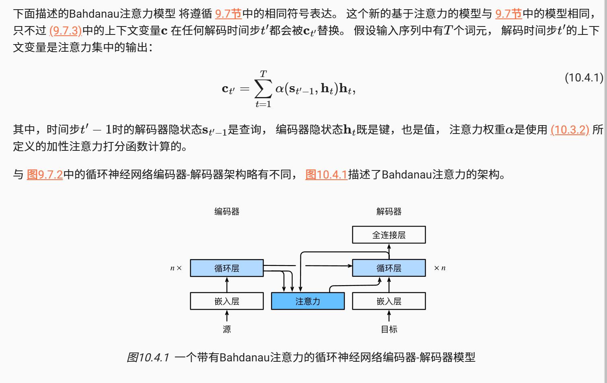

要预测下一个词的时候，将当前预测出的词作为query，编码器各个状态作为(key,value)，进行attention，来找到对预测下一个词有用的原文

k-v就是编对每一个词的编码器输出，q就是解码器对上一个词的预测输出；

原始的seq2seq问题：


而引入注意力机制之后，编码器的输出是所有文本的加权得到k-v，每次解码器利用最近预测得到的词作为q，从而找到最相近的v，然后再次投入到解码器中的RNN，从而预测得到下一个单词。

导入包

```python
import torch
from torch import nn
from d2l import torch as d2l
```

带有注意力机制的解码器基本接口

```python
class AttentionDecoder(d2l.Decoder):
    def __init__(self, **kwargs):
        super(AttentionDecoder, self).__init__(**kwargs)

    @property
    def attention_weight(self):
        raise NotImplementedError
```

Atttention作用在decoder上，

```python
class Seq2SeqAttentionDecoder(AttentionDecoder):
    def __init__(self, vocab_size, embed_size, num_hiddens, num_layers,
                 dropout=0, **kwargs):
        super(Seq2SeqAttentionDecoder, self).__init__(**kwargs)
        self.attention = d2l.AdditiveAttention(
            num_hiddens, num_hiddens, num_hiddens, dropout)
        self.embedding = nn.Embedding(vocab_size, embed_size)
        self.rnn = nn.GRU(
            embed_size + num_hiddens, num_hiddens, num_layers,
            dropout=dropout)
        self.dense = nn.Linear(num_hiddens, vocab_size)

    def init_state(self, enc_outputs, enc_valid_lens, *args):
        # outputs的形状为(batch_size，num_steps，num_hiddens).
        # hidden_state的形状为(num_layers，batch_size，num_hiddens)
        outputs, hidden_state = enc_outputs
        return (outputs.permute(1, 0, 2), hidden_state, enc_valid_lens)

    def forward(self, X, state):
        # enc_outputs的形状为(batch_size,num_steps,num_hiddens).
        # hidden_state的形状为(num_layers,batch_size,
        # num_hiddens)
        enc_outputs, hidden_state, enc_valid_lens = state
        # 输出X的形状为(num_steps,batch_size,embed_size)
        X = self.embedding(X).permute(1, 0, 2)
        outputs, self._attention_weights = [], []
        for x in X:
            # query的形状为(batch_size,1,num_hiddens)
            query = torch.unsqueeze(hidden_state[-1], dim=1)
            # context的形状为(batch_size,1,num_hiddens)
            context = self.attention(
                query, enc_outputs, enc_outputs, enc_valid_lens)
            # 在特征维度上连结
            x = torch.cat((context, torch.unsqueeze(x, dim=1)), dim=-1)
            # 将x变形为(1,batch_size,embed_size+num_hiddens)
            out, hidden_state = self.rnn(x.permute(1, 0, 2), hidden_state)
            outputs.append(out)
            self._attention_weights.append(self.attention.attention_weights)
        # 全连接层变换后，outputs的形状为
        # (num_steps,batch_size,vocab_size)
        outputs = self.dense(torch.cat(outputs, dim=0))
        return outputs.permute(1, 0, 2), [enc_outputs, hidden_state,
                                          enc_valid_lens]

    @property
    def attention_weights(self):
        return self._attention_weights
```

选取超参数进行测试：

```python
embed_size, num_hiddens, num_layers, dropout = 32, 32, 2, 0.1
batch_size, num_steps = 64, 10
lr, num_epochs, device = 0.005, 250, d2l.try_gpu()

train_iter, src_vocab, tgt_vocab = d2l.load_data_nmt(batch_size, num_steps)
encoder = d2l.Seq2SeqEncoder(
    len(src_vocab), embed_size, num_hiddens, num_layers, dropout)
decoder = Seq2SeqAttentionDecoder(
    len(tgt_vocab), embed_size, num_hiddens, num_layers, dropout)
net = d2l.EncoderDecoder(encoder, decoder)
d2l.train_seq2seq(net, train_iter, lr, num_epochs, tgt_vocab, device)
```

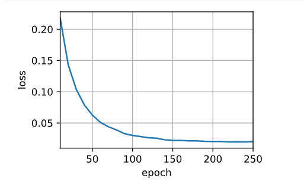

利用得到的模型进行测试：

```python
engs = ['go .', "i lost .", 'he\'s calm .', 'i\'m home .']
fras = ['va !', 'j\'ai perdu .', 'il est calme .', 'je suis chez moi .']
for eng, fra in zip(engs, fras):
    translation, dec_attention_weight_seq = d2l.predict_seq2seq(
        net, eng, src_vocab, tgt_vocab, num_steps, device, True)
    print(f'{eng} => {translation}, ',
          f'bleu {d2l.bleu(translation, fra, k=2):.3f}')
```


查看一下注意力权重：

```python
attention_weights = torch.cat([step[0][0][0] for step in dec_attention_weight_seq], 0).reshape((
    1, 1, -1, num_steps))
# 加上一个包含序列结束词元
def show_heatmaps(matrices, xlabel, ylabel, titles=None, figsize=(2.5, 2.5),
                  cmap='Reds'):
    """显示矩阵热图"""
    d2l.use_svg_display()
    num_rows, num_cols = matrices.shape[0], matrices.shape[1]
    fig, axes = d2l.plt.subplots(num_rows, num_cols, figsize=figsize,
                                 sharex=True, sharey=True, squeeze=False)
    for i, (row_axes, row_matrices) in enumerate(zip(axes, matrices)):
        for j, (ax, matrix) in enumerate(zip(row_axes, row_matrices)):
            pcm = ax.imshow(matrix.detach().numpy(), cmap=cmap)
            if i == num_rows - 1:
                ax.set_xlabel(xlabel)
            if j == 0:
                ax.set_ylabel(ylabel)
            if titles:
                ax.set_title(titles[j])
    fig.colorbar(pcm, ax=axes, shrink=0.6);
show_heatmaps(
    attention_weights[:, :, :, :len(engs[-1].split()) + 1].cpu(),
    xlabel='Key positions', ylabel='Query positions')
```

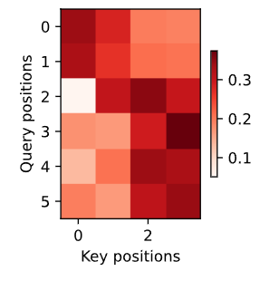

----

> `self.embedding = nn.Embedding(vocab_size, embed_size)`

在自然语言处理中，输入的单词通常是以索引形式表示的。例如，在一个词汇表大小为 $\text{vocabsize} = 10,000$ 的模型中：

- **单词 "hello"** 的索引可能是 **27**。
- **单词 "world"** 的索引可能是 **42**。

然而，索引本身并没有携带任何关于单词含义或关系的信息。
为了让模型学习到单词之间的 **语义关系**，需要将索引映射到一个连续的、固定维度的向量空间中（Embedding Space）。

`nn.Embedding` 的核心功能是：
将输入的单词索引映射到一个维度为 `embed_size` 的向量。例如：

- 输入：一个索引序列 `X`，形状为 `(batch_size, num_steps)`，其中每个值代表单词索引。
- 输出：通过 `nn.Embedding`，索引被映射为向量，输出形状变为 **(batch_size, num_steps, embed_size)**。

举例：

假设：

- **`batch_size=2`**：2个样本。
- **`num_steps=3`**：每个样本有3个单词。
- **`embed_size=4`**：嵌入向量的维度是4。

```python
X = [[2, 5, 7],
     [1, 3, 4]]  # 形状为 (batch_size=2, num_steps=3)
```

**nn.Embedding 操作**：

通过查找嵌入矩阵 `W`（形状为 `vocab_size x embed_size`）的对应行：

- 输入索引 `2` → 输出向量 `W[2]`，形状为 `(embed_size=4)`。
- 输入索引 `5` → 输出向量 `W[5]`。
- 依次类推。

```python
X_embed = [[[0.1, 0.2, 0.3, 0.4],   # W[2]
            [0.5, 0.6, 0.7, 0.8],   # W[5]
            [0.9, 1.0, 1.1, 1.2]],  # W[7]

           [[0.2, 0.3, 0.4, 0.5],   # W[1]
            [0.6, 0.7, 0.8, 0.9],   # W[3]
            [1.0, 1.1, 1.2, 1.3]]]  # W[4]
```

输出形状为 **(batch_size=2, num_steps=3, embed_size=4)**。

嵌入层中的权重矩阵 `W`（形状为 `vocab_size x embed_size`）是在训练过程中 **自动学习** 的。

它会通过反向传播根据任务目标（例如翻译、文本生成等）来优化，使得单词的嵌入向量能够反映单词的语义和上下文关系。

----

> `self.rnn = nn.GRU(embed_size + num_hiddens, num_hiddens, num_layers, dropout=dropout)`

为什么是`embed_size + num_hiddens`?

**当前时间步的词嵌入向量**（`embed_size`）：

- 由当前时间步输入单词通过嵌入层 `nn.Embedding` 得到。

**注意力上下文向量**（`num_hiddens`）：

- 通过注意力机制得到的、编码器输出的加权求和结果。

序列模型的时间步：

序列任务的输入是一系列有顺序的数据，例如句子中的单词、视频帧、时间序列数据等。

**时间步**：表示序列中数据的第几个元素（或者时间点）。

例如，句子 `"I love learning"` 可以分解为 **3个时间步**：

- **时间步1**：`I`
- **时间步2**：`love`
- **时间步3**：`learning`

在模型中，RNN 会逐个处理这些时间步的数据，每个时间步都会有输入、隐藏状态和输出。

----

> ```python
> def init_state(self, enc_outputs, enc_valid_lens, *args):
>     outputs, hidden_state = enc_outputs
>     return (outputs.permute(1, 0, 2), hidden_state, enc_valid_lens)
> ```
>
> 维度变换过程

 **`enc_outputs` 的形状变换**，从 **`(batch_size, num_steps, num_hiddens)`** 转换到 **`(num_steps, batch_size, num_hiddens)`** 

`enc_outputs` 的初始形状为 **`(batch_size, num_steps, num_hiddens)`**：

- **`batch_size`**：批量大小，即一次输入多少个样本。
- **`num_steps`**：输入序列的长度（即时间步的数量）。
- **`num_hiddens`**：隐藏层的单元数（特征维度）。

**为什么要转换?**

- RNN 或 GRU 在 PyTorch 中要求输入的形状为 `(num_steps, batch_size, feature_dim)`
  - **`num_steps`**：时间步，放在第一个维度。
  - **`batch_size`**：批量大小，放在第二个维度。
  - **`feature_dim`**：特征的维度（如隐藏层大小）。

为了满足 RNN 输入的要求，必须对 `enc_outputs` 进行 **维度置换**。

`torch.Tensor.permute()` 函数可以对张量的维度进行重排。

```python
Tensor.permute(dims)
```

`dims`：一个元组，表示新的维度顺序。

原始张量的维度会按照 `dims` 指定的顺序进行重新排列。

原始形状：**`(batch_size, num_steps, num_hiddens)`**
目标形状：**`(num_steps, batch_size, num_hiddens)`**

为了实现这种转换，使用 **`permute`**：`enc_outputs = enc_outputs.permute(1, 0, 2)`

----

:small_airplane:**前向传播过程**：

好的！我们将逐行分析 `forward` 方法中的 **前向传播过程**，并详细说明变量的**维度转换**。这段代码是一个基于 **注意力机制的 Seq2Seq 解码器**，在每个时间步处理输入单词并利用注意力机制动态聚焦编码器的输出。

**1. 输入参数**

- **`X`**: 解码器的输入序列，形状为 `(batch_size, num_steps)`，每个值是单词的索引。

- `state`

  : 解码器的初始状态，包含：

  - `enc_outputs`：编码器的输出，形状为 `(batch_size, num_steps, num_hiddens)`。
  - `hidden_state`：解码器的隐藏状态，形状为 `(num_layers, batch_size, num_hiddens)`。
  - `enc_valid_lens`：编码器输出的有效长度，用于注意力机制中屏蔽无效的填充部分。

**2. 嵌入层：将单词索引映射为嵌入向量**

```python
X = self.embedding(X).permute(1, 0, 2)
```

- **输入**：`X` 的形状为 `(batch_size, num_steps)`。

- 输出

  ：通过 

  ```
  nn.Embedding
  ```

  ，将索引映射到 

  ```
  embed_size
  ```

   维度的向量，结果形状为：

  - **`(batch_size, num_steps, embed_size)`**。

- 维度变换

  ：使用 

  ```
  .permute(1, 0, 2)
  ```

   调整维度顺序为：

  - **`(num_steps, batch_size, embed_size)`**。

- **原因**：RNN 通常要求输入的时间步维度在第一维，方便逐时间步地处理数据。

**3. 初始化输出和注意力权重列表**

```python
outputs, self._attention_weights = [], []
```

- **`outputs`**：保存每个时间步 RNN 的输出。
- **`self._attention_weights`**：保存每个时间步的注意力权重。

**4. 遍历每个时间步的输入**

```python
for x in X:
```

- **`X`**：形状为 `(num_steps, batch_size, embed_size)`。
- **`x`**：每次取出一个时间步的数据，形状为 `(batch_size, embed_size)`。

**5. 计算注意力机制的上下文向量**

```python
query = torch.unsqueeze(hidden_state[-1], dim=1)
```

- **`hidden_state[-1]`**：取出解码器隐藏状态的最后一层，形状为 `(batch_size, num_hiddens)`。

- `torch.unsqueeze(..., dim=1)`

  ：在第 1 维增加一个维度，结果形状为：

  - **`(batch_size, 1, num_hiddens)`**。

- **`query`**：用于注意力机制的查询向量。

**计算注意力上下文向量**

```python
context = self.attention(
    query, enc_outputs, enc_outputs, enc_valid_lens)
```

- 输入：
  - `query`：形状为 `(batch_size, 1, num_hiddens)`。
  - `enc_outputs`：形状为 `(batch_size, num_steps, num_hiddens)`，作为注意力的 `key` 和 `value`。
  - `enc_valid_lens`：有效长度，用于屏蔽无效的填充部分。
- 输出：
  - **`context`**：上下文向量，形状为 `(batch_size, 1, num_hiddens)`。
- **说明**：注意力机制通过 `query` 对 `key` 和 `value` 进行加权求和，得到动态上下文向量。

**6. 拼接注意力上下文向量与当前时间步输入**

```python
x = torch.cat((context, torch.unsqueeze(x, dim=1)), dim=-1)
```

- **`context`**：形状为 `(batch_size, 1, num_hiddens)`。

- **`x`**：通过 `torch.unsqueeze(x, dim=1)`，增加时间步维度，形状为 `(batch_size, 1, embed_size)`。

- 拼接：在最后一个维度 (

  ```
  dim=-1
  ```

  ) 拼接，结果形状为：

  - **`(batch_size, 1, embed_size + num_hiddens)`**。

**7. 输入 RNN 进行解码**

```python
out, hidden_state = self.rnn(x.permute(1, 0, 2), hidden_state)
```

- `x`：当前时间步输入，形状为 

  ```
  (batch_size, 1, embed_size + num_hiddens)
  ```

  - 使用 `.permute(1, 0, 2)` 调整维度为 `(1, batch_size, embed_size + num_hiddens)`。
  - **原因**：RNN 输入的时间步维度必须在第一维。

- **`hidden_state`**：解码器的隐藏状态，形状为 `(num_layers, batch_size, num_hiddens)`。

- 输出：

  - **`out`**：RNN 的输出，形状为 `(1, batch_size, num_hiddens)`。
  - **`hidden_state`**：更新后的隐藏状态，形状不变 `(num_layers, batch_size, num_hiddens)`。

**8. 保存输出和注意力权重**

```python
outputs.append(out)
self._attention_weights.append(self.attention.attention_weights)
```

- **`out`**：当前时间步的输出，形状为 `(1, batch_size, num_hiddens)`，保存到 `outputs` 列表中。
- **`attention_weights`**：注意力权重，保存到 `self._attention_weights` 中。

**9. 连接所有时间步的输出**

```python
outputs = self.dense(torch.cat(outputs, dim=0))
```

- `torch.cat(outputs, dim=0)`：
  - 将 `outputs` 列表中的所有时间步输出沿着时间步维度拼接。
  - 结果形状为 `(num_steps, batch_size, num_hiddens)`。
- `self.dense`：
  - 通过全连接层将隐藏状态映射到词汇表大小。
  - 结果形状变为 `(num_steps, batch_size, vocab_size)`。

**10. 调整输出维度**

```python
return outputs.permute(1, 0, 2), [enc_outputs, hidden_state, enc_valid_lens]
```

- **`outputs.permute(1, 0, 2)`**：
  - 调整维度，将时间步和批量维度交换。
  - 最终形状为 **`(batch_size, num_steps, vocab_size)`**。
- **返回值**：
  - `outputs`：解码器的输出结果。
  - `state`：包含编码器输出、更新后的隐藏状态和有效长度。


# Transformer

Sequence-to-sequence (Seq2seq)：Input a sequence, output a sequence.

输入一个序列，输出一个序列。序列到序列模型输入和输出都是一个序列，输入与输出序列长度之间的关系有两种情况。 第一种情况下，输入跟输出的长度一样；第二种情况下，机器决定输出的长度。序列到序列模 型有广泛的应用，通过这些应用可以更好地了解序列到序列模型。

但是输出序列的长度无法确定，是否能够让机器自己学习呢？**The output length is determined by model.**


很多时候，我们都可以使用Seq2seq的方式硬解出问题，即“**硬train一发**”。

这就是一个很神奇的模型了，那Seq2seq中间该怎么设计呢？

主要模块由两部分构成：编码器与解码器。

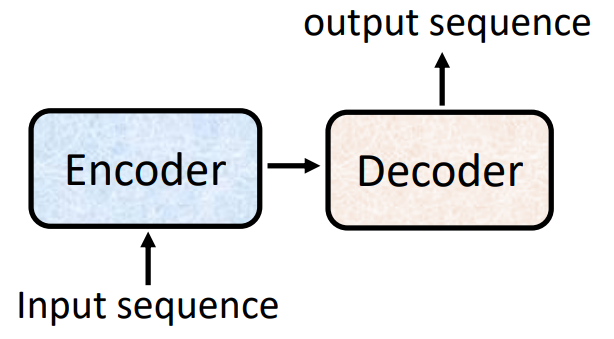

## 整体结构

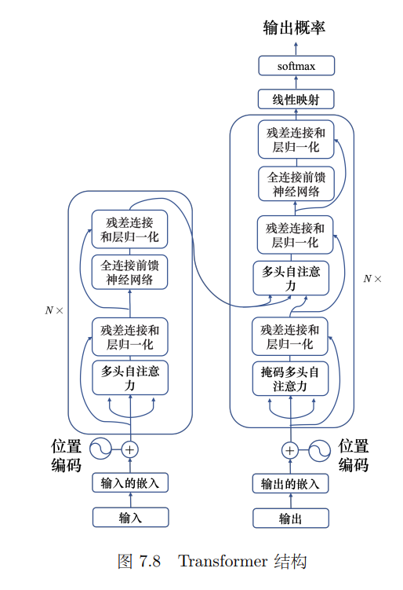

## encoder部分

接下来介绍下 Transformer 的编码器。如图 7.9 所示，编码器输入一排向量，输出另外一排 向量。自注意力、循环神经网络、卷积神经网络都能输入一排向量，输出一排向量。Transformer 的编码器使用的是自注意力，输入一排向量，输出另外一个同样长度的向量。 如图 7.10 所示，编码器里面会分成很多的块（block），每一个块都是输入一排向量，输 出一排向量。输入一排向量到第一个块，第一个块输出另外一排向量，以此类推，最后一个块 会输出最终的向量序列。

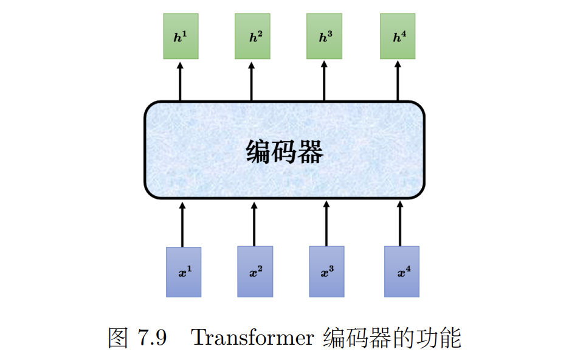

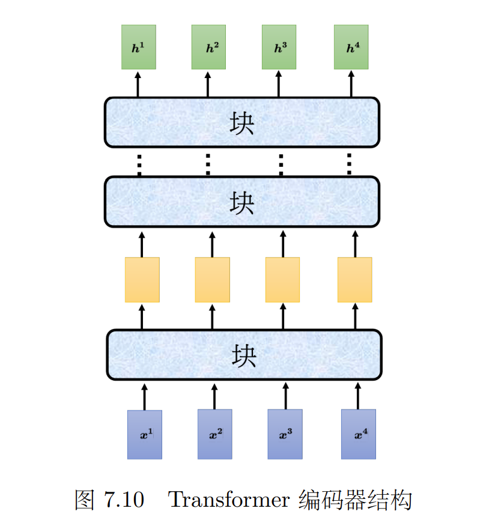

Transformer 的编码器的每个块并不是神经网络的一层，每个块的结构如图 7.11 所示，在 每个块里面，输入一排向量后做自注意力，考虑整个序列的信息，输出另外一排向量。接下来 这排向量会“丢”到全连接网络网络里面，输出另外一排向量，这一排向量就是块的输出，事实 上在原来的 Transformer 里面做的事情是更复杂的。

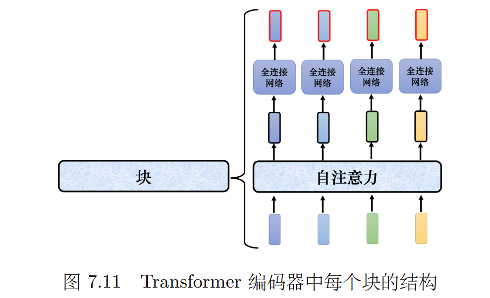

Transformer 里面加入了残差连接（residual connection）的设计，如图 7.12 所示，最 左边的向量 b 输入到自注意力层后得到向量 a，输出向量 a 加上其输入向量 b 得到新的输 出。得到残差的结果以后，再做层归一化（layer normalization）。层归一化比信念网络更简 单，不需要考虑批量的信息，而批量归一化需要考虑批量的信息。层归一化输入一个向量，输 出另外一个向量。层归一化会计算输入向量的平均值和标准差。输入向量 x里面每一个维度减掉均值 m，再除以标准差 σ 以后得到 x ′ 就是层归一化的输出，如式 (7.1) 所示。得到层归一化的输出以后，该输出才是全连接网络的输入。输入到全连接网络，还有一 个残差连接，把全连接网络的输入跟它的输出加起来得到新的输出。接着把残差的结果再做 一次层归一化得到的输出才是 Transformer 编码器里面一个块的输出。

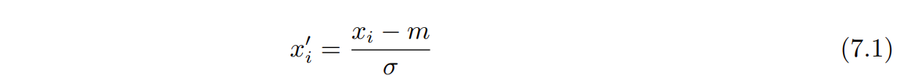

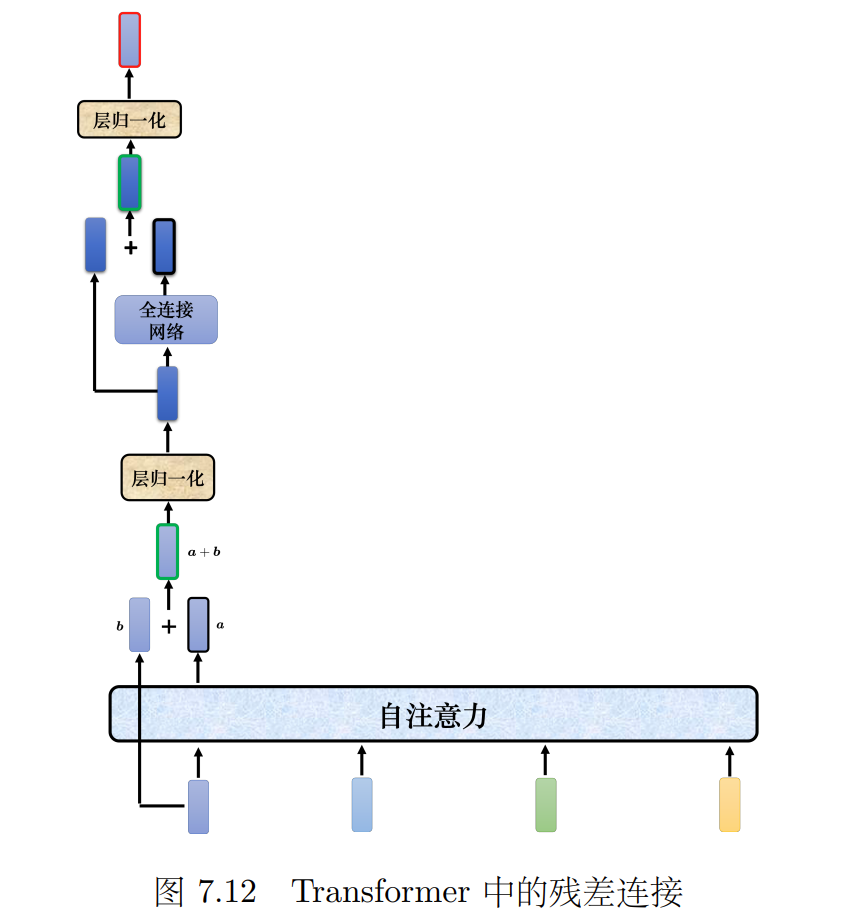

图 7.13 给出了 Transformer 的编码器结构，其中 N× 表示重复 N 次。首先，在输入的 地方需要加上位置编码。如果只用自注意力，没有位置的信息，所以需要加上位置信息。多头 自注意力就是自注意力的块。经过自注意力后，还要加上残差连接和层归一化。接下来还要经 过全连接的前馈神经网络，接着再做一次残差连接和层归一化，这才是一个块的输出，这个块 会重复 N 次。

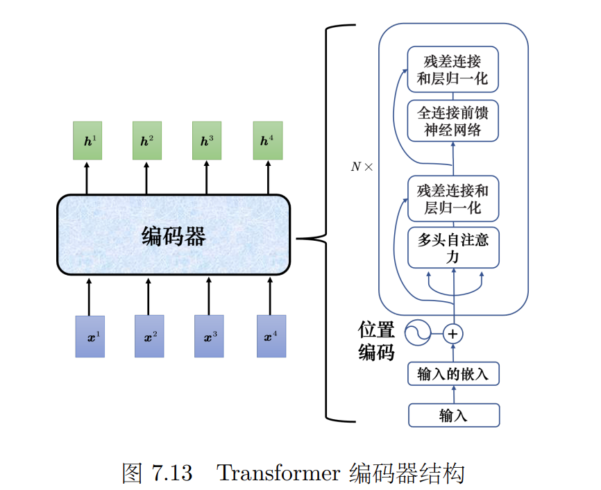

## 为什么要这么设计encoder的网络结构？

Transformer 的编码器其实不一定要这样设计，论文“On Layer Normalization in the Transformer Architecture”提出了另一种设计，结果比原始的 Transformer 要好。原始 的 Transformer 的架构并不是一个最优的设计，永远可以思考看看有没有更好的设计方式。

## 批量归一化与层归一化的区别

> Q: 为什么 Transformer 中使用层归一化，而不使用批量归一化？
>
>  A: 论文“PowerNorm: Rethinking Batch Normalization in Transformers”解释了在 Transformers 里面批量归一化不如层归一化的原因，并提出能量归一化（power normalization）。能量归一化跟层归一化性能差不多，甚至好一点。

批量归一化（Batch Normalization，BN）和层归一化（Layer Normalization，LN）都是深度学习中常用的归一化方法，用于加速训练并提高模型的表现，但它们在实现上有一些关键的区别：

### 1. **批量归一化（Batch Normalization，BN）**
- **归一化的维度**：批量归一化是在一个小批量（batch）的数据上进行归一化。具体来说，它会对每个特征在整个批量中的值进行均值和方差的归一化，即对每个特征维度进行处理。

- **适用场景**：批量归一化适用于使用 mini-batch 梯度下降的情况。它利用了批量数据之间的统计信息，计算批量中每个特征的均值和方差，并用这些统计量对数据进行归一化。

- **公式**：  
  对于每个小批量的样本 \( X \)，批量归一化会对每个特征 \( $x_i$ \) 进行归一化：
  $$
  \hat{x_i} = \frac{x_i - \mu_B}{\sqrt{\sigma_B^2 + \epsilon}}
  $$
  
  其中 \( $\mu_B$ \) 和 \($ \sigma_B^2 $\) 分别是批量内每个特征的均值和方差，\( $\epsilon$ \) 是一个小的常数，用于防止除零错误。
  
- **优点**：可以加速训练过程，减小梯度消失问题，并对网络稳定性有帮助。

- **缺点**：在处理小批量或者在线学习时，批量归一化效果不佳，因为它依赖于整个批量的数据统计信息。

### 2. **层归一化（Layer Normalization，LN）**
- **归一化的维度**：层归一化是在单个样本的特征维度上进行归一化，即对于每个输入样本，计算该样本所有特征的均值和方差来进行归一化。
- **适用场景**：层归一化常用于循环神经网络（RNN）等模型，尤其适用于批量大小较小或批量大小为1的情况。
- **公式**：  
  对于每个样本 \( x \)，层归一化会对该样本的所有特征 \( $x_i$ \) 进行归一化：
  $$
  \hat{x_i} = \frac{x_i - \mu_L}{\sqrt{\sigma_L^2 + \epsilon}}
  $$
  
  其中 \( $\mu_L $\) 和 \( $\sigma_L^2$ \) 分别是样本中每个特征的均值和方差，\( $\epsilon$ \) 同样是防止除零的常数。
- **优点**：不依赖批量数据，适合小批量或单个样本的情况，尤其是在时间序列数据和RNN中表现更好。
- **缺点**：不如批量归一化在某些情况下能显著加速训练，可能对训练效果的提升较少。

你的疑问很有道理，确实在一些情况下，“特征”和“维度”这两个词容易混淆。让我来澄清一下：

在神经网络中，**特征（feature）** 和 **维度（dimension）** 通常是同一个概念，但在不同的上下文中，这两个词的使用可能会有所区别。我们来看一下批量归一化和层归一化中的具体定义。

### 1. **批量归一化（Batch Normalization）**
- 这里的“特征”指的是 **每个输入样本** 中的 **每一维数据**。例如，如果输入是一个 \( $N \times D$ \) 的矩阵（其中 \( N \) 是样本数量，\( D \) 是特征维度数），那么每个特征对应的是矩阵中的一个列（即每个维度）。批量归一化会对每个特征 **在所有样本** 中进行归一化。
  
  比如：  
  假设样本是一个二维矩阵：
  $$
  \begin{bmatrix}
  x_1^{(1)} & x_2^{(1)} & \cdots & x_D^{(1)} \\
  x_1^{(2)} & x_2^{(2)} & \cdots & x_D^{(2)} \\
  \vdots & \vdots & \ddots & \vdots \\
  x_1^{(N)} & x_2^{(N)} & \cdots & x_D^{(N)} \\
  \end{bmatrix}
  $$
  
  在批量归一化中，针对每个特征（比如第 \( 1 \) 列、第 \( 2 \) 列等），我们会在 **整个批量** 的样本中计算该特征的均值和方差，然后进行归一化。

### 2. **层归一化（Layer Normalization）**
- 层归一化是在 **每个样本** 上进行归一化，且归一化的对象是该样本的 **所有特征**。也就是说，对于每个样本，我们会在它的所有特征维度上计算均值和标准差，然后进行归一化。

  比如：
  假设输入是一个样本 \($ x = [x_1, x_2, \dots, x_D]$ \)，其中 \( D \) 是特征的数量。层归一化会对这个样本 \( x \) 的所有特征维度进行归一化。它会计算 \( $x_1, x_2, \dots, x_D$ \) 的均值和标准差，然后用这些统计量对所有特征进行归一化。

你提到的“特征”与“维度”可能让你感到困惑，实际上在神经网络中，它们通常是指同一件事，但有时为了区分不同操作，称其为“维度”会更清晰。简单来说，批量归一化是对不同 **样本** 中的 **每个特征**（也就是每个维度）进行归一化，层归一化是对每个 **样本** 的 **所有特征** 进行归一化，计算的是这个样本所有特征的均值和标准差。

## decoder部分

解码器比较常见的称为自回归的（autoregressive）解码器。

### 自回归解码器

以语音识别为例，输入一段声音，输出一串文字。如图 7.14 所示，把一段声音（“机器学 习”）输入给编码器，输出会变成一排向量。接下来解码器产生语音识别的结果，解码器把编码 器的输出先“读”进去。要让解码器产生输出，首先要先给它一个代表开始的特殊符号 `<BOS>`， 即 Begin Of Sequence，这是一个特殊的词元（token）。在词表（vocabulary）里面，在本来解 码器可能产生的文字里面多加一个特殊的符号 。在机器学习里面，假设要处理自然语 言处理的问题，每一个词元都可以用一个独热的向量来表示。独热向量其中一维是 1，其他都 是 0，所以  也是用独热向量来表示，其中一维是 1，其他是 0。接下来解码器会“吐” 出一个向量，该向量的长度跟词表的大小是一样的。在产生这个向量之前，跟做分类一样，通 常会先进行一个 softmax 操作。这个向量里面的分数是一个分布，该向量里面的值全部加起 来，总和是 1。这个向量会给每一个中文字一个分，分数最高的中文字就是最终的输出。“机” 的分数最高，所以“机”就当做是解码器的第一个输出。

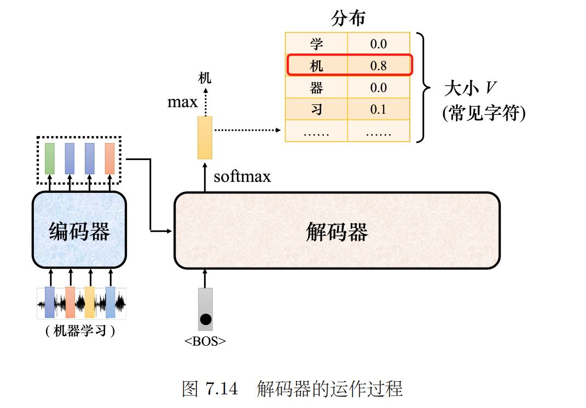

> Q: 解码器输出的单位是什么?
>
>  A: 假设做的是中文的语音识别，解码器输出的是中文。词表的大小可能就是中文的方 块字的数量。常用的中文的方块字大概两三千个，一般人可能认得的四、五千个，更多 都是罕见字。比如我们觉得解码器能够输出常见的 3000 个方块字就好了，就把它列在 词表中。不同的语言，输出的单位不见不会不一样，这取决于对语言的理解。比如英语， 选择输出英语的字母。但字母作为单位可能太小了，有人可能会选择输出英语的词汇， 英语的词汇是用空白作为间隔的。但如果都用词汇当作输出又太多了，有一些方法可 以把英语的字首、字根切出来，拿字首、字根当作单位。中文通常用中文的方块字来当 作单位，这个向量的长度就跟机器可以输出的方块字的数量是一样多的。每一个中文 的字都会对应到一个数值。

如图 7.15 所示，接下来把“机”当成解码器新的输入。根据两个输入：特殊符号 `<BOS>`。和“机”，解码器输出一个蓝色的向量。蓝色的向量里面会给出每一个中文字的分数，假设“器” 的分数最高，“器”就是输出。解码器接下来会拿“器”当作输入，其看到了`<BOS>` 、“机”、“器”， 可能就输出“学”。解码器看到 `<BOS>`、“机”、“器”、“学”，它会输出一个向量。这个向量里面“习” 的分数最高的，所以它就输出“习”。这个过程就反复地持续下去。

解码器的输入是它在前一个时间点的输出，其会把自己的输出当做接下来的输入，因此 当解码器在产生一个句子的时候，它有可能看到错误的东西。如图 7.16 所示，如果解码器有 语音识别的错误，它把机器的“器”识别错成天气的“气”，接下来解码器会根据错误的识别结果 产生它想要产生的期待是正确的输出，这会造成误差传播（error propagation）的问题，一步 错导致步步错，接下来可能无法再产生正确的词汇。

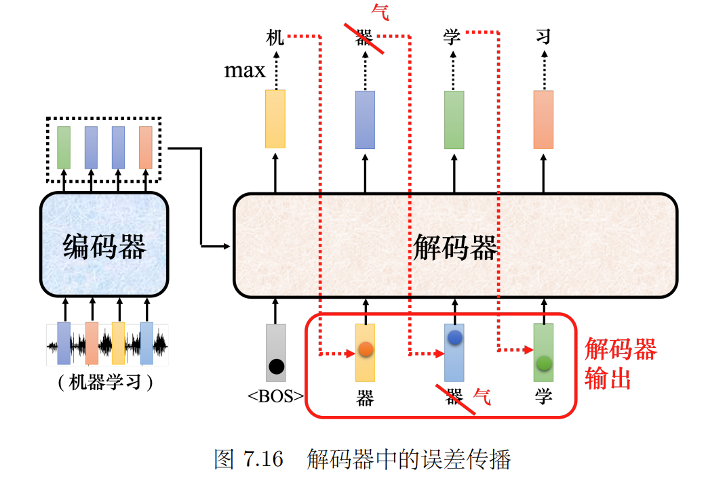

Transformer 里面的解码器内部的结构如图 7.17 所示。类似于编码器，解码器也有多头 注意力、残差连接和层归一化、前馈神经网络。解码器最后再做一个 softmax，使其输出变成 一个概率。此外，解码器使用了掩蔽自注意力（masked self-attention），掩蔽自注意力可以通过一个掩码（mask）来阻止每个位置选择其后面的输入信息。

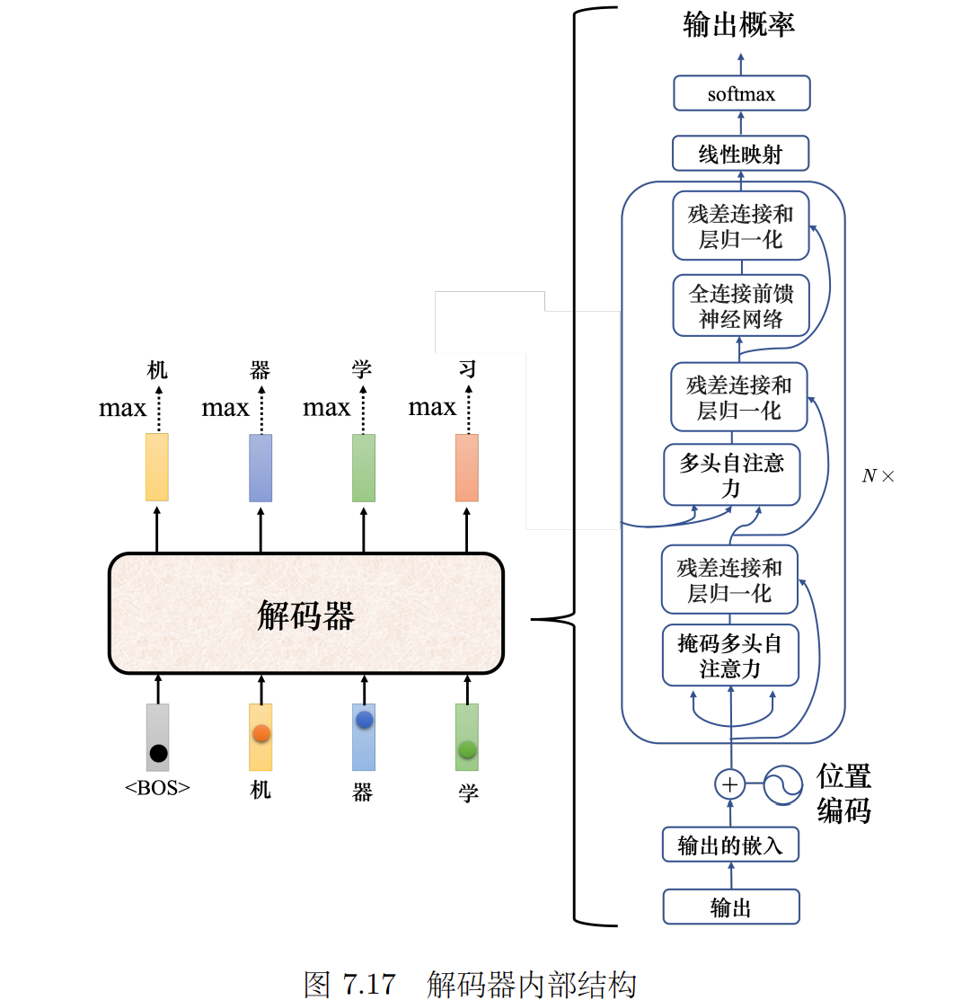

如图 7.18 所示，原来的自注意力输入一排向量，输出另外一排向量，这一排中每个向量 都要看过完整的输入以后才做决定。根据 a 1 到 a 4 所有的信息去输出 b 1。掩蔽自注意力的不 同点是不能再看右边的部分，如图 7.19 所示，产生 b 1 的时候，只能考虑 a 1 的信息，不能再 考虑 a 2、a 3、a 4。产生 b 2 的时候，只能考虑 a 1、a 2 的信息，不能再考虑 a 3、a 4 的信息。产 生 b 3 的时候，不能考虑 a 4 的信息。产生 b 4 的时候，可以用整个输入序列的信息。

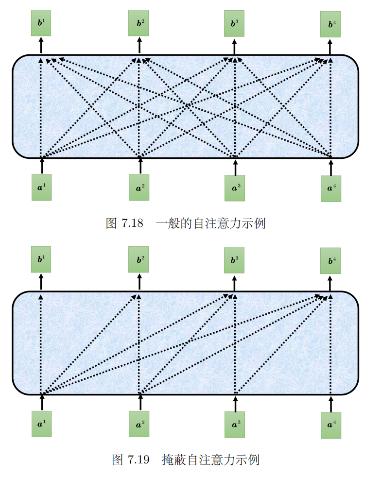

一般自注意力产生 b 2 的过程如图 7.20 所示。掩蔽自注意力的计算过程如图 7.21 所示， 我们只拿 q 2 和 k 1、k 2 计算注意力，最后只计算 v 1 跟 v 2 的加权和。不管 a 2 右边的地方， 只考虑 a 1、a 2、q 1、q 2、k 1 以及 k 2。输出 b 2 的时候，只考虑了 a 1 和 a 2，没有考虑到 a 3 和 a 4。

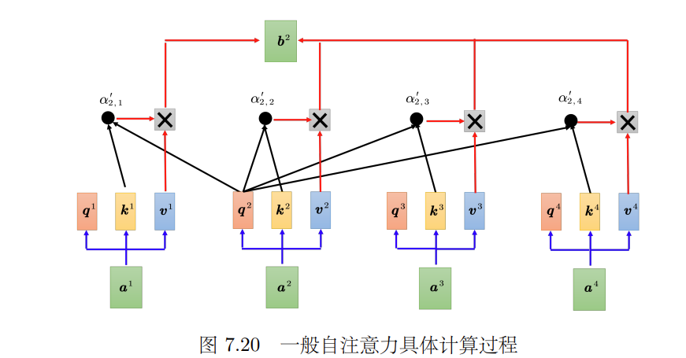

> Q: 为什么需要在注意力中加掩码? 
>
> A: 一开始解码器的输出是一个一个产生的，所以是先有 a 1 再有 a 2，再有 a 3，再有 a 4。这跟原来的自注意力不一样，原来的自注意力 a 1 跟 a 4 是一次整个输进去模型里 面的。编码器是一次把 a 1 跟 a 4 都整个都读进去。但是对解码器而言，先有 a 1 才有 a 2，才有 a 3 才有 a 4。所以实际上当我们有 a 2，要计算 b 2 的时候，没有 a 3 跟 a 4 的， 所以无法考虑 a 3 a 4。解码器的输出是一个一个产生的，所以只能考虑其左边的东西， 没有办法考虑其右边的东西。

了解了解码器的运作方式，但这还有一个非常关键的问题：实际应用中输入跟输出长度 的关系是非常复杂的，我们无法从输入序列的长度知道输出序列的长度，因此解码器必须决 定输出的序列的长度。给定一个输入序列，机器可以自己学到输出序列的长度。但在目前的解 码器运作的机制里面，机器不知道什么时候应该停下来，如图 7.22 所示，机器产生完“习”以 后，还可以继续重复一模一样的过程，把“习”当做输入，解码器可能就会输出“惯”，接下来就 一直持续下去，永远都不会停下来。

 如图 7.23 所示，要让解码器停止运作，需要特别准备一个特别的符号`<EOS>` 。产生完 “习”以后，再把“习”当作解码器的输入以后，解码器就要能够输出 `<EOS>`，解码器看到编码 器输出的嵌入、`<BOS>`、“机”、“器”、“学”、“习”以后，其产生出来的向量里面  的概率 必须是最大的，于是输出`<BOS>`，整个解码器产生序列的过程就结束了。

### 非自回归解码器

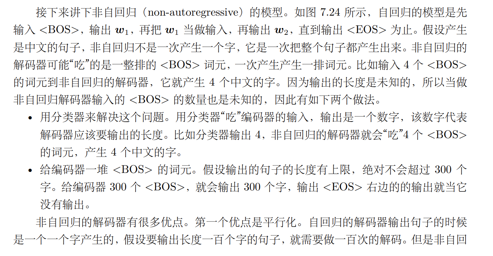

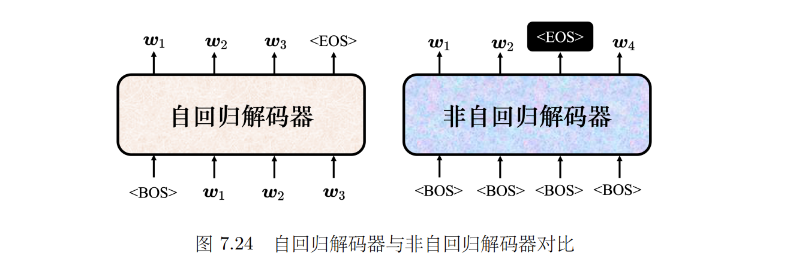

## encoder与decoder之间的信息通讯

编码器和解码器通过编码器-解码器注意力（encoder-decoder attention）传递信息，编码 器-解码器注意力是连接编码器跟解码器之间的桥梁。如图 7.25 所示，解码器中编码器-解码器注意力的键和值来自编码器的输出，查询来自解码器中前一个层的输出。

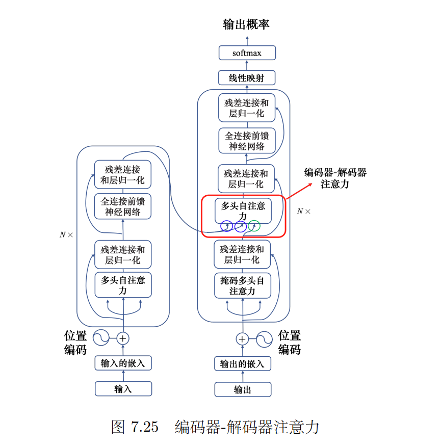

接下来介绍下编码器-解码器注意力实际的运作过程。如图 7.26 所示，编码器输入一排向 量，输出一排向量 a 1、a 2、a 3。接下来解码器会先“吃”`<BOS>`，经过掩蔽自注意力得到一个 向量。接下来把这个向量乘上一个矩阵，做一个变换（transform），得到一个查询 q，a 1、a 2、 a 3 也都产生键：k 1、k 2、k 3。把 q 跟 k 1、k 2、k 3 去计算注意力的分数，得到 α1、α2、α3， 接下来做 softmax，得到 α′ 1、α′ 2、α′ 3。接下来通过式 (7.2) 可得加权和 v。

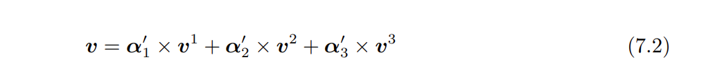

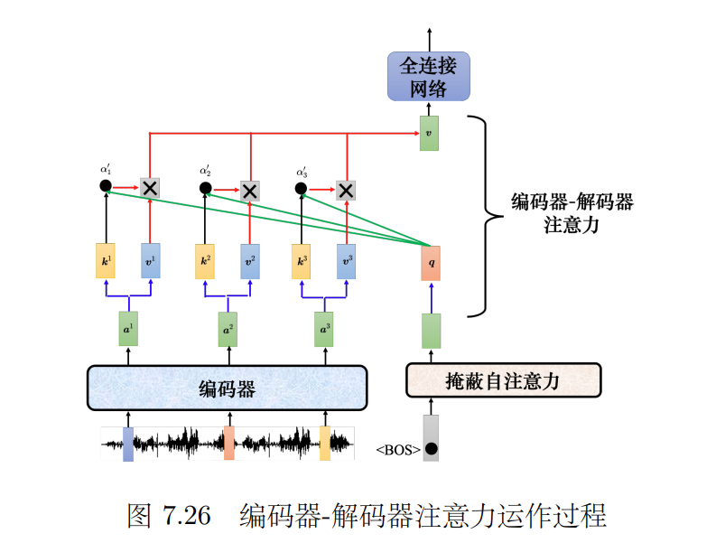

v 接下来会“丢”给全连接网络，这个步骤 q 来自于解码器，k 跟 v 来自于编码器，该步 骤就叫做编码器-解码器注意力，所以解码器就是凭借着产生一个 q，去编码器这边抽取信息 出来，当做接下来的解码器的全连接网络的输入。

如图 7.27 所示，假设产生“机”，输入`<BOS>`  、“机”，产生一个向量。这个向量一样乘上 一个线性变换得到一个查询 q ′。q ′ 会跟 k 1、k 2、k 3 计算注意力的分数。接着用注意力分数 跟 v 1、v 2、v 3 做加权和，加起来得到 v ′，最后交给全连接网络处理。编码器和解码器都有很多层，但在原始论文中解码器是拿编码器最后一层的输出。但不 一定要这样，读者可参考论文“Rethinking and Improving Natural Language Generation with Layer-Wise Multi-View Decoding” [4]。

## 如何训练Transformer

如图 7.28 所示，Transformer 应该要学到听到“机器学习”的声音信号，它的输出就是“机 器学习”这四个中文字。把`<BOS>` 丢给编码器的时候，其第一个输出应该要跟“机”越接近越好。而解码器的输出是一个概率的分布，这个概率分布跟“机”的独热向量越接近越好。因此我 们会去计算标准答案（Ground Truth）跟分布之间的交叉熵，希望该交叉熵的值越小越好。 每一次解码器在产生一个中文字的时候做了一次类似分类的问题。假设中文字有四千个，就 是做有四千个类别的分类的问题。

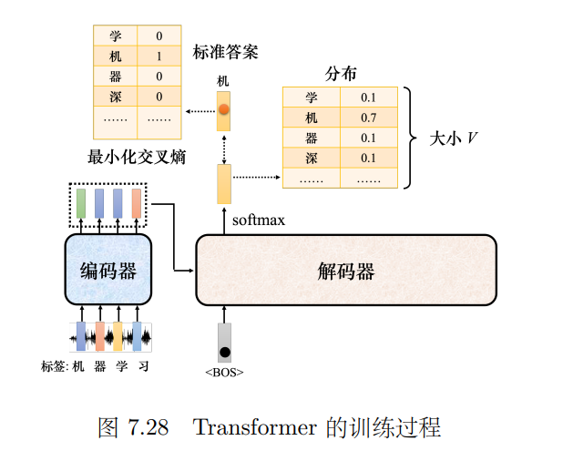


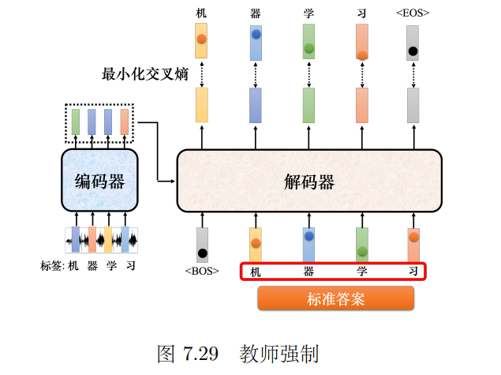

teacher forcing 有点类似于单向的RNN。

# Auto-encoder

在讲自编码器（autoencoder）之前，其实自编码器也可以算是自监督学习的一环，因 此我们可以再简单回顾一下自监督学习的框架。

如图 11.1 所示，首先你有大量的没有标注的 数据，用这些没有标注的数据，你可以去训练一个模型，你必须设计一些不需要标注数据的 任务，比如说做填空题或者预测下一个词元等等，这个过程就是自监督学习，有时也叫做预训 练。用这些不用标注数据的任务学完一个模型以后，它可能本身没有什么作用，比如 BERT 模型只能做填空题，GPT 模型只能够把一句话补完，但是你可以把它用在其他下游的任务里 面。


自编码器的原理，以图像为例，如图 11.2 所示，假设我们有非常大量的图片，在自编码器 里面有两个网络，一个叫做编码器，另外一个叫做解码器，它们是不同的两个网络。编码器把 一张图片读进来，它把这张图片变成一个向量，编码器可能是很多层的卷积神经网络（CNN）， 把一张图片读进来，它的输出是一个向量，接下来这个向量会变成解码器的输入。而解码器会 产生一张图片，所以解码器的网络架构可能会像是 GAN 里面的生成器，它是比如 11 个向量 输出一张图片。 训练的目标是希望编码器的输入跟解码器的输出越接近越好。换句话说，假设你把图片 看作是一个很长的向量的话，我们就希望这个向量跟解码的输出，这个向量，这两个向量他们的距离越接近越好，也有人把这件事情叫做重构（reconstruction）。因为我们就是把一张 图片，压缩成一个向量，接下来解码器要根据这个向量，重建出原来的图片，希望原输入的结 果跟重建后的结果越接近越好。

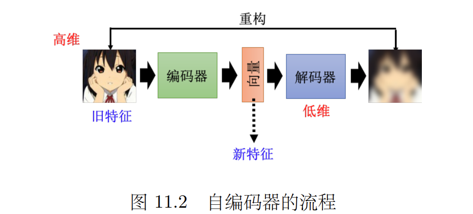

怎么把训练好的自编码器用在下游的任务里面呢？常见的用法就是把原来的图片可以看 成是一个很长的向量，但这个向量太长了不好处理，这是把这个图片丢到编码器以后，输出 另外一个向量，这个向量我们会让它比较短，比如说只有 10 维或者 100 维。接着拿这个新的 向量来做接下来的任务，也就是图片不再是一个很高维度的向量，它通过编码器的压缩以后， 变成了一个低维度的向量，我们再拿这个低维度的向量，来做接下来想做的事情，这就是自编 码器用在下游任务的常见做法。 

由于通常编码器的输入是一个维度非常高的向量，而其输出也就是我们的嵌入（也称为 表示或编码），其是一个非常低维度的向量。比如输入是 100 × 100 的图片，100 × 100 那就是 1 万维的向量。如果是 RGB 那就是 3 万维的向量，但是通常编码器我们会设得很小，比如说 10、100 这样的量级，所以这个这边会有一个特别窄的部分，本来输入是很宽的，输出也是很 宽的，但是中间特别窄，因此这一段就叫做瓶颈。而编码器做的事情，是把本来很高维度的东 西，转成低维度的东西，把高维度的东西转成低维度的东西又叫做降维。

## 为什么需要自编码器？

自编码器到底好在哪里？当我们把一个高维度的图片，变成一个低维度的向量的时候，到 底带来什么样的帮助呢？我们来设想一下，自编码器这件事情它要做的，是把一张图片压缩 又还原回来，但是还原这件事情为什么能成功呢？如图 11.3 所示，假设本来图片是 3 × 3 的 维度，此时我们要用 9 个数值来描述一张 3 × 3 的图片，假设编码器输出的这个向量是二维 的，我们怎么才可能从二维的向量去还原 3 × 3 的图片，即还原这 9 个数值呢？怎么有办法把 9 个数值变成 2 个数值，又还原成 3，又还原回 9 个数值呢？

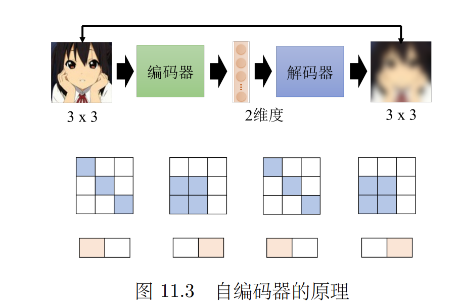

能够做到这件事情是因为，对于图像来说，并不是所有 3 × 3 的矩阵都是图片，图片的变 化其实是有限的，你随便采样一个随机的噪声，随便采样一个矩阵出来，它通常都不是你会 看到的图片。举例来说，假设图片是 3 × 3 的，那它的变化，虽然表面上应该要有 3 × 3 个数 值，才能够描述 3 × 3 的图片，但是也许它的变化实际上是有限的。也许我们把图片收集起来 发现，它实际上只有如图 11.3 所示的白色和橙色方块两种类型。一般在训练的时候就会看到 这种状况，就是因为图片的变化还是有限的。

因此我们在做编码器的时候，有时只用两个维度 就可以描述一张图片，虽然图片是 3 × 3，应该用 9 个数值才能够储存，但是实际上它的变化 也许只有两种类型，那你就可以说看到这种类型，我就左边这个维度是 1 ，右边是 0，看到这 种类型就左边这个维度是 0，右边这个维度是 1。

 而编码器做的事情就是化繁为简，有时本来比较复杂的东西，它实际上只是表面上看起 来复杂，而本身的变化是有限的。我们只需要找出其中有限的变化，就可以将它本来比较复杂 的东西用更简单的方法来表示。如果我们可以把复杂的图片，用比较简单的方法来表示它，那 我们就只需要比较少的训练数据，在下游的任务里面，我们可能就只需要比较少的训练数据， 就可以让机器学到，这就是自编码器的概念。

## 去噪自编码器

自编码器有一个常见的变体，叫做去噪自编码器（denoising autoencoder）。如图 11.4 所示，去噪自编码器就是把原来需要输入到编码器的图片，加上一些噪声，然后一样地通过编 码器，再通过解码器，试图还原原来的图片。

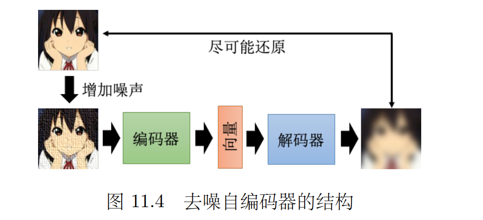

我们现在还原的，不是编码器的输入，编码器的输入的图片是有加噪声的，我们要还原的 不是加入噪声之前的结果。所以我们会发现现在编码器跟解码器，除了还原原来的图片这个 任务以外，它还多了一个任务，这个任务就是它必须要自己学会把噪声去掉。编码器看到的 是有加噪声的图片，但解码器要还原的目标是，没有加噪声的图片，所以编码器加上解码器， 他们合起来必须要联手能够把噪声去掉，这样你才能够把去噪的自编码器训练出来。

## 自编码器之特征解耦

自编码器可应用于在特征解耦（feature disentanglement）。解耦是指把一堆本来纠缠 在一起的东西把它解开。为什么需要解耦？我们先看一下自编码器做的事情，如图 11.6 所示， 如果是图片的话，就是把一张图片变成一个编码，再把编码变回图片，既然这个编码可以变回图片，代表说这个编码里面有很多的信息，包含图片里面所有的信息。举例来说，图片里面 的色泽、纹理等等。自编码器这个概念也不是只能用在图像上，如果用在语音上，可以把一段 声音丢到编码器里面，变成向量再丢回解码器，变回原来的声音，代表这个向量包含了语音 里面所有重要的信息，包括这句话的内容是什么，就是编码器的信息，还有这句话是谁说的， 就是语者的信息。如果是一篇文章，丢到编码器里面变成向量，这个向量通过解码器会变回原 来的文章，那这个向量里面有什么，它可能包含文章里面，文句的句法的信息，也包含了语义 的信息，但是这些信息是全部纠缠在一个向量里面，我们并不知道一个向量的哪些维度代表 了哪些信息。

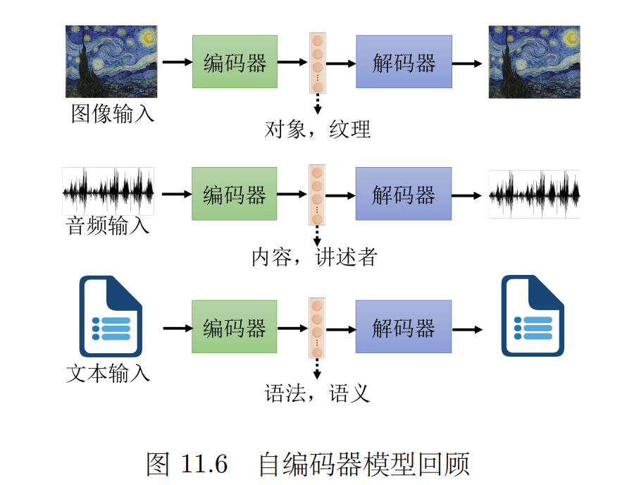

而特征解耦想要做到的事情就是，我们有没有可能想办法，在训练一个自编码器的时候， 同时有办法知道嵌入（又称为表征或编码）的哪些维度代表了哪些信息。比如 100 维的向量， 知道前 50 维就代表了这句话的内容，后 50 维就代表了这句话说话人的特征，这种对应的技 术称为特征解耦。

再举一个特征解耦方面的应用，叫做语音转换，如图 11.7 所示。也许读者们没有听过语 音转换这个词汇，但是一定看过它的应用，它就相当于是柯南的领结变身器。阿笠博士在做这个变声期也就是语音转换的时候，需要成对的声音信号，也就是假设要把 A 的声音转成 B 的声音，就必须把 A 跟 B 都找来，叫他念一模一样的句子。

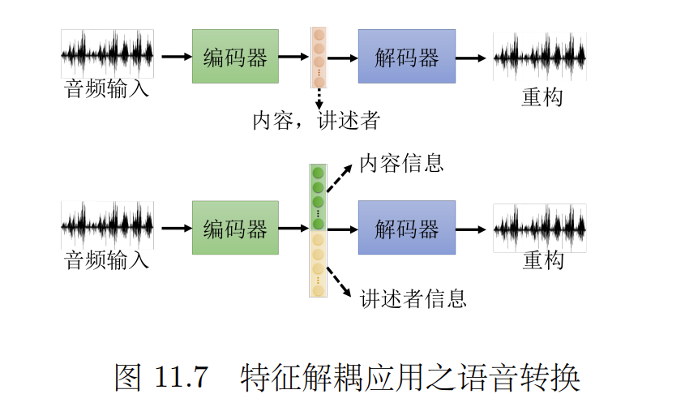

如图 11.8 所示，A 说好“How are you”，B 也说好“How are you”，A 说“Good morning”， B 也说“Good morning”，他们两个各说一样的句子，说个 1000 句，接下来就交给自监督学习 去训练了。即现在有成对的数据，训练一个自监督模型，把 A 的声音丢进去，输出就变成 B 的声音。但是如果 A 跟 B 都需要念一模一样的句子，念个 500 或者 1000 句，显然是不切实 际的。

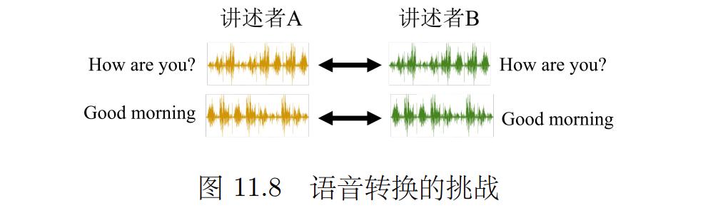

有了特征解耦的技术以后，我们可以期待机器做到，给它 A 的声音和 B 的声音，A 跟 B 不需要念同样的句子，甚至不需要讲同样的语言，机器也有可能学会把 A 的声音转成 B 的声 音。实际的做法如图 11.9 所示，假设收集到一大堆人类的声音信号，使用这堆声音信号训练 一个自编码器，同时又做了特征解耦，所以我们就知道了在编码器的输出里面，哪些维度代表 了语音的内容，哪些维度代表了讲述者的特征，这样就可以把两句话的声音跟内容的部分互 换。


举例来说，如图 11.10 所示，讲述者 A 的声音（“How are you？”）丢进编码器以后，就可 以知道这个编码器的输出里面，某些维度代表“How are you？”的内容，某些维度代表讲述者 A 的声音。把讲述者 B 的声音丢进编码器里面，它就知道某一些维度代表讲述者 B 说的话的 内容，某一些维度代表讲述者 B 声音的特征。接下来只要把讲述者 A 说话的内容的部分取出 来，把讲述者 B 说话的声音特征的部分取出来，把它拼起来，丢到解码器里面，就可以用讲述者 A 的声音，讲讲述者 B 说的话的内容。

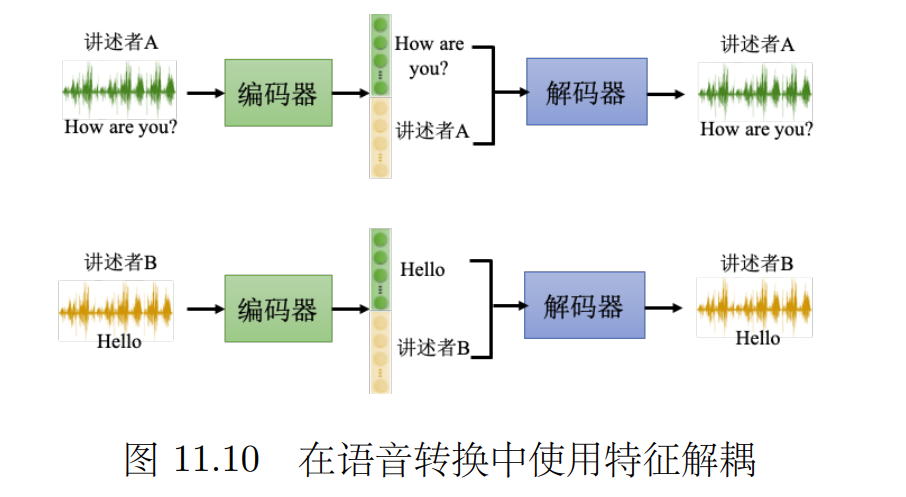

## 自编码器应用之离散隐表征

自编码器还可以用于离散隐表征。目前为止我们都假设嵌入是一个向量，这样就是一串 实数，那它可不可以是别的东西呢？如图 11.11 所示，它可以是二进制，好处就是每一个维度 就代表了某种特征的有无。比如输入的图片，如果是女生，可能第一维就是 1，男生第一维就 是 0；如果有戴眼镜，就是第三维是 1，没有戴眼镜第三维就是是 0。嵌入也可以变成二进制， 变成只有 0 跟 1 的数字，可以让我们在解释编码器输出的时候更为容易。嵌入也可以是独热 向量，只有一维是 1，其他就是 0。 

如果强迫嵌入是独热向量，也就是每一个东西图片丢进去，嵌入里面只可以有一维是 1， 其他都是 0，也许可以做到无监督的分类。比如我们想要做手写数字识别任务，有 0 到 9 的 图片，把这些图片统统收集起来训练一个自编码器，强迫中间的隐表征，也就是中间的这个编 码一定要是独热向量。这个编码正好设个 10 维，这 10 维就有 10 种可能的独热的编码，也许 每一种正好就对应到一个数字。因此如果用独热向量来当做嵌入，也许就可以做到完全在没 有标注数据的情况下让机器自动学会分类。

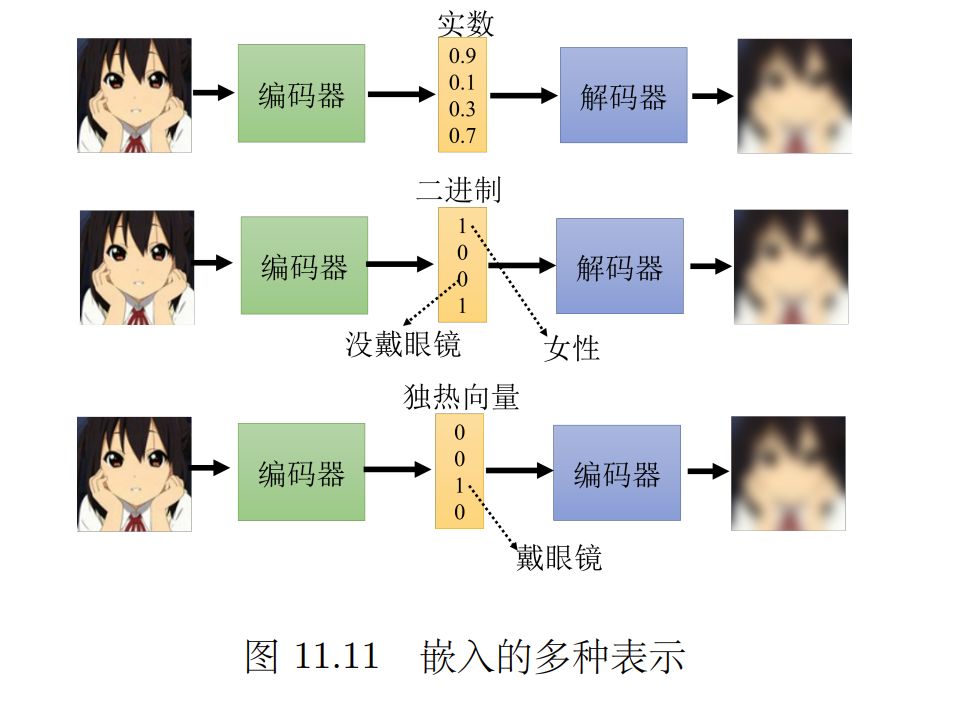

其实这种离散的表征技术中，最知名的就是向量量化变分自编码器（vector quantizedvariational autoencoder）。它运作的原理就是输入一张图片，然后编码器输出一个向量， 这个向量它是一般的向量，并且是连续的，但接下来有一个码本，所谓码本的意思就是一排向量，如图 11.12 所示。这排向量也是学出来的，把编码器的输出，去跟这排向量计算一个相似 度，然后就会发现这其实跟自注意力有点像，上面这个向量就是查询，下面这些向量就是键， 那接下来就看这些向量里面，谁的相似度最大，把相似度最大的那个向量拿出来，让这个键跟 那个值共用同一个向量。

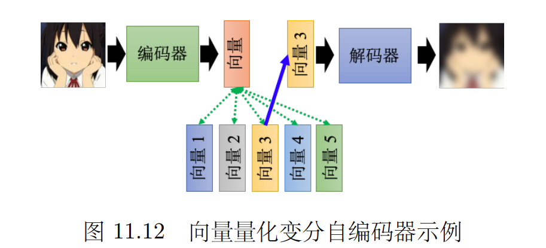

如果把这整个过程用自注意力机制来比喻的话，那就等于是键跟值是共同的向量，然后 把这个向量丢到解码器里面，然后要它输出一张图片，然后接下来训练时让输入跟输出越接 近越好。其中解码器，编码器和码本，都是一起从数据里面被学出来的，这样做的好处就是可 以有离散的隐表征，也就是说这边解码器的输入一定是那个码本里面的向量的其中一个。假 设码本里面有 32 个向量，那解码器的输入就只有 32 种可能，相当于让这个嵌入**编程离散**的， 它没有无穷无尽的可能，只有 32 种可能而已。

这种技术如果把它用在语音上，就是一段声音 信号输进来，通过编码器之后产生一个向量，接下来去计算这个相似度，把最像的那个向量拿 出来丢给解码器，再输出一样的声音信号，这个时候就会发现说其中的码本可以学到最基本 的发音部位。比如最基本的发音单位，又叫做语音，相当于英文的音标或者中文的拼音，而这 个码本里面每一个向量，它就对应到某一个发音，就对应到音标里面的某一个符号，这个就是 VQ-VAE 的原理。

## 降维方法

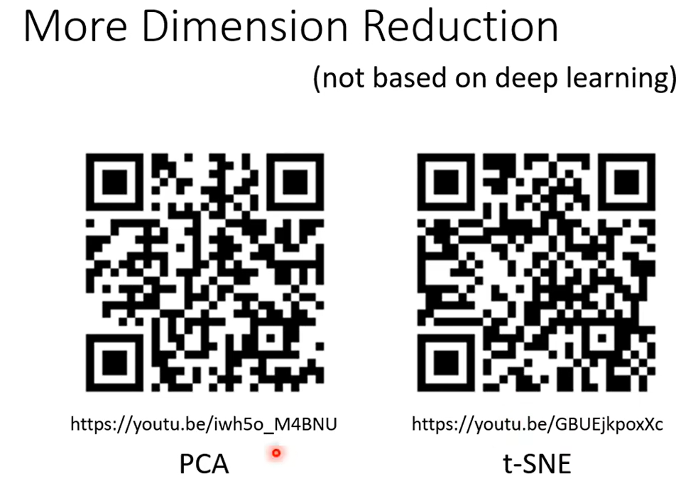

## Anomaly Detection

## VAE

由于原生图片很大，放入模型当中计算机会变得很大，由此将原生图片“压缩”至一个较小的维度，即潜在空间，学习模型使用数据量较小的潜在模型可以方便处理与计算。

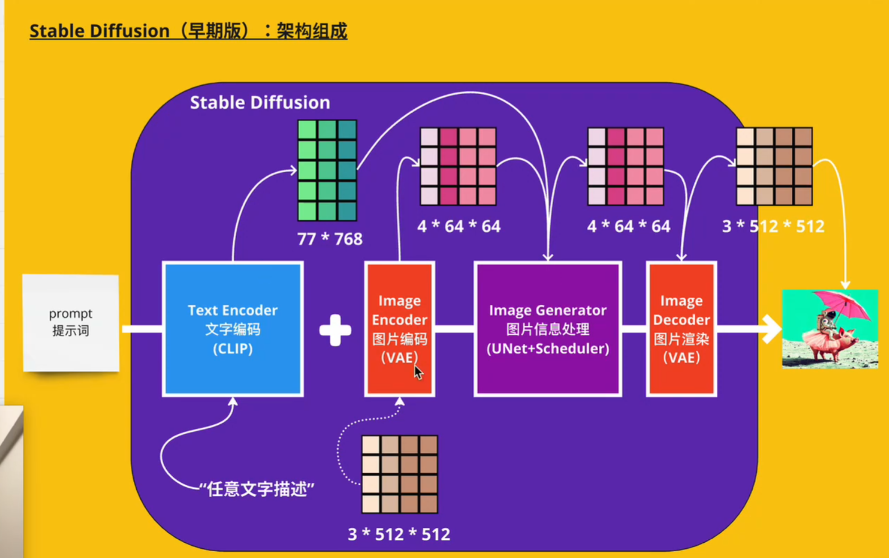

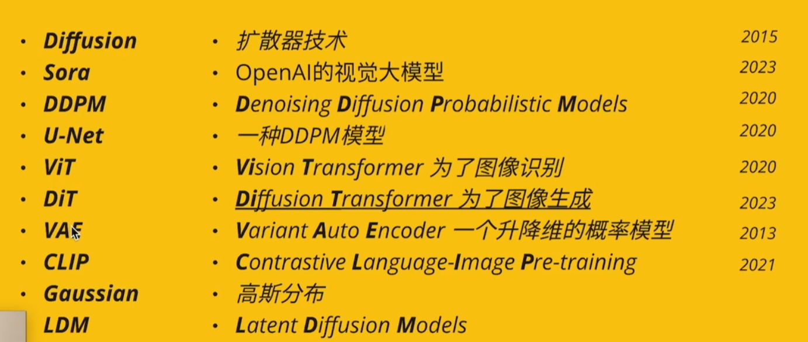

加载数据集我们使用了[pokemon](https://huggingface.co/datasets/svjack/pokemon-blip-captions-en-zh)的数据集：

```python
dataset = load_dataset("svjack/pokemon-blip-captions-en-zh", split="train")
```

显示图像：

```python
dataset[0]["image"].show()
```


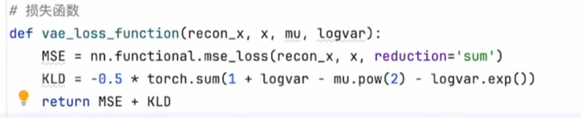

定义一个VAE模型：

```python
"""
一个非常简单的变分自编码器（VAE）模型教学，用于训练压缩和解压缩图像于潜在空间（Latent Space）。
Encoder和Decoder都是简单的卷积神经网络。
Encoder用于将图像压缩为潜在空间表示，Decoder用于将潜在空间表示解压缩还原到原始图像。

在这个例子中，我们将3x512x512的图像压缩到4x64x64的特征值，并进一步输出潜在空间表示向量 z。
"""
import torch
import torch.nn as nn

# VAE model
class VAE(nn.Module):
    def __init__(self, in_channels=3, latent_dim=4, image_size=512): # 3x512x512 -> 4x64x64
        super(VAE, self).__init__()
        self.in_channels = in_channels
        self.latent_dim = latent_dim
        self.image_size = image_size

        # Encoder
        # 3 x 512 x 512 -> 4 x 64 x 64
        self.encoder = nn.Sequential(
            self._conv_block(in_channels, 64),  # 64 x 256 x 256
            self._conv_block(64, 128),  # 128 x 128 x 128
            self._conv_block(128, 256),  # 256 x 64 x 64
        )

        # 编码器结束之后，将提取到的图像给一个学习模型进行学习
        # 解码器就是将学习模型学习到的图片扩大到原来的图像

        # Encoder 的潜在空间输出
        # 这里我们将卷积之后的256通道的图像再进行一次卷积到4通道
        self.fc_mu = nn.Conv2d(256, latent_dim, 1)  # 4 x 64 x 64 <- Latent Space
        self.fc_var = nn.Conv2d(256, latent_dim, 1)  # 4 x 64 x 64 <- Latent Space

        # Decoder
        # 4 x 64 x 64 -> 3 x 512 x 512
        self.decoder_input = nn.ConvTranspose2d(latent_dim, 256, 1)  # 256 x 64 x 64
        self.decoder = nn.Sequential(
            self._conv_transpose_block(256, 128),  # 128 x 128 x 128
            self._conv_transpose_block(128, 64),  # 64 x 256 x 256
            self._conv_transpose_block(64, in_channels),  # 3 x 512 x 512
        )

        self.sigmoid = nn.Sigmoid()  # [0, 1]
        self.tanh = nn.Tanh()  # [-1, 1]

    def _conv_block(self, in_channels, out_channels):
        return nn.Sequential(
            nn.Conv2d(in_channels, out_channels, 3, stride=2, padding=1),
            # nn.GroupNorm(num_groups=1, num_channels=out_channels),
            nn.BatchNorm2d(out_channels), # 进行批次的归一化（缩放像素值）
            # nn.LeakyReLU(),
            # 通过引入一个小的负斜率，允许负数输入也有非零输出，以避免标准 ReLU
            # 中可能导致的“神经元死亡”问题（即输入为负时神经元的输出总是0，导致某些神经元无法更新）。
            # 当输入大于 0 时，输出与标准 ReLU 一样，等于输入。
            nn.LeakyReLU(0.2) # RELU激活函数变体，
        )

    def _conv_transpose_block(self, in_channels, out_channels):
        return nn.Sequential(
            nn.ConvTranspose2d(in_channels, out_channels, 3, stride=2, padding=1, output_padding=1),
            # nn.Upsample(scale_factor=2, mode='bilinear', align_corners=True),
            # nn.Conv2d(in_channels, out_channels, 3, stride=1, padding=1),
            # nn.GroupNorm(num_groups=1, num_channels=out_channels),
            nn.BatchNorm2d(out_channels),
            # nn.LeakyReLU(),
            nn.LeakyReLU(0.2)
        )

    def encode(self, input):
        result = self.encoder(input)
        mu = self.fc_mu(result) # 均值
        log_var = self.fc_var(result) # 方差
        return mu, log_var

    def decode(self, z):
        result = self.decoder_input(z)
        result = self.decoder(result)
        # result = self.sigmoid(result)  # 如果原始图像被归一化为[0, 1]，则使用sigmoid
        result = self.tanh(result)  # 如果原始图像被归一化为[-1, 1]，则使用tanh
        # return result.view(-1, self.in_channels, self.image_size, self.image_size)
        return result

    # 可以计算每一个图像的损失值是多少
    # 这是一个数学技巧
    def reparameterize(self, mu, logvar):
        std = torch.exp(0.5 * logvar)
        eps = torch.randn_like(std)
        return eps * std + mu

    def forward(self, input):
        """
        返回4个值：
        reconstruction, input, mu, log_var
        """
        mu, log_var = self.encode(input)
        z = self.reparameterize(mu, log_var)  # 潜在空间的向量表达 Latent Vector z
        return self.decode(z), input, mu, log_var #返回值：解码器预测的图像，输入图像（真实值），均值，方差
```

模型训练：

```python
import torch
import torch.nn.functional as F
import torch.optim as optim
from torch import nn
from torch.utils.data import DataLoader
from torchvision import transforms
from torchvision.utils import save_image
from vae_model import VAE
from torch.optim.lr_scheduler import ReduceLROnPlateau, CosineAnnealingLR, OneCycleLR
import os
from datasets import load_dataset

# device = "cuda" if torch.cuda.is_available() else ("mps" if torch.backends.mps.is_available() else "cpu")
device = torch.device("cuda:0" if torch.cuda.is_available() else "cpu")
# 超参数
batch_size = 8
learning_rate = 1e-3
num_epochs = 200
image_size = 512
latent_dim = 4

# 需要安装 wandb 库，如果要记录训练过程可以打开下面的注释
# import wandb
# wandb.init(project="vae_from_scratch")
# wandb.config = {
#     "learning_rate": learning_rate,
#     "epochs": num_epochs,
#     "batch_size": batch_size,
#     "image_size": image_size,
#     "latent_dim": latent_dim
# }

# 加载数据集
dataset = load_dataset("svjack/pokemon-blip-captions-en-zh", split="train")
# dataset = load_dataset("imagefolder", split="train", data_dir="train_images/")  # 也可以这样加载本地文件夹的图片数据集

preprocess = transforms.Compose(
    [
        transforms.Resize((image_size, image_size)),  # 图片大小调整为 512 x 512 ，原图像比较大
        transforms.RandomHorizontalFlip(),  # 随机水平翻转
        transforms.RandomRotation(10),  # 随机旋转
        transforms.ColorJitter(brightness=0.2, contrast=0.2, saturation=0.2, hue=0.1),  # 随机颜色调整
        transforms.ToTensor(),  # 转换为张量
        transforms.Normalize((0.5, 0.5, 0.5), (0.5, 0.5, 0.5))  # 将像素值从 [0, 1] 转换到 [-1, 1]
    ]
)

def transform(examples):
    images = [preprocess(image.convert("RGB")) for image in examples["image"]]
    return {"images": images}


dataset.set_transform(transform)

train_dataset = dataset.select(range(0, 600)) # 前600个图像作为训练集
val_dataset = dataset.select(range(600, 800)) # 后几个作为验证集

train_dataloader = DataLoader(train_dataset, batch_size=batch_size, shuffle=True, drop_last=True)
val_dataloader = DataLoader(val_dataset, batch_size=batch_size, shuffle=False, drop_last=True)

# 初始化模型
vae = VAE(in_channels=3, latent_dim=latent_dim, image_size=image_size)
vae.to(device)

# 优化器和学习率调度器
optimizer = optim.AdamW(vae.parameters(), lr=learning_rate, weight_decay=1e-4)  # 可以考虑加入L2正则化：weight_decay=1e-4
# scheduler = ReduceLROnPlateau(optimizer, mode='min', factor=0.5, patience=10, min_lr=5e-5)
# scheduler = CosineAnnealingLR(optimizer, T_max=num_epochs) # 余弦退火学习率调度器
scheduler = OneCycleLR(optimizer, max_lr=1e-3, epochs=num_epochs, steps_per_epoch=len(train_dataloader))


# 自定义损失函数
"""
这个损失函数是用于变分自编码器（VAE）的训练。它由两部分组成：重构误差（MSE）和KL散度（KLD）。  
重构误差（MSE）：衡量重构图像 recon_x 和原始图像 x 之间的差异。使用均方误差（MSE）作为度量标准，计算两个图像之间的像素差异的平方和。  
KL散度（KLD）：衡量编码器输出的潜在分布 mu 和 logvar 与标准正态分布之间的差异。KL散度用于正则化潜在空间，使其接近标准正态分布。

:param recon_x: 重构图像
:param x: 原始图像
:param mu: 编码器输出的均值
:param logvar: 编码器输出的对数方差
:return: 总损失值 =（重构误差 + KL散度） <- 也可以调整加法的比重
"""
#
# def vae_loss_function(recon_x,x,mu,logvar):
#     MSE =torch.nn.functional.mse_loss(recon_x,x,reduction='sum')
#     KLD =-0.5*torch.sum(1+logvar-mu.pow(2)-logvar.exp())
#     return MSE + KLD

def vae_loss_function(recon_x, x, mu, logvar, kld_weight=0.1):
    batch_size = x.size(0)
    mse = F.mse_loss(recon_x, x, reduction='sum')
    kld = -0.5 * torch.sum(1 + logvar - mu.pow(2) - logvar.exp())
    # 总损失 - 用于优化
    total_loss = mse + kld_weight * kld
    # 每像素指标 - 用于监控
    mse_per_pixel = mse / (batch_size * x.size(1) * x.size(2) * x.size(3))
    kld_per_pixel = kld / (batch_size * x.size(1) * x.size(2) * x.size(3))

    return total_loss, mse, kld_weight * kld, mse_per_pixel, kld_per_pixel

# 创建保存生成测试图像的目录
os.makedirs('vae_results', exist_ok=True)

# 训练循环
for epoch in range(num_epochs):
    vae.train()
    train_loss = 0
    mse_loss_total = 0
    kl_loss_total = 0
    mse_vs_kld = 0
    for batch_idx, batch in enumerate(train_dataloader):

        data = batch["images"].to(device)  # [batch, 3, 512, 512] 的原始图像张量
        optimizer.zero_grad()

        recon_batch, _, mu, logvar = vae(data)  # 传递给VAE模型，获取重构图像、均值和对数方差
        loss, mse, kld, mse_per_pixel, kld_per_pixel = vae_loss_function(recon_batch, data, mu, logvar)  # 计算损失

        loss.backward()
        train_loss += loss.item()
        mse_vs_kld += mse_per_pixel / kld_per_pixel
        mse_loss_total += mse_per_pixel.item()
        kl_loss_total += kld_per_pixel.item()
        optimizer.step()
        scheduler.step()  # OneCycleLR 在每个批次后调用

    # scheduler.step()  # 除了 OneCycleLR 之外，其他调度器都需要在每个 epoch 结束时调用

    avg_train_loss = train_loss / len(train_dataloader.dataset)
    avg_mse_loss = mse_loss_total / len(train_dataloader.dataset)
    avg_kl_loss = kl_loss_total / len(train_dataloader.dataset)
    avg_mse_vs_kld = mse_vs_kld / len(train_dataloader)

    print(f'====> Epoch: {epoch} | Learning rate: {scheduler.get_last_lr()[0]:.6f}')
    print(f'Total loss: {avg_train_loss:.4f}')
    print(f'MSE loss (pixel): {avg_mse_loss:.6f} | KL loss (pixel): {avg_kl_loss:.6f}')

    # 验证集上的损失
    vae.eval()
    val_loss = 0
    with torch.no_grad():
        for batch_idx, batch in enumerate(val_dataloader):
            data = batch["images"].to(device)
            recon_batch, _, mu, logvar = vae(data)
            loss,_,_,_,_ = vae_loss_function(recon_batch, data, mu, logvar)
            val_loss += loss.item()

    val_loss /= len(val_dataloader.dataset)
    print(f'Validation set loss: {val_loss:.4f}')

    # 需要安装 wandb 库，如果要记录训练过程可以打开下面的注释
    # wandb.log({
    #     "epoch": epoch,
    #     "learning_rate": scheduler.get_last_lr()[0],
    #     "train_loss": avg_train_loss,
    #     "mse_per_pixel": avg_mse_loss,
    #     "kl_per_pixel": avg_kl_loss,
    #     "mse_vs_kld": avg_mse_vs_kld,
    #     "val_loss": val_loss,
    # })

    # 生成一些重构图像和可视化
    if epoch % 20 == 0:
        with torch.no_grad():
            # 获取实际的批次大小
            actual_batch_size = data.size(0)
            # 重构图像
            n = min(actual_batch_size, 8)
            comparison = torch.cat([data[:n], recon_batch.view(actual_batch_size, 3, image_size, image_size)[:n]])
            comparison = (comparison * 0.5) + 0.5  # 将 [-1, 1] 转换回 [0, 1]
            save_image(comparison.cpu(), f'vae_results/reconstruction_{epoch}.png', nrow=n)

            # 需要安装 wandb 库，如果要记录训练过程可以打开下面的注释
            # wandb.log({"reconstruction": wandb.Image(f'vae_results/reconstruction_{epoch}.png')})

torch.save(vae.state_dict(), 'vae_model.pth')
print("Training completed.")
# 需要安装 wandb 库，如果要记录训练过程可以打开下面的注释
# wandb.finish()
```

```python
"""
这段代码用于展示如何使用训练好的VAE模型对图像进行编码和解码。
用自己训练好的vae模型来压缩一张图片（pokemon_sample_test.png）到潜在空间，然后再还原到像素空间并可视化的过程。
需要通过train_vae.py训练好VAE模型并保存后，才能运行这段代码。
"""
import numpy as np
import torch
from PIL import Image
from matplotlib import pyplot as plt
from torchvision import transforms
from vae_model import VAE


# 超参数
device = "cuda" if torch.cuda.is_available() else ("mps" if torch.backends.mps.is_available() else "cpu")
image_size = 512
latent_dim = 4

# 加载一个随机的原始图像
image_path = "pokemon_sample_test.png"
original_image = Image.open(image_path)

preprocess = transforms.Compose(
    [
        transforms.Resize((image_size, image_size)),  # 图片大小调整为 512 x 512
        transforms.ToTensor(),  # 转换为张量
        transforms.Normalize((0.5, 0.5, 0.5), (0.5, 0.5, 0.5))  # 将像素值从 [0, 1] 转换到 [-1, 1]
    ]
)

def transform(examples):
    images = [preprocess(image.convert("RGB")) for image in examples["image"]]
    return {"images": images}

# 处理图片到3通道的RGB格式（防止有时图片是RGBA的4通道）
image_tensor = preprocess(original_image.convert("RGB")).unsqueeze(0).to(device)

mean_value = image_tensor.mean().item()
print(f"Mean value of image_tensor: {mean_value}")

# 加载我们刚刚预训练好的VAE模型
vae = VAE(in_channels=3, latent_dim=latent_dim, image_size=image_size).to(device)
vae.load_state_dict(torch.load('vae_model.pth', map_location=torch.device('cpu')))

# 使用VAE的encoder压缩图像到潜在空间
with torch.no_grad():
    mu, log_var = vae.encode(image_tensor)
    latent = vae.reparameterize(mu, log_var)

# 使用encoder的输出通过decoder重构图像
with torch.no_grad():
    reconstructed_image = vae.decode(latent)

# 显示原始图像
plt.figure(figsize=(10, 5))
plt.subplot(1, 2, 1)
plt.imshow(original_image)
plt.title("Original Image")
plt.axis('off')

# 显示重构图像
reconstructed_image = reconstructed_image.squeeze().cpu().numpy().transpose(1, 2, 0)
reconstructed_image = (reconstructed_image + 1) / 2  # 从[-1, 1]转换到[0, 1]
plt.subplot(1, 2, 2)
plt.imshow(reconstructed_image)
plt.title("Reconstructed Image")
plt.axis('off')

plt.show()

# 将潜在向量转换为可视化的图像格式
latent_image = latent.squeeze().cpu().numpy()

# 检查潜在向量的形状
if latent_image.ndim == 1:
    # 如果是1D的，将其reshape成2D图像
    side_length = int(np.ceil(np.sqrt(latent_image.size)))
    latent_image = np.pad(latent_image, (0, side_length**2 - latent_image.size), mode='constant')
    latent_image = latent_image.reshape((side_length, side_length))
elif latent_image.ndim == 3:
    # 如果是3D的，选择一个切片或进行平均
    latent_image = np.mean(latent_image, axis=0)

# 显示潜在向量图像
plt.imshow(latent_image, cmap='gray')
plt.title("Latent Space Image")
plt.axis('off')
plt.colorbar()
plt.show()

```

### 代码点补充

```python
LeakyReLU(0.2)
```

`LeakyReLU(0.2)` 是一种激活函数，它是 ReLU（Rectified Linear Unit）的变体。

ReLU 的标准形式是：
- 当输入大于 0 时，输出等于输入。
- 当输入小于等于 0 时，输出为 0。

`LeakyReLU` 通过引入一个小的负斜率，允许负数输入也有非零输出，以避免标准 ReLU 中可能导致的“神经元死亡”问题（即输入为负时神经元的输出总是0，导致某些神经元无法更新）。

`LeakyReLU(0.2)` 的作用是：
- 当输入大于 0 时，输出与标准 ReLU 一样，等于输入。
- 当输入小于等于 0 时，输出等于输入乘以 0.2（也就是有一个 0.2 的斜率）。

公式为：
$$
f(x) =
\begin{cases}
x, & \text{if } x > 0 \\
0.2 \cdot x, & \text{if } x \leq 0
\end{cases}
$$
在这种情况下，0.2 是负输入部分的斜率。

```python
def reparameterize(self, mu, logvar):
    std = torch.exp(0.5 * logvar)
    eps = torch.randn_like(std)
    return eps * std + mu
```

函数原理

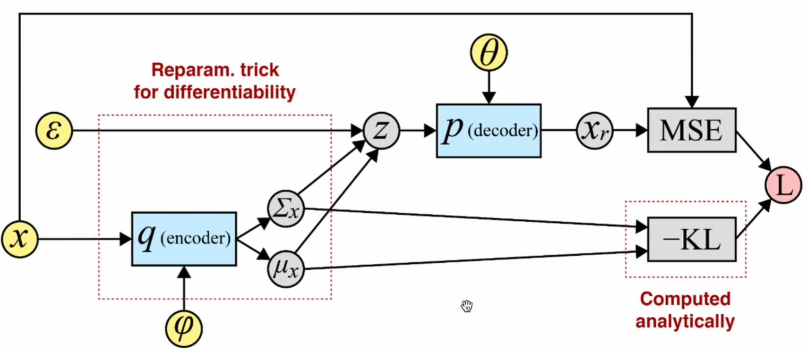

$x$代表输入的图像，$x$进入encoder（即在代码中定义的一系列卷积层）生成了$z$，即潜在空间，在这一过程中产生了方差$\sum x$与均值$\mu x$，待代码中对应着`encode`函数输出的`mu, log_var`。潜在空间$z$经过解码器还原到$x_r$，模型训练的目的就是让$x_r$近似$x$，比较这两个之间的差距就是使用MSE均方误差进行计算。

但是我们是将图像压缩进一个潜在空间，我们进入了一个新的损失函数KL散度来表示潜在空间是否标准，KL散度是计算编码器中计算得到的方差$\sum x$与均值$\mu x$来与正态分布（均值为0，方差为1）进行比较。

为什么要计算这一步呢？与自编码相比，VAE是将图像压缩进了一个低维的潜在空间而不是一个潜在向量（即里面的值都是固定的）而潜在空间中的值不固定，但是满足一定的数学规律。为了确保生成图像的连续性，不至于太过离散（因为解码器就是一个放大的过程，在潜在空间里值差距看似很小，经过解码器放大之后，差距更大，会使得最后生成的图像给人一种“割裂”的感觉。）

最后的损失函数是将MSE与KL散度加在一块，这样既可以确保最后生成的图像与原图像尽可能相似，又可以确保图片的连续性。

原论文中的算法过程：


