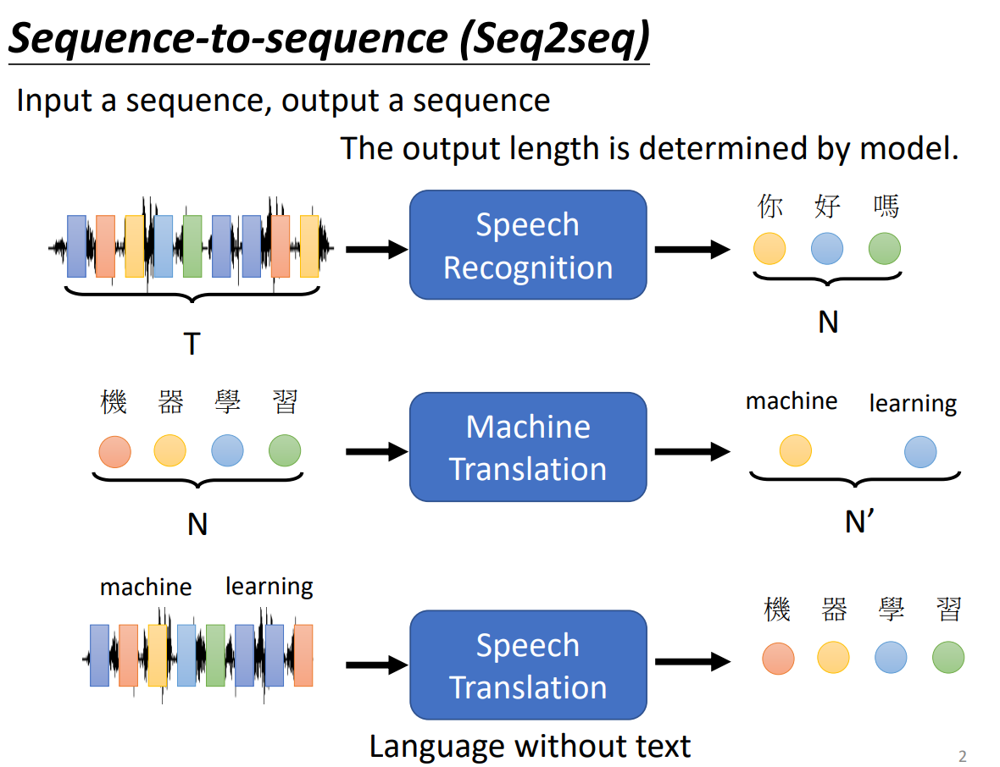

# 前言

本教程参考以下资料：

* 台湾大学李宏毅机器学习课程：https://speech.ee.ntu.edu.tw/~hylee/ml/2021-spring.php

# Auto-encoder

# VAE

由于原生图片很大，放入模型当中计算机会变得很大，由此将原生图片“压缩”至一个较小的维度，即潜在空间，学习模型使用数据量较小的潜在模型可以方便处理与计算。


加载数据集我们使用了[pokemon](https://huggingface.co/datasets/svjack/pokemon-blip-captions-en-zh)的数据集：

```python
dataset = load_dataset("svjack/pokemon-blip-captions-en-zh", split="train")
```

显示图像：

```python
dataset[0]["image"].show()
```


定义一个VAE模型：

```python
"""
一个非常简单的变分自编码器（VAE）模型教学，用于训练压缩和解压缩图像于潜在空间（Latent Space）。
Encoder和Decoder都是简单的卷积神经网络。
Encoder用于将图像压缩为潜在空间表示，Decoder用于将潜在空间表示解压缩还原到原始图像。

在这个例子中，我们将3x512x512的图像压缩到4x64x64的特征值，并进一步输出潜在空间表示向量 z。
"""
import torch
import torch.nn as nn

# VAE model
class VAE(nn.Module):
    def __init__(self, in_channels=3, latent_dim=4, image_size=512): # 3x512x512 -> 4x64x64
        super(VAE, self).__init__()
        self.in_channels = in_channels
        self.latent_dim = latent_dim
        self.image_size = image_size

        # Encoder
        # 3 x 512 x 512 -> 4 x 64 x 64
        self.encoder = nn.Sequential(
            self._conv_block(in_channels, 64),  # 64 x 256 x 256
            self._conv_block(64, 128),  # 128 x 128 x 128
            self._conv_block(128, 256),  # 256 x 64 x 64
        )

        # 编码器结束之后，将提取到的图像给一个学习模型进行学习
        # 解码器就是将学习模型学习到的图片扩大到原来的图像

        # Encoder 的潜在空间输出
        # 这里我们将卷积之后的256通道的图像再进行一次卷积到4通道
        self.fc_mu = nn.Conv2d(256, latent_dim, 1)  # 4 x 64 x 64 <- Latent Space
        self.fc_var = nn.Conv2d(256, latent_dim, 1)  # 4 x 64 x 64 <- Latent Space

        # Decoder
        # 4 x 64 x 64 -> 3 x 512 x 512
        self.decoder_input = nn.ConvTranspose2d(latent_dim, 256, 1)  # 256 x 64 x 64
        self.decoder = nn.Sequential(
            self._conv_transpose_block(256, 128),  # 128 x 128 x 128
            self._conv_transpose_block(128, 64),  # 64 x 256 x 256
            self._conv_transpose_block(64, in_channels),  # 3 x 512 x 512
        )

        self.sigmoid = nn.Sigmoid()  # [0, 1]
        self.tanh = nn.Tanh()  # [-1, 1]

    def _conv_block(self, in_channels, out_channels):
        return nn.Sequential(
            nn.Conv2d(in_channels, out_channels, 3, stride=2, padding=1),
            # nn.GroupNorm(num_groups=1, num_channels=out_channels),
            nn.BatchNorm2d(out_channels), # 进行批次的归一化（缩放像素值）
            # nn.LeakyReLU(),
            # 通过引入一个小的负斜率，允许负数输入也有非零输出，以避免标准 ReLU
            # 中可能导致的“神经元死亡”问题（即输入为负时神经元的输出总是0，导致某些神经元无法更新）。
            # 当输入大于 0 时，输出与标准 ReLU 一样，等于输入。
            nn.LeakyReLU(0.2) # RELU激活函数变体，
        )

    def _conv_transpose_block(self, in_channels, out_channels):
        return nn.Sequential(
            nn.ConvTranspose2d(in_channels, out_channels, 3, stride=2, padding=1, output_padding=1),
            # nn.Upsample(scale_factor=2, mode='bilinear', align_corners=True),
            # nn.Conv2d(in_channels, out_channels, 3, stride=1, padding=1),
            # nn.GroupNorm(num_groups=1, num_channels=out_channels),
            nn.BatchNorm2d(out_channels),
            # nn.LeakyReLU(),
            nn.LeakyReLU(0.2)
        )

    def encode(self, input):
        result = self.encoder(input)
        mu = self.fc_mu(result) # 均值
        log_var = self.fc_var(result) # 方差
        return mu, log_var

    def decode(self, z):
        result = self.decoder_input(z)
        result = self.decoder(result)
        # result = self.sigmoid(result)  # 如果原始图像被归一化为[0, 1]，则使用sigmoid
        result = self.tanh(result)  # 如果原始图像被归一化为[-1, 1]，则使用tanh
        # return result.view(-1, self.in_channels, self.image_size, self.image_size)
        return result

    # 可以计算每一个图像的损失值是多少
    # 这是一个数学技巧
    def reparameterize(self, mu, logvar):
        std = torch.exp(0.5 * logvar)
        eps = torch.randn_like(std)
        return eps * std + mu

    def forward(self, input):
        """
        返回4个值：
        reconstruction, input, mu, log_var
        """
        mu, log_var = self.encode(input)
        z = self.reparameterize(mu, log_var)  # 潜在空间的向量表达 Latent Vector z
        return self.decode(z), input, mu, log_var #返回值：解码器预测的图像，输入图像（真实值），均值，方差
```

模型训练：

```python
import torch
import torch.nn.functional as F
import torch.optim as optim
from torch import nn
from torch.utils.data import DataLoader
from torchvision import transforms
from torchvision.utils import save_image
from vae_model import VAE
from torch.optim.lr_scheduler import ReduceLROnPlateau, CosineAnnealingLR, OneCycleLR
import os
from datasets import load_dataset

# device = "cuda" if torch.cuda.is_available() else ("mps" if torch.backends.mps.is_available() else "cpu")
device = torch.device("cuda:0" if torch.cuda.is_available() else "cpu")
# 超参数
batch_size = 8
learning_rate = 1e-3
num_epochs = 200
image_size = 512
latent_dim = 4

# 需要安装 wandb 库，如果要记录训练过程可以打开下面的注释
# import wandb
# wandb.init(project="vae_from_scratch")
# wandb.config = {
#     "learning_rate": learning_rate,
#     "epochs": num_epochs,
#     "batch_size": batch_size,
#     "image_size": image_size,
#     "latent_dim": latent_dim
# }

# 加载数据集
dataset = load_dataset("svjack/pokemon-blip-captions-en-zh", split="train")
# dataset = load_dataset("imagefolder", split="train", data_dir="train_images/")  # 也可以这样加载本地文件夹的图片数据集

preprocess = transforms.Compose(
    [
        transforms.Resize((image_size, image_size)),  # 图片大小调整为 512 x 512 ，原图像比较大
        transforms.RandomHorizontalFlip(),  # 随机水平翻转
        transforms.RandomRotation(10),  # 随机旋转
        transforms.ColorJitter(brightness=0.2, contrast=0.2, saturation=0.2, hue=0.1),  # 随机颜色调整
        transforms.ToTensor(),  # 转换为张量
        transforms.Normalize((0.5, 0.5, 0.5), (0.5, 0.5, 0.5))  # 将像素值从 [0, 1] 转换到 [-1, 1]
    ]
)

def transform(examples):
    images = [preprocess(image.convert("RGB")) for image in examples["image"]]
    return {"images": images}


dataset.set_transform(transform)

train_dataset = dataset.select(range(0, 600)) # 前600个图像作为训练集
val_dataset = dataset.select(range(600, 800)) # 后几个作为验证集

train_dataloader = DataLoader(train_dataset, batch_size=batch_size, shuffle=True, drop_last=True)
val_dataloader = DataLoader(val_dataset, batch_size=batch_size, shuffle=False, drop_last=True)

# 初始化模型
vae = VAE(in_channels=3, latent_dim=latent_dim, image_size=image_size)
vae.to(device)

# 优化器和学习率调度器
optimizer = optim.AdamW(vae.parameters(), lr=learning_rate, weight_decay=1e-4)  # 可以考虑加入L2正则化：weight_decay=1e-4
# scheduler = ReduceLROnPlateau(optimizer, mode='min', factor=0.5, patience=10, min_lr=5e-5)
# scheduler = CosineAnnealingLR(optimizer, T_max=num_epochs) # 余弦退火学习率调度器
scheduler = OneCycleLR(optimizer, max_lr=1e-3, epochs=num_epochs, steps_per_epoch=len(train_dataloader))


# 自定义损失函数
"""
这个损失函数是用于变分自编码器（VAE）的训练。它由两部分组成：重构误差（MSE）和KL散度（KLD）。  
重构误差（MSE）：衡量重构图像 recon_x 和原始图像 x 之间的差异。使用均方误差（MSE）作为度量标准，计算两个图像之间的像素差异的平方和。  
KL散度（KLD）：衡量编码器输出的潜在分布 mu 和 logvar 与标准正态分布之间的差异。KL散度用于正则化潜在空间，使其接近标准正态分布。

:param recon_x: 重构图像
:param x: 原始图像
:param mu: 编码器输出的均值
:param logvar: 编码器输出的对数方差
:return: 总损失值 =（重构误差 + KL散度） <- 也可以调整加法的比重
"""
#
# def vae_loss_function(recon_x,x,mu,logvar):
#     MSE =torch.nn.functional.mse_loss(recon_x,x,reduction='sum')
#     KLD =-0.5*torch.sum(1+logvar-mu.pow(2)-logvar.exp())
#     return MSE + KLD

def vae_loss_function(recon_x, x, mu, logvar, kld_weight=0.1):
    batch_size = x.size(0)
    mse = F.mse_loss(recon_x, x, reduction='sum')
    kld = -0.5 * torch.sum(1 + logvar - mu.pow(2) - logvar.exp())
    # 总损失 - 用于优化
    total_loss = mse + kld_weight * kld
    # 每像素指标 - 用于监控
    mse_per_pixel = mse / (batch_size * x.size(1) * x.size(2) * x.size(3))
    kld_per_pixel = kld / (batch_size * x.size(1) * x.size(2) * x.size(3))

    return total_loss, mse, kld_weight * kld, mse_per_pixel, kld_per_pixel

# 创建保存生成测试图像的目录
os.makedirs('vae_results', exist_ok=True)

# 训练循环
for epoch in range(num_epochs):
    vae.train()
    train_loss = 0
    mse_loss_total = 0
    kl_loss_total = 0
    mse_vs_kld = 0
    for batch_idx, batch in enumerate(train_dataloader):

        data = batch["images"].to(device)  # [batch, 3, 512, 512] 的原始图像张量
        optimizer.zero_grad()

        recon_batch, _, mu, logvar = vae(data)  # 传递给VAE模型，获取重构图像、均值和对数方差
        loss, mse, kld, mse_per_pixel, kld_per_pixel = vae_loss_function(recon_batch, data, mu, logvar)  # 计算损失

        loss.backward()
        train_loss += loss.item()
        mse_vs_kld += mse_per_pixel / kld_per_pixel
        mse_loss_total += mse_per_pixel.item()
        kl_loss_total += kld_per_pixel.item()
        optimizer.step()
        scheduler.step()  # OneCycleLR 在每个批次后调用

    # scheduler.step()  # 除了 OneCycleLR 之外，其他调度器都需要在每个 epoch 结束时调用

    avg_train_loss = train_loss / len(train_dataloader.dataset)
    avg_mse_loss = mse_loss_total / len(train_dataloader.dataset)
    avg_kl_loss = kl_loss_total / len(train_dataloader.dataset)
    avg_mse_vs_kld = mse_vs_kld / len(train_dataloader)

    print(f'====> Epoch: {epoch} | Learning rate: {scheduler.get_last_lr()[0]:.6f}')
    print(f'Total loss: {avg_train_loss:.4f}')
    print(f'MSE loss (pixel): {avg_mse_loss:.6f} | KL loss (pixel): {avg_kl_loss:.6f}')

    # 验证集上的损失
    vae.eval()
    val_loss = 0
    with torch.no_grad():
        for batch_idx, batch in enumerate(val_dataloader):
            data = batch["images"].to(device)
            recon_batch, _, mu, logvar = vae(data)
            loss,_,_,_,_ = vae_loss_function(recon_batch, data, mu, logvar)
            val_loss += loss.item()

    val_loss /= len(val_dataloader.dataset)
    print(f'Validation set loss: {val_loss:.4f}')

    # 需要安装 wandb 库，如果要记录训练过程可以打开下面的注释
    # wandb.log({
    #     "epoch": epoch,
    #     "learning_rate": scheduler.get_last_lr()[0],
    #     "train_loss": avg_train_loss,
    #     "mse_per_pixel": avg_mse_loss,
    #     "kl_per_pixel": avg_kl_loss,
    #     "mse_vs_kld": avg_mse_vs_kld,
    #     "val_loss": val_loss,
    # })

    # 生成一些重构图像和可视化
    if epoch % 20 == 0:
        with torch.no_grad():
            # 获取实际的批次大小
            actual_batch_size = data.size(0)
            # 重构图像
            n = min(actual_batch_size, 8)
            comparison = torch.cat([data[:n], recon_batch.view(actual_batch_size, 3, image_size, image_size)[:n]])
            comparison = (comparison * 0.5) + 0.5  # 将 [-1, 1] 转换回 [0, 1]
            save_image(comparison.cpu(), f'vae_results/reconstruction_{epoch}.png', nrow=n)

            # 需要安装 wandb 库，如果要记录训练过程可以打开下面的注释
            # wandb.log({"reconstruction": wandb.Image(f'vae_results/reconstruction_{epoch}.png')})

torch.save(vae.state_dict(), 'vae_model.pth')
print("Training completed.")
# 需要安装 wandb 库，如果要记录训练过程可以打开下面的注释
# wandb.finish()
```

```python
"""
这段代码用于展示如何使用训练好的VAE模型对图像进行编码和解码。
用自己训练好的vae模型来压缩一张图片（pokemon_sample_test.png）到潜在空间，然后再还原到像素空间并可视化的过程。
需要通过train_vae.py训练好VAE模型并保存后，才能运行这段代码。
"""
import numpy as np
import torch
from PIL import Image
from matplotlib import pyplot as plt
from torchvision import transforms
from vae_model import VAE


# 超参数
device = "cuda" if torch.cuda.is_available() else ("mps" if torch.backends.mps.is_available() else "cpu")
image_size = 512
latent_dim = 4

# 加载一个随机的原始图像
image_path = "pokemon_sample_test.png"
original_image = Image.open(image_path)

preprocess = transforms.Compose(
    [
        transforms.Resize((image_size, image_size)),  # 图片大小调整为 512 x 512
        transforms.ToTensor(),  # 转换为张量
        transforms.Normalize((0.5, 0.5, 0.5), (0.5, 0.5, 0.5))  # 将像素值从 [0, 1] 转换到 [-1, 1]
    ]
)

def transform(examples):
    images = [preprocess(image.convert("RGB")) for image in examples["image"]]
    return {"images": images}

# 处理图片到3通道的RGB格式（防止有时图片是RGBA的4通道）
image_tensor = preprocess(original_image.convert("RGB")).unsqueeze(0).to(device)

mean_value = image_tensor.mean().item()
print(f"Mean value of image_tensor: {mean_value}")

# 加载我们刚刚预训练好的VAE模型
vae = VAE(in_channels=3, latent_dim=latent_dim, image_size=image_size).to(device)
vae.load_state_dict(torch.load('vae_model.pth', map_location=torch.device('cpu')))

# 使用VAE的encoder压缩图像到潜在空间
with torch.no_grad():
    mu, log_var = vae.encode(image_tensor)
    latent = vae.reparameterize(mu, log_var)

# 使用encoder的输出通过decoder重构图像
with torch.no_grad():
    reconstructed_image = vae.decode(latent)

# 显示原始图像
plt.figure(figsize=(10, 5))
plt.subplot(1, 2, 1)
plt.imshow(original_image)
plt.title("Original Image")
plt.axis('off')

# 显示重构图像
reconstructed_image = reconstructed_image.squeeze().cpu().numpy().transpose(1, 2, 0)
reconstructed_image = (reconstructed_image + 1) / 2  # 从[-1, 1]转换到[0, 1]
plt.subplot(1, 2, 2)
plt.imshow(reconstructed_image)
plt.title("Reconstructed Image")
plt.axis('off')

plt.show()

# 将潜在向量转换为可视化的图像格式
latent_image = latent.squeeze().cpu().numpy()

# 检查潜在向量的形状
if latent_image.ndim == 1:
    # 如果是1D的，将其reshape成2D图像
    side_length = int(np.ceil(np.sqrt(latent_image.size)))
    latent_image = np.pad(latent_image, (0, side_length**2 - latent_image.size), mode='constant')
    latent_image = latent_image.reshape((side_length, side_length))
elif latent_image.ndim == 3:
    # 如果是3D的，选择一个切片或进行平均
    latent_image = np.mean(latent_image, axis=0)

# 显示潜在向量图像
plt.imshow(latent_image, cmap='gray')
plt.title("Latent Space Image")
plt.axis('off')
plt.colorbar()
plt.show()

```

## 代码点补充

```python
LeakyReLU(0.2)
```

`LeakyReLU(0.2)` 是一种激活函数，它是 ReLU（Rectified Linear Unit）的变体。

ReLU 的标准形式是：
- 当输入大于 0 时，输出等于输入。
- 当输入小于等于 0 时，输出为 0。

`LeakyReLU` 通过引入一个小的负斜率，允许负数输入也有非零输出，以避免标准 ReLU 中可能导致的“神经元死亡”问题（即输入为负时神经元的输出总是0，导致某些神经元无法更新）。

`LeakyReLU(0.2)` 的作用是：
- 当输入大于 0 时，输出与标准 ReLU 一样，等于输入。
- 当输入小于等于 0 时，输出等于输入乘以 0.2（也就是有一个 0.2 的斜率）。

公式为：
$$
f(x) =
\begin{cases}
x, & \text{if } x > 0 \\
0.2 \cdot x, & \text{if } x \leq 0
\end{cases}
$$
在这种情况下，0.2 是负输入部分的斜率。

```python
def reparameterize(self, mu, logvar):
    std = torch.exp(0.5 * logvar)
    eps = torch.randn_like(std)
    return eps * std + mu
```

函数原理


$x$代表输入的图像，$x$进入encoder（即在代码中定义的一系列卷积层）生成了$z$，即潜在空间，在这一过程中产生了方差$\sum x$与均值$\mu x$，待代码中对应着`encode`函数输出的`mu, log_var`。潜在空间$z$经过解码器还原到$x_r$，模型训练的目的就是让$x_r$近似$x$，比较这两个之间的差距就是使用MSE均方误差进行计算。

但是我们是将图像压缩进一个潜在空间，我们进入了一个新的损失函数KL散度来表示潜在空间是否标准，KL散度是计算编码器中计算得到的方差$\sum x$与均值$\mu x$来与正态分布（均值为0，方差为1）进行比较。

为什么要计算这一步呢？与自编码相比，VAE是将图像压缩进了一个低维的潜在空间而不是一个潜在向量（即里面的值都是固定的）而潜在空间中的值不固定，但是满足一定的数学规律。为了确保生成图像的连续性，不至于太过离散（因为解码器就是一个放大的过程，在潜在空间里值差距看似很小，经过解码器放大之后，差距更大，会使得最后生成的图像给人一种“割裂”的感觉。）

最后的损失函数是将MSE与KL散度加在一块，这样既可以确保最后生成的图像与原图像尽可能相似，又可以确保图片的连续性。

原论文中的算法过程：


# Transformer

Sequence-to-sequence (Seq2seq)：Input a sequence, output a sequence.

输入一个序列，输出一个序列。序列到序列模型输入和输出都是一个序列，输入与输出序列长度之间的关系有两种情况。 第一种情况下，输入跟输出的长度一样；第二种情况下，机器决定输出的长度。序列到序列模 型有广泛的应用，通过这些应用可以更好地了解序列到序列模型。

但是输出序列的长度无法确定，是否能够让机器自己学习呢？**The output length is determined by model.**



很多时候，我们都可以使用Seq2seq的方式硬解出问题，即“**硬train一发**”。

这就是一个很神奇的模型了，那Seq2seq中间该怎么设计呢？

主要模块由两部分构成：编码器与解码器。


