# 参考资料

* [P2. Python编辑器的选择、安装及配置（PyCharm、Jupyter安装）【PyTorch教程】_哔哩哔哩_bilibili](https://www.bilibili.com/video/BV1hE411t7RN?p=2&vd_source=677693f6b5fdb5565f3813ddff27c9bf)

* dataset与dataloader：[PyTorch 入门实战（三）——Dataset和DataLoader_pytotch dataset和dataleader-CSDN博客](https://blog.csdn.net/qq_38607066/article/details/98474121)

* 课程总体学习：[《PyTorch深度学习实践》完结合集_哔哩哔哩_bilibili](https://www.bilibili.com/video/BV1Y7411d7Ys/?spm_id_from=333.1007.top_right_bar_window_custom_collection.content.click&vd_source=677693f6b5fdb5565f3813ddff27c9bf)

# 前言

大学里打的算法比赛（ACM、蓝桥杯）的算法与机器学习中的算法的区别：

* 算法比赛中给的算法主要就是使用数学方法计算出来的，机器学习中的算法是基于数据训练出来的。

AI、机器学习、深度学习的区别：

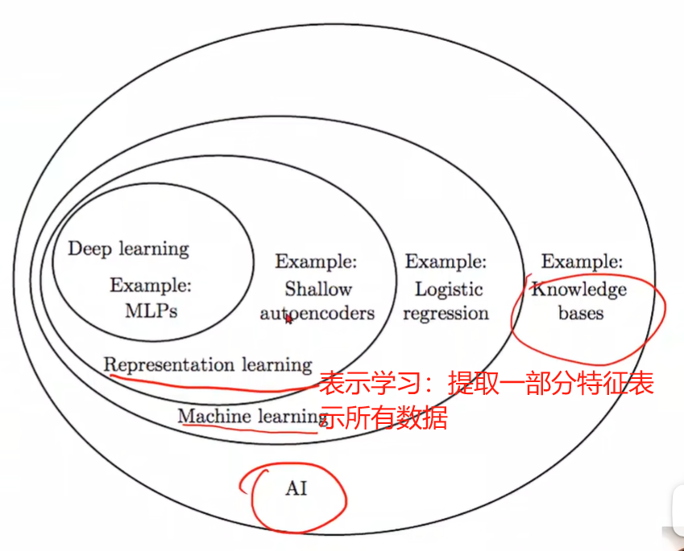

Shallow autoencoders：浅层变换器；深层的就对应深度学习了

## 机器学习历程：

* 将数据输入到一个程序可以得到一个输出，但是如果数据庞大，程序运行变慢
  

* 手工提取数据中给的特征，根据特征映射得到输出结果，这是经典机器学习能解决的问题
  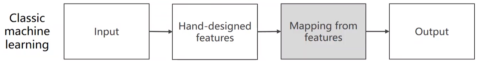

* 对于数据可以用很多的维度来表示，在概率论当中，根据大数定律可以发现，只有当数据足够大了才能反应数据中的规律。
  对于只有一个特征的数据，只需要一个维度就可以表示，（假如说达到10个就满足大数定律）；
  对于两个特征的数据，需要10^2^个数据才能达到大数定律
  对于三个特征的数据，需要10^3^个数据才能达到大数定律
  ……
  对于N个特征的数据，需要10^N^个数据才能达到大数定律
  因此**如果数据的维度过大，需要达到大数定律的数据量就呈现级数级别的增涨，数据的质量决定模型的质量！**
  因此对于如何提取某些特征可以代表全部特征，这样一个步骤就是提取有用的特征。
  ---->对于这样的特征提取就可以使用线性代数的方式解决。
  首先一条数据有N个特征，那么就可以表示成一个N×1的向量，我们需要将其提取为3个特征的数据，左乘一个3×N的矩阵就可以将其“压缩”为一个3×1的向量：
  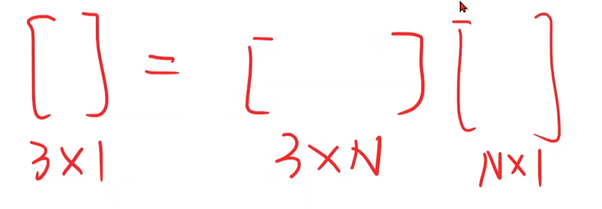

  **这样的一个特征提取，高维到低维，叫做Present，表示学习**

  将提取后的特征进行映射得到输出
  
  提取特征是无监督学习，学习器是监督学习

* 深度学习：
  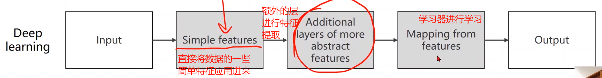

  学习器里面一般都是多层的神经网络可以胜任这个任务。
  **深度学习中Simple features 和 Additional layers of more abstract features 和Mapping from features是统一放在一块进行训练的**

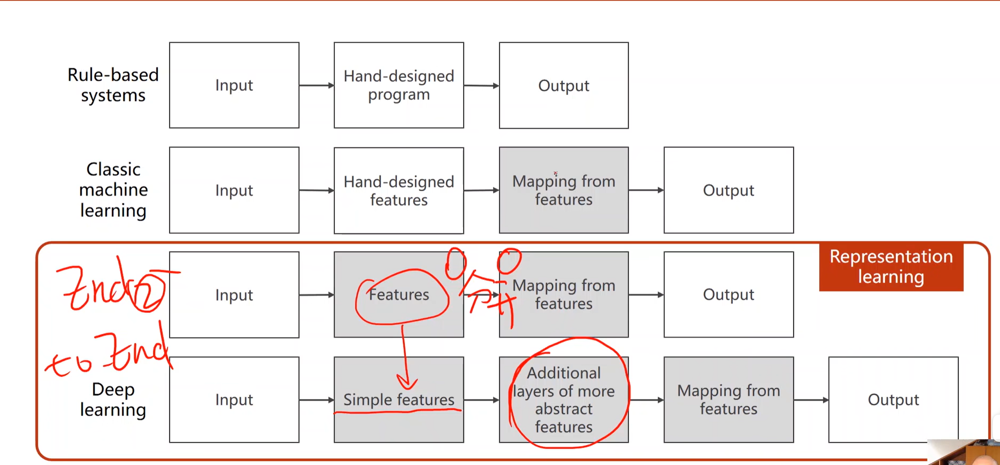

# 线性模型

机器学习步骤：

* 选取数据集
* 选取模型
* 进行训练
* 进行推理

数据集可以划分成训练集与测试集。

为了测验模型的泛化能力，可以将训练集划分出来一部分作为开发集用于模型的评估。如果开发集效果比较好的话，再将整个训练集扔给模型进行训练。**这个开发集也就是验证集。**

## 损失函数

设计一个评估模型来评估自己的模型的好坏，这个评估模型就是**损失函数**。

怎么计算呢？

对于一条数据，扔给设计的模型里面得到一个预测值，计算该预测值与数据真实的值的误差。（有时候这个误差可能是负数，为了观察方便，将误差都变成非负）$\hat{y}$为预测值，$y$为真实值。
$$
\operatorname{loss}=(\hat{y}-y)^{2}
$$
但是数据又不止一个，我们需要计算所有数据的一个损失情况，这就有了MSE（平均平方误差）：

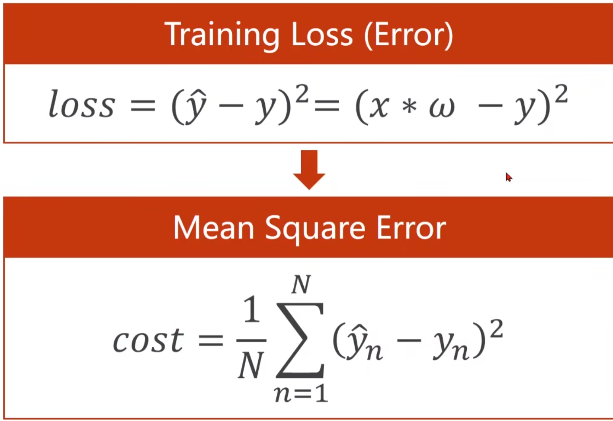

根据损失函数修改模型中的权重，使得修改后的模型的损失函数更小。这就是我们训练的目的。

比如说在线性模型里：
$$
\hat{y}=x*\omega +b
$$
这里我们可以简化（把截距去掉）：
$$
\hat{y}=x*\omega
$$
在这个线性模型里，每一条数据的loss就为：
$$
\operatorname{loss}=(\hat{y}-y)^{2}=(x*\omega -y)^2
$$
每一次我们可以根据损失函数的值不断修改权重$\omega$的值。

## 该怎么更新$\omega$使得损失函数变小呢？

* 穷举所有可能的$\omega$值，绘制图像看$\omega$取哪一个值的时候loss最小：
  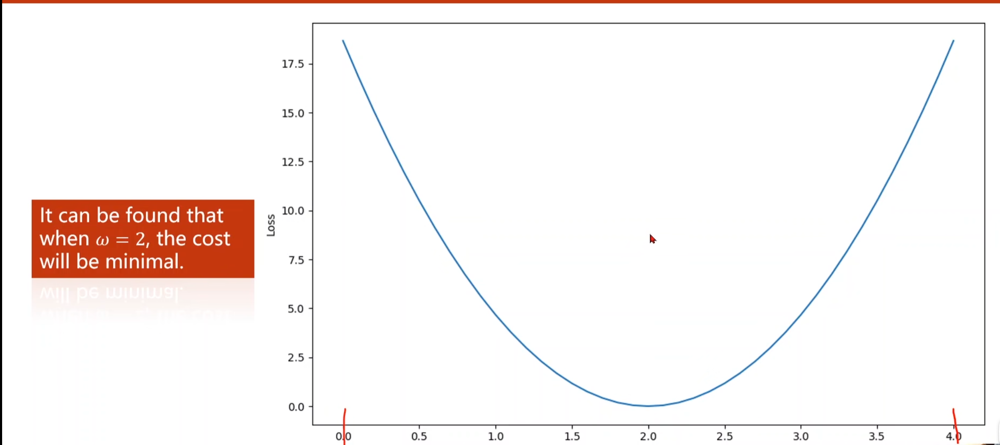

```python
#!/usr/bin/env python
# -*- coding: UTF-8 -*-
'''
@File    ：Draw_Loss_Graph.py
@IDE     ：PyCharm 
@Author  ：李明璐
@Date    ：2024/9/10 18:00 
'''
import numpy as np
import matplotlib.pyplot as plt

x_data = [1.0, 2.0, 3.0]
y_data = [2.0, 4.0, 6.0]

def forward(x):
    return x * w

def loss(x, y):
    y_preditct = forward(x)
    return (y_preditct - y) * (y_preditct - y)

w_list = []
mse_list = []

for w in np.arange(0.0, 4.1, 0.1): # 权重w从0到4.0，步长为0.1
    print("w = ", w)
    l_sum = 0 # 计算该权重下的损失值和
    for x_val, y_val in zip(x_data, y_data):
        y_predict_val = forward(x_val)
        loss_val = loss(x_val, y_val)
        l_sum += loss_val
        print('\t', x_val, y_val, y_predict_val, loss_val)

    print("MSE = ", l_sum / 3)
    w_list.append(w)
    mse_list.append(l_sum / 3)

# 绘图
plt.plot(w_list, mse_list)
plt.ylabel('Loss')
plt.xlabel('w')
plt.show()
```

```python
w =  0.0
	 1.0 2.0 0.0 4.0
	 2.0 4.0 0.0 16.0
	 3.0 6.0 0.0 36.0
MSE =  18.666666666666668
w =  0.1
	 1.0 2.0 0.1 3.61
	 2.0 4.0 0.2 14.44
	 3.0 6.0 0.30000000000000004 32.49
MSE =  16.846666666666668
w =  0.2
	 1.0 2.0 0.2 3.24
	 2.0 4.0 0.4 12.96
	 3.0 6.0 0.6000000000000001 29.160000000000004
MSE =  15.120000000000003
w =  0.30000000000000004
	 1.0 2.0 0.30000000000000004 2.8899999999999997
	 2.0 4.0 0.6000000000000001 11.559999999999999
	 3.0 6.0 0.9000000000000001 26.009999999999998
MSE =  13.486666666666665
w =  0.4
	 1.0 2.0 0.4 2.5600000000000005
	 2.0 4.0 0.8 10.240000000000002
	 3.0 6.0 1.2000000000000002 23.04
MSE =  11.946666666666667
w =  0.5
	 1.0 2.0 0.5 2.25
	 2.0 4.0 1.0 9.0
	 3.0 6.0 1.5 20.25
MSE =  10.5
w =  0.6000000000000001
	 1.0 2.0 0.6000000000000001 1.9599999999999997
	 2.0 4.0 1.2000000000000002 7.839999999999999
	 3.0 6.0 1.8000000000000003 17.639999999999993
MSE =  9.146666666666663
w =  0.7000000000000001
	 1.0 2.0 0.7000000000000001 1.6899999999999995
	 2.0 4.0 1.4000000000000001 6.759999999999998
	 3.0 6.0 2.1 15.209999999999999
MSE =  7.886666666666666
w =  0.8
	 1.0 2.0 0.8 1.44
	 2.0 4.0 1.6 5.76
	 3.0 6.0 2.4000000000000004 12.959999999999997
MSE =  6.719999999999999
w =  0.9
	 1.0 2.0 0.9 1.2100000000000002
	 2.0 4.0 1.8 4.840000000000001
	 3.0 6.0 2.7 10.889999999999999
MSE =  5.646666666666666
w =  1.0
	 1.0 2.0 1.0 1.0
	 2.0 4.0 2.0 4.0
	 3.0 6.0 3.0 9.0
MSE =  4.666666666666667
w =  1.1
	 1.0 2.0 1.1 0.8099999999999998
	 2.0 4.0 2.2 3.2399999999999993
	 3.0 6.0 3.3000000000000003 7.289999999999998
MSE =  3.779999999999999
w =  1.2000000000000002
	 1.0 2.0 1.2000000000000002 0.6399999999999997
	 2.0 4.0 2.4000000000000004 2.5599999999999987
	 3.0 6.0 3.6000000000000005 5.759999999999997
MSE =  2.986666666666665
w =  1.3
	 1.0 2.0 1.3 0.48999999999999994
	 2.0 4.0 2.6 1.9599999999999997
	 3.0 6.0 3.9000000000000004 4.409999999999998
MSE =  2.2866666666666657
w =  1.4000000000000001
	 1.0 2.0 1.4000000000000001 0.3599999999999998
	 2.0 4.0 2.8000000000000003 1.4399999999999993
	 3.0 6.0 4.2 3.2399999999999993
MSE =  1.6799999999999995
w =  1.5
	 1.0 2.0 1.5 0.25
	 2.0 4.0 3.0 1.0
	 3.0 6.0 4.5 2.25
MSE =  1.1666666666666667
w =  1.6
	 1.0 2.0 1.6 0.15999999999999992
	 2.0 4.0 3.2 0.6399999999999997
	 3.0 6.0 4.800000000000001 1.4399999999999984
MSE =  0.746666666666666
w =  1.7000000000000002
	 1.0 2.0 1.7000000000000002 0.0899999999999999
	 2.0 4.0 3.4000000000000004 0.3599999999999996
	 3.0 6.0 5.1000000000000005 0.809999999999999
MSE =  0.4199999999999995
w =  1.8
	 1.0 2.0 1.8 0.03999999999999998
	 2.0 4.0 3.6 0.15999999999999992
	 3.0 6.0 5.4 0.3599999999999996
MSE =  0.1866666666666665
w =  1.9000000000000001
	 1.0 2.0 1.9000000000000001 0.009999999999999974
	 2.0 4.0 3.8000000000000003 0.0399999999999999
	 3.0 6.0 5.7 0.0899999999999999
MSE =  0.046666666666666586
w =  2.0
	 1.0 2.0 2.0 0.0
	 2.0 4.0 4.0 0.0
	 3.0 6.0 6.0 0.0
MSE =  0.0
w =  2.1
	 1.0 2.0 2.1 0.010000000000000018
	 2.0 4.0 4.2 0.04000000000000007
	 3.0 6.0 6.300000000000001 0.09000000000000043
MSE =  0.046666666666666835
w =  2.2
	 1.0 2.0 2.2 0.04000000000000007
	 2.0 4.0 4.4 0.16000000000000028
	 3.0 6.0 6.6000000000000005 0.36000000000000065
MSE =  0.18666666666666698
w =  2.3000000000000003
	 1.0 2.0 2.3000000000000003 0.09000000000000016
	 2.0 4.0 4.6000000000000005 0.36000000000000065
	 3.0 6.0 6.9 0.8100000000000006
MSE =  0.42000000000000054
w =  2.4000000000000004
	 1.0 2.0 2.4000000000000004 0.16000000000000028
	 2.0 4.0 4.800000000000001 0.6400000000000011
	 3.0 6.0 7.200000000000001 1.4400000000000026
MSE =  0.7466666666666679
w =  2.5
	 1.0 2.0 2.5 0.25
	 2.0 4.0 5.0 1.0
	 3.0 6.0 7.5 2.25
MSE =  1.1666666666666667
w =  2.6
	 1.0 2.0 2.6 0.3600000000000001
	 2.0 4.0 5.2 1.4400000000000004
	 3.0 6.0 7.800000000000001 3.2400000000000024
MSE =  1.6800000000000008
w =  2.7
	 1.0 2.0 2.7 0.49000000000000027
	 2.0 4.0 5.4 1.960000000000001
	 3.0 6.0 8.100000000000001 4.410000000000006
MSE =  2.2866666666666693
w =  2.8000000000000003
	 1.0 2.0 2.8000000000000003 0.6400000000000005
	 2.0 4.0 5.6000000000000005 2.560000000000002
	 3.0 6.0 8.4 5.760000000000002
MSE =  2.986666666666668
w =  2.9000000000000004
	 1.0 2.0 2.9000000000000004 0.8100000000000006
	 2.0 4.0 5.800000000000001 3.2400000000000024
	 3.0 6.0 8.700000000000001 7.290000000000005
MSE =  3.780000000000003
w =  3.0
	 1.0 2.0 3.0 1.0
	 2.0 4.0 6.0 4.0
	 3.0 6.0 9.0 9.0
MSE =  4.666666666666667
w =  3.1
	 1.0 2.0 3.1 1.2100000000000002
	 2.0 4.0 6.2 4.840000000000001
	 3.0 6.0 9.3 10.890000000000004
MSE =  5.646666666666668
w =  3.2
	 1.0 2.0 3.2 1.4400000000000004
	 2.0 4.0 6.4 5.760000000000002
	 3.0 6.0 9.600000000000001 12.96000000000001
MSE =  6.720000000000003
w =  3.3000000000000003
	 1.0 2.0 3.3000000000000003 1.6900000000000006
	 2.0 4.0 6.6000000000000005 6.7600000000000025
	 3.0 6.0 9.9 15.210000000000003
MSE =  7.886666666666668
w =  3.4000000000000004
	 1.0 2.0 3.4000000000000004 1.960000000000001
	 2.0 4.0 6.800000000000001 7.840000000000004
	 3.0 6.0 10.200000000000001 17.640000000000008
MSE =  9.14666666666667
w =  3.5
	 1.0 2.0 3.5 2.25
	 2.0 4.0 7.0 9.0
	 3.0 6.0 10.5 20.25
MSE =  10.5
w =  3.6
	 1.0 2.0 3.6 2.5600000000000005
	 2.0 4.0 7.2 10.240000000000002
	 3.0 6.0 10.8 23.040000000000006
MSE =  11.94666666666667
w =  3.7
	 1.0 2.0 3.7 2.8900000000000006
	 2.0 4.0 7.4 11.560000000000002
	 3.0 6.0 11.100000000000001 26.010000000000016
MSE =  13.486666666666673
w =  3.8000000000000003
	 1.0 2.0 3.8000000000000003 3.240000000000001
	 2.0 4.0 7.6000000000000005 12.960000000000004
	 3.0 6.0 11.4 29.160000000000004
MSE =  15.120000000000005
w =  3.9000000000000004
	 1.0 2.0 3.9000000000000004 3.610000000000001
	 2.0 4.0 7.800000000000001 14.440000000000005
	 3.0 6.0 11.700000000000001 32.49000000000001
MSE =  16.84666666666667
w =  4.0
	 1.0 2.0 4.0 4.0
	 2.0 4.0 8.0 16.0
	 3.0 6.0 12.0 36.0
MSE =  18.666666666666668
```

运行图：

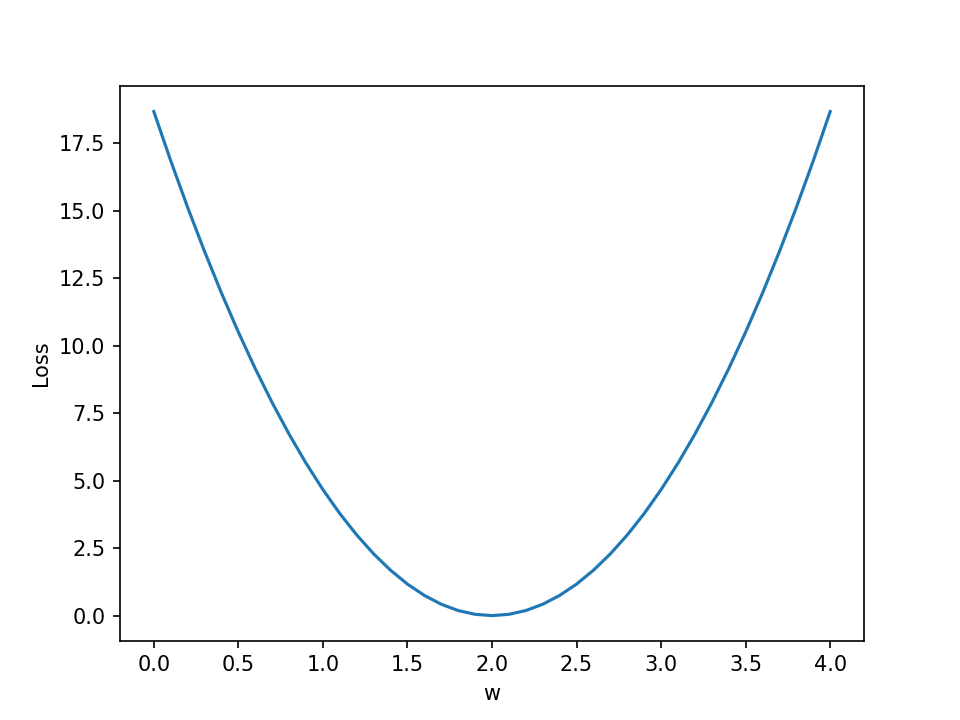

**以后我们进行深度学习的时候，x轴的这个$\omega$一般为epoch，训练次数。**

==**训练过拟合，说明模型泛化能力不好，表现为开发（验证）集的数据在真实收敛域附近的loss增大**==（2024年9月10日，不太理解这句话）

## 绘制3D图

如果模型是这样的呢：
$$
\hat{y}=x*\omega +b
$$
我们就需要绘制3D图。

参考这个文档：

https://matplotlib.org/stable/users/explain/toolkits/mplot3d.html

# 梯度下降算法

## 为啥要引入梯度下降

咱们上面看到了利用穷举法遍历所有的$\omega$（假设有100个）来找到最小的Loss值，这样确定最优模型中参数$\omega$的值。如果模型中有两个参数${\omega}_1$和${\omega}_2$，那么就需要${100}^2$个数据，如果有10个参数呢？就需要${100}^{10}$个数据需要遍历，计算机呈指数级增加。

加入还是两个参数，我们需要遍历的参数可以分成一块一块的（**分治思想**）：


首先先遍历这每一块中的一个数据，发现其中一个数据比较小，那么可以继续遍历这个较小的数据所在的一块，直到找到最小的loss值对应的参数对。如果有多个可能的最小值，那就把其他的数据区域也遍历一遍，通过比对找到最小的。

**就目前分析而言，咱们已经将找最小LOSS值对应的参数对这个计算过程从$\O{(n)}^2$**到$\O(n)$的级别。貌似已经很成功了，但是这里还有一个问题，如果我们选择的点是这个图像中的红色的点，我们会发现采用分治法可能会陷入一个局部最优值的问题。


所以我们需要继续修改算法，由此引入了梯度下降算法。

## 梯度下降核心

在这样一个一维函数里：


但是仔细想，采用梯度下降的算法，也会容易陷入局部最优解。

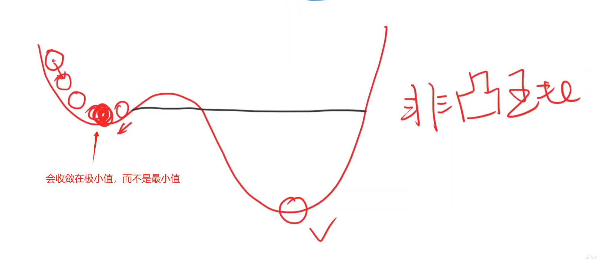

为什么梯度下降也是只能找到局部最优，为啥还是使用这种方法呢？

**在神经网络里存在很少的局部最优点**，==我也不是很明白，反正使用这个方法就对了==

但是会遇到一个一个问题，即神经网络里会存在==**鞍点**==，鞍点的梯度为0。

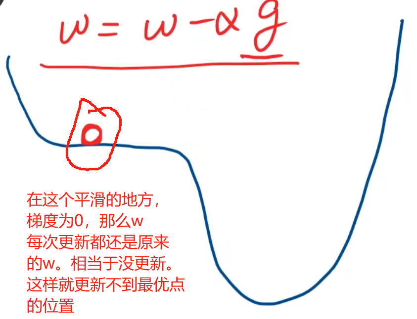

在高维的空间当中会出现这种情况：（2024年9月13日，我也不是很理解）在某个一个切面找到的事最小值，换成另外一个切面就变成了一个最大值。


针对前一章提到的线性模型，梯度更新是怎么样的一个过程呢？


然后梯度更新函数就变成了这样：


使用代码实现：

```python
import numpy as np
import matplotlib.pyplot as plt

x_data = [1.0, 2.0, 3.0]
y_data = [2.0, 4.0, 6.0]

w = 1.0

def forward(x):
    return x * w

def cost(xs, ys):
    cost = 0
    for x, y in zip(xs, ys):
        y_pred = forward(x)
        cost += (y_pred - y) ** 2
    return cost / len(xs)

def gradient(xs, ys):
    grad = 0
    for x, y in zip(xs, ys):
        grad += 2 * x * (x * w - y)
    return grad / len(xs)

cost_list = []

print('Predict (before training):', 4, forward(4))
for epoch in range(100):
    cost_val = cost(x_data, y_data)
    cost_list.append(cost_val)
    grad_val = gradient(x_data, y_data)
    w -= 0.01 * grad_val
    print('Epoch:', epoch, 'w = ', w, 'loss = ', cost_val)
print('Predict (after training):', 4, forward(4))

plt.plot(range(100), cost_list)
plt.ylabel('Loss')
plt.xlabel('Epoch')
plt.show()
```

运行的结果：

```python
Predict (before training): 4 4.0
……
Epoch: 90 w =  1.9998658050763347 loss =  1.0223124683409346e-07
Epoch: 91 w =  1.9998783299358769 loss =  8.403862850836479e-08
Epoch: 92 w =  1.9998896858085284 loss =  6.908348768398496e-08
Epoch: 93 w =  1.9998999817997325 loss =  5.678969725349543e-08
Epoch: 94 w =  1.9999093168317574 loss =  4.66836551287917e-08
Epoch: 95 w =  1.9999177805941268 loss =  3.8376039345125727e-08
Epoch: 96 w =  1.9999254544053418 loss =  3.154680994333735e-08
Epoch: 97 w =  1.9999324119941766 loss =  2.593287985380858e-08
Epoch: 98 w =  1.9999387202080534 loss =  2.131797981222471e-08
Epoch: 99 w =  1.9999444396553017 loss =  1.752432687141379e-08
Predict (after training): 4 7.999777758621207
```

绘制的图像：


通常情况下，我们进行绘图可能会出现这种情况：

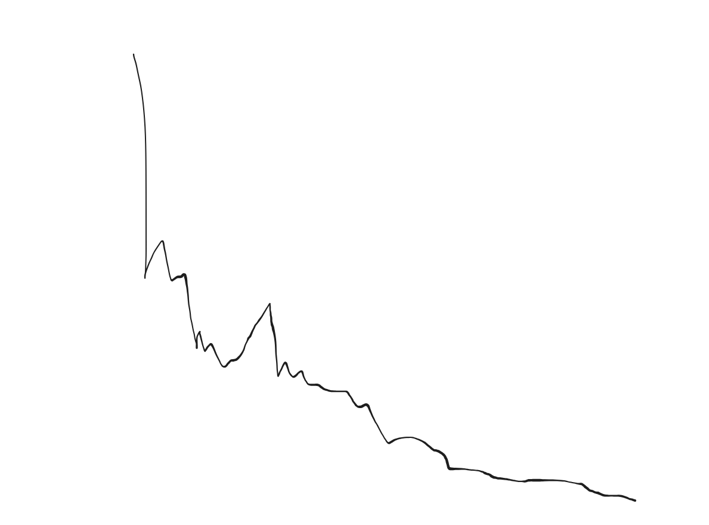

我们在绘图的时候对图像进行加权均值的操作，过程如下：

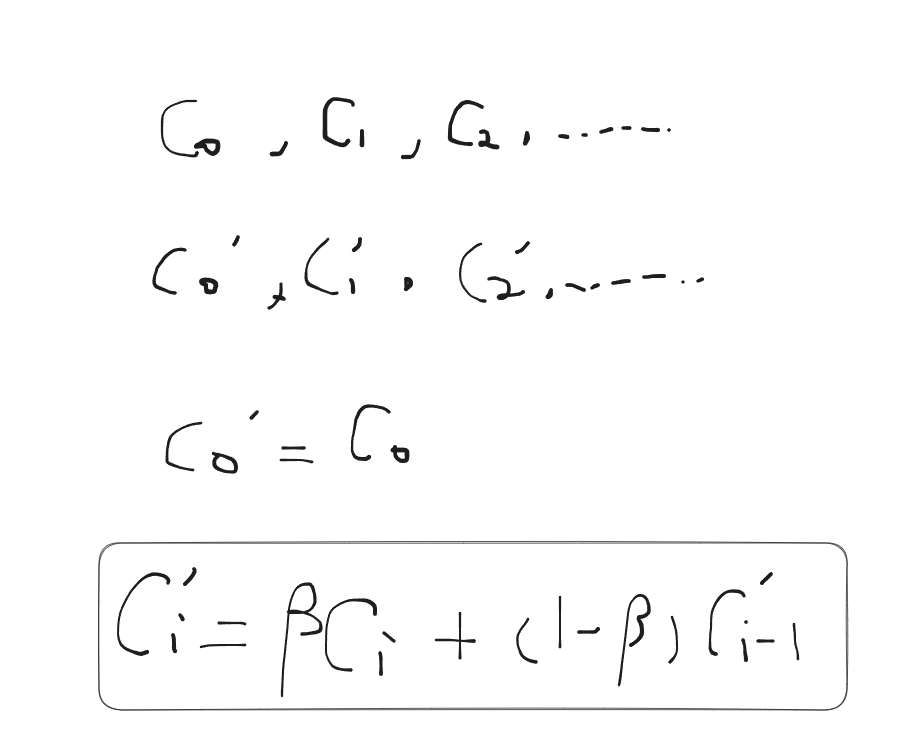

这里的$\beta$值可以自己设置。

如果在训练过程中出现了这样的情况：

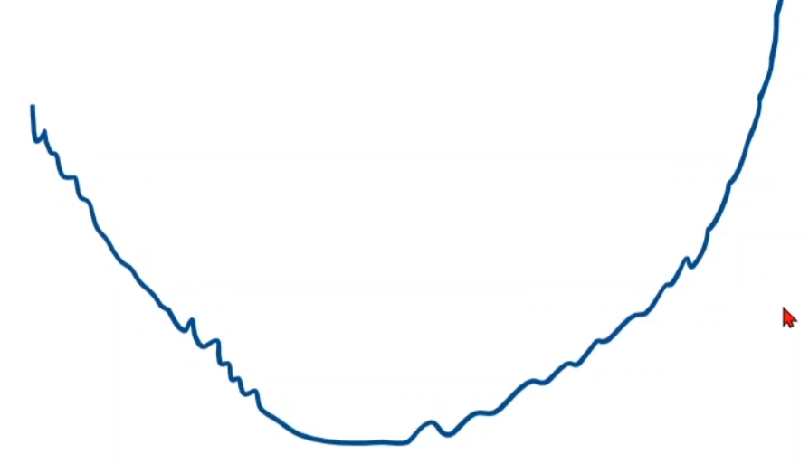

那么就是**发散了**，可能的原因是学习率设置的太大。

## 随机梯度下降

解决鞍点的一个方法：随机梯度下降。

书接上文，在鞍点的时候，梯度为0，此时参数不再进行更新，参数也就无法更新到最小值部分。我们重新回看参数更新的公式：
$$
\omega=\omega-\alpha \frac{\partial \cos t}{\partial \omega}
$$

$$
\frac{\partial \cos t}{\partial \omega}=\frac{1}{N} \sum_{n=1}^{N} 2 \cdot x_{n} \cdot\left(x_{n} \cdot \omega-y_{n}\right)
$$

这里$\frac{\partial \cos t}{\partial \omega}$求的是所有数据的平均值，**随机梯度下降**就是从这$N$个数据里取一个数据的Loss值对$\omega$进行求导，得到的导数值可能是一个非0的数，这样就相当于给原有的梯度为0的那一段数据引入了一个噪声数据，这样有可能使得梯度继续进行下降。

**随机梯度下降在神经网络里面被证明是十分有效的。用就完了，反正也搞不懂。**

如果上面的概念还有点不清楚，看代码是怎么解释的：

```python
#!/usr/bin/env python
# -*- coding: UTF-8 -*-
'''
@File      ：GradientDescent2.py
@IDE       ：PyCharm 
@Author    ：lml
@Date      ：2024/9/13 20:16 
@Descriable：随机梯度下降
'''
import numpy as np
import matplotlib.pyplot as plt

x_data = [1.0, 2.0, 3.0]
y_data = [2.0, 4.0, 6.0]

w = 1.0

def forward(x):
    return x * w
# 注意这里的loss只对一个样本数据求解该样本的loss值
def loss(x, y):
    y_pred = forward(x)
    return (y_pred - y) ** 2

# 注意这里的gradient是只对一个样本数据对w的导数值
def gradient(x, y):
    return 2 * x * (x * w - y)

print('Predict (before training):', 4, forward(4))

cost_list = []
for epoch in range(100):
    l = 0
    # 注意这里的随机梯度下降是对一个个数据样本进行loss和对参数w进行求导，最后得到的w值是一次次迭代过来的。
    for x, y in zip(x_data, y_data):
        grad = gradient(x, y)
        w -= 0.01 * grad
        print('\tgrad: ', x, y, grad)
        l = loss(x, y)
    cost_list.append(l)
    print('Epoch:', epoch, 'w = ', w, 'loss = ', l)

print('Predict (after training):', 4, forward(4))

plt.plot(range(100), cost_list)
plt.ylabel('Loss')
plt.xlabel('Epoch')
plt.show()
```

运行结果为：

```python
Epoch: 90 w =  1.9999999999988431 loss =  1.2047849775995315e-23
	grad:  1.0 2.0 -2.3137047833188262e-12
	grad:  2.0 4.0 -9.070078021977679e-12
	grad:  3.0 6.0 -1.8779644506139448e-11
Epoch: 91 w =  1.9999999999991447 loss =  6.5840863393251405e-24
	grad:  1.0 2.0 -1.7106316363424412e-12
	grad:  2.0 4.0 -6.7057470687359455e-12
	grad:  3.0 6.0 -1.3882228699912957e-11
Epoch: 92 w =  1.9999999999993676 loss =  3.5991747246272455e-24
	grad:  1.0 2.0 -1.2647660696529783e-12
	grad:  2.0 4.0 -4.957811938766099e-12
	grad:  3.0 6.0 -1.0263789818054647e-11
Epoch: 93 w =  1.9999999999995324 loss =  1.969312363793734e-24
	grad:  1.0 2.0 -9.352518759442319e-13
	grad:  2.0 4.0 -3.666400516522117e-12
	grad:  3.0 6.0 -7.58859641791787e-12
Epoch: 94 w =  1.9999999999996543 loss =  1.0761829795642296e-24
	grad:  1.0 2.0 -6.914468997365475e-13
	grad:  2.0 4.0 -2.7107205369247822e-12
	grad:  3.0 6.0 -5.611511255665391e-12
Epoch: 95 w =  1.9999999999997444 loss =  5.875191475205477e-25
	grad:  1.0 2.0 -5.111466805374221e-13
	grad:  2.0 4.0 -2.0037305148434825e-12
	grad:  3.0 6.0 -4.1460168631601846e-12
Epoch: 96 w =  1.999999999999811 loss =  3.2110109830478153e-25
	grad:  1.0 2.0 -3.779199175824033e-13
	grad:  2.0 4.0 -1.4814816040598089e-12
	grad:  3.0 6.0 -3.064215547965432e-12
Epoch: 97 w =  1.9999999999998603 loss =  1.757455879087579e-25
	grad:  1.0 2.0 -2.793321129956894e-13
	grad:  2.0 4.0 -1.0942358130705543e-12
	grad:  3.0 6.0 -2.2648549702353193e-12
Epoch: 98 w =  1.9999999999998967 loss =  9.608404711682446e-26
	grad:  1.0 2.0 -2.0650148258027912e-13
	grad:  2.0 4.0 -8.100187187665142e-13
	grad:  3.0 6.0 -1.6786572132332367e-12
Epoch: 99 w =  1.9999999999999236 loss =  5.250973729513143e-26
Predict (after training): 4 7.9999999999996945
```

运行图：

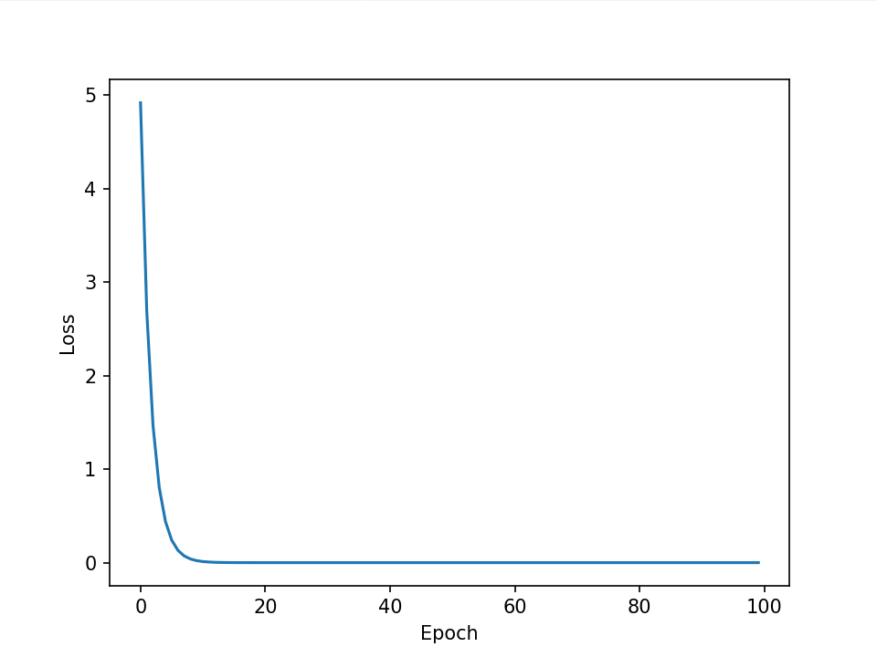

## 梯度下降与随机梯度下降对比

在梯度下降中我们是计算所有样本的loss平均值后再计算梯度平均，这两种计算可以并行计算，也就是对于N条数据样本，有N个计算机同时计算，最后得到的值÷N就可以了。但是随机梯度下降中参数的值的更新取决于前一次参数的值。


无法进行并行计算，所以计算效率变得很差。

这似乎是两种极端的操作。把所有的数据直接梯度下降，学习器的性能差，但是因为可以并行计算，所以时间短。把所有的数据一个一个的随机梯度下降，学习器性能好，但是不能并行计算，所以时间长。

在深度神经网络里面，采取一种折中的办法，就是minibatch。

**就是一组一组的数据之间进行随机梯度下降，组内进行梯度下降。**

# 反向传播

首先我们先看一个神经网络：

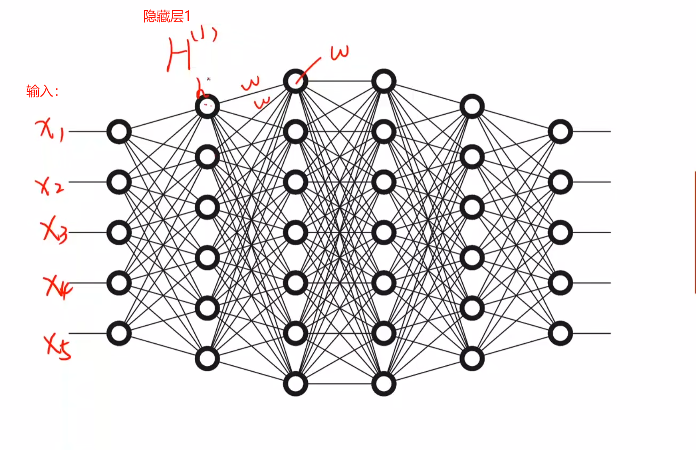

我们发现隐藏层第一层是一个6维的向量，即是一个6×1的向量，而输入是一个5维的向量，也就是5×1的向量，怎么从5×1的向量更新到6×1的向量？就需要一个6×5的权重矩阵来更新：


权重矩阵中我们可以计算出权重值有30个。

依次类推，隐藏层第二层的权重矩阵中的权重值达到42个，第三层的权重矩阵中的权重值达到了49个。


如果继续采用梯度下降算法，我们就需要计算最后的损失函数对于每一个权重值的梯度，这个解析式十分复杂，并且这些权重都是一环套一环的比较复杂，因此将这个神经网络看做是一个图，梯度可以一层一层的传播，这就是反向传播算法。

## 神经网络设计

我们设计一个两层的神经网络：
$$
\hat{y}=W_{2}\left(W_{1} \cdot X+b_{1}\right)+b_{2}
$$
先对里面的$W_{1} \cdot X+b_{1}$进行处理，这也就组成了我们第一层神经网络：


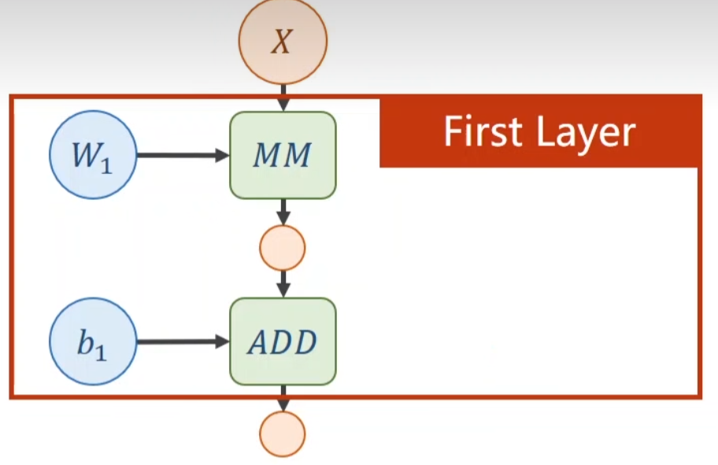

然后按照算式中的优先级，我们引入第二层：

计算这一步骤：
$$
\hat{y}=W_{2}\left(第一层结果\right)+b_{2}
$$


矩阵运算可以参考[这里](http://faculty.bicmr.pku.edu.cn/~wenzw/bigdata/matrix-cook-book.pdf)。

这样反而引发了一个问题：无论积累的多少层，最后都可以合并成一个线性函数：


## 引入激活函数

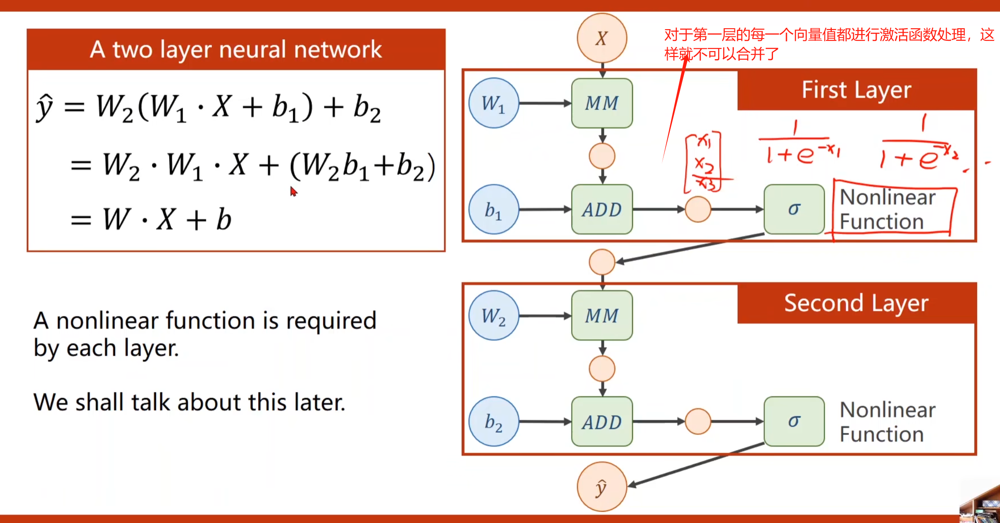

这样对每一层的结果的向量中的向量值进行激活函数的处理，最后就不可以合并了。

## 前馈传播与反向传播过程

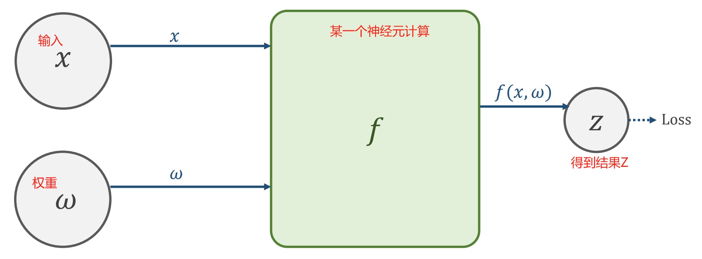

### 前馈传播过程

输入的$x$与$\omega$进入神经元$f(x,\omega)$，计算得到了$f(x,\omega) =Z$，**同时计算$Z$对$x$和$\omega$的偏导$\frac{\partial z}{\partial x}$和$\frac{\partial z}{\partial \omega}$**。最后得到的结果$Z$进入Loss中。

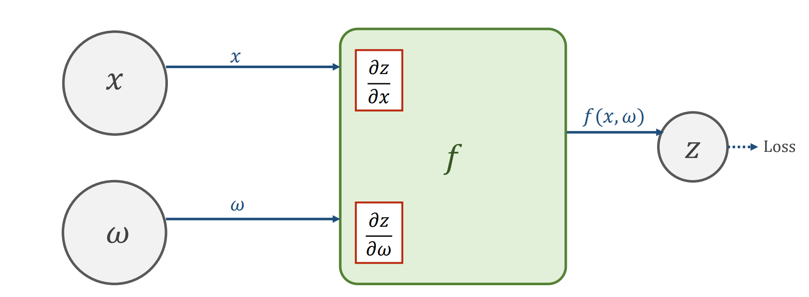

## 反向传播过程

首先计算出了$\frac{\partial L}{\partial z}$，反向传播的目的是计算$\frac{\partial L}{\partial x}$和$\frac{\partial L}{\partial \omega}$。我们可以采取链式法则：
$$
\frac{\partial L}{\partial x} = \frac{\partial L}{\partial z} \cdot \frac{\partial z}{\partial x}
$$

$$
\frac{\partial L}{\partial \omega} = \frac{\partial L}{\partial z} \cdot \frac{\partial z}{\partial \omega}
$$

进行反向传播的时候，$\frac{\partial L}{\partial x}$与前一层保留的输入和参数的梯度$\frac{\partial z}{\partial x}$和$\frac{\partial z}{\partial \omega}$直接相乘便可得到最后的$\frac{\partial L}{\partial x}$和$\frac{\partial L}{\partial \omega}$。


举个例子：

前馈传播：


反向传播：

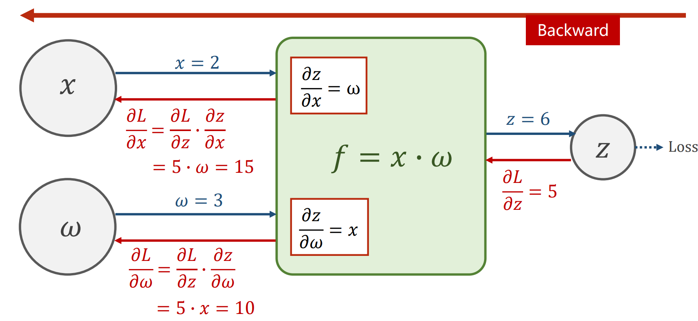

**在Pytorch中，每一个神经节点的梯度都存储在输入和参数的变量当中**

例如一个线性模型的前馈与反向传播过程如下：


## 张量


**注意这里的Grad也是一个Tensor，取值需要进行grad.data**

```python

import torch
x_data = [1.0, 2.0, 3.0]
y_data = [2.0, 4.0, 6.0]

w =torch.Tensor([1.0]) # 使用Tensor存储参数，咱们的线性模型里只有一个参数w，初试设置为1.0
w.requires_grad = True # 这里很重要，这句话的意思就是w是需要计算梯度的，如果没有那么w的Tensor就不会存储梯度

def forward(x):
    return x * w # w是Tensor类型，x也会被强制转换成Tensor类型

def loss(x, y):
    y_pred = forward(x)
    return (y_pred - y) ** 2

print("predict (before training)", 4, forward(4).item())

for epoch in range(100):
    for x, y in zip(x_data, y_data):
        l = loss(x, y) # 前馈传播的过程，计算loss值，l是一个Tensor类型的数据
        l.backward() # l调用函数backward()，可以自动计算求解l链路上的所有的梯度，并且存储到对应的变量当中，比如这里就讲对w的梯度存储在w这个变量中
        # 进行反向传播结束之后，神经网络的传播图就会被释放，下次会重构这个传播图
        print('\tgrad:', x, y, w.grad.item()) # item()是为了缠上梯度这个标量
        # data返回的是tensor，item返回的是数值
        w.data = w.data - 0.01 * w.grad.data # 在进行权重更新的时候要使用张量里的data
        w.grad.data.zero_() # 将w的梯度清零
    print("progress:", epoch, l.item())

print("predict (after training)", 4, forward(4).item())
```

```python
……
progress: 95 9.094947017729282e-13
	grad: 1.0 2.0 -7.152557373046875e-07
	grad: 2.0 4.0 -2.86102294921875e-06
	grad: 3.0 6.0 -5.7220458984375e-06
progress: 96 9.094947017729282e-13
	grad: 1.0 2.0 -7.152557373046875e-07
	grad: 2.0 4.0 -2.86102294921875e-06
	grad: 3.0 6.0 -5.7220458984375e-06
progress: 97 9.094947017729282e-13
	grad: 1.0 2.0 -7.152557373046875e-07
	grad: 2.0 4.0 -2.86102294921875e-06
	grad: 3.0 6.0 -5.7220458984375e-06
progress: 98 9.094947017729282e-13
	grad: 1.0 2.0 -7.152557373046875e-07
	grad: 2.0 4.0 -2.86102294921875e-06
	grad: 3.0 6.0 -5.7220458984375e-06
progress: 99 9.094947017729282e-13
predict (after training) 4 7.999998569488525
```

## 对代码部分的补充

当tensor只有一个元素时，item可以将其转为标量输出，而data获取的只是张量的数值张量部分，因为这里使用的是随机梯度下降，同时y=w*a+b，w只是一个元素为1的tensor，所以可以调用item函数获取其梯度值。

w是Tensor(张量类型)，Tensor中包含data和grad，data和grad也是Tensor。grad初始为None，调用l.backward()方法后w.grad为Tensor，故更新w.data时需使用w.grad.data。如果w需要计算梯度，那构建的计算图中，跟w相关的tensor都默认需要计算梯度。

视频中a = torch.Tensor([1.0]) 本文中更改为 a = torch.tensor([1.0])。两种方法都可以。

```python
import torch
a = torch.tensor([1.0])
a.requires_grad = True # 或者 a.requires_grad_()
print(a)
print(a.data)
print(a.type())             # a的类型是tensor
print(a.data.type())        # a.data的类型是tensor
print(a.grad)
print(type(a.grad))
```

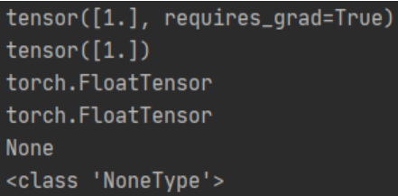

w是Tensor， forward函数的返回值也是Tensor，loss函数的返回值也是Tensor

本算法中反向传播主要体现在，l.backward()。调用该方法后w.grad由None更新为Tensor类型，且w.grad.data的值用于后续w.data的更新。``.backward()``会把计算图中所有需要梯度(grad)的地方都会求出来，然后把梯度都存在对应的待求的参数中，**最终计算图被释放**。 **取tensor中的data是不会构建计算图的**。 

# 使用Pytorch实现线性回归

训练步骤：

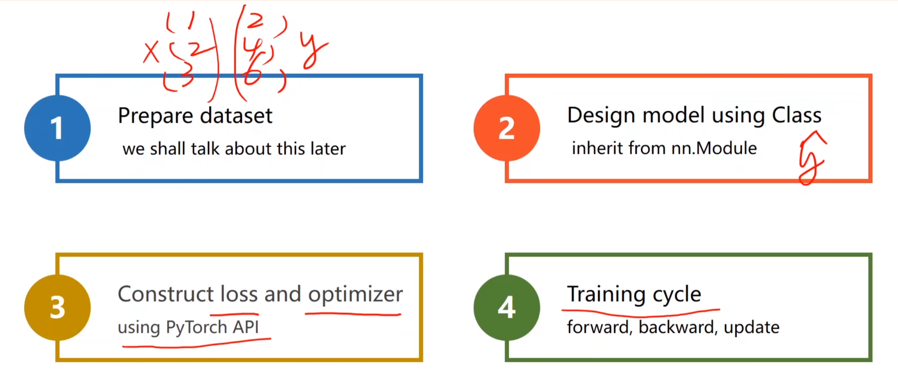

在我们设计的线性模型当中，数据集中的x和y都是一个矩阵：
$$
\left[\begin{array}{l}
y_{\text {pred }}^{(1)} \\
y_{\text {pred }}^{(2)} \\
y_{\text {pred }}^{(3)}
\end{array}\right]=\omega \cdot\left[\begin{array}{l}
x^{(1)} \\
x^{(2)} \\
x^{(3)}
\end{array}\right]+b
$$
在这个式子里其实就是这样的一个计算过程：
$$
\left\{\begin{array}{l}
\hat{y}_{1}=w \cdot x_{1}+b \\
\hat{y}_{2}=w \cdot x_{2}+b \\
\hat{y}_{3}=w \cdot x_{3}+b
\end{array}\right.
$$
在numpy中有一个矩阵的广播扩展特点：

有这样的两个矩阵相加：
$$
\begin{bmatrix}
1 & 2 & 3 \\
1 & 4 & 5 \\
2 & 4 & 6
\end{bmatrix} +
\begin{bmatrix}
1  \\
2  \\
3 
\end{bmatrix} 
$$
采用numpy的广播扩展就变为了这样：
$$
\begin{bmatrix}
1 & 2 & 3 \\
1 & 4 & 5 \\
2 & 4 & 6
\end{bmatrix} +
\begin{bmatrix}
1 & 2 & 3 \\
1 & 2 & 3 \\
1 & 2 & 3
\end{bmatrix} =
\begin{bmatrix}
2 & 4 & 6 \\
2 & 6 & 8 \\
3 & 6 & 9
\end{bmatrix}
$$
**在线性模型当中：$\hat{y}=w \cdot x+b$**当中，x和y都必须要是一个矩阵，假如说x是一个4×1的矩阵，输出的y是一个3×1的矩阵，那么$w$一定得是一个4×3的矩阵，b也得是一个4×1的矩阵才能符合矩阵的运算。**无论怎么拼，都要符合矩阵运算的正确性**


线性单元：

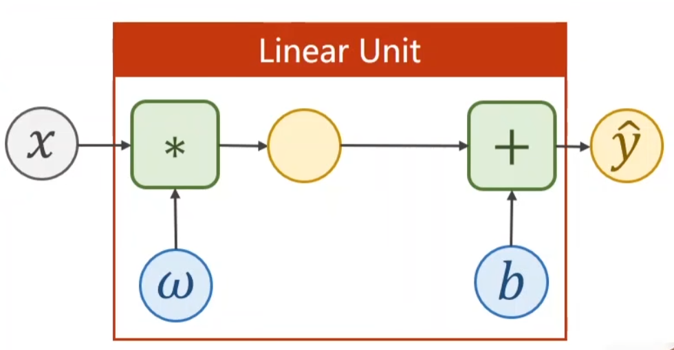

```python
import torch

x_data = torch.Tensor([[1.0], [2.0], [3.0]]) # x和y都是一个3×1的矩阵
y_data = torch.Tensor([[2.0], [4.0], [6.0]])

class LinearModel(torch.nn.Module):
    def __init__(self):
        super(LinearModel, self).__init__()
        self.linear = torch.nn.Linear(1,1) # 构造一个Linear unit对象，这个对象里包含w 和 b这两个参数的tensor，能够自动计算，并且自动反向传播

    def forward(self, x):
        y_pred = self.linear(x) # 这里Linear类会包含一个__call__()函数，在__call__()里会有forward函数的视线，所以在LinearModel我们所设计的这个类中，设计forward函数其实就是重写了linear类中的__call()__中的forward函数
        return y_pred

model = LinearModel()

criterion = torch.nn.MSELoss(size_average=False) # MSE计算损失的方法

optimizer = torch.optim.SGD(model.parameters(), lr = 0.01) # model.parameters()其实调用的是Linear.parameters(),这个函数可以找到所有需要训练的参数，lr是学习率

for epoch in range(100):
    y_pred = model(x_data) # 前馈过程
    loss = criterion(y_pred, y_data) # 计算损失
    print(epoch, loss) # 打印的时候会自动调用loss的__str()__，不会构建计算图

    optimizer.zero_grad() # 先将参数的梯度归0
    loss.backward() # 进行反向传播，更新参数的grad
    optimizer.step() # 根据参数和学习率自动更新参数的data

# Output weight and bias
print('w = ', model.linear.weight.item()) # 注意weight是一个矩阵，只有一个值，可以使用item();调用关系类似于：model->linear->weight
print('b = ', model.linear.bias.item())
# Test Model
x_test = torch.Tensor([[4.0]])
y_test = model(x_test)
print( 'y pred = ', y_test.data)
```

结果：

```python
0 tensor(35.8526, grad_fn=<MseLossBackward0>)
1 tensor(16.1425, grad_fn=<MseLossBackward0>)
2 tensor(7.3655, grad_fn=<MseLossBackward0>)
3 tensor(3.4557, grad_fn=<MseLossBackward0>)
4 tensor(1.7126, grad_fn=<MseLossBackward0>)
5 tensor(0.9341, grad_fn=<MseLossBackward0>)
6 tensor(0.5851, grad_fn=<MseLossBackward0>)
7 tensor(0.4273, grad_fn=<MseLossBackward0>)
8 tensor(0.3546, grad_fn=<MseLossBackward0>)
9 tensor(0.3199, grad_fn=<MseLossBackward0>)
10 tensor(0.3021, grad_fn=<MseLossBackward0>)
11 tensor(0.2919, grad_fn=<MseLossBackward0>)
12 tensor(0.2851, grad_fn=<MseLossBackward0>)
13 tensor(0.2799, grad_fn=<MseLossBackward0>)
14 tensor(0.2753, grad_fn=<MseLossBackward0>)
15 tensor(0.2711, grad_fn=<MseLossBackward0>)
16 tensor(0.2671, grad_fn=<MseLossBackward0>)
17 tensor(0.2632, grad_fn=<MseLossBackward0>)
18 tensor(0.2594, grad_fn=<MseLossBackward0>)
19 tensor(0.2557, grad_fn=<MseLossBackward0>)
20 tensor(0.2520, grad_fn=<MseLossBackward0>)
21 tensor(0.2484, grad_fn=<MseLossBackward0>)
22 tensor(0.2448, grad_fn=<MseLossBackward0>)
23 tensor(0.2413, grad_fn=<MseLossBackward0>)
24 tensor(0.2378, grad_fn=<MseLossBackward0>)
25 tensor(0.2344, grad_fn=<MseLossBackward0>)
26 tensor(0.2311, grad_fn=<MseLossBackward0>)
27 tensor(0.2277, grad_fn=<MseLossBackward0>)
28 tensor(0.2245, grad_fn=<MseLossBackward0>)
29 tensor(0.2212, grad_fn=<MseLossBackward0>)
30 tensor(0.2181, grad_fn=<MseLossBackward0>)
31 tensor(0.2149, grad_fn=<MseLossBackward0>)
32 tensor(0.2118, grad_fn=<MseLossBackward0>)
33 tensor(0.2088, grad_fn=<MseLossBackward0>)
34 tensor(0.2058, grad_fn=<MseLossBackward0>)
35 tensor(0.2028, grad_fn=<MseLossBackward0>)
36 tensor(0.1999, grad_fn=<MseLossBackward0>)
37 tensor(0.1970, grad_fn=<MseLossBackward0>)
38 tensor(0.1942, grad_fn=<MseLossBackward0>)
39 tensor(0.1914, grad_fn=<MseLossBackward0>)
40 tensor(0.1887, grad_fn=<MseLossBackward0>)
41 tensor(0.1860, grad_fn=<MseLossBackward0>)
42 tensor(0.1833, grad_fn=<MseLossBackward0>)
43 tensor(0.1807, grad_fn=<MseLossBackward0>)
44 tensor(0.1781, grad_fn=<MseLossBackward0>)
45 tensor(0.1755, grad_fn=<MseLossBackward0>)
46 tensor(0.1730, grad_fn=<MseLossBackward0>)
47 tensor(0.1705, grad_fn=<MseLossBackward0>)
48 tensor(0.1680, grad_fn=<MseLossBackward0>)
49 tensor(0.1656, grad_fn=<MseLossBackward0>)
50 tensor(0.1632, grad_fn=<MseLossBackward0>)
51 tensor(0.1609, grad_fn=<MseLossBackward0>)
52 tensor(0.1586, grad_fn=<MseLossBackward0>)
53 tensor(0.1563, grad_fn=<MseLossBackward0>)
54 tensor(0.1541, grad_fn=<MseLossBackward0>)
55 tensor(0.1518, grad_fn=<MseLossBackward0>)
56 tensor(0.1497, grad_fn=<MseLossBackward0>)
57 tensor(0.1475, grad_fn=<MseLossBackward0>)
58 tensor(0.1454, grad_fn=<MseLossBackward0>)
59 tensor(0.1433, grad_fn=<MseLossBackward0>)
60 tensor(0.1412, grad_fn=<MseLossBackward0>)
61 tensor(0.1392, grad_fn=<MseLossBackward0>)
62 tensor(0.1372, grad_fn=<MseLossBackward0>)
63 tensor(0.1352, grad_fn=<MseLossBackward0>)
64 tensor(0.1333, grad_fn=<MseLossBackward0>)
65 tensor(0.1314, grad_fn=<MseLossBackward0>)
66 tensor(0.1295, grad_fn=<MseLossBackward0>)
67 tensor(0.1276, grad_fn=<MseLossBackward0>)
68 tensor(0.1258, grad_fn=<MseLossBackward0>)
69 tensor(0.1240, grad_fn=<MseLossBackward0>)
70 tensor(0.1222, grad_fn=<MseLossBackward0>)
71 tensor(0.1205, grad_fn=<MseLossBackward0>)
72 tensor(0.1187, grad_fn=<MseLossBackward0>)
73 tensor(0.1170, grad_fn=<MseLossBackward0>)
74 tensor(0.1153, grad_fn=<MseLossBackward0>)
75 tensor(0.1137, grad_fn=<MseLossBackward0>)
76 tensor(0.1120, grad_fn=<MseLossBackward0>)
77 tensor(0.1104, grad_fn=<MseLossBackward0>)
78 tensor(0.1088, grad_fn=<MseLossBackward0>)
79 tensor(0.1073, grad_fn=<MseLossBackward0>)
80 tensor(0.1057, grad_fn=<MseLossBackward0>)
81 tensor(0.1042, grad_fn=<MseLossBackward0>)
82 tensor(0.1027, grad_fn=<MseLossBackward0>)
83 tensor(0.1012, grad_fn=<MseLossBackward0>)
84 tensor(0.0998, grad_fn=<MseLossBackward0>)
85 tensor(0.0984, grad_fn=<MseLossBackward0>)
86 tensor(0.0969, grad_fn=<MseLossBackward0>)
87 tensor(0.0955, grad_fn=<MseLossBackward0>)
88 tensor(0.0942, grad_fn=<MseLossBackward0>)
89 tensor(0.0928, grad_fn=<MseLossBackward0>)
90 tensor(0.0915, grad_fn=<MseLossBackward0>)
91 tensor(0.0902, grad_fn=<MseLossBackward0>)
92 tensor(0.0889, grad_fn=<MseLossBackward0>)
93 tensor(0.0876, grad_fn=<MseLossBackward0>)
94 tensor(0.0863, grad_fn=<MseLossBackward0>)
95 tensor(0.0851, grad_fn=<MseLossBackward0>)
96 tensor(0.0839, grad_fn=<MseLossBackward0>)
97 tensor(0.0827, grad_fn=<MseLossBackward0>)
98 tensor(0.0815, grad_fn=<MseLossBackward0>)
99 tensor(0.0803, grad_fn=<MseLossBackward0>)
w =  1.8113371133804321
b =  0.4288749396800995
y pred =  tensor([[7.6742]])
```

结果我们发现b一直没有归0，可以尝试增加训练次数：

```python
995 tensor(7.4128e-07, grad_fn=<MseLossBackward0>)
996 tensor(7.3041e-07, grad_fn=<MseLossBackward0>)
997 tensor(7.2011e-07, grad_fn=<MseLossBackward0>)
998 tensor(7.0983e-07, grad_fn=<MseLossBackward0>)
999 tensor(6.9929e-07, grad_fn=<MseLossBackward0>)
w =  1.9994432926177979
b =  0.001265619182959199
y pred =  tensor([[7.9990]])
```

`torch.nn.Linear()`参数：


`torch.nn.MSEloss`参数：


size_average就是计算平均损失，意义不大。

`torch.optim.SGD`参数


代码逻辑结构：


see more in Pytorch page：


# Logistic Regression

叫回归，但分类！

分类的结果不是确切的给出某一个类，而是给出对于给定的输入，输出所有类下的概率值，那个输出类的概率值越大，我们就能判断该输入属于哪个类。

**因此最后的结果就是各个类的概率值，并且所有类的概率值加起来等于1**

对于线性回归得到的结果是在一整个实数域里，采用sigmoid函数可以将线性回归得到的结果映射到[0, 1] 当中。

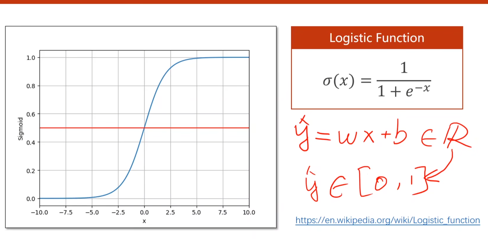

sigmoid函数的导函数大致形状是这样的：

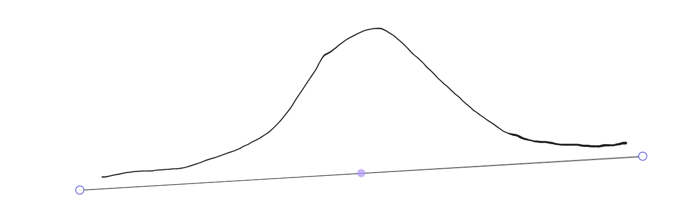

对于某一个函数，大于0时，导数随着x增大逐渐趋近于0，小于0时，导数随着x减小逐渐趋近于0，这种函数叫做**饱和函数**，长得有点像是正态分布。

其他sigmoid函数：

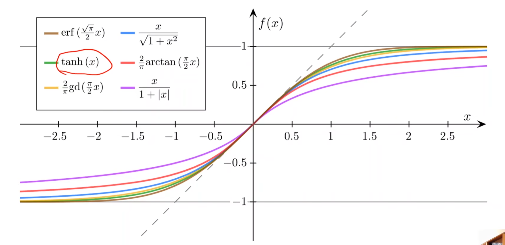

**由于Logistic Function使用比较多，所以很多时候它就成了sigmoid函数**


**在论文中看到$\sigma (……)$**这里的$\sigma $指的就是sigmoid函数

我们在线性回归里用到的MSE损失函数：
$$
\text { loss }=(\hat{y}-y)^{2}=(x \cdot \omega-y)^{2}
$$
反应的是$y$与$\hat{y}$之间的距离，而对于二分类任务，我们得到的$y$与$\hat{y}$之间是两个分布之间的差距，是一种离散的数据表示。对于这种情况我们可以使用**KL散度**与**交叉熵**。

交叉熵如何计算两个分布之间的差异？
$$
H(P, Q) = -\sum_x P(x) \log Q(x)
$$


例如：

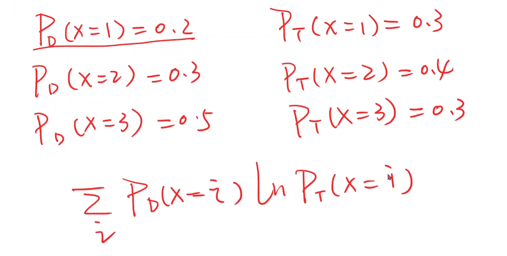

利用交叉熵得到的二分类的loss如下：
$$
\text { loss }=-(y \log \hat{y}+(1-y) \log (1-\hat{y}))
$$
$y = 1$的时候，$loss = -y \log \hat{y}$，得到的loss就是一个减函数，里面的log就是一个增函数，$\hat{y}$的值最大为1，要想让$\hat{y}$逼近$y$，$\hat{y}$只能接近于1才能与$y$一样，最后的loss也就取到最小值。

$y = 0$的时候，$loss = -\log (1-\hat{y})$，得到的loss就是一个增函数，只要当$\hat{y}$趋近于$y = 0$ 的时候，loss才最小。

带入值进行查看：


最后的Mini-Batch就是求均值。

深度学习4个基本步骤：

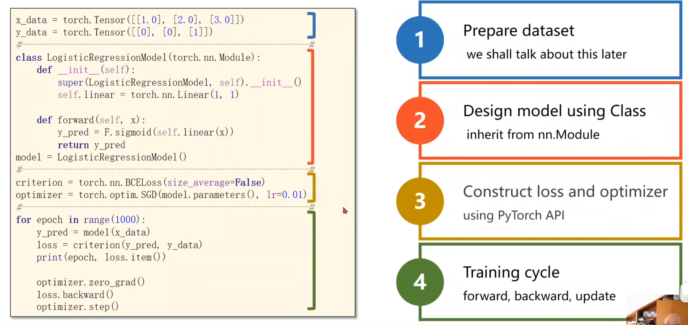

```python
import torch.nn
import torchvision

import torch.nn.functional as F

# 对于这样一个训练数据，可以理解为，对于一门科目，每周用1、2小时都没通过，用了3小时就通过了，问用4小时能通过吗？
x_data = torch.Tensor([[1.0], [2.0], [3.0]])
y_data = torch.Tensor([[0], [0], [1]])

class LogisticRegressionModel(torch.nn.Module):
    def __init__(self):
        super(LogisticRegressionModel, self).__init__()
        self.linear = torch.nn.Linear(1, 1)

    def forward(self, x):
        y_pred = F.sigmoid(self.linear(x))  # 注意这里将输出再输入到sigmoid函数中
        return y_pred

model = LogisticRegressionModel()

# 有一个二分类任务，并且使用 BCELoss 来计算损失，对于一批包含多个样本的数据，size_average=True 将返回这批
# 数据的平均损失，而 size_average=False 将返回这批数据的总损失。
criterion = torch.nn.BCELoss(size_average=False) # BCE计算损失的方法
# model.parameters()：这是传递给优化器的第一个参数，
# 它返回一个包含模型所有可学习参数（即权重和偏置等）的迭代器。这些参数将会被优化器用来进行梯度下降。
optimizer = torch.optim.SGD(model.parameters(), lr = 0.01)

for epoch in range(1000):
    y_pred = model(x_data) # 前馈过程
    loss = criterion(y_pred, y_data) # 计算损失
    print(epoch, loss) # 打印的时候会自动调用loss的__str()__，不会构建计算图

    optimizer.zero_grad() # 先将参数的梯度归0
    loss.backward() # 进行反向传播，更新参数的grad
    optimizer.step() # 根据参数和学习率自动更新参数的data

# Output weight and bias
print('w = ', model.linear.weight.item()) # 注意weight是一个矩阵，只有一个值，可以使用item();调用关系类似于：model->linear->weight
print('b = ', model.linear.bias.item())
# Test Model
x_test = torch.Tensor([[4.0]])
y_test = model(x_test)
print( 'y pred = ', y_test.data)
```

```python
993 tensor(1.0491, grad_fn=<BinaryCrossEntropyBackward0>)
994 tensor(1.0486, grad_fn=<BinaryCrossEntropyBackward0>)
995 tensor(1.0481, grad_fn=<BinaryCrossEntropyBackward0>)
996 tensor(1.0477, grad_fn=<BinaryCrossEntropyBackward0>)
997 tensor(1.0472, grad_fn=<BinaryCrossEntropyBackward0>)
998 tensor(1.0467, grad_fn=<BinaryCrossEntropyBackward0>)
999 tensor(1.0462, grad_fn=<BinaryCrossEntropyBackward0>)
w =  1.1991130113601685
b =  -2.896817922592163
y pred =  tensor([[0.8699]])
```

我们测试一组数据，x的值从0到10：

```python
import numpy as np  # 导入 NumPy 库，用于数值计算
import matplotlib.pyplot as plt  # 导入 Matplotlib 的 pyplot 模块，用于绘图

x = np.linspace(0, 10, 200)  # 创建一个从 0 到 10 的等差数列，包含 200 个点
x_t = torch.Tensor(x).view((200, 1))  # 将 x 转换为 PyTorch 张量，并重塑为 200x1 的二维张量
y_t = model(x_t)  # 使用预定义的模型 'model' 对输入张量 x_t 进行预测，得到输出张量 y_t
y = y_t.data.numpy()  # 将 PyTorch 张量 y_t 转换回 NumPy 数组
plt.plot(x, y)  # 绘制 x 和 y 的关系图
plt.plot([0, 10], [0.5, 0.5], c='r')  # 绘制一条水平线，从 (0, 0.5) 到 (10, 0.5)，颜色为红色
plt.xlabel('Hour')  # 设置 x 轴标签为 'Hour'
plt.ylabel('Probability of pass')  # 设置 y 轴标签为 'Probability of pass'
plt.grid()  # 在图表上添加网格线
plt.show()  # 显示图形
```


我们发现学习时长在2.5左右的时候，通过率为0.5。越大，通过率越高，越小接近于0，通过率越低。

# 处理多维输入的数据

对于这样的一个多维数据：


一行为一个样本，一列为一个特征。

对于这样的输入数据，Logistic Regression Model就有变成这样：


输入的数据有8个特征，其中
$$
\sum_{n=1}^{8} \mathbf{x}_n^{(i)} \cdot \omega_n = [\mathbf{x}_1^{(i)}, \ldots, \mathbf{x}_8^{(i)}] \begin{bmatrix}
    \omega_1 \\
    \vdots \\
    \omega_8
\end{bmatrix}
$$
然后模型就变为了这样：
$$
\hat{y}^{(i)} = \sigma(\left[\begin{array}{ccc}
    x_1^{(i)} & \cdots & x_8^{(i)}
\end{array}\right]\left[\begin{array}{c}
    \omega_1 \\ \vdots \\ \omega_8
\end{array}\right] + b) \\
= \sigma(Z^{(i)})
$$
其中：
$$
Z^{(i)} =\left[\begin{array}{ccc}
    x_1^{(i)} & \cdots & x_8^{(i)}
\end{array}\right]\left[\begin{array}{c}
    \omega_1 \\ \vdots \\ \omega_8
\end{array}\right] + b
$$
这里的$\sigma()$就是sigmoid函数$\sigma(x) = \frac{1}{1+e^{-x}} $。

对于每一个$Z^{(i)}$，从第一个到第八个都需要计算$\sigma()$函数：


在Pytorch中，提供给的exp函数支持对向量中每一个元素进行处理（也就是按照向量计算的形式）：

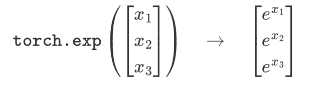

这里就变成了这样：

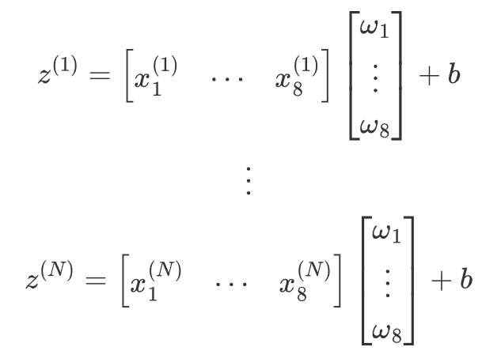

$z^{(i)}$可以组合成一个向量，那么结果就可以表示为这样：

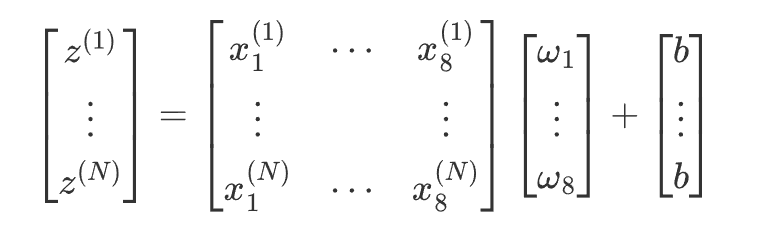

即变为了这样，变成了矩阵的运算：


针对输入的特征数量发生变化，我们在代码中作如下修改：

```python
class Model(torch.nn.Module):
    def __init__(self):
        super(Model, self).__init__()
        self.linear = torch.nn.Linear(8, 1) # 输入8维，输出1维

    def forward(self, x):
        y_pred = F.sigmoid(self.linear(x))  
        return y_pred
```

在设计模型的时候`self.linear = torch.nn.Linear(8, 1)`，就意味着输入8维输出1维，就上一个例子而言，输入是一个$N×8$的，输出是一个$N×1$的，那么参数矩阵就是一个$8×1$的。

如果代码是这样的呢？`self.linear = torch.nn.Linear(8, 2)`，这一个线性模型就是将一个$N×8$的输入映射到一个$N×2$的输出当中，因为这只是一个线性变化，在线性代数当中$Y = A X + b$，其实就是将$X$向量经过矩阵$A$变换到$Y$向量。**这是一套纯粹的线性变化。**还是接着输出$N×2$维，我们最后的结果依然是$N×1$维的，那怎么办？继续采用线性变化，将$N×2$维映射到$N×1$维的。变化矩阵就是一个$2×1$大小的矩阵。

但是注意，我们每做一次线性变化，都将线性变化的结果加上sigmoid函数，使得加完sigmoid后，这一步最后的结果无法直接使用线性变化的式子表达出来，也就是加入sigmoid引入非线性。经过一层线性变换后，将结果进行sigmoid，然后再经过一层线性变化之后，将结果进行sigmoid，最后经过一层有一层的线性变化，并在每一层线性变化之后加入sigmoid（激活函数）从而形成一个多层的线性变换+激活函数的网络，使得整个的网络具有非线性。

可以从8维降到6维然后再降到2维，然后再……

也可以从8维升到24维，然后再升到12维，然后再……


**一般来说，中间层数越多，中间的神经元越多，则整个网络取得的非线性变化的学习能力越强。**但是学习能力越强也不一定很好，因为学习特别好可能会把输入数据中的噪声也学习进去了，噪声是我们不想要的数据。


```python
#!/usr/bin/env python
# -*- coding: UTF-8 -*-
'''
@File      ：Multiple_Dimension_Input.py
@IDE       ：PyCharm 
@Author    ：lml
@Date      ：2024/9/29 20:04 
@Descriable：处理多维输入数据
'''
import torch
import torch.nn.functional as F
import numpy as np

# 读取数据
# 加载数据，使用csv可以，将其压缩成gz也可以；对于神经网络里使用float32就已经足够了，只有极少数的显卡会用到double类型
xy = np.loadtxt('diabetes.csv.gz', delimiter=',', dtype=np.float32)
# 利用from_numpy可以将numpy数据转成Tensor数据
x_data = torch.from_numpy(xy[:, : -1]) # x_data要所有行，然后从第一列开始到倒数第二列，最后一列不要
y_data = torch.from_numpy(xy[:, [-1]]) # y_data要所有行，然后只取最后一列

class Model(torch.nn.Module):
    def __init__(self):
        # super(Model, self).__init__() 这行代码的作用是调用 Model 类的父类（在这个情况下是
        # torch.nn.Module）的构造函数（即 __init__ 方法）。
        super(Model, self).__init__()
        self.linear1 = torch.nn.Linear(8, 6)
        self.linear2 = torch.nn.Linear(6, 4)
        self.linear3 = torch.nn.Linear(4, 1)
        self.sigmoid = torch.nn.Sigmoid()

    def forward(self, x):
        x = self.sigmoid(self.linear1(x))
        x = self.sigmoid(self.linear2(x))
        x = self.sigmoid(self.linear3(x))
        return x

model = Model()

criterion = torch.nn.BCELoss(size_average=True)
optimizer = torch.optim.SGD(model.parameters(), lr= 0.1)

for epoch in range(100):
    y_pred = model(x_data) # 这里是将所有的x都传输进来了，并没有使用mini-batch
    loss = criterion(y_pred, y_data)
    print(epoch, loss.item())

    optimizer.zero_grad()
    loss.backward()

    optimizer.step()

```

```python
93 0.6453307271003723
94 0.6453298926353455
95 0.6453291177749634
96 0.6453282237052917
97 0.6453273892402649
98 0.6453266143798828
99 0.6453257203102112
```

如果我对模型做如下的修改：

```python
class Model(torch.nn.Module):
    def __init__(self):
        # super(Model, self).__init__() 这行代码的作用是调用 Model 类的父类（在这个情况下是
        # torch.nn.Module）的构造函数（即 __init__ 方法）。
        super(Model, self).__init__()
        self.linear1 = torch.nn.Linear(8, 6)
        self.linear2 = torch.nn.Linear(6, 4)
        self.linear3 = torch.nn.Linear(4, 1)
        self.sigmoid = torch.nn.Sigmoid()
        self.relu = torch.nn.ReLU()

    def forward(self, x):
        x = self.relu(self.linear1(x))
        x = self.relu(self.linear2(x))
        x = self.relu(self.linear3(x))
        return x
```

会发现运行会出错，
```python
Traceback (most recent call last):
  File "D:\Learning\Experiments\ML_Study\DeepLearning\07_Multiple_Dimension_Input\Multiple_Dimension_Input.py", line 45, in <module>
    loss = criterion(y_pred, y_data)
  File "D:\Sofeware\anaconda\envs\ML\lib\site-packages\torch\nn\modules\module.py", line 1553, in _wrapped_call_impl
    return self._call_impl(*args, **kwargs)
  File "D:\Sofeware\anaconda\envs\ML\lib\site-packages\torch\nn\modules\module.py", line 1562, in _call_impl
    return forward_call(*args, **kwargs)
  File "D:\Sofeware\anaconda\envs\ML\lib\site-packages\torch\nn\modules\loss.py", line 621, in forward
    return F.binary_cross_entropy(input, target, weight=self.weight, reduction=self.reduction)
  File "D:\Sofeware\anaconda\envs\ML\lib\site-packages\torch\nn\functional.py", line 3172, in binary_cross_entropy
    return torch._C._nn.binary_cross_entropy(input, target, weight, reduction_enum)
RuntimeError: all elements of input should be between 0 and 1
```

是因为 `BCELoss`（二元交叉熵损失）要求输入（预测值 `y_pred`）必须在 0 和 1 之间。然而，在你的模型定义中，最后一层使用了 ReLU 激活函数，ReLU 函数可以输出任意非负数，这意味着输出可能大于 1，这不符合 BCELoss 的要求。

为了修复这个问题，你需要确保模型的最后一层输出是经过 Sigmoid 激活函数处理的，因为 Sigmoid 函数将输出压缩到 (0, 1) 范围内，这样就符合 BCELoss 的输入要求了。

我们现在观察一下RELU函数图像：

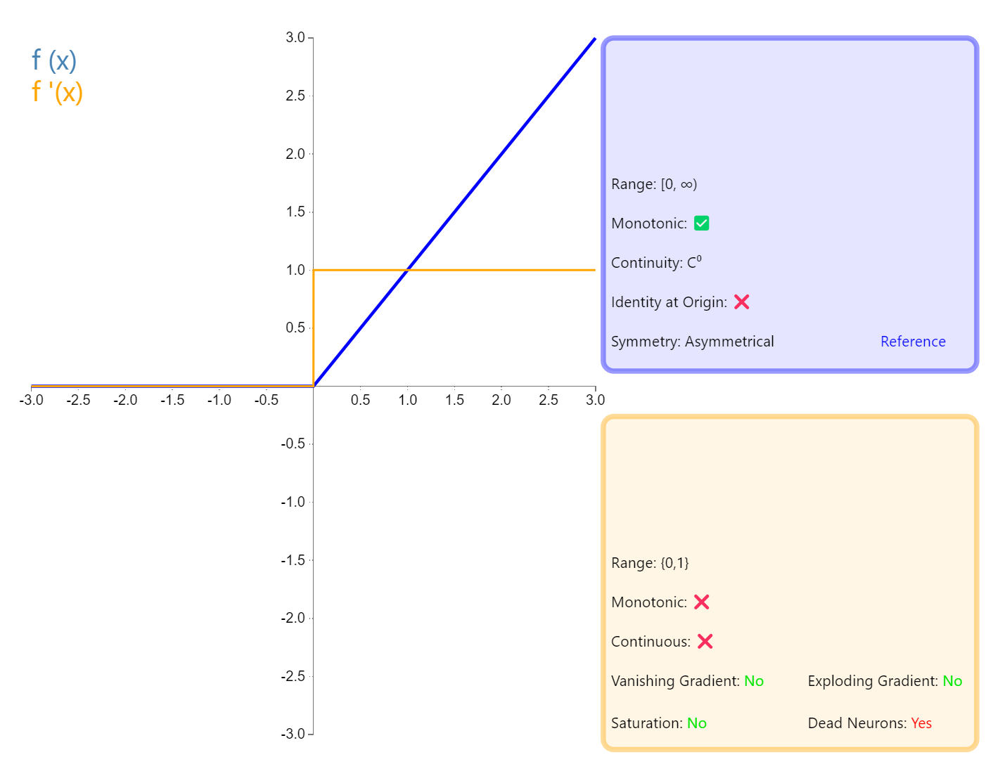

结果却是是这样，而且如果输入小于0，直接变为0，如果后续计算$log$的操作，就会出现异常，除此之外，输出也可能按照我们的这个问题，会大于1，不能再传入BCE里面。

可以这样修改问题：

```python
    def forward(self, x):
        x = self.relu(self.linear1(x))
        x = self.relu(self.linear2(x))
        x = self.sigmoid(self.linear3(x))
        return x
```

结果：

```python
995 0.4600551724433899
996 0.46004602313041687
997 0.46003690361976624
998 0.4600277543067932
999 0.46001866459846497
```

最后我们的损失值降到了0.4多。可以看出这是**有进步的！！！**

## 激活函数

https://dashee87.github.io/deep%20learning/visualising-activation-functions-in-neural-networks/


改变不同的激活函数能够降低损失，比如这里换成RELU激活函数

# Dataset和Dataloader

## `epoch`、`Batch-Size`与`Iteration`定义

epoch就是训练的次数；

Batch-Size就是每个mini-batch的大小，即进行一次前馈和反向传播的样本数量的大小；

Iteration就是总的样本数量÷Batch-Size，即做几次前馈和反向传播。

DataLoader：

**参数：**

* batch_size：指定mini-batch的大小
* shuffle：Ture / False 选取mini-batch的时候是不是随机选取的。

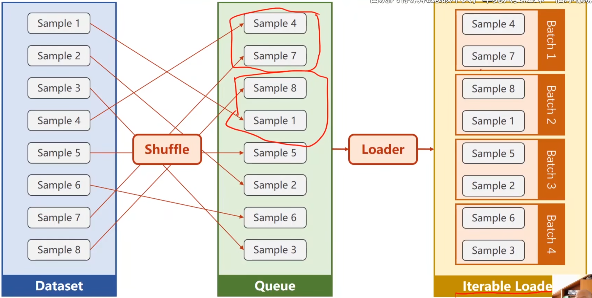

基本的数据集类可以如下所示：

```python
class DiabetesDataset(Dataset):
    def __init__(self):
        pass

    def __getitem__(self, item): # 类似于之间讲过的__call()__魔法方法，以后可以利用[i]索引到数据
        pass

    def __len__(self): # 魔法方法，返回Dataset的长度
        pass
```

对于``__init()__`方法中我们有如下两种处理数据的方法：

* 如果数据集很小，我们可以全部读取进来；比如糖尿病的那个关系表，就很简单
* 如果数据集很大，比如说很多张图片，可以先将图片文件名做成一个列表，对应的结果如果比较小，也可以全部读进来，如果比较大，也将对应的结果文件名做成列表，Dataloader读到i个文件的时候，再将i个文件加载进内存。属于是动态加载数据确实

可能会遇到的问题：在创建子进程的时候可能因为系统的问题出现这样的问题，即win下面生成子进程使用的spawn函数，fork是Linux下的新建子进程的函数。如果遇到这种情况，加一个if语句就可以：


错误：


如果遇到这种情况，加一个if语句就可以：

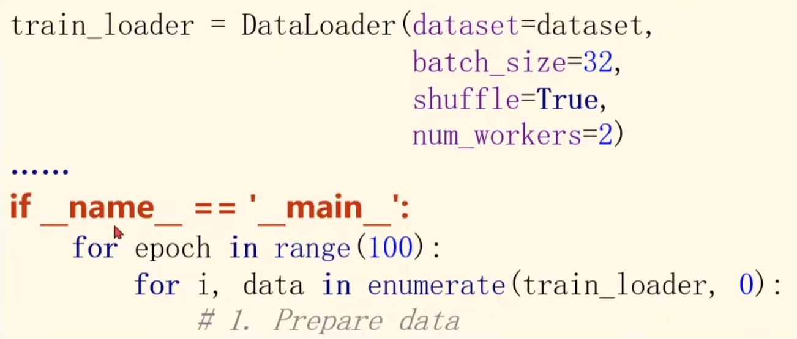


对于` for i, data in enumerate(train_loader, 0):`的理解：

用于遍历一个数据加载器（`train_loader`），通常在训练神经网络时使用。让我们分解一下这行代码：

- `for i, data in ...`：这是一个 for 循环，其中 `i` 是当前迭代的索引（从 0 开始），而 `data` 是从 `train_loader` 中获取的数据批次。
- `enumerate(..., 0)`：`enumerate` 是 Python 的内置函数，它允许你在遍历序列（如列表、元组等）时同时获得元素及其对应的索引。第二个参数 `0` 指定了索引的起始值，默认情况下就是 0，所以这里可以省略。

`train_loader` 通常是 `torch.utils.data.DataLoader` 类的一个实例，它提供了对数据集的迭代访问，并且可以自动处理批处理、数据混洗等功能。每次迭代时，`train_loader` 会返回一个批次的数据，这个数据通常是一个包含输入和标签的元组。

```python
#!/usr/bin/env python
# -*- coding: UTF-8 -*-
'''
@File      ：Dataset_DataLoader_Use.py
@IDE       ：PyCharm 
@Author    ：lml
@Date      ：2024/10/9 20:58 
@Descriable：Dataset DataLoader使用
'''
import numpy as np
import torch
from torch.utils.data import Dataset # Dataset是一个抽象类，不能实例化，只能被继承
from torch.utils.data import DataLoader # Dataloader是用来加载数据的做batch-size和Shuffle

class DiabetesDataset(Dataset):
    def __init__(self, filepath):
        xy = np.loadtxt(filepath, delimiter=',', dtype=np.float32)
        self.len = xy.shape[0] # 在糖尿病这个数据集里读取到的xy就是一个二维数据，是一个N×9的二维数组，这个二维数组的shape是一个(N, 9)的元组，那么shape[0]读取到的就是N
        self.x_data = torch.from_numpy(xy[:, : -1])
        self.y_data = torch.from_numpy(xy[:, [-1]])

    def __getitem__(self, index): # 类似于之间讲过的__call()__魔法方法，以后可以利用[i]索引到数据
        return self.x_data[index], self.y_data[index] # 返回的是一个元组

    def __len__(self): # 魔法方法，返回Dataset的长度
        return self.len

class Model(torch.nn.Module):
    def __init__(self):
        # super(Model, self).__init__() 这行代码的作用是调用 Model 类的父类（在这个情况下是
        # torch.nn.Module）的构造函数（即 __init__ 方法）。
        super(Model, self).__init__()
        self.linear1 = torch.nn.Linear(8, 6)
        self.linear2 = torch.nn.Linear(6, 4)
        self.linear3 = torch.nn.Linear(4, 1)
        self.sigmoid = torch.nn.Sigmoid()
        self.relu = torch.nn.ReLU()

    def forward(self, x):
        x = self.relu(self.linear1(x))
        x = self.relu(self.linear2(x))
        x = self.sigmoid(self.linear3(x))
        return x

dataset = DiabetesDataset('diabetes.csv.gz')
train_loader = DataLoader(dataset=dataset, batch_size=32, shuffle=True, num_workers=2) # num_workers表示需要几个并行的线程读取数据集

model = Model()

criterion = torch.nn.BCELoss(size_average=True)
optimizer = torch.optim.SGD(model.parameters(), lr= 0.1)

if __name__ == '__main__':
    for epoch in range(100):
        for i, data in enumerate(train_loader, 0):
            # 准备数据
            # 读取一个一个的样本与标签，直到达到batch-size，将读取到的样本与标签存入data，然后再分为inputs和labels
            inputs, labels = data
            # 进行前向传播
            y_pred = model(inputs)
            loss = criterion(y_pred, labels)
            print(epoch, i, loss.item())

            # 进行反向传播
            optimizer.zero_grad()
            loss.backward()

            # 更新优化器
            optimizer.step()
```

输出：

```python
99 0 0.2786310613155365
99 1 0.3610200881958008
99 2 0.28721973299980164
99 3 0.3709169626235962
99 4 0.4949190318584442
99 5 0.3622228801250458
99 6 0.40255066752433777
99 7 0.4111954867839813
99 8 0.357909232378006
99 9 0.4491279721260071
99 10 0.5299336314201355
99 11 0.43551206588745117
99 12 0.36443111300468445
99 13 0.44266992807388306
99 14 0.6776905059814453
99 15 0.3197677731513977
99 16 0.5225685834884644
99 17 0.4366188645362854
99 18 0.46013760566711426
99 19 0.4385663866996765
99 20 0.4892987310886383
99 21 0.5385307669639587
99 22 0.681429386138916
99 23 0.4345366060733795
```

# 多分类问题

在Diabetes Dataset里，该任务就是一个二分类的任务，一般来说我们设计的神经网络如图所示：

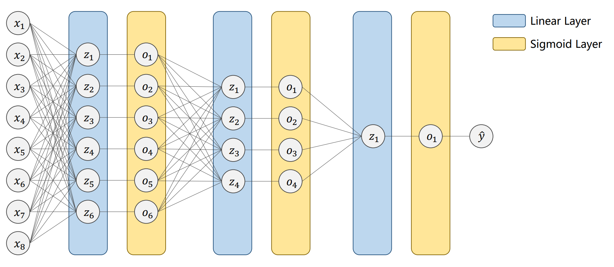

我们设计的这个神经网络最后是一个输出，输出的值经过sigmoid函数转换得到一个介于0-1的数，为什么？

我们尝试对代码进行修改：

```python
class Model(torch.nn.Module):
    def __init__(self):
        # super(Model, self).__init__() 这行代码的作用是调用 Model 类的父类（在这个情况下是
        # torch.nn.Module）的构造函数（即 __init__ 方法）。
        super(Model, self).__init__()
        self.linear1 = torch.nn.Linear(8, 6)
        self.linear2 = torch.nn.Linear(6, 4)
        self.linear3 = torch.nn.Linear(4, 1)
        self.sigmoid = torch.nn.Sigmoid()
        self.relu = torch.nn.ReLU()

    def forward(self, x):
        x = self.relu(self.linear1(x))
        x = self.relu(self.linear2(x))
        # x = self.sigmoid(self.linear3(x))
        x = self.linear3(x)
        return x
```

在模型设计的最后一层，去掉sigmoid函数，我们尝试运行代码，会得到如下的错误：

```python
Traceback (most recent call last):
  File "D:\Learning\Experiments\ML_Study\DeepLearning\07_Multiple_Dimension_Input\Multiple_Dimension_Input.py", line 46, in <module>
    loss = criterion(y_pred, y_data)
  File "D:\Sofeware\anaconda\envs\ML\lib\site-packages\torch\nn\modules\module.py", line 1553, in _wrapped_call_impl
    return self._call_impl(*args, **kwargs)
  File "D:\Sofeware\anaconda\envs\ML\lib\site-packages\torch\nn\modules\module.py", line 1562, in _call_impl
    return forward_call(*args, **kwargs)
  File "D:\Sofeware\anaconda\envs\ML\lib\site-packages\torch\nn\modules\loss.py", line 621, in forward
    return F.binary_cross_entropy(input, target, weight=self.weight, reduction=self.reduction)
  File "D:\Sofeware\anaconda\envs\ML\lib\site-packages\torch\nn\functional.py", line 3172, in binary_cross_entropy
    return torch._C._nn.binary_cross_entropy(input, target, weight, reduction_enum)
RuntimeError: all elements of input should be between 0 and 1

```

在后续训练的代码中，y_pred这个数超过了0-1的区间，y_data这个是数据集里的标签，肯定不会超过0-1这个区间。因此需要在最后一层加一个sigmoid函数，将第三层隐藏层得到的值映射到0-1区间里，这样对于用户直观的感受就是一个概率值，即是不是糖尿病，那对应的不是糖尿病的概率就是用1$-$模型得到的概率值。如果采用其他的激活函数得到的值是不一样的。

该二分类是使用交叉熵得到的loss计算方法：
$$
\text { loss }=-(y \log \hat{y}+(1-y) \log (1-\hat{y}))
$$
只是计算一个类的“得分”，然后将这个这个“得分”传入到sigmoid函数里得到概率。

如果继续采用这种方式，对于多分类的问题如何处理？

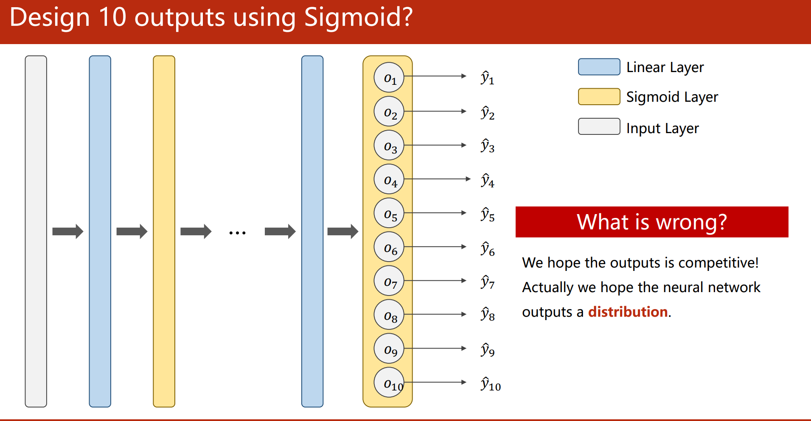

首先对于多分类问题，如果输出的是所有类别的概率值，那我们得有一个基本的尝试就是：

* 所有类别的概率输出应该大于0
* 所有类别的概率输出加起来应该等于1

如果我们继续采用交叉熵的方法
$$
\text { loss }=-(y \log \hat{y}+(1-y) \log (1-\hat{y}))
$$
其实是将每一个类都看成了一个二分类的问题，每次得到的输出都是该类的“得分”，如果不是这个类，那么按照二分类的逻辑，只需要用1$-$这个概率值就能得到，但是这个结果没有顾忌到其他类的“感受”。所以会出现所有类的结果概率值的和不为1。

因此最后一层就引入了Softmax Layer：

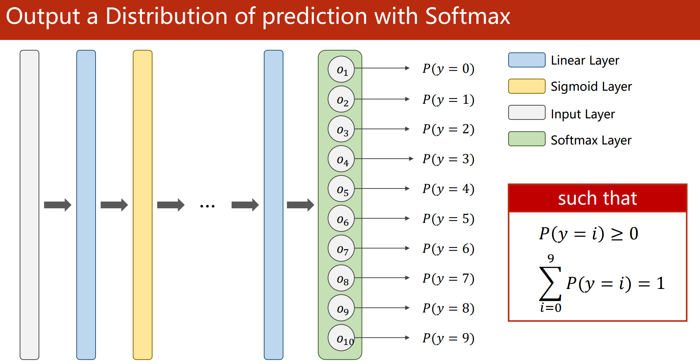

## Softmax 是如何实现的？

首先我们看Softmax的定义：

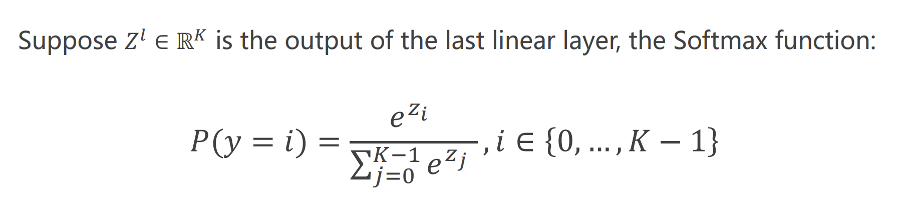

这里就是对于最后一个隐藏层的输出$Z_{i}$，在Softmax的这一层里先取$e^{Z_{i}}$，然后再将这个值÷所有输出的exp的和。得到的就是对应类输出的概率值。

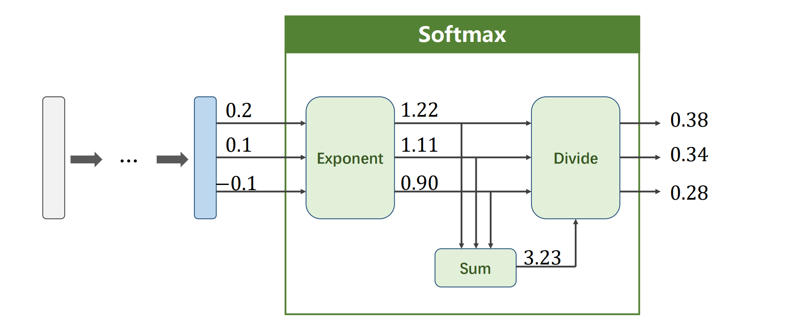

**这么看这个式子是满足之前设定的条件的。**

那loss怎么计算导数呢？

在二分类问题中，我们使用交叉熵计算loss：
$$
\text { loss }=-(y \log \hat{y}+(1-y) \log (1-\hat{y}))
$$
在运算的时候其实只有一项，即$loss =-y \log \hat{y} $或者$loss = -(1-y) \log (1-\hat{y})$。

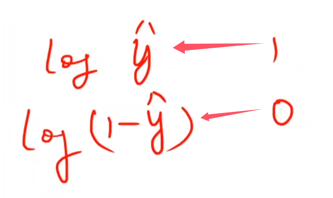

同样类似，对于多分类问题也可以这么处理：

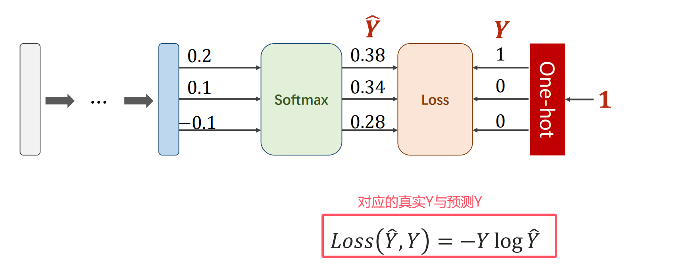

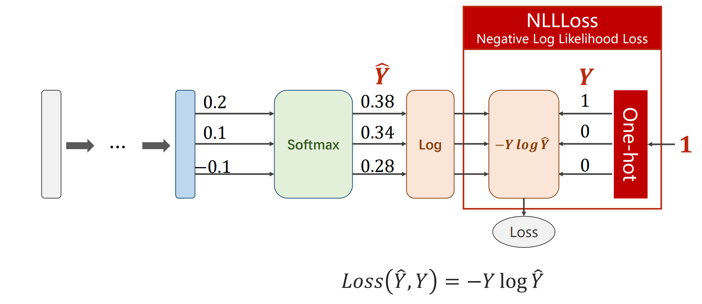

```python
import numpy as np
y = np.array([1, 0, 0])
z = np.array([0.2, 0.1, -0.1])
y_pred = np.exp(z) / np.exp(z).sum()
loss = (- y * np.log(y_pred)).sum()
print(loss)

# 结果
0.9729189131256584
```

这是使用numpy的方式实现的

在Pytorch中已经有一整套框架帮我们做了：

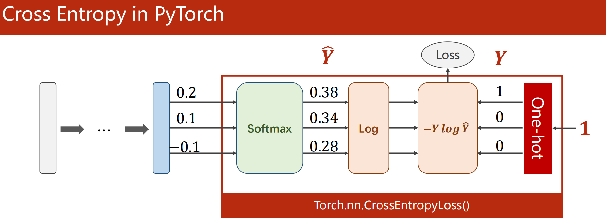

```python
import torch
criterion = torch.nn.CrossEntropyLoss()
Y = torch.LongTensor([2, 0, 1]) #在数据集中，有三个样本预测得到的类分别为第2类、第0类与第1类
Y_pred1 = torch.Tensor([[0.1, 0.2, 0.9], # 这个样本第2类预测得分高
                        [1.1, 0.1, 0.2], # 这个样本第0类预测得分高
                        [0.2, 2.1, 0.1]]) # 这个样本第1类预测得分高
Y_pred2 = torch.Tensor([[0.8, 0.2, 0.3], # 这个样本第0类预测得分高，与标签第2类出入较大
                        [0.2, 0.3, 0.5],
                        [0.2, 0.2, 0.5]])
l1 = criterion(Y_pred1, Y)
l2 = criterion(Y_pred2, Y)
print("Batch Loss1 = ", l1.data, "\nBatch Loss2=", l2.data)
```

```python
Batch Loss1 =  tensor(0.4966) 
Batch Loss2= tensor(1.2389)
```

### 什么是One-hot编码？

One-hot编码将一个类别标签表示为一个与类别数相同长度的向量，其中：

- 该向量中只有一个位置是1，其余位置全为0。
- 这个“1”代表了该数据属于的类别。

举个例子，假设有3个类别（A、B、C），使用one-hot编码表示这些类别：

- 类别A的one-hot编码为：`[1, 0, 0]`
- 类别B的one-hot编码为：`[0, 1, 0]`
- 类别C的one-hot编码为：`[0, 0, 1]`

### 2. 为什么交叉熵损失可以简化成这个样子？

交叉熵损失的公式是：
$$
\text{CrossEntropyLoss} = - \sum_{i=1}^{C} P(y_i) \log(\hat{P}(y_i))
$$
其中：

- \( $P(y_i)$ \) 是真实类别 \( $y_i$ \) 的概率（在分类问题中，这是一个one-hot向量）。
- \( $\hat{P}(y_i)$ \) 是模型对类别 \( $y_i$ \) 的预测概率。

在分类任务中，真实类别的标签是one-hot编码的，这意味着对于某个样本，真实标签中只有一个位置是1，其他位置都是0。假设该样本属于类别 \( $y_{\text{true}} $\)，那么 \( $P(y_{\text{true}}) = 1$ \)，而对于其他类别 \( $P(y_i) = 0$ \) （$ i \neq y_{\text{true}} $）。

因此，交叉熵损失的求和只需要考虑 \( $P(y_{\text{true}}) = 1$ \) 的那一项，其他项 \( $P(y_i)$ \) 都为0，整个公式就可以简化为：
$$
\text{CrossEntropyLoss} = - \log(\hat{P}(y_{\text{true}}))
$$
这里的 \( $\hat{P}(y_{\text{true}}) $\) 是模型对正确类别的预测概率。

### 3. 为什么可以这样简化？

由于one-hot编码的特性，只对正确类别的损失进行计算，因为其他类别的真实概率为0，它们不影响损失值。这种方式有效地简化了损失函数的计算，同时保持了对分类结果的正确评估。

**总结**：

- **One-hot编码** 是一种表示分类标签的方式，它使得交叉熵损失只考虑正确类别的预测概率。
- 在单标签分类问题中，交叉熵损失可以简化为计算正确类别的负对数预测概率。

这段代码的具体计算过程：

在这段代码中，`Y = torch.LongTensor([2, 0, 1])` 和 `Y_pred1` 表示以下内容：

1. **`Y` 表示什么？**

`Y = torch.LongTensor([2, 0, 1])` 表示在一个数据集中有3个样本，它们的真实类别（标签）分别是：
- 第一个样本的真实类别是**2**（对应第3类，类别的索引从0开始）。
- 第二个样本的真实类别是**0**（对应第1类）。
- 第三个样本的真实类别是**1**（对应第2类）。

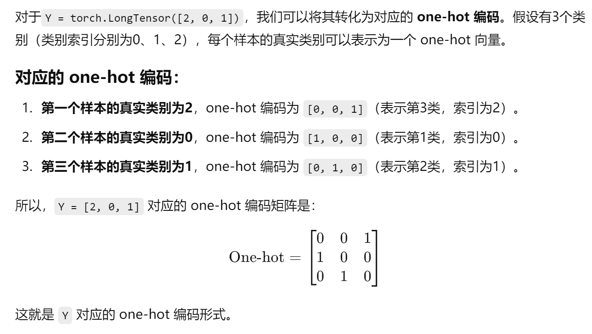

2. **`Y_pred1` 表示什么？**

`Y_pred1` 是一个 3x3 的二维张量，表示对3个样本的预测输出，每行表示模型对一个样本的三个类别的预测得分。具体来看：
```python
Y_pred1 = torch.Tensor([[0.1, 0.2, 0.9],  # 第一个样本
                        [1.1, 0.1, 0.2],  # 第二个样本
                        [0.2, 2.1, 0.1]]) # 第三个样本
```
这个张量表示模型对每个样本的三个类别的预测分数。

3. **`CrossEntropyLoss` 的计算过程**

`CrossEntropyLoss` 会将**预测分数**转换为**概率分布**，然后计算真实标签与预测概率之间的交叉熵损失。

**CrossEntropyLoss 的具体计算过程包括两个步骤**：

1. **Softmax**：先将预测得分通过 softmax 函数转换为概率分布。softmax 公式是：
   $$
   P(y_i) = \frac{e^{z_i}}{\sum_{j=1}^{C} e^{z_j}}
   其中 ( z_i ) 是模型在类别 ( i ) 上的得分，( C ) 是类别的总数。
   $$

2. **计算损失**：通过交叉熵公式，计算真实类别的负对数概率：
   $$
   \text{Loss} = - \log(\hat{P}(y_{\text{true}}))
   $$
   其中  $\hat{P}(y_{\text{true}}) $是模型对正确类别的预测概率。

**第一个样本（真实类别为2，对应第3类）的损失计算：**

对于 `Y_pred1[0] = [0.1, 0.2, 0.9]`，计算 softmax 得到预测概率：
$$
P(0) = \frac{e^{0.1}}{e^{0.1} + e^{0.2} + e^{0.9}} = \frac{1.105}{1.105 + 1.221 + 2.459} \approx 0.215 \\
$P(1) = \frac{e^{0.2}}{e^{0.1} + e^{0.2} + e^{0.9}} = \frac{1.221}{1.105 + 1.221 + 2.459} \approx 0.237 \\
$P(2) = \frac{e^{0.9}}{e^{0.1} + e^{0.2} + e^{0.9}} = \frac{2.459}{1.105 + 1.221 + 2.459} \approx 0.548 \\
因此，模型对类别2（正确类别）的预测概率P(2) \approx 0.548 ，交叉熵损失为：
\text{Loss}_1 = -\log(0.548) \approx 0.601
$$
**第二个样本（真实类别为0，对应第1类）的损失计算：**

对于 `Y_pred1[1] = [1.1, 0.1, 0.2]`，计算 softmax 得到预测概率：

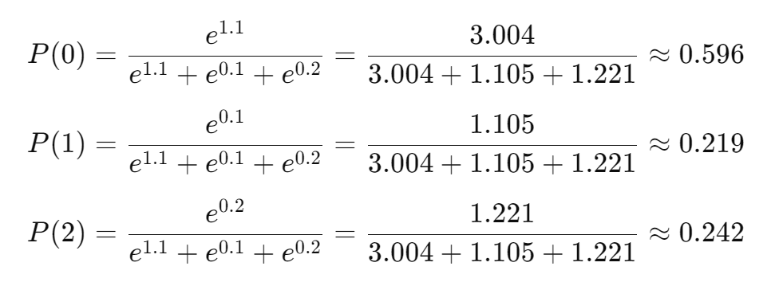

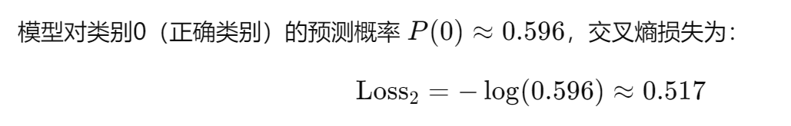

**第三个样本（真实类别为1，对应第2类）的损失计算：**

对于 `Y_pred1[2] = [0.2, 2.1, 0.1]`，计算 softmax 得到预测概率：

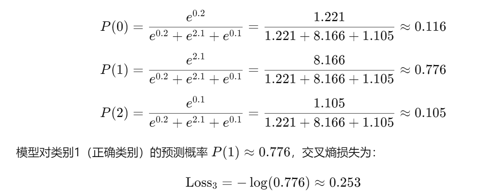

4. **总损失（`l1`）**

`CrossEntropyLoss` 会返回一个 batch 的平均损失，因此总损失 \( $l1$ \) 是3个样本的平均值：
$$
l1 = \frac{0.601 + 0.517 + 0.253}{3} \approx 0.457
$$

5. **`Y_pred2` 的计算过程**

与 `Y_pred1` 的计算过程类似，`Y_pred2` 会按相同的方式进行 softmax 转换并计算交叉熵损失。

**One-hot编码** 是一种用于表示分类标签的编码方式，特别适用于机器学习中的分类任务。

## CrossEntropyLoss vs NLLLoss 二者的区别是什么？

在深度学习中，**CrossEntropyLoss** 和 **NLLLoss** 是用于分类任务的损失函数，二者常用于不同类型的网络输出层。让我们分别解释这两个损失函数以及它们之间的区别。

### 1. CrossEntropyLoss
**CrossEntropyLoss**（交叉熵损失）是一个常用于多分类任务的损失函数，它结合了**softmax**函数和**负对数似然损失**（Negative Log Likelihood, NLL）两个步骤。

- **Softmax**：首先，将网络的原始输出（logits）通过 softmax 转换为概率分布。
  $P(y_i) = \frac{e^{z_i}}{\sum_{j=1}^{C} e^{z_j}}$
  其中，\( $z_i $\) 是网络在类别 \( i \) 上的输出（logit），\( C \) 是类别数。
  
- **交叉熵损失**：计算实际标签的交叉熵损失。
  $\text{CrossEntropyLoss} = -\log(P(y_{\text{true}}))$
  其中，\( $P(y_{\text{true}})$ \) 是模型对正确类别的预测概率。

因此，**CrossEntropyLoss** 直接接受未经过 softmax 的 logits，内部会自动先进行 softmax，然后计算损失。

### 2. NLLLoss
**NLLLoss**（负对数似然损失）直接作用于经过 softmax 或 log-softmax 的概率分布。它只计算损失，不包括 softmax 的步骤。因此，**NLLLoss** 需要网络的输出已经是 log-softmax 格式。

公式如下：
$$
\text{NLLLoss} = -\log(P(y_{\text{true}}))
$$

其中，\( $P(y_{\text{true}})$ \) 是模型对正确类别的预测概率。不过这里的 \( P \) 是已经通过 log-softmax 的对数概率。

### 3. 两者的区别

- **输入格式**：
  - **CrossEntropyLoss**：输入是原始的 logits，不需要手动对 logits 进行 softmax 处理。它会内部先应用 softmax，再计算损失。
  - **NLLLoss**：输入需要是经过 log-softmax 处理后的概率分布。网络的输出必须是对数概率。

- **适用场景**：
  - **CrossEntropyLoss**：常用于输出层为原始 logits 的网络。例如，神经网络最后一层是线性层时，通常使用 CrossEntropyLoss，因为它自动处理 softmax 和损失计算。
  - **NLLLoss**：通常在网络的最后一层已经应用了 log-softmax 时使用。你需要确保网络输出的是 log-softmax 结果。

- **方便性**：
  - **CrossEntropyLoss** 更方便，因为它同时处理 softmax 和损失计算。对于多数场景，你只需提供 logits 而无需额外处理。
  - **NLLLoss** 则适用于更加自定义的情况，允许你对 softmax 处理进行更多的控制。

### 4. 例子

- **CrossEntropyLoss**：
  ```python
  import torch
  import torch.nn as nn
  
  # 假设有3个类别，batch_size=1
  logits = torch.tensor([[2.0, 1.0, 0.1]])  # 未经过softmax的logits
  labels = torch.tensor([0])  # 正确类别是类别0
  
  loss_fn = nn.CrossEntropyLoss()
  loss = loss_fn(logits, labels)
  print(loss)  # 自动计算softmax并计算损失
  ```

- **NLLLoss**：
  ```python
  import torch
  import torch.nn as nn
  
  # 需要先手动应用log-softmax
  log_probs = torch.log_softmax(torch.tensor([[2.0, 1.0, 0.1]]), dim=1)
  labels = torch.tensor([0])  # 正确类别是类别0
  
  loss_fn = nn.NLLLoss()
  loss = loss_fn(log_probs, labels)
  print(loss)  # 输入必须是log-softmax
  ```

### 总结
- **CrossEntropyLoss** 是更常用的损失函数，因为它同时处理了 softmax 和损失计算，适合大多数分类任务。
- **NLLLoss** 则适用于你已经手动处理了 log-softmax 的情况，因此提供了更多的灵活性。

## MNIST分类实现

### 准备数据集

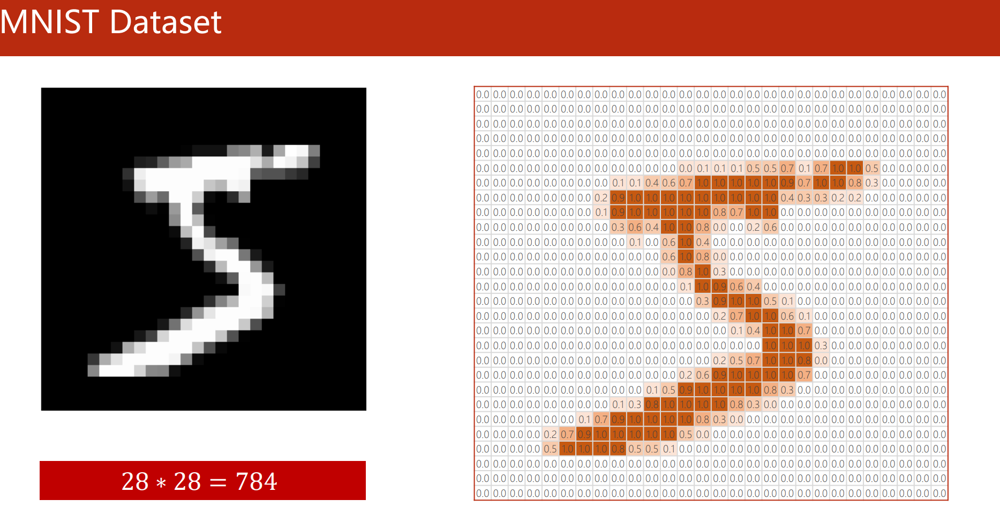

是一个28×28像素的单通道图像。

在Pytorch中读取图像使用到的是PIL或者pillow库，但是对于Pytorch而言，它希望处理的数据是很小的，并且介于0到+1之间的数据，使用PIL读取到的图像的数据是W×H×C的数据格式，而在Pytorch中，需要将其转化成C×W×H的数据格式。并且将像素值映射进[0, 1]之间。


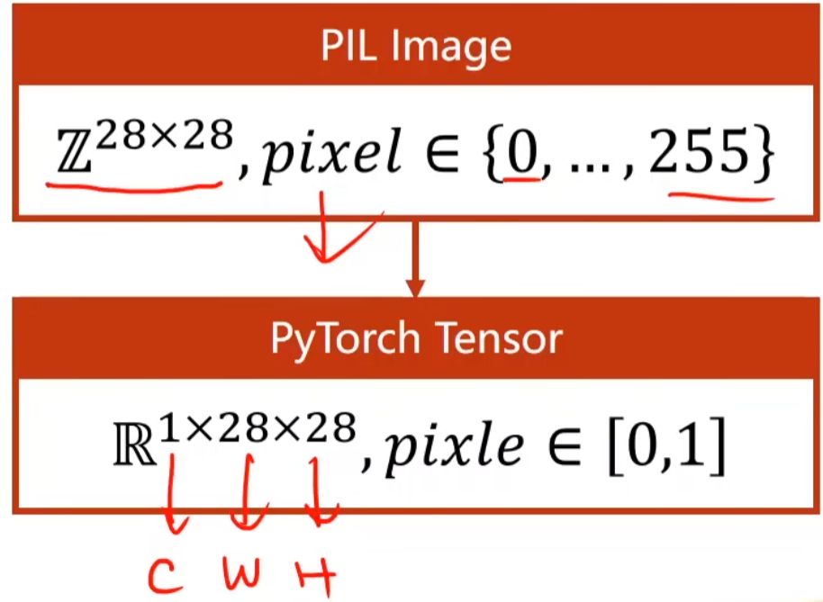

而这些步骤都可以在`transform.Totensor()`实现。

数据的归一化：


### 设计模型

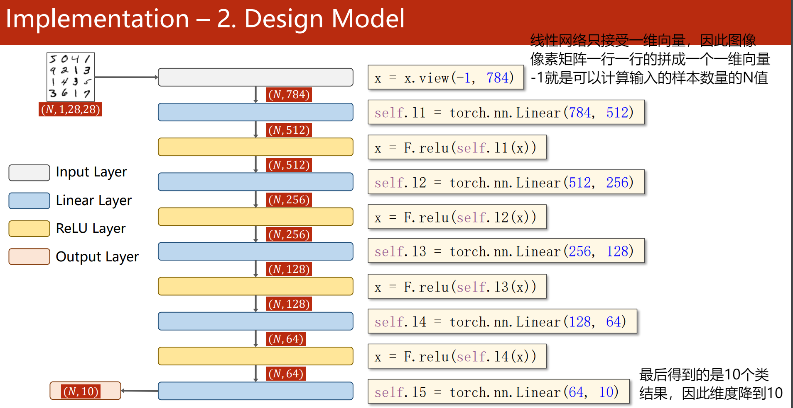

### 设计损失函数和优化器

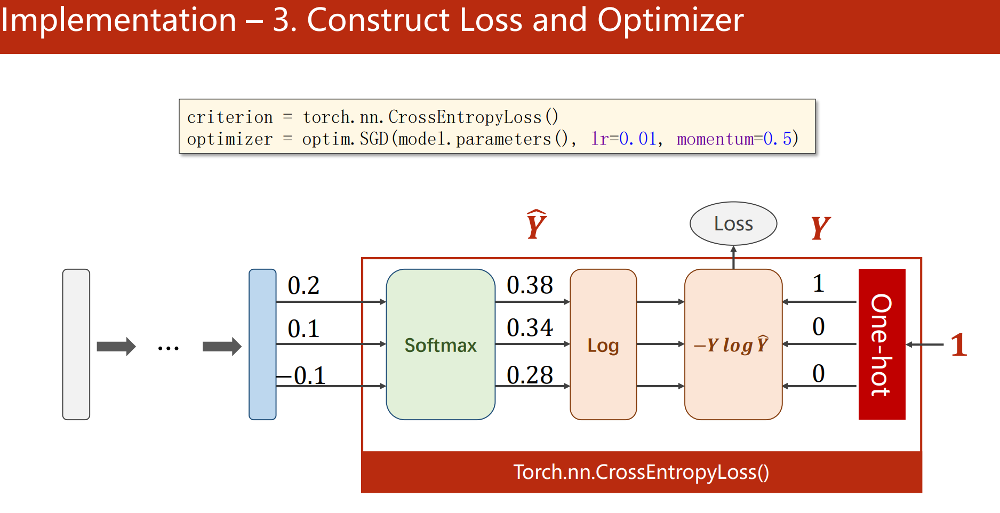

### 训练与测试

代码：

```python
#!/usr/bin/env python
# -*- coding: UTF-8 -*-
'''
@File      ：MNIST_Classifier.py
@IDE       ：PyCharm 
@Author    ：lml
@Date      ：2024/10/12 22:05 
@Descriable：MNIST数据集进行分类
'''
import torch
from torchvision import transforms # 对图像进行原始处理的工具
from torchvision import datasets
from torch.utils.data import DataLoader
import torch.nn.functional as F
import torch.optim as optim

batch_size = 64
transform = transforms.Compose([
    transforms.ToTensor(), # 对于输入的图像，先转换成Pytorch中的张量，然后像素的取值变成0-1
    transforms.Normalize((0.1307, ), (0.3081, )) # 0.1307就是MNIST数据集的均值，0.3081是数据集的标准差，这个是计算的整个数据集
])
train_dataset = datasets.MNIST(root='./dataset/mnist/',
                           train=True,
                           download=True,
                           transform=transform # 数据集中的样本都会做上面定义的transform的一系列操作
                           )
train_loader = DataLoader(train_dataset,
                          shuffle=True,
                          batch_size=batch_size
                          )
test_dataset = datasets.MNIST(root='./dataset/mnist/',
                              train=False,
                              download=True,
                              transform=transform
                              )
test_loader = DataLoader(test_dataset,
                         shuffle=False, # 在测试集里我们就不需要随机打乱顺序，只需要按照数据集顺序测试即可
                         batch_size=batch_size
                         )

class Net(torch.nn.Module):
    def __init__(self):
        super(Net,self).__init__()
        self.l1 = torch.nn.Linear(784, 512)
        self.l2 = torch.nn.Linear(512, 256)
        self.l3 = torch.nn.Linear(256, 128)
        self.l4 = torch.nn.Linear(128, 64)
        self.l5 = torch.nn.Linear(64, 10)

    def forward(self, x):
        x = x.view(-1, 784)
        x = F.relu(self.l1(x))
        x = F.relu(self.l2(x))
        x = F.relu(self.l3(x))
        x = F.relu(self.l4(x))
        x = self.l5(x) # 最后一层不做激活，因为是为了后面直接接入Softmax层中
        return x

model = Net()

criterion = torch.nn.CrossEntropyLoss()
optimizer = optim.SGD(model.parameters(), lr=0.01, momentum=0.5)

def train(epoch): # 将一轮训练封装成一个函数
    running_loss = 0.0
    for batch_idx, data in enumerate(train_loader, 0):
        inputs, target = data
        optimizer.zero_grad() # 优化器优化之前先进行清零

        # forward+bachward+update一起
        outputs = model(inputs)
        loss = criterion(outputs, target)
        loss.backward()
        optimizer.step()

        running_loss += loss.item() # 计算累计的loss值

        if batch_idx % 300 == 299: # 设置每300轮打印一下损失
            print('[%d, %5d] loss: %.3f' % (epoch + 1, batch_idx + 1, running_loss / 300))
            running_loss = 0.0

def test():
    correct = 0
    total = 0
    with torch.no_grad(): # test部分只需要计算前向传播，不需要计算反向传播，使用这一句就说明这一段代码里不计算梯度，不生成计算图
        for data in test_loader:
            images, labels = data
            outputs = model(images)
            #  测试得到的输出是一个二维矩阵，每一行为一个样本的输出，我们需要得到这一行中哪个最大才能确定这个样本是哪一类，
            #  因此这一步的操作就是读取结果中每一行的最大值，返回的第一个值是这一行的最大值，第二个值是最大值对应的下表也就是这里
            #  的predicted，在二维矩阵中，行是第0维，列是第1维，dim = 1的意思就是沿着第一维也就是列的方向找最大值
            _, predicted = torch.max(outputs.data, dim = 1)
            total += labels.size(0) # 最后得到的标签分类是一个N×1的向量，size()得到的是一个元组(N, 1),size(0)就是N，而这个N就是每个batch_size
            correct += (predicted==labels).sum().item() # 拿预测的分类与标签分类相对比，真就是1，假就是0，取预测成功的数量
        print('Accuracy on test set: %d %%' %(100 * correct / total)) # 待所有的测试样本测试接受之后，就计算最后的正确率

if __name__ == '__main__':
    for epoch in range(10):
        train(epoch)
        test()
```

运行结果：

```python
[1,   300] loss: 2.228
[1,   600] loss: 0.974
[1,   900] loss: 0.445
Accuracy on test set: 90 %
[2,   300] loss: 0.323
[2,   600] loss: 0.282
[2,   900] loss: 0.241
Accuracy on test set: 93 %
[3,   300] loss: 0.195
[3,   600] loss: 0.176
[3,   900] loss: 0.165
Accuracy on test set: 95 %
[4,   300] loss: 0.135
[4,   600] loss: 0.128
[4,   900] loss: 0.118
Accuracy on test set: 96 %
[5,   300] loss: 0.102
[5,   600] loss: 0.102
[5,   900] loss: 0.092
Accuracy on test set: 96 %
[6,   300] loss: 0.077
[6,   600] loss: 0.079
[6,   900] loss: 0.079
Accuracy on test set: 97 %
[7,   300] loss: 0.062
[7,   600] loss: 0.065
[7,   900] loss: 0.064
Accuracy on test set: 97 %
[8,   300] loss: 0.050
[8,   600] loss: 0.051
[8,   900] loss: 0.052
Accuracy on test set: 97 %
[9,   300] loss: 0.038
[9,   600] loss: 0.041
[9,   900] loss: 0.045
Accuracy on test set: 97 %
[10,   300] loss: 0.031
[10,   600] loss: 0.036
[10,   900] loss: 0.037
Accuracy on test set: 97 %
```

我们发现最后的准确率卡在了97%就上不去了，对图像的处理，使用全连接神经网络对局部的特征做的不是很好，使用全连接意味着图像中任意一个像素都和其他像素产生联系，因此使用全连接网络处理图像问题就有以下的问题：

* 权重不够多
* 对于图像的处理，我们更多的是关注高抽象的特征，而不是像素这种原始的特征

因此，如果我们先对图像做特征提取，然后再做处理，效果可能更好一点。

对于图像，我们倾向于做自动的特征提取，一般来说有以下的方法：

* 对于整张图像的特征提取：FFT（傅里叶变换）
* 小波变换
* 在深度学习里面，我们使用**CNN**！！！（The King!）

# 卷积神经网络

这是我们全连接处理图像的方式：

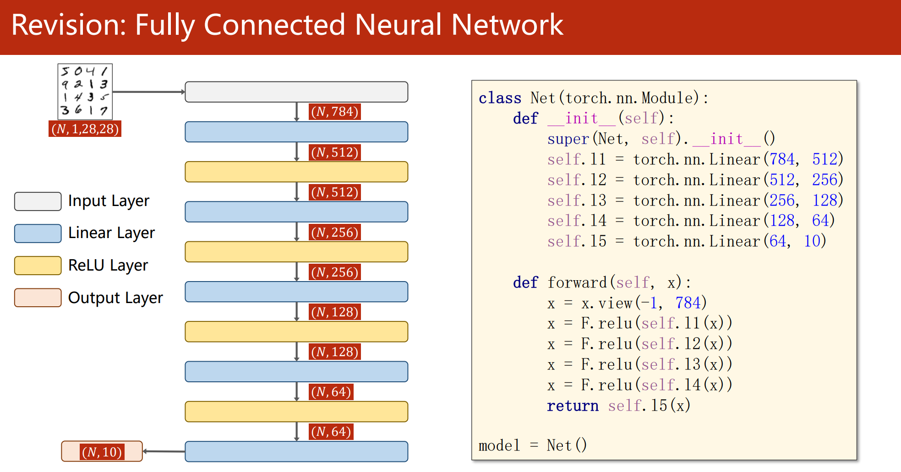

全连接处理图像的方式是对于一个通道的图像一行一行取下来拼成一个一维向量，在图像中上下相邻的两个像素通过这种拼接的方式可能会边远，这样就忽略了上下像素之间的空间关系。

卷积神经网络：特征提取器+分类器

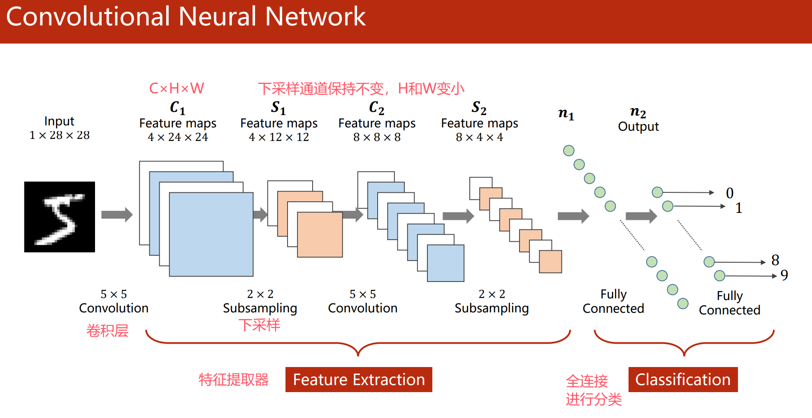


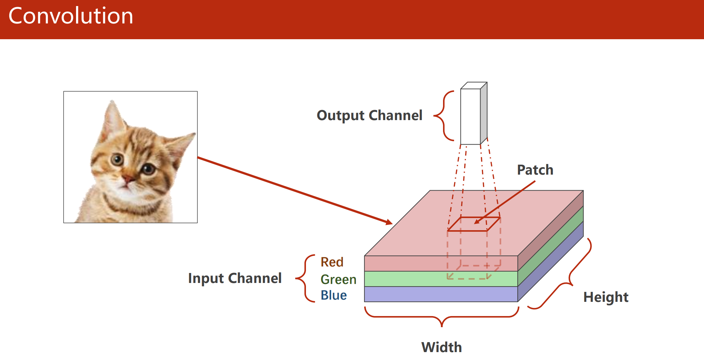

利用一个卷积核处理输入的图像，对应元素相乘，并将最后的结果相加：
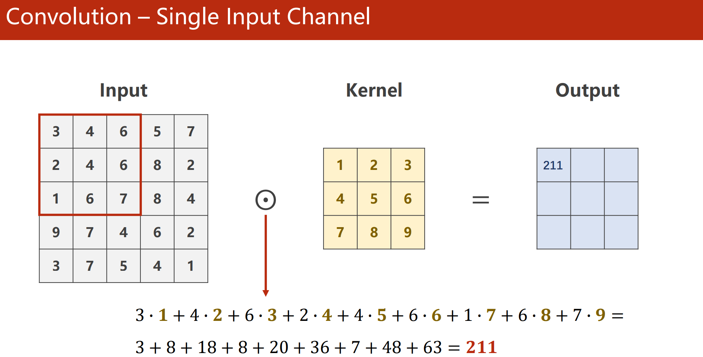

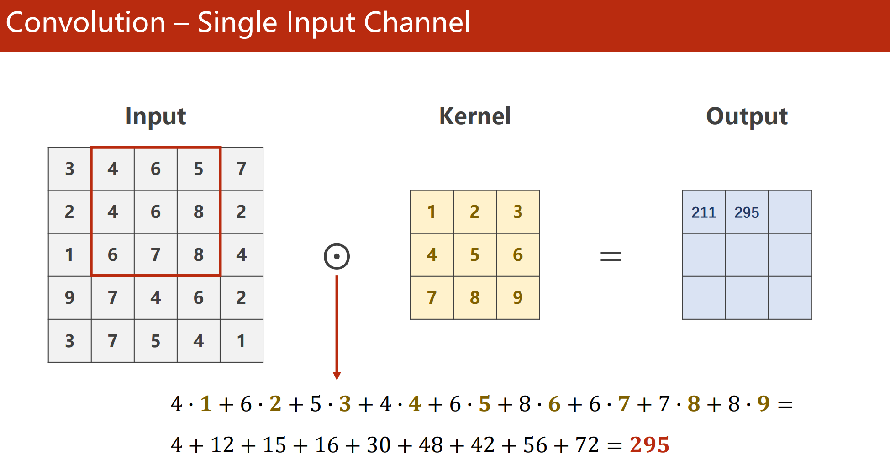

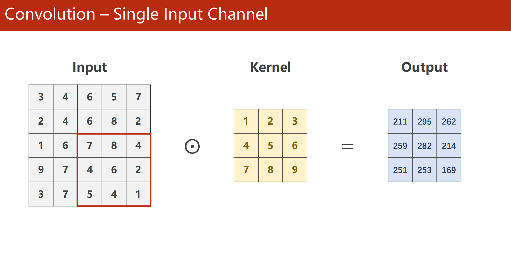

直到卷积核全部过一遍输入的图像。

输入的三通道图像，需要有三个卷积核进行处理：

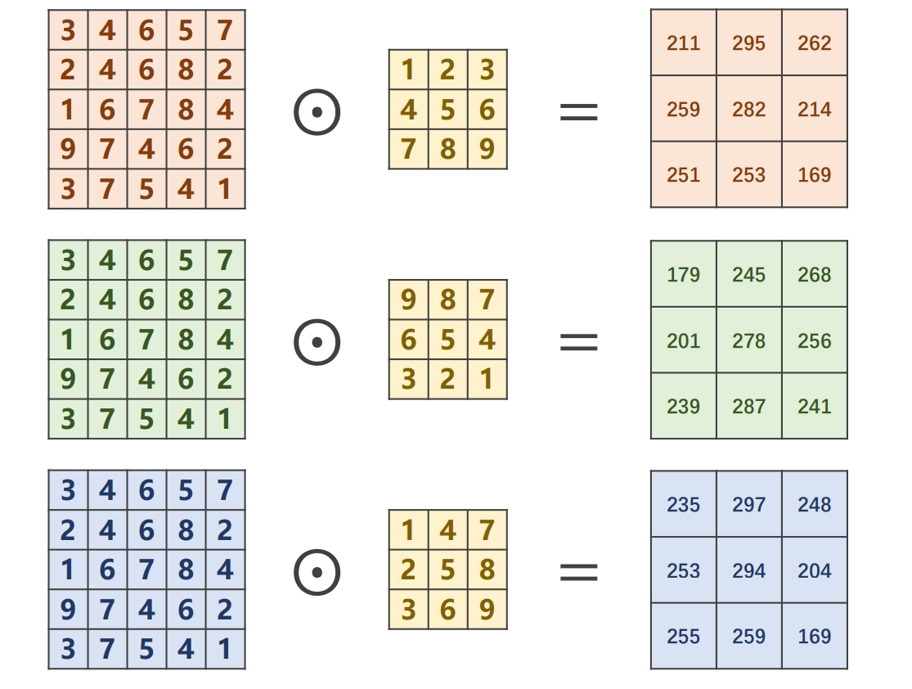

**输入的图像是几通道的，就需要几个卷积核进行处理。**在刚开始输入的图像是3通道的，但是在卷积过程当中，图像的通道数会增加，4个、5个甚至更多。

最后将卷积计算得到的矩阵对应元素相加得到这个：

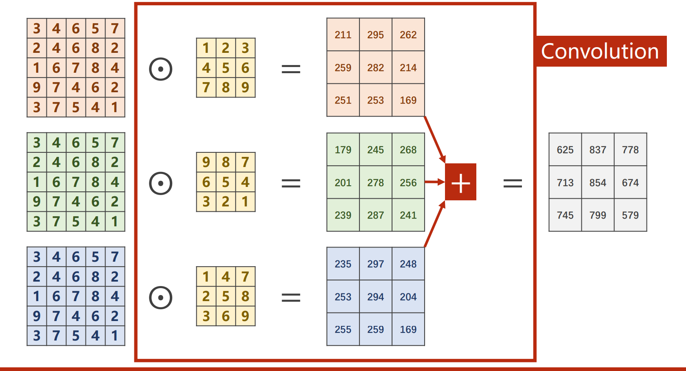

这一步就可以具体展示成这样：

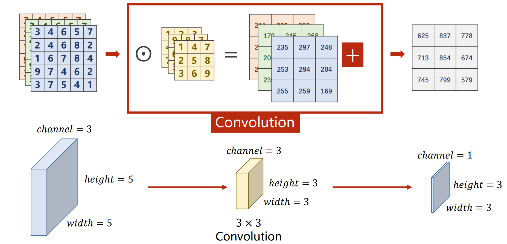

那假如输入的通道数量有n个，那么我们就必须要有n个卷积核与之进行处理，之后我们就会又得到新的通道：

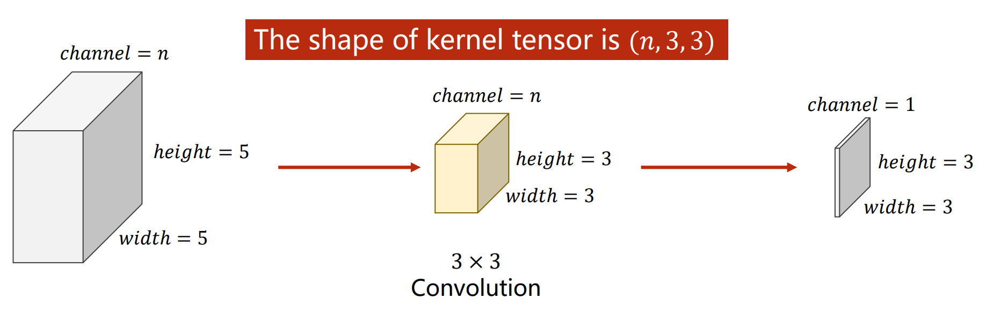

那有n个通道的图像，经过卷积之后需要生成m个通道呢？

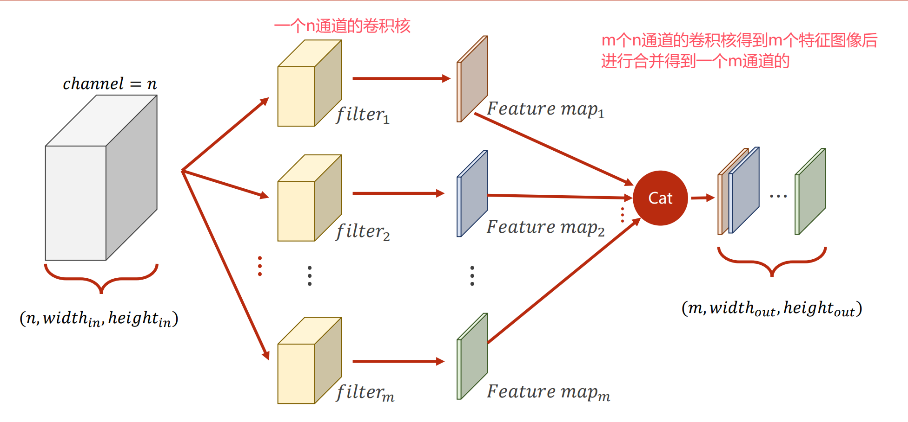

**卷积核的通道数与输入图像的通道数是一致的。**

最后将这一过程抽象成这样：

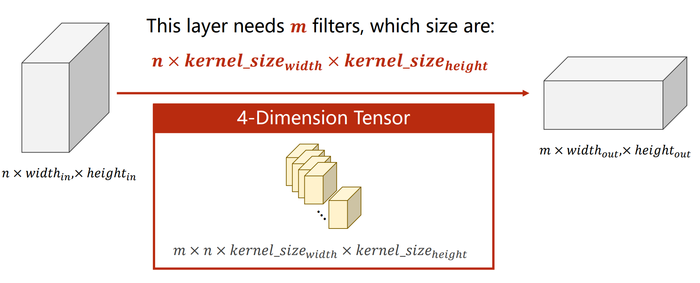

```python
import torch
in_channels, out_channels = 5, 10 # 输入通道是5，输出通道是10
width, height = 100, 100
kernel_size = 3
batch_size = 1

input = torch.randn(batch_size, # Pytorch中输入都必须是小批量的数据，这里面要加入批次
                    in_channels,
                    width,
                    height)

conv_layer = torch.nn.Conv2d(in_channels,
                             out_channels,
                             kernel_size=kernel_size) # 卷积核尺寸也可以用(5,3)长方形尺寸

output = conv_layer(input)

print(input.shape)
print(output.shape)
print(conv_layer.weight.shape) # 卷积层的size就是m×n×width×height
```

```python
torch.Size([1, 5, 100, 100])
torch.Size([1, 10, 98, 98])
torch.Size([10, 5, 3, 3])
```

```python
input = torch.randn(batch_size, # Pytorch中输入都必须是小批量的数据，这里面要加入批次
                    in_channels,
                    width,
                    height)
```

这段代码是用来在 PyTorch 中创建一个随机初始化的张量（tensor），通常用作神经网络模型的输入数据。让我们来分解一下这段代码：

- `torch.randn(...)` 是 PyTorch 的一个函数，用来生成一个具有标准正态分布（均值为0，方差为1）的随机数张量。
- `batch_size` 是你想要创建的小批量中样本的数量。在机器学习中，我们通常不会一次只处理一个样本，而是处理一个小批量的样本，这样做可以提高计算效率，并有助于梯度下降算法更稳定地收敛。
- `in_channels` 指的是每个样本的通道数量。例如，在图像处理中，对于RGB图片来说，这个值通常是3（红、绿、蓝三个颜色通道）。对于灰度图片，则是1。
- `width` 和 `height` 分别指的是每个样本的空间维度宽度和高度。

## Padding

padding主要作用是为了不弱化边缘特征.

咱们上面发现卷积核为3×3的会讲原图像缩小上下左右各一行一列，5×5的缩成3×3的，如果卷积核成为5×5的，原来的5×5的图像就缩成1×1的。即上下左右各两行两列。

对于3×3的卷积核，为了不弱化边缘特征，在原来的输入上下左右各加入一行一列：

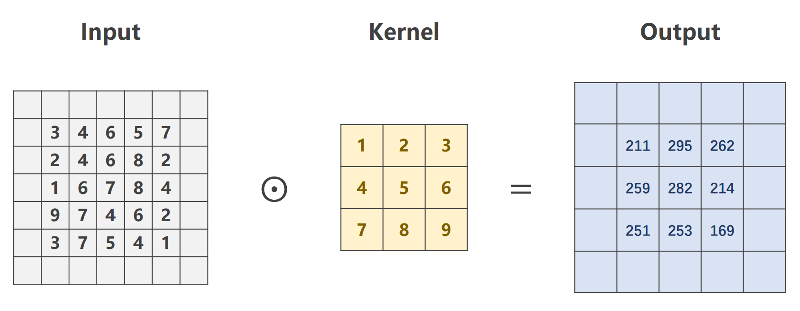

一般来说对于添加的行列，会填充0：

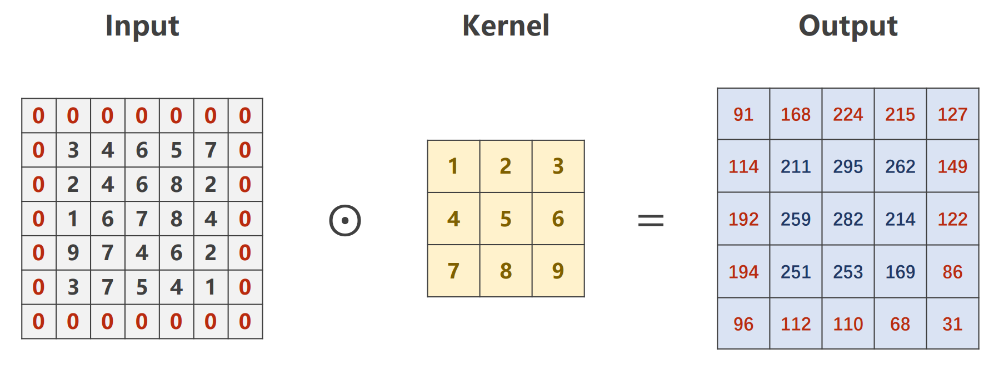

```python
import torch
input = [3,4,6,5,7,
        2,4,6,8,2,
        1,6,7,8,4,
        9,7,4,6,2,
        3,7,5,4,1]
input = torch.Tensor(input).view(1, 1, 5, 5) # 将输入做成批量 × 通道 × width × height的格式
conv_layer = torch.nn.Conv2d(1, 1, kernel_size=3, padding=1, bias=False) # 这里我们使用padding = 1
kernel = torch.Tensor([1,2,3,4,5,6,7,8,9]).view(1, 1, 3, 3) # 卷积核如上图所示，这里view之后变为输出通道 × 输入通道 × width × height
# print(kernel.data)
conv_layer.weight.data = kernel.data # 卷积层权重做了一个初始化
output = conv_layer(input)
print(output)
```

```python
tensor([[[[ 91., 168., 224., 215., 127.],
          [114., 211., 295., 262., 149.],
          [192., 259., 282., 214., 122.],
          [194., 251., 253., 169.,  86.],
          [ 96., 112., 110.,  68.,  31.]]]], grad_fn=<ConvolutionBackward0>)
```

## stride(步长)

步长相当于是卷积核在图像上中心的移动，

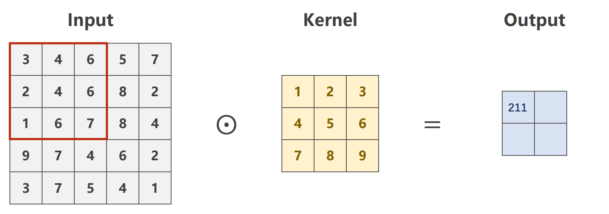

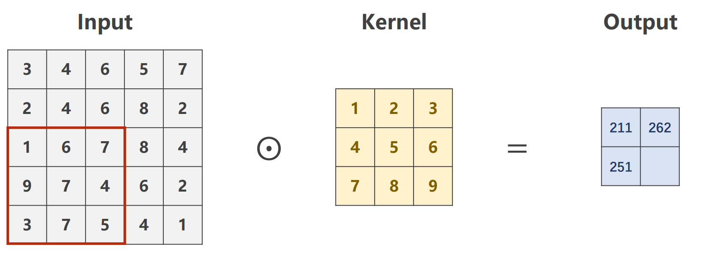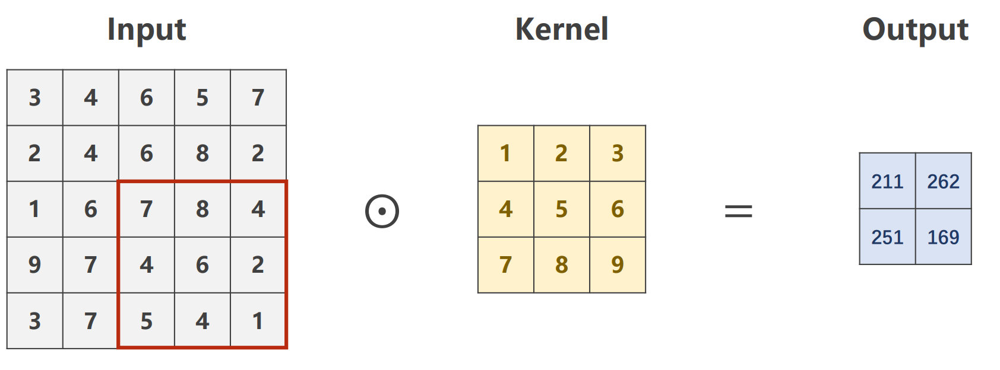

```python
import torch
input = [3,4,6,5,7,
2,4,6,8,2,
1,6,7,8,4,
9,7,4,6,2,
3,7,5,4,1]
input = torch.Tensor(input).view(1, 1, 5, 5)
conv_layer = torch.nn.Conv2d(1, 1, kernel_size=3, stride=2, bias=False) # 这里我们指定步长为2
kernel = torch.Tensor([1,2,3,4,5,6,7,8,9]).view(1, 1, 3, 3)
conv_layer.weight.data = kernel.data
output = conv_layer(input)
print(output)
```

```python
tensor([[[[211., 262.],
          [251., 169.]]]], grad_fn=<ConvolutionBackward0>)
```

## 下采样

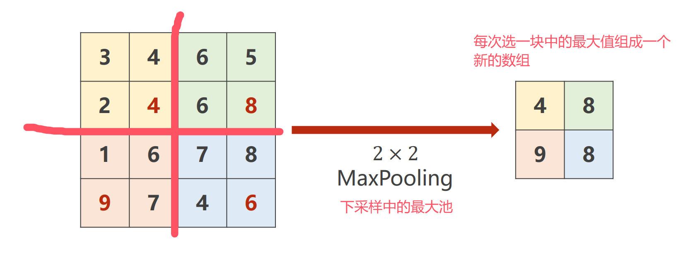

在上图中下采样最大池里采用2×2的话，stride默认为2。

**通道的数量是不变的**

如果用2×2的，图像的大小会缩成原来的一半。

```python
import torch
input = [3,4,6,5,
        2,4,6,8,
        1,6,7,8,
        9,7,4,6,
        ]
input = torch.Tensor(input).view(1, 1, 4, 4)
maxpooling_layer = torch.nn.MaxPool2d(kernel_size=2)
output = maxpooling_layer(input)
print(output)
```

```python
tensor([[[[4., 8.],
          [9., 8.]]]])
```

## 使用MNIST数据集进行网络模型的设计

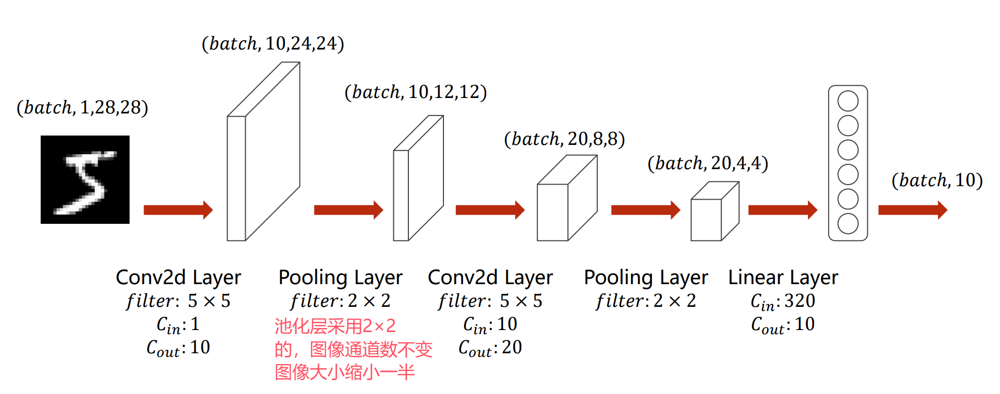

**注意：我们需要计算每一次卷积后的图像的尺寸大小，比如这里，没有做padding和stride，kernal的大小为5，意味着小两圈，即变长减4。所以第一个我们看到就是从28到24的变化**

对于之前做的MNIST数据集，我们设计卷积神经网络就是这样的步骤：

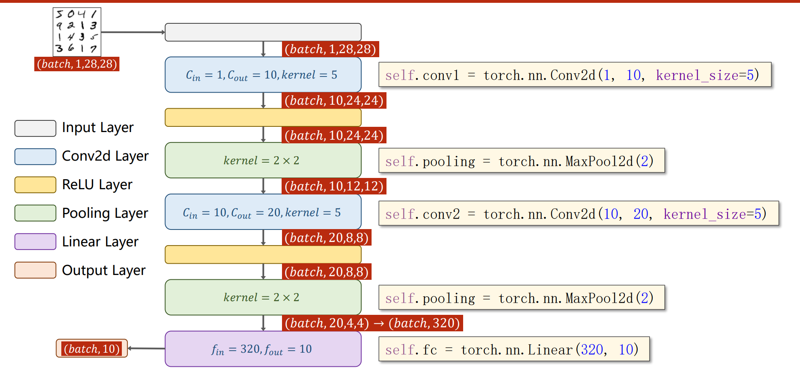

一下是我们使用卷积网络得到的代码：

```python
#!/usr/bin/env python
# -*- coding: UTF-8 -*-
'''
@File      ：MNIST_Classifier_CNN.py
@IDE       ：PyCharm 
@Author    ：lml
@Date      ：2024/10/16 12:42 
@Descriable：
'''
import torch
from torchvision import transforms # 对图像进行原始处理的工具
from torchvision import datasets
from torch.utils.data import DataLoader
import torch.nn.functional as F
import torch.optim as optim

batch_size = 64
transform = transforms.Compose([
    transforms.ToTensor(), # 对于输入的图像，先转换成Pytorch中的张量，然后像素的取值变成0-1
    transforms.Normalize((0.1307, ), (0.3081, )) # 0.1307就是MNIST数据集的均值，0.3081是数据集的标准差，这个是计算的整个数据集
])
train_dataset = datasets.MNIST(root='./dataset/mnist/',
                           train=True,
                           download=True,
                           transform=transform # 数据集中的样本都会做上面定义的transform的一系列操作
                           )
train_loader = DataLoader(train_dataset,
                          shuffle=True,
                          batch_size=batch_size
                          )
test_dataset = datasets.MNIST(root='./dataset/mnist/',
                              train=False,
                              download=True,
                              transform=transform
                              )
test_loader = DataLoader(test_dataset,
                         shuffle=False, # 在测试集里我们就不需要随机打乱顺序，只需要按照数据集顺序测试即可
                         batch_size=batch_size
                         )


class Net(torch.nn.Module):
    def __init__(self):
        super(Net, self).__init__()
        self.conv1 = torch.nn.Conv2d(1, 10, kernel_size=5)
        self.conv2 = torch.nn.Conv2d(10, 20, kernel_size=5)
        self.pooling = torch.nn.MaxPool2d(2)
        self.fc = torch.nn.Linear(320, 10)
    def forward(self, x):
        # Flatten data from (n, 1, 28, 28) to (n, 784)
        batch_size = x.size(0)
        x = F.relu(self.pooling(self.conv1(x)))
        x = F.relu(self.pooling(self.conv2(x)))
        x = x.view(batch_size, -1) # flatten
        x = self.fc(x)
        return x

model = Net()

criterion = torch.nn.CrossEntropyLoss()
optimizer = optim.SGD(model.parameters(), lr=0.01, momentum=0.5)

def train(epoch): # 将一轮训练封装成一个函数
    running_loss = 0.0
    for batch_idx, data in enumerate(train_loader, 0):
        inputs, target = data
        optimizer.zero_grad() # 优化器优化之前先进行清零

        # forward+bachward+update一起
        outputs = model(inputs)
        loss = criterion(outputs, target)
        loss.backward()
        optimizer.step()

        running_loss += loss.item() # 计算累计的loss值

        if batch_idx % 300 == 299: # 设置每300轮打印一下损失
            print('[%d, %5d] loss: %.3f' % (epoch + 1, batch_idx + 1, running_loss / 300))
            running_loss = 0.0

def test():
    correct = 0
    total = 0
    with torch.no_grad(): # test部分只需要计算前向传播，不需要计算反向传播，使用这一句就说明这一段代码里不计算梯度，不生成计算图
        for data in test_loader:
            images, labels = data
            outputs = model(images)
            #  测试得到的输出是一个二维矩阵，每一行为一个样本的输出，我们需要得到这一行中哪个最大才能确定这个样本是哪一类，
            #  因此这一步的操作就是读取结果中每一行的最大值，返回的第一个值是这一行的最大值，第二个值是最大值对应的下表也就是这里
            #  的predicted，在二维矩阵中，行是第0维，列是第1维，dim = 1的意思就是沿着第一维也就是列的方向找最大值
            _, predicted = torch.max(outputs.data, dim = 1)
            total += labels.size(0) # 最后得到的标签分类是一个N×1的向量，size()得到的是一个元组(N, 1),size(0)就是N，而这个N就是每个batch_size
            correct += (predicted==labels).sum().item() # 拿预测的分类与标签分类相对比，真就是1，假就是0，取预测成功的数量
        print('Accuracy on test set: %d %%' %(100 * correct / total)) # 待所有的测试样本测试接受之后，就计算最后的正确率

if __name__ == '__main__':
    for epoch in range(10):
        train(epoch)
        test()
```

```python
[1,   300] loss: 0.580
[1,   600] loss: 0.176
[1,   900] loss: 0.127
Accuracy on test set: 96 %
[2,   300] loss: 0.102
[2,   600] loss: 0.093
[2,   900] loss: 0.089
Accuracy on test set: 98 %
[3,   300] loss: 0.074
[3,   600] loss: 0.075
[3,   900] loss: 0.066
Accuracy on test set: 98 %
[4,   300] loss: 0.061
[4,   600] loss: 0.060
[4,   900] loss: 0.060
Accuracy on test set: 98 %
[5,   300] loss: 0.051
[5,   600] loss: 0.053
[5,   900] loss: 0.053
Accuracy on test set: 98 %
[6,   300] loss: 0.048
[6,   600] loss: 0.048
[6,   900] loss: 0.048
Accuracy on test set: 98 %
[7,   300] loss: 0.045
[7,   600] loss: 0.042
[7,   900] loss: 0.043
Accuracy on test set: 98 %
[8,   300] loss: 0.041
[8,   600] loss: 0.038
[8,   900] loss: 0.039
Accuracy on test set: 98 %
[9,   300] loss: 0.036
[9,   600] loss: 0.037
[9,   900] loss: 0.039
Accuracy on test set: 98 %
[10,   300] loss: 0.039
[10,   600] loss: 0.033
[10,   900] loss: 0.034
Accuracy on test set: 98 %
```

我们看到相对于上一次只使用全连接网络的准确率上升了一个百分点！！！

### 代码解释

#### x.size()

```python
def forward(self, x):
    # Flatten data from (n, 1, 28, 28) to (n, 784)
    batch_size = x.size(0)
    x = F.relu(self.pooling(self.conv1(x)))
    x = F.relu(self.pooling(self.conv2(x)))
    x = x.view(batch_size, -1) # flatten
    x = self.fc(x)
    return x
```

在 PyTorch 中，`x.size()` 返回的是一个 `torch.Size` 对象，它类似于 Python 的元组（tuple），包含了张量 `x` 在每个维度上的大小。`torch.Size` 对象是不可变的，并且可以像元组一样被索引和迭代。

例如，如果你有一个形状为 `(batch_size, channels, height, width)` 的 4D 张量 `x`，那么 `x.size()` 将返回一个 `torch.Size` 对象，表示这个张量在每个维度上的大小。

**示例**

假设你有一个形状为 `(32, 1, 28, 28)` 的张量 `x`，其中：

- 第一维 `32` 是批处理大小（batch size）。
- 第二维 `1` 是通道数（对于灰度图像，通常为 1；对于彩色图像，通常是 3）。
- 第三维 `28` 和第四维 `28` 分别是图像的高度和宽度。

```python
import torch

# 创建一个形状为 (32, 1, 28, 28) 的张量
x = torch.randn(32, 1, 28, 28)

# 获取张量的大小
size = x.size()

print(size)  # 输出: torch.Size([32, 1, 28, 28])
print(type(size))  # 输出: <class 'torch.Size'>
```

**访问特定维度的大小**

你可以通过索引来访问 `torch.Size` 对象中的特定维度的大小。例如：

```python
batch_size = x.size(0)  # 获取第一维的大小，即 batch size
channels = x.size(1)    # 获取第二维的大小，即通道数
height = x.size(2)      # 获取第三维的大小，即高度
width = x.size(3)       # 获取第四维的大小，即宽度

print(batch_size)  # 输出: 32
print(channels)    # 输出: 1
print(height)      # 输出: 28
print(width)       # 输出: 28
```

**总结**

- `x.size()` 返回一个 `torch.Size` 对象，它包含了张量 `x` 在每个维度上的大小。
- `torch.Size` 对象是不可变的，类似于元组。
- 你可以通过索引来访问 `torch.Size` 对象中的特定维度的大小，例如 `x.size(0)` 返回第一维的大小。

#### x.view()

```python
x = x.view(batch_size, -1) # flatten
```

当然，我可以更详细地解释 `view` 是如何处理张量形状的。让我们以你提供的网络中的这一行为例：

```python
x = x.view(batch_size, -1)
```

**例子背景**

假设在前向传播过程中，经过卷积和池化层之后，`x` 的形状是 `(batch_size, channels, height, width)`。例如，如果我们有一个批处理大小为 32 的输入，并且经过两层卷积和池化之后，`x` 的形状变成了 `(32, 20, 4, 4)`。

- `batch_size`：32
- `channels`：20
- `height`：4
- `width`：4

**使用 `view` 展平张量**

`view` 方法用于改变张量的形状。在这个例子中，我们想要将多维张量展平成二维张量，以便将其传递给全连接层（线性层）。具体来说，我们需要将 `(batch_size, channels, height, width)` 形状转换为 `(batch_size, features)` 形状，其中 `features` 是所有通道、高度和宽度的乘积。

**计算特征数**

首先，计算出总的特征数：
- 总的特征数 = `channels * height * width`
- 在这个例子中，`features` = `20 * 4 * 4` = `320`

因此，我们希望将 `(32, 20, 4, 4)` 形状的张量展平为 `(32, 320)` 形状的张量。

**使用 `view` 和 `-1`**

```python
x = x.view(batch_size, -1)
```

这里：

- `batch_size` 是第一个维度，即样本数量。
- `-1` 表示自动推断第二个维度的大小。PyTorch 会根据总元素数量来计算 `-1` 应该代表的值，使得展平后的张量总元素数量与原张量相同。

具体步骤如下：

1. **获取当前张量的形状**：
   ```python
   current_shape = x.size()
   # 假设 current_shape 为 (32, 20, 4, 4)
   ```

2. **计算总的特征数**：
   ```python
   total_features = current_shape[1] * current_shape[2] * current_shape[3]
   # total_features = 20 * 4 * 4 = 320
   ```

3. **使用 `view` 改变形状**：
   ```python
   x = x.view(32, 320)
   # 或者使用 -1 来自动推断第二个维度
   x = x.view(32, -1)
   ```

通过这种方式，`x` 从原来的 `(32, 20, 4, 4)` 形状被展平为 `(32, 320)` 形状，这样就可以作为全连接层的输入了。

**为什么使用 `-1`？**

使用 `-1` 的好处在于，你不需要手动计算第二维度的大小。无论原始张量的 `channels`、`height` 和 `width` 如何变化，只要总元素数量保持不变，`-1` 都能正确地推断出新的维度大小。这使得代码更加简洁和灵活，特别是在处理不同大小的输入时。

#### `self.pooling = torch.nn.MaxPool2d(2)`

在 PyTorch 中使用 `torch.nn.MaxPool2d(2)` 时，如果没有特别指定 `stride` 和 `padding`，它们会使用默认值：

- **kernel_size=2**：池化窗口的大小为 \(2 \times 2\)。
- **stride=None**：默认情况下，`stride` 会等于 `kernel_size`，即步幅为 2。这意味着窗口每次移动 2 个像素。
- **padding=0**：默认情况下，`padding` 为 0，即没有对输入特征图进行填充。

所以，代码 `self.pooling = torch.nn.MaxPool2d(2)` 等效于：
```python
self.pooling = torch.nn.MaxPool2d(kernel_size=2, stride=2, padding=0)
```

这意味着输出的特征图的尺寸大约会是输入尺寸的一半（如果输入尺寸可以被 2 整除）。

## 如何利用GPU进行训练

```python
model = Net()
# 使用GPU进行运算
device = torch.device("cuda:0" if torch.cuda.is_available() else "cpu")
model.to(device)
```

在train和test阶段将数据加载进GPU上

```python
def train(epoch): # 将一轮训练封装成一个函数
    running_loss = 0.0
    for batch_idx, data in enumerate(train_loader, 0):
        inputs, target = data
        # 在训练的时候，将数据迁移到GPU上 注意模型和数据要在同一张显卡上
        inputs, target = inputs.to(device), target.to(device)
        optimizer.zero_grad() # 优化器优化之前先进行清零

        # forward+bachward+update一起
        outputs = model(inputs)
        loss = criterion(outputs, target)
        loss.backward()
        optimizer.step()

        running_loss += loss.item() # 计算累计的loss值

        if batch_idx % 300 == 299: # 设置每300轮打印一下损失
            print('[%d, %5d] loss: %.3f' % (epoch + 1, batch_idx + 1, running_loss / 300))
            running_loss = 0.0

def test():
    correct = 0
    total = 0
    with torch.no_grad(): # test部分只需要计算前向传播，不需要计算反向传播，使用这一句就说明这一段代码里不计算梯度，不生成计算图
        for data in test_loader:
            images, labels = data
            images, labels = images.to(device), labels.to(device)
            outputs = model(images)

            _, predicted = torch.max(outputs.data, dim = 1)
            total += labels.size(0) # 最后得到的标签分类是一个N×1的向量，size()得到的是一个元组(N, 1),size(0)就是N，而这个N就是每个batch_size
            correct += (predicted==labels).sum().item() # 拿预测的分类与标签分类相对比，真就是1，假就是0，取预测成功的数量
        print('Accuracy on test set: %d %%' %(100 * correct / total)) # 待所有的测试样本测试接受之后，就计算最后的正确率
```

训练过程我们可以看到GPU被干满了！

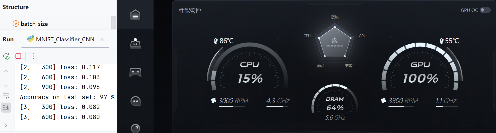

## 卷积网络中图像尺寸的处理

### 池化层

在卷积神经网络中，`padding` 是指在输入图像的边缘添加额外的像素层。这可以用来控制输出图像的尺寸，并确保图像的重要特征不会因为边界效应而丢失。对于最大池化层（MaxPool2d）来说，虽然它不像卷积层那样需要保持空间维度，但在某些情况下，你可能仍然希望使用 padding 来调整输出尺寸。

当使用 `padding` 时，对输出尺寸的影响可以通过修改上述提到的公式来体现：
$$
{输出尺寸} = \frac{\text{输入尺寸} + 2 \times \text{padding} - \text{核大小}}{\text{步长}} + 1
$$
这里，`padding` 是添加到输入图像每一边的像素数。如果我们在上面的例子中引入 `padding`，那么输出尺寸会相应地改变。**核大小指的是池化层的核大小，不是卷积核。**

例如，假设我们有一个7x7的输入图像，并且我们想应用一个2x2的最大池化层（MaxPool2d(2)），同时设置 `padding=1` 和 `stride=2`：

- 输入宽度/高度：7
- 核大小：2
- 步长：2
- padding：1

代入公式计算输出尺寸：
$$
{输出宽度/高度} = \frac{7 + 2 \times 1 - 2}{2} + 1 = \frac{7 + 2 - 2}{2} + 1 = \frac{7}{2} + 1 = 3.5 + 1 = 4.5
$$
向下取整后，输出尺寸将是4x4。

因此，通过增加 `padding`，你可以让输出尺寸变得更大。这对于保持网络结构的一致性或避免信息丢失可能是有用的。需要注意的是，`padding` 的值通常是根据实际需求和网络设计来确定的。

**Pytorch中的`ceil_mode`参数：**

在卷积神经网络中，`ceil_mode` 是一个参数，它决定了池化层（如最大池化）在计算输出尺寸时如何处理非整数的结果。默认情况下，大多数深度学习框架会向下取整，即舍去小数部分。但是当 `ceil_mode=True` 时，系统将向上取整，这意味着即使有小数部分存在，也会被算作额外的一个像素。

对于你的例子，一张7x7大小的图片经过一个核大小为2x2的最大池化层（MaxPool2d(2)），使用默认设置（`ceil_mode=False`）：
$$
{输出宽度/高度} = \left\lfloor \frac{7 - 2}{2} + 1 \right\rfloor = \left\lfloor 3.5 \right\rfloor = 3
$$
所以输出尺寸是3x3。

如果设置了 `ceil_mode=True`：
$$
{输出宽度/高度} = \left\lceil \frac{7 - 2}{2} + 1 \right\rceil = \left\lceil 3.5 \right\rceil = 4
$$
在这种情况下，输出尺寸将是4x4。这意味着即使实际计算结果是3.5，因为向上取整了，所以最终的输出尺寸会是4x4，而不是通常的向下取整得到的3x3。

需要注意的是，当使用 `ceil_mode=True` 且输入尺寸不能被池化窗口整除时，最后一行或最后一列可能只包含部分数据点，这可能会导致边缘处理上的细微差异。

### 池化层中如何使得输入输出的图像大小一致？

**平均池化层**（Average Pooling Layer）与最大池化层类似，但它的原理是对池化窗口内的所有像素取平均值，而不是取最大值。这样做的效果是平滑图像，减少噪声，而不会像最大池化那样强调局部最大值。

### 原理：
- **池化窗口**（kernel size）：池化窗口覆盖输入的局部区域，常见大小为 \(2 \times 2\) 或 \(3 \times 3\)。
- **步幅（stride）**：决定池化窗口移动的步幅，每次移动多少个像素。
- **输出**：在池化窗口覆盖的区域内，计算所有像素的平均值作为输出。

### 如何设置 `padding` 和 `stride` 使输入和输出图像的大小保持一致：
为了确保输入图像和输出图像的大小保持一致，需要通过合理设置池化窗口的 `padding` 和 `stride` 来实现。一般情况下，可以通过以下方式实现：

1. **池化窗口大小**：选择合适的池化窗口（`kernel_size`），通常是 \(2 \times 2\) 或 \(3 \times 3\)。

2. **步幅（stride）**：将 `stride` 设置为 1，这样池化窗口每次只移动一个像素，保证不会过度压缩图像。

3. **填充（padding）**：通过设置 `padding`，在输入图像的边缘填充一些像素，以保持输出的尺寸与输入一致。填充的大小由以下公式确定：
   $$
   \text{Padding} = \frac{(K - 1)}{2}
   $$

其中，\( K \) 是池化窗口的大小。如果 `kernel_size` 为偶数时，通常可以向输入的边缘非对称填充，确保尺寸一致。

**举例：**

假设池化窗口大小为 \(3 \times 3\) 且 `stride=1`，那么 `padding` 应该设置为：
$$
\text{Padding} = \frac{(3 - 1)}{2} = 1
$$
这样：
- 输入和输出的图像尺寸将保持一致。
- 每次池化窗口移动时，输入图像的每个像素都会被平滑处理。

在 PyTorch 中，可以这样定义一个平均池化层：

```python
self.pooling = torch.nn.AvgPool2d(kernel_size=3, stride=1, padding=1)
```

这样，输入和输出的图像尺寸将保持不变。

## 卷积网络的模块化设计

### Inception Module设计

这是GoogleNet：

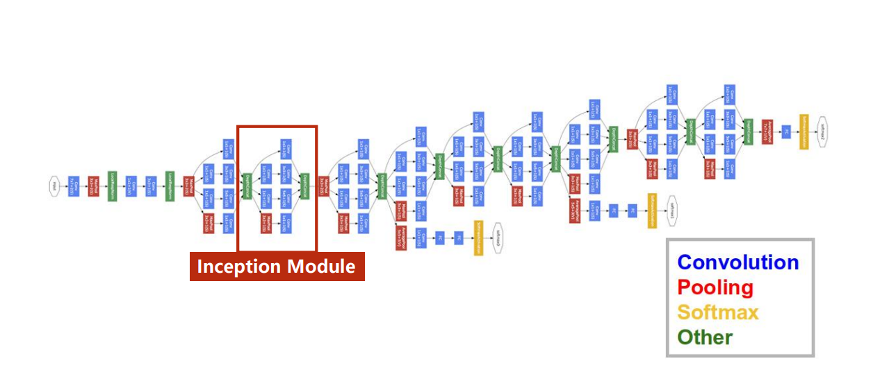

网络中有很多重复出现的部分，我们将这部分成为Inception Module，具体的结构如下图所示：

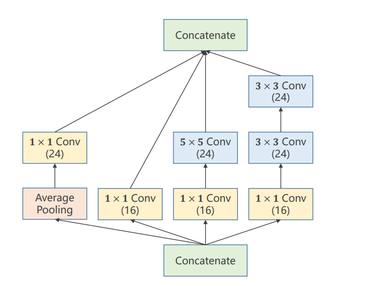

这里面提到了一个1×1的卷积核，其实就是一个数字乘图像中的所有元素。

原理如下所示：

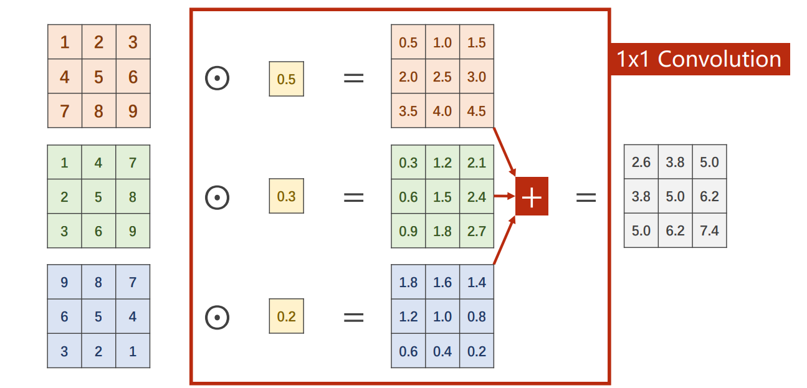

1×1的卷积核不改变图像的尺寸，只改变通道数。

**为什么要引入1×1的卷积核？**

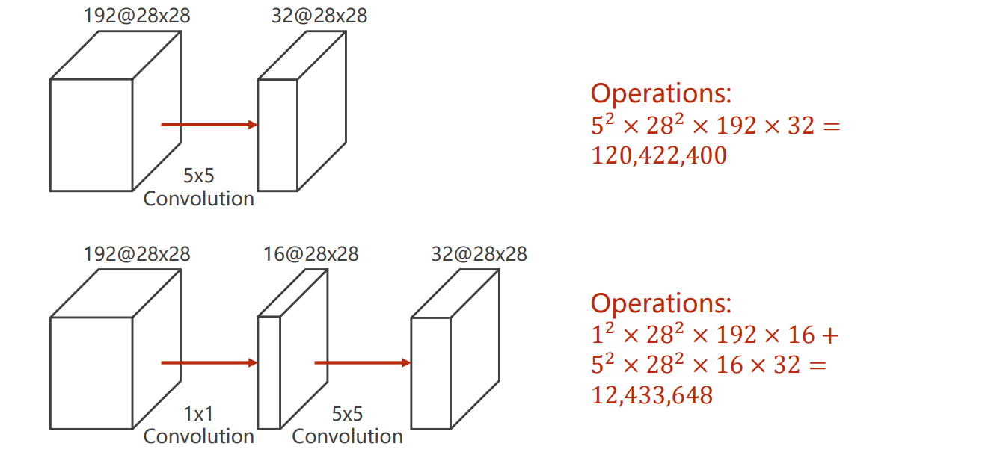

上图，如果直接将一个192通道的28×28的图像卷积成32通道的28×28的（肯定是padding=2，要不然就是26×26）。对于卷积核单个运算就要5^2^次计算，然后最后的图像大小不变，要28^2^次运算，有192个通道，卷积核也是32通道的，最后的运算量达到了120,422,400次运算。假如1×1的卷积核，虽然网络变复杂了，但是总体的运算量变小了。

> 为什么不用1×1的卷积核直接将192缩放到32？
>
> 这样会使图像严重失真。

模型设计的代码如下：

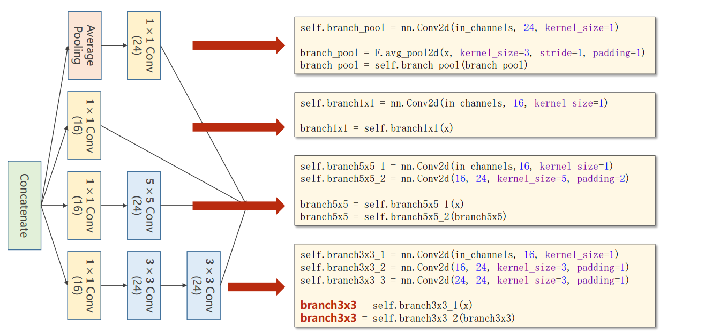


最后每一条支流得到一个某些通道下的尺寸的图片 

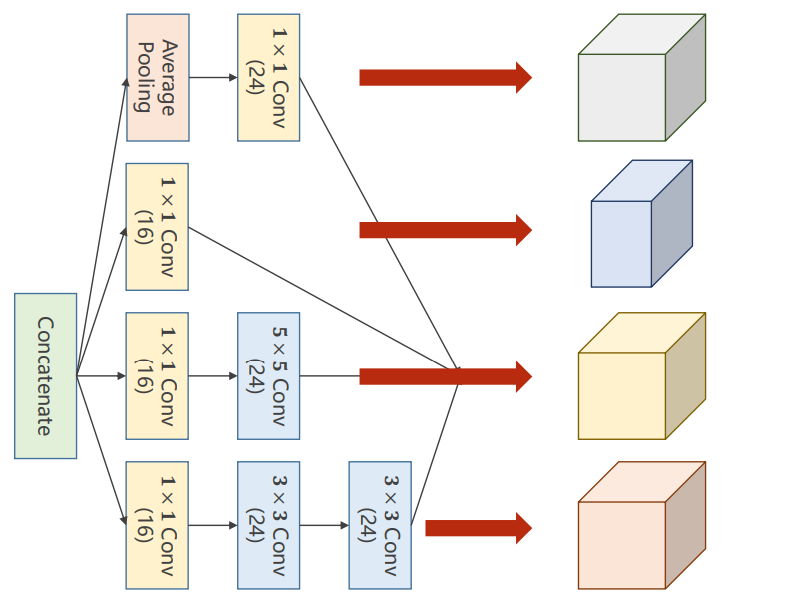

支流进行汇合`Concatenate`

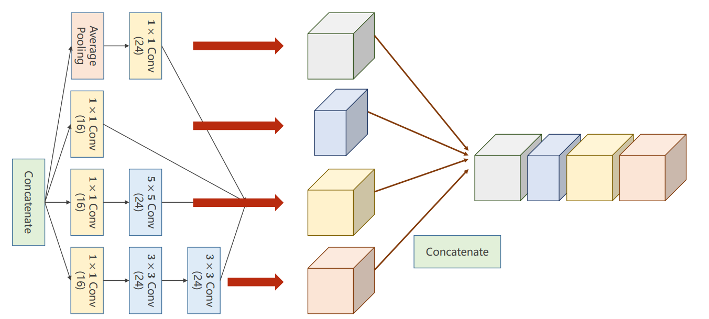

`Concatenate`部分的代码如下所示：

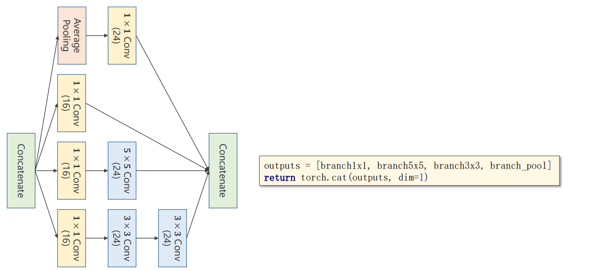

```python
#!/usr/bin/env python
# -*- coding: UTF-8 -*-
'''
@File      ：GoogleNet_Module.py
@IDE       ：PyCharm 
@Author    ：lml
@Date      ：2024/10/20 16:19 
@Descriable：设计实现一个GoogleNet的模块，并使用这个模块设计一个卷积网络
'''
from matplotlib import pyplot as plt
from torch import nn
import torch
from torchvision import transforms # 对图像进行原始处理的工具
from torchvision import datasets
from torch.utils.data import DataLoader
import torch.nn.functional as F
import torch.optim as optim

# 这是一个Inception Module的模型
class InceptionA(nn.Module):
    def __init__(self, in_channels):
        super(InceptionA, self).__init__()
        self.branch1x1 = nn.Conv2d(in_channels, 16, kernel_size=1)

        self.branch5x5_1 = nn.Conv2d(in_channels,16, kernel_size=1)
        self.branch5x5_2 = nn.Conv2d(16, 24, kernel_size=5, padding=2)

        self.branch3x3_1 = nn.Conv2d(in_channels, 16, kernel_size=1)
        self.branch3x3_2 = nn.Conv2d(16, 24, kernel_size=3, padding=1)
        self.branch3x3_3 = nn.Conv2d(24, 24, kernel_size=3, padding=1)

        self.branch_pool = nn.Conv2d(in_channels, 24, kernel_size=1)
    def forward(self, x):
        branch1x1 = self.branch1x1(x)

        branch5x5 = self.branch5x5_1(x)
        branch5x5 = self.branch5x5_2(branch5x5)

        branch3x3 = self.branch3x3_1(x)
        branch3x3 = self.branch3x3_2(branch3x3)
        branch3x3 = self.branch3x3_3(branch3x3)

        branch_pool = F.avg_pool2d(x, kernel_size=3, stride=1, padding=1)
        branch_pool = self.branch_pool(branch_pool)

        outputs = [branch1x1, branch5x5, branch3x3, branch_pool]
        return torch.cat(outputs, dim=1) # 最后输出的通道数就是24+16+24+24=88

class Net(nn.Module):
    def __init__(self):
        super(Net, self).__init__()
        self.conv1 = nn.Conv2d(1, 10, kernel_size=5)
        self.conv2 = nn.Conv2d(88, 20, kernel_size=5)

        self.incep1 = InceptionA(in_channels=10)
        self.incep2 = InceptionA(in_channels=20)

        self.mp = nn.MaxPool2d(2)

        # 这个传入全连接的数字在实际开发的时候，可以先传入一个随机的数字，然后根据编译器报错的信息进行修改
        # 或者说将全连接的部分去掉，然后最后打印出来卷积之后的size大小
        self.fc = nn.Linear(1408, 10)
    def forward(self, x):
        in_size = x.size(0)
        x = F.relu(self.mp(self.conv1(x)))
        x = self.incep1(x)
        x = F.relu(self.mp(self.conv2(x)))
        x = self.incep2(x)
        x = x.view(in_size, -1)
        x = self.fc(x)
        return x

batch_size = 64
transform = transforms.Compose([
    transforms.ToTensor(), # 对于输入的图像，先转换成Pytorch中的张量，然后像素的取值变成0-1
    transforms.Normalize((0.1307, ), (0.3081, )) # 0.1307就是MNIST数据集的均值，0.3081是数据集的标准差，这个是计算的整个数据集
])
train_dataset = datasets.MNIST(root='./dataset/mnist/',
                           train=True,
                           download=True,
                           transform=transform # 数据集中的样本都会做上面定义的transform的一系列操作
                           )
train_loader = DataLoader(train_dataset,
                          shuffle=True,
                          batch_size=batch_size
                          )
test_dataset = datasets.MNIST(root='./dataset/mnist/',
                              train=False,
                              download=True,
                              transform=transform
                              )
test_loader = DataLoader(test_dataset,
                         shuffle=False, # 在测试集里我们就不需要随机打乱顺序，只需要按照数据集顺序测试即可
                         batch_size=batch_size
                         )

model = Net()
# 使用GPU进行运算
device = torch.device("cuda:0" if torch.cuda.is_available() else "cpu")
model.to(device)

criterion = torch.nn.CrossEntropyLoss()
optimizer = optim.SGD(model.parameters(), lr=0.01, momentum=0.5)

def train(epoch): # 将一轮训练封装成一个函数
    running_loss = 0.0
    for batch_idx, data in enumerate(train_loader, 0):
        inputs, target = data
        # 在训练的时候，将数据迁移到GPU上 注意模型和数据要在同一张显卡上
        inputs, target = inputs.to(device), target.to(device)
        optimizer.zero_grad() # 优化器优化之前先进行清零

        # forward+bachward+update一起
        outputs = model(inputs)
        loss = criterion(outputs, target)
        loss.backward()
        optimizer.step()

        running_loss += loss.item() # 计算累计的loss值

        if batch_idx % 300 == 299: # 设置每300轮打印一下损失
            print('[%d, %5d] loss: %.3f' % (epoch + 1, batch_idx + 1, running_loss / 300))
            running_loss = 0.0

def test():
    correct = 0
    total = 0
    with torch.no_grad(): # test部分只需要计算前向传播，不需要计算反向传播，使用这一句就说明这一段代码里不计算梯度，不生成计算图
        for data in test_loader:
            images, labels = data
            images, labels = images.to(device), labels.to(device)
            outputs = model(images)

            _, predicted = torch.max(outputs.data, dim = 1)
            total += labels.size(0) # 最后得到的标签分类是一个N×1的向量，size()得到的是一个元组(N, 1),size(0)就是N，而这个N就是每个batch_size
            correct += (predicted==labels).sum().item() # 拿预测的分类与标签分类相对比，真就是1，假就是0，取预测成功的数量
        print('Accuracy on test set: %d %%' %(100 * correct / total)) # 待所有的测试样本测试接受之后，就计算最后的正确率
    return 100 * correct / total

if __name__ == '__main__':
    accuracy_list = []
    epoch_list = []
    for epoch in range(10):
        epoch_list.append(epoch + 1)
        train(epoch)
        accuracy_list.append(test())
    plt.plot(epoch_list, accuracy_list)
    plt.ylabel('Accuracy')
    plt.xlabel('Epoch')
    plt.show()
```

```python
[1,   300] loss: 0.878
[1,   600] loss: 0.220
[1,   900] loss: 0.160
Accuracy on test set: 96 %
[2,   300] loss: 0.126
[2,   600] loss: 0.105
[2,   900] loss: 0.095
Accuracy on test set: 97 %
[3,   300] loss: 0.087
[3,   600] loss: 0.078
[3,   900] loss: 0.073
Accuracy on test set: 98 %
[4,   300] loss: 0.068
[4,   600] loss: 0.067
[4,   900] loss: 0.066
Accuracy on test set: 98 %
[5,   300] loss: 0.054
[5,   600] loss: 0.060
[5,   900] loss: 0.056
Accuracy on test set: 98 %
[6,   300] loss: 0.048
[6,   600] loss: 0.052
[6,   900] loss: 0.052
Accuracy on test set: 98 %
[7,   300] loss: 0.047
[7,   600] loss: 0.049
[7,   900] loss: 0.044
Accuracy on test set: 98 %
[8,   300] loss: 0.046
[8,   600] loss: 0.041
[8,   900] loss: 0.041
Accuracy on test set: 98 %
[9,   300] loss: 0.040
[9,   600] loss: 0.038
[9,   900] loss: 0.041
Accuracy on test set: 98 %
[10,   300] loss: 0.036
[10,   600] loss: 0.034
[10,   900] loss: 0.038
Accuracy on test set: 98 %
```

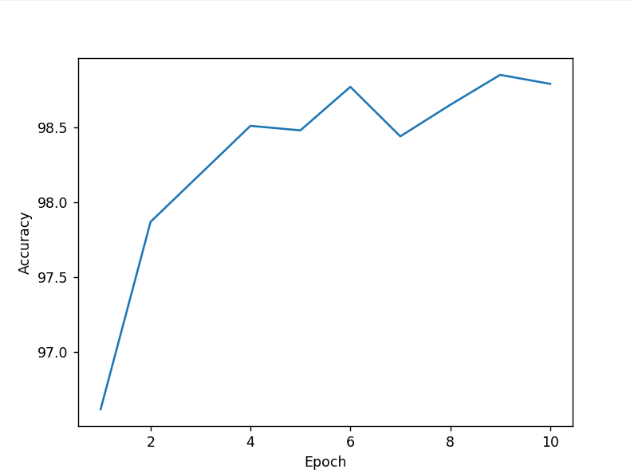

其实并不是训练越多轮越好。

### 残差设计

#### 神经网络中的梯度消失问题

在刚开始我们就讲到了神经网路对梯度进行更新的时候是采用链式法则进行乘处理，如果在链式法则当中一直乘一个小于1的数，最后计算得到损失函数对参数的梯度的时候，得到的可能就是一个0，那我们使用梯度下降公式：
$$
\omega=\omega-\alpha \frac{\partial \cos t}{\partial \omega}
$$
进行更新的时候，参数就不再进行更新，此后无论怎么继续做训练，参数的值不在发生变化，那么我们后续做的这些训练都是白费的。

残差可以解决梯度消失问题，背后的数学原理是什么呢？

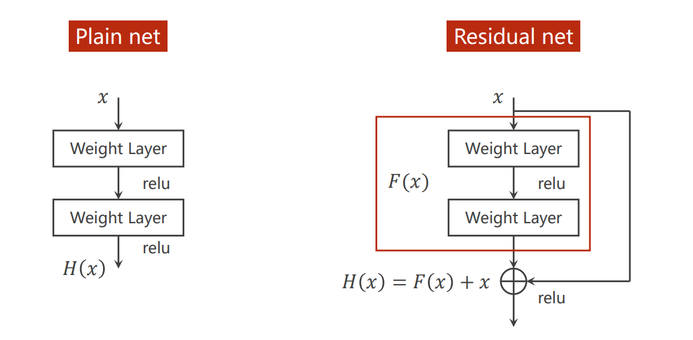

采用残差连接（Residual Connections）来解决神经网络中的梯度消失问题的背后数学原理主要体现在以下几个方面：

残差连接通过引入捷径（shortcut）连接，允许网络学习输入与输出之间的差异，而不是直接学习输入到输出的映射。这种方式可以被表示为：

$$
y = F(x) + x
$$
其中：

- \($y$\) 是最终的输出。
- \($F(x)$\) 是学习的残差部分，表示网络学习到的映射。
- \($x$\) 是输入。

通过这种方式，网络实际上学习的是输入 \($x$\) 和输出 \($y$\) 之间的残差（即差异）。

残差连接的引入使得梯度可以更容易地通过网络向后传播。具体来说，考虑以下链式法则的梯度传播：
$$
\frac{\partial L}{\partial x} = \frac{\partial L}{\partial y} \cdot \frac{\partial y}{\partial F(x)} + \frac{\partial L}{\partial y} \cdot \frac{\partial y}{\partial x}
$$
在有残差连接的情况下，\($\frac{\partial y}{\partial x} = 1$\)，因此即使 \($F(x)$\) 的梯度较小，输入 \(x\) 仍然会通过直接连接接收到梯度，帮助缓解梯度消失的问题。

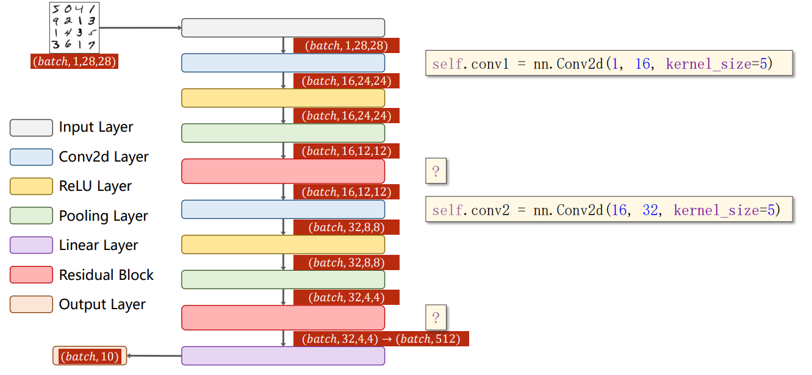

这里只需要修改模型设计部分的代码，其余代码和Inception Module实现相同

```python
class ResidualBlock(nn.Module):
    def __init__(self, channels):
        super(ResidualBlock, self).__init__()
        self.channels = channels
        self.conv1 = nn.Conv2d(channels, channels,
        kernel_size=3, padding=1)
        self.conv2 = nn.Conv2d(channels, channels,
        kernel_size=3, padding=1)
    def forward(self, x):
        y = F.relu(self.conv1(x))
        y = self.conv2(y)
        return F.relu(x + y) # 最后一步的残差连接

class Net(nn.Module):
    def __init__(self):
        super(Net, self).__init__()
        self.conv1 = nn.Conv2d(1, 16, kernel_size=5)
        self.conv2 = nn.Conv2d(16, 32, kernel_size=5)
        self.mp = nn.MaxPool2d(2)
        self.rblock1 = ResidualBlock(16)
        self.rblock2 = ResidualBlock(32)
        self.fc = nn.Linear(512, 10)
    def forward(self, x):
        in_size = x.size(0)
        x = self.mp(F.relu(self.conv1(x)))
        x = self.rblock1(x)
        x = self.mp(F.relu(self.conv2(x)))
        x = self.rblock2(x)
        x = x.view(in_size, -1)
        x = self.fc(x)
        return x
```

```python
[1,   300] loss: 0.473
[1,   600] loss: 0.148
[1,   900] loss: 0.116
Accuracy on test set: 97 %
[2,   300] loss: 0.090
[2,   600] loss: 0.079
[2,   900] loss: 0.072
Accuracy on test set: 98 %
[3,   300] loss: 0.063
[3,   600] loss: 0.053
[3,   900] loss: 0.061
Accuracy on test set: 98 %
[4,   300] loss: 0.047
[4,   600] loss: 0.045
[4,   900] loss: 0.051
Accuracy on test set: 98 %
[5,   300] loss: 0.042
[5,   600] loss: 0.040
[5,   900] loss: 0.044
Accuracy on test set: 98 %
[6,   300] loss: 0.036
[6,   600] loss: 0.037
[6,   900] loss: 0.034
Accuracy on test set: 99 %
[7,   300] loss: 0.032
[7,   600] loss: 0.032
[7,   900] loss: 0.033
Accuracy on test set: 99 %
[8,   300] loss: 0.027
[8,   600] loss: 0.030
[8,   900] loss: 0.030
Accuracy on test set: 99 %
[9,   300] loss: 0.022
[9,   600] loss: 0.027
[9,   900] loss: 0.029
Accuracy on test set: 99 %
[10,   300] loss: 0.023
[10,   600] loss: 0.023
[10,   900] loss: 0.023
Accuracy on test set: 98 %
```

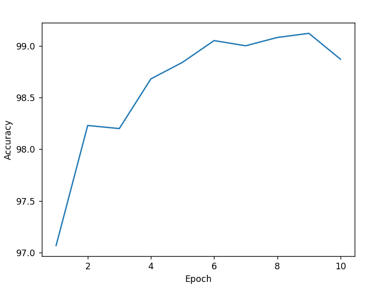

我们发现模型的准确率达到了99%。

# 循环神经网络

一个卷积神经网络输入128个通道，输出64个通道，使用5×5的卷积计算，这一层的参数量达到了25×2^13^=大概20w参数；**卷积层只和输入输出的通道以及卷积核大小有关**。

**全连接层要和变换的数据大小有关**，加入一个256×256的图像，那么像素的数量就打到了4096个，变换一次得到1024维，那么这一层的全连接的参数数量达到了4096×1024=420w左右。

为什么CNN的权重数量较少，因为对某一个通道做卷积，整个图像都是贡献这一个卷积，所以权重数量就少。（即权重共享）

**处理具有序列特性的数据，采用RNN**


每一个输入都要基于前一个输入。在自然语言处理当中，比如说：“我爱河海大学”。“爱”就要在“我”的后面，“河海大学”就要在“爱”的后面。

## 什么是RNN呢？

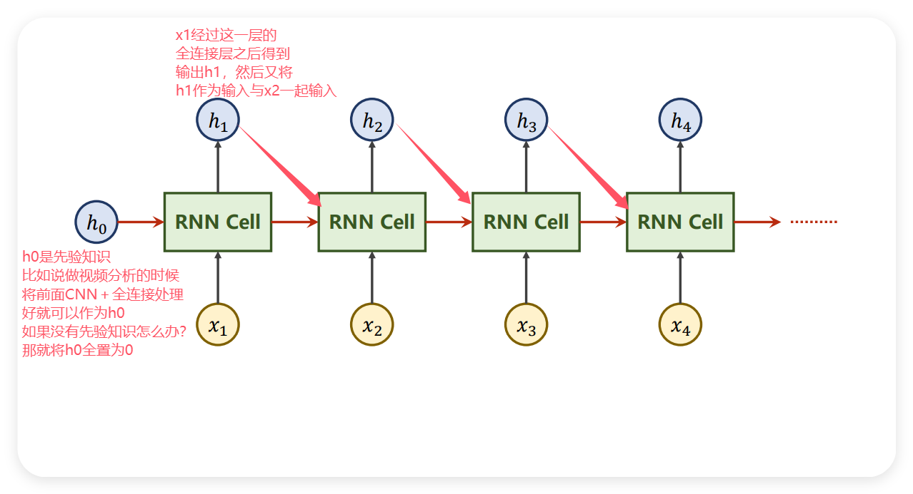

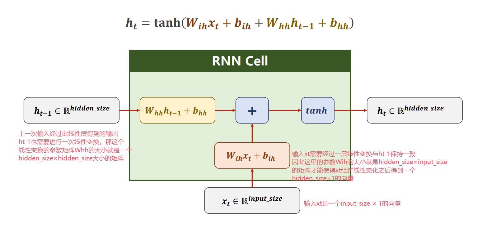

最后的激活函数普遍采用tanh函数。

其实最后对$h_{t-1}$和$x_t$的变换就是这样的一个变换：
$$
W_1 h_{t-1}+W_2X{t} = \begin{bmatrix}
  W_1&W_2
\end{bmatrix}_{hiddensize\times (hiddensize + inputsize)}
\begin{bmatrix}
 h_{t-1}\\
 x_{t}
\end{bmatrix}_{(hiddensize + inputsize)\times 1}
$$
## Pytorch中实现RNN的两种方式

### RNNCell

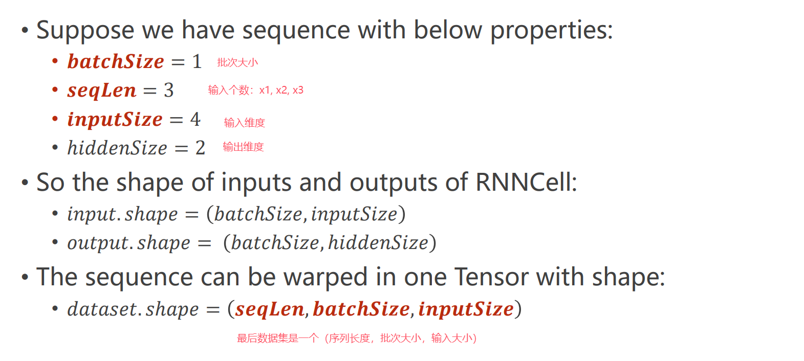

在Pytorch中，我们可以**直接使用类`RNNCell`去实例化：**

```python
cell = torch.nn.RNNCell(input_size=input_size, hidden_size=hidden_size)
```

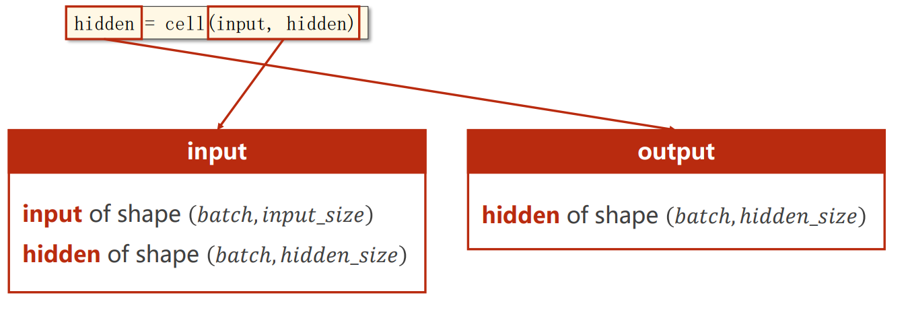

batch就是批次的大小。

**seq_len在batch_size前面的原因就是因为训练的时候，拿出来的是t时刻，batch_size大小的一组张量，然后训练seq_len长度次，就代表这个cell训练完了。**

```python
import torch
batch_size = 1
seq_len = 3
input_size = 4
hidden_size = 2

cell = torch.nn.RNNCell(input_size = input_size, hidden_size = hidden_size)

dataset = torch.randn(seq_len, batch_size, input_size)
hidden = torch.zeros(batch_size, hidden_size) # 初始化h0 全部置为0

for idx, input in enumerate(dataset, 0):
    print('=' * 20, idx, '=' * 20)
    print('input-size: ', input.shape)

    hidden = cell(input, hidden)

    print('output-size: ', hidden.shape)
    print(hidden)
```

```python
==================== 0 ====================
input-size:  torch.Size([1, 4])
output-size:  torch.Size([1, 2])
tensor([[-0.8005, -0.8276]], grad_fn=<TanhBackward0>)
==================== 1 ====================
input-size:  torch.Size([1, 4])
output-size:  torch.Size([1, 2])
tensor([[-0.8575, -0.6381]], grad_fn=<TanhBackward0>)
==================== 2 ====================
input-size:  torch.Size([1, 4])
output-size:  torch.Size([1, 2])
tensor([[-0.0496, -0.6631]], grad_fn=<TanhBackward0>)
```

### RNN

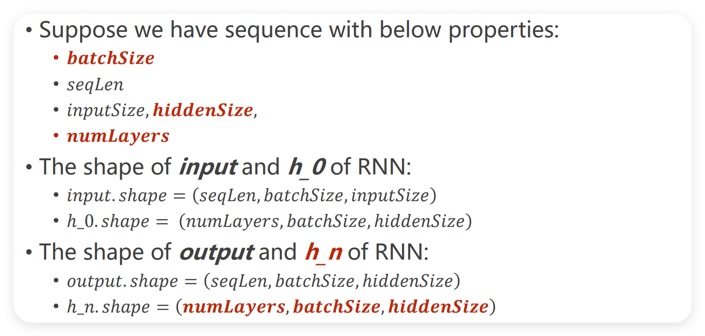

**也可以使用`RNN`去实例化。**

```python
cell = torch.nn.RNN(input_size=input_size, hidden_size=hidden_size,num_layers=num_layers)
out, hidden = cell(inputs, hidden)
```

这里有点特殊的就是`num_layers`，值得就是RNN的层数：

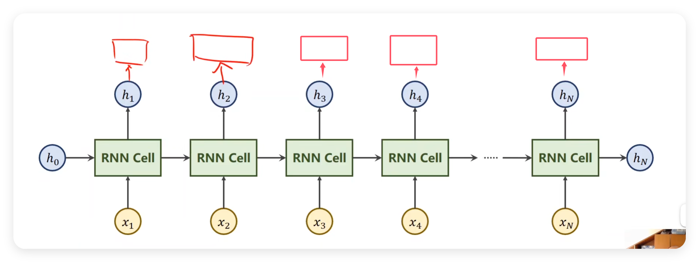

这张图应该更加容易理解：

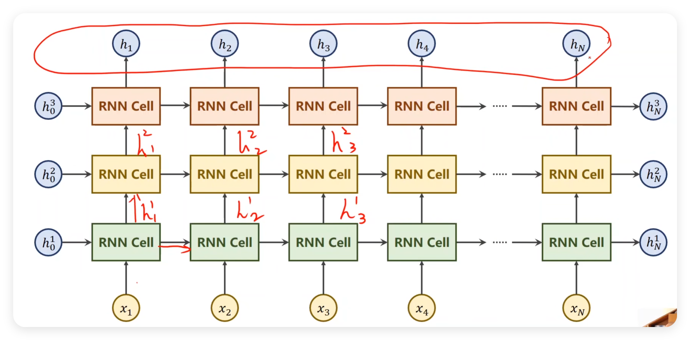

最上面的h1、h2等如果写成output如o1、o2等会更好理解，因为最上面已经不作为下一层的输入所以不算是隐藏层的h了，网络训练好的东西都存在了h1n等里面，而输出则是最上面的h1(o1)等里面。**权重不一样，但是，权重的维度一样**。

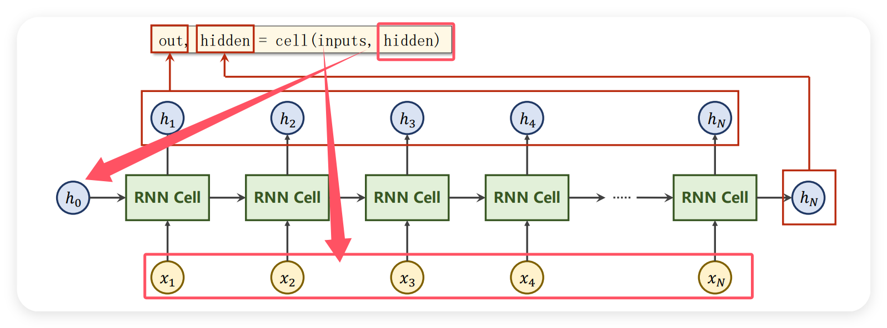

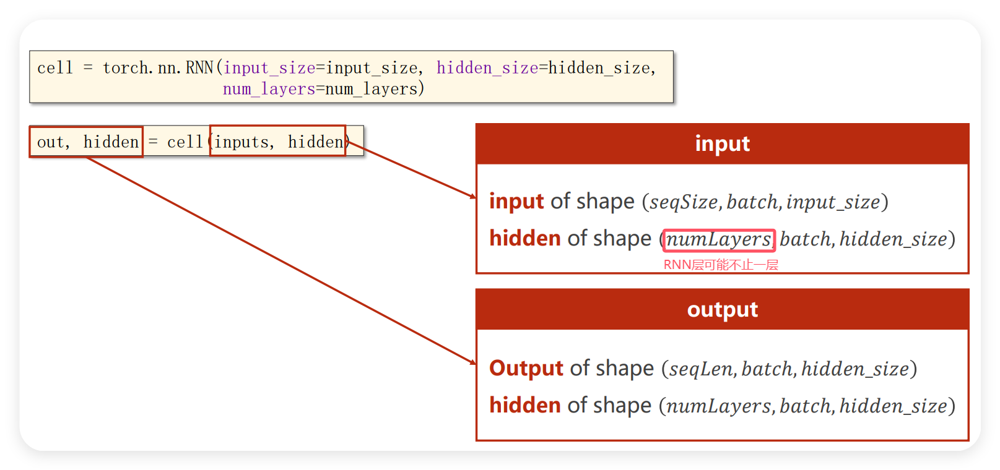

```python
import torch

batch_size = 1
seq_len = 3
input_size = 4
hidden_size = 2
num_layers = 1

cell = torch.nn.RNN(input_size = input_size, hidden_size= hidden_size, num_layers = num_layers)

inputs = torch.randn(seq_len, batch_size, input_size)
hidden = torch.zeros(num_layers, batch_size, hidden_size)

out, hidden = cell(inputs, hidden) # 这里就不需要我们在写循环了，库里已经写好了。 

print('Output size:', out.shape)
print('Output:', out)
print('Hidden size: ', hidden.shape)
print('Hidden: ', hidden)
```

```python
Output size: torch.Size([3, 1, 2])
Output: tensor([[[ 0.6437, -0.7838]],

        [[ 0.8489, -0.8337]],

        [[ 0.5057, -0.9436]]], grad_fn=<StackBackward0>)
Hidden size:  torch.Size([1, 1, 2])
Hidden:  tensor([[[ 0.5057, -0.9436]]], grad_fn=<StackBackward0>)
```

**注意**

`RNN()`里面有一个参数为`batch_first`， 使用这个参数，我们就需要对维度进行变换：

```python
cell = torch.nn.RNN(input_size=input_size, hidden_size=hidden_size,
num_layers=num_layers, batch_first=True)
```

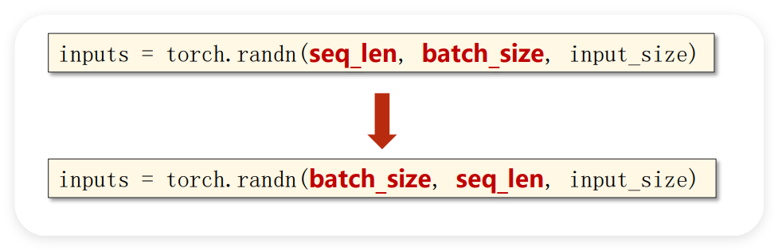

在刚才的代码里我们就需要做如下的修改：

```python
import torch

batch_size = 1
seq_len = 3
input_size = 4
hidden_size = 2
num_layers = 1

cell = torch.nn.RNN(input_size = input_size, hidden_size= hidden_size, num_layers = num_layers, batch_first=True)

inputs = torch.randn(batch_size, seq_len, input_size)
hidden = torch.zeros(num_layers, batch_size, hidden_size)

out, hidden = cell(inputs, hidden) # 这里就不需要我们在写循环了，库里已经写好了。 

print('Output size:', out.shape)
print('Output:', out)
print('Hidden size: ', hidden.shape)
print('Hidden: ', hidden)
```

现在我们有一个任务：

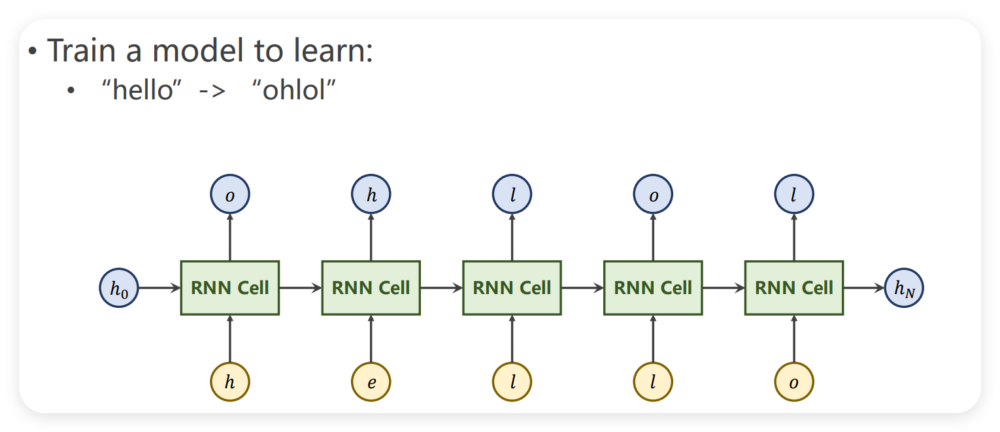

首先我们要知道RNN网络里面无法输入数值，所以我们需要将字符转变成数值输入，首先想到的就是采用键值对的方式进行处理：

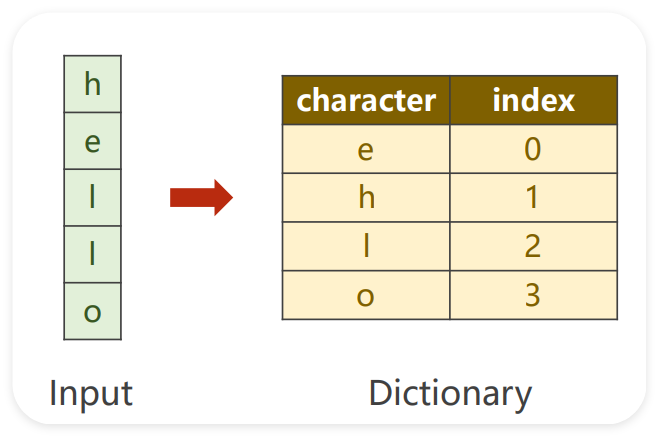

但是如果直接使用这样的数值替代字符是有问题的，因为直观上看3要比0大的，所以存在一种数值大小的关系在里面，因此我们需要消除这种大小关系，由此**One-hot编码**就发挥作用了：

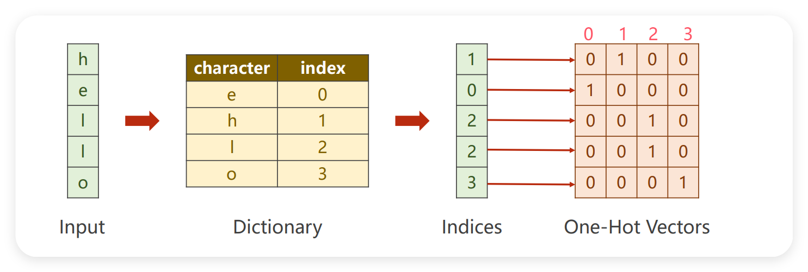

在向量上只有对应位置为1，其余位置为0。这样处理我们就消除了数值的大小关系。

所以在这里input-size的值就为4，每一个字符对应一个向量，向量长度为4，并且输入的“hello”也是一个序列，对于“hello”而言，这就是一个样本输入，这个样本里每一个字符具有一定的序列关系。我们的任务是输出“ohlol”，同样也是一个序列，对于样本的每一个序列需要有一个对应的输出，这里可以理解为一个多分类的问题。

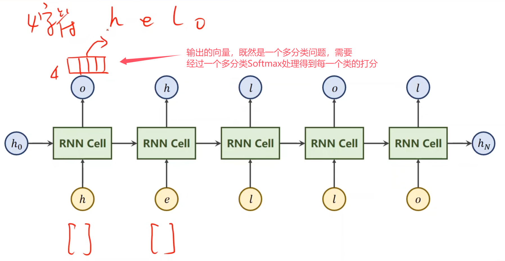

既然是一个多分类问题，在设计模型的时候我们就需要加入一层Softmax层，损失器采用交叉熵：

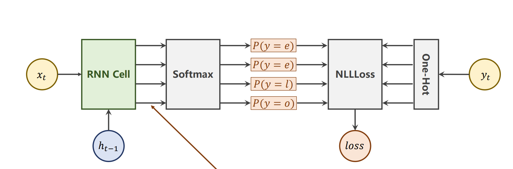

但是经过RNN Cell之后的输出的size是多少呢？----> 根据之前我们设置的任务输出的字符都在设计好的one-hot编码里，因此输出的大小应该也是4。

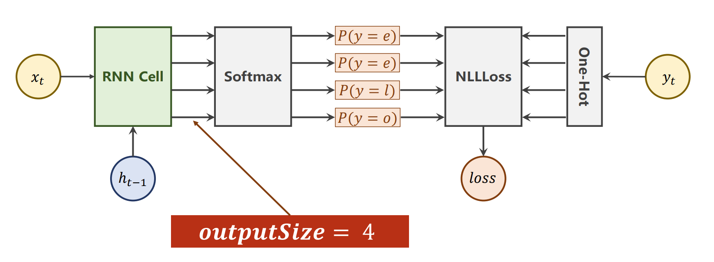

因此总结下来这个多分类的处理方式：

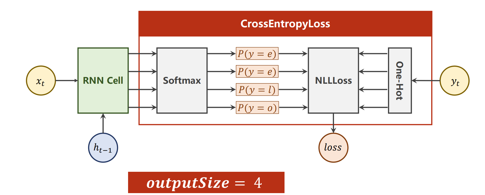

采用RNNCell：

```python
#!/usr/bin/env python
# -*- coding: UTF-8 -*-
'''
@File      ：Hello_RNN.py
@IDE       ：PyCharm 
@Author    ：lml
@Date      ：2024/10/25 13:35 
@Descriable：
'''
import torch

input_size = 4
hidden_size = 4
batch_size = 1

idx2char = ['e', 'h', 'l', 'o']
x_data = [1, 0, 2, 2, 3] # 对应hello
y_data = [3, 1, 2, 3, 2] # 对应ohlol

one_hot_lookup = [[1, 0, 0, 0],
                  [0, 1, 0, 0],
                  [0, 0, 1, 0],
                  [0 ,0, 0, 1]
]
x_one_hot = [one_hot_lookup[x] for x in x_data] # 这里的意思就是根据x_data里的值，取one_hot_lookup对应位置的序列

inputs = torch.Tensor(x_one_hot).view(-1, batch_size, input_size) # 这里我们采用了x_one_hot得到的输入是一个seqlen x inputsize的大小，输入的时候应该是seqlen x batchsize x inputsize
labels = torch.LongTensor(y_data).view(-1, 1) # labels的维度是seqlen x 1

class Model(torch.nn.Module):
    def __init__(self, input_size, hidden_size, batch_size):
        super(Model, self).__init__()
        self.batch_size = batch_size
        self.input_size = input_size
        self.hidden_size = hidden_size
        self.rnncell = torch.nn.RNNCell(input_size = self.input_size, hidden_size = self.hidden_size)

    def forward(self, input, hidden):
        hidden = self.rnncell(input, hidden)
        return hidden

    def init_hidden(self):
        return torch.zeros(self.batch_size, self.hidden_size)

net = Model(input_size, hidden_size, batch_size)

criterion = torch.nn.CrossEntropyLoss()
optimizer = torch.optim.Adam(net.parameters(), lr=0.1)

for epoch in range(15):
    loss = 0
    optimizer.zero_grad()
    hidden = net.init_hidden()
    print('Predicted string: ', end='')
    for input, label in zip(inputs, labels): # 这里的循环是用来循环一个批次的下样本的序列
        # 这里inputs为seqlen x batchsize x inputsize labels的为seqsize x 1
        # 进入循环的input 为 batchsize x inputsize label为 1
        hidden = net(input, hidden)
        loss += criterion(hidden, label) # 注意这里loss是将每一轮训练之后再反向传播计算梯度，在这个循环里每次都是计算的序列的loss，下一次循环依旧会构建计算图
        _, idx = hidden.max(dim=1)
        print(idx2char[idx.item()], end='')
    loss.backward()
    optimizer.step()
    print(', Epoch [%d/15] loss=%.4f' % (epoch + 1, loss.item()))
```

```python
Predicted string: lllll, Epoch [1/15] loss=6.8109
Predicted string: lhlll, Epoch [2/15] loss=5.5860
Predicted string: lhlll, Epoch [3/15] loss=4.6903
Predicted string: lhlol, Epoch [4/15] loss=3.9597
Predicted string: ohlol, Epoch [5/15] loss=3.3989
Predicted string: ohlol, Epoch [6/15] loss=3.0492
Predicted string: ohlol, Epoch [7/15] loss=2.8082
Predicted string: ohlol, Epoch [8/15] loss=2.6119
Predicted string: ohlol, Epoch [9/15] loss=2.4515
Predicted string: ohlol, Epoch [10/15] loss=2.3202
Predicted string: ohlol, Epoch [11/15] loss=2.2089
Predicted string: ohlol, Epoch [12/15] loss=2.1129
Predicted string: ohlol, Epoch [13/15] loss=2.0321
Predicted string: ohlol, Epoch [14/15] loss=1.9675
Predicted string: ohlol, Epoch [15/15] loss=1.9183
```

我们可以看到记过逐步训练成我们想要的样子

采用RNN直接进行训练：

```python
import torch

input_size = 4
hidden_size = 4
batch_size = 1
seq_len = 5
num_layers = 1

idx2char = ['e', 'h', 'l', 'o']
x_data = [1, 0, 2, 2, 3] # 对应hello
y_data = [3, 1, 2, 3, 2] # 对应ohlol

one_hot_lookup = [[1, 0, 0, 0],
                  [0, 1, 0, 0],
                  [0, 0, 1, 0],
                  [0 ,0, 0, 1]
]
x_one_hot = [one_hot_lookup[x] for x in x_data]

inputs = torch.Tensor(x_one_hot).view(seq_len, batch_size, input_size)
labels = torch.LongTensor(y_data) #

class Model(torch.nn.Module):
    def __init__(self, input_size, hidden_size, batch_size, num_layers=1):
        super(Model, self).__init__()
        self.num_layers = num_layers
        self.batch_size = batch_size
        self.input_size = input_size
        self.hidden_size = hidden_size
        self.rnn = torch.nn.RNN(input_size = self.input_size,
                                hidden_size = self.hidden_size,
                                num_layers = self.num_layers
                                )

    def forward(self, input):
        hidden = torch.zeros(self.num_layers, #
                             self.batch_size,
                             self.hidden_size)
        out, _ = self.rnn(input, hidden)
        return out.view(-1, self.hidden_size) # 最后的输出应该是(𝒔𝒆𝒒𝑳𝒆𝒏 × 𝒃𝒂𝒕𝒄𝒉𝑺𝒊𝒛𝒆, 𝒉𝒊𝒅𝒅𝒆𝒏𝑺𝒊𝒛e)

net = Model(input_size, hidden_size, batch_size, num_layers)

criterion = torch.nn.CrossEntropyLoss()
optimizer = torch.optim.Adam(net.parameters(), lr=0.05)

for epoch in range(15):
    optimizer.zero_grad()
    outputs = net(inputs)
    loss = criterion(outputs, labels)
    loss.backward()
    optimizer.step()
    _, idx = outputs.max(dim=1)
    idx = idx.data.numpy()
    print('Predicted: ', ''.join([idx2char[x] for x in idx]), end='')
    print(', Epoch [%d/15] loss = %.3f' % (epoch + 1, loss.item()))
```

```python
Predicted:  hlhhh, Epoch [1/15] loss = 1.355
Predicted:  hlhhl, Epoch [2/15] loss = 1.239
Predicted:  ollol, Epoch [3/15] loss = 1.154
Predicted:  ollll, Epoch [4/15] loss = 1.090
Predicted:  ollll, Epoch [5/15] loss = 1.041
Predicted:  ollll, Epoch [6/15] loss = 0.999
Predicted:  ollll, Epoch [7/15] loss = 0.958
Predicted:  ololl, Epoch [8/15] loss = 0.918
Predicted:  ololl, Epoch [9/15] loss = 0.880
Predicted:  oholl, Epoch [10/15] loss = 0.845
Predicted:  oholl, Epoch [11/15] loss = 0.813
Predicted:  oholl, Epoch [12/15] loss = 0.782
Predicted:  oholl, Epoch [13/15] loss = 0.752
Predicted:  oholl, Epoch [14/15] loss = 0.722
Predicted:  oholl, Epoch [15/15] loss = 0.695
```

## One-hot编码的缺点

* 如果数据类别过大，那么产生更多的维度，比如说128的ASCII码就需要128个维度，同样在处理自然语言的时候，对词进行编码，英语中可能有几万个词，那么就需要有几万个的维度，维度太高会造成“维度诅咒”。（维度诅咒就是，你的模型太过于简单，无法真正的把数据的规律映射出来，你需要提升你的函数的弹性）
* 维度太大，造成数据稀疏
* 对数据是硬编码，不是学习到的 

因此我们需要一个**低维、稠密、可以从数据中学习**的一种编码方式

由此引入**Embedding（嵌入层）**

## 什么是“维度诅咒”

维度诅咒（Curse of Dimensionality）是指随着数据维度的增加，数据点在高维空间中分布得越来越稀疏的现象。这种稀疏性会导致很多基于距离或邻近度的算法（如聚类、分类、回归等）的性能急剧下降。维度诅咒是机器学习、数据挖掘和统计学中的一个重要概念，它影响了许多算法的有效性和效率。

### 主要表现形式：

1. **数据稀疏性**：
   - 在高维空间中，即使数据点的数量很多，它们之间的距离也会变得很大。这意味着数据点在高维空间中分布得非常分散，很难找到彼此邻近的数据点。
   - 这种稀疏性导致许多基于距离的算法（如K近邻算法KNN）的效果变差，因为很难找到真正的“近邻”。

2. **体积膨胀**：
   - 在高维空间中，球体的体积相对于其包裹的超立方体的体积迅速减小。这意味着在高维空间中，球体的大部分体积实际上集中在它的边界附近，而不是中心区域。
   - 这种现象导致在高维空间中进行搜索或优化时，搜索空间变得异常庞大，增加了计算复杂度。

3. **距离退化**：
   - 在高维空间中，几乎所有的点到其他点的距离都非常接近。这意味着在高维空间中，点与点之间的距离几乎相等，无法很好地反映点之间的关系。
   - 这种距离退化现象使得基于距离的相似性度量（如欧氏距离、曼哈顿距离等）变得不那么有效。

### 影响：

- **计算复杂度增加**：随着维度的增加，数据点之间的比较次数呈指数级增长，导致计算成本急剧上升。
- **数据需求增加**：为了维持足够的密度，随着维度增加，所需的样本数量也要呈指数级增长。
- **模型过拟合风险增加**：在高维空间中，很容易找到一个模型来完美地拟合训练数据，但这样的模型在新的数据上表现通常较差，即过拟合。

### 解决策略：

1. **降维**：
   - 通过降维技术（如主成分分析PCA、t-SNE、Autoencoders等）减少数据的维度，保留主要的信息，同时去除噪声和冗余信息。

2. **特征选择**：
   - 选择最相关的特征，忽略那些对预测目标影响较小的特征，从而减少维度。

3. **特征工程**：
   - 创造新的特征或组合现有特征，以更好地捕捉数据中的模式。

4. **使用适合高维数据的算法**：
   - 选择不受维度诅咒影响的算法，如决策树、随机森林、支持向量机（SVM）等，这些算法通常对高维数据有更好的鲁棒性。

通过这些策略，可以在一定程度上缓解维度诅咒带来的负面影响，从而提高机器学习模型的性能和效率。

## 嵌入层

嵌入层就是将稀疏的高维数据映射到稠密的低维数据。说白了就是降维！（当然其实也可以升维）

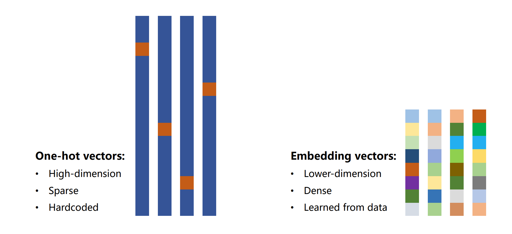

比如根据上一个我们做的输入的维度是4，那么我们想将其变为一个5维度的，怎么处理？

构造这样的一个矩阵：

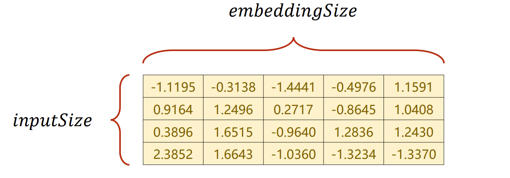

假如说输入是2（即第3个分类），那么直接输出第3行：就是输入经过升维得到的结果：

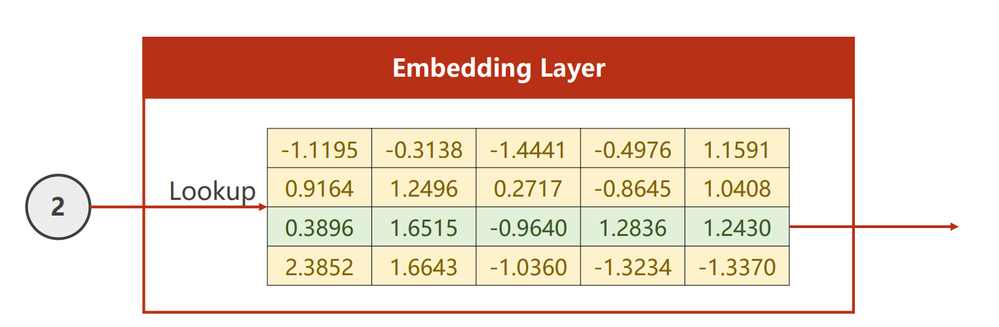

那这一部分该怎么求导处理呢？

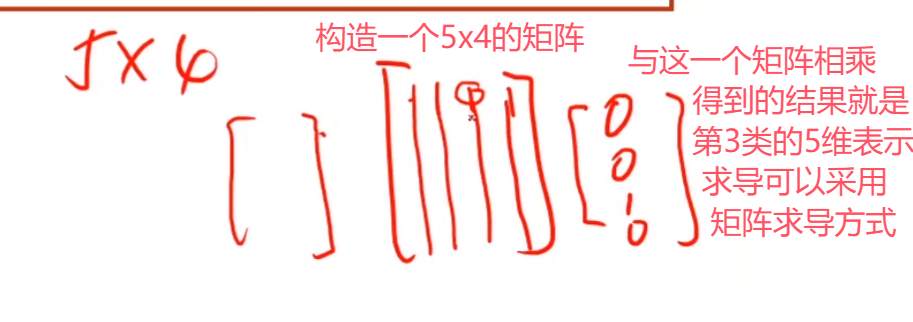

我们可以将嵌入层应用在RNN中：
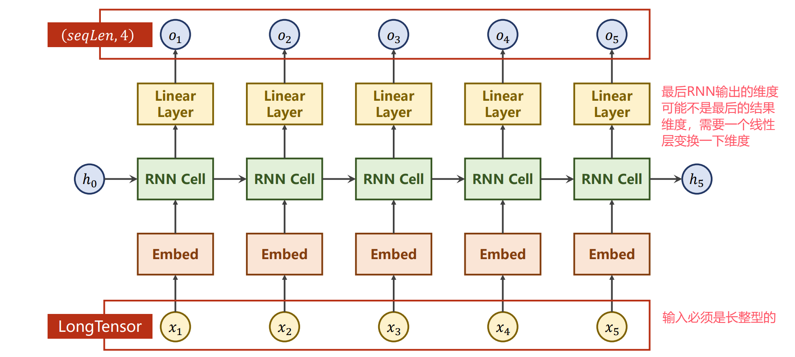

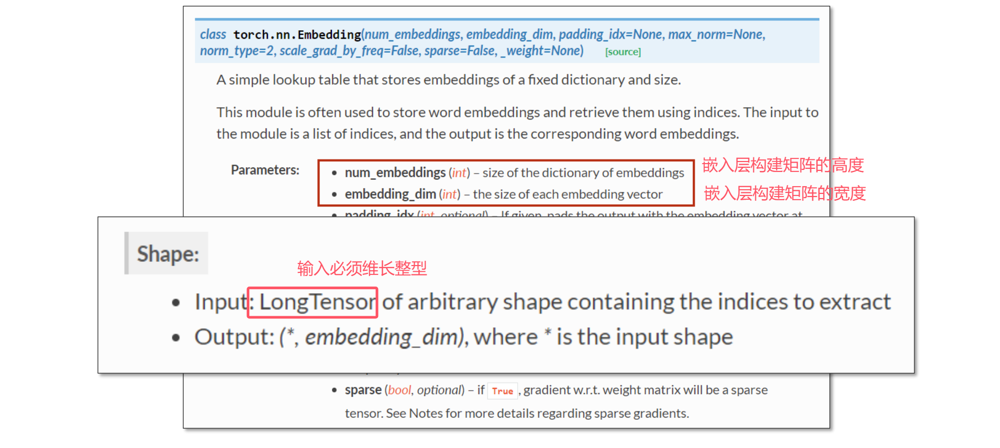

补充：加入输入的尺寸为（seq_len, batch_size），经过嵌入层之后输出的尺寸为（seq_len, batch_size， embedding_dim）


# 完成基础篇之后的学习路线

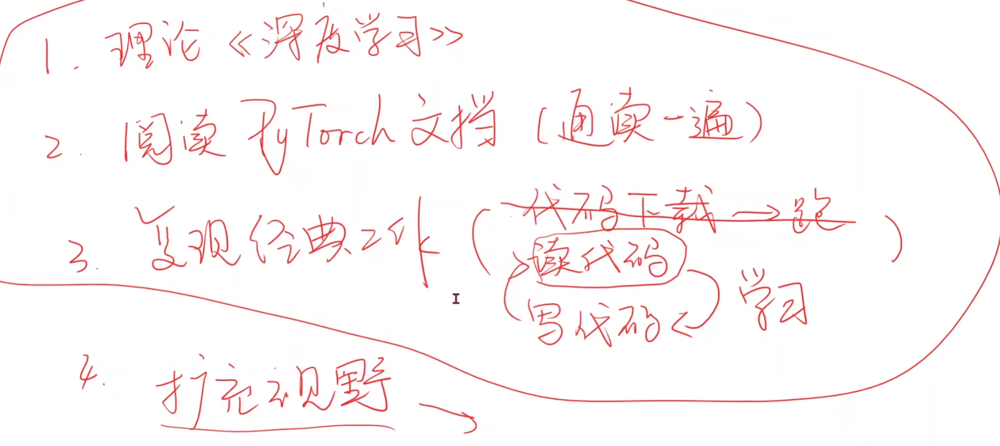


# 课程练习作业

## 作业一

[作业一](##绘制3D图 )

## 作业二

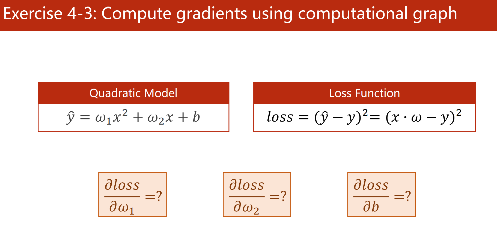

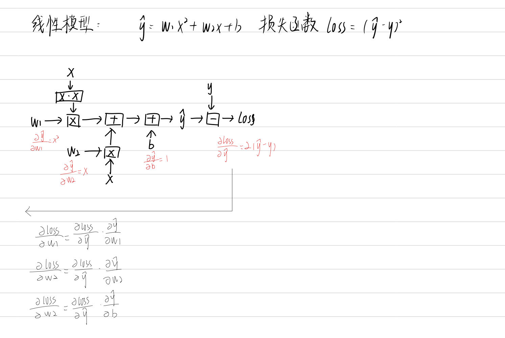


实现这个线性模型的代码如下：

```python
#!/usr/bin/env python
# -*- coding: UTF-8 -*-
'''
@File      ：back_propagation2.py
@IDE       ：PyCharm 
@Author    ：lml
@Date      ：2024/9/24 17:12 
@Descriable：这个文件是设计实现线性模型y = w1 * x * x + w2 * x + b的计算梯度的
'''
import torch
x_data = [1.0, 2.0, 3.0]
y_data = [2.0, 4.0, 6.0]

w1, w2, b = torch.Tensor([1.0, 1.0, 1.0])
w1.requires_grad = True
w2.requires_grad = True
b.requires_grad = True

def forward(x):
    return w1 * x * x + w2 * x + b

def loss(x, y):
    y_pred = forward(x)
    return (y_pred - y) ** 2

print("predict (before training)", 4, forward(4).item())

for epoch in range(100):
    for x, y in zip(x_data, y_data):
        l = loss(x, y)
        l.backward()
        print('\tgrad:', x, y, w1.grad.item(), w2.grad.item(), b.grad.item())
        w1.data = w1.data - 0.01 * w1.grad.data
        w2.data = w2.data - 0.01 * w2.grad.data
        b.data = b.data - 0.01 * b.grad.data
        w1.grad.data.zero_()
        w2.grad.data.zero_()
        b.grad.data.zero_()
    print("progress:", epoch, l.item())

print("predict (after training)", 4, forward(4).item())
```

运行结果如下：

```python
predict (before training) 4 21.0
	grad: 1.0 2.0 2.0 2.0 2.0
	grad: 2.0 4.0 22.880001068115234 11.440000534057617 5.720000267028809
	grad: 3.0 6.0 77.04720306396484 25.682401657104492 8.560800552368164
……
progress: 90 0.006557191256433725
	grad: 1.0 2.0 0.3143033981323242 0.3143033981323242 0.3143033981323242
	grad: 2.0 4.0 -1.7493095397949219 -0.8746547698974609 -0.43732738494873047
	grad: 3.0 6.0 1.4542293548583984 0.4847431182861328 0.16158103942871094
progress: 91 0.0065271081402897835
	grad: 1.0 2.0 0.31465959548950195 0.31465959548950195 0.31465959548950195
	grad: 2.0 4.0 -1.7466468811035156 -0.8733234405517578 -0.4366617202758789
	grad: 3.0 6.0 1.450993537902832 0.48366451263427734 0.16122150421142578
progress: 92 0.0064980932511389256
	grad: 1.0 2.0 0.31499528884887695 0.31499528884887695 0.31499528884887695
	grad: 2.0 4.0 -1.7440528869628906 -0.8720264434814453 -0.43601322174072266
	grad: 3.0 6.0 1.4478435516357422 0.48261451721191406 0.1608715057373047
progress: 93 0.0064699104987084866
	grad: 1.0 2.0 0.3153114318847656 0.3153114318847656 0.3153114318847656
	grad: 2.0 4.0 -1.7415218353271484 -0.8707609176635742 -0.4353804588317871
	grad: 3.0 6.0 1.4447965621948242 0.4815988540649414 0.16053295135498047
progress: 94 0.006442707031965256
	grad: 1.0 2.0 0.31560707092285156 0.31560707092285156 0.31560707092285156
	grad: 2.0 4.0 -1.7390556335449219 -0.8695278167724609 -0.43476390838623047
	grad: 3.0 6.0 1.4418096542358398 0.4806032180786133 0.1602010726928711
progress: 95 0.00641609588637948
	grad: 1.0 2.0 0.3158855438232422 0.3158855438232422 0.3158855438232422
	grad: 2.0 4.0 -1.7366409301757812 -0.8683204650878906 -0.4341602325439453
	grad: 3.0 6.0 1.4389514923095703 0.47965049743652344 0.1598834991455078
progress: 96 0.006390683352947235
	grad: 1.0 2.0 0.3161449432373047 0.3161449432373047 0.3161449432373047
	grad: 2.0 4.0 -1.7342910766601562 -0.8671455383300781 -0.43357276916503906
	grad: 3.0 6.0 1.4361276626586914 0.47870922088623047 0.15956974029541016
progress: 97 0.006365625653415918
	grad: 1.0 2.0 0.3163886070251465 0.3163886070251465 0.3163886070251465
	grad: 2.0 4.0 -1.7319869995117188 -0.8659934997558594 -0.4329967498779297
	grad: 3.0 6.0 1.4334239959716797 0.47780799865722656 0.1592693328857422
progress: 98 0.0063416799530386925
	grad: 1.0 2.0 0.31661510467529297 0.31661510467529297 0.31661510467529297
	grad: 2.0 4.0 -1.7297420501708984 -0.8648710250854492 -0.4324355125427246
	grad: 3.0 6.0 1.4307546615600586 0.47691822052001953 0.15897274017333984
progress: 99 0.00631808303296566
predict (after training) 4 8.544172286987305
```

模型训练100次后可以看到当x=4时，y=8.5，与正确值8相差比较大。原因可能是数据集本身是一次函数的数据，模型是二次函数。所以模型本身就不适合这个数据集，所以才导致预测结果和正确值相差比较大的情况。

## 作业三


数据集：https://www.kaggle.com/c/titanic/data

这是我第一版代码：

```python
# 对数据集进行预处理
def Pre_dataprocess1(xy):
    # 填充数据集中Age这一列的空值,计算平均值进行填充
    xy['Age'] = xy['Age'].fillna(xy['Age'].mean())
    # 删除Name、Ticket和Cabin这三列数据，因为我认为这三列影响不大
    columns_to_delete = ['Name', 'Ticket', 'Cabin']
    xy = xy.drop(columns=columns_to_delete)
    # 将Sex和Embarked这两列的数据
    # Sex的Mapping：
    mapping_sex ={
        'male': 0,
        'female': 1
    }
    # Embarked的Mapping：
    mapping_embarked = {
        'C': 0,
        'Q': 1,
        'S': 2
    }
    xy['Sex'] = xy['Sex'].map(mapping_sex)
    xy['Embarked'] = xy['Embarked'].map(mapping_embarked)
    # 注意都是血的教训：删除最后一列Embarked的空值，其实在刚开始就应该统计所有的空值
    xy = xy.dropna()
    return xy.to_numpy()

class TitanicDataset(Dataset):
    def __init__(self, filepath):
        # xy = np.genfromtxt(filepath, delimiter=',', dtype=None, encoding='utf-8', missing_values='', filling_values=np.nan)
        xy = pd.read_csv(filepath)
        # 对读取到的原数组进行预处理
        xy = Pre_dataprocess1(xy)

        self.len = xy.shape[0]
        self.x_data = torch.from_numpy(xy[:, 2:]).float()
        self.y_data = torch.from_numpy(xy[:, [1]]).float()

    def __getitem__(self, index):
        return self.x_data[index], self.y_data[index]

    def __len__(self):
        return self.len

class TitanicDataset_Test(Dataset):
    def __init__(self, filepath1, filepath2):
        xy = pd.read_csv(filepath1)
        labels = pd.read_csv(filepath2).to_numpy()
        # 对读取到的原数组进行预处理
        xy = Pre_dataprocess1(xy)

        self.len = xy.shape[0]
        self.x_data = torch.from_numpy(xy[:, 1:]).float()
        self.y_data = torch.from_numpy(labels[:, [-1]]).float()

    def __getitem__(self, index):
        return self.x_data[index], self.y_data[index]

    def __len__(self):
        return self.len

class Model(torch.nn.Module):
    def __init__(self):
        super(Model, self).__init__()
        self.l1 = torch.nn.Linear(7, 5)
        self.l2 = torch.nn.Linear(5, 3)
        self.l3 = torch.nn.Linear(3, 1)
        self.sigmoid = torch.nn.Sigmoid()
        self.relu = torch.nn.ReLU()

    def forward(self, x):
        # 这是第一次做，发现准确率只有60%左右，可见Figure_1.png
        # x = self.relu(self.l1(x))
        # x = self.relu(self.l2(x))
        # x = self.sigmoid(self.l3(x))
        x = self.sigmoid(self.l1(x))
        x = self.sigmoid(self.l2(x))
        x = self.sigmoid(self.l3(x))
        return x

batch_size = 32
train_dataset = TitanicDataset('./dataset/train.csv')
test_dataset = TitanicDataset_Test('./dataset/test.csv',
                                   './dataset/gender_submission.csv')
train_loader = DataLoader(dataset=train_dataset,
                          batch_size=batch_size,
                          shuffle=True,
                          num_workers=2
                          )
test_loader = DataLoader(dataset=test_dataset,
                         batch_size=batch_size,
                         shuffle=False
                         )

model = Model()
device = torch.device("cuda:0" if torch.cuda.is_available() else "cpu")
model.to(device)

criterion = torch.nn.BCELoss(size_average=True)
optimizer = torch.optim.SGD(model.parameters(), lr = 0.01)

def train(epoch):
    running_loss = 0.0
    for i, data in enumerate(train_loader, 0):
        inputs, labels = data
        inputs, labels = inputs.to(device), labels.to(device)
        # 检查inputs是否含有NaN值
        # print("inputs contains NaN:", torch.isnan(inputs).any())
        y_pred = model(inputs)
        # print('y_pred:', y_pred, '\nlabels:', labels)
        loss = criterion(y_pred, labels)
        print(epoch, i, loss.item())

        optimizer.zero_grad()
        loss.backward()

        optimizer.step()

        running_loss += loss.item()

        if i % 300 == 299: # 设置每300轮打印一下损失
            print('[%d, %5d] loss: %.3f' % (epoch + 1, i + 1, running_loss / 300))
            running_loss = 0.0
def test():
    # 测试
    print("开始测试……")
    correct = 0
    total = 0
    # 批次
    batch = 0
    with torch.no_grad():
        for data in test_loader:
            inputs, labels = data
            inputs, labels = inputs.to(device), labels.to(device)
            outputs = model(inputs)
            outputs = (outputs > 0.5).float()
            total += labels.size(0)

            # print(f"第{batch}个批次\nlabels:{labels}\noutputs:{outputs}")
            batch += 1
            correct += (outputs == labels).sum().item()
        print('Accuracy on test set: %d %%' % (100 * correct / total))
    return 100 * correct / total

if __name__ == '__main__':
    accuracy_list = []
    epoch_list = []
    for epoch in range(10):
        epoch_list.append(epoch + 1)
        train(epoch)
        accuracy_list.append(test())
    plt.plot(epoch_list, accuracy_list)
    plt.ylabel('Accuracy')
    plt.xlabel('Epoch')
    plt.show()
```

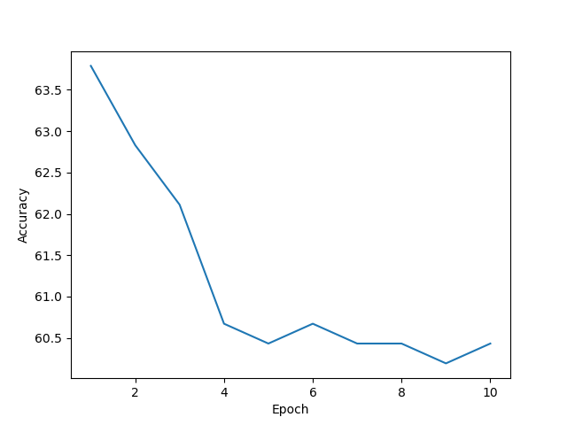

最终模型的表现很差，我现在在想原因。

查看模型在验证集上的预测值都归为0，每次训练得到的结果基本为63%。

**问题1**

```python
train_loader = DataLoader(dataset=train_dataset,
                          batch_size=batch_size,
                          shuffle=True,
                          num_workers=2 
                          )
```

在这里`num_workers`是什么意思？

在这里我将值设置为2，训练的时候模型很慢，但是如果设置为0，模型训练的时候跑的很快

在PyTorch的`DataLoader`中，`num_workers`参数用于指定数据加载时使用的子进程数量。这些子进程负责从磁盘读取数据、对数据进行预处理（如图像的缩放、裁剪等）以及将数据传递给主进程。增加`num_workers`的数量可以并行地执行这些任务，从而理论上可以加快数据加载速度，使得训练过程更加高效。

然而，在实际使用中，`num_workers`的设置需要根据你的硬件配置和具体应用场景来调整。以下是一些可能影响性能的因素：

1. **硬件限制**：如果你的计算机有多个CPU核心，那么增加`num_workers`可以提高数据加载的速度。但是，如果`num_workers`设置得过高，可能会导致系统资源（如内存和CPU）的竞争加剧，反而降低效率。

2. **I/O瓶颈**：如果磁盘读写速度较慢或者网络带宽有限（例如，当你从网络上下载数据集时），增加`num_workers`可能不会带来显著的速度提升，甚至会因为增加了I/O请求而变慢。

3. **数据预处理复杂度**：如果数据预处理非常耗时（比如复杂的图像变换），增加`num_workers`可以帮助加速这个过程。但如果预处理很简单，增加`num_workers`带来的好处就相对较小。

4. **操作系统和Python环境**：某些操作系统或Python版本在多线程或多进程中可能存在性能问题。例如，GIL（全局解释器锁）在CPython中可能会影响多线程的效率。

5. **模型训练速度**：如果模型本身的前向传播和反向传播非常快，而数据加载相对较慢，这时增加`num_workers`可以帮助平衡两者的速度。反之，如果模型计算本身就很慢，增加`num_workers`可能不会有太大帮助。

在例子中，当`num_workers=2`时，模型训练很慢；但当`num_workers=0`时，训练速度却很快。这可能是由于以下几个原因造成的：

- 你的机器可能只有一个或少数几个CPU核心，增加`num_workers`并不能有效利用额外的计算资源。
- 你的数据预处理可能非常简单，不需要额外的工作进程来加速。
- 数据集可能存储在高速SSD上，单个进程已经足够快速地读取数据。
- 可能存在一些特定于你环境的问题，比如Python GIL的影响或者其他软件层面的瓶颈。

为了找到最优的`num_workers`值，你可以尝试不同的设置，并观察哪个值能够提供最佳的数据加载与模型训练之间的平衡。通常建议从0开始逐步增加，直到发现性能不再提升为止。同时，确保你的代码没有其他潜在的瓶颈，比如过大的批量大小或过于复杂的模型结构，这些都可能导致训练缓慢。

**问题2**

采用随机梯度下降优化器的时候：batch_size设置为32的时候，预测值都小于0.5，只有batch_size等于1的时候，模型的准确率才能达到最高。1的时候最高，2的时候降低，3的时候继续降低，从4开始所有的预测值都小于0.5了。

采用Adam优化器，模型在测试集上的准确率随着batch_size变大而变大，并且准确率比采用随机梯度下降作为优化器的时候高很多。

**为什么会这样？---->玄学~玄学**

修改完的代码：

```python
#!/usr/bin/env python
# -*- coding: UTF-8 -*-
'''
@File      ：Titanic_Classifier_2.py
@IDE       ：PyCharm 
@Author    ：lml
@Date      ：2024/10/22 21:05 
@Descriable：
'''
import numpy as np
import pandas as pd
import torch
from matplotlib import pyplot as plt
from torch.utils.data import Dataset
from torch.utils.data import DataLoader

# 准备数据集
class TitanicDataset(Dataset):
    def __init__(self, filepath):
        xy = pd.read_csv(filepath)
        self.len = xy.shape[0]

        # 选取相关的数据特征
        feature = ["Pclass", "Sex", "SibSp", "Parch", "Fare"]

        self.x_data = torch.from_numpy(np.array(pd.get_dummies(xy[feature]), dtype=np.float32))
        self.y_data = torch.from_numpy(np.array(xy['Survived'])).float()

    def __getitem__(self, index):
        return self.x_data[index], self.y_data[index]

    def __len__(self):
        return self.len

class Model(torch.nn.Module):
    def __init__(self):
        super(Model, self).__init__()
        self.l1 = torch.nn.Linear(6, 64)
        # self.bn1 = torch.nn.BatchNorm1d(3)
        self.l2 = torch.nn.Linear(64, 32)
        self.l3 = torch.nn.Linear(32, 1)
        # self.bn2 = torch.nn.BatchNorm1d(1)
        self.sigmoid = torch.nn.Sigmoid()
        self.relu = torch.nn.ReLU()
    def forward(self, x):
        x = self.relu(self.l1(x))
        x = self.relu(self.l2(x))
        x = self.sigmoid(self.l3(x))
        return x

batch_size = 32
train_dataset = TitanicDataset('./dataset/train.csv')
train_loader = DataLoader(dataset=train_dataset,
                          batch_size=batch_size,
                          shuffle=True,
                          num_workers=0
                          )

model = Model()

criterion = torch.nn.BCELoss(reduction='mean')
optimizer = torch.optim.Adam(model.parameters(), lr = 0.001)

def train(epoch):
    for i, data in enumerate(train_loader, 0):
        inputs, labels = data

        y_pred = model(inputs)
        # 输出的y_pred是[32, 1]类型的与label的[32]冲突
        y_pred = y_pred.squeeze(-1)

        loss = criterion(y_pred, labels)
        print(epoch, i, loss.item())

        optimizer.zero_grad()
        loss.backward()

        optimizer.step()

def test(x):
    with torch.no_grad():
        y = model(x)
        t = (y > 0.5).float()
        ans = []
        for i in y:
            if i > 0.5:
                ans.append(1)
            else:
                ans.append(0)
        # print(f"y的值为{y}\nans的值为{ans}\nt的值为{t}")
        return ans


if __name__ == '__main__':
    for epoch in range(100):
        train(epoch)

    # 测试
    test_data = pd.read_csv('./dataset/test.csv')
    feature = ["Pclass", "Sex", "SibSp", "Parch", "Fare"]
    output = torch.from_numpy(np.array(pd.get_dummies(test_data[feature]), dtype=np.float32))
    y_pred = pd.DataFrame({"Survived" : test(output)})
    labels = pd.read_csv('./dataset/gender_submission.csv')
    print(f"y_pred为：{y_pred}\nlabels为：{labels}")
    similarity = labels['Survived'] == y_pred['Survived']

    # 统计相似的条目数
    similar_count = similarity.sum()
    total_count = len(similarity)

    # 输出相似度
    similarity_ratio = similar_count / total_count
    print(f'Similarity: {similarity_ratio:.2%}')
```


## 作业四

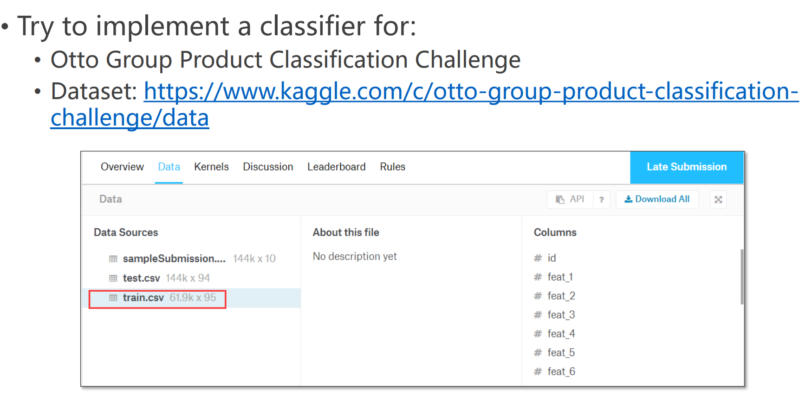

## 作业五

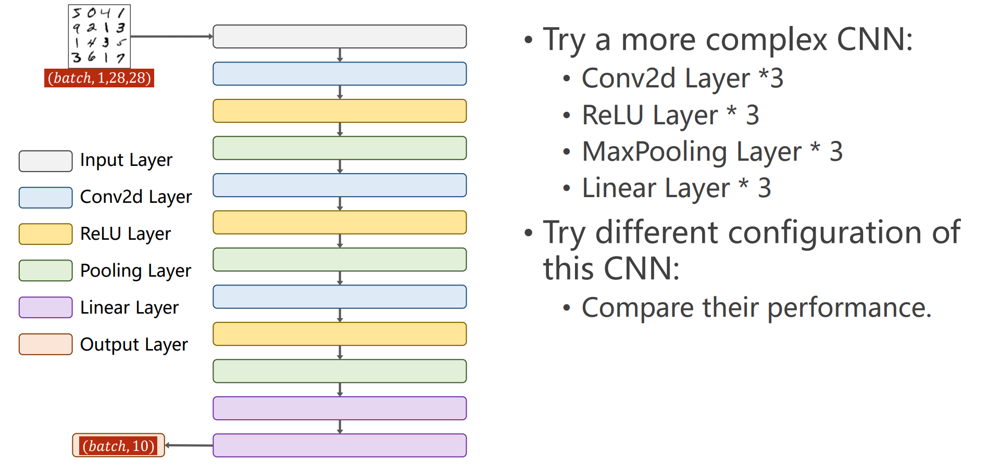

修改模型：

```python
'''
卷积过程：
padding = 1, kernel_size = 3
输入：1x28x28
第一个卷积层 conv1：
kernel_size=3, padding=1
输出形状：(batch_size, 10, 28, 28)
第一个池化层 pooling：
kernel_size=2, stride=2
输出形状：(batch_size, 10, 14, 14)
第二个卷积层 conv2：
kernel_size=3, padding=1
输出形状：(batch_size, 20, 14, 14)
第二个池化层 pooling：
kernel_size=2, stride=2
输出形状：(batch_size, 20, 7, 7)
第三个卷积层 conv3：
kernel_size=3, padding=1
输出形状：(batch_size, 30, 7, 7)
第三个池化层 pooling：
kernel_size=2, stride=2
输出形状：(batch_size, 30, 3, 3)
'''
class Net(torch.nn.Module):
    def __init__(self):
        super(Net, self).__init__()
        self.conv1 = torch.nn.Conv2d(1, 10, kernel_size=3, padding=1) # 10 x 24 x 24
        self.conv2 = torch.nn.Conv2d(10, 20, kernel_size=3, padding=1) #
        self.conv3 = torch.nn.Conv2d(20, 30, kernel_size=3, padding=1)
        self.pooling = torch.nn.MaxPool2d(2)
        self.fc1 = torch.nn.Linear(270, 130)
        self.fc2 = torch.nn.Linear(130, 60)
        self.fc3 = torch.nn.Linear(60, 10)
    def forward(self, x):
        batch_size = x.size(0)
        x = F.relu(self.pooling(self.conv1(x)))
        x = F.relu(self.pooling(self.conv2(x)))
        x = F.relu(self.pooling(self.conv3(x)))
        x = x.view(batch_size, -1) # flatten
        x = self.fc1(x)
        x = self.fc2(x)
        x = self.fc3(x)
        return x
```

总体训练效果和没有加大网络复杂度的时候差距不大

```python
[1,   300] loss: 1.588
[1,   600] loss: 0.299
[1,   900] loss: 0.181
Accuracy on test set: 95 %
[2,   300] loss: 0.125
[2,   600] loss: 0.120
[2,   900] loss: 0.111
Accuracy on test set: 97 %
[3,   300] loss: 0.092
[3,   600] loss: 0.084
[3,   900] loss: 0.082
Accuracy on test set: 97 %
[4,   300] loss: 0.068
[4,   600] loss: 0.072
[4,   900] loss: 0.067
Accuracy on test set: 98 %
[5,   300] loss: 0.056
[5,   600] loss: 0.062
[5,   900] loss: 0.056
Accuracy on test set: 98 %
[6,   300] loss: 0.051
[6,   600] loss: 0.052
[6,   900] loss: 0.050
Accuracy on test set: 98 %
[7,   300] loss: 0.044
[7,   600] loss: 0.051
[7,   900] loss: 0.046
Accuracy on test set: 98 %
[8,   300] loss: 0.044
[8,   600] loss: 0.041
[8,   900] loss: 0.040
Accuracy on test set: 98 %
[9,   300] loss: 0.037
[9,   600] loss: 0.038
[9,   900] loss: 0.038
Accuracy on test set: 98 %
[10,   300] loss: 0.034
[10,   600] loss: 0.036
[10,   900] loss: 0.033
Accuracy on test set: 98 %
```

# Pytorch为什么输入是小批量的数据？

1. **硬件加速**：现代深度学习通常依赖于 GPU 进行并行计算。将多个样本打包成一个小批量可以让 GPU 更高效地利用其并行计算能力，从而加快训练速度。
2. **统计效应**：使用小批量而不是单个样本来更新权重，可以帮助减少噪声的影响，使得梯度估计更加准确和平滑。这有助于优化过程更加稳定，避免剧烈波动。
3. **内存效率**：通过一次性处理多个样本，我们可以更好地利用内存带宽，因为加载数据到GPU上的开销相对较大。如果每次只处理一个样本，那么频繁的数据传输会成为瓶颈。
4. **泛化性能**：小批量训练还可以帮助模型有更好的泛化能力，因为它相当于对损失函数进行了一定程度的平滑，减少了过拟合的风险。

# Pytorch中损失函数构建计算图是什么意思？

在PyTorch中，构建计算图的过程就是跟踪和记录计算步骤，使得可以通过**自动微分**来计算梯度，进而用于模型训练。具体来说，计算图是一个有向无环图（DAG），其中节点表示张量（如输入、输出、中间结果），而边表示张量间的操作（如加法、乘法、激活函数等）。

**在损失函数构建计算图中的作用**：

1. **记录操作链**：当定义损失函数并进行前向传播时，PyTorch会自动记录所有计算操作和相关的张量。
  
2. **自动计算梯度**：在反向传播时，PyTorch根据损失函数的计算图对每一步的操作求导，并自动计算梯度，更新模型参数。
  
3. **反向传播优化**：有了计算图，PyTorch可以从输出反向传播计算每层的梯度，使得优化算法可以使用这些梯度来调整参数，从而最小化损失函数。

在PyTorch中，默认情况下，所有具有 `requires_grad=True` 的张量都会被包含在计算图中。

# Pandas库使用教程

初识Pandas：https://pandas.pydata.org/docs/user_guide/10min.html

查询读取的数据集的数据类型：

```python
print(df.dtypes)

PassengerId      int64
Survived         int64
Pclass           int64
Name            object
Sex             object
Age            float64
SibSp            int64
Parch            int64
Ticket          object
Fare           float64
Cabin           object
Embarked        object
```


# 配置环境

## 关于Cuda与pytorch cnDNN的版本对应问题

[Pytorch、CUDA和cuDNN的安装图文详解win11（解决版本匹配问题）_PyTorch_timerring_InfoQ写作社区](https://xie.infoq.cn/article/0672637b5c38911cac352e26d)

## 查看显卡信息


## 检验pytorch是否可以使用本机显卡

```python
torch.cuda.is_available()
```

## 安装了Pytorch不能使用本机显卡

[pytorch安装及使用GPU失败的解决办法_pytorch用不了gpu-CSDN博客](https://blog.csdn.net/qq_43344096/article/details/134193998)

# Python编辑器

## Pycharm

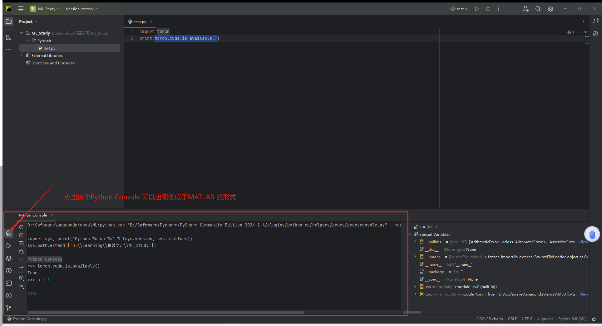

## Jupyter

Jupyter一般以base环境为基础

如果想让Jupyter应用在自定义的环境中，则需要在自定义环境中安装Jupyter。

我们先查阅base中的包：

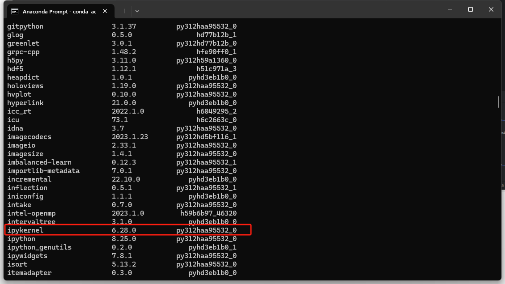

红框里的包就是Jupyter，因此我们需要在自定义环境中安装这个包

```bash
conda install nb_conda
```

或者

```python
conda install nb_conda_kernels
```

执行这条

```python
jupyter notebook
```

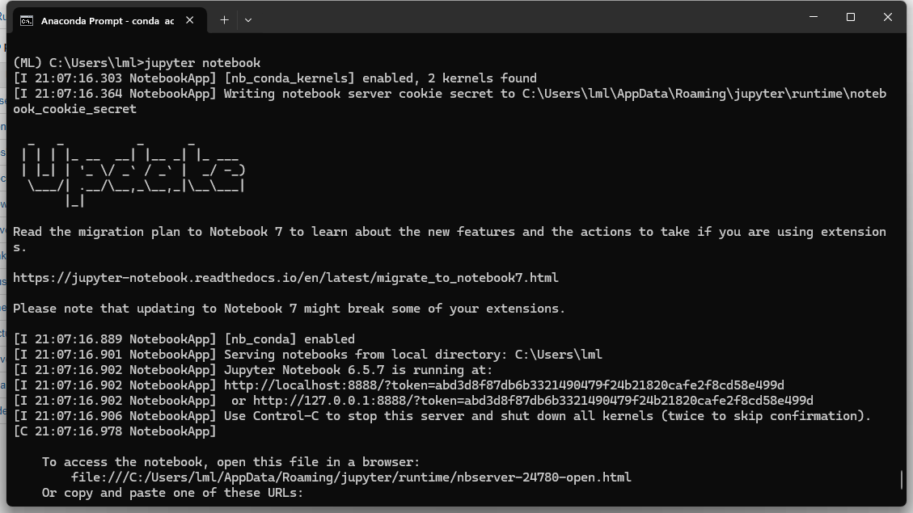


新建文件：

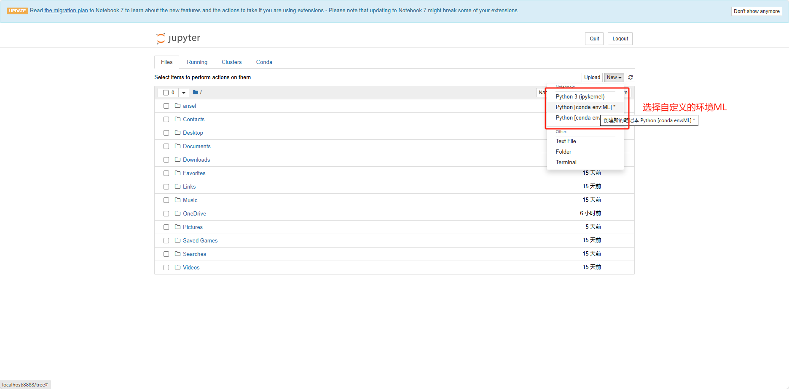

# anaconda使用

conda一系列的指令：[【anaconda】conda创建、查看、删除虚拟环境（anaconda命令集）_conda 创建环境-CSDN博客](https://blog.csdn.net/miracleoa/article/details/106115730)

# 有力的工具

## 矩阵计算

[Online](http://faculty.bicmr.pku.edu.cn/~wenzw/bigdata/matrix-cook-book.pdf)

## matplotlib绘制3D图

https://matplotlib.org/stable/users/explain/toolkits/mplot3d.html

## 绘制图表visdom

https://github.com/fossasia/visdom

## Pycharm

* 鼠标光标移动到函数中间的时候按住`Ctrl`+`P`可以查看参数

### 添加文件头部注释

[Pycharm创建文件时自动生成文件头注释（自定义设置作者、日期等信息）_pytharm 文件首作者介绍-CSDN博客](https://blog.csdn.net/qq_45069279/article/details/107795634)

## Python的小工具

```python
dir(包) # 可以展开这个包下面包含哪些包
help(包.函数) # 可以查看这个函数的作用
```


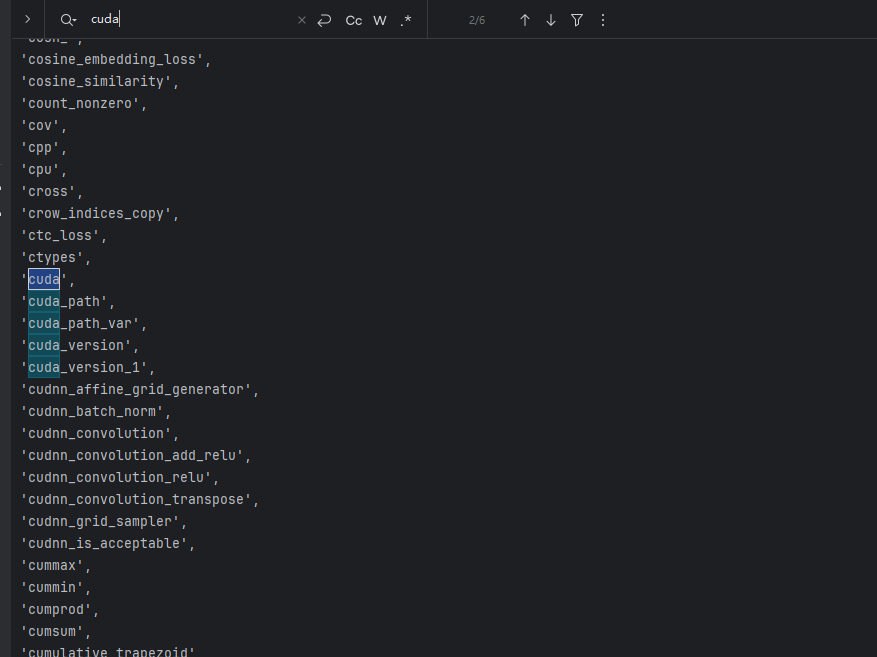


ctrl鼠标左键点击函数会出现某一个函数的详细介绍。


这里面给出了参数、数据格式以及例子。

## 查看包的使用

`__getitem__`一般都是作为一个数据的索引，即data[0]这种

## anaconda使用

### anaconda创建虚拟环境

```bash
conda create -n text python=3.8
```

### anaconda查看所有的虚拟环境

```bash
conda info -e （查看所有的虚拟环境）
activate -name(虚拟环境名字)（进入到该虚拟环境中）
```

### anaconda中添加channels

添加镜像：

```bash
conda config --add channels https://mirrors.tuna.tsinghua.edu.cn/anaconda/pkgs/free/
```

删除镜像：

```bash
conda config --remove channels  https://mirrors.tuna.tsinghua.edu.cn/anaconda/pkgs/free/
```

展示现有的镜像：

```bash
conda config --show channels
```

用上面这个命令，我们也可以看到我们的软件源的优先级，越上面（刚添加的）优先级越高，意思是当两个软件源都有一个相同的包(package)的时候，conda会选择优先级更高的软件源，并从中下载安装你所要的包。

在输入下载命令后，conda会为我们选择一个源，并从中下载我们要的那个包。这个源可能是我们添加中的某一个，也可能系统默认的那些。我们希望在下载的时候，conda告诉我们当前下载是在用哪一个。

```bash
conda config --set show_channel_urls yes
```

# pytorch使用

## torch.Tensor和torch.LongTensor的区别

在PyTorch中，`torch.Tensor` 和 `torch.LongTensor` 是两种不同类型的张量，它们主要用于存储不同类型的数据。了解这两种张量的区别对于正确地处理数据和避免运行时错误非常重要。

### `torch.Tensor`

`torch.Tensor` 是一个通用的张量类，它可以用来存储任何数值类型的数据。默认情况下，`torch.Tensor` 存储的是浮点数（floats），通常是 `torch.float32` 类型的数据。这意味着它适合用来表示需要进行数学运算的数据，例如在神经网络中常见的权重矩阵、输入数据等。

#### 创建 `torch.Tensor`：
```python
import torch

# 创建一个包含浮点数的张量
tensor_float = torch.tensor([1.0, 2.0, 3.0])
print(tensor_float)  # 输出: tensor([1., 2., 3.])

# 创建一个包含整数的张量，但会被转换成浮点数
tensor_int_as_float = torch.tensor([1, 2, 3])
print(tensor_int_as_float)  # 输出: tensor([1., 2., 3.])
```

### `torch.LongTensor`

`torch.LongTensor` 是一个专门用于存储长整型（long integers）数据的张量类。它主要用于存储索引、标签等整数值。在深度学习中，它经常用来表示类标签或索引。

#### 创建 `torch.LongTensor`：
```python
# 创建一个包含长整型数据的张量
tensor_long = torch.LongTensor([1, 2, 3])
print(tensor_long)  # 输出: tensor([1, 2, 3])
```

### 区别总结

1. **数据类型**：
   - `torch.Tensor` 默认存储浮点数（`float32`）。
   - `torch.LongTensor` 存储长整型数据（`int64`）。

2. **用途**：
   - `torch.Tensor` 适合用于存储需要进行数学运算的数据，如权重、输入等。
   - `torch.LongTensor` 适合用于存储索引或标签等不需要进行浮点数运算的数据。

3. **兼容性**：
   - 大多数PyTorch的操作默认支持 `torch.Tensor` 类型。
   - 对于某些操作，如索引或类标签，通常需要使用 `torch.LongTensor`。

### 实际应用中的注意事项

- 当你需要将一个张量用作索引时，通常需要将其转换为 `LongTensor`。
- 在进行数学运算时，使用 `Tensor`（默认为 `FloatTensor`）可以确保数据类型的一致性。
- 在传递张量给某些函数时，确保传递的数据类型符合函数的要求，否则可能会导致运行时错误。

### 示例转换

如果需要在两者之间转换，可以使用 `.to(dtype)` 方法：

```python
# 将 float 张量转换为 long 张量
float_tensor = torch.tensor([1.0, 2.0, 3.0])
long_tensor = float_tensor.to(torch.int64)
print(long_tensor)  # 输出: tensor([1, 2, 3])

# 将 long 张量转换为 float 张量
long_tensor = torch.tensor([1, 2, 3], dtype=torch.int64)
float_tensor = long_tensor.to(torch.float32)
print(float_tensor)  # 输出: tensor([1., 2., 3.])
```

通过上述说明，你应该能够更好地理解和区分 `torch.Tensor` 和 `torch.LongTensor` 的使用场合及其转换方法。

## 下载常用数据集

```python
# torchvision中有一个datasets包里包含一个MNIST数据集，root就是数据集位置，train表示是否是数据集，download表示是否下载
# 如果初次使用就需要下载。
train_set = torchvision.datasets.MNIST(root= './datasets/mnist', train=True, download=True)
test_set = torchvision.datasets.MNIST(root='./datasets/mnist', train=False, download=True)

# CIFAR10数据集
train_set = torchvision.datasets.CIFAR10(root= './datasets/cifar10', train=True, download=True)
test_set = torchvision.datasets.CIFAR10(root='./datasets/cifar10', train=False, download=True)
```


## 加载数据

1. **torch.utils.data.dataset**这样的抽象类可以用来创建数据集。学过面向对象的应该清楚，**抽象类不能实例化**，因此我们需要构造这个抽象类的**子类**来创建数据集，并且我们还可以定义自己的继承和重写方法。
2. 这其中最重要的就是`__len__`len和`__getitem__`这两个函数，前者给出**数据集的大小**，后者是用于查找**数据和标签**。

```python
import os.path

from torch.utils.data import Dataset
from PIL import Image


class MyDate(Dataset):
# 继承Dataset类需要
    def __init__(self, root_dir, label_dir):
        self.root_dir = root_dir
        self.label_dir = label_dir
        self.path = os.path.join(self.root_dir, self.label_dir)
        self.img_path = os.listdir(self.path)

    def __getitem__(self, idx): # idx 为传入的下表
        img_name = self.img_path[idx]
        img_item_path = os.path.join(self.root_dir ,self.label_dir, img_name)
        img = Image.open(img_item_path)
        label = self.label_dir
        return img, label

    def __len__(self):
        return len(self.img_path)

root_dir = "./dataset1/train"
ants_dir = "ants_image"
bees_dir = "bees_image"
ants_dataset = MyDate(root_dir, ants_dir)
bees_dataset = MyDate(root_dir, bees_dir)

train_dataset = ants_dataset + bees_dataset

img, label = bees_dataset[1]
# img.show()
print(len(ants_dataset))
print(len(bees_dataset))
print(len(train_dataset))
```

需要注意的一个点：

以这种方式引入Datase

```python
import torch.utils.data.dataset as Dataset
```

在创建子类的时候需要这样设置：

```python
class MyDate(Dataset.Dataset):
```

如果是这样引入：

```python
from torch.utils.data import Dataset
```

则在创建子类的时候就可以：

```python
class MyDate(Dataset):
```


**torch.utils.data.DataLoader**是一个迭代器，方便我们去**多线程**地读取数据，并且可以实现**batch**以及**shuffle**的读取等。

创建DataLoader，batch_size设置为2，shuffle=False不打乱数据顺序，num_workers= 4使用4个子进程：

```python
#创建DataLoader迭代器
dataloader = DataLoader.DataLoader(dataset,batch_size= 2, shuffle = False, num_workers= 4)
```

使用enumerate访问可遍历的数组对象：

```python
for step, (data, label) in enumerate(dataloader):
    print('step is :', step)
    # data, label = item
    print('data is {}, label is {}'.format(data, label))
```

或者

```python
    for i, item in enumerate(dataloader):
        print('i:', i)
        data, label = item
        print('data:', data)
        print('label:', label)
```

## Tensorboard

可以使用tensorboard绘制这样的数据图
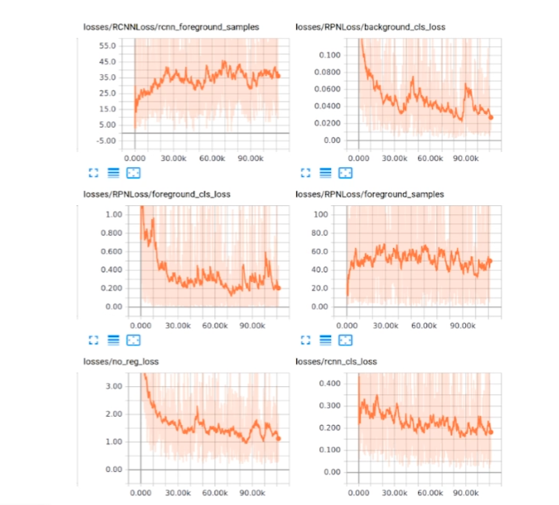

```python
from torch.utils.tensorboard import SummaryWriter

writer = SummaryWriter("logs")
for i in range(100):
    writer.add_scalar("y = x", i, i) # 第一个是图像的标题，第二个是y轴，第三个是x轴 这里的标题对应事件log，如果只是修改x和y，不修改标题，那么就相当于在原来的图像上再做一个新的。可以重新生成新的

writer.close()
```

然后**终端进入到包含logs的文件夹下**，运行

```bash
tensorboard --logdir=logs (--port=6007)设置端口，默认为6006
```

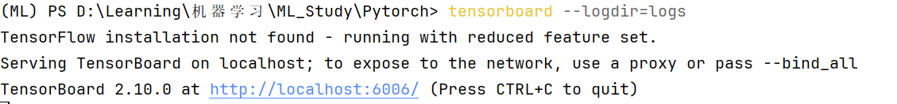


writer.add_image()


**注意**：使用PIL读取图像得到的数据类型是`<class 'PIL.JpegImagePlugin.JpegImageFile'>`，并不是我们使用writer.add_image()，**对于图像想要读取成np形式，可以采用OpenCV**。

```python
img_array = np.array(img)
writer.add_image("test", img_array, 1)
```

会出现这样的问题：

```python
    raise TypeError("Cannot handle this data type: %s, %s" % typekey) from e
TypeError: Cannot handle this data type: (1, 1, 512), |u1
```

问题出在哪儿呢？

在add_image函数中对于第二个参数shape类型得是（3，H，W）形式的。这里我们看一下img_array的shape：

```python
(512, 768, 3)
```

所以我们可以使用dataformats调整：

```python
writer.add_image("test", img_array, 1, dataformats="HWC")
```

最终刷新窗口可以得到：


在`img_path`里我更换了一张图片，并且在add_image中将step设置为2：

```python
writer.add_image("test", img_array, 2, dataformats="HWC")
```


或者我们重新开始一个新的


## Transform

首先我们先来查看Transforms这个文件：


transforms就相当于一个工具箱，可以为图片做一系列处理操作。


### 如何使用Transforms?

我们看到Transforms的文件结构：


以**类`ToTensor`**为例子使用Transforms，这里`ToTensor`是一个类，并且里面有一个`__call__`。__call__魔术方法，把实例好的对象当作方法（函数），直接加括号就可以调用

我们开始使用：

```python
# 1、transforms该如何使用Python？
tensor_trans = transforms.ToTensor() # 可以直接命名一个变量为Transforms的一个类
tensor_img = tensor_trans(img)

print(tensor_img)
```

原来的图片变成了这样：

```python
tensor([[[0.3137, 0.3137, 0.3137,  ..., 0.3176, 0.3098, 0.2980],
         [0.3176, 0.3176, 0.3176,  ..., 0.3176, 0.3098, 0.2980],
         [0.3216, 0.3216, 0.3216,  ..., 0.3137, 0.3098, 0.3020],
         ...,
         [0.3412, 0.3412, 0.3373,  ..., 0.1725, 0.3725, 0.3529],
         [0.3412, 0.3412, 0.3373,  ..., 0.3294, 0.3529, 0.3294],
         [0.3412, 0.3412, 0.3373,  ..., 0.3098, 0.3059, 0.3294]],

        [[0.5922, 0.5922, 0.5922,  ..., 0.5961, 0.5882, 0.5765],
         [0.5961, 0.5961, 0.5961,  ..., 0.5961, 0.5882, 0.5765],
         [0.6000, 0.6000, 0.6000,  ..., 0.5922, 0.5882, 0.5804],
         ...,
         [0.6275, 0.6275, 0.6235,  ..., 0.3608, 0.6196, 0.6157],
         [0.6275, 0.6275, 0.6235,  ..., 0.5765, 0.6275, 0.5961],
         [0.6275, 0.6275, 0.6235,  ..., 0.6275, 0.6235, 0.6314]],

        [[0.9137, 0.9137, 0.9137,  ..., 0.9176, 0.9098, 0.8980],
         [0.9176, 0.9176, 0.9176,  ..., 0.9176, 0.9098, 0.8980],
         [0.9216, 0.9216, 0.9216,  ..., 0.9137, 0.9098, 0.9020],
         ...,
         [0.9294, 0.9294, 0.9255,  ..., 0.5529, 0.9216, 0.8941],
         [0.9294, 0.9294, 0.9255,  ..., 0.8863, 1.0000, 0.9137],
         [0.9294, 0.9294, 0.9255,  ..., 0.9490, 0.9804, 0.9137]]])
```

### Transforms使用逻辑

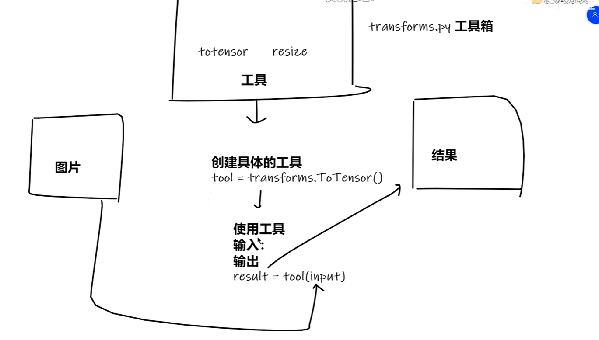


### 为什么要用Tensor数据结构

这是我们使用PIL打开的图像文件：


我们看一下tensor的数据结构：


使用OpenCV读取到的图片一般都是ndarray类型：

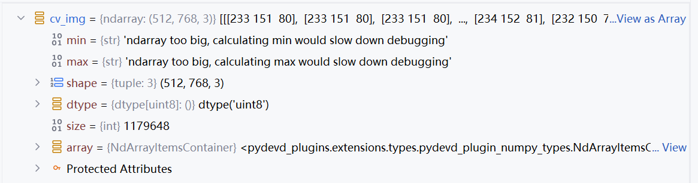

并没有一些机器学习中的参数，所以使用Tensor数据结构可以很好的适应机器学习的任务。

### Transform使用

### `__call__`函数

```python
class Person:

    def __init__(self, name):
        print("__init__" + "hello" + name)

    def __call__(self,name):
        print("__call__" + "hello" + name)

    def hello(self, name):
        print("hello" + name)

person = Person("wangwu")
person("zhangsan") # 在Pycharm中按住ctrl + P ，鼠标光标在person()括号里时可以提升传入什么参数
person.hello("lisi")
```

输出：

```python
__init__hellowangwu
__call__hellozhangsan
hellolisi
```

__魔术方法，把实例好的对象当作方法（函数），直接加括号就可以调用

### Compose

```python
Example:
        >>> transforms.Compose([
        >>>     transforms.CenterCrop(10),
        >>>     transforms.PILToTensor(),
        >>>     transforms.ConvertImageDtype(torch.float),
        >>> ])
```

将Transforms中的操作排列在一起形成一条生产线

### ToTensor

```python
from PIL import Image
from torch.utils.tensorboard import SummaryWriter
from torchvision import transforms

writer = SummaryWriter("logs")
img = Image.open("./images/头像7.jpg")
print(img)

trans_totensor = transforms.ToTensor() # 实例化ToTensor类
img_tensor = trans_totensor(img)
writer.add_image("ToTensor", img_tensor)
writer.close()
```


### Normalize归一化

归一化是为了消除奇异值，及样本数据中与其他数据相比特别大或特别小的数据 这样可以加快训练速度

```py
class Normalize(torch.nn.Module):
    """Normalize a tensor image with mean and standard deviation.
    This transform does not support PIL Image.
    Given mean: ``(mean[1],...,mean[n])`` and std: ``(std[1],..,std[n])`` for ``n``
    channels, this transform will normalize each channel of the input
    ``torch.*Tensor`` i.e.,
    ``output[channel] = (input[channel] - mean[channel]) / std[channel]``

    .. note::
        This transform acts out of place, i.e., it does not mutate the input tensor.

    Args:
        mean (sequence): Sequence of means for each channel.
        std (sequence): Sequence of standard deviations for each channel.
        inplace(bool,optional): Bool to make this operation in-place.

    """
```

可以看出输入n通道的平均值和方差，可以对图片进行归一化处理。

这里归一化的计算公式为：
$$
output[channel] = (input[channel] - mean[channel]) / std[channel]
$$
举例：

```python
# Normalize
print(img_tensor[0][0][0])
trans_norm = transforms.Normalize([0.5, 0.5, 0.5], [0.5, 0.5, 0.5])
img_norm = trans_norm(img_tensor)
print(img_norm[0][0][0])
writer.add_image("Normlize", img_norm)
```

这里对三个通道传入的平均值为`[0.5, 0.5, 0.5]`,方差为`[0.5, 0.5, 0.5]`

对于某一个通道值，根据上面的公式，归一化做的处理就是$2×input - 1$

我们看一下输出：

```python
tensor(0.6039)
tensor(0.2078)
```

对图像进行归一化后的对比：


我们进行如下修改：

```python
trans_norm = transforms.Normalize([0.4, 0.2, 0.1], [0.6, 0.8, 0.9])
```

```python
tensor(0.6039)
tensor(-0.5996)
```


### Resize

修改图像的大小

```python
# Resize
print(img.size)
trans_resize = transforms.Resize((512, 512))
# img PIL -> resize -> img_resize PIL
img_resize_PIL = trans_resize(img)
# img_resize PIL ->resize -> img_resize tensor
img_resize_tensor = trans_totensor(img_resize_PIL)
writer.add_image("Resize", img_resize_tensor, 0)
print(img_resize_tensor.size())
```

输出：

```python
(940, 940)
torch.Size([3, 512, 512])
```

前后对比，对图像进行压缩了

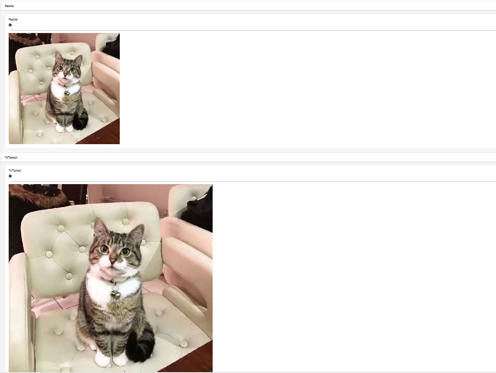

如果只传入一个值，那么就会让h w中小的那个等于传入的值，h w等比例缩放

```python
# Resize 只传入1个值
trans_resize_2 = transforms.Resize(512)
trans_compose = transforms.Compose([trans_resize_2, trans_totensor])
img_resize_2 = trans_compose(img)
print(img_resize_2.size())
writer.add_image("Resize", img_resize_2, 1)
```

输出：

```python
torch.Size([3, 512, 512])
```

### RandomCrop(随机裁剪某一个大小为某参数的图片)


传入的是一个（h,w）那么就按照（h,w）裁剪，如果只传入一个值x，那么就按照（x, x）裁剪

```python
# RandomCrop
trans_random = transforms.RandomCrop(512)
trans_compose_2 = transforms.Compose([trans_random, trans_totensor])
for i in range(10):
    img_crop = trans_compose_2(img)
    writer.add_image("RandomCrop", img_crop, i)
```


### 总结

* 关注输入和输出类型

* 多看官方文档

* 关注方法需要什么参数

* 不知道返回值的时候
  * print
  * print(type())
  * 断点debug

## Dataloader使用

[torch.utils.data — PyTorch 2.4 documentation](https://pytorch.org/docs/stable/data.html#torch.utils.data.DataLoader)


Dataloader类似于抓拍，从Dataset里一共抽多少，每次抽多少，怎么抽牌。

```python
import torchvision
from torch.utils.data import DataLoader

# 准备的测试数据集
test_data = torchvision.datasets.CIFAR10("./dataset2", train=False, transform=torchvision.transforms.ToTensor())

'''
dataset：指定数据集
batch_size：批次大小
shuffle：是否随机抽取
num_workers：有多少子进程参与数据集加载
drop_last：比如数据集有100个，一批次有3个，最后剩下一个，如果drop_last=False,那么最后一个就不要了，如果drop_last=True,那么最后一个还要
'''
test_loader = DataLoader(dataset=test_data, batch_size=4, shuffle=True, num_workers=0, drop_last=False)

# 测试数据集中的第一张图片以及target
img, target = test_data[0]
print(img.shape)
print(target)
```

> 关于CIFAR数据集的下载：[CIFAR-10 and CIFAR-100 datasets (toronto.edu)](https://www.cs.toronto.edu/~kriz/cifar.html)

输出：

```python
torch.Size([3, 32, 32])
3
```

```python
# 而这里test_laoder其实就是分批取得的数据，我们可以实际展示出来：
for data in test_loader:
    imgs, targets = data
    print(imgs.shape)
    print(targets)
```


我们观察到刚开始我们看到的test_data[0]的shape是一个[3, 32, 32]三通道，h，w都是32的图片，并且这个图片里的类别标识为3

我们再观察test_loader里的数据，一个批次四个，所以imgs的shape为[4,3,32,32]即四张三通道，h，w都为32的图片，并且在targets中的大小为4，其中有4个类别标识

# 报错信息

```python
TypeError: default_collate: batch must contain tensors, numpy arrays, numbers, dicts or lists; found <class 'PIL.JpegImagePlugin.JpegImageFile'>
```

没有将数据转为torch的Tensor数据类型。

读取数据集时将数据转为Tensor数据类型即可。

```
ImportError: cannot import name 'SummaryWriter' from partially initialized module 'torch.utils.tensorboard'
```


```python
from . import _imaging as core 
ImportError: DLL load failed while importing _imaging: 找不到指定的模块。
```

[DLL load failed while importing _imaging: 找不到指定的模块的解决方法_from pil import image找不到指定模块-CSDN博客](https://blog.csdn.net/qq_45510888/article/details/121446878)

原因：pillow版本与当前py版本不同步导致的，可以先卸载当前版本的pillow，重新下载与当前环境中的py版本一致的pillow版本即可。


比如装python3.8的我就选择了8.3.2版本

```python
conda install pillow==8.3.2
```

----

```python
  File "D:\Learning\Machine_Learning\ML_Study\Pytorch\Study_Transforms.py", line 2, in <module>
    from torch.utils.tensorboard import SummaryWriter
  File "D:\Sofeware\anaconda\envs\ML\lib\site-packages\torch\utils\tensorboard\__init__.py", line 4, in <module>
    LooseVersion = distutils.version.LooseVersion
AttributeError: module 'distutils' has no attribute 'version'
```

----

使用conda下载包卡在了这里


解决办法：

* 回复默认源
* 或者**升级Python版本（2024年7月26日可用）**

----

明明安装了torch.utils，但是还是显示：

```python
    import tensorboard
ModuleNotFoundError: No module named 'tensorboard'
```

那就安装这个包即可

----

----

----

```python
ValueError: Could not find the operator torchvision::nms. Please make sure you have already registered the operator and (if registered from C++) loaded it via torch.ops.load_library.
```

[深度学习：Pytorch安装的torch与torchvision的cuda版本冲突问题与解决历程记录_valueerror: could not find the operator torchvisio-CSDN博客](https://blog.csdn.net/qq_54900679/article/details/136121386)

Pytorch安装的torch与torchvision的cuda版本冲突问题

遇到“Could not find the operator torchvision::nms”这类错误，通常是因为torch和torchvision版本之间的不兼容问题。您提供的信息显示，您的torch版本是2.1.2+cu118。这个问题可能因为torchvision版本不匹配或者安装有问题导致。


