# 基础概念

## 模型分类

在机器学习中，模型有很多种类，不同的模型适用于不同的任务。模型可以根据任务类型（如回归、分类、聚类等）来分类。以下是一些常见的机器学习模型：

### 1. **回归模型**（Regression Models）

回归模型用于**预测连续的数值**。如果你要预测温度、房价等，就需要用到回归模型。

- **线性回归**（Linear Regression）：用于寻找输入特征和输出之间的线性关系。例如，预测房价时，房子的面积和价格之间可能有线性关系。
- **多项式回归**（Polynomial Regression）：用于寻找输入特征和输出之间的非线性关系。
- **岭回归**（Ridge Regression）和**Lasso 回归**：是线性回归的变种，用于处理数据中的多重共线性问题，防止过拟合。

### 2. **分类模型**（Classification Models）

分类模型用于将数据分类到不同的类别。例如，识别一张图片是猫还是狗。

- **逻辑回归**（Logistic Regression）：虽然名字里有"回归"，但它用于**二分类问题**，例如判断一个电子邮件是垃圾邮件还是正常邮件。
- **支持向量机（SVM）**（Support Vector Machines）：用于将数据分成两类或多类，能够处理高维数据。它尝试找到分类边界，最大化不同类别之间的距离。
- **决策树**（Decision Trees）：通过一系列的“决策”来分类数据，像树一样分叉。用于分类和回归。
- **随机森林**（Random Forest）：是多棵决策树的集合，通过投票的方式来做最终分类或预测，能够提高准确性，减少过拟合。
- **k近邻算法（KNN）**（k-Nearest Neighbors）：根据数据点与最近的邻居之间的距离来进行分类。

### 3. **聚类模型**（Clustering Models）

聚类模型用于将数据点**自动分组**，不需要事先定义类别标签。这通常是无监督学习的任务。

- **K均值聚类**（K-Means Clustering）：将数据分成预定义的K个簇（或群）。它根据数据点之间的距离来决定数据点属于哪个簇。
- **层次聚类**（Hierarchical Clustering）：通过创建数据点之间的层次结构树来进行聚类，适合不确定聚类数量时使用。
- **DBSCAN**（Density-Based Spatial Clustering of Applications with Noise）：通过找到数据的密集区域来聚类，能够识别出噪声数据。

### 4. **神经网络模型**（Neural Network Models）

神经网络是受生物神经系统启发设计的复杂模型，特别适合处理图像、语音和自然语言等复杂任务。

- **前馈神经网络**（Feedforward Neural Network, FNN）：基础的神经网络结构，包括多个神经元层。常用于简单分类或回归任务。
- **卷积神经网络（CNN）**（Convolutional Neural Networks）：特别适合处理图像数据，广泛应用于图像识别、物体检测等任务。
- **循环神经网络（RNN）**（Recurrent Neural Networks）：擅长处理序列数据，比如时间序列、文本和语音。
- **长短期记忆网络（LSTM）**：是 RNN 的一种改进版本，擅长处理长序列依赖问题，常用于语言模型和时间序列预测。

### 5. **生成模型**（Generative Models）

生成模型用于生成新的数据，广泛应用于图像生成、语音生成等领域。

- **生成对抗网络（GAN）**（Generative Adversarial Networks）：由生成器和判别器组成，生成器生成新样本，判别器判断样本是真实的还是生成的。
- **变分自编码器（VAE）**（Variational Autoencoders）：用于生成新数据，特别是具有复杂结构的数据，如图像和音频。

### 6. **强化学习模型**（Reinforcement Learning Models）

强化学习模型用于训练**智能体在环境中通过试错进行学习**。这种模型常用于游戏、机器人控制等任务。

- **Q-learning**：通过估计状态-动作值（Q值）来找到最优策略，适用于离散的动作空间。
- **深度Q网络（DQN）**：结合深度学习和Q-learning，用神经网络来估计Q值，适用于复杂的状态和动作空间。
- **策略梯度方法**（Policy Gradient Methods）：直接学习策略函数，用于连续动作空间的强化学习任务。

### 总结：

- **回归模型**：用于预测连续值（如房价、温度）。
- **分类模型**：用于将数据分类（如垃圾邮件分类、图像识别）。
- **聚类模型**：用于自动分组数据（如客户分群、图像分割）。
- **神经网络模型**：复杂的模型，特别适合图像、语音、自然语言处理。
- **生成模型**：用于生成新数据（如图像生成）。
- **强化学习模型**：用于通过试错训练智能体进行决策。

## 神经网络基本层

1. 输入层（Input Layer）

输入层是神经网络的第一层，接收原始数据。它不会进行任何计算或变换，只是将数据传递到下一层。

2. 全连接层（Fully Connected Layer / Dense Layer）

全连接层中的每个神经元都与前一层的所有神经元相连，适用于综合判断和分类。

- **应用**：用于图像分类、文本分类、回归等任务的最后几层。

3. 卷积层（Convolutional Layer）

卷积层用于提取输入数据的局部特征，特别适用于图像数据。

- **特点**：通过卷积操作，能够捕捉局部的空间关系。
- **应用**：主要用于卷积神经网络（CNN），如图像识别和视频分析。

4. 池化层（Pooling Layer）

池化层通过下采样操作减少数据的尺寸，同时保留重要信息。

- **特点**：常用的池化操作包括最大池化（Max Pooling）和平均池化（Average Pooling）。
- **应用**：与卷积层一起使用，减少特征图的尺寸，降低计算复杂度。

5. 激活层（Activation Layer）

激活层应用非线性激活函数，使网络能够学习复杂的模式。

- **常见激活函数**：ReLU、Sigmoid、Tanh、Leaky ReLU 等。
- **应用**：几乎在每个神经元后面使用，以增加网络的非线性表达能力。

6. 批归一化层（Batch Normalization Layer）

批归一化层在训练过程中对每一批数据进行归一化处理，以加速训练和稳定网络。

- **特点**：归一化后再应用可学习的缩放和平移。
- **应用**：用于深度网络的中间层，以提高训练效率和模型性能。

7. Dropout层（Dropout Layer）

Dropout层通过在训练过程中随机丢弃一部分神经元，防止过拟合。

- **特点**：每次训练时随机选择神经元并将其输出设为0。
- **应用**：通常在全连接层后面使用，以防止模型过拟合。

8. 循环层（Recurrent Layer）

循环层（如 LSTM 和 GRU）用于处理序列数据，具有记忆功能，能够捕捉时间序列中的长短期依赖关系。

- **特点**：输出依赖于当前输入和先前的状态。
- **应用**：主要用于自然语言处理（NLP）、时间序列预测等任务。

9. 嵌入层（Embedding Layer）

嵌入层将离散的类别数据（如词汇）映射到连续的向量空间，通常用于处理文本数据。

- **特点**：将高维稀疏向量转化为低维密集向量。
- **应用**：主要用于自然语言处理（NLP）任务，如词向量表示。

10. 注意力层（Attention Layer）

注意力层通过计算输入之间的相似性，选择性地关注重要部分，提高模型对重要信息的捕捉能力。

- **特点**：动态调整权重，强调重要信息。
- **应用**：在 NLP 中的 Transformer 模型，图像处理中自注意力机制等。

11. 输出层（Output Layer）

输出层是神经网络的最后一层，生成最终的预测结果。

- **特点**：输出维度和任务有关，比如分类任务中使用 Softmax 函数输出概率分布。
- **应用**：生成最终的分类标签、回归值等。

## 卷积层

### 什么是卷积层？

卷积层是神经网络中的一种层，主要用于处理图像数据。它的作用是从输入数据中提取局部特征，特别擅长捕捉图像中的边缘、角点等细节信息。

### 卷积操作

卷积层的核心是卷积操作，这是一种特殊的数学运算。让我们用一个简单的例子来说明：

假设我们有一个3x3的图像片段，像素值如下：

```
复制代码1  2  3
4  5  6
7  8  9
```

我们还有一个小的3x3的卷积核（也叫滤波器或过滤器），它的权重值如下：

```
复制代码1  0  -1
1  0  -1
1  0  -1
```

卷积操作的步骤如下：

1. **对齐**：将卷积核对齐到图像的一个位置。
2. **元素相乘**：将卷积核中的每个元素与图像中对应位置的元素相乘。
3. **求和**：将相乘后的结果相加，得到一个数值。
4. **移动**：将卷积核移动到图像的下一个位置，重复上述步骤。

例如，第一步对齐并相乘相加的过程是：

```
scss复制代码(1*1) + (2*0) + (3*-1) +
(4*1) + (5*0) + (6*-1) +
(7*1) + (8*0) + (9*-1)
= 1 + 0 - 3 + 4 + 0 - 6 + 7 + 0 - 9
= -6
```

这个-6就是卷积操作的结果之一。然后卷积核继续移动，重复这个过程，直到覆盖整个图像。

### 卷积层的特点

1. **局部感受野**：每个神经元只与输入图像的一部分连接，而不是与全部连接。这部分称为局部感受野。这样可以捕捉局部特征。
2. **权重共享**：卷积核的权重在整个图像上共享，这大大减少了参数数量，提高了计算效率。
3. **特征图（Feature Map）**：卷积操作产生的输出称为特征图，表示输入图像的不同特征。

### 举个实际例子

假设你在看一幅黑白图片，你想找到图片中的边缘。卷积层可以用特定的卷积核来处理图片，识别出图片中的边缘。

卷积核可以看作一个小窗口，它扫描图片的每一部分，然后输出一个新的图像（特征图），其中每个像素表示原图中对应部分的某种特征，比如是否有边缘。

### 卷积层在卷积神经网络（CNN）中的应用

卷积神经网络（CNN）通常由多个卷积层组成，每个卷积层都能够提取输入图像中的不同特征：

- **第一个卷积层**：可能识别简单的边缘和线条。
- **第二个卷积层**：可能识别出更复杂的形状和图案。
- **第三个卷积层**：可能识别出具体的物体和细节。

通过这些层层递进的卷积操作，CNN可以从原始图像中提取出越来越复杂的特征，最终用于图像分类、目标检测等任务。

## 池化层

### 什么是池化层？

池化层是神经网络中一种常见的层类型，主要用于缩小数据尺寸（也称为下采样），减少计算量，同时保留重要信息。池化层通常与卷积层一起使用，帮助提取和压缩特征。

### 池化操作

池化操作的基本思想是将输入数据划分成小区域（通常是2x2或3x3的区域），然后从每个区域中提取一个代表值。池化有两种主要类型：最大池化和平均池化。

### 最大池化（Max Pooling）

最大池化从每个小区域中选择最大的值作为代表。举个例子：

假设我们有一个4x4的输入数据：

```
复制代码1  3  2  4
5  6  1  2
7  8  3  1
4  2  6  5
```

我们应用一个2x2的最大池化操作，步骤如下：

1. 将输入数据划分成2x2的小区域。
2. 在每个小区域内选择最大值。

划分后的区域及其最大值如下：

```
css复制代码[1  3]    [2  4]
[5  6]    [1  2]
最大值： 6

[7  8]    [3  1]
[4  2]    [6  5]
最大值： 8
```

得到的输出数据是一个2x2的矩阵：

```
复制代码6  4
8  6
```

### 平均池化（Average Pooling）

平均池化从每个小区域中计算平均值作为代表。举个例子：

假设我们有一个4x4的输入数据：

```
复制代码1  3  2  4
5  6  1  2
7  8  3  1
4  2  6  5
```

我们应用一个2x2的平均池化操作，步骤如下：

1. 将输入数据划分成2x2的小区域。
2. 在每个小区域内计算平均值。

划分后的区域及其平均值如下：

```
css复制代码[1  3]    [2  4]
[5  6]    [1  2]
平均值： 3.75

[7  8]    [3  1]
[4  2]    [6  5]
平均值： 4.25
```

得到的输出数据是一个2x2的矩阵：

```
复制代码3.75  2.25
4.25  3.75
```

### 池化层的特点和应用

1. **减少数据尺寸**：池化层通过下采样减少数据的尺寸，这有助于降低计算复杂度和内存使用。
2. **保留重要特征**：尽管池化层缩小了数据尺寸，但它保留了数据中的重要信息，特别是最大池化能够保留局部的显著特征。
3. **防止过拟合**：通过减少特征的数量，池化层有助于防止模型过拟合，从而提高模型的泛化能力。

### 举个实际例子

假设你在看一张照片，想缩小照片的尺寸，但仍然希望保留主要的细节。池化层就像在照片上划分多个小方块，然后从每个方块中选取一个代表值（最大值或平均值），这样就能得到一张缩小版的照片，但仍然保留了主要的视觉特征。

## 批归一化层

### 什么是批归一化层？

批归一化层（Batch Normalization, 简称BN）是一种神经网络层，旨在加速训练过程并使网络更稳定。它通过对每一批数据进行归一化处理来实现这一点。

### 为什么需要批归一化？

在神经网络训练过程中，输入数据的分布会影响训练的效果。如果每层输入的数据分布变化太大，网络就需要花更多的时间来适应这些变化，这会导致训练速度变慢，并且网络容易陷入局部最小值。批归一化通过保持每层输入的分布稳定，从而加速训练过程并提高模型性能。

### 批归一化的工作原理

批归一化层的操作步骤如下：

1. **计算批数据的均值和方差**：对于当前批次的数据，计算每个特征的均值和方差。
2. **归一化**：将每个特征的值减去其均值，然后除以方差，得到归一化后的数据，使其均值为0，方差为1。
3. **缩放和平移**：应用两个可学习的参数，缩放（gamma）和平移（beta），对归一化后的数据进行调整。这使得网络能够恢复原始数据的分布。

用公式表示如下：

1. 计算均值 $μB\mu_BμB $和方差$\sigma_B^2$：

   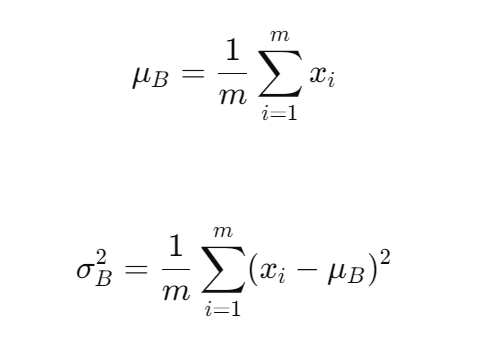

2. 归一化：

   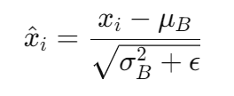

3. 缩放和平移：

   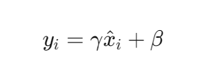

   其中，ϵ是一个很小的值，用于防止除零错误，γ 和 β是可学习的参数。

### 举个实际例子

假设你在上烹饪课，老师让你用不同大小的勺子来测量各种材料。每次使用不同大小的勺子都会导致配方不准确（就像神经网络的输入分布变化一样）。如果老师提供标准勺子，并告诉你用它来测量所有材料，然后根据需要进行调整（就像批归一化层），你就能更快更准确地完成任务。

### 批归一化的优点

1. **加速训练**：通过稳定输入数据的分布，批归一化使得训练更快。
2. **更高的学习率**：批归一化允许使用更高的学习率，这有助于更快地找到最优解。
3. **防止过拟合**：批归一化有一定的正则化效果，可以减少过拟合。
4. **稳定性**：批归一化使网络更稳定，避免梯度消失和梯度爆炸问题。

### 批归一化的应用

批归一化通常用于深度神经网络的中间层，比如卷积神经网络（CNN）和全连接神经网络（FCN）中。它可以放置在卷积层或全连接层之后，激活函数之前或之后。

## DropOut层

### 什么是Dropout层？

Dropout层是一种在训练神经网络时用于防止过拟合的技术。它通过在训练过程中随机“丢弃”一部分神经元，迫使网络学习更具鲁棒性的特征，从而提高模型的泛化能力。

### 为什么需要Dropout？

在训练神经网络时，如果模型过于复杂且训练数据有限，模型可能会记住训练数据的细节和噪声，而不是学习到数据的泛化特征。这种情况称为过拟合。过拟合的模型在训练数据上的表现很好，但在新数据（测试数据）上的表现却很差。Dropout通过随机地“丢弃”一部分神经元，减少了神经元之间的相互依赖，从而缓解过拟合问题。

### Dropout的工作原理

1. **训练阶段**：
   - 在每次训练迭代中，Dropout层会随机选择一定比例的神经元，并将它们的输出值设为零。
   - 这些被“丢弃”的神经元在当前迭代中不参与前向传播和反向传播。
   - 保留的神经元继续正常工作，但它们的输出会被放大，以补偿丢弃的神经元。例如，如果丢弃50%的神经元，剩余的神经元输出会乘以2。
2. **测试阶段**：
   - 在测试阶段，Dropout层不丢弃任何神经元。
   - 但为了保持训练和测试的一致性，所有神经元的输出会按比例缩小（例如，如果训练时丢弃了50%的神经元，测试时所有神经元的输出会乘以0.5）。

### 举个实际例子

假设你在学校学习，你想通过多做题来提高你的数学成绩。为了确保你理解了所有类型的题目，你不总是做同样的题目，而是随机选择不同类型的题目来练习。这样你在考试中遇到新题目时，更有可能解答出来。

同样的道理，Dropout通过随机“丢弃”一部分神经元，确保模型不会过于依赖某些特定神经元，而是学习到更加广泛和鲁棒的特征。

### Dropout的优点

1. **防止过拟合**：通过随机丢弃神经元，Dropout减少了神经元之间的相互依赖，使模型更具泛化能力。
2. **提高模型的鲁棒性**：Dropout迫使模型在不同子网络的组合上表现良好，从而提高了模型的鲁棒性。
3. **实现简单**：Dropout层的实现非常简单，只需要在现有网络中添加一个Dropout层，并设置丢弃率。

### Dropout的应用

Dropout层通常用于全连接层（Dense Layer）后面，但也可以应用于卷积层（Convolutional Layer）。在卷积层中，Dropout通常只在特征图的通道维度上应用，而不是在空间维度上应用。

## 嵌入层

### 什么是嵌入层？

嵌入层是神经网络中的一种层，主要用于处理离散数据，比如文本中的单词、推荐系统中的用户和物品等。嵌入层将这些离散的、高维度的输入数据转换为低维度的连续向量表示，这样神经网络更容易处理。

### 为什么需要嵌入层？

在处理自然语言或其他离散数据时，输入通常是由大量独特元素（如单词、用户、物品）组成的。如果直接使用这些离散数据，模型会非常复杂且难以训练。嵌入层通过学习将这些离散数据映射到一个低维度的连续向量空间，使模型能够更有效地捕捉数据之间的关系和特征。

### 举个实际例子

假设我们在处理文本数据，我们有一个句子：

```
"猫 坐在 垫子 上"
```

这里每个单词都是一个离散的元素。假设我们有一个包含所有单词的词汇表：

```
['猫', '坐在', '垫子', '上', '狗', '在', '草地', '上']
```

每个单词可以用一个独特的索引来表示：

```
猫 -> 0
坐在 -> 1
垫子 -> 2
上 -> 3
狗 -> 4
在 -> 5
草地 -> 6
上 -> 7
```

这些索引是离散的、高维度的（如果词汇表很大）。嵌入层的作用是将这些离散的索引转换为连续的、低维度的向量表示。例如，假设我们将每个单词嵌入到一个3维空间中：

```
猫 -> [0.1, 0.2, 0.3]
坐在 -> [0.4, 0.5, 0.6]
垫子 -> [0.7, 0.8, 0.9]
上 -> [0.2, 0.1, 0.3]
```

### 嵌入层的工作原理

1. **输入索引**：嵌入层接收输入数据的索引，这些索引对应于离散数据在词汇表中的位置。
2. **嵌入矩阵**：嵌入层包含一个嵌入矩阵（embedding matrix），该矩阵的每一行对应一个词汇表中的元素，行的维度是预设的嵌入向量维度。
3. **查找操作**：对于每个输入索引，嵌入层从嵌入矩阵中查找对应的嵌入向量。

假设我们有以下嵌入矩阵（每行是一个嵌入向量）：

```
[
  [0.1, 0.2, 0.3],  # 猫
  [0.4, 0.5, 0.6],  # 坐在
  [0.7, 0.8, 0.9],  # 垫子
  [0.2, 0.1, 0.3],  # 上
  ...
]
```

对于输入索引序列 `[0, 1, 2, 3]`（对应于句子 "猫 坐在 垫子 上"），嵌入层将生成以下嵌入向量序列：

```
[
  [0.1, 0.2, 0.3],
  [0.4, 0.5, 0.6],
  [0.7, 0.8, 0.9],
  [0.2, 0.1, 0.3]
]
```

### 嵌入层的优点

1. **降低维度**：将高维度的离散数据转换为低维度的连续向量表示，降低了计算复杂度。
2. **捕捉语义关系**：嵌入向量能够捕捉数据之间的语义关系，例如在文本处理中，语义相似的单词在嵌入空间中距离较近。
3. **简化模型**：使用嵌入层简化了神经网络的结构，使得模型更容易训练和优化。

### 应用领域

嵌入层广泛应用于自然语言处理（NLP）和推荐系统等领域。例如：

- **NLP**：用于将单词、短语或句子转换为向量表示，用于文本分类、情感分析、机器翻译等任务。
- **推荐系统**：用于将用户和物品映射到同一个向量空间，从而计算相似度，进行推荐。

## 注意力层

### 什么是注意力层？

注意力层是神经网络中的一种机制，最初在自然语言处理（NLP）领域中广泛应用。它的目的是帮助模型在处理输入数据时，能够更灵活地关注数据中最重要的部分，而不是平均地对待所有部分。可以说，注意力机制让模型具备了“选择性注意”的能力，类似于人类在读文章时，会特别关注某些关键句子或者词语。

### 为什么需要注意力层？

在处理序列数据（如文本、时间序列等）时，传统的方法（如RNN和LSTM）会遇到一个问题：当序列很长时，模型难以有效地记住序列前面的重要信息。注意力层通过计算每个输入元素的重要性，使得模型能够在处理当前元素时，参考整个序列中的重要信息，从而提高模型的性能和灵活性。

### 注意力层的工作原理

注意力层的基本思想是为每个输入元素分配一个权重，这个权重反映了该元素对当前任务的重要性。通过这些权重，模型可以聚焦于最重要的部分。下面是注意力机制的一般步骤：

1. **计算注意力得分**：对每个输入元素，计算它和其他所有元素之间的相关性得分（attention score）。
2. **归一化注意力得分**：将得分转换为概率（或权重），通常使用softmax函数。
3. **加权求和**：使用这些权重对输入进行加权求和，得到一个新的表示，重点突出了重要的元素。

### 举个实际例子

假设我们有一句话：“猫坐在垫子上”，模型需要预测下一个词。传统的方法会逐字处理，但不能有效地处理长句子。而注意力机制会这样做：

1. **输入表示**：假设每个单词用一个向量表示，比如 `猫 -> [0.1, 0.3], 坐在 -> [0.2, 0.4], 垫子 -> [0.5, 0.6], 上 -> [0.7, 0.8]`。
2. **计算注意力得分**：模型会计算每个单词与当前单词的相关性得分。
3. **归一化**：将得分转换为权重，使得总和为1。
4. **加权求和**：根据权重对输入进行加权求和，得到一个新的向量表示。

假设计算得到的权重如下：

```
makefile复制代码猫: 0.1
坐在: 0.2
垫子: 0.5
上: 0.2
```

加权求和后的新表示：

```
css
复制代码
新表示 = 0.1 * [0.1, 0.3] + 0.2 * [0.2, 0.4] + 0.5 * [0.5, 0.6] + 0.2 * [0.7, 0.8]
```

### 注意力机制的类型

1. **自注意力（Self-Attention）**：输入序列中的每个元素与序列中的所有其他元素计算相关性，用于捕捉序列中的长距离依赖关系。
2. **多头注意力（Multi-Head Attention）**：在计算注意力时，使用多个不同的“头”，每个头独立计算一组注意力得分，然后将它们合并。这使得模型可以从不同的“角度”来关注输入数据。

### 应用领域

注意力层在多个领域有广泛应用：

- **自然语言处理（NLP）**：如机器翻译、文本摘要、问答系统等。
- **计算机视觉**：如图像描述生成、物体检测等。
- **推荐系统**：用于捕捉用户与物品之间的复杂关系。

## 灵敏度分析

## 敏感性分析

投资项目的经济评估中常用的分析不确定性的方法之一。

[敏感性](https://baike.baidu.com/item/敏感性/1721712?fromModule=lemma_inlink)分析是[投资项目](https://baike.baidu.com/item/投资项目/4422624?fromModule=lemma_inlink)的经济评估中常用的分析[不确定性](https://baike.baidu.com/item/不确定性/8250115?fromModule=lemma_inlink)的方法之一，从多个不确定性因素中逐一找出对投资项目[经济效益指标](https://baike.baidu.com/item/经济效益指标/12748945?fromModule=lemma_inlink)有重要影响的敏感性因素，并分析、测算其对项目经济效益指标的影响程度和敏感性程度，进而判断项目承受风险的能力。若某参数的小幅度变化能导致[经济效益](https://baike.baidu.com/item/经济效益/3405062?fromModule=lemma_inlink)指标的较大变化，则称此参数为敏感性因素，反之则称其为非敏感性因素。这种分析方法的缺点是每次只允许一个因素发生变化而假定[其他因素不变](https://baike.baidu.com/item/其他因素不变/15729644?fromModule=lemma_inlink)，这与实际情况可能不符。


## 决策树

类似于数据结构中的树，节点即是特征属性，分支即是特征属性的取值。

决策树需要考虑的点就是

* 节点的特征属性能够最大限度的分隔出数据集中的不同类。即增强分隔后的数据集的种类纯度。
* 同时还需要减少决策树的高度以减少运算时间。
* 在对决策树设计的时候，还要考虑剪枝操作，即在某些节点的某个分支下可以得到纯度较高的数据集，那么此处可以作为叶节点，即某一个分类结果。

涉及到纯度问题，引入了熵这个概念。

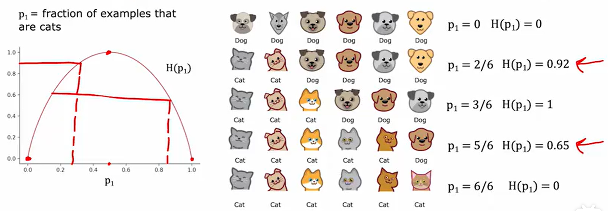

熵函数的公式：

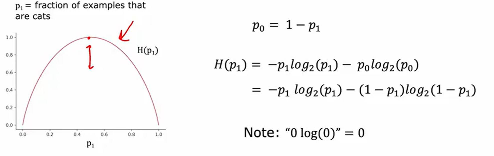

决策树中需要解决的问题是**减少熵值或者最大化纯度**，对应在决策树上就是在树节点选择什么属性。

> 信息增益：学习熵的减少

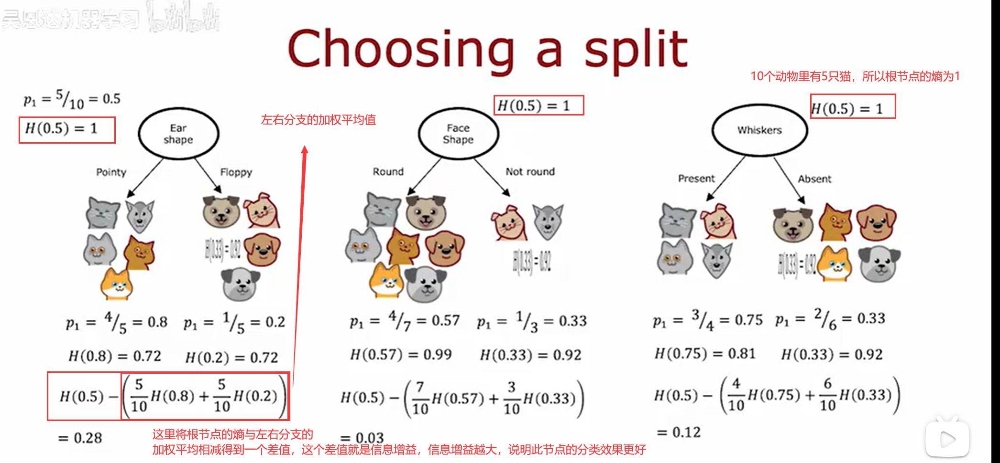

具体定义：

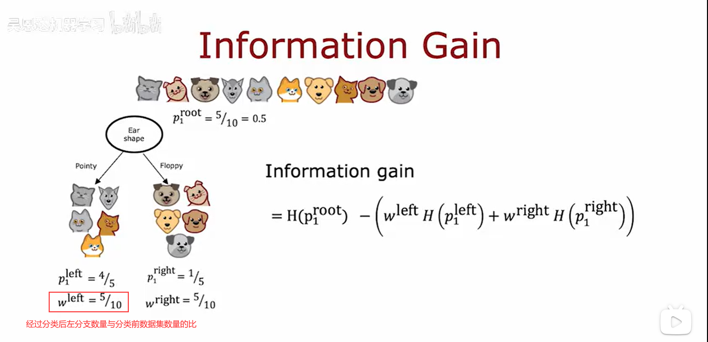

构建决策树的过程：

1. 从根节点开始
2. 计算所有可能分组结果的信息增益，并选取一个信息增益最大的情况
3. 根据信息增益最大的节点划分数据集得到新的节点（属性）
4. 在左子树或者右子树一直处理，直到满足以下标准（满足一个或者多个）：
   1. 当一个节点划分后出现了熵为0的情况，意思就是划分后的数据集都属于某一个类
   2. 继续划分超过设置的树的最大深度
   3. 如果划分后的信息增益小于某一个阈值
   4. 一个节点中数据集的数量低于某一个阈值

[具体实例](https://www.bilibili.com/video/BV1Bq421A74G?p=92&vd_source=677693f6b5fdb5565f3813ddff27c9bf)

**对于具有多个属性值的属性，可以使用二进制编码的形式**

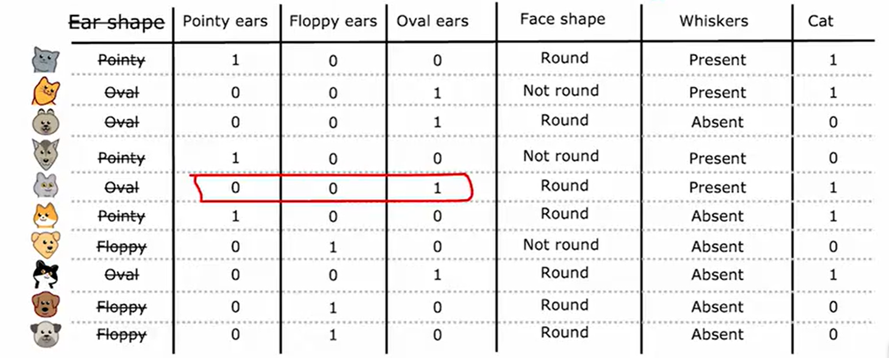

对于所有的属性做编码处理，投入到模型当中进行训练

> 如何处理属性值连续的属性呢？

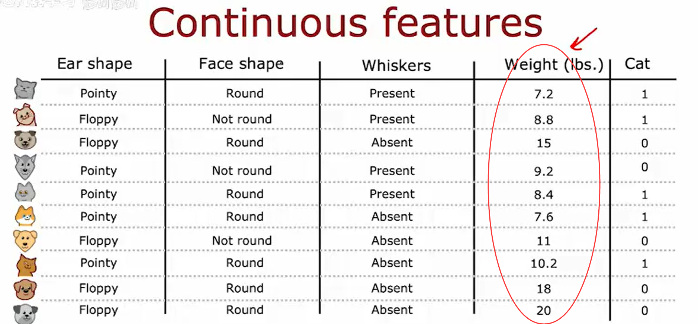

选取不同的值进行分类，计算信息增益

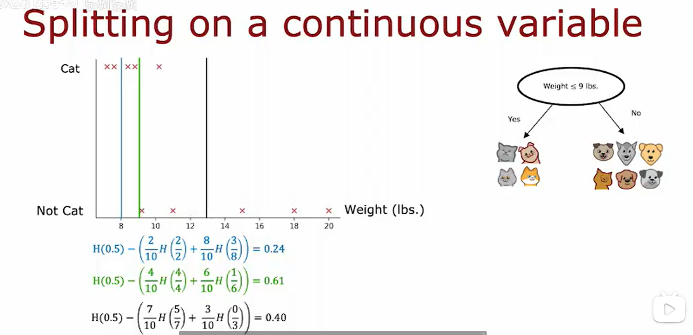

对于有连续值的属性，采用方差而非信息增益来进行评价。（处理过程类似于信息增益，对于分类后选取方差差最大的即可）

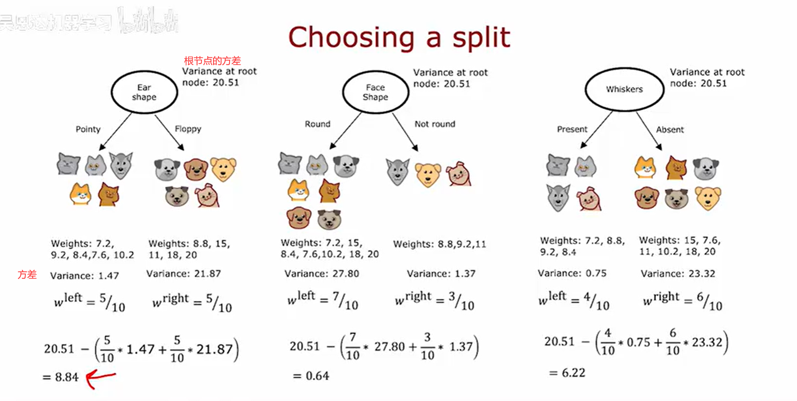

### 使用多个决策树

更改数据集，在构建决策树的时候会发生不同，比如下面这个。

改变了数据集中的一个例子，从根节点开始，决策树就不一样了。

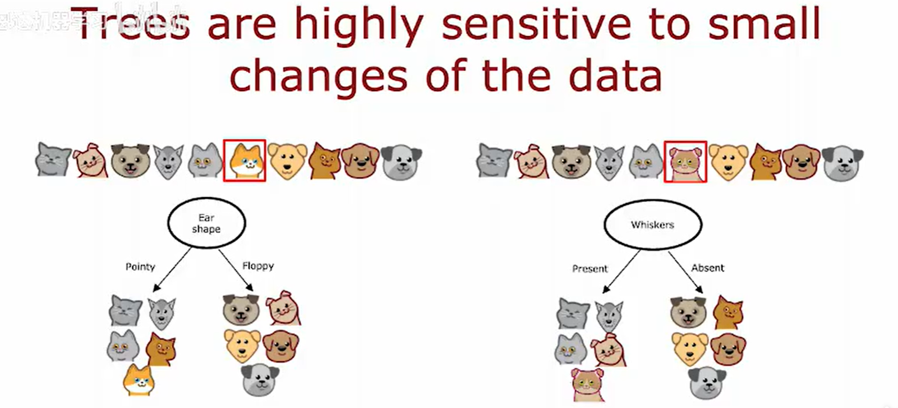

因此我们要设计一个森林，森林是由一个个决策树组成，对于一个预测用例，让这些决策树进行预测，最后预测的结果是大部分决策树预测的结果。

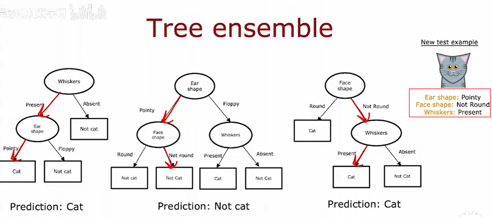

> 那么如何设计这样的一个决策树集合（这些树之间要有所不同）？
>
> ->采用放回抽样

### 放回抽样

如何操作？

将数据集所有的例子放在一个空盒里，然后抽取n次（抽完要放回；n等于原来数据集的大小）最后得到一个新的数据集

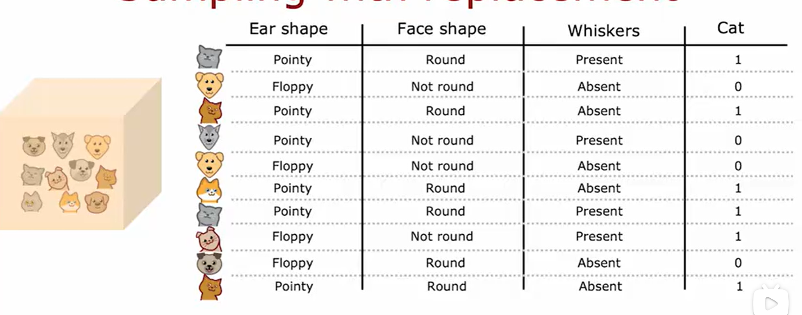

生成决策树集合

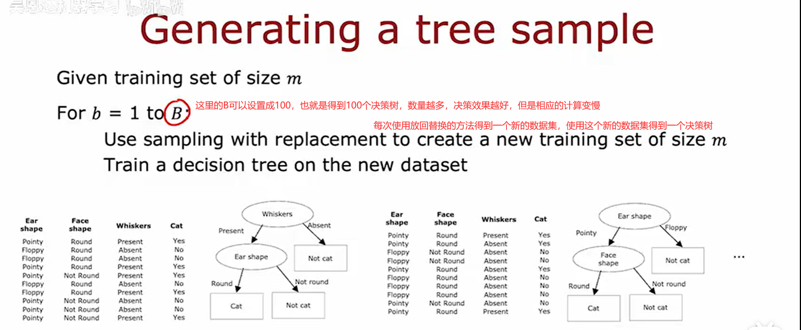

### 随机森林算法

在决策树节点中选择一个特征进行划分数据集的时候，如果属性很多，假设有n个，随机选取n个属性中的k个属性（子集），然后针对这k个属性进行决策树的创建。当n很大的时候，k一般取$\sqrt{n}$

### XGBoost

每次采用放回替换的方法生成一个新的数据集然后生成决策树，如下图所示，针对第一次生成的决策树，使用原始的数据集进行预测可以得到右侧，出现了三个用例预测不正确，因此针对这三个用例要着重学习，而如果对这些预测失败的用例进行着重学习则用到XGBoost模型。每一次循环都基于上一次循环得到的决策树进行一步一步的优化。

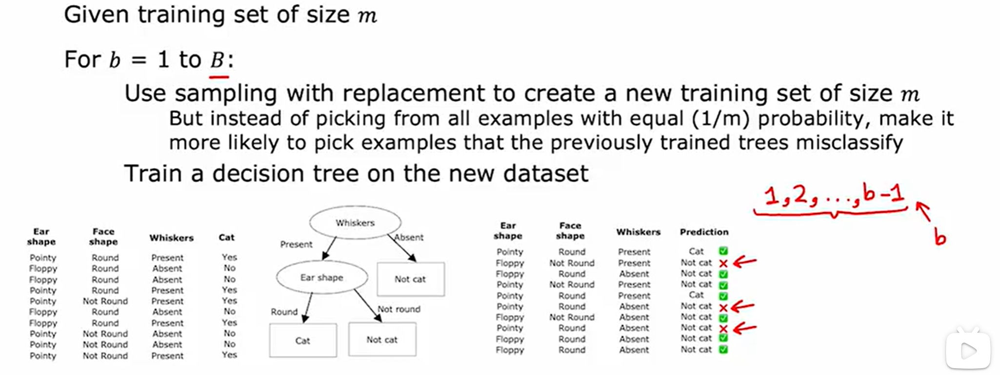

## 损失函数

每一个样本经过模型后会得到一个预测值，然后得到的预测值和真实值的差值就成为损失（当然损失值越小证明模型越是成功），我们知道有许多不同种类的损失函数，这些函数本质上就是计算预测值和真实值的差距的一类型函数，然后经过库（如pytorch，tensorflow等）的封装形成了有具体名字的函数。

[损失函数（lossfunction）的全面介绍（简单易懂版）-CSDN博客](https://blog.csdn.net/weixin_57643648/article/details/122704657)

## 梯度

机器学习中的大部分问题都是优化问题，而绝大部分优化问题都可以使用梯度下降法处理。

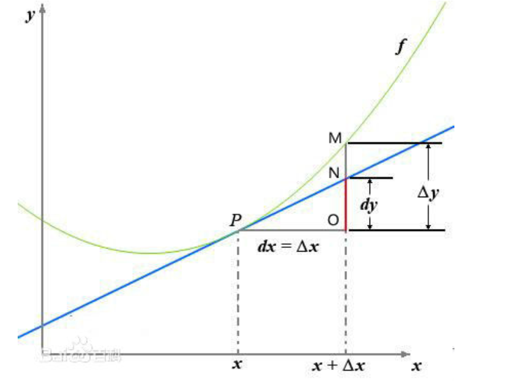

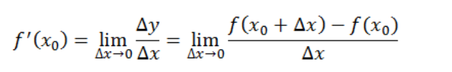

反映的是函数y=f(x)在某一点处沿x轴正方向的变化率。再强调一遍，是函数f(x)在x轴上某一点处沿着x轴正方向的变化率/变化趋势。直观地看，也就是在x轴上某一点处，如果f’(x)>0，说明f(x)的函数值在x点沿x轴正方向是趋于增加的；如果f’(x)<0，说明f(x)的函数值在x点沿x轴正方向是趋于减少的。

　这里补充上图中的Δy、dy等符号的意义及关系如下：
　Δx：x的变化量；
　dx：x的变化量Δx趋于0时，则记作微元dx；
　Δy：Δy=f(x0+Δx)-f(x0)，是函数的增量；
　dy：dy=f’(x0)dx，是切线的增量；
　当Δx→0时，dy与Δy都是无穷小，dy是Δy的主部，即Δy=dy+o(Δx).

**导数和偏导数**

　偏导数的定义如下：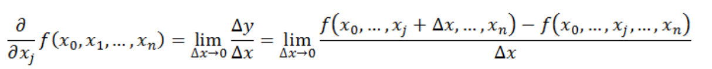

可以看到，导数与偏导数本质是一致的，都是当自变量的变化量趋于0时，函数值的变化量与自变量变化量比值的极限。直观地说，偏导数也就是函数在某一点上**沿坐标轴正方向**的的变化率。

区别在于：
　导数，指的是一元函数中，函数y=f(x)在某一点处沿x轴正方向的变化率；
　偏导数，指的是多元函数中，函数y=f(x1,x2,…,xn)在某一点处沿某一坐标轴（x1,x2,…,xn）正方向的变化率。

**导数与方向导数：**

方向导数的定义如下：


在前面导数和偏导数的定义中，均是沿坐标轴正方向讨论函数的变化率。那么当我们讨论函数沿任意方向的变化率时，也就引出了方向导数的定义，即：某一点在某一趋近方向上的导数值。
　通俗的解释是：
　我们不仅要知道函数在坐标轴正方向上的变化率（即偏导数），而且还要设法**求得函数在其他特定方向上的变化率**。而方向导数就是函数在其他特定方向上的变化率。

**导数与梯度**

　梯度的定义如下：


梯度的提出只为回答一个问题：
　函数在变量空间的某一点处，沿着哪一个方向有最大的变化率？
　梯度定义如下：
　函数在某一点的梯度是这样一个向量，它的方向与取得最大方向导数的方向一致，而它的模为方向导数的最大值。
　这里注意三点：
　1）梯度是一个向量，即**有方向有大小**；
　2）梯度的方向是**最大方向导数**的方向；
　3）梯度的值是**最大方向导数**的值。
导数与向量

> 提问：导数与偏导数与方向导数是向量么？

向量的定义是有方向（direction）有大小（magnitude）的量。
从前面的定义可以这样看出，偏导数和方向导数表达的是函数在某一点沿某一方向的变化率，也是具有方向和大小的。因此从这个角度来理解，我们也可以把偏导数和方向导数看作是一个向量，向量的方向就是变化率的方向，向量的模，就是变化率的大小。
那么沿着这样一种思路，就可以如下理解梯度：
**梯度即函数在某一点最大的方向导数，函数沿梯度方向函数有最大的变化率。**

### 梯度计算公式

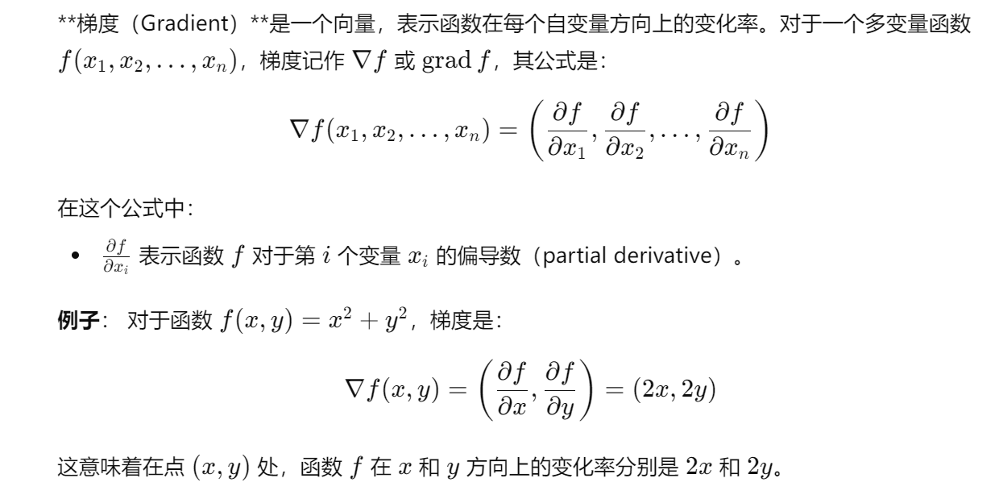

### 方向导数计算公式

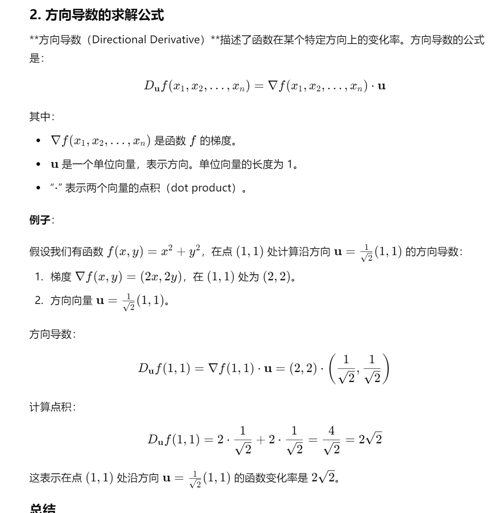

### 梯度的函数变化率为什么是最大的？

比如一个三维函数：

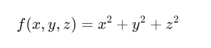

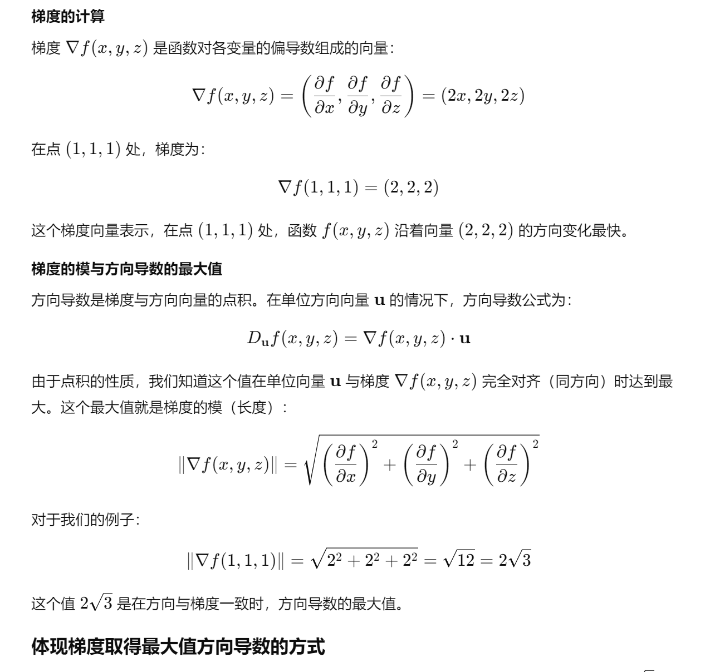

**在这里梯度的模就是函数变化率**

那为什么其他方向的函数变化率一定小于梯度方向的函数变化率（模）

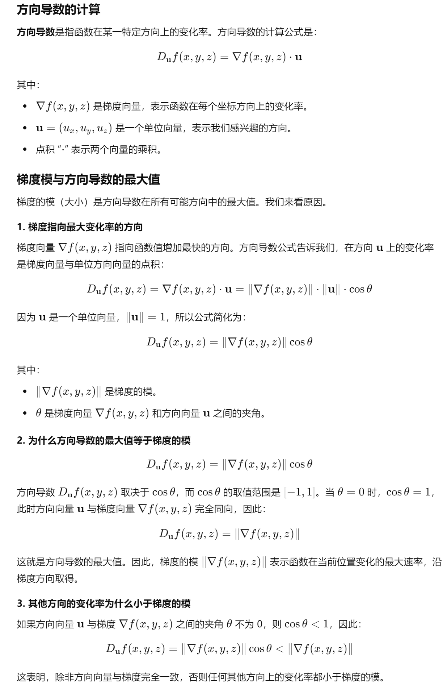

### 梯度下降法

既然在变量空间的某一点处，函数沿梯度方向具有最大的变化率，那么在优化目标函数的时候，自然是沿着**负梯度方向**去减小函数值，以此达到我们的优化目标。
如何沿着负梯度方向减小函数值呢？既然梯度是偏导数的集合，如下：


同时梯度和偏导数都是向量，那么参考向量运算法则，我们在每个变量轴上减小对应变量值即可，梯度下降法可以描述如下：


$\alpha $代表学习速率，多从0.001开始取值测试，不够好就乘3，a防止越过函数最低点和迭代次数过多的问题。

## 前馈传播与反向传播

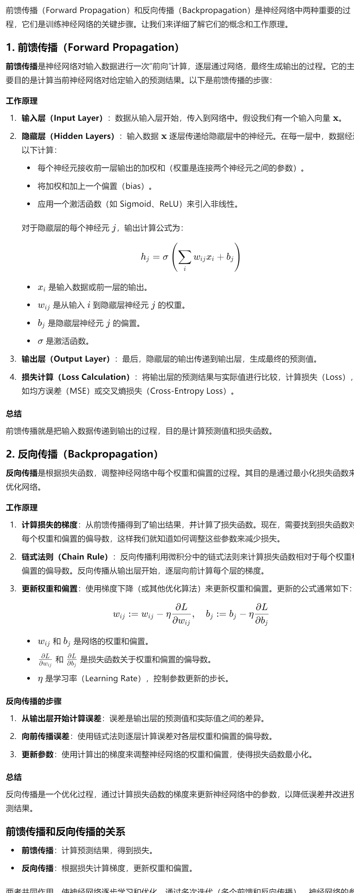

### 更细微的理解

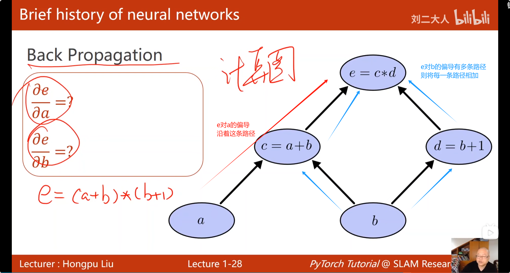

以a=1，b=2为例：

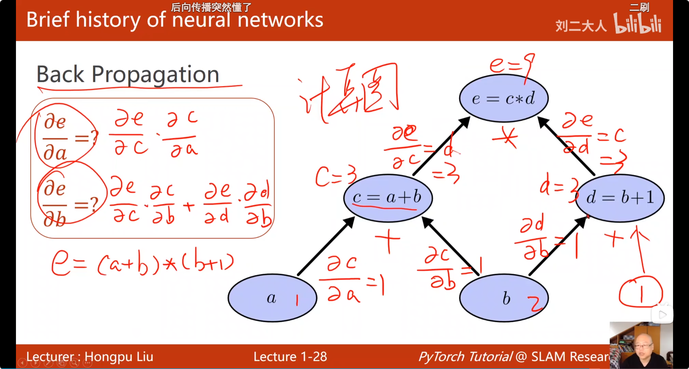

可以看到e对b的偏导是两条路径的链式加起来。

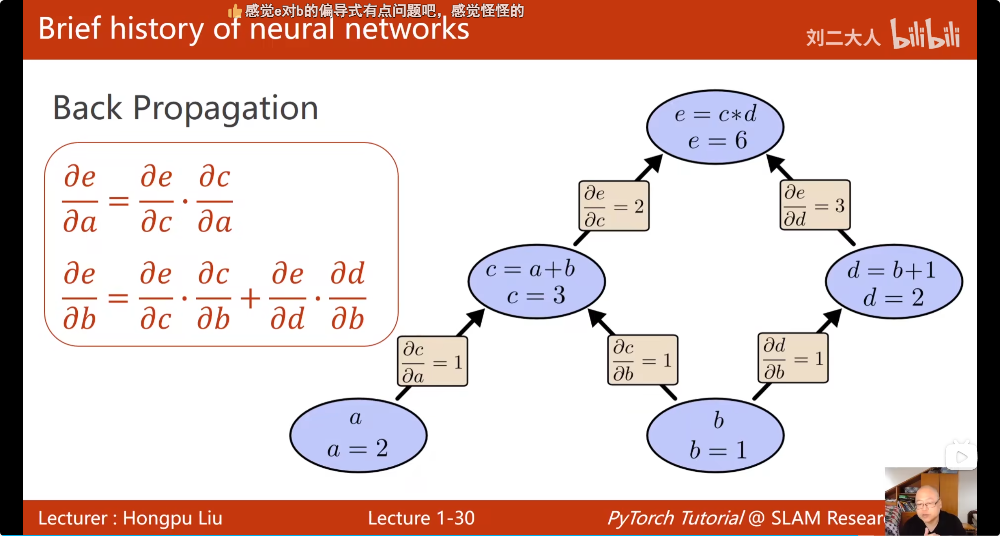


## 方差

[统计学基础——方差、协方差、标准差（标准偏差/均方差）、标准误、均方误差、均方根误差(标准误差)的区别_标准差 协方差-CSDN博客](https://blog.csdn.net/huangguohui_123/article/details/103537571)

## 遗传算法

遗传算法（Genetic Algorithm, GA）是一种从自然选择和遗传学原理中获得灵感的优化搜索算法。它是进化计算领域的一个重要部分，旨在模拟生物进化过程中的自然选择、遗传和突变等机制，以在问题的解空间中寻找最佳或近似最佳解。下面是一些核心概念和步骤，帮助你理解遗传算法的基本框架：

1. **问题编码**：遗传算法首先需要将问题的解表示成一种可以操作的形式，通常称为**染色体**。每个染色体代表问题的一个潜在解决方案，而染色体中的基本单位称为**基因**。例如，在解决旅行商问题时，染色体可以被编码为城市访问顺序的列表。
2. **初始化种群**：算法开始时，会随机生成一个初始的解决方案集合，称为**种群**。每个个体（即解）都是这个种群的一部分。
3. **适应度函数**：为了评估每个解的质量，需要定义一个**适应度函数**。这个函数衡量每个解对于目标问题的好坏程度。在优化问题中，适应度高的解意味着更接近问题的最优解。
4. **选择(Selection)**：根据每个个体的适应度，算法会选择一部分个体进入下一代。常用的策略有轮盘赌选择、锦标赛选择等，确保适应度高的个体有更大机会被选中。
5. **交叉(Crossover)**：模拟生物的有性繁殖过程，选择两个或多个父代染色体，并交换它们的部分基因来产生新的后代。这一步骤有助于保持并结合父代的优点。
6. **变异(Mutation)**：为了引入多样性，算法会对一些个体的基因进行小概率的随机改变。这有助于探索解空间中未被发现的区域。
7. **重复迭代**：上述过程会重复进行多代，每一代都会基于上一代的优秀个体进行选择、交叉和变异，逐步优化种群的整体适应度。
8. **终止条件**：遗传算法运行到满足某个预设的停止标准时结束，如达到最大迭代次数、找到满意解或种群的适应度不再显著提高。

遗传算法因其强大的全局搜索能力，广泛应用于组合优化、函数优化、机器学习、自动编程、路径规划等领域。它特别擅长处理那些解空间庞大、非线性、多模态的问题。

## 强化学习

强化学习（Reinforcement Learning，RL）是一种机器学习方法，广泛应用于训练智能代理（比如机器人、游戏AI）通过试错来学习如何在环境中做出决策，以达到某个目标。它的核心概念比较类似于人类和动物的学习过程：通过奖励和惩罚来改进行为。

### 强化学习的基本概念

1. **智能体（Agent）**：这是学习和决策的主体，比如一个机器人、一个游戏角色或者一个自动驾驶汽车。
2. **环境（Environment）**：智能体所处的世界，它会对智能体的动作做出反应。例如，机器人所在的房间或游戏中的虚拟世界。
3. **状态（State）**：环境的一个具体情形，智能体根据状态来做决定。例如，棋盘上的某个布局或者机器人摄像头看到的图像。
4. **动作（Action）**：智能体在某个状态下可以采取的行为。例如，机器人向前走一步或游戏角色跳跃。
5. **奖励（Reward）**：智能体每次采取行动后，环境给予的反馈信号，表示该动作的好坏。奖励可以是正的（表示好）或者负的（表示坏）。例如，机器人到达目标位置可能得到正的奖励，而碰到障碍物可能得到负的奖励。
6. **策略（Policy）**：智能体从状态到动作的映射规则，决定智能体在某个状态下采取什么动作。策略可以是确定的，也可以是概率性的。

### 强化学习的工作流程

1. **初始状态**：智能体从环境中感知一个初始状态。
2. **选择动作**：根据当前状态和策略，智能体选择一个动作。
3. **执行动作**：智能体执行所选动作，影响环境。
4. **环境反馈**：环境对智能体的动作做出反应，产生新的状态和奖励。
5. **更新策略**：智能体根据获得的奖励和新的状态，更新自己的策略，以便下次在相同或相似状态下能做出更好的决策。

这个过程会不断重复，智能体通过多次试错学习，逐步优化策略，使得累计获得的奖励最大化。

### 举个例子：训练一个游戏角色

假设我们要训练一个游戏角色在迷宫中找到出口，流程如下：

1. **初始状态**：游戏角色在迷宫的入口位置。
2. **选择动作**：角色可以选择向前、向后、向左、向右移动。
3. **执行动作**：例如，角色选择向前移动。
4. **环境反馈**：角色移动后，环境会给出反馈。如果角色走到墙上，可能会得到一个负的奖励（例如 -1）；如果走到更接近出口的位置，可能会得到一个正的奖励（例如 +1）。
5. **更新策略**：角色根据这次行动的奖励，调整策略，以便在下次遇到类似情况时做出更好的选择。

通过反复多次地执行以上步骤，角色会逐渐学会如何在迷宫中找到出口，并且尽可能避开墙壁。

### 强化学习的几种常见方法

1. **值迭代（Value Iteration）**：计算每个状态的值，并根据这些值来选择最优动作。
2. **策略迭代（Policy Iteration）**：反复更新策略，使其趋于最优。
3. **Q学习（Q-Learning）**：通过学习每个状态-动作对的价值（Q值），选择使得长期奖励最大的动作。
4. **深度强化学习（Deep Reinforcement Learning）**：使用神经网络来近似值函数或策略，使得能处理更复杂和高维度的状态空间。

### 总结

强化学习通过试错和反馈机制，智能体在环境中不断学习和改进自己的决策策略，以获得最大化的累计奖励。它的应用非常广泛，从机器人控制、游戏AI到自动驾驶等领域，都可以看到强化学习的身影。通过不断地互动和学习，智能体能逐渐掌握复杂的任务，并在未知环境中表现得越来越好。

## QMIX强化学习方式

[【QMIX】一种基于Value-Based多智能体算法 - 知乎 (zhihu.com)](https://zhuanlan.zhihu.com/p/353524210)

## 注意力机制

### 什么是注意力机制？

注意力机制（Attention Mechanism）是深度学习中的一种技术，用来让模型在处理输入数据时，能够灵活地关注数据中最重要的部分。这个机制最早在自然语言处理（NLP）领域中广泛应用，尤其是在机器翻译任务中。

#### 举个例子：

假设我们在读一个长句子：

```
复制代码
“今天我去商店买了一些苹果、香蕉和橙子，然后去了公园。”
```

如果我们要回答“我在商店买了什么？”，我们不需要记住整个句子，只需要关注“商店买了一些苹果、香蕉和橙子”这一部分。注意力机制就像我们在阅读时，自然而然地关注到这个关键部分。

#### 工作原理：

1. **计算注意力得分**：对每个输入元素，计算它和其他所有元素之间的相关性得分（attention score）。
2. **归一化注意力得分**：将得分转换为权重，通常使用softmax函数，使得所有权重加起来等于1。
3. **加权求和**：使用这些权重对输入进行加权求和，得到一个新的表示，这个表示重点突出了重要的元素。

### 什么是共享注意力机制？

共享注意力机制是一种特殊的注意力机制，它在多任务学习或多模态学习中使用。多任务学习指的是模型同时处理多个不同的任务；多模态学习指的是模型处理来自不同来源的数据，例如文字和图像。

#### 举个例子：

假设我们有一个系统，同时处理文本和图像信息。例如，我们想为一篇文章配上一张合适的图片。这时，我们需要模型既理解文章内容，又理解图像内容，然后找到它们之间的关联。

#### 工作原理：

1. **共享注意力权重**：在多任务或多模态学习中，模型使用相同的一组注意力权重来计算不同任务或模态之间的相关性。
2. **统一处理**：将来自不同任务或模态的输入数据统一处理，通过共享的注意力机制，让模型能够在不同任务或模态之间共享信息和特征。

### 简单对比

- **注意力机制**：让模型在处理单一任务或模态的输入数据时，能够关注到数据中最重要的部分。
- **共享注意力机制**：让模型在处理多任务或多模态的输入数据时，使用相同的注意力机制，统一关注数据中最重要的部分，从而在不同任务或模态之间共享信息和特征。

### 总结

- **注意力机制**：让模型“集中注意力”在输入数据的关键部分，通常用于处理单一任务或模态的数据。
- **共享注意力机制**：在多任务或多模态学习中使用相同的注意力机制，帮助模型在不同任务或模态之间共享信息和特征。

## Vue开发

## Transformer架构

Transformer是近年来在自然语言处理（NLP）领域中非常流行的一种神经网络架构，它的出现极大地提升了许多语言任务的性能，比如机器翻译、文本生成等。

### Transformer架构的基本思想

Transformer架构通过“自注意力机制”（Self-Attention Mechanism）来处理输入数据。与传统的循环神经网络（RNN）和长短期记忆网络（LSTM）不同，Transformer能够并行处理序列数据，因此训练速度更快，效果也更好。

### Transformer的主要组件

Transformer由两个主要部分组成：编码器（Encoder）和解码器（Decoder）。编码器负责处理输入序列，解码器负责生成输出序列。让我们逐步了解它们的工作原理。

#### 编码器（Encoder）

编码器的任务是将输入序列转换为一个更高维度的表示。每个编码器由以下几个部分组成：

1. **输入嵌入（Input Embedding）**：首先，将输入序列（如单词）转换为向量表示。这是通过一个嵌入层完成的，每个单词都被映射到一个固定维度的向量。
2. **位置编码（Positional Encoding）**：由于Transformer没有内置的顺序信息（不像RNN那样处理序列数据），需要通过位置编码来告诉模型每个单词在序列中的位置。
3. **自注意力机制（Self-Attention Mechanism）**：这是Transformer的核心部分。自注意力机制允许模型关注输入序列中的重要部分。每个单词会对序列中的所有单词计算注意力得分，从而决定应该关注哪些单词。
4. **前馈神经网络（Feed-Forward Neural Network）**：在自注意力机制之后，每个位置的表示都会通过一个前馈神经网络来进一步处理。
5. **层规范化（Layer Normalization）**：在自注意力和前馈网络之后，使用层规范化来稳定和加速训练过程。

这些部分组成了一个编码器层，通常多个编码器层堆叠在一起，形成完整的编码器部分。

#### 解码器（Decoder）

解码器的任务是生成输出序列。解码器与编码器类似，但有一些关键的不同：

1. **输入嵌入**：将目标序列（如翻译后的句子）转换为向量表示。
2. **位置编码**：与编码器相同，添加位置信息。
3. **自注意力机制**：解码器的自注意力机制稍有不同，因为它只能关注到当前位置及其之前的部分，以防止看到未来的信息（即所谓的“遮挡”）。
4. **编码器-解码器注意力（Encoder-Decoder Attention）**：这一层使得解码器能够关注编码器的输出，结合输入序列的信息生成更好的输出。
5. **前馈神经网络**：同样的，经过前馈神经网络处理。
6. **层规范化**：和编码器类似，使用层规范化。

### Transformer的自注意力机制

自注意力机制是Transformer的核心部分，它通过以下步骤来处理输入数据：

1. **计算查询（Query）、键（Key）和值（Value）**：每个输入单词都会生成三个向量：查询向量 Q、键向量 K 和值向量 V。
2. **计算注意力得分**：通过计算查询向量和键向量的点积，然后除以一个缩放因子（通常是向量维度的平方根），得到注意力得分。接着，对这些得分应用softmax函数，将它们转换为权重。
3. **加权求和值向量**：使用这些权重对值向量进行加权求和，得到每个单词的新的表示。

### 优点

- **并行处理**：相比RNN和LSTM，Transformer可以并行处理序列数据，提高了训练速度。
- **捕捉长距离依赖关系**：自注意力机制使得模型能够关注序列中的任意部分，捕捉长距离的依赖关系。

### 总结

Transformer架构通过自注意力机制和前馈神经网络，能够有效地处理序列数据，并行化的特性使得它在训练速度和效果上优于传统的RNN和LSTM。编码器负责将输入序列转换为高维表示，解码器则根据这些表示生成输出序列。这一架构在许多自然语言处理任务中取得了显著的成功。

## 什么是张量

在 PyTorch 中，张量（tensor）是一个多维数组，类似于 NumPy 的 ndarray，但它能够在 GPU 上进行高效的计算。将图像转换为 PyTorch 张量是为了能够利用 PyTorch 提供的强大计算能力来进行深度学习模型的训练和推理。

#### 什么是张量？

张量是一个多维数据结构，可以是一维的向量、二维的矩阵，或者更高维度的数据结构。例如：

- **0 维**：标量（一个数），如 `5`
- **1 维**：向量（数的列表），如 `[1, 2, 3]`
- **2 维**：矩阵（数的表），如 `[[1, 2], [3, 4]]`
- **3 维及以上**：更高维度的数组，用于表示更复杂的数据结构。

在图像处理中，图像通常表示为三维张量，维度分别是颜色通道、高度和宽度。

## 为什么使用归一化

归一化是指将数据缩放到一个特定的范围。在图像处理中，将像素值归一化到 [0, 1] 范围是一个常见的操作，具体原因包括：

1. **数值稳定性**：归一化可以提高数值计算的稳定性，避免计算过程中出现数值溢出或下溢。
2. **加速收敛**：归一化后的数据通常可以加速神经网络的训练收敛速度，因为网络在处理同一范围的数据时更容易找到最优解。
3. **统一处理**：将数据归一化到同一范围，可以使模型对不同数据源具有更好的适应性。

## 训练模式与评估模式

**训练模式 (`model.train()`)**：

- 训练模式是默认模式。在这种模式下，模型中的某些层（例如，`Dropout` 和 `BatchNorm` 层）会有不同的行为。例如，`Dropout` 会在训练过程中随机屏蔽部分神经元，以防止过拟合；`BatchNorm` 会使用当前批次的统计数据进行归一化。
- 使用训练模式是为了在训练过程中，模型能够更好地泛化，避免过拟合。

**评估模式 (`model.eval()`)**：

- 评估模式是专门用于测试和推理阶段的模式。在这种模式下，模型中的 `Dropout` 层将停止工作，所有神经元将全部激活；`BatchNorm` 层将使用整个训练集的统计数据，而不是当前批次的统计数据。
- 使用评估模式可以确保模型在推理阶段（即测试和实际应用中）表现稳定，因为它消除了训练过程中的随机性。

#### `target_net.eval()` 的具体作用

在这段代码中：

```python
target_net = DQN(screen_height, screen_width, n_actions).to(device)
target_net.load_state_dict(policy_net.state_dict())
target_net.eval()
```

1. **`target_net`**：
   - 目标网络，是用于帮助训练的一个辅助网络。在深度 Q 网络（DQN）中，目标网络的权重会定期从策略网络复制过来，但在两个更新之间保持不变。这有助于提高训练的稳定性。
2. **`target_net.load_state_dict(policy_net.state_dict())`**：
   - 将策略网络（`policy_net`）的权重复制到目标网络（`target_net`）中。这样，目标网络就拥有了与策略网络相同的权重。
3. **`target_net.eval()`**：
   - 将目标网络设置为评估模式。这意味着目标网络中的所有层将以评估模式运行。例如，`BatchNorm` 层将使用整体统计数据，而不是当前批次的统计数据。
   - 这样做的目的是确保在训练过程中，当我们使用目标网络进行 Q 值计算时，它的行为是稳定和确定的，不受训练过程中的随机性的影响。

#### 为什么要用评估模式

在深度 Q 网络训练中，评估模式的使用有几个好处：

1. **稳定性**：
   - 目标网络用于计算 Q 值的目标，保持其稳定性可以减少训练过程中的波动，提高训练效果。
2. **确定性**：
   - 评估模式下，网络的行为是确定的，所有神经元都被激活，`BatchNorm` 层使用整体统计数据。这确保了目标 Q 值的计算是稳定的。

## 优化器

优化器是用于更新神经网络参数（权重和偏置）的算法。它通过最小化损失函数来训练模型，使模型的预测结果更接近真实值。优化器在训练过程中不断调整模型参数，以找到使损失函数值最小的参数组合。

### 优化器的作用

优化器的主要作用是：

1. **计算梯度**：根据损失函数计算模型参数的梯度。
2. **更新参数**：根据计算出的梯度调整模型参数，使损失函数值减小。

### SGD优化器

SGD（随机梯度下降，Stochastic Gradient Descent）是一种常用的优化算法。它的基本思想是：

1. **计算梯度**：根据当前参数计算损失函数的梯度。
2. **更新参数**：沿着梯度的反方向更新参数，更新的步长由学习率决定。''

$$
具体来说，SGD优化器的参数更新公式如下：\\
𝜃=𝜃−𝜂⋅∇_𝜃𝐽(𝜃) \\
其中：
𝜃是模型参数。
𝜂是学习率。
∇_𝜃𝐽(𝜃)是损失函数 𝐽(𝜃)对参数 θ 的梯度。
$$

代码实现：

```python
optimizer = optim.SGD(policy_net.parameters(), lr=0.00025)
```

这行代码使用了PyTorch中的`SGD`优化器，并设置了学习率（`lr`）为0.00025。具体解释如下：

1. **`optim.SGD`**：这是PyTorch中的一个SGD优化器类。
2. **`policy_net.parameters()`**：这是策略网络的参数。在训练过程中，这些参数会被优化器更新。
3. **`lr=0.00025`**：这是学习率，决定了每次更新参数时步长的大小。

## 学习率

学习率（learning rate）是一个超参数，它决定了每次更新神经网络参数时的步长大小。步长指的是在梯度下降过程中，每一步调整参数的幅度。

假设我们在一个二维平面上寻找最低点（即最优解），每次我们根据当前斜率决定走多远（即步长）：

- **学习率太大**：假如我们每次跨越10步，可能会跳过最低点，从一侧跳到另一侧，无法找到最低点。
- **学习率太小**：假如我们每次只跨越0.1步，虽然每次都会朝向最低点，但需要很多次才能到达最低点。

## 监督学习与非监督学习

监督学习（Supervised Learning）和无监督学习（Unsupervised Learning）是机器学习中的两种基本类型。

监督学习是指在已知数据集（训练集）中每个样本都有一个明确的标签或结果的情况下，训练模型使其能够从输入数据中预测正确的标签或结果。监督学习任务主要包括分类（Classification）和回归（Regression）。例如，在垃圾邮件识别中，已知一部分电子邮件是否为垃圾邮件的标记数据集，通过这些数据训练模型，使其能够对新邮件进行分类。监督学习的优点是可以利用已有的标签信息指导模型学习，缺点是需要大量的标注数据，而人工标注数据往往耗时且昂贵。

无监督学习则是指在没有明确标签的数据集中学习数据的结构和模式。这类学习任务不需要预先知道输出结果，其主要目标是揭示数据内部隐藏的规律或者数据间的关联性。无监督学习常见的任务有聚类（Clustering）、降维（Dimensionality Reduction）和异常检测（Anomaly Detection）等。例如，在顾客细分问题中，我们可能没有预先定义好的类别标签，但是希望根据顾客的行为模式将其分成不同的群体。无监督学习的优点是不需要标签数据，可以发现数据中未知的模式，但缺点是结果可能不太直观，解释起来较为困难，并且缺乏明确的评价标准。

## 什么是过拟合，欠拟合

### 1. 什么是过拟合？

**过拟合**是指模型对训练数据学习得太好了，甚至把数据中的噪声（随机的、无意义的误差）也学到了。过拟合的模型在训练数据上表现得很好（高准确率），但在新数据（测试数据或实际应用数据）上表现很差。换句话说，模型变得**太复杂**，对训练数据记得太牢，但不能很好地**概括**新的数据。

#### 举个例子

想象你在学习如何画一条能很好地穿过几个点的曲线。如果你让曲线通过每个点并绕来绕去（形成很多小波动），那你可能画得太复杂了。这种情况在数学上就是过拟合。虽然你画的曲线完美地穿过了所有点（训练数据），但对于新的点（测试数据），它可能无法很好地预测，因为它捕捉了太多特定数据的细节和噪声。

#### 原因

- 模型太复杂：比如使用了太多的特征或过于复杂的算法。
- 数据量太少：数据不够多，模型容易记住每个数据点的细节。

#### 如何解决过拟合

- **简化模型**：减少特征数量或使用更简单的模型（如线性回归）。
- **更多数据**：通过增加训练数据，帮助模型学到更一般的规律。
- **正则化**：对模型施加约束，防止它变得太复杂。
- **交叉验证**：使用部分数据进行训练，另一部分数据进行验证，来评估模型性能。

==**训练过拟合，说明模型泛化能力不好，表现为开发（验证）集的数据在真实收敛域附近的loss增大**==

### 2. 什么是欠拟合？

**欠拟合**是指模型对训练数据学习得不够好，无法捕捉到数据中的模式或规律。欠拟合的模型在训练数据和新数据上都表现不好，因为它太简单了，没有学到足够的信息。

#### 举个例子

如果你试着用一条直线来穿过一堆看起来是曲线的数据点，这条直线可能无法很好地描述数据的模式。这就是欠拟合的情况。模型太简单，没有足够的灵活性去描述数据的真正模式。

#### 原因

- 模型太简单：比如用线性模型来拟合非线性数据。
- 数据的特征没有被充分利用：没有使用足够的信息来训练模型。

#### 如何解决欠拟合

- **增加模型复杂度**：使用更复杂的模型或增加更多特征。
- **更好地特征选择和提取**：选择更相关的特征，或从原始数据中提取更多有意义的特征。
- **调节模型参数**：调整模型的超参数，使其能更好地拟合数据。

### 总结

- **过拟合**：模型太复杂，学到了训练数据的噪声，在新数据上表现不好。
- **欠拟合**：模型太简单，没学到足够的数据模式，在训练数据和新数据上都表现不好。

## 什么是下采样

**下采样**（Downsampling）是信号处理、图像处理和数据分析中常用的技术，指的是从原始数据中减少样本数量，从而降低数据的分辨率或尺寸。

### 1. 下采样的基本概念

下采样的目标是减少数据量，同时保留尽可能多的重要信息。它通常用于数据量过大、不需要高精度分析或者需要减少计算负担的场景。

#### 举个例子

假设我们有一个高分辨率的图像，下采样操作会减少图像的像素数量，例如从 4000x3000 的图像变成 2000x1500 的图像。这样做的结果是图像文件变小了，但可能会丢失一些细节信息。

### 2. 下采样的具体应用

#### 在信号处理中的应用

在信号处理领域，下采样指的是降低信号的采样率。例如，一个音频信号原本是以 44.1 kHz（每秒 44100 个样本）采样的，通过下采样，我们可以把采样率降到 22.05 kHz。这会使文件更小，但音质可能会有所下降。

#### 在图像处理中的应用

在图像处理领域，下采样通常用于图像缩小。下采样可以通过减少像素点数来实现，常见的方法有：

- **邻近采样**：简单地丢弃部分像素点。例如，把每 2x2 个像素的中心点作为缩小后的像素值。
- **平均采样（均值滤波）**：对多个像素取平均值，作为新的像素值。这可以避免直接丢弃像素而导致的“锯齿效应”。

#### 在数据科学和机器学习中的应用

在数据科学中，下采样用于处理不平衡数据集。例如，在二分类问题中，如果正负样本数量非常不均衡（如 90% 的负样本，10% 的正样本），可以通过下采样负样本来平衡数据集，避免模型偏向多数类。

### 3. 下采样的优缺点

- **优点**：
  - 减少数据量，降低存储和计算成本。
  - 可以提高计算速度，尤其是在大数据集或高分辨率数据（如图像和视频）处理中。
  - 用于数据平衡，避免模型偏向某一类数据。
- **缺点**：
  - 可能会丢失信息或细节，导致数据精度下降。
  - 下采样过度可能导致模型不能很好地学习数据特征，影响性能。

### 4. 下采样的注意事项

- 在信号处理或图像处理中，下采样前通常需要对数据进行**滤波**，以防止出现混叠（aliasing）现象，即高频分量被错误地表示为低频分量。
- 在机器学习中，下采样需要谨慎，以免丢失重要的样本信息或特征，尤其是在样本量本来就很少的情况下。

# 卷积神经网络

卷积神经网络（CNN）非常适合处理图像数据，因为它们可以自动学习和提取图像中的特征，例如边缘、形状和模式。这使得它们在图像识别、分类等任务中非常有效。

## 为什么要设置多层卷积层

多层卷积层可以逐步提取图像的不同层次的特征。第一层可能会提取简单的边缘特征，第二层会提取组合特征（例如角或边缘的组合），第三层会提取更高层次的特征（例如物体的部分或复杂的形状）。

## 卷积层是什么

卷积层通过卷积操作从输入图像中提取特征。卷积操作通过滑动一个小的过滤器（卷积核）在图像上，并计算这个过滤器与图像的局部区域的点积。

## 卷积层中的输入通道、输出通道指什么？

输入通道：输入图像的通道数。对于彩色图像，通常有3个通道（红、绿、蓝）。

注意在强化学习中，尤其是处理像游戏环境时，单帧图像通常不足以提供充分的信息来判断当前的状态。例如，在一个动作游戏中，只看一帧图像并不能了解物体的移动方向或速度。因此，通常会使用多帧图像叠加来提供更多的上下文信息。

**多帧图像叠加处理** 是将连续的几帧图像叠加起来形成一个包含更多信息的输入数据，这样可以让模型看到物体的运动趋势和变化。

在强化学习当中输入通道数会出现3个以上的情况，意味着采用的多帧图像叠加处理。

1. **多帧图像叠加**：这里使用了4帧连续的图像叠加在一起，形成一个包含4个通道的输入。这4个通道分别表示4个连续时刻的灰度图像。

2. **灰度图像**：每一帧都是一个灰度图像，这样每个通道就只需要表示一个灰度值，而不需要分为红、绿、蓝3个通道。因此，4帧灰度图像叠加就形成了4个通道。

比如说

```python
self.conv1 = nn.Conv2d(4, 32, kernel_size=8, stride=4)
```

* 4 是输入通道数，表示每个输入图像有4个通道（即4帧灰度图像叠加）。
  **4个通道的来源**：每个通道表示一帧灰度图像，4个通道就是4帧图像叠加。
  **多帧图像叠加处理的意义**：提供更多的上下文信息，帮助模型更好地理解环境的动态变化。

* 32 是输出通道数，表示该卷积层会提取32种特征。

这里的输出通道数是32是什么意思？

卷积层的输出通道数（也称为**过滤器数量**或**核数量**）决定了卷积层提取特征的种类和数量。设定一个卷积层的输出通道数为32，表示该卷积层会使用32个不同的过滤器来处理输入数据，每个过滤器会提取一种特定的特征。

**过滤器（Filter）**：也称为卷积核（kernel），是卷积层中用于提取特征的小矩阵。例如，8x8大小的过滤器。

**特征图（Feature Map）**：每个过滤器在输入图像上滑动，通过与输入图像进行卷积操作（即逐元素相乘并求和），生成一个新的矩阵，这个新的矩阵就是一个特征图。

设定输出通道数为32，表示卷积层会有32个不同的过滤器，这些过滤器会提取32种不同的特征。这些特征可以是：

- 边缘特征（如水平或垂直边缘）。
- 颜色特征（对于彩色图像）。
- 纹理特征（如重复的图案）。
- 高层次特征（如特定的形状或对象）。

## **卷积层是如何提取特征的？**

**卷积操作**：每个过滤器在输入图像上滑动，进行卷积操作，生成一个特征图。

**非线性激活**：通常在卷积操作后，会使用激活函数（如ReLU）来引入非线性，使得网络可以表示更复杂的特征。

**特征组合**：通过多个卷积层，网络逐层提取越来越复杂的特征。

```python
self.conv1 = nn.Conv2d(4, 32, kernel_size=8, stride=4)
```

`4` 是输入通道数，表示输入的图像有4个通道（4帧叠加）。

`32` 是输出通道数，表示该卷积层会使用32个过滤器，提取32种不同的特征。

`kernel_size=8` 表示过滤器的大小是8x8。

`stride=4` 表示过滤器每次移动4个像素。

## 什么是卷积核的步幅

在卷积神经网络中，**步幅**决定了卷积核在输入图像上滑动的步长，也就是说，每次卷积操作中，卷积核移动的距离。

### 步幅的作用

1. **控制特征图大小**：步幅越大，卷积核滑动的距离越大，输出的特征图（Feature Map）尺寸越小。
2. **计算效率**：较大的步幅会减少卷积操作的次数，从而提高计算效率，但也可能会丢失一些细节信息。

### 举例说明

假设有一个输入图像，大小为6x6，卷积核大小为3x3。

#### 步幅为1

- 卷积核从左上角开始，每次移动1个像素。
- 计算步骤：
  1. 卷积核覆盖输入图像的左上角区域，进行卷积操作。
  2. 卷积核向右移动1个像素，再次进行卷积操作。
  3. 重复上述步骤，直到覆盖整个输入图像。
- 结果：输出特征图的大小为4x4。

```
Input (6x6):
1 1 1 0 0 0
1 1 1 0 0 0
1 1 1 0 0 0
0 0 0 1 1 1
0 0 0 1 1 1
0 0 0 1 1 1

Kernel (3x3):
1 0 1
0 1 0
1 0 1

Stride: 1

Output (4x4):
4 2 2 0
2 4 2 0
2 2 4 2
0 0 2 4
```

#### 步幅为2

- 卷积核从左上角开始，每次移动2个像素。
- 计算步骤：
  1. 卷积核覆盖输入图像的左上角区域，进行卷积操作。
  2. 卷积核向右移动2个像素，再次进行卷积操作。
  3. 重复上述步骤，直到覆盖整个输入图像。
- 结果：输出特征图的大小为2x2。

```
Input (6x6):
1 1 1 0 0 0
1 1 1 0 0 0
1 1 1 0 0 0
0 0 0 1 1 1
0 0 0 1 1 1
0 0 0 1 1 1

Kernel (3x3):
1 0 1
0 1 0
1 0 1

Stride: 2

Output (2x2):
4 2
2 4
```

### 在代码中的应用

在你提供的代码中，卷积层的步幅设置如下：

```
self.conv1 = nn.Conv2d(4, 32, kernel_size=8, stride=4)
```

- `kernel_size=8`：卷积核的大小是8x8。
- `stride=4`：卷积核每次移动4个像素。

这意味着：

- 卷积核在输入图像上滑动时，每次移动4个像素。
- 由于步幅较大，输出特征图的尺寸会比输入图像小得多。

### 总结

- **步幅（Stride）**：卷积核在输入图像上滑动的步长。
- **步幅越大**：输出特征图的尺寸越小，计算效率越高，但可能会丢失一些细节信息。
- **步幅在卷积层中的设置**：控制了卷积核在输入图像上的滑动距离，影响了输出特征图的尺寸。

## 卷积神经网络中的归一化层

```python
self.conv1 = nn.Conv2d(4, 32, kernel_size=8, stride=4)
self.bn1 = nn.BatchNorm2d(32)
```

#### `self.conv1 = nn.Conv2d(4, 32, kernel_size=8, stride=4)`

- **卷积操作**：卷积层是卷积神经网络的核心，用来提取输入图像中的特征。

- 参数解释

  ：

  - `4`：输入通道数。由于是多帧图像叠加处理，输入有4个通道（例如，4个连续的灰度图像帧叠加在一起）。
  - `32`：输出通道数，表示该卷积层会提取32种特征。
  - `kernel_size=8`：卷积核的大小是8x8。
  - `stride=4`：卷积核每次移动4个像素。

卷积层的工作是通过滑动卷积核（即一个小的权重矩阵）在输入图像上，来提取局部特征。每个卷积核会在图像上滑动，并进行加权求和，生成一个新的特征图（Feature Map）。

#### `self.bn1 = nn.BatchNorm2d(32)`

- **批量归一化**：批量归一化是一种正则化技术，用于加速神经网络的训练，并提高稳定性。它通过在每个小批量数据上归一化每个激活值来减少内部协变量偏移（Internal Covariate Shift）。

- 参数解释

  ：

  - `32`：归一化32个通道。**这与前一个卷积层的输出通道数一致。**

批量归一化的工作原理是：在每个小批量数据上，对每个通道的激活值进行归一化，使它们具有均值为0，方差为1的分布。这有助于保持模型训练的稳定性，并使训练更快。

### 具体流程

1. **卷积操作**：首先，输入数据通过第一个卷积层（`self.conv1`），提取32种特征，生成一个新的特征图。
2. **批量归一化**：然后，卷积层的输出通过第一个批量归一化层（`self.bn1`），对32个通道的激活值进行归一化。

### 为什么使用批量归一化？

- **加速训练**：批量归一化可以使训练更快，因为它减少了内部协变量偏移。
- **提高稳定性**：批量归一化有助于保持模型的稳定性，防止梯度消失或爆炸。
- **减少对初始化的依赖**：批量归一化使得模型对权重初始化不那么敏感。

## 全连接层

### `nn.Linear` 简介

`nn.Linear` 是 PyTorch 中用于创建全连接层（或叫线性层）的类。全连接层是神经网络中的一种基本层，它将输入的每个元素与输出的每个元素相连，每个连接都有一个权重。

### 参数

`nn.Linear` 的初始化需要两个主要参数：

1. `in_features`：输入的特征数。
2. `out_features`：输出的特征数。

这些参数决定了输入数据和输出数据的维度。

### 具体例子

#### 第一个全连接层

```
python
复制代码
self.l1 = nn.Linear(linear_input_size, 512)
```

- **`linear_input_size`**：这是输入特征的数量，也就是卷积层输出的扁平化（Flatten）结果的大小。经过卷积层和池化层后，输出的特征图会被展平成一个一维向量，这个向量的长度就是 `linear_input_size`。
- **`512`**：这是输出特征的数量，表示该层会输出一个长度为512的向量。

**工作原理**：这一层将卷积层提取到的特征输入到512个神经元中进行处理。

#### 第二个全连接层

```
python
复制代码
self.l2 = nn.Linear(512, outputs)
```

- **`512`**：这是上一层的输出特征数，所以这一层的输入特征数必须是512。
- **`outputs`**：这是输出特征的数量，表示最终的输出。这通常是动作空间的大小，也就是可能的动作数量。

**工作原理**：这一层将512个神经元的输出进一步处理，生成最终的输出。

### 全连接层的作用

全连接层（也称为密集层）将输入的所有节点与输出的所有节点相连，并对其进行线性变换。这个变换可以表示为：
$$
output=input×weights+bias\text{output} = \text{input} \times \text{weights} + \text{bias}output=input×weights+bias
$$

- **`weights`**：表示连接权重。
- **`bias`**：表示偏置项。

### 总结

- **`nn.Linear`**：用于创建全连接层。

- 参数：

  - `in_features`：输入特征数，表示输入数据的维度。
  - `out_features`：输出特征数，表示输出数据的维度。
  
- **作用**：将输入特征通过线性变换（乘以权重矩阵加上偏置项）转换为输出特征。

在你的代码中，第一个全连接层 `self.l1` 将卷积层的输出连接到512个神经元上，第二个全连接层 `self.l2` 将512个神经元连接到输出层（即可能的动作数量）。

# 实践概念

## 图像处理管道

图像处理管道（Image Processing Pipeline）是一个连续的图像处理步骤集合，每个步骤对图像进行特定的变换或处理，最终输出一个满足特定需求的图像。这个管道可以帮助简化代码，确保每张图像都经过一致的处理步骤。

## 双三次插值方法

双三次插值（Bicubic Interpolation）是一种常用的图像插值方法，用于调整图像大小时计算新像素值。它通过考虑 4x4 的邻近像素来计算新像素值，比最近邻插值（只考虑最近的一个像素）和双线性插值（考虑 2x2 的邻近像素）能提供更高质量的图像缩放效果。

#### 双三次插值方法如何调整图像大小？

- **邻近像素考虑范围**：双三次插值考虑的是原图像中 4x4 的邻近像素，共 16 个像素。
- **计算方法**：通过这 16 个像素的值，使用双三次公式计算新像素的值。这些公式比线性插值复杂，但能够提供更平滑的图像。

双三次插值的计算公式如下：

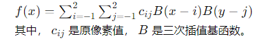

## 为什么神经网络需要固定大小的输入图像？

神经网络中的卷积层和全连接层要求输入的图像具有固定的尺寸。这是因为：

1. **卷积操作**：卷积核在图像上滑动，需要固定的图像尺寸来确定卷积核的滑动次数和输出特征图的大小。
2. **全连接层**：全连接层的输入必须是固定长度的向量。如果输入图像大小不固定，经过卷积层和池化层后得到的特征图大小也不固定，无法输入到全连接层。

## 为什么选择 84x84 作为输入图像大小？

选择 84x84 作为输入图像大小是一个经验上的选择，具体原因如下：

1. **计算资源**：84x84 的图像大小在保证足够多的特征信息的同时，不会占用过多的计算资源。
2. **经验之谈**：在实际应用中，许多研究表明 84x84 是一个合适的尺寸，既能保证特征提取效果，又能控制计算复杂度。

根据不同的应用场景和数据集，常见的输入图像大小有：

- **28x28**：如 MNIST 手写数字数据集。
- **32x32**：如 CIFAR-10 和 CIFAR-100 数据集。
- **224x224**：如 ImageNet 数据集，用于大规模图像分类任务。
- **256x256** 或 **512x512**：用于更高分辨率的图像处理任务，如医学图像处理。

## `(1, 1)` 的张量长什么样子

一个形状为 `(1, 1)` 的张量是一个二维张量（矩阵），它有一行一列。具体来说，它包含一个值。下面是一个形状为 `(1, 1)` 的张量的例子：

```
tensor([[5]])
```

这个张量表示一个批次中包含一个动作，动作的索引值是 `5`。

### 代码中的操作

在代码中，`policy_net(state).max(1)[1]` 返回的是一个形状为 `(batch_size,)` 的张量，即包含 `batch_size` 个动作索引。我们选择了一个动作，所以返回的是一个标量。使用 `view(1, 1)` 将其形状调整为 `(1, 1)`：

```
return policy_net(state).max(1)[1].view(1, 1)
```

这样做是为了确保返回的动作索引符合后续代码的预期形状。

举个例子：

```python
import torch

# 假设policy_net(state)返回的结果如下
output = torch.tensor([[0.1, 0.2, 0.3, 0.4, 0.5]])

# 获取最大值的索引
max_index = output.max(1)[1]
print("max_index:", max_index)

# 调整形状为(1, 1)
reshaped_index = max_index.view(1, 1)
print("reshaped_index:", reshaped_index)
```

输出：

```python
max_index: tensor([4])
reshaped_index: tensor([[4]])
```

在这个例子中，`max_index` 的形状是 `(1,)`，表示一个动作的索引。`reshaped_index` 的形状是 `(1, 1)`，表示一个批次中包含一个动作的索引。

## lambda表达式

- `lambda` 是一种创建匿名函数的方法。
- 语法: `lambda 参数: 表达式`
- 在这个例子中，`lambda s: s is not None` 创建了一个函数，该函数接收一个参数 `s` 并返回 `s 是否不是 None`。

# Python包认识

