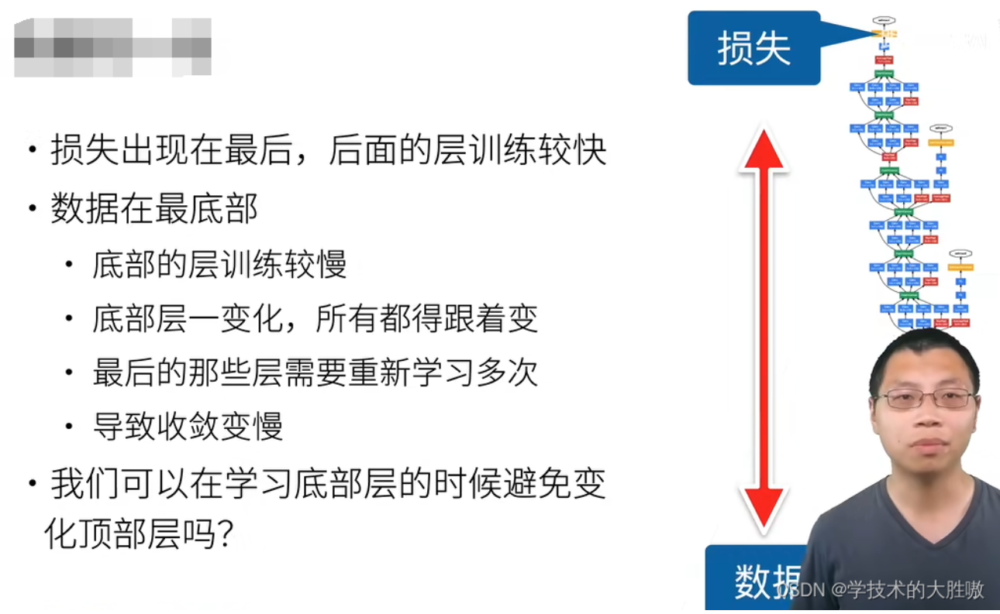

# 归一化

* [批量归一化（BN）和层归一化（LN）的区别_层归一化和批量归一化区别-CSDN博客](https://blog.csdn.net/weixin_44115575/article/details/139418418)

## 为什么需要归一化？

在深度网络中，梯度通过反向传播需要从顶部层逐层传递到底部层。由于链式法则，每传递一层，梯度都会乘以该层权重的导数。如果这些导数较小，梯度会迅速衰减，导致底部层的权重更新非常缓慢，这就是所谓的梯度消失问题。
在深度学习中，底层数据会学习到底层的特征，比如图像的轮廓，顶层数据会学习到高级的特征，比如细腻的纹理等等。高级的纹理特征往往依赖于底层的基础特征，如果底层没有收敛的话，顶层的微调意义并不大。每一次的底层特征变化都会让顶层重新学习，所以底层的收敛慢决定了整个模型的收敛速度慢。
因此需要归一化来让将所有批数据强制在统一的数据分布下，加速收敛。

由于数据来源的不同，不同数据的特征分布是不一致的。模型在训练过程中学习了这个批次的特征分布，如果下一批次的特征分布截然不同，那么模型的参数就会剧烈变化，得学习很多次之后才能平衡好不同特征分布的权重，造成**训练过程变慢**。

- **归一化(Normalization) 方法**：指的是把**不同维度的特征**（例如序列特征或者图像的特征图等）转换为相同或相似的尺度范围内的方法，比如把数据特征映射到[0, 1]或[−1, 1]区间内，或者映射为服从均值为0、方差为1的标准正态分布。
- 那为什么要进行归一化？
  样本特征由于**来源和度量单位的不同或者经过多个卷积层处理后**导致不同来源或者不同[卷积层](https://so.csdn.net/so/search?q=卷积层&spm=1001.2101.3001.7020)的输入特征尺度存在较大差异，模型的优化方向可能会被尺度较大的特征所主导。而进行[归一化](https://so.csdn.net/so/search?q=归一化&spm=1001.2101.3001.7020)可以使得尺度大致处于同一范围内，从而有利于模型的训练和优化。
- BN层(Batch Normalization)：是在不同样本之间进行归一化。
  简单来说，就是针对Batch中的不同样本之间求均值和标准差，再做归一化

- LN层(Layer Normalization)：是在同一样本内部进行归一化。