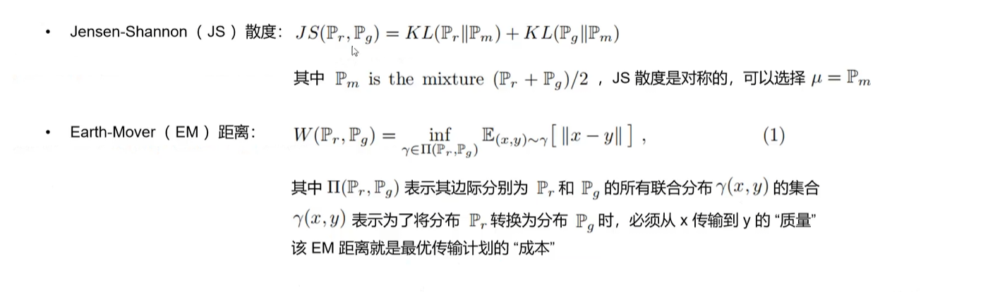
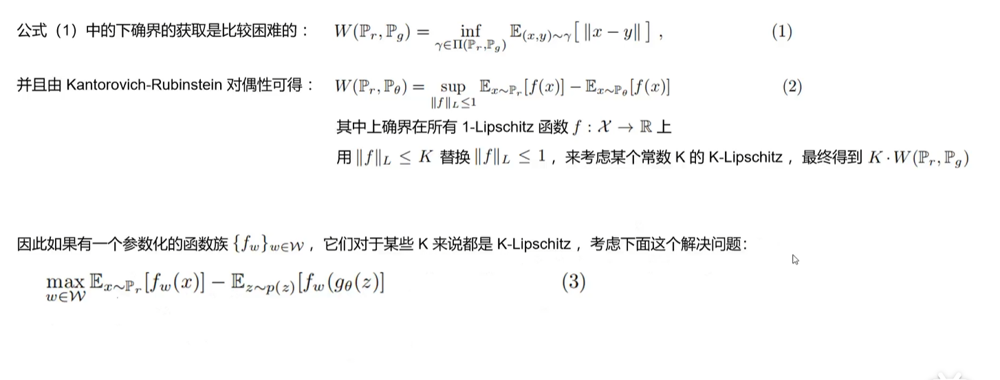

# 基础版可以看原版论文

# WGAN

[Wasserstein GAN （Facebook 2017）_哔哩哔哩_bilibili](https://www.bilibili.com/video/BV1ig4y1r7e4/?spm_id_from=333.337.search-card.all.click&vd_source=677693f6b5fdb5565f3813ddff27c9bf)

inf是下确界

这里利用KR对偶性优化目标修改成了上确界。

