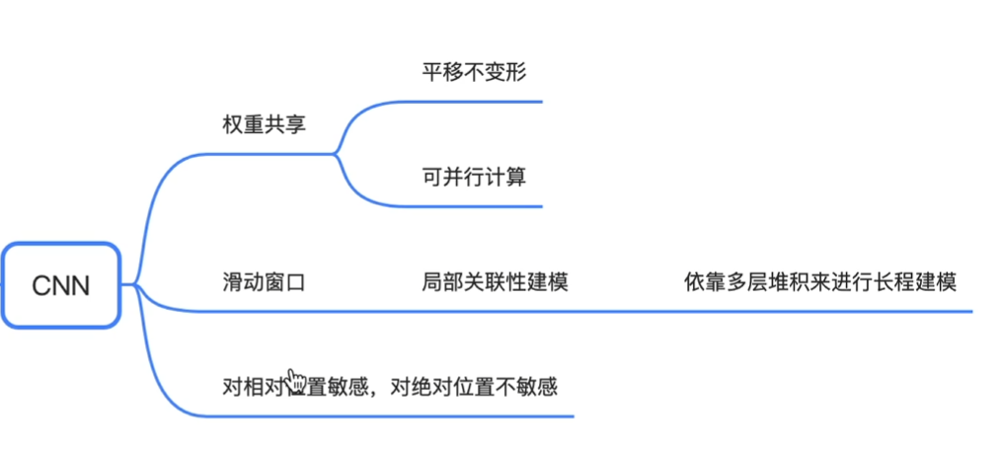
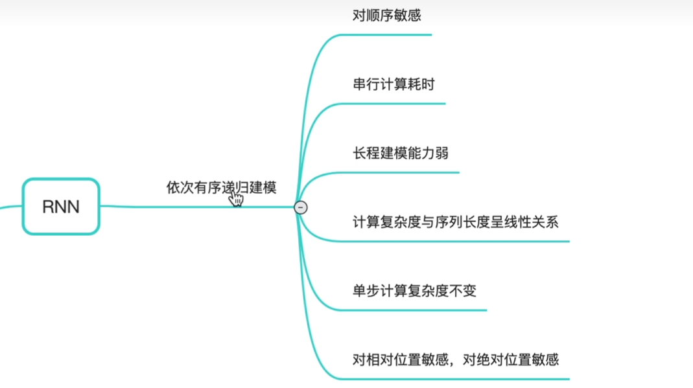
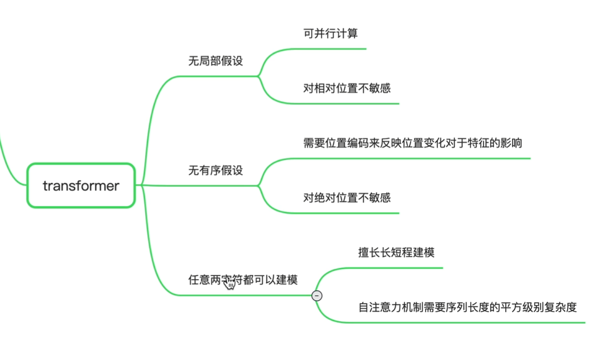
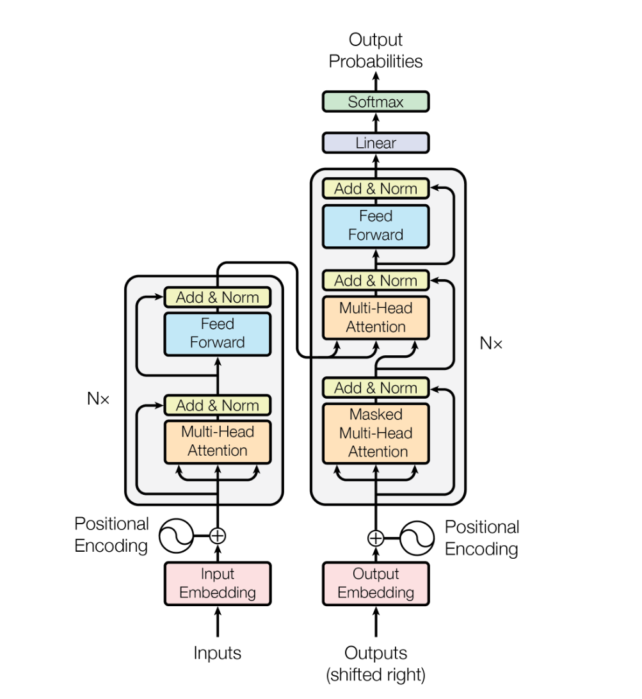
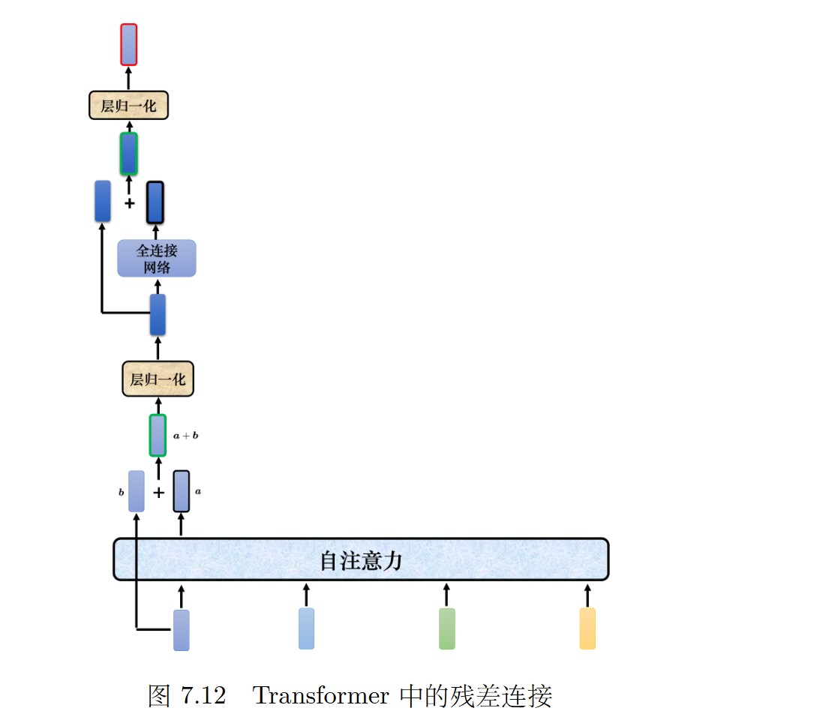
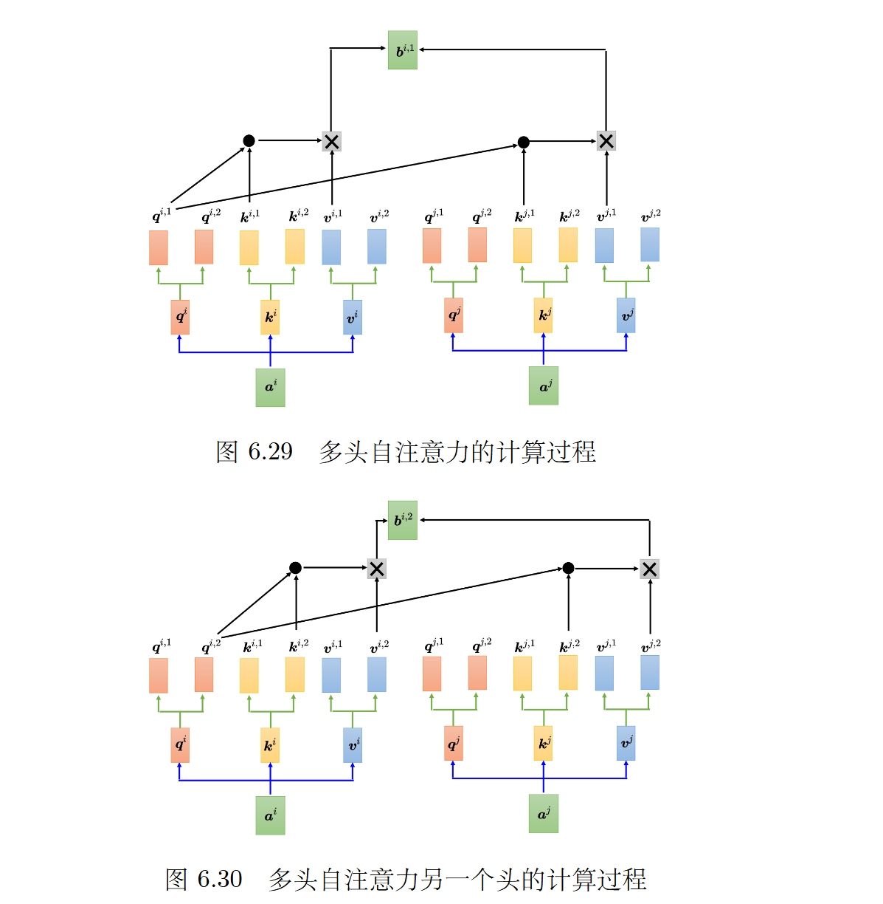
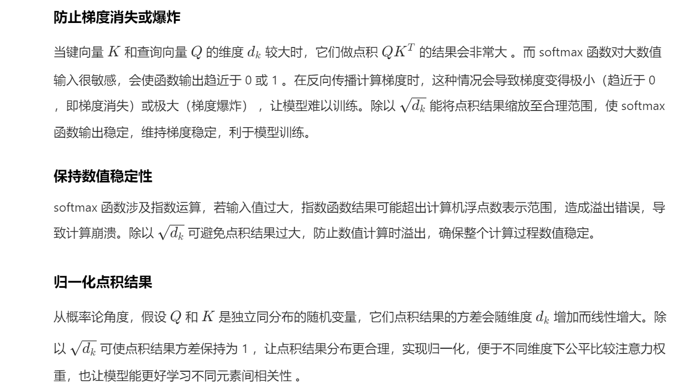

# Paper

> Attention is All you Need







# 参考文档

https://nlp.seas.harvard.edu/2018/04/03/attention.html#attention

# 模型结构







# 注意力

$$
\text{Attention}(Q,K,V)=\text{softmax}\left(\frac{QK^T}{\sqrt{d_k}}\right)V
$$

>  除以$\sqrt{d_k}$为什么？
>
> 

```python
def attention(query, key, value, mask=None, dropout=None):
    "Compute 'Scaled Dot Product Attention'"
    d_k = query.size(-1)
    scores = torch.matmul(query, key.transpose(-2, -1)) \
             / math.sqrt(d_k)
    if mask is not None:
        scores = scores.masked_fill(mask == 0, -1e9) # 在不重要的位置上概率赋值为0，能量无穷小
    p_attn = F.softmax(scores, dim = -1)
    if dropout is not None:
        p_attn = dropout(p_attn)
    return torch.matmul(p_attn, value), p_attn
```

