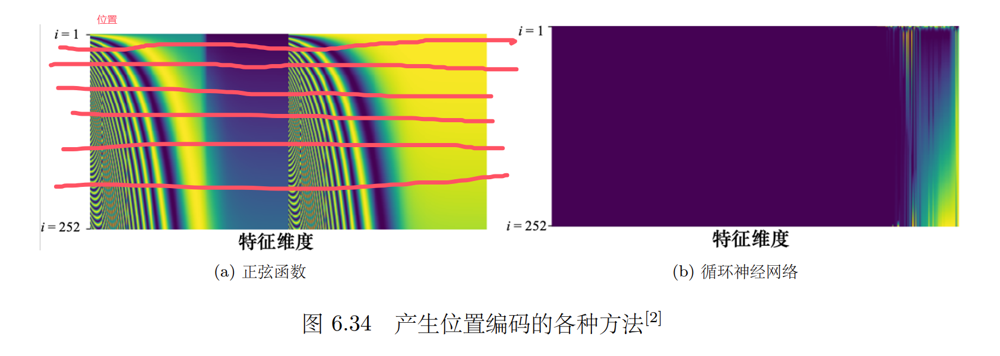

## Seq2Seq模型

**类型1：输入和输出相同的情况。（Sequence Labeling）**


即每一个输出的向量，最后输出都有对应的标签与之对应。

什么样的应用会用到第一种类型的输出呢？举个例子，如图 6.7 所示，在文字处理上，假 设我们要做的是词性标注（Part-Of-Speech tagging，POS tagging）。机器会自动决定每 一个词汇的词性，判断该词是名词还是动词还是形容词等等。这个任务并不是很容易，举个 例子，现在有一个句子：I saw a saw，这句话的意思是我看到一个锯子，第二个 saw 是名词 锯子。所以机器要知道，第一个 saw 是个动词，第二个 saw 是名词，每一个输入的词汇都要有一个对应的输出的词性。这个任务就是输入跟输出的长度是一样的情况，属于第一个类型 的输出。如果是语音，一段声音信号里面有一串向量。每一个向量都要决定它是哪一个音标。 这不是真正的语音识别，这是一个语音识别的简化版。如果是社交网络，给定一个社交网络， 模型要决定每一个节点有什么样的特性，比如某个人会不会买某个商品，这样我们才知道要 不要推荐某个商品给他。以上就是举输入跟输出数量一样的例子，这是第一种可能的输出。


**类型2：输入一组向量，输出一个标签**


举例而言，如图 6.9 所示，输入是文字，比如情感分析。情感分析就是给机器看一段话， 模型要决定说这段话是积极的（positive）还是消极的（negative）。情感分析很有应用价值，假 设公司开发的一个产品上线了，想要知道网友的评价，但又不可能一则一则地分析网友的留 言。而使用情感分析就可以让机器自动去判别当一则贴文里面提到某个产品的时候，它是积 极的还是消极的，这样就可以知道产品在网友心中的评价。给定一整个句子，只需要一个标签 （积极的或消极的）。如果是语音，机器听一段声音，再决定是谁讲的这个声音。如果是图，比 如给定一个分子，预测该分子的亲水性。

**类型3：序列到序列**

还有第 3 个可能的输出：我们不知道应该输出多少个标签，机器要自己决定输出多少个 标签。如下图输入是 N 个向量，输出可能是 N′ 个标签。N′ 是机器自己决定的。这 种任务又叫做序列到序列的任务。翻译就是序列到序列的任务，因为输入输出是不同的语言， 它们的词汇的数量本来就不会一样多。真正的语音识别输入一句话，输出一段文字，其实也是 一个序列到序列的任务。


## 运作原理

以第一个类型为例：

序列标注要给序列里面的每一个向量一个标签。要怎么解决序列标注的问题呢？直觉的 想法就是使用全连接网络。如图 6.11 所示，虽然输入是一个序列，但可以不要管它是不是一 个序列，各个击破，把每一个向量分别输入到全连接网络里面得到输出。这种做法有非常大 的瑕疵，以词性标注为例，给机器一个句子：I saw a saw。对于全连接网络，这个句子中的两 个 saw 完全一模一样，它们是同一个词汇。既然全连接网络输入同一个词汇，它没有理由输 出不同的东西。但实际上，我们期待第一个 saw 要输出动词，第二个 saw 要输出名词。但全 连接网络无法做到这件事，因为这两个 saw 是一模一样的。有没有可能让全连接网络考虑更多的信息，比如上下文的信息呢？这是有可能的，如图 6.12 所示，把每个向量的前后几个向 量都“串”起来，一起输入到全连接网络就可以了。


在语音识别里面，我们不是只看一帧判断这个帧属于哪一个音标，而是看该帧以及其前 后 5 个帧（共 11 个帧）来决定它是哪一个音标。所以可以给全连接网络一整个窗口的信息， 让它可以考虑一些上下文，即与该向量相邻的其他向量的信息。如图 6.13 所示。但是这种的 方法还是有极限的，如果有某一个任务不是考虑一个窗口就可以解决的，而是要考虑一整个序列才能够解决，那要怎么办呢？有人可能会想说这个还不容易，把窗口开大一点啊，大到 可以把整个序列盖住，就可以了。但是序列的长度是有长有短的，输入给模型的序列的长度， 每次可能都不一样。如果要开一个窗口把整个序列盖住，可能要统计一下训练数据，看看训 练数据里面最长序列的长度。接着开一个窗口比最长的序列还要长，才可能把整个序列盖住。 但是开一个这么大的窗口，意味着全连接网络需要非常多的参数，可能不只运算量很大，还容 易过拟合。如果想要更好地考虑整个输入序列的信息，就要用到自注意力模型。


自注意力模型的运作方式如图 6.14 所示，自注意力模型会“吃”整个序列的数据，输入几 个向量，它就输出几个向量。图 6.14 中输入 4 个向量，它就输出 4 个向量。而这 4 个向量都 是考虑整个序列以后才得到的，所以输出的向量有一个黑色的框，代表它不是一个普通的向 量，它是考虑了整个句子以后才得到的信息。接着再把考虑整个句子的向量丢进全连接网络， 再得到输出。因此全连接网络不是只考虑一个非常小的范围或一个小的窗口，而是考虑整个 序列的信息，再来决定现在应该要输出什么样的结果，这就是自注意力模型。


自注意力模型不是只能用一次，可以叠加很多次。如图 6.15 所示，自注意力模型的输出 通过全连接网络以后，得到全连接网络的输出。全连接网络的输出再做一次自注意力模型，再 重新考虑一次整个输入序列的数据，将得到的数据输入到另一个全连接网络，就可以得到最 终的结果。全连接网络和自注意力模型可以交替使用。全连接网络专注于处理某一个位置的 信息，自注意力把整个序列信息再处理一次。有关自注意力最知名的相关的论文是 “Attention Is All You Need”。在这篇论文里面，谷歌提出了 Transformer 网络架构。


自注意力模型的运作过程如图 6.16 所示，其输入是一串的向量，这个向量可能是整个网 络的输入，也可能是某个隐藏层的输出，所以不用 x 来表示它，而用 a 来表示它，代表它有 可能是前面已经做过一些处理，是某个隐藏层的输出。输入一组向量 a，自注意力要输出一组 向量 b，每个 b 都是考虑了所有的 a 以后才生成出来的。b^1^、b^2^、b^3^、b^4^ 是考虑整个输入的 序列 a^1^、a^2^、a^3^、a^4^ 才产生出来的。


接下来介绍下向量 b^1^产生的过程，了解产生向量 b^1^的过程后，剩下向量 b^2^、b^3^、b^4^ 产 生的过程以此类推。怎么产生向量 b^1^呢？如图 6.17 所示，第一个步骤是根据 a^1^找出输入序 列里面跟 a^1^相关的其他向量。自注意力的目的是考虑整个序列，但是又不希望把整个序列所 有的信息包在一个窗口里面。所以有一个特别的机制，这个机制是根据向量 a^1^找出整个很长 的序列里面哪些部分是重要的，哪些部分跟判断 a^1^是哪一个标签是有关系的。每一个向量跟 a^1^的关联的程度可以用数值 α 来表示。自注意力的模块如何自动决定两个向量之间的关联性 呢？给它两个向量 a^1^跟 a^4^，它怎么计算出一个数值 α 呢？我们需要一个计算注意力的模块。 计算注意力的模块使用两个向量作为输入，直接输出数值 α，α 可以当做两个向量的关 联的程度。


怎么计算 α？比较常见的做法是用点积（dot product）。如图 6.18(a) 所示，把输入的两个向量分别乘上两个不同的矩阵，左边这个向量乘上矩阵 $W^q$，右边这个向量乘上矩 阵 $W^k$，得到两个向量 q 跟 k，再把 q 跟 k 做点积，把它们做逐元素（element-wise）的相 乘，再全部加起来以后就得到一个标量（scalar）α，这是一种计算 α 的方式。 其实还有其他的计算方式，如图 6.18(b) 所示，有另外一个叫做相加（additive）的计算 方式，其计算方法就是把两个向量通过 $W^q$、$W^k$得到 q 和 k，但不是把它们做点积，而是把 q 和 k “串”起来“丢”到一个 tanh 函数，再乘上矩阵 $W $得到 α。总之，有非常多不同的方法可 以计算注意力，可以计算关联程度 α。但是在接下来的内容里面，我们都只用点积这个方法， 这也是目前最常用的方法，也是用在 Transformer 里面的方法。


接下来如何把它套用在自注意力模型里面呢？自注意力模型一般采用查询-键-值（QueryKey-Value，QKV）模式。分别计算 a^1^与 a^2^、a^3^、a^4^之间的关联性 α。如图 6.19 所示，把 a^1^ 乘上$ W^q$ 得到 q^1^。q 称为查询（query），它就像是我们使用搜索引擎查找相关文章所使用的关键字，所以称之为查询。

接下来要去把 a^2^、a^3^、a^4^ 乘上 $W^k$ 得到向量 k，向量 k 称为键（key）。把查询 q^1^跟键 k^2^ 算内积（inner-product）就得到 α~1,2~。α~1,2~ 代表查询是 q^1^ 提供的，键是 k^2^ 提供的时候， q^1^跟 k^2^ 之间的关联性。关联性 α 也被称为注意力的分数。计算 q^1^ 与 k^2^ 的内积也就是计算 a ^1^ 与 a ^2^ 的注意力的分数。计算出 a ^1^ 与 a ^2^ 的关联性以后，接下来还需要计算 a ^1^ 与 a ^3^、a ^4^ 的关联性。把 a ^3^ 乘上$ W^k$ 得到键 k ^3^，a ^4^ 乘上 $W^k$ 得到键 k ^4^，再把键 k ^3^ 跟查询 q ^1^ 做内积， 得到 a ^1^ 与 a ^3^ 之间的关联性，即 a ^1^ 跟 a ^3^ 的注意力分数。把 k ^4^ 跟 q ^1^ 做点积，得到 α~1,4~，即 a^1^ 跟 a ^4^ 之间的关联性。


一般在实践的时候，如图 6.20 所示，a^1^ 也会跟自己算关联性，把 a ^1^ 乘上$ W^k$ 得到 k^1^。 用 q^1^ 跟 k^1^ 去计算 a ^1^ 与自己的关联性。计算出 a ^1^ 跟每一个向量的关联性以后，接下来会对 所有的关联性做一个 softmax 操作，如式 (6.3) 所示，把 α 全部取 e 的指数，再把指数的值 全部加起来做归一化（normalize）得到 α ′。这里的 softmax 操作跟分类的 softmax 操作是一 模一样的。


所以本来有一组 α，通过 softmax 就得到一组 α ′。

> Q：为什么要用 softmax？
>
> A：这边不一定要用 softmax，可以用别的激活函数，比如 ReLU。有人尝试使用 ReLU， 结果发现还比 softmax 好一点。所以不一定要用 softmax，softmax 只是最常见的，我 们可以尝试其他激活函数，看能不能试出比 softmax 更好的结果。


得到 α ′ 以后，接下来根据 α ′ 去抽取出序列里面重要的信息。如图 6.21 所示，根据 α 可 知哪些向量跟 a ^1^ 是最有关系的，接下来我们要根据关联性，即注意力的分数来抽取重要的信 息。把向量 a ^1^ 到 a ^4^ 乘上 $W^v$ 得到新的向量：v ^1^、v ^2^、v ^3^ 和 v ^4^，接下来把每一个向量都去 乘上注意力的分数 α ′，再把它们加起来，如式 (6.4) 所示。


如果 a ^1^ 跟 a ^2^ 的关联性很强，即 α ′~1,2~的值很大。在做加权和（weighted sum）以后，得到的 b ^1^ 的值就可能会比较接近 v ^2^，所以谁的注意力的分数最大，谁的 v 就会主导（dominant） 抽出来的结果。这边我们讲述了如何从一整个序列得到 b ^1^。同理，可以计算出 b ^2^ 到 b ^4^。	


如图 6.22 所示。现在已经知道 a ^1^ 到 a ^4^，每一个 a 都要分别产生 q、k 和 v，a ^1^ 要 产生 q ^1^、k ^1^、v ^1^，a ^2^ 要产生 q ^2^、k ^2^ 和 v ^2^，以此类推。如果要用矩阵运算表示这个操作，每 一个 a ^i^都乘上一个矩阵 $W^q$ 得到 q ^i^，这些不同的 a 可以合起来当作一个矩阵。什么意思呢？ a ^1^ 乘上 $W^q$ 得到 q ^1^，a ^2^ 也乘上 $W^q $得到 q ^2^，以此类推。把 a ^1^ 到 a ^4^ 拼起来可以看作是一 个矩阵 $I$，矩阵 $I$ 有四列，它的列就是自注意力的输入：a ^1^ 到 a ^4^。把矩阵 $I $乘上矩阵 $W^q$ 得到 $Q$。$W^q$ 是网络的参数，$Q $的四个列就是 q ^1^ 到 q ^4^。 产生 k 和 v 的操作跟 q 是一模一样的，a 乘上 $W^k$ 就会得到键 k。把 $I$ 乘上矩阵 $W^k$， 就得到矩阵 $K$。$K$ 的 4 个列就是 4 个键：k ^1^ 到 k ^4^。$I $乘上矩阵 $W^v$ 会得到矩阵 V 。矩阵 V 的 4 个列就是 4 个向量 v ^1^ 到 v ^4^。因此把输入的向量序列分别乘上三个不同的矩阵可得到q、k 和 v。


如图 6.23 所示，下一步是每一个 q 都会去跟每一个 k 去计算内积，去得到注意力的分数，先计算 q ^1^ 的注意力分数。


如图 6.24 所示，如果从矩阵操作的角度来看注意力计算这个操作，把 q ^1^ 跟 k ^1^ 做内积， 得到 α~1,1~。q ^1^乘上 (k ^1^ )^T^，也就是 q ^1^ 跟 k ^1^ 做内积。同理，α~1,2~ 是 q ^1^ 跟 k ^2^ 做内积，α~1,3~ 是 q ^1^ 跟 k ^3^ 做内积，α~1,4~ 就是 q ^1^ 跟 k ^4^做内积。这四个步骤的操作，其实可以把它拼起来，看 作是矩阵跟向量相乘。q ^1^乘 k ^1^，q ^1^ 乘 k ^2^，q ^1^ 乘 k ^3^，q ^1^ 乘 k ^4^ 这四个动作，可以看作是把 (k ^1^) ^T^ 到 (k ^4^ ) ^T^拼起来当作是一个矩阵的四行，把这个矩阵乘上 q ^1^ 可得到注意力分数的矩阵， 矩阵的每一行都是注意力的分数，即 α~1,1~ 到 α~1,4~。


不只是 q ^1^ 要对 k ^1^ 到 k ^4^ 计算注意力，q ^2^ 也要对 k ^1^ 到 k ^4^ 计算注意力。 我们把 q ^2^也乘上 k ^1^ 到 k ^4^，得到 α~2,1~ 到 α~2,4~。现在的操作是一模一样的，把 q ^3^ 乘 k ^1^ 到 k ^4^，把 q ^4^ 乘上 k ^1^ 到 k ^4^ 可以得到注意力的分数。


如图 6.26 所示，通过两个矩阵的相乘就得到注意力的分数。一个矩阵的行就是 $k$，即 k ^1^ 到 k ^4^。另外一个矩阵的列就是 q，即 q ^1^ 到 q ^4^。把 k 所形成的矩阵 K^T^ 乘上 q 所形成的矩 阵 $Q$ 就得到这些注意力的分数。假设 K 的列是 k ^1^ 到 k ^4^，在这边相乘的时候，要对矩阵 K 做一下转置得到 K^T^，K^T^ 乘上 $Q$ 就得到矩阵 $A$，$A $里面存的就是 Q 跟 K 之间的注意力 的分数。对注意力的分数做一下归一化（normalization），比如使用 $softmax$，对 A 的每一列 做 softmax，让每一列里面的值相加是 1。softmax 不是唯一的选项，完全可以选择其他的操 作，比如 ReLU 之类的，得到的结果也不会比较差。由于把 α 做 softmax 操作以后，它得到 的值有异于 α 的原始值，所以用 A ′ 来表示通过 softmax 以后的结果。


如图 6.27 所示，计算出 A ′ 以后，需要把 v ^1^ 到 v ^4^ 乘上对应的 α 再相加得到 b。如果 把 v ^1^ 到 v ^4^ 当成是矩阵 $V$ 的 4 个列拼起来，则把 A ′ 的第一个列乘上 $V$ 就得到 b ^1^，把 A ′ 的第二个列乘上 $V$ 得到 b ^2^，以此类推。所以等于把矩阵 A ′ 乘上矩阵 $V$ 得到矩阵 $O$。矩阵 $O$ 里面的每一个列就是自注意力的输出 b ^1^ 到 b ^4^。所以整个自注意力的操作过程可分为以下 步骤，先产生了 q、k 和 v，再根据 q 去找出相关的位置，然后对 v 做加权和。这一串操作 就是一连串矩阵的乘法。


如图 6.28 所示，自注意力的输入是一组的向量，将这排向量拼起来可得到矩阵 $I$。输入 $I$ 分别乘上三个矩阵：$W^q$、$W^k$ 跟 $W^v$ ，得到三个矩阵 Q、K 和 V 。接下来 Q 乘上 K^T^,得到矩阵 A。把矩阵 A 做一些处理可得到 A ′，A ′ 称为注意力矩阵（attention matrix）。把 A ′ 再乘上 V 就得到自注意力层的输出 O。自注意力的操作较为复杂，但自注意力层里面唯 一需要学的参数就只有 $W^q$、$W^k$ 跟 $W^v$。只有 $W^q$、$W^k$、$W^v$ 是未知的，需要通过训练数 据把它学习出来的。其他的操作都没有未知的参数，都是人为设定好的，都不需要通过训练数 据学习。


## 多头注意力

自注意力有一个进阶的版本——多头自注意力（multi-head self-attention）。多头自注 意力的使用是非常广泛的，有一些任务，比如翻译、语音识别，用比较多的头可以得到比较好 的结果。至于需要用多少的头，这个又是另外一个超参数，也是需要调的。

为什么会需要比较多的头呢？在使用自注意力计算相关性的时候，就是用 q 去找相关的 k。但是相关有很多种 不同的形式，所以也许可以有多个 q，不同的 q 负责不同种类的相关性，这就是多头注意力。 

如图 6.29 所示，先把 a 乘上一个矩阵得到 q，接下来再把 q 乘上另外两个矩阵，分别得到 q ^1^、q ^2^。用两个上标，q ~i,1~ 跟 q ~i,2~ 代表有两个头，i 代表的是位置，1 跟 2 代表是这个位置的 第几个 q，这个问题里面有两种不同的相关性，所以需要产生两种不同的头来找两种不同的相 关性。


既然 q 有两个，k 也就要有两个，v 也就要有两个。怎么从 q 得到 q ^1^、q ^2^，怎么从 k 得到 k ^1^、k ^2^，怎么从 v 得到 v ^1^、v ^2^？

其实就是把 q、k、v 分别乘上两个矩阵，得到不同的 头。对另外一个位置也做一样的事情，另外一个位置在输入 a 以后，它也会得到两个 q、两 个 k、两个 v。接下来怎么做自注意力呢，跟之前讲的操作是一模一样的，只是现在 1 那一 类的一起做，2 那一类的一起做。也就是 q ^1^ 在算这个注意力的分数的时候，就不要管 k ^2^ 了， 它就只管 k ^1^ 就好。q ~i,1~ 分别与 k ~i,1~、k ~j,1~ 算注意力，在做加权和的时候也不要管 v ^2^ 了，看 v ~i,1~ 跟 v ~j,1~ 就好，把注意力的分数乘 v~i,1~ 和 v ~j,1~，再相加得到 b ~i,1~，这边只用了其中一个头。 如图 6.30 所示，我们可以使用另外一个头做相同的事情。q ^2^ 只对 k ^2^ 做注意力，在做加 权和的时候，只对 v ^2^ 做加权和得到 b ~i,2~。如果有多个头，如 8 个头、16 个头，操作也是一样 的。 


如图 6.31 所示，得到 b ~i,1~ 跟 b ~i,2~，可能会把 b ~i,1~ 跟 b ~i,2~ 接起来，再通过一个变换，即再 乘上一个矩阵然后得到 b ^i^，再送到下一层去，这就是自注意力的变形——多头自注意力。


## 位置编码

讲到目前为止，自注意力层少了一个也许很重要的信息，即位置的信息。对一个自注意力 层而言，每一个输入是出现在序列的最前面还是最后面，它是完全没有这个信息的。有人可能 会问：输入不是有位置 1、2、3、4 吗？但 1、2、3、4 是作图的时候，为了帮助大家理解所标 上的一个编号。对自注意力而言，位置 1、位置 2、位置 3 跟位置 4 没有任何差别，这四个位 置的操作是一模一样的。对它来说，q 1 跟 q 4 的距离并没有特别远，1 跟 4 的距离并没有特别 远，2 跟 3 的距离也没有特别近，对它来说就是天涯若比邻，所有的位置之间的距离都是一样 的，没有谁在整个序列的最前面，也没有谁在整个序列的最后面。但是这可能会有一个问题：

**位置的信息被忽略了**，而有时候位置的信息很重要。举个例子，在做词性标注的时候，我们知 道动词比较不容易出现在句首，如果某一个词汇它是放在句首的，它是动词的可能性就比较 低，位置的信息往往也是有用的。可是到目前为止，自注意力的操作里面没有位置的信息。因 此做自注意力的时候，如果我们觉得位置的信息很重要，需要考虑位置信息时，就要用到位置 编码（positional encoding）。

如图 6.32 所示，位置编码为每一个位置设定一个向量，即位 置向量（positional vector）。位置向量用 e ^i^ 来表示，上标 i 代表位置，不同的位置就有不同 的向量，不同的位置都有一个专属的 e，把 e 加到 a ^i^ 上面就结束了。这相当于告诉自注意力 位置的信息，如果看到 a ^i^ 被加上 e ^i^，它就知道现在出现的位置应该是在 i 这个位置。	


最早的 Transformer 论文 “Attention Is All You Need” 用的 e ^i^ 如图 6.33 所示。图上面每 一列就代表一个 e，第一个位置就是 e ^1^，第二个位置就是 e ^2^，第三个位置就是 e ^3^，以此类推。 每一个位置的 a 都有一个专属的 e。模型在处理输入的时候，它可以知道现在的输入的位置 的信息，这个位置向量是人为设定的。人为设定的向量有很多问题，假设在定这个向量的时候 只定到 128，但是序列的长度是 129，怎么办呢？在最早的 “Attention Is All You Need” 论文 中，其位置向量是通过正弦函数和余弦函数所产生的，避免了人为设定向量固定长度的尴尬。


> Q：为什么要通过正弦函数和余弦函数产生向量，有其他选择吗？为什么一定要这样产 生手工的位置向量呢？
>
> A：不一定要通过正、余弦函数来产生向量，我们可以提出新的方法。此外，不一定 要这样产生手工的向量，位置编码仍然是一个尚待研究的问题，甚至位置编码是可以 根据数据学出来的。有关位置编码，可以参考论文 “Learning to Encode Position for Transformer with Continuous Dynamical Model”，该论文比较了不同的位置编码方法 并提出了新的位置编码。

如图 6.34a 所示，最早的位置编码是用正弦函数所产生的（每一个红线表示一列），图 6.34a 中每一行代表一个位 置向量。如图 6.34b 所示，位置编码还可以使用循环神经网络生成。总之，位置编码可通过各 种不同的方法来产生。目前还不知道哪一种方法最好，这是一个尚待研究的问题。所以不用纠 结为什么正弦函数最好，我们永远可以提出新的做法。



## 截断自注意力

自注意力的应用很广泛，在自然语言处理（Natural Language Processing，NLP）领 域，除了 Transformer，还有 BERT 也用到了自注意力，所以自注意力在自然语言处理上面 的应用是大家都较为熟悉的，但自注意力不是只能用在自然语言处理相关的应用上，它还可 以用在很多其他的问题上。

比如在做语音的时候，也可以用自注意力。不过将自注意力用于语 音处理时，可以对自注意力做一些小小的改动。 举个例子，如果要把一段声音信号表示成一组向量，这排向量可能会非常长。在做语音识 别的时候，把声音信号表示成一组向量，而每一个向量只代表了 10 毫秒的长度而已。所以如 果是 1 秒钟的声音信号，它就有 100 个向量了，5 秒钟的声音信号就有 500 个向量，随便讲 一句话都是上千个向量了。所以一段声音信号，通过向量序列描述它的时候，这个向量序列 的长度是非常大的。非常大的长度会造成什么问题呢？在计算注意力矩阵的时候，其复杂度 （complexity）是长度的平方。

假设该矩阵的长度为 L，计算注意力矩阵 A ′ 需要做 L × L 次 的内积，如果 L 的值很大，计算量就很巨大，并且需要很大内存（memory）才能够把该矩阵 存下来。所以如果在做语音识别的时候，我们讲一句话，这一句话所产生的这个注意力矩阵可 能会太大，大到不容易处理，不容易训练， 截断自注意力（truncated self-attention）可以处理向量序列长度过大的问题。截断自 注意力在做自注意力的时候不要看一整句话，就只看一个小的范围就好，这个范围是人设定 的。在做语音识别的时候，如果要辨识某个位置有什么样的音标，这个位置有什么样的内容，并不需要看整句话，只要看这句话以及它前后一定范围之内的信息，就可以判断。

在做自注意 力的时候，也许没有必要让自注意力考虑一整个句子，只需要考虑一个小范围就好，这样就可 以加快运算的速度。这就是截断自注意力。


## 自注意力与卷积神经网络对比

自注意力还可以被用在图像上。到目前为止，在提到自注意力的时候，自注意力适用的范 围是输入为一组向量的时候。一张图像可以看作是一个向量序列，如图 6.36 所示，一张分辨 率为 5 × 10 的图像（图 6.36a）可以表示为一个大小为 5 × 10 × 3 的张量（图 6.36b），3 代 表 RGB 这 3 个通道（channel），每一个位置的像素可看作是一个三维的向量，整张图像是 5 × 10 个向量。


所以可以换一个角度来看图像，图像其实也是一个向量序列，它既然也是一 个向量序列，完全可以用自注意力来处理一张图像。自注意力在图像上的应用，读者可以参 考 “Self-Attention Generative Adversarial Networks” 和 “End-to-End Object Detection with Transformers” 这两篇论文。

自注意力跟卷积神经网络之间有什么样的差异或者关联? 如图 6.37(a) 所示，如果用自注 意力来处理一张图像，假设红色框内的“1”是要考虑的像素，它会产生查询，其他像素产生键。在做内积的时候，考虑的不是一个小的范围，而是整张图像的信息。如图 6.37(b) 所示，在做 卷积神经网络的时候，卷积神经网络会“画”出一个感受野，每一个滤波器，每一个神经元，只 考虑感受野范围里面的信息。所以如果我们比较卷积神经网络跟自注意力会发现，卷积神经 网络可以看作是一种简化版的自注意力，因为在做卷积神经网络的时候，只考虑感受野里面 的信息。而在做自注意力的时候，会考虑整张图像的信息。在卷积神经网络里面，我们要划定 感受野。每一个神经元只考虑感受野里面的信息，而感受野的大小是人决定的。而用自注意力 去找出相关的像素，就好像是感受野是自动被学出来的，网络自己决定感受野的形状。网络决 定说以这个像素为中心，哪些像素是真正需要考虑的，哪些像素是相关的，所以感受野的范围 不再是人工划定，而是让机器自己学出来。关于自注意力跟卷积神经网络的关系，读者可以读 论文 “On the Relationship between Self-attention and Convolutional Layers”，这篇论文里面 会用数学的方式严谨地告诉我们，**卷积神经网络就是自注意力的特例**。


自注意力只要设定合适的参数，就可以做到跟卷积神经网络一模一样的事情。卷积神经 网络的函数集（function set）与自注意力的函数集的关系如图 6.38 所示。所以自注意力是更 灵活的卷积神经网络，而卷积神经网络是受限制的自注意力。自注意力只要通过某些设计、某 些限制就会变成卷积神经网络。


既然卷积神经网络是自注意力的一个子集，说明自注意力更灵活。**更灵活的模型需要更 多的数据。如果数据不够，就有可能过拟合。而比较有限制的模型，它适合在数据少的时候使 用，它可能比较不会过拟合。**如果限制设的好，也会有不错的结果。谷歌的论文 “An Imageis Worth 16x16 Words: Transformers for Image Recognition at Scale” 把自注意力应用在图 像上面，把一张图像拆成 16 × 16 个图像块（patch），它把每一个图像块就想像成是一个字 （word）。因为一般自注意力比较常用在自然语言处理上面，所以我们可以想像每一个图像块 就是一个字。如图 6.39 所示，横轴是训练的图像的量，对谷歌来说用的所谓的数据量比较少， 也是我们没有办法用的数据量。这边有 1000 万张图，是数据量比较小的设置（setting），数 据量比较大的设置呢，有 3 亿张图像。在这个实验里面，自注意力是浅蓝色的这一条线，卷 积神经网络是深灰色的这条线。随着数据量越来越多，自注意力的结果越来越好。最终在数据 量最多的时候，自注意力可以超过卷积神经网络，但在数据量少的时候，卷积神经网络是可以 比自注意力得到更好的结果的。自注意力的弹性比较大，所以需要比较多的训练数据，训练 数据少的时候就会过拟合。而卷积神经网络的弹性比较小，在训练数据少的时候结果比较好。 但训练数据多的时候，它没有办法从更大量的训练数据得到好处。这就是自注意力跟卷积神 经网络的比较。

> Q：自注意力跟卷积神经网络应该选哪一个？ 
>
> A：事实上可以都用，比如 conformer 里面同时用到了自注意力和卷积神经网络。


## 自注意力与循环神经网络

我们来比较一下自注意力跟循环神经网络。目前，循环神经网络的角色很大一部分都可 以用自注意力来取代了。但循环神经网络跟自注意力一样，都是要处理输入是一个序列的状 况。如图 6.40b 所示，在循环神经网络里面有一个输入序列、一个隐状态的向量、一个循环神 经网络的块（block）。循环神经网络的块“吃”记忆的向量，输出一个东西。这个东西会输入全 连接网络来进行预测。

> 循环神经网络中的隐状态存储了历史信息，可以看作一种记忆（Memory）。

接下来当第二个向量作为输入的时候，前一个时间点“吐”出来的东西也会作为输入丢进 循环神经网络里面产生新的向量，再拿去给全连接网络。输入第三个向量时，第三个向量跟前 一个时间点的输出，一起丢进循环神经网络再产生新的输出。输入第四个向量输入时，把第四 个向量跟前一个时间点产生出来的输出再一起做处理，得到新的输出再通过全连接网络的层， 这就是循环神经网络。

如图 6.40(a) 所示，循环神经网络的输入都是一个向量序列。自注意力 输出是一个向量序列，该序列中的每一个向量都考虑了整个输入序列，再输入到全连接网络 去做处理。循环神经网络也会输出一组向量，这排向量也会给全连接网络做进一步的处理。 自注意力跟循环神经网络有一个显而易见的不同，自注意力的每一个向量都考虑了整个输 入的序列，而循环神经网络的每一个向量**只考虑了左边已经输入的向量，它没有考虑右边的向 量**。但循环神经网络也可以是双向的，所以如果用双向循环神经网络（Bidirectional Recurrent Neural Network，Bi-RNN），那么每一个隐状态的输出也可以看作是考虑了整个输入的序列。 但是假设把循环神经网络的输出跟自注意力的输出拿来做对比，就算使用双向循环神经 网络还是有一些差别的。

如图 6.40(b) 所示，对于循环神经网络，如果最右边黄色的向量要 考虑最左边的输入，它就必须把最左边的输入存在记忆里面，才能不“忘掉”，一路带到最右 边，才能够在最后一个时间点被考虑。但自注意力输出一个查询，输出一个键，只要它们匹配 （match）得起来，“天涯若比邻”。自注意力可以轻易地从整个序列上非常远的向量抽取信息。

 自注意力跟循环神经网络还有另外一个更主要的不同是，循环神经网络在处理输入、输 出均为一组序列的时候，是没有办法并行化的。比如计算第二个输出的向量，不仅需要第二 个输入的向量，还需要前一个时间点的输出向量。当输入是一组向量，输出是另一组向量的 时候，循环神经网络无法并行处理所有的输出，但自注意力可以。自注意力输入一组向量，输 出的时候，每一个向量是同时并行产生的，因此在运算速度上，自注意力会比循环神经网络 更有效率。很多的应用已经把循环神经网络的架构逐渐改成自注意力的架构了。如果想要更 进一步了解循环神经网络跟自注意力的关系，可以阅读论文 “Transformers are RNNs: Fast Autoregressive Transformers with Linear Attention”。


## 自注意力与图

图也可以看作是一堆向量，如果是一堆向量，就可以用自注意力来处理。但把自注意力用 在图上面，会有些地方不一样。图中的每一个节点（node）可以表示成一个向量。但我们不只 有节点的信息，还有边（edge）的信息。如果节点之间是有相连的，这些节点也就是有关联的。 之前在做自注意力的时候，所谓的关联性是网络自己找出来的。但是现在既然有了图的信息， 关联性就不需要机器自动找出来，图上面的边已经暗示了节点跟节点之间的关联性。所以当 把自注意力用在图上面的时候，我们可以在计算注意力矩阵的时候，只计算有边相连的节点 就好。

举个例子，如图 6.41 所示，在这个图上，节点 1 只和节点 5、6、8 相连，因此只需要计算节点 1 和节点 5、节点 6、节点 8 之间的注意力分数；节点 2 之和节点 3 相连，因此只需 要计算节点 2 和节点 3 之间的注意力的分数，以此类推。如果两个节点之间没有相连，这两 个节点之间就没有关系。既然没有关系，就不需要再去计算它的注意力分数，直接把它设为 0 就好了。因为图往往是人为根据某些领域知识（domain knowledge）建出来的，所以从领域知 识可知这两个向量之间没有关联，就没有必要再用机器去学习这件事情。当把自注意力按照 这种限制用在图上面的时候，其实就是一种图神经网络（Graph Neural Network，GNN）。


## 自注意力变形

自注意力有非常多的变形，论文 “Long Range Arena: A Benchmark for Efficient Transformers” 里面比较了各种不同的自注意力的变形。自注意力最大的问题是其运算量非常大，如 何减少自注意力的运算量是未来可研究的重点方向。自注意力最早是用在 Transformer 上面， 所以很多人讲 Transformer 的时候，其实指的是自注意力。有人说广义的 Transformer 指的就 是自注意力，所以后来各种的自注意力的变形都叫做是 xxformer，比如 Linformer、Performer、 Reformer 等等。这些新的 xxformer 往往比原来的 Transformer 性能差一点，但是速度会比较 快。论文 “Efficient Transformers: A Survey” 介绍了各种自注意力的变形。

## 加性注意力与点积注意力

正如上面提到的，softmax操作用于输出一个概率分布作为注意力权重。 在某些情况下，并非所有的值都应该被纳入到注意力汇聚中。

为了仅将有意义的词元作为值来获取注意力汇聚， 可以指定一个有效序列长度（即词元的个数）， 以便在计算softmax时过滤掉超出指定范围的位置。 下面的masked_softmax函数 实现了这样的掩蔽softmax操作（masked softmax operation）， 其中任何超出有效长度的位置都被掩蔽并置为0。

```python
def sequence_mask(X, valid_len, value=0):
    """在序列中屏蔽不相关的项"""
    maxlen = X.size(1)
    mask = torch.arange((maxlen), dtype=torch.float32, device=X.device)[None, :] < valid_len[:, None]
    X[~mask] = value
    return X
#@save
'''
masked_softmax的意思就相当于只考虑前valid_lens的数据。
比如说NLP中，为了保持句子的长度相等，对于短句子，在后面打padding，
但是这些padding对最后的结果是没有作用的，因此，在最后计算q-k的时候，
这部分就可以不考虑。
这里其实就是提前告诉你，某一个样本前valid_lens是有效的。
'''
def masked_softmax(X, valid_lens):
    """通过在最后一个轴上掩蔽元素来执行softmax操作"""
    # X:3D张量，valid_lens:1D或2D张量
    if valid_lens is None:
        return nn.functional.softmax(X, dim=-1)
    else:
        shape = X.shape
        if valid_lens.dim() == 1:
            valid_lens = torch.repeat_interleave(valid_lens, shape[1])
        else:
            valid_lens = valid_lens.reshape(-1)
        # 最后一轴上被掩蔽的元素使用一个非常大的负值替换，从而其softmax输出为0
        X = sequence_mask(X.reshape(-1, shape[-1]), valid_lens,
                              value=-1e6)
        return nn.functional.softmax(X.reshape(shape), dim=-1)
```

为了演示此函数是如何工作的， 考虑由两个2×4矩阵表示的样本， 这两个样本的有效长度分别为2
和3。 经过掩蔽softmax操作，超出有效长度的值都被掩蔽为0。


### 加性注意力


```python
class AdditiveAttention(nn.Module):
    '''加性注意力'''
    def __init__(self, key_size, query_size, num_hiddens, dropout, **Kwargs):
        super(AdditiveAttention, self).__init__(**Kwargs)
        self.W_k = nn.Linear(key_size, num_hiddens, bias=False)
        self.W_q = nn.Linear(query_size, num_hiddens, bias=False)
        self.w_v = nn.Linear(num_hiddens, 1, bias=False)
        self.dropout = nn.Dropout(dropout)

    def forward(self, queries, keys, values, valid_lens):
        queries, keys = self.W_q(queries), self.W_k(keys)
        print(queries.shape + keys.shape)
        features = queries.unsqueeze(2) + keys.unsqueeze(1)
        print(features.shape)
        features = torch.tanh(features)
        print(features.shape)
        scores = self.w_v(features).squeeze(-1)
        print(scores.shape)
        self.attention_weights = masked_softmax(scores, valid_lens)
        print(self.attention_weights.shape)
        return torch.bmm(self.dropout(self.attention_weights), values)
```

> **对于` queries, keys = self.W_q(queries), self.W_k(keys)`的维度变换**

在加性注意力机制中，`queries` 和 `keys` 的维度扩展是为了让每个查询（query）能够与所有的键（key）进行交互，从而计算出每个查询与所有键之间的相似度分数。为了实现这一点，我们需要确保广播机制（broadcasting mechanism）可以正确地应用，这通常涉及到增加新的维度。

假设原始的 `queries` 和 `keys` 都是三维张量，其形状分别为 `(batch_size, num_queries, query_size)` 和 `(batch_size, num_keys, key_size)`。这里：

- `batch_size` 是批量大小；
- `num_queries` 是查询的数量；
- `query_size` 是每个查询的特征维度；
- `num_keys` 是键的数量；
- `key_size` 是每个键的特征维度。

经过线性变换之后，`queries` 和 `keys` 的形状变为 `(batch_size, num_queries, num_hiddens)` 和 `(batch_size, num_keys, num_hiddens)`，其中 `num_hiddens` 是隐藏层的维度，也就是线性变换后的输出维度。

接下来，在进行维度扩展之前，我们先对 `queries` 和 `keys` 应用了线性变换以将它们映射到相同的空间中（即相同的 `num_hiddens` 维度），这样它们就可以直接相加了。

**扩展维度**

`unsqueeze` 方法

`queries.unsqueeze(2)`：在 `queries `的第三个维度（索引为2）插入一个新的轴，使得其形状从 `(batch_size, num_queries, num_hiddens)` 变为` (batch_size, num_queries, 1, num_hiddens)`。
`keys.unsqueeze(1)`：在 keys 的第二个维度（索引为1）插入一个新的轴，使得其形状从 `(batch_size, num_keys, num_hiddens)` 变为` (batch_size, 1, num_keys, num_hiddens)`。

- 对于 `queries`，我们在第三个维度上添加了一个新轴，使得其形状变为 `(batch_size, num_queries, 1, num_hiddens)`。
- 对于 `keys`，我们在第二个维度上添加了一个新轴，使得其形状变为 `(batch_size, 1, num_keys, num_hiddens)`。

这样做之后，`queries` 中的每个查询都可以与 `keys` 中的所有键通过广播机制进行逐元素相加。广播机制会自动扩展较小的数组，直到两个数组的形状匹配，以便执行逐元素操作。

**广播求和后的结果**

当我们将这两个扩展后的张量相加时，广播机制会导致以下情况：

- `queries` 的形状 `(batch_size, num_queries, 1, num_hiddens)` 将被广播为 `(batch_size, num_queries, num_keys, num_hiddens)`。
- `keys` 的形状 `(batch_size, 1, num_keys, num_hiddens)` 同样会被广播为 `(batch_size, num_queries, num_keys, num_hiddens)`。

因此，最终的结果是一个形状为 `(batch_size, num_queries, num_keys, num_hiddens)` 的张量，表示每个查询与所有键之间的交互结果。这个四维张量中的每一个位置 `(i, j, k, l)` 表示的是第 `i` 个样本中第 `j` 个查询与第 `k` 个键在第 `l` 个隐藏维度上的交互值。

**总结**

简而言之，`queries` 和 `keys` 在进行维度扩展之后的形状分别是 `(batch_size, num_queries, 1, num_hiddens)` 和 `(batch_size, 1, num_keys, num_hiddens)`，而它们相加之后的结果形状为 `(batch_size, num_queries, num_keys, num_hiddens)`。这个过程允许每个查询与所有键进行比较，从而为后续计算注意力权重做准备。

这句代码 `scores = self.w_v(features).squeeze(-1)` 的作用是将加性注意力机制中计算的特征（`features`）转换为注意力分数（`scores`），并调整输出张量的形状。下面我将详细解释这行代码的工作原理以及 `squeeze` 函数的用法。


>  `self.w_v(features)`


1. `self.w_v(features)`

首先，`self.w_v` 是一个线性变换层（`nn.Linear`），它的输入维度是 `num_hiddens`，输出维度是 `1`。这意味着它会对每个隐藏状态应用一个线性变换，并且最终只输出一个标量值（因为输出维度是1）。具体来说：

- 输入 `features` 的形状是 `(batch_size, num_queries, num_keys, num_hiddens)`。
- 经过 `self.w_v` 线性变换后，输出的形状变为 `(batch_size, num_queries, num_keys, 1)`。这里每个查询与每个键之间的交互结果被映射为一个单一的分数，表示它们之间的相关性或匹配度。

2. `.squeeze(-1)`

接下来，`.squeeze(-1)` 函数用于移除最后一个维度（即形状中的 `-1` 或最内层维度），因为它是一个大小为1的单例维度。`squeeze` 函数的作用是从张量的形状中删除所有大小为1的维度，或者指定特定的大小为1的维度来删除。在这个例子中，我们只移除最后一个维度（`-1` 表示最后一维）。

- 移除最后一个维度后，`scores` 的形状变为 `(batch_size, num_queries, num_keys)`。这个形状表示每个查询与所有键之间的注意力分数，其中 `num_queries` 和 `num_keys` 分别对应于查询的数量和键的数量。

3. 最终 `scores` 的维度

因此，经过上述操作之后，`scores` 的最终形状是 `(batch_size, num_queries, num_keys)`，这正是我们希望得到的结果，因为我们需要为每个查询计算出相对于所有键的注意力分数，以便后续使用这些分数来对相应的值进行加权求和。

`self.attention_weights = masked_softmax(scores, valid_lens)`获取经过Softmax之后的注意力权重矩阵


> `torch.bmm(self.dropout(self.attention_weights), values)`的作用

首先，`self.dropout` 是一个 `Dropout` 层，用于在训练期间随机丢弃一部分注意力权重，以防止模型过拟合。`Dropout` 在推理或评估模式下通常会被禁用，因此不会影响最终的输出。

输入：`self.attention_weights`，形状为 `(batch_size, num_queries, num_keys)`。
输出：形状不变，仍然是 `(batch_size, num_queries, num_keys)`，但在训练过程中某些元素可能被设置为0。


为了更好地理解这个加权求和的过程，让我们具体看一下在注意力机制中是如何使用 `torch.bmm` 函数来实现这一操作的。我们将一步步解析计算过程。

背景

- **注意力权重** (`attention_weights`)：形状为 `(batch_size, num_queries, num_keys)` 的张量，表示每个查询对各个键的关注程度。
- **值** (`values`)：形状为 `(batch_size, num_keys, value_dim)` 的张量，表示每个键对应的值向量。

具体的加权求和过程

1. **批量矩阵乘法（Batch Matrix Multiplication）**：

   - 使用 `torch.bmm` 函数对 `attention_weights` 和 `values` 进行批量矩阵乘法。
   - `torch.bmm` 会逐个样本地处理这两个三维张量，并执行矩阵乘法。

2. **矩阵乘法的具体步骤**：

   对于每个样本（假设 `batch_size=1` 以简化说明），我们有：

   - 注意力权重矩阵：形状为 `(num_queries, num_keys)`。
   - 值矩阵：形状为 `(num_keys, value_dim)`。

   矩阵乘法的过程如下：

   - 每个查询（`num_queries` 中的一个）对应一行注意力权重。
   - 每个键（`num_keys` 中的一个）对应一列值。
   - 当你将注意力权重矩阵与值矩阵相乘时，实际上是对于每个查询，将其对所有键的注意力权重分别与相应键的值进行点乘（即元素相乘），然后将这些结果相加。

3. **点乘与求和**：

   - 对于每个查询，它与每个键的注意力权重相乘的结果是一个标量。
   - 将这些标量与相应的值向量相乘，得到一个新的值向量。
   - 最后，将所有这些新的值向量相加，得到一个综合的值向量。

4. **最终输出**：

   - 结果是一个形状为 `(batch_size, num_queries, value_dim)` 的张量。
   - 每个查询现在都有了一个综合考虑了所有键的加权表示。

```python
'''
torch.normal(0, 1, (2, 1, 20)) 创建了一个形状为 (2, 1, 20) 的张量，其元素是从均值为0、标准差为1的正态分布中随机抽取的。
'''
queries, keys = torch.normal(0, 1, (2, 1, 20)), torch.ones((2, 10,2))
'''
生成一个包含从 0 到 39（共40个）的等间距值的一维张量。
将上述一维张量重塑为形状为 (1, 10, 4) 的三维张量。
沿指定维度重复张量的内容。这里，我们将该张量在第一个维度（批次维度）上重复两次，而在其他两个维度上保持不变。
tensor([[[ 0.,  1.,  2.,  3.],
         [ 4.,  5.,  6.,  7.],
         [ 8.,  9., 10., 11.],
         [12., 13., 14., 15.],
         [16., 17., 18., 19.],
         [20., 21., 22., 23.],
         [24., 25., 26., 27.],
         [28., 29., 30., 31.],
         [32., 33., 34., 35.],
         [36., 37., 38., 39.]],

        [[ 0.,  1.,  2.,  3.],
         [ 4.,  5.,  6.,  7.],
         [ 8.,  9., 10., 11.],
         [12., 13., 14., 15.],
         [16., 17., 18., 19.],
         [20., 21., 22., 23.],
         [24., 25., 26., 27.],
         [28., 29., 30., 31.],
         [32., 33., 34., 35.],
         [36., 37., 38., 39.]]])
'''
values = torch.arange(40, dtype=torch.float32).reshape(1, 10, 4).repeat(2, 1, 1)
valid_lens = torch.tensor([2, 6])

attention = AdditiveAttention(key_size=2, query_size=20, num_hiddens=8, dropout=0.1)
attention.eval()
attention(queries, keys, values, valid_lens)
print(attention(queries, keys, values, valid_lens).shape)
```

输出：

```python
torch.Size([2, 1, 8, 2, 10, 8])
torch.Size([2, 1, 10, 8])
torch.Size([2, 1, 10, 8])
torch.Size([2, 1, 10])
torch.Size([2, 1, 10])
torch.Size([2, 1, 8, 2, 10, 8])
torch.Size([2, 1, 10, 8])
torch.Size([2, 1, 10, 8])
torch.Size([2, 1, 10])
torch.Size([2, 1, 10])
torch.Size([2, 1, 4])
```

```python
def show_heatmaps(matrices, xlabel, ylabel, titles=None, figsize=(2.5, 2.5),
                  cmap='Reds'):
    """显示矩阵热图"""
    d2l.use_svg_display()
    num_rows, num_cols = matrices.shape[0], matrices.shape[1]
    fig, axes = d2l.plt.subplots(num_rows, num_cols, figsize=figsize,
                                 sharex=True, sharey=True, squeeze=False)
    for i, (row_axes, row_matrices) in enumerate(zip(axes, matrices)):
        for j, (ax, matrix) in enumerate(zip(row_axes, row_matrices)):
            pcm = ax.imshow(matrix.detach().numpy(), cmap=cmap)
            if i == num_rows - 1:
                ax.set_xlabel(xlabel)
            if j == 0:
                ax.set_ylabel(ylabel)
            if titles:
                ax.set_title(titles[j])
    fig.colorbar(pcm, ax=axes, shrink=0.6);
show_heatmaps(attention.attention_weights.reshape((1, 1, 2, 10)),
                  xlabel='Keys', ylabel='Queries')
```


这里attention.attention_weights.reshape为(2, 1, 10),`valid_lens = torch.tensor([2, 6])`因此第一个样本只关注前2个，后面都变换为0，第二个样本只关注前6个，后面都变为0。

### 缩放点积注意力


```python
class DotProductAttention(nn.Module):
    '''缩放点击注意力'''
    def __init__(self, dropout, **Kwargs):
        super(DotProductAttention, self).__init__(**Kwargs)
        self.dropout = nn.Dropout(dropout)

    def forward(self, queries, keys, values, valid_lens = None):
        d = queries.shape[-1]
        scores = torch.bmm(queries, keys.transpose(1, 2)) / math.sqrt(d)
        self.attention_weights = masked_softmax(scores, valid_lens)
        return torch.bmm(self.dropout(self.attention_weights), values)
```

```python
queries = torch.normal(0, 1, (2, 1, 2))
attention = DotProductAttention(dropout=0.5)
attention.eval()
attention(queries, keys, values, valid_lens)
```

```python
tensor([[[ 2.0000,  3.0000,  4.0000,  5.0000]],

        [[10.0000, 11.0000, 12.0000, 13.0000]]])
```

```python
show_heatmaps(attention.attention_weights.reshape((1, 1, 2, 10)),
                  xlabel='Keys', ylabel='Queries')
```


## 讲注意力机制使用在Seq2Seq模型当中


要预测下一个词的时候，将当前预测出的词作为query，编码器各个状态作为(key,value)，进行attention，来找到对预测下一个词有用的原文

k-v就是编对每一个词的编码器输出，q就是解码器对上一个词的预测输出；

原始的seq2seq问题：


而引入注意力机制之后，编码器的输出是所有文本的加权得到k-v，每次解码器利用最近预测得到的词作为q，从而找到最相近的v，然后再次投入到解码器中的RNN，从而预测得到下一个单词。

导入包

```python
import torch
from torch import nn
from d2l import torch as d2l
```

带有注意力机制的解码器基本接口

```python
class AttentionDecoder(d2l.Decoder):
    def __init__(self, **kwargs):
        super(AttentionDecoder, self).__init__(**kwargs)

    @property
    def attention_weight(self):
        raise NotImplementedError
```

Atttention作用在decoder上，

```python
class Seq2SeqAttentionDecoder(AttentionDecoder):
    def __init__(self, vocab_size, embed_size, num_hiddens, num_layers,
                 dropout=0, **kwargs):
        super(Seq2SeqAttentionDecoder, self).__init__(**kwargs)
        self.attention = d2l.AdditiveAttention(
            num_hiddens, num_hiddens, num_hiddens, dropout)
        self.embedding = nn.Embedding(vocab_size, embed_size)
        self.rnn = nn.GRU(
            embed_size + num_hiddens, num_hiddens, num_layers,
            dropout=dropout)
        self.dense = nn.Linear(num_hiddens, vocab_size)

    def init_state(self, enc_outputs, enc_valid_lens, *args):
        # outputs的形状为(batch_size，num_steps，num_hiddens).
        # hidden_state的形状为(num_layers，batch_size，num_hiddens)
        outputs, hidden_state = enc_outputs
        return (outputs.permute(1, 0, 2), hidden_state, enc_valid_lens)

    def forward(self, X, state):
        # enc_outputs的形状为(batch_size,num_steps,num_hiddens).
        # hidden_state的形状为(num_layers,batch_size,
        # num_hiddens)
        enc_outputs, hidden_state, enc_valid_lens = state
        # 输出X的形状为(num_steps,batch_size,embed_size)
        X = self.embedding(X).permute(1, 0, 2)
        outputs, self._attention_weights = [], []
        for x in X:
            # query的形状为(batch_size,1,num_hiddens)
            query = torch.unsqueeze(hidden_state[-1], dim=1)
            # context的形状为(batch_size,1,num_hiddens)
            context = self.attention(
                query, enc_outputs, enc_outputs, enc_valid_lens)
            # 在特征维度上连结
            x = torch.cat((context, torch.unsqueeze(x, dim=1)), dim=-1)
            # 将x变形为(1,batch_size,embed_size+num_hiddens)
            out, hidden_state = self.rnn(x.permute(1, 0, 2), hidden_state)
            outputs.append(out)
            self._attention_weights.append(self.attention.attention_weights)
        # 全连接层变换后，outputs的形状为
        # (num_steps,batch_size,vocab_size)
        outputs = self.dense(torch.cat(outputs, dim=0))
        return outputs.permute(1, 0, 2), [enc_outputs, hidden_state,
                                          enc_valid_lens]

    @property
    def attention_weights(self):
        return self._attention_weights
```

选取超参数进行测试：

```python
embed_size, num_hiddens, num_layers, dropout = 32, 32, 2, 0.1
batch_size, num_steps = 64, 10
lr, num_epochs, device = 0.005, 250, d2l.try_gpu()

train_iter, src_vocab, tgt_vocab = d2l.load_data_nmt(batch_size, num_steps)
encoder = d2l.Seq2SeqEncoder(
    len(src_vocab), embed_size, num_hiddens, num_layers, dropout)
decoder = Seq2SeqAttentionDecoder(
    len(tgt_vocab), embed_size, num_hiddens, num_layers, dropout)
net = d2l.EncoderDecoder(encoder, decoder)
d2l.train_seq2seq(net, train_iter, lr, num_epochs, tgt_vocab, device)
```


利用得到的模型进行测试：

```python
engs = ['go .', "i lost .", 'he\'s calm .', 'i\'m home .']
fras = ['va !', 'j\'ai perdu .', 'il est calme .', 'je suis chez moi .']
for eng, fra in zip(engs, fras):
    translation, dec_attention_weight_seq = d2l.predict_seq2seq(
        net, eng, src_vocab, tgt_vocab, num_steps, device, True)
    print(f'{eng} => {translation}, ',
          f'bleu {d2l.bleu(translation, fra, k=2):.3f}')
```


查看一下注意力权重：

```python
attention_weights = torch.cat([step[0][0][0] for step in dec_attention_weight_seq], 0).reshape((
    1, 1, -1, num_steps))
# 加上一个包含序列结束词元
def show_heatmaps(matrices, xlabel, ylabel, titles=None, figsize=(2.5, 2.5),
                  cmap='Reds'):
    """显示矩阵热图"""
    d2l.use_svg_display()
    num_rows, num_cols = matrices.shape[0], matrices.shape[1]
    fig, axes = d2l.plt.subplots(num_rows, num_cols, figsize=figsize,
                                 sharex=True, sharey=True, squeeze=False)
    for i, (row_axes, row_matrices) in enumerate(zip(axes, matrices)):
        for j, (ax, matrix) in enumerate(zip(row_axes, row_matrices)):
            pcm = ax.imshow(matrix.detach().numpy(), cmap=cmap)
            if i == num_rows - 1:
                ax.set_xlabel(xlabel)
            if j == 0:
                ax.set_ylabel(ylabel)
            if titles:
                ax.set_title(titles[j])
    fig.colorbar(pcm, ax=axes, shrink=0.6);
show_heatmaps(
    attention_weights[:, :, :, :len(engs[-1].split()) + 1].cpu(),
    xlabel='Key positions', ylabel='Query positions')
```


----

> `self.embedding = nn.Embedding(vocab_size, embed_size)`

在自然语言处理中，输入的单词通常是以索引形式表示的。例如，在一个词汇表大小为 $\text{vocabsize} = 10,000$ 的模型中：

- **单词 "hello"** 的索引可能是 **27**。
- **单词 "world"** 的索引可能是 **42**。

然而，索引本身并没有携带任何关于单词含义或关系的信息。
为了让模型学习到单词之间的 **语义关系**，需要将索引映射到一个连续的、固定维度的向量空间中（Embedding Space）。

`nn.Embedding` 的核心功能是：
将输入的单词索引映射到一个维度为 `embed_size` 的向量。例如：

- 输入：一个索引序列 `X`，形状为 `(batch_size, num_steps)`，其中每个值代表单词索引。
- 输出：通过 `nn.Embedding`，索引被映射为向量，输出形状变为 **(batch_size, num_steps, embed_size)**。

举例：

假设：

- **`batch_size=2`**：2个样本。
- **`num_steps=3`**：每个样本有3个单词。
- **`embed_size=4`**：嵌入向量的维度是4。

```python
X = [[2, 5, 7],
     [1, 3, 4]]  # 形状为 (batch_size=2, num_steps=3)
```

**nn.Embedding 操作**：

通过查找嵌入矩阵 `W`（形状为 `vocab_size x embed_size`）的对应行：

- 输入索引 `2` → 输出向量 `W[2]`，形状为 `(embed_size=4)`。
- 输入索引 `5` → 输出向量 `W[5]`。
- 依次类推。

```python
X_embed = [[[0.1, 0.2, 0.3, 0.4],   # W[2]
            [0.5, 0.6, 0.7, 0.8],   # W[5]
            [0.9, 1.0, 1.1, 1.2]],  # W[7]

           [[0.2, 0.3, 0.4, 0.5],   # W[1]
            [0.6, 0.7, 0.8, 0.9],   # W[3]
            [1.0, 1.1, 1.2, 1.3]]]  # W[4]
```

输出形状为 **(batch_size=2, num_steps=3, embed_size=4)**。

嵌入层中的权重矩阵 `W`（形状为 `vocab_size x embed_size`）是在训练过程中 **自动学习** 的。

它会通过反向传播根据任务目标（例如翻译、文本生成等）来优化，使得单词的嵌入向量能够反映单词的语义和上下文关系。

----

> `self.rnn = nn.GRU(embed_size + num_hiddens, num_hiddens, num_layers, dropout=dropout)`

为什么是`embed_size + num_hiddens`?

**当前时间步的词嵌入向量**（`embed_size`）：

- 由当前时间步输入单词通过嵌入层 `nn.Embedding` 得到。

**注意力上下文向量**（`num_hiddens`）：

- 通过注意力机制得到的、编码器输出的加权求和结果。

序列模型的时间步：

序列任务的输入是一系列有顺序的数据，例如句子中的单词、视频帧、时间序列数据等。

**时间步**：表示序列中数据的第几个元素（或者时间点）。

例如，句子 `"I love learning"` 可以分解为 **3个时间步**：

- **时间步1**：`I`
- **时间步2**：`love`
- **时间步3**：`learning`

在模型中，RNN 会逐个处理这些时间步的数据，每个时间步都会有输入、隐藏状态和输出。

----

> ```python
> def init_state(self, enc_outputs, enc_valid_lens, *args):
>  outputs, hidden_state = enc_outputs
>  return (outputs.permute(1, 0, 2), hidden_state, enc_valid_lens)
> ```
>
> 维度变换过程

 **`enc_outputs` 的形状变换**，从 **`(batch_size, num_steps, num_hiddens)`** 转换到 **`(num_steps, batch_size, num_hiddens)`** 

`enc_outputs` 的初始形状为 **`(batch_size, num_steps, num_hiddens)`**：

- **`batch_size`**：批量大小，即一次输入多少个样本。
- **`num_steps`**：输入序列的长度（即时间步的数量）。
- **`num_hiddens`**：隐藏层的单元数（特征维度）。

**为什么要转换?**

- RNN 或 GRU 在 PyTorch 中要求输入的形状为 `(num_steps, batch_size, feature_dim)`
  - **`num_steps`**：时间步，放在第一个维度。
  - **`batch_size`**：批量大小，放在第二个维度。
  - **`feature_dim`**：特征的维度（如隐藏层大小）。

为了满足 RNN 输入的要求，必须对 `enc_outputs` 进行 **维度置换**。

`torch.Tensor.permute()` 函数可以对张量的维度进行重排。

```python
Tensor.permute(dims)
```

`dims`：一个元组，表示新的维度顺序。

原始张量的维度会按照 `dims` 指定的顺序进行重新排列。

原始形状：**`(batch_size, num_steps, num_hiddens)`**
目标形状：**`(num_steps, batch_size, num_hiddens)`**

为了实现这种转换，使用 **`permute`**：`enc_outputs = enc_outputs.permute(1, 0, 2)`

----

:small_airplane:**前向传播过程**：

好的！我们将逐行分析 `forward` 方法中的 **前向传播过程**，并详细说明变量的**维度转换**。这段代码是一个基于 **注意力机制的 Seq2Seq 解码器**，在每个时间步处理输入单词并利用注意力机制动态聚焦编码器的输出。

**1. 输入参数**

- **`X`**: 解码器的输入序列，形状为 `(batch_size, num_steps)`，每个值是单词的索引。

- `state`

  : 解码器的初始状态，包含：

  - `enc_outputs`：编码器的输出，形状为 `(batch_size, num_steps, num_hiddens)`。
  - `hidden_state`：解码器的隐藏状态，形状为 `(num_layers, batch_size, num_hiddens)`。
  - `enc_valid_lens`：编码器输出的有效长度，用于注意力机制中屏蔽无效的填充部分。

**2. 嵌入层：将单词索引映射为嵌入向量**

```python
X = self.embedding(X).permute(1, 0, 2)
```

- **输入**：`X` 的形状为 `(batch_size, num_steps)`。

- 输出

  ：通过 

  ```
  nn.Embedding
  ```

  ，将索引映射到 

  ```
  embed_size
  ```

   维度的向量，结果形状为：

  - **`(batch_size, num_steps, embed_size)`**。

- 维度变换

  ：使用 

  ```
  .permute(1, 0, 2)
  ```

   调整维度顺序为：

  - **`(num_steps, batch_size, embed_size)`**。

- **原因**：RNN 通常要求输入的时间步维度在第一维，方便逐时间步地处理数据。

**3. 初始化输出和注意力权重列表**

```python
outputs, self._attention_weights = [], []
```

- **`outputs`**：保存每个时间步 RNN 的输出。
- **`self._attention_weights`**：保存每个时间步的注意力权重。

**4. 遍历每个时间步的输入**

```python
for x in X:
```

- **`X`**：形状为 `(num_steps, batch_size, embed_size)`。
- **`x`**：每次取出一个时间步的数据，形状为 `(batch_size, embed_size)`。

**5. 计算注意力机制的上下文向量**

```python
query = torch.unsqueeze(hidden_state[-1], dim=1)
```

- **`hidden_state[-1]`**：取出解码器隐藏状态的最后一层，形状为 `(batch_size, num_hiddens)`。

- `torch.unsqueeze(..., dim=1)`

  ：在第 1 维增加一个维度，结果形状为：

  - **`(batch_size, 1, num_hiddens)`**。

- **`query`**：用于注意力机制的查询向量。

**计算注意力上下文向量**

```python
context = self.attention(
    query, enc_outputs, enc_outputs, enc_valid_lens)
```

- 输入：
  - `query`：形状为 `(batch_size, 1, num_hiddens)`。
  - `enc_outputs`：形状为 `(batch_size, num_steps, num_hiddens)`，作为注意力的 `key` 和 `value`。
  - `enc_valid_lens`：有效长度，用于屏蔽无效的填充部分。
- 输出：
  - **`context`**：上下文向量，形状为 `(batch_size, 1, num_hiddens)`。
- **说明**：注意力机制通过 `query` 对 `key` 和 `value` 进行加权求和，得到动态上下文向量。

**6. 拼接注意力上下文向量与当前时间步输入**

```python
x = torch.cat((context, torch.unsqueeze(x, dim=1)), dim=-1)
```

- **`context`**：形状为 `(batch_size, 1, num_hiddens)`。

- **`x`**：通过 `torch.unsqueeze(x, dim=1)`，增加时间步维度，形状为 `(batch_size, 1, embed_size)`。

- 拼接：在最后一个维度 (

  ```
  dim=-1
  ```

  ) 拼接，结果形状为：

  - **`(batch_size, 1, embed_size + num_hiddens)`**。

**7. 输入 RNN 进行解码**

```python
out, hidden_state = self.rnn(x.permute(1, 0, 2), hidden_state)
```

- `x`：当前时间步输入，形状为 

  ```
  (batch_size, 1, embed_size + num_hiddens)
  ```

  - 使用 `.permute(1, 0, 2)` 调整维度为 `(1, batch_size, embed_size + num_hiddens)`。
  - **原因**：RNN 输入的时间步维度必须在第一维。

- **`hidden_state`**：解码器的隐藏状态，形状为 `(num_layers, batch_size, num_hiddens)`。

- 输出：

  - **`out`**：RNN 的输出，形状为 `(1, batch_size, num_hiddens)`。
  - **`hidden_state`**：更新后的隐藏状态，形状不变 `(num_layers, batch_size, num_hiddens)`。

**8. 保存输出和注意力权重**

```python
outputs.append(out)
self._attention_weights.append(self.attention.attention_weights)
```

- **`out`**：当前时间步的输出，形状为 `(1, batch_size, num_hiddens)`，保存到 `outputs` 列表中。
- **`attention_weights`**：注意力权重，保存到 `self._attention_weights` 中。

**9. 连接所有时间步的输出**

```python
outputs = self.dense(torch.cat(outputs, dim=0))
```

- `torch.cat(outputs, dim=0)`：
  - 将 `outputs` 列表中的所有时间步输出沿着时间步维度拼接。
  - 结果形状为 `(num_steps, batch_size, num_hiddens)`。
- `self.dense`：
  - 通过全连接层将隐藏状态映射到词汇表大小。
  - 结果形状变为 `(num_steps, batch_size, vocab_size)`。

**10. 调整输出维度**

```python
return outputs.permute(1, 0, 2), [enc_outputs, hidden_state, enc_valid_lens]
```

- **`outputs.permute(1, 0, 2)`**：
  - 调整维度，将时间步和批量维度交换。
  - 最终形状为 **`(batch_size, num_steps, vocab_size)`**。
- **返回值**：
  - `outputs`：解码器的输出结果。
  - `state`：包含编码器输出、更新后的隐藏状态和有效长度。

## 多头注意力实现

[具体原理也可以参考](###多头注意力)

在实践中，当给定相同的查询、键和值的集合时， 我们希望模型可以基于相同的注意力机制学习到不同的行为， 然后将不同的行为作为知识组合起来， 捕获序列内各种范围的依赖关系 （例如，短距离依赖和长距离依赖关系）。 因此，允许注意力机制组合使用查询、键和值的不同 *子空间表示*（representation subspaces）可能是有益的。

> 个人理解：
> 尽量用一个注意力模块学习到更多的依赖关系

为此，与其只使用单独一个注意力汇聚， 我们可以用独立学习得到的h组不同的 *线性投影*（linear projections）来变换查询、键和值。 然后，这h组变换后的查询、键和值将并行地送到注意力汇聚中。 最后，将这h个注意力汇聚的输出拼接在一起， 并且通过另一个可以学习的线性投影进行变换， 以产生最终输出。 这种设计被称为*多头注意力*（multihead attention）。

对于h个注意力汇聚输出，每一个注意力汇聚都被称作一个*头*（head）。下图使用全连接层来实现可学习的线性变换的多头注意力。


数学语言的**模型设计：**

给定查询$\mathbf{q} \in \mathbb{R}^{d_q}、\text{键} \mathbf{k} \in \mathbb{R}^{d_k} \text{和值} \mathbf{v} \in \mathbb{R}^{d_v}$，每一个注意力头$h_i$($i = 1, \dots,h$)的计算方法为：
$$
\mathbf{h}_i = f(\mathbf{W}_i^{(q)}\mathbf{q},\mathbf{W}_i^{(k)}\mathbf{k},\mathbf{W}_i^{(v)}\mathbf{v}) \in \mathbb{R}^{d_v}
$$
可学习的参数包括$\mathbf{W}_i^{(q)} \in \mathbb{R}^{p_q\times d_q}、\mathbf{W}_i^{(k)} \in \mathbb{R}^{p_k\times d_k} \text{和} \mathbf{W}_i^{(v)} \in \mathbb{R}^{p_v\times d_v}$。代表注意力汇聚的函数为$f$。这里的$f$可以是上面提到过的加性注意力与缩放点积注意力（在[多头注意力原理](###多头注意力)是使用的缩放点击注意力）。多头注意力的输出需要经过另一个线性转换， 它对应着h个头连结后的结果，因此其可学习参数是$\mathbf{W}_o \in \mathbb{R}^{p_o\times p_v}$
$$
\mathbf{W}_o\begin{bmatrix}\mathbf{h}_1\\\vdots\\\mathbf{h}_h\end{bmatrix} \in \mathbb{R}^{p_o}
$$
导入必要的包：

```python
import math
import torch
from torch import nn
# from d2l import torch as d2l
from DeepLearning_Advanced.注意力机制.utils import d2l
```

这里采用缩放点积注意力作为每一个注意力头，这里设定$p_q = p_k = p_v = p_o/h$,除此之外，这样设置还可以并行计算h个头。这里$p_o$是通过参数num_hiddens指定的。

```python
#@save
class MultiHeadAttention(nn.Module):
"""多头注意力"""
def __init__(self, key_size, query_size, value_size, num_hiddens,
             num_heads, dropout, bias=False, **kwargs):
    super(MultiHeadAttention, self).__init__(**kwargs)
    self.num_heads = num_heads
    self.attention = d2l.DotProductAttention(dropout)
    self.W_q = nn.Linear(query_size, num_hiddens, bias=bias)
    self.W_k = nn.Linear(key_size, num_hiddens, bias=bias)
    self.W_v = nn.Linear(value_size, num_hiddens, bias=bias)
    self.W_o = nn.Linear(num_hiddens, num_hiddens, bias=bias)

def forward(self, queries, keys, values, valid_lens):
    # queries，keys，values的形状:
    # (batch_size，查询或者“键－值”对的个数，num_hiddens)
    # valid_lens　的形状:
    # (batch_size，)或(batch_size，查询的个数)
    # 经过变换后，输出的queries，keys，values　的形状:
    # (batch_size*num_heads，查询或者“键－值”对的个数，
    # num_hiddens/num_heads)
    queries = transpose_qkv(self.W_q(queries), self.num_heads)
    keys = transpose_qkv(self.W_k(keys), self.num_heads)
    values = transpose_qkv(self.W_v(values), self.num_heads)

    if valid_lens is not None:
        # 在轴0，将第一项（标量或者矢量）复制num_heads次，
        # 然后如此复制第二项，然后诸如此类。
        valid_lens = torch.repeat_interleave(
            valid_lens, repeats=self.num_heads, dim=0)

    # output的形状:(batch_size*num_heads，查询的个数，
    # num_hiddens/num_heads)
    output = self.attention(queries, keys, values, valid_lens)

    # output_concat的形状:(batch_size，查询的个数，num_hiddens)
    output_concat = transpose_output(output, self.num_heads)
    return self.W_o(output_concat)

#@save
def transpose_qkv(X, num_heads):
    """为了多注意力头的并行计算而变换形状"""
    # 将原来不进行多头注意力的特征维度分给注意力头，所以每一个注意力头分得的维度就是 num_hiddens / num_heads
    # 输入X的形状:(batch_size，查询或者“键－值”对的个数，num_hiddens)
    # 输出X的形状:(batch_size，查询或者“键－值”对的个数，num_heads，
    # num_hiddens/num_heads)
    X = X.reshape(X.shape[0], X.shape[1], num_heads, -1)

    # 输出X的形状:(batch_size，num_heads，查询或者“键－值”对的个数,
    # num_hiddens/num_heads)
    X = X.permute(0, 2, 1, 3)

    # 最终输出的形状:(batch_size*num_heads,查询或者“键－值”对的个数,
    # num_hiddens/num_heads)
    return X.reshape(-1, X.shape[2], X.shape[3])


#@save
def transpose_output(X, num_heads):
    """逆转transpose_qkv函数的操作"""
    X = X.reshape(-1, num_heads, X.shape[1], X.shape[2])
    X = X.permute(0, 2, 1, 3)
    return X.reshape(X.shape[0], X.shape[1], -1)
```

### valid_lens的作用

```python
if valid_lens is not None:
    # 在轴0，将第一项（标量或者矢量）复制num_heads次，
    # 然后如此复制第二项，然后诸如此类。
    valid_lens = torch.repeat_interleave(
        valid_lens, repeats=self.num_heads, dim=0)
```

让我们通过一个具体例子来理解这段代码的作用：

---

**一、valid_lens的作用**

`valid_lens` 表示每个样本中有效数据的长度，用于处理变长序列。例如：

- 句子1实际长度是2（"猫 吃"），后面填充了1个无效词
- 句子2实际长度是3（"狗 啃 骨头"）
  则对应的 valid_lens = [2, 3]

---

**二、为什么要复制？**

当使用多头注意力时，数据形状会发生如下变化：

```python
原始数据形状：(batch_size=2, 查询数=3, num_hiddens=6)
变换后形状：(2*num_heads=4, 3, 3)  # 假设num_heads=2
```

这时需要让每个"虚拟样本"（其实是同一个样本的不同头）都拥有自己的有效长度。

---

**三、具体操作过程**

假设：

- batch_size = 2
- num_heads = 2
- 原始 valid_lens = [2, 3]

执行代码后：

```python
valid_lens = [2, 3] → 变为 [2, 2, 3, 3]
```

这相当于：

- 第一个样本的两个头都使用长度2
- 第二个样本的两个头都使用长度3

---

**四、可视化解释**

原始数据分布：

```
样本1（真实长度2）: [头1数据，头2数据]
样本2（真实长度3）: [头1数据，头2数据]
```

变换后的数据排列：

```
[样本1头1, 样本1头2, 样本2头1, 样本2头2]
```

对应的有效长度：

```
[2, 2, 3, 3]  # 每个头都能正确知道自己的有效长度
```

---

**五、数学原理验证**

假设：

- 输入 valid_lens 形状为 (2,)
- num_heads = 2

操作过程：

```python
torch.repeat_interleave(
    input = tensor([2, 3]), 
    repeats = 2, 
    dim = 0
)
```

输出结果：

```
tensor([2, 2, 3, 3])
```

---

**六、为什么要沿dim=0？**

因为数据在变换时是通过 `reshape(-1, ...)` 实现的，相当于：

```
原始批次索引: [0, 1]
处理后批次索引: [0,0,1,1]（每个原始样本重复num_heads次）
```

valid_lens必须与这个新的批次索引对齐。

---

**七、不同形状的处理**

当 valid_lens 是二维时（如形状 (2, 3)）：

```python
# 假设原始valid_lens是每个查询的有效长度
valid_lens = [[2,2,1], [3,3,2]]
num_heads = 2

# 处理后变成：
[
    [2,2,1],  # 样本1头1
    [2,2,1],  # 样本1头2
    [3,3,2],  # 样本2头1 
    [3,3,2]   # 样本2头2
]
```

---

通过这种复制操作，确保了每个注意力头在处理其对应的数据时，都能获得正确的有效长度信息。这是多头注意力机制能正确处理变长序列的关键步骤。


### 测试

```python
num_hiddens, num_heads = 100, 5
attention = MultiHeadAttention(num_hiddens, num_hiddens, num_hiddens,
                               num_hiddens, num_heads, 0.5)
attention.eval()
```

输出：

```python
MultiHeadAttention(
  (attention): DotProductAttention(
    (dropout): Dropout(p=0.5, inplace=False)
  )
  (W_q): Linear(in_features=100, out_features=100, bias=False)
  (W_k): Linear(in_features=100, out_features=100, bias=False)
  (W_v): Linear(in_features=100, out_features=100, bias=False)
  (W_o): Linear(in_features=100, out_features=100, bias=False)
)
```

```python
batch_size, num_queries = 2, 4
num_kvpairs, valid_lens =  6, torch.tensor([3, 2])
X = torch.ones((batch_size, num_queries, num_hiddens))
Y = torch.ones((batch_size, num_kvpairs, num_hiddens))
attention(X, Y, Y, valid_lens).shape
```

torch.Size([2, 4, 100])

打印注意力得分矩阵：


模型可能过度关注序列的起始部分，忽略后续位置的重要信息。例如在文本处理中，模型可能只关注句首词汇，而忽略句尾的关键词。

## 自注意力

对于一个长度为n的序列，序列中每一个元素为$x_i$，$x_i$又是长度为d的向量。

采用CNN进行处理的时候，将$x_i$向量中的每一个元素看做图像处理中的通道，在图像处理中，每一个$x_i$就是一个像素，而每一个像素又有三个通道，所以，卷积核的数量应该为d个，这样才能得到一个输出。最后输出的$y_i$的长度也是d维，因此需要$d^2$个卷积核才能得到一个d维的输出。因此采用CNN的整体的计算复杂度为$O(knd^2)$，其中k就是每次可以看到的序列的其中一小段，就是窗口大小。窗口是一个$x_i$一个$x_i$往前移动的，所以说一个$x_i$会被计算k次，即k就是窗口的大小。在并行度上，显然，CNN可以并行计算，因此并行复杂度为$O(n)$，并行度高，计算速度快。最长路径为$O(\frac{N}{k})$。

> 什么是最长路径？为什么这里CNN的最长路径是最长路径为$O(\frac{N}{k})$？尚且还没搞明白----2024年12月21日

CNN的最长路径按就是当传递到第m层时，其中有一个神经元涵盖了n长的序列信息。数学推导的话，k>=3且为奇数时，下一次的信息量是上一层的2k-1倍，推导出能表示所有序列信息的m层必须>=n/(k-1)


RNN侧重于处理对于强序列数据，从$x_1$的数据传递到$x_n$，如果序列长度过长，刚开始的序列传输到后面可能就”忘记“了。当然，可以在这里引入注意力机制进行处理。计算复杂度为$O(nd^2)$，并行度为$O(1)$，因为序列中某一位置的值需要前一状态的结果才能计算。最长路径是$O(n)$

> **RNN侧重于记忆具有强序列性的模型**


自注意力机制：计算复杂度为$O(n^2d)$，因为输入的每一个q都要和每一个输入相乘，k，v的维度都是d。并行度为$O(n)$.最长路径为$O(1)$

注意力机制很适合看比较长的序列，模型复杂度相对较高，计算复杂度相对较高。


```python
num_hiddens, num_heads = 100, 5
attention = d2l.MultiHeadAttention(num_hiddens, num_hiddens, num_hiddens,
                                   num_hiddens, num_heads, 0.5)
attention.eval()
```

```python
MultiHeadAttention(
  (attention): DotProductAttention(
    (dropout): Dropout(p=0.5, inplace=False)
  )
  (W_q): Linear(in_features=100, out_features=100, bias=False)
  (W_k): Linear(in_features=100, out_features=100, bias=False)
  (W_v): Linear(in_features=100, out_features=100, bias=False)
  (W_o): Linear(in_features=100, out_features=100, bias=False)
)
```

```python
batch_size, num_queries, valid_lens = 2, 4, torch.tensor([3, 2])
X = torch.ones((batch_size, num_queries, num_hiddens))
attention(X, X, X, valid_lens).shape # 输出维度：(batch_size，查询的个数，num_hiddens)
```

```python
torch.Size([2, 4, 100])
```

## 位置编码

通过以上我们比较发现，CNN和RNN都有存储位置信息，RNN自不必多说，CNN里有一个窗口，也是起到位置信息的记录的作用（*我也不太理解*）**但是自注意力并没有记录样本的位置信息，因此需要一个能记录样本位置信息的手段。**

一种处理方式就是将位置信息加到输入里：

* 假设长度为n，样本的维度是d的序列是$\mathbf{X} \in \mathbb{R}^{n\times d}$，那么使用位置编码矩阵$\mathbf{P} \in \mathbb{R}^{n\times d}$来输出$\mathbf{X} + \mathbf{P}$来作为自编码的输入。

* 其中$\mathbf{P}$的元素如下计算：
  $$
  p_{i,2j}=\sin\left(\frac{i}{10000^{2j/d}}\right),\quad p_{i,2j + 1}=\cos\left(\frac{i}{10000^{2j/d}}\right)
  $$
  样本x之间不会出现所有维度值都完全相同的情况，X的位置编码是唯一的
  

  每一个样本的每一个特征维度所加的位置信息是不一样的，每一个样本的位置编码是唯一的。

> :question: 为什么要使用这样的位置编码呢？---->**保证相对位置信息**
>
> 位置处于$i+\delta$处的位置编码可以线性投影位置$i$处的位置编码来表示
> 记$\omega_j = 1/10000^{2j/d}$，那么
> $$
> \begin{bmatrix}
> \cos(\delta\omega_j)&\sin(\delta\omega_j)\\ 
> -\sin(\delta\omega_j)&\cos(\delta\omega_j)
> \end{bmatrix}
> \begin{bmatrix}
> p_{i,2j}\\
> p_{i,2j + 1}
> \end{bmatrix}
> =
> \begin{bmatrix}
> p_{i+\delta,2j}\\
> p_{i+\delta,2j + 1}
> \end{bmatrix}
> $$
>
> $$
> \begin{align*}
> &\begin{bmatrix}
> \cos(\delta\omega_j)&\sin(\delta\omega_j)\\ 
> -\sin(\delta\omega_j)&\cos(\delta\omega_j)
> \end{bmatrix}
> \begin{bmatrix}
> p_{i,2j}\\
> p_{i,2j + 1}
> \end{bmatrix}\\
> =&\begin{bmatrix}
> \cos(\delta\omega_j)\sin(i\omega_j)+\sin(\delta\omega_j)\cos(i\omega_j)\\
> -\sin(\delta\omega_j)\sin(i\omega_j)+\cos(\delta\omega_j)\cos(i\omega_j)
> \end{bmatrix}\\
> =&\begin{bmatrix}
> \sin((i + \delta)\omega_j)\\
> \cos((i + \delta)\omega_j)
> \end{bmatrix}\\
> =&\begin{bmatrix}
> p_{i+\delta,2j}\\
> p_{i+\delta,2j + 1}
> \end{bmatrix}
> \end{align*}
> $$
>
> 
>
> **投影矩阵和$i$无关**

```python
#@save
class PositionalEncoding(nn.Module):
    """位置编码"""
    def __init__(self, num_hiddens, dropout, max_len=1000): # num_hiddens是样本的维度，max_len是样本量最大长度
        super(PositionalEncoding, self).__init__()
        self.dropout = nn.Dropout(dropout)
        # 创建一个足够长的P
        self.P = torch.zeros((1, max_len, num_hiddens)) # 1是batch_size max_len是样本数量n，num_hiddens是维度d
        # 这个就是按照上面的公式进行计算
        X = torch.arange(max_len, dtype=torch.float32).reshape(
            -1, 1) / torch.pow(10000, torch.arange(
            0, num_hiddens, 2, dtype=torch.float32) / num_hiddens)
        self.P[:, :, 0::2] = torch.sin(X)
        self.P[:, :, 1::2] = torch.cos(X)

    def forward(self, X):
        X = X + self.P[:, :X.shape[1], :].to(X.device)
        return self.dropout(X
```

```python
encoding_dim, num_steps = 32, 60 # 这里encoding_dim可以理解为样本特征维度，num_steps可以理解为样本数量
pos_encoding = PositionalEncoding(encoding_dim, 0)
pos_encoding.eval()
```

```python
PositionalEncoding(
  (dropout): Dropout(p=0, inplace=False)
)
```

```python
X = pos_encoding(torch.zeros((1, num_steps, encoding_dim)))
P = pos_encoding.P[:, :X.shape[1], :]
P[0, :, 6:10].T.shape
```

```python
torch.Size([4, 60])
```

```python
# 这里绘图，x轴是一个(1, num_steps)的向量，y轴是一个矩阵，要与x轴维度对应，原来的P[0, :, 6:10]是(num_steps, 4)，需要与x轴维度对应一下，即转置成(4, num_steps)
d2l.plot(torch.arange(num_steps), P[0, :, 6:10].T, xlabel='Row (position)',
         figsize=(6, 2.5), legend=["Col %d" % d for d in torch.arange(6, 10)])
```


## 一些理解偏差

### 注意力机制中查询和键值对的维度是否一样？

在多头注意力机制（MultiHeadAttention）中，**查询的个数（即 `queries` 的序列长度）与“键-值”对的个数（即 `keys/values` 的序列长度）可以不同**，具体取决于应用场景。以下是详细解释：

1. **自注意力（Self-Attention）**
   - 查询、键、值均来自同一输入序列。
   - **查询的个数 = 键-值对的个数**（即输入序列长度相同）。
   - 例如：处理句子 "I love Python" 时，每个词既是查询，也是键和值。
2. **跨注意力（Cross-Attention）**
   - 查询来自一个序列，键-值对来自另一个序列。
   - **查询的个数 ≠ 键-值对的个数**。
   - 例如：机器翻译中，解码器的查询对应目标序列长度，编码器的键-值对对应源序列长度。

|          场景           |   查询来源   | 键-值对来源  | 是否相等（`query_num = key_value_num`） |
| :---------------------: | :----------: | :----------: | :-------------------------------------: |
|      **自注意力**       |   输入序列   |   输入序列   |                  ✅ 是                   |
| **编码器-解码器注意力** |  解码器输出  |  编码器输出  |    ❌ 否（目标序列长度 ≠ 源序列长度）    |
|    **图像描述生成**     | 生成的文本词 | 图像区域特征 |      ❌ 否（文本长度 ≠ 图像区域数）      |

- **允许不同**：代码实现完全支持 `query_num ≠ key_value_num`，这是跨注意力等场景的基础。
- **维度要求**：
  - 查询和键的最后一个维度（`num_hiddens`）必须相同，以确保点积计算有效。
  - 键和值的序列长度必须一致（`key_value_num`），因为它们一一对应。