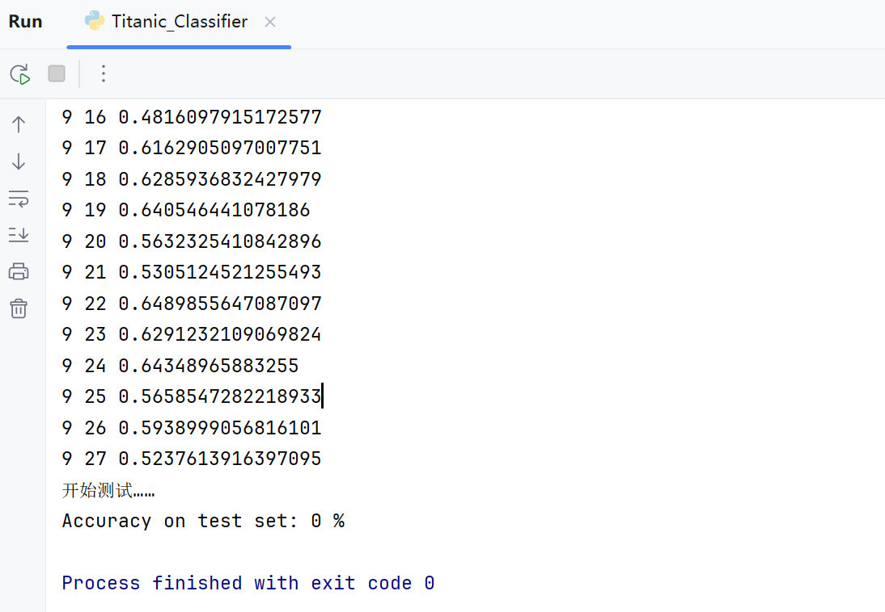

# 如何处理多种数据类型（比如字符串和数值混搭）的数据集

使用Pandas！！！Numpy里的数据类型都是一致的。

使用教程：https://pandas.pydata.org/docs/user_guide/10min.html

# 如何处理数据集中某些样本的某些特征为空值？

## 直接删

如果你的数据集中空值不多，且删除这些行或列不会对整体数据集造成太大影响，可以考虑删除这些行或列。（**首先进行尝试**）

```python
import pandas as pd

# 读取 CSV 文件
df = pd.read_csv('data.csv')

# 删除含有空值的行
df = df.dropna()

# 或者删除含有空值的列
df = df.dropna(axis=1)
```

## 填充空值

填充空值：如果删除空值会导致数据丢失过多，你可以选择用某种值填充空值。常见的填充方法包括：

* **用均值、中位数或众数填充**：适用于数值特征。
* **用特定值填充**：例如，用 0 或 -1 填充。
* **前向填充或后向填充**：用前一个或后一个非空值填充。

**使用Numpy：**

首先，你需要使用 `numpy` 的 `genfromtxt` 或 `loadtxt` 函数来读取 CSV 文件。由于 `numpy` 本身不直接支持处理字符串类型的缺失值，你可以先将缺失值表示为某种特定的标记（如 `"NaN"`），然后再进行处理。

### 均值

### 1. 读取 CSV 文件
首先，你需要使用 `numpy` 的 `genfromtxt` 或 `loadtxt` 函数来读取 CSV 文件。由于 `numpy` 本身不直接支持处理字符串类型的缺失值，你可以先将缺失值表示为某种特定的标记（如 `"NaN"`），然后再进行处理。

```python
import numpy as np

# 读取 CSV 文件，将缺失值表示为 "NaN"
data = np.genfromtxt('data.csv', delimiter=',', dtype=None, encoding='utf-8', missing_values='', filling_values=np.nan)
```

### 2. 检查并处理空值
接下来，你可以使用 `numpy` 的功能来检查和处理这些空值。

#### 2.1 删除含有空值的行或列
如果你希望删除含有空值的行或列，可以使用布尔索引。

```python
# 删除含有空值的行
data = data[~np.isnan(data).any(axis=1)]

# 删除含有空值的列
data = data[:, ~np.isnan(data).any(axis=0)]
```

#### 2.2 用均值、中位数或众数填充
对于数值特征，你可以计算均值、中位数或众数，并用这些值来填充空值。

```python
# 用均值填充数值特征
numeric_columns = [1, 2]  # 假设第1列和第2列是数值特征
for col in numeric_columns:
    mean_value = np.nanmean(data[:, col])
    data[:, col][np.isnan(data[:, col])] = mean_value

# 用中位数填充数值特征
for col in numeric_columns:
    median_value = np.nanmedian(data[:, col])
    data[:, col][np.isnan(data[:, col])] = median_value

# 用众数填充分类特征
categorical_columns = [0]  # 假设第0列是分类特征
for col in categorical_columns:
    mode_value, _ = np.unique(data[:, col][~np.isnan(data[:, col])], return_counts=True)
    mode_value = mode_value[np.argmax(_)]
    data[:, col][np.isnan(data[:, col])] = mode_value
```

`mean_value = np.nanmean(data[:, col])`:

- `data[:, col]`：这表示从 `data` 数组中选择第 `col` 列的所有行。`data` 是一个二维数组，`data[:, col]` 会返回一个一维数组，包含第 `col` 列的所有元素。
- `np.nanmean(...)`：这是 `numpy` 中的一个函数，用于计算数组的均值，但会忽略 NaN 值。`np.nanmean` 的参数是一个数组，它会计算这个数组中所有非 NaN 值的均值。

因此，`mean_value = np.nanmean(data[:, col])` 这行代码的作用是计算第 `col` 列中所有非 NaN 值的均值，并将结果存储在变量 `mean_value` 中。

`data[:, col][np.isnan(data[:, col])] = mean_value`

- `data[:, col]`：同样，这表示从 `data` 数组中选择第 `col` 列的所有行。
- `np.isnan(data[:, col])`：这是一个布尔掩码，它会检查 `data[:, col]` 中的每个元素是否为 NaN。返回的结果是一个布尔数组，其中每个元素对应 `data[:, col]` 中相应位置的元素是否为 NaN。
- `data[:, col][np.isnan(data[:, col])]`：这是一个布尔索引操作，它会选择 `data[:, col]` 中所有为 NaN 的元素。
- `= mean_value`：这行代码将这些选中的 NaN 元素替换为 `mean_value`。

因此，`data[:, col][np.isnan(data[:, col])] = mean_value` 这行代码的作用是将第 `col` 列中所有的 NaN 值替换为该列的均值 `mean_value`。

#### 2.3 用特定值填充

你可以用特定的值来填充空值，例如 0 或 -1。

```python
# 用 0 填充数值特征
for col in numeric_columns:
    data[:, col][np.isnan(data[:, col])] = 0

# 用 "Unknown" 填充分类特征
for col in categorical_columns:
    data[:, col][np.isnan(data[:, col])] = "Unknown"
```

#### 2.4 前向填充或后向填充
前向填充或后向填充可以通过 `numpy` 的 `nan_to_num` 和一些自定义逻辑来实现。

```python
# 前向填充
def forward_fill(arr):
    mask = np.isnan(arr)
    idx = np.where(~mask, np.arange(mask.shape[0]), 0)
    np.maximum.accumulate(idx, out=idx)
    return arr[idx]

# 后向填充
def backward_fill(arr):
    return np.flip(forward_fill(np.flip(arr)))

# 对每一列进行前向填充
for col in range(data.shape[1]):
    if np.issubdtype(data[:, col].dtype, np.number):
        data[:, col] = forward_fill(data[:, col])

# 对每一列进行后向填充
for col in range(data.shape[1]):
    if np.issubdtype(data[:, col].dtype, np.number):
        data[:, col] = backward_fill(data[:, col])
```

### 3. 转换回原始数据类型
在处理完空值后，你可能需要将数据转换回原始的数据类型。

```python
# 将数据转换回原始数据类型
data = data.astype(dtype=None)  # 你可以根据需要指定具体的 dtype
```

### 4. 保存处理后的数据
最后，你可以将处理后的数据保存到一个新的 CSV 文件中。

```python
# 保存处理后的数据
np.savetxt('processed_data.csv', data, delimiter=',', fmt='%s')
```

### 总结
虽然 `numpy` 在处理缺失值方面不如 `pandas` 那么直观和强大，但它仍然提供了足够的工具来完成这项任务。通过上述方法，你可以有效地处理 CSV 文件中的空值。选择哪种方法取决于你的具体需求和数据特性。

# 数据集中的一些信息带有分隔符，造成数据集读取的时候出现问题

在excel打开一个数据集的文件：


这是kaggle上的Titanic数据集，我尝试使用

```python
xy = np.genfromtxt(filepath, delimiter=',', dtype=None, encoding='utf-8', missing_values='', filling_values=np.nan)
```

读取的时候，发现了这样的错误：


说第二行读取的列数不是12，但是你看excel里面明明就是12列，然后我再尝试使用记事本打开：


在这个函数里我们使用的分隔符是','，在这里很有可能将名字里的，当做分隔符处理了。

# 模型训练过程中出现了空值！


这个问题就出在了没有对模型有一个清晰的观察，肉眼观察excel表格呈现的csv文件导致。有些样本的存在一些空值，但是很少，样本数量一多，肉眼就不容易观察出来，因此应该借助计算看一下哪些属性出现了空值

在 `numpy` 中，你可以使用 `np.isnan` 函数来检测数组中的每个元素是否为 `NaN`，然后通过布尔索引或 `np.any` 来确定哪些列包含 `NaN` 值。以下是一些常见的方法：

### 方法 1: 使用 `np.isnan` 和 `np.any`
你可以使用 `np.isnan` 生成一个布尔数组，然后使用 `np.any` 沿着列（`axis=0`）检查每列是否存在 `NaN` 值。

```python
import numpy as np

# 示例数据
data = np.array([
    [1, 2, np.nan],
    [4, np.nan, 6],
    [7, 8, 9]
])

# 检查每一列是否存在 NaN 值
nan_columns = np.any(np.isnan(data), axis=0)

print(f"哪些列存在 NaN 值: {nan_columns}")
```

### 方法 2: 获取包含 `NaN` 值的列索引
如果你希望获取包含 `NaN` 值的列的索引，可以使用 `np.where` 函数。

```python
import numpy as np

# 示例数据
data = np.array([
    [1, 2, np.nan],
    [4, np.nan, 6],
    [7, 8, 9]
])

# 检查每一列是否存在 NaN 值
nan_columns = np.any(np.isnan(data), axis=0)

# 获取包含 NaN 值的列索引
nan_column_indices = np.where(nan_columns)[0]

print(f"包含 NaN 值的列索引: {nan_column_indices}")
```

### 方法 3: 获取包含 `NaN` 值的列名（如果已知列名）
如果你有一个列名列表，并且希望获取包含 `NaN` 值的列名，可以结合上述方法和列名列表。

```python
import numpy as np

# 示例数据
data = np.array([
    [1, 2, np.nan],
    [4, np.nan, 6],
    [7, 8, 9]
])

# 列名列表
column_names = ['col1', 'col2', 'col3']

# 检查每一列是否存在 NaN 值
nan_columns = np.any(np.isnan(data), axis=0)

# 获取包含 NaN 值的列名
nan_column_names = [column_names[i] for i in range(len(column_names)) if nan_columns[i]]

print(f"包含 NaN 值的列名: {nan_column_names}")
```

### 完整示例
假设你有一个二维 `numpy` 数组 `data`，内容如下：

```python
import numpy as np

# 示例数据
data = np.array([
    [1, 2, np.nan],
    [4, np.nan, 6],
    [7, 8, 9]
])

# 检查每一列是否存在 NaN 值
nan_columns = np.any(np.isnan(data), axis=0)

# 获取包含 NaN 值的列索引
nan_column_indices = np.where(nan_columns)[0]

# 列名列表
column_names = ['col1', 'col2', 'col3']

# 获取包含 NaN 值的列名
nan_column_names = [column_names[i] for i in range(len(column_names)) if nan_columns[i]]

print(f"哪些列存在 NaN 值: {nan_columns}")
print(f"包含 NaN 值的列索引: {nan_column_indices}")
print(f"包含 NaN 值的列名: {nan_column_names}")
```

### 输出
```
哪些列存在 NaN 值: [False  True  True]
包含 NaN 值的列索引: [1 2]
包含 NaN 值的列名: ['col2', 'col3']
```

### 总结
- **`np.any(np.isnan(data), axis=0)`**：返回一个布尔数组，表示每一列是否存在 `NaN` 值。
- **`np.where(np.any(np.isnan(data), axis=0))[0]`**：返回包含 `NaN` 值的列索引。
- **结合列名列表**：可以获取包含 `NaN` 值的列名。

通过这些方法，你可以有效地确定 `numpy` 数组中哪些列包含 `NaN` 值，并根据需要采取进一步的处理措施。

# 全连接网络里怎么处理字符串数据？

直接将字符串数据扔进全连接网络里肯定不行！原理上根本说不通！

# 训练错误

## RuntimeError: mat1 and mat2 must have the same dtype, but got Double and Float

> Traceback (most recent call last):
>   File "D:\Learning\Experiments\ML_Study\DeepLearning\08_Dataset_and_DataLoader\Titanic_Classifier.py", line 98, in <module>
>     y_pred = model(inputs)
>   File "D:\Sofeware\anaconda\envs\ML\lib\site-packages\torch\nn\modules\module.py", line 1553, in _wrapped_call_impl
>     return self._call_impl(*args, **kwargs)
>   File "D:\Sofeware\anaconda\envs\ML\lib\site-packages\torch\nn\modules\module.py", line 1562, in _call_impl
>     return forward_call(*args, **kwargs)
>   File "D:\Learning\Experiments\ML_Study\DeepLearning\08_Dataset_and_DataLoader\Titanic_Classifier.py", line 69, in forward
>     x = self.relu(self.l1(x))
>   File "D:\Sofeware\anaconda\envs\ML\lib\site-packages\torch\nn\modules\module.py", line 1553, in _wrapped_call_impl
>     return self._call_impl(*args, **kwargs)
>   File "D:\Sofeware\anaconda\envs\ML\lib\site-packages\torch\nn\modules\module.py", line 1562, in _call_impl
>     return forward_call(*args, **kwargs)
>   File "D:\Sofeware\anaconda\envs\ML\lib\site-packages\torch\nn\modules\linear.py", line 117, in forward
>     return F.linear(input, self.weight, self.bias)
> RuntimeError: mat1 and mat2 must have the same dtype, but got Double and Float

这个错误是由于模型的输入 `inputs` 和模型权重之间的数据类型不一致造成的。你在代码中使用了 NumPy 加载数据，而 NumPy 默认使用 `float64`（Double），但 PyTorch 中的张量在进行模型前向传播时一般使用 `float32`（Float）。因此，输入数据和模型参数的数据类型不匹配，导致了错误。

### 解决方法：

你需要将输入数据的类型转换为 `float32`，这样它和模型的权重数据类型就一致了。

### 修改建议：

在 `TitanicDataset` 类中，读取数据后将 `self.x_data` 和 `self.y_data` 转换为 `float32`。

将 `TitanicDataset` 中的数据加载部分修改如下：

```python
class TitanicDataset(Dataset):
    def __init__(self, filepath):
        xy = pd.read_csv(filepath)
        xy = Pre_dataprocess1(xy)

        self.len = xy.shape[0]
        # 将 x_data 转换为 float32 类型
        self.x_data = torch.from_numpy(np.hstack((xy[:, :1], xy[:, 2:]))).float()
        # 将 y_data 转换为 float32 类型
        self.y_data = torch.from_numpy(xy[:, [1]]).float()

    def __getitem__(self, index):
        return self.x_data[index], self.y_data[index]

    def __len__(self):
        return self.len

```

## RuntimeError: mat1 and mat2 shapes cannot be multiplied (32x6 and 7x5)

训练模型的最后阶段出现了这样的错误：

> Traceback (most recent call last):
>   File "D:\Learning\Experiments\ML_Study\DeepLearning\08_Dataset_and_DataLoader\Titanic_Classifier.py", line 116, in <module>
>     outputs = model(inputs)
>   File "D:\Sofeware\anaconda\envs\ML\lib\site-packages\torch\nn\modules\module.py", line 1553, in _wrapped_call_impl
>     return self._call_impl(*args, **kwargs)
>   File "D:\Sofeware\anaconda\envs\ML\lib\site-packages\torch\nn\modules\module.py", line 1562, in _call_impl
>     return forward_call(*args, **kwargs)
>   File "D:\Learning\Experiments\ML_Study\DeepLearning\08_Dataset_and_DataLoader\Titanic_Classifier.py", line 69, in forward
>     x = self.relu(self.l1(x))
>   File "D:\Sofeware\anaconda\envs\ML\lib\site-packages\torch\nn\modules\module.py", line 1553, in _wrapped_call_impl
>     return self._call_impl(*args, **kwargs)
>   File "D:\Sofeware\anaconda\envs\ML\lib\site-packages\torch\nn\modules\module.py", line 1562, in _call_impl
>     return forward_call(*args, **kwargs)
>   File "D:\Sofeware\anaconda\envs\ML\lib\site-packages\torch\nn\modules\linear.py", line 117, in forward
>     return F.linear(input, self.weight, self.bias)
> RuntimeError: mat1 and mat2 shapes cannot be multiplied (32x6 and 7x5)

原因是测试集读取出来的特征只有6个，不符合模型的7个

## 最后处理测试集为0%




发现损失一直降不下来，维持在大概0.65左右的样子，数据集是一个很干净的数据集。

> 2024年10月15日

判断是模型泛化能力较差，需要继续学习RNN后继续完善

只用了全连接层相当于铠甲勇士打异能兽，只召唤出来头盔，没召唤出来铠甲。
